                                (function() {
                                    const theme = document.cookie.split('; ').find(row => row.startsWith('docsColorTheme='));
                                    if (theme) {
                                        document.body.className = theme.split('=')[1] + "Theme";
                                    }
                                })();
                                <iframe src="https://www.googletagmanager.com/ns.html?id=GTM-PSL84DJ" height="0" width="0" style="display:none;visibility:hidden"></iframe># Release notes发行说明

- AI Platform (AIP)人工智能平台（AIP）
- Data connectivity & integration数据连接与集成
- Model connectivity & development模型连通性与发展
- Ontology building本体构建
- Developer toolchain开发者工具链
- Use case development用例开发
- Analytics分析学
- Product delivery产品交付
- Security & governance安全与治理
- Management & enablement管理与赋能

## February 24, 20262026年2月24日

### Enhancements增强功能

- [Ontology / Workflow Lineage](/docs/foundry/workflow-lineage/)Workflow Lineage now includes a trash icon in its toolbar that enables you to remove trashed resources from your graph and exclude them from node connections. This allows you to focus on active resources and simplifies navigation, especially when working with complex workflows containing many nodes. You can add the trashed resources back to your graph by selecting the trash icon again.

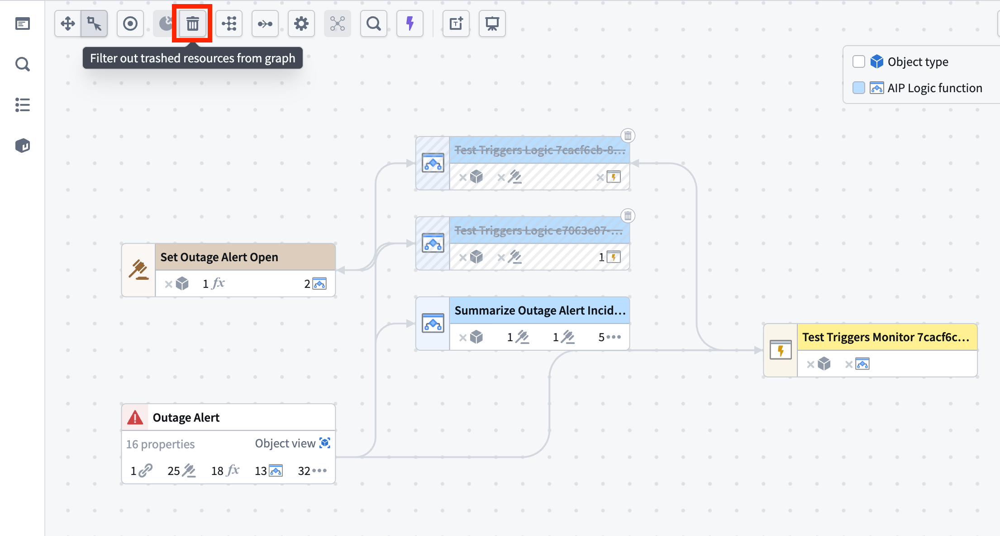

## February 23, 20262026年2月23日

### Enhancements增强功能

- [Ontology / Machinery](/docs/foundry/process-mining/)You can now open Machinery processes in Workflow Lineage directly from the Machinery application. Access this functionality through the new **Open in Workflow Lineage** option in the **File** menu dropdown, or by using the keyboard shortcut `ctrl + i` (Windows) or `cmd + i` (macOS).
- [Ontology / Ontology Management](/docs/foundry/ontology-manager/)Ontology Manager now supports creating materializations for object types. This feature allows you to define how object data should be materialized. Currently, this functionality is limited to materializations on the main branch only.
- [Ontology / Ontology Management](/docs/foundry/ontology-manager/)Ontology Manager now displays which link type constraints are inherited when working with interfaces that extend other interfaces. This information is visible both on the **Extensions** tab and when previewing a new extension, making it easier to understand inheritance relationships between interfaces.
- [Ontology / Workflow Lineage](/docs/foundry/workflow-lineage/)You can now search for Gaia maps directly in the left search panel of Workflow Lineage. Previously, Gaia map nodes could only be accessed by expanding from existing nodes on the graph. This enhancement makes it easier to find and incorporate Gaia maps into your workflow visualizations.

**Note:** To search for Gaia maps in Workflow Lineage, your enrollment must use both Foundry and Gotham.

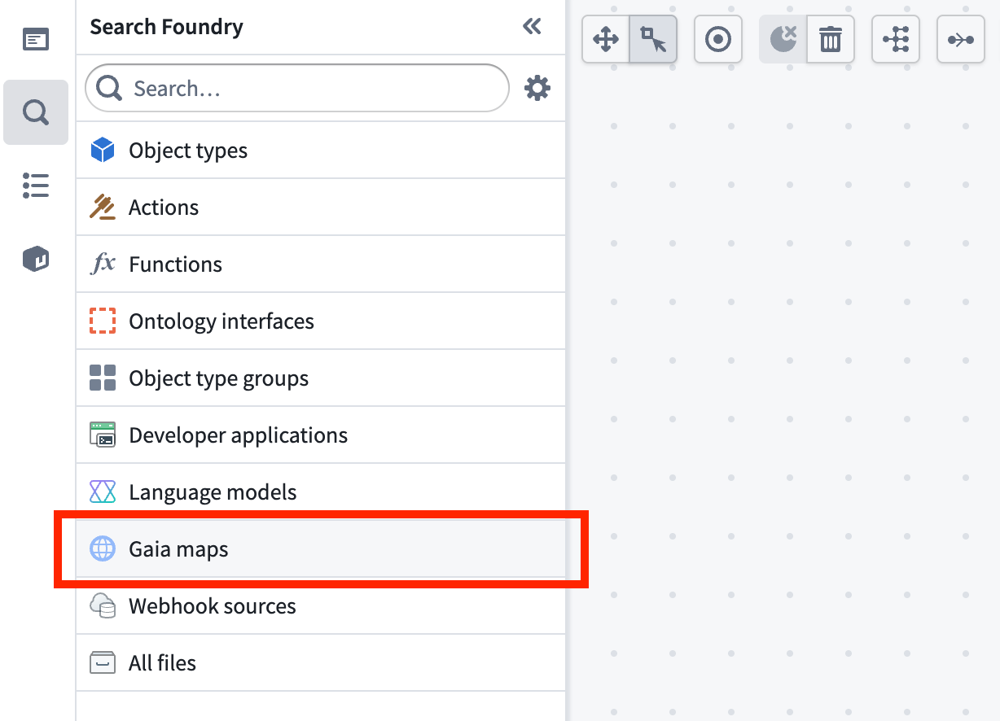
- [Ontology / Workflow Lineage](/docs/foundry/workflow-lineage/)Workflow Lineage now provides more comprehensive information in the interface details panel. When viewing an interface, you can now see its properties, the object types that implement it, and the interfaces it extends from. This additional context makes it easier to understand interface relationships and structure within your ontology.

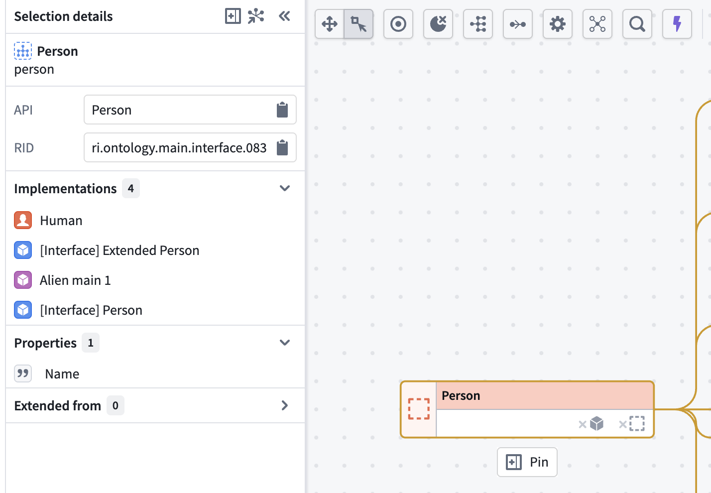

## February 19, 20262026年2月19日

### Features特征

- [Ontology / Object Views](/docs/foundry/object-views/)Foundry now automatically creates a core [Object View](/docs/foundry/object-views/overview/) for a new object type to provide a standardized representation of all its objects, ensuring other users have a holistic understanding of its schema and links without requiring additional configuration. Core Object Views provide a consistent, complete display of object data after object type creation, and they are now generally available across Foundry enrollments. [Learn more about core Object Views](/docs/foundry/object-views/core-object-views/).

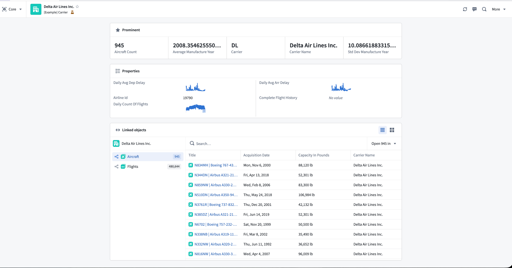

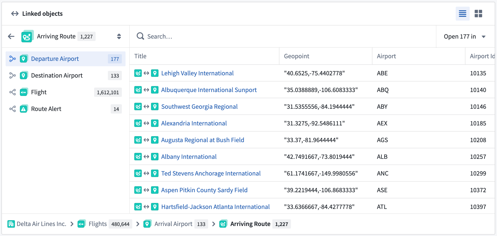

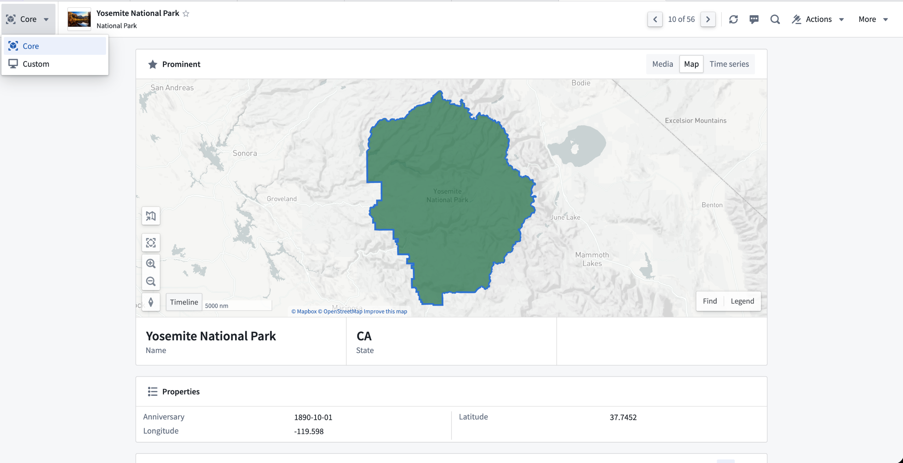

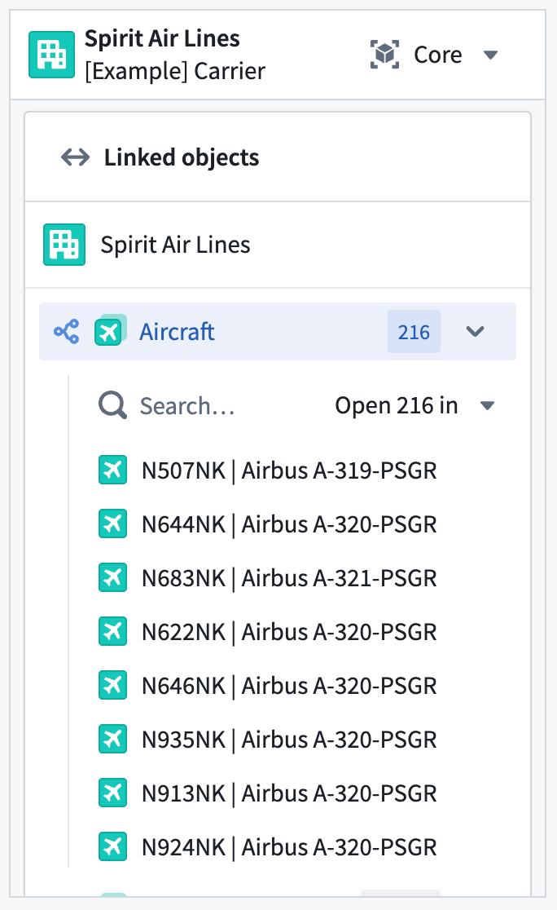
- [Ontology / Workflow Lineage](/docs/foundry/workflow-lineage/)You can now view execution and p95 metrics for your Logic functions directly in Workflow Lineage in the bottom **Function metrics** panel.

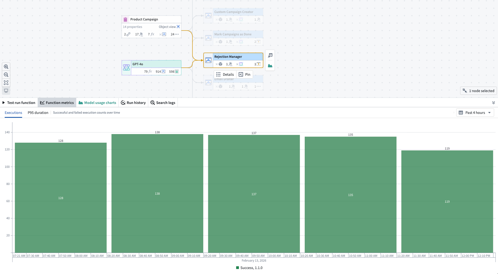

## February 18, 20262026年2月18日

### Enhancements增强功能

- [Ontology / Workflow Lineage](/docs/foundry/workflow-lineage/)Workflow Lineage now displays ontology binding information in the details sidebar when you select a function. This makes it easier to identify which ontology a function is associated with, providing better context when working with functions across multiple ontologies.

## February 12, 20262026年2月12日

### Features特征

- Ontology / IndexingDataset materializations are now supported for object types with row-level policies on organizations. This applies for restricted views and object security policies that reference a mandatory control property with a set of allowed organizations.

## February 11, 20262026年2月11日

### Features特征

- [Ontology / Workflow Lineage](/docs/foundry/workflow-lineage/)Workflow Lineage now supports geospatial map nodes in workflow visualizations. You can access these nodes through new connection buttons from other nodes, such as object types. This allows you to incorporate geospatial data into your ontology visualizations and better understand relationships between geospatial resources and other ontological elements.

### Enhancements增强功能

- [Ontology / Automate](/docs/foundry/automate/)You can now open Workflow Lineage from an automation through an action button on the overview page or by using the `cmd+i` (macOS) or `ctrl+i` (Windows) keyboard shortcut.
- [Ontology / Workflow Lineage](/docs/foundry/workflow-lineage/)Workflow Lineage now automatically displays upstream and downstream nodes when opening a single item. Previously, when opening an Object Type, Action Type, Function, or Logic Function from Ontology Manager, only the selected node would appear in the graph. With this improvement, related nodes are immediately visible, providing better context and reducing the need for manual exploration.

## February 10, 20262026年2月10日

### Features特征

- [Ontology / Workflow Lineage](/docs/foundry/workflow-lineage/)Presentation mode is now available in Workflow Lineage for all enrollments. Use the presentation mode for Workflow Lineage to create and organize visual frames of your workflow graph, making it easier to present your work. To get started, select the project screen icon in the bottom of the graph.

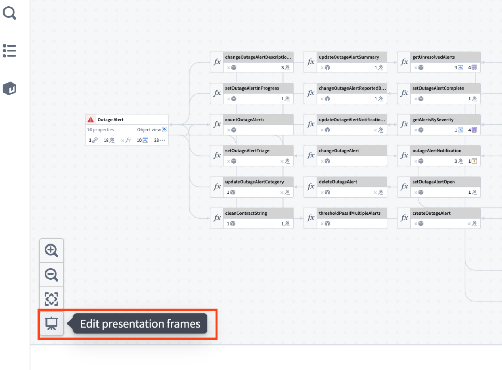

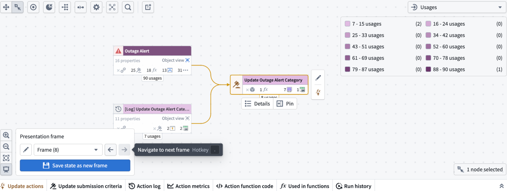

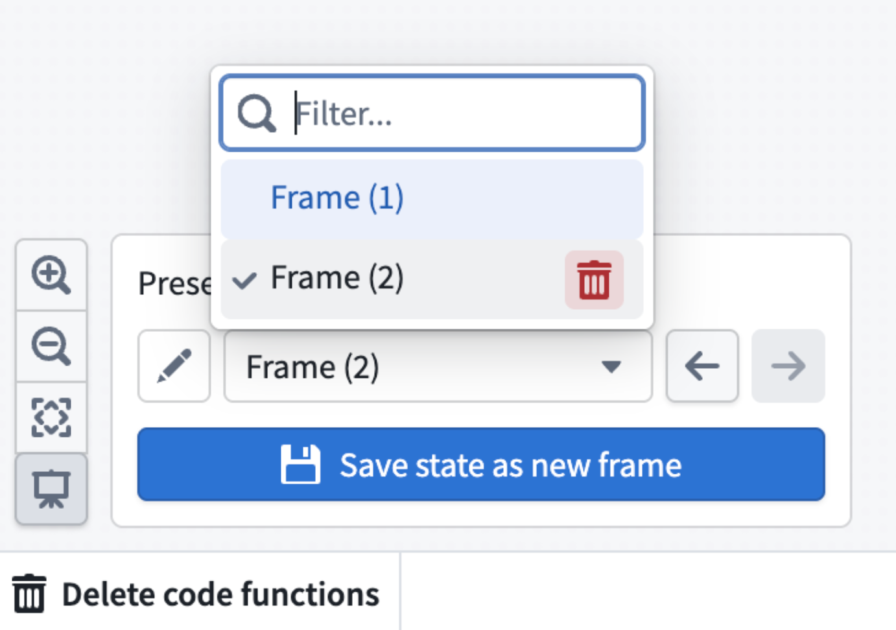

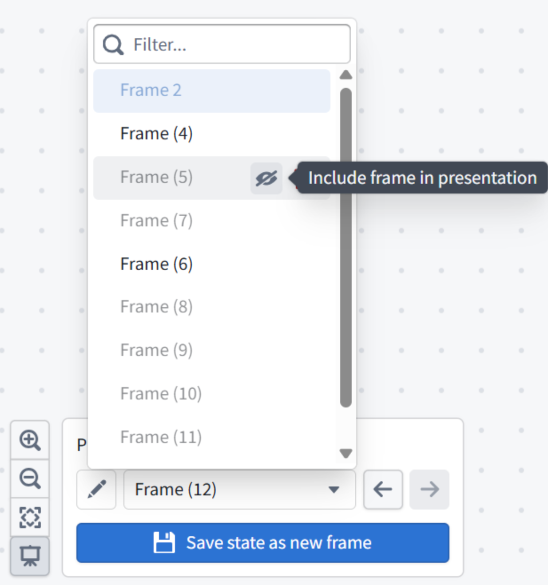

### Enhancements增强功能

- [Ontology / Workflow Lineage](/docs/foundry/workflow-lineage/)Workflow Lineage now allows you to adjust node widths for each workflow graph individually. This enhancement makes it easier to read and work with nodes that have longer names by providing better visualization of their complete labels.

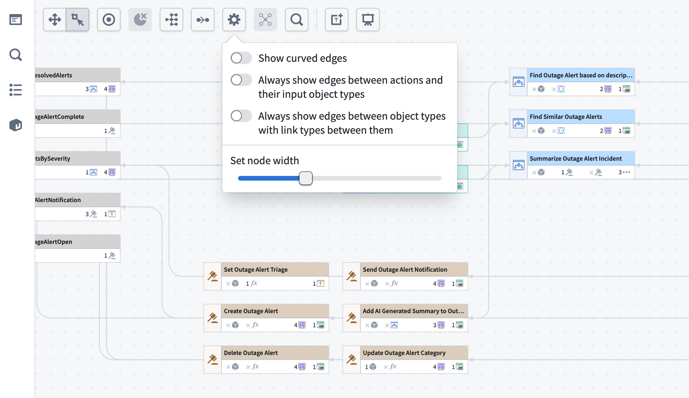

## February 9, 20262026年2月9日

### Features特征

- [Ontology / Automate](/docs/foundry/automate/)Users can now evaluate time series conditions at low latency using streaming data.  Review the [streaming alerting](/docs/foundry/time-series/alerting-overview/#streaming-alerting) documentation for more information.

### Enhancements增强功能

- [Ontology / Workflow Lineage](/docs/foundry/workflow-lineage/)Workflow Lineage now displays function upgrade panels in the bottom bar even when no nodes are selected in your graph. Previously, you needed to select nodes to see bottom panels. With this improvement, function upgrade, model usage and submission criteria upgrade panels  appear automatically, making it easier to identify and apply available upgrades across your workflow.

## February 4, 20262026年2月4日

### Enhancements增强功能

- [Ontology / Workflow Lineage](/docs/foundry/workflow-lineage/)Workflow Lineage now distinguishes between link types that will be affected by permission changes and those that will not when using the permissions editing dialog. When editing object type permissions, the dialog separates link types into those that will have their permissions updated (based on your edit permissions) and those that will remain unaffected. This makes it clearer which ontological resources will have their permissions changed when using the bulk role updater.
- [Ontology / Workflow Lineage](/docs/foundry/workflow-lineage/)Workflow Lineage now allows you to hide individual frames in presentation mode without deleting them. Hidden frames can be restored later when needed, giving you more flexibility in how you organize and present your workflow visualizations. Navigation buttons automatically disable when all frames in a particular direction are hidden, providing clear visual feedback about available navigation options.
- [Ontology / Workflow Lineage](/docs/foundry/workflow-lineage/)Workflow Lineage now provides a more comprehensive visualization when opening interfaces from Ontology Manager. Instead of displaying object types that implement the interface in a simple grid layout, the system now creates a full dynamic layout showing richer relationships. This enhanced view includes interfaces the chosen interface extends, interfaces that extend it, and object types and interfaces referenced in link type constraints, giving you a more complete picture of your interface relationships.

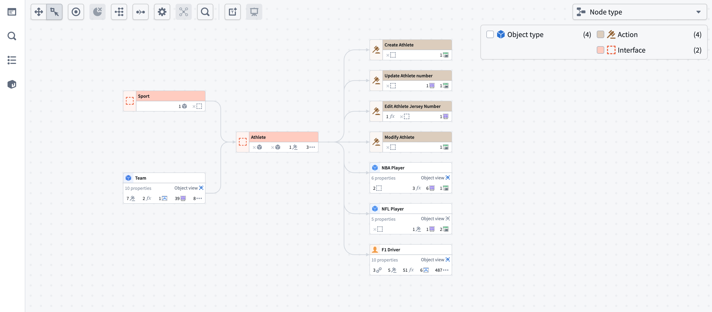

### Fixes修复

- [Ontology / Workflow Lineage](/docs/foundry/workflow-lineage/)Workflow Lineage now correctly preserves your latest auto-saved changes when resolving auto-save conflicts. Previously, choosing to abandon changes during an auto-save conflict would revert to the last manually saved state, potentially losing significant work. Now, the system reloads to the most recent auto-saved version, ensuring your latest changes are retained.

## February 3, 20262026年2月3日

### Features特征

- [Ontology / Workflow Lineage](/docs/foundry/workflow-lineage/)Workflow Lineage just became a lot more robust - you can now visualize resources across multiple ontologies in one unified graph. Instantly identify cross-ontology relationships, spot external resources at a glance, and switch between ontologies without leaving your workflow view.

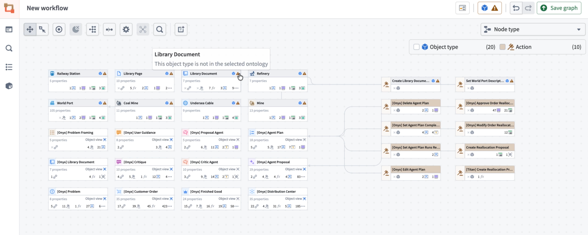

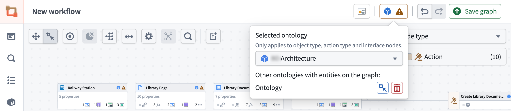

## January 29, 20262026年1月29日

### Features特征

- [Ontology / Workflow Lineage](/docs/foundry/workflow-lineage/)Workflow Lineage now includes a **Function metrics** tab that provides performance insights for your workflow functions and actions. The **P95 duration** sub-tab displays execution duration at the 95th percentile with intuitive graphs, allowing you to instantly spot performance spikes and proactively address potential issues. The **Executions** sub-tab shows the number of successful and failed executions for functions and actions, helping you identify reliability trends and troubleshoot issues more efficiently. These new metrics provide powerful insights, making it easier to monitor and optimize workflow functions.

本体论 / 工作流程 Lineage 现在包含一个功能指标标签页，提供工作流功能和动作的性能洞察。P95 持续时间子标签页将执行时长显示在第 95 百分位，并配有直观的图表，让你能够即时发现性能峰值，并主动解决潜在问题。执行子标签页显示功能和动作的成功和失败执行次数，帮助你识别可靠性趋势并更高效地排查问题。这些新指标提供了强大的洞察，使得监控和优化工作流程功能变得更容易。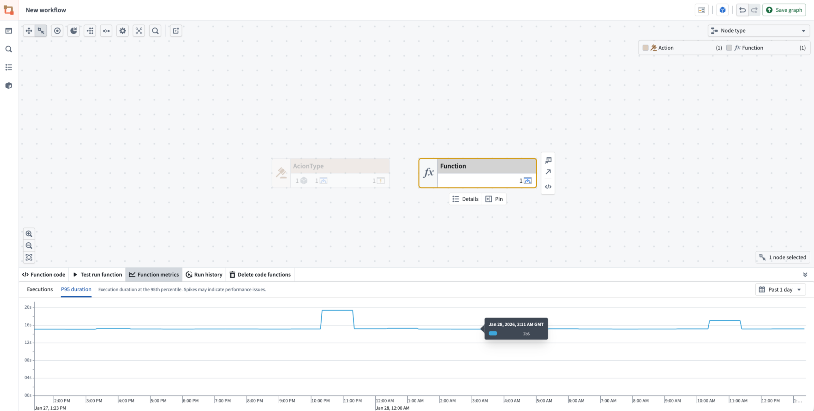
- [Ontology / Workflow Lineage](/docs/foundry/workflow-lineage/)You can now [filter run history](/docs/aip-observability/run-history/#filter-run-history) in Workflow Lineage to quickly find specific executions of functions, actions, automations, and logic. The **Run history** tab provides a complete view of all executions over the past seven days, and filtering by multiple criteria makes it faster to debug issues or audit workflows in high-volume environments.

本体论 / 工作流程谱系 你现在可以在工作流谱系中筛选运行历史，快速查找具体的函数、动作、自动化和逻辑执行。运行历史标签提供过去七天内所有执行的完整视图，并通过多重筛选方式加快了在高流量环境中调试问题或审计工作流程的速度。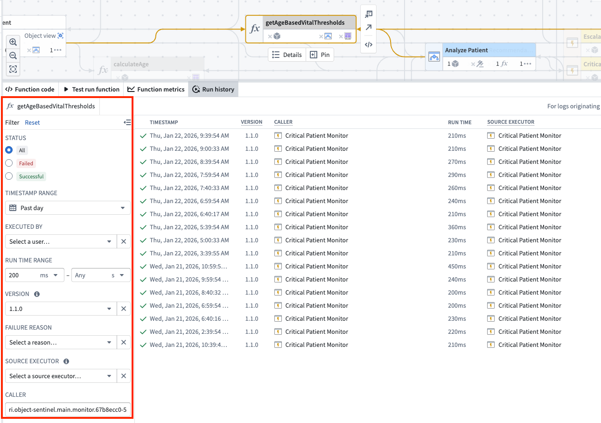

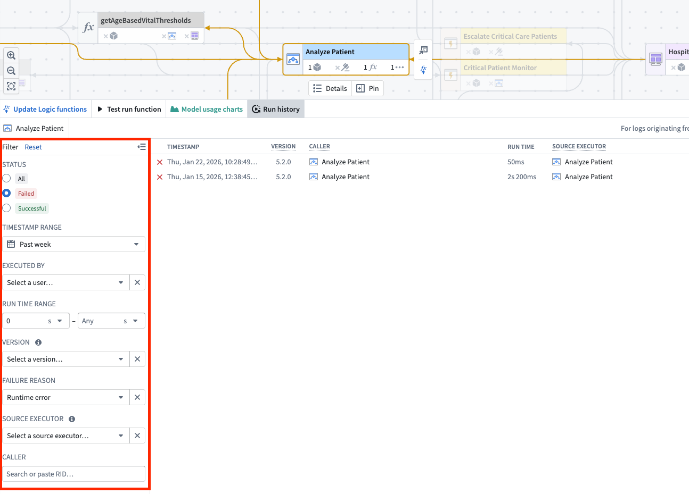

## January 27, 20262026年1月27日

### Features特征

- [Ontology / Workflow Lineage](/docs/foundry/workflow-lineage/)Users can now view quiver dashboards as nodes in Workflow Lineage graphs. Quiver dashboard nodes function the same as other resource nodes, and have connections to the object types they use and the workshop modules they appear in. Different color modes can be used to view usage metrics, resource permissions, last modified dates, and more.

本体论 / 工作流程血脉用户现在可以在工作流血脉图中将箭袋仪表盘作为节点查看。Quiver 仪表盘节点的功能与其他资源节点相同，并且与它们使用的对象类型和出现的研讨会模块有连接。可以使用不同的颜色模式来查看使用指标、资源权限、最后修改日期等。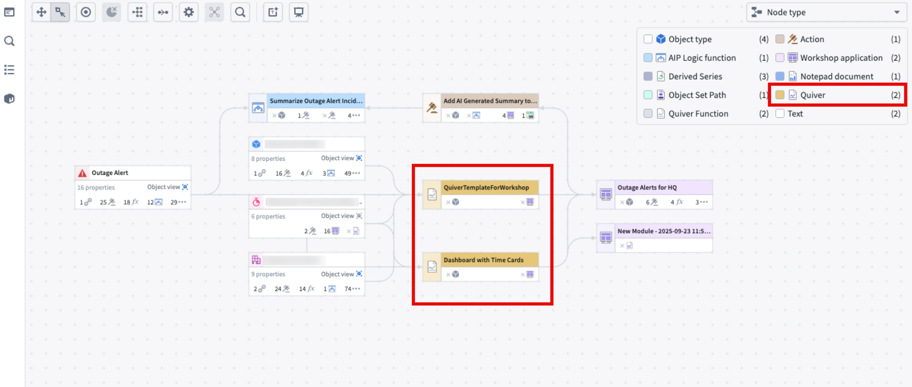

## January 26, 20262026年1月26日

### Features特征

- [Ontology / Workflow Lineage](/docs/foundry/workflow-lineage/)Workflow Lineage now includes a new Action Rule color mode that visually distinguishes between different types of actions in your workflow. This color-coding system instantly shows whether an action runs a function, creates, modifies, or deletes an object. When used alongside the Action Rule histogram, you can quickly get a comprehensive overview of rule actions across your entire graph and filter actions within your current selection, making it easier to understand and manage complex workflows.

本体论 / 工作流程 Lineage 现在新增了一种新的动作规则颜色模式，可以直观区分工作流程中不同类型的动作。这种颜色编码系统能即时显示动作是否运行函数、创建、修改或删除对象。当与动作规则直方图配合使用时，你可以快速全面了解整个图表中的规则动作，并在当前选择中筛选动作，从而更容易理解和管理复杂的工作流程。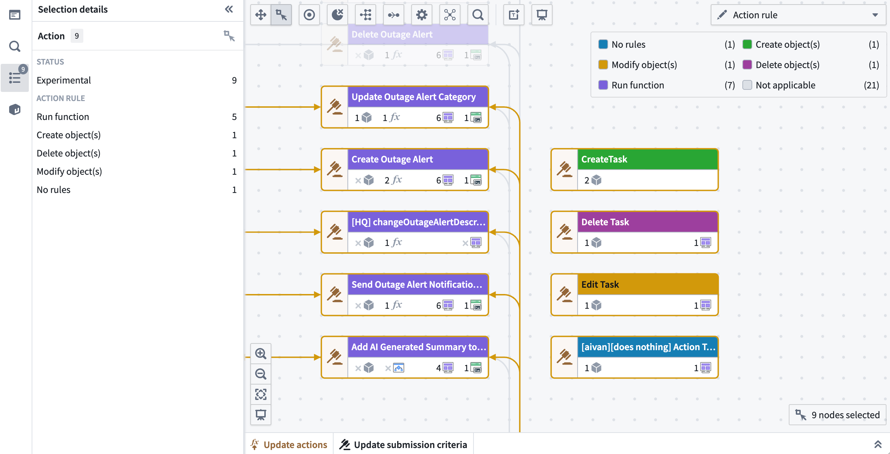

### Enhancements增强功能

- [Ontology / Actions](/docs/foundry/action-types/)Near real-time metrics for functions and actions are now retained for 30 days instead of 7 days. This extended retention period allows you to observe longer-term performance trends and conduct more comprehensive analysis of your functions and actions over time.

本体论 / 动作 函数和动作的近实时指标现在保留30天，而非7天。这段延长的保留期让你能够观察更长期的绩效趋势，并对职能和行动进行更全面的分析。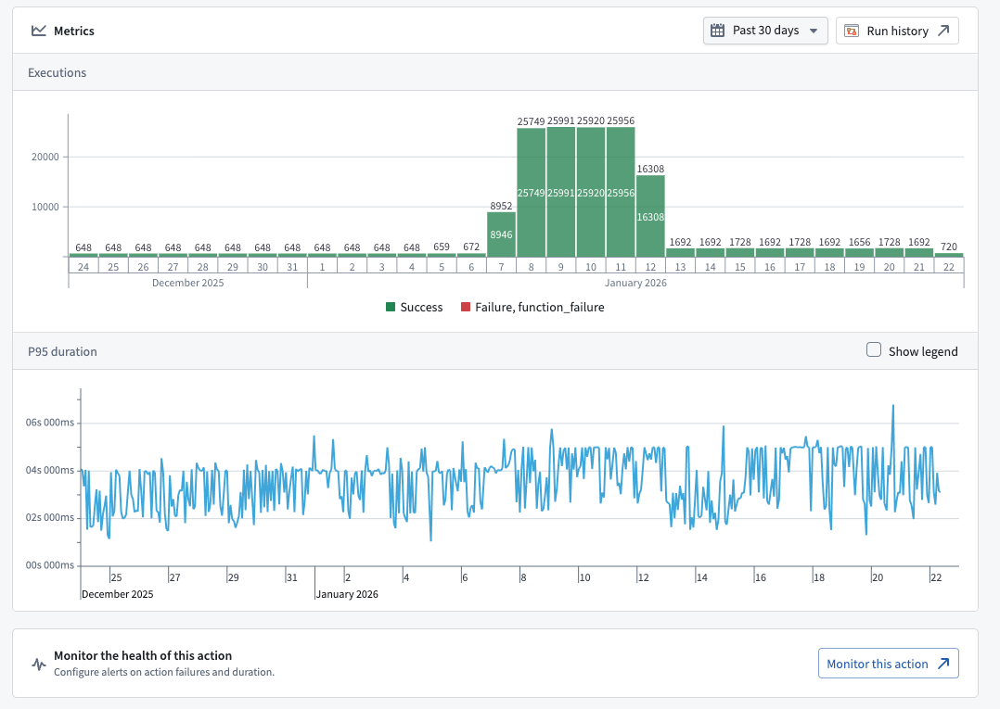

## January 22, 20262026年1月22日

### Features特征

- [Ontology / Ontology Management](/docs/foundry/ontology-manager/)Managing data access and compliance for media sets often requires precise control over how markings are inherited and applied across your ontology. Configurable markings for media reference properties in Ontology Manager are now available on all Foundry enrollments. This capability allows you to define which markings are inherited per media source when configuring media reference properties.

本体论 / 本体管理管理媒体集的数据访问和合规性通常需要精确控制标记如何在本体中继承和应用。Ontology Manager 中媒体引用属性的可配置标记现已适用于所有 Foundry 注册。此功能允许您在配置媒体参考属性时，定义每个媒体源继承的标记。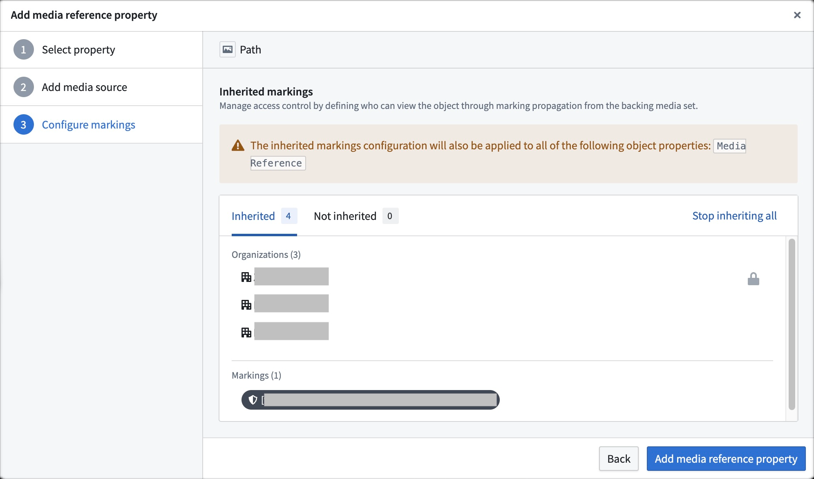

### Enhancements增强功能

- [Ontology / Automate](/docs/foundry/automate/)The Automate documentation has been restructured to improve discoverability. Updates include explanations of new features with current interface screenshots, expanded guidance for project and global scope modes, clarified limitations for automation dependencies, and a new workflow for backfilling large object sets using function-backed batches. Access the [full documentation](/docs/foundry/automate/overview/).

本体论  /  自动化自动化文档已被重组以提升可发现性。更新内容包括新功能解释及当前界面截图、扩展的项目和全局范围模式指南、澄清自动化依赖的限制，以及使用函数支持批处理大型对象集回填的新工作流程。 访问完整文档 。

## January 18, 20262026年1月18日

### Features特征

- [Ontology / Object Views](/docs/foundry/object-views/)Object Views now work with Foundry Branching, allowing you to add, modify, and remove object views and their associated workshops directly on branches. You can rebase object views from the main branch, deploy changes to object views, and use modified object views from a branch within applications such as Workshop.

本体论  /  对象视图对象视图现在支持 Foundry Branching，允许你直接在分支上添加、修改和移除对象视图及其相关的工作坊。你可以从主分支重基对象视图，部署对象视图的更改，并在应用如 Workshop 内使用分支修改过的对象视图。
- [Ontology / Ontology Management](/docs/foundry/ontology-manager/)Ontology Manager now includes an Observability tab for object types and link types. This tab displays existing monitor rules applied to the resource or prompts you to set up monitor rules if none exist, making it easier to track and manage monitoring for your ontology resources.

本体 / 本体管理本体管理器现在包含了对象类型和链接类型的可观察性标签。该标签页显示已应用到资源的监控规则，或者如果没有监控规则，提示你设置监控规则，方便跟踪和管理本体资源的监控。

## January 14, 20262026年1月14日

### Enhancements增强功能

- [Ontology / Workflow Lineage](/docs/foundry/workflow-lineage/)When selecting multiple nodes in Workflow Lineage, you can now filter by rule type in the details panel. The histogram view includes a new category that groups nodes based on their action rules (create object, run function, etc.), making it easier to identify and select specific types of actions in complex workflows.

本体论  /  工作流程血脉在工作流血脉中选择多个节点时，你可以在详情面板中按规则类型进行筛选。直方图视图新增了一个类别，根据节点的动作规则（创建对象、运行函数等）分组，便于在复杂工作流程中识别和选择特定类型的动作。

## January 12, 20262026年1月12日

### Features特征

- [Ontology / Ontology Management](/docs/foundry/ontology-manager/)Ontology Manager now allows you to copy and paste parameter override configurations between parameters in action forms. You can copy overrides from one parameter and paste them to another parameter in the same or different action form. When pasting, known parameter IDs are automatically filled, while unknown parameter IDs prompt you to either map them to available parameters or discard those criteria.

本体 / 本体管理现在允许你在动作表单中复制粘贴参数覆盖配置。你可以从一个参数复制覆盖，然后粘贴到另一个参数上，使用相同或不同的动作表态。粘贴时，已知参数 ID 会自动填充，而未知参数 ID 则提示你将其映射到可用参数或丢弃这些条件。

### Enhancements增强功能

- [Ontology / Ontology Management](/docs/foundry/ontology-manager/)Ontology Manager now allows you to set up and inspect monitoring rules directly for functions and actions. You can view active monitoring rule status and history for these resources, providing better visibility into their performance and reliability.

本体/本体管理 Ontology Manager 现在允许您直接设置和检查功能和动作的监控规则。您可以查看这些资源的活跃监控规则状态和历史，从而更好地了解其性能和可靠性。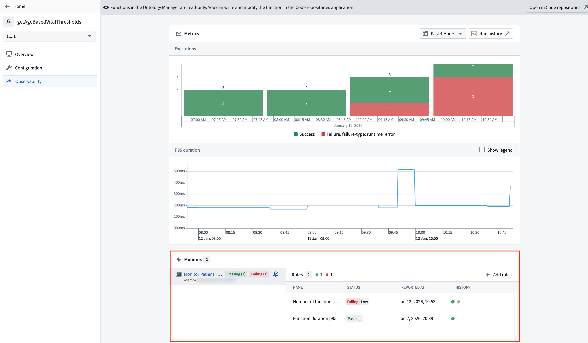

You're all caught up 🎉你都跟🎉上了

© 2026 Palantir Technologies Inc. All rights reserved.

[Cookies Statement ↗](https://www.palantir.com/cookie-statement/)[Privacy Statement ↗](https://www.palantir.com/privacy-and-security/)Do Not Sell or Share My Personal Information{"props":{"pageProps":{"altLink":{"type":"dropdownNavLink","id":"api","link":{"type":"urlLink","text":"API Reference ↗","url":"/foundry/api-reference/"},"rightAligned":true},"categoryBuckets":[{"category":{"id":"aip","title":"AI Platform (AIP)"}},{"category":{"id":"data-integration","title":"Data connectivity \u0026 integration"}},{"category":{"id":"model-integration","title":"Model connectivity \u0026 development"}},{"category":{"id":"ontology","title":"Ontology building"}},{"category":{"id":"dev-toolchain","title":"Developer toolchain"}},{"category":{"id":"app-building","title":"Use case development"}},{"category":{"id":"analytics","title":"Analytics"}},{"category":{"id":"devops","title":"Product delivery"}},{"category":{"id":"security","title":"Security \u0026 governance"}},{"category":{"id":"administration","title":"Management \u0026 enablement"}}],"formAssemblyData":{},"fullSearchText":{"searchResultsForText":"Search results for","resultsText":"results"},"isPreview":false,"metadata":{"type":"raw","data":{"pageTitle":"Documentation | Foundry","seoDescription":"Learn how Foundry can help you leverage your data to solve real-world problems with documentation on workflows, applications, APIs and more.","slug":"/foundry/announcements/release-notes/","noIndex":false,"socialImageUrl":"https://palantir.com/docs/resources/homepage/iso-grid.png","socialImageAlt":"Documentation | Palantir","socialDescription":"Learn how Foundry can help you leverage your data to solve real-world problems with documentation on workflows, applications, APIs and more.","socialTitle":"Palantir","twitterHandle":"palantirtech"}},"navBarProps":{"items":[{"type":"pageGroup","title":"Capabilities","pages":[{"type":"dropdownNavLink","id":"aip","link":{"type":"urlLink","text":"AI Platform (AIP)","url":"/foundry/aip/overview/","openInNewTab":false}},{"type":"dropdownNavLink","id":"data-integration","link":{"type":"urlLink","text":"Data connectivity \u0026 integration","url":"/foundry/data-integration/overview/","openInNewTab":false}},{"type":"dropdownNavLink","id":"model-integration","link":{"type":"urlLink","text":"Model connectivity \u0026 development","url":"/foundry/model-integration/overview/","openInNewTab":false}},{"type":"dropdownNavLink","id":"ontology","link":{"type":"urlLink","text":"Ontology building","url":"/foundry/ontology/overview/","openInNewTab":false}},{"type":"dropdownNavLink","id":"dev-toolchain","link":{"type":"urlLink","text":"Developer toolchain","url":"/foundry/dev-toolchain/overview/","openInNewTab":false}},{"type":"dropdownNavLink","id":"app-building","link":{"type":"urlLink","text":"Use case development","url":"/foundry/app-building/overview/","openInNewTab":false}},{"type":"dropdownNavLink","id":"analytics","link":{"type":"urlLink","text":"Analytics","url":"/foundry/analytics/overview/","openInNewTab":false}},{"type":"dropdownNavLink","id":"devops","link":{"type":"urlLink","text":"Product delivery","url":"/foundry/devops/overview/","openInNewTab":false}},{"type":"dropdownNavLink","id":"security","link":{"type":"urlLink","text":"Security \u0026 governance","url":"/foundry/security/overview/","openInNewTab":false}},{"type":"dropdownNavLink","id":"administration","link":{"type":"urlLink","text":"Management \u0026 enablement","url":"/foundry/administration/overview/","openInNewTab":false}}],"dropdownFixedWidth":false},{"type":"dropdownNavLink","id":"getting-started","link":{"type":"urlLink","text":"Getting started","url":"/foundry/getting-started/overview/","openInNewTab":false}},{"type":"dropdownNavLink","id":"architecture-center","link":{"type":"urlLink","text":"Architecture center","url":"/foundry/architecture-center/overview/","openInNewTab":false}},{"type":"pageGroup","pages":[{"type":"dropdownNavLink","id":"announcements","link":{"type":"urlLink","url":"/foundry/announcements/","text":"Announcements"}},{"type":"dropdownNavLink","id":"release-notes","link":{"type":"urlLink","url":"/foundry/announcements/release-notes/","text":"Release notes"}}],"title":"Platform updates"}]},"navBarText":{"quickSearch":{"recentSearchesText":"Recent searches","searchPlaceholder":"Search documentation","searchAllText":"Search all documentation","quickSearchFooterText":{"navigateText":"NAVIGATE","viewResultText":"VIEW RESULT","closeSearchText":"CLOSE SEARCH","viewInNewTabText":"VIEW IN NEW TAB"}},"topRightNavText":"API Reference ↗"},"productId":"foundry","context":"announcements","releases":[{"id":"8a51589f-89bc-4b5b-8704-d4cc17737696","releaseNotes":[{"id":"5d27940b-5421-41e0-8701-f902b285ba80","type":"FEATURE","description":"Gemini 3.1 Pro model is now available from VertexAI on commercial, non-georestricted enrollments. ","categoryTitle":"AIP","categoryId":"platform-overview","applicationId":"","applicationTitle":"Language Model Service","date":"February 24, 2026","title":"Gemini 3.1 Pro now available via VertexAI","prominence":"Announce","releaseVersion":"","productId":"Foundry","frontendApplicationId":"control-panel-app","mediaFilenames":[],"longDescription":"## Gemini 3.1 Pro now available via VertexAI\n\nGemini 3.1 Pro model is now available from VertexAI on commercial, non-georestricted enrollments. \n\n### Model overview\n\n[Gemini 3.1 Pro ↗ is ](https://deepmind.google/models/gemini/pro/)Google’s newest and most advanced model for complex tasks.  It is particularly well-suited for applications that require agentic performance, advanced coding, long context and/or multimodal understanding, and/or algorithmic development.\n\n* **Context window:** 1,000,000 tokens\n* **Knowledge cutoff:** January 2025\n* **Modalities:** Text, image\n* **Capabilities:** Function calling, structured output\n\n_Note that Gemini 3.1 Pro is still in preview status from Google Cloud Platform. Within AIP, Gemini 3.1 Pro has all of the characteristics and behavior of a generally-available AIP model._\n\n### Getting started\n\nTo use these models:\n\n* [Confirm that your enrollment administrator has enabled the relevant model family.](../aip/enable-aip-features.md#enable-llms)\n* Review [token costs and pricing](../aip/aip-compute-usage.md#tokens-in-aip).\n* See the complete [list of all models available in AIP](../aip/supported-llms.md).\n\n### Your feedback matters\n\nWe want to hear about your experiences using language models in the Palantir platform and welcome your feedback. Share your thoughts with Palantir Support channels or on our [Developer Community ↗](https://community.palantir.com/) using the [`language-model-service` tag ↗](https://community.palantir.com/tag/language-model-service).","applications":[{"productId":"Foundry","categoryId":"platform-overview","categoryTitle":"AIP","applicationTitle":"Language Model Service","frontendApplicationId":"control-panel-app","isKeyComponent":true}],"application":{"id":"","title":"Language Model Service"},"category":{"id":"platform-overview","title":"AIP"},"product":{"id":"Foundry"}},{"id":"cace456c-cb02-43d4-a6f9-24f341e8378b","type":"FEATURE","description":"Claude Sonnet 4.6 is now available from Anthropic, AWS Bedrock, and Google Vertex on non-georestricted enrollments. For US and EU georestricted enrollments, this model is available from AWS Bedrock and Google Vertex.","categoryTitle":"AIP","categoryId":"platform-overview","applicationId":"","applicationTitle":"Language Model Service","date":"February 24, 2026","title":"Claude Sonnet 4.6 now available from Anthropic, AWS Bedrock, and Google Vertex","prominence":"Announce","releaseVersion":"","productId":"Foundry","frontendApplicationId":"control-panel-app","mediaFilenames":[],"longDescription":"## Claude Sonnet 4.6 now available from Anthropic, AWS Bedrock, and Google Vertex\n\nClaude Sonnet 4.6 is now available from Anthropic, AWS Bedrock, and Google Vertex on non-georestricted enrollments. For US and EU georestricted enrollments, this model is available from AWS Bedrock and Google Vertex.\n\n### Model overview\n\nAnthropic's newest model, Claude Sonnet 4.6, delivers significant improvements over Sonnet 4.5 across coding, agentic workflows, visual reasoning, and tool use. It operates more efficiently than Opus models with faster performance and lower costs, making it ideal for a wide range of use cases. This model is now available on US and EU non-georestricted enrollments with Direct Anthropic, AWS Bedrock, or Google VertexAI enabled. For more information, review [Anthropic's model documentation ↗](https://www.anthropic.com/news/claude-sonnet-4-6).\n\n* **Context window:** 200,000 tokens\n* **Modalities:** Text, image\n* **Capabilities:** Extended thinking, function calling, adaptive thinking\n\n### Getting started\n\nTo use this model:\n\n* [Confirm that your enrollment administrator has enabled the relevant model family or families.](../aip/enable-aip-features.md#enable-llms)\n* Review [token costs and pricing](../aip/aip-compute-usage.md#tokens-in-aip).\n* See the complete [list of all available models in AIP](../aip/supported-llms.md).\n\n### Your feedback matters\n\nWe want to hear about your experiences using language models in the Palantir platform and welcome your feedback. Share your thoughts with Palantir Support channels or on our [Developer Community ↗](https://community.palantir.com/) using the [ `language-model-service` tag ↗](https://community.palantir.com/tag/language-model-service).","applications":[{"productId":"Foundry","categoryId":"platform-overview","categoryTitle":"AIP","applicationTitle":"Language Model Service","frontendApplicationId":"control-panel-app","isKeyComponent":true}],"application":{"id":"","title":"Language Model Service"},"category":{"id":"platform-overview","title":"AIP"},"product":{"id":"Foundry"}},{"id":"6354ecbb56152cca709ad7d28571ed71df4908acdd826fc7b30180d2497d2478","type":"ENHANCEMENT","description":"Pipeline Builder now allows you to search for an output's markings by the marking's ID in addition to its name. To search for a marking, choose **Configure markings** in **Pipeline outputs** to render the **Security markings** modal, where you can select the configuration icon and choose **Search by ID** before entering the marking's ID in the **Search all markings IDs** search bar.","categoryTitle":"Data Integration","categoryId":"data-integration","applicationId":"pipeline-builder","applicationTitle":"Pipeline Builder","date":"February 24, 2026","title":"Allow searching for markings by marking ID","prominence":"Basic","releaseVersion":"@foundry/foundry-frontend@6.486.0","productId":"Foundry","frontendApplicationId":"pipeline-builder","mediaFilenames":["/docs/resources/foundry/announcements/release-notes/2026-02-18-10-26-07-configure-markings-by-id-pipeline-builder.png"],"applications":[{"productId":"Foundry","categoryId":"data-integration","categoryTitle":"Data Integration","applicationId":"pipeline-builder","applicationTitle":"Pipeline Builder","frontendApplicationId":"pipeline-builder","isKeyComponent":true}],"application":{"id":"pipeline-builder","title":"Pipeline Builder"},"category":{"id":"data-integration","title":"Data Integration"},"product":{"id":"Foundry"}},{"id":"f7a0a878fb722d7bb4a62fddd1710f4eb34b21ee864903e0563b177741c5c96b","type":"ENHANCEMENT","description":"Workflow Lineage now includes a trash icon in its toolbar that enables you to remove trashed resources from your graph and exclude them from node connections. This allows you to focus on active resources and simplifies navigation, especially when working with complex workflows containing many nodes. You can add the trashed resources back to your graph by selecting the trash icon again.","categoryTitle":"Ontology","categoryId":"ontology","applicationId":"workflow-lineage","applicationTitle":"Workflow Lineage","date":"February 24, 2026","title":"Filter trashed resources from Workflow Lineage graphs","prominence":"Highlight","releaseVersion":"@foundry/foundry-frontend@6.486.0","productId":"Foundry","frontendApplicationId":"workflow-builder","mediaFilenames":["/docs/resources/foundry/announcements/release-notes/2026-02-18-13-50-26-filter-trashed-resources.png"],"applications":[{"productId":"Foundry","categoryId":"ontology","categoryTitle":"Ontology","applicationId":"workflow-lineage","applicationTitle":"Workflow Lineage","frontendApplicationId":"workflow-builder","isKeyComponent":true}],"application":{"id":"workflow-lineage","title":"Workflow Lineage"},"category":{"id":"ontology","title":"Ontology"},"product":{"id":"Foundry"}}],"date":"February 24, 2026"},{"id":"e624ac2e-03b2-41a2-b1e5-be290027beaf","releaseNotes":[{"id":"09fb5d770ed969cf1e0b83d675616cfa21567ec16e7342cccb0e33754d43ea62","type":"FEATURE","description":"You can now open your Quiver dashboard in Workflow Lineage directly from the **File** menu. This new option displays the Quiver dashboard node and its directly related nodes in a Workflow Lineage graph. You can also use the keyboard shortcut `Cmd+i` (Mac) or `Ctrl+i` (Windows)  to quickly access this functionality.","categoryTitle":"Analytics","categoryId":"analytics","applicationId":"quiver","applicationTitle":"Quiver","date":"February 23, 2026","title":"Open in Workflow Lineage option added to Quiver","prominence":"Basic","releaseVersion":"@foundry/foundry-frontend@6.486.0","productId":"Foundry","frontendApplicationId":"quiver","mediaFilenames":[],"applications":[{"productId":"Foundry","categoryId":"analytics","categoryTitle":"Analytics","applicationId":"quiver","applicationTitle":"Quiver","frontendApplicationId":"quiver","isKeyComponent":true}],"application":{"id":"quiver","title":"Quiver"},"category":{"id":"analytics","title":"Analytics"},"product":{"id":"Foundry"}},{"id":"d61322744323f84704817b0c93f00a66fec5019d807c0d3ec34d31def68b87aa","type":"ENHANCEMENT","description":"Slate now includes an \"Open in Data Lineage\" option in the File dropdown menu. This option opens a new Data Lineage graph displaying the Slate node and its directly related nodes. Application builders can also use the keyboard shortcut `Ctrl+i` (Windows) or `Cmd+i` (Mac) to access this functionality.","categoryTitle":"App Building","categoryId":"app-building","applicationId":"slate","applicationTitle":"Slate","date":"February 23, 2026","title":"Open in Data Lineage option in File menu","prominence":"Basic","releaseVersion":"@foundry/foundry-frontend@6.486.0","productId":"Foundry","frontendApplicationId":"slate","mediaFilenames":[],"applications":[{"productId":"Foundry","categoryId":"app-building","categoryTitle":"App Building","applicationId":"slate","applicationTitle":"Slate","frontendApplicationId":"slate","isKeyComponent":true}],"application":{"id":"slate","title":"Slate"},"category":{"id":"app-building","title":"App Building"},"product":{"id":"Foundry"}},{"id":"79c2b5798f2338e12f01a9bc21035b3512637fa2f7096b1c8f1138ac9ca6694f","type":"ENHANCEMENT","description":"Workshop's variable list now includes a partition for variables used in the active page, in addition to the existing partition for variables used in the selected widget. Only one partition is shown at a time, with the widget partition taking precedence when a widget is selected.","categoryTitle":"App Building","categoryId":"app-building","applicationId":"workshop","applicationTitle":"Workshop","date":"February 23, 2026","title":"Variable list in Workshop now shows variables used in active page","prominence":"Basic","releaseVersion":"","productId":"Foundry","frontendApplicationId":"workshop-app","mediaFilenames":[],"applications":[{"productId":"Foundry","categoryId":"app-building","categoryTitle":"App Building","applicationId":"workshop","applicationTitle":"Workshop","frontendApplicationId":"workshop-app","isKeyComponent":true}],"application":{"id":"workshop","title":"Workshop"},"category":{"id":"app-building","title":"App Building"},"product":{"id":"Foundry"}},{"id":"a23a4db5ed3d9005a503f0ec1a8aea46b77acd69dc05b8290e55e4af21e0f279","type":"ENHANCEMENT","description":"Workshop now displays user information consistently across all widgets. Object Dropdown, Object List, and Property List widgets now use the same simplified user display as Object Tables, showing only essential user information in popovers instead of the full user profile with additional details.","categoryTitle":"App Building","categoryId":"app-building","applicationId":"workshop","applicationTitle":"Workshop","date":"February 23, 2026","title":"Consistent simplified user display across Workshop widgets","prominence":"Basic","releaseVersion":"@foundry/foundry-frontend@6.486.0","productId":"Foundry","frontendApplicationId":"workshop-app","mediaFilenames":[],"applications":[{"productId":"Foundry","categoryId":"app-building","categoryTitle":"App Building","applicationId":"workshop","applicationTitle":"Workshop","frontendApplicationId":"workshop-app","isKeyComponent":true}],"application":{"id":"workshop","title":"Workshop"},"category":{"id":"app-building","title":"App Building"},"product":{"id":"Foundry"}},{"id":"9b6797fa95a34b1bf21cc61d4cfac8fcbdb8817d4f00441aa2b028af9f08a60b","type":"ENHANCEMENT","description":"The **Rotate OAuth client secret** checkpoint type is now available. Users can now configure checkpoints to appear when rotating the secret of an OAuth client in [Developer Console](/foundry/developer-console/overview/).","categoryTitle":"Developer Toolchain","categoryId":"dev-toolchain","applicationId":"ontology-sdk/navigation","applicationTitle":"Developer Console","date":"February 23, 2026","title":"Add support for secret rotation checkpoint","prominence":"Basic","releaseVersion":"@foundry/foundry-frontend@6.486.0","productId":"Foundry","frontendApplicationId":"dev-console-app","mediaFilenames":[],"applications":[{"productId":"Foundry","categoryId":"dev-toolchain","categoryTitle":"Developer Toolchain","applicationId":"ontology-sdk/navigation","applicationTitle":"Developer Console","frontendApplicationId":"dev-console-app","isKeyComponent":true}],"application":{"id":"ontology-sdk/navigation","title":"Developer Console"},"category":{"id":"dev-toolchain","title":"Developer Toolchain"},"product":{"id":"Foundry"}},{"id":"4d414f89830fe333a992261b275ae5ff768f621d019bffbb14ce0e56bf987d56","type":"FEATURE","description":"Users can now select models during product installation in Marketplace. This eliminates the need to package models when shipping pipelines, providing more flexibility and potentially reducing package size. The new model selector allows users to resolve specific model versions required by dependent components.","categoryTitle":"DevOps","categoryId":"devops","applicationId":"foundry-devops","applicationTitle":"Marketplace","date":"February 23, 2026","title":"Model selection available during Marketplace product installation","prominence":"Basic","releaseVersion":"@foundry/foundry-frontend@6.486.0","productId":"Foundry","frontendApplicationId":"marketplace","mediaFilenames":[],"applications":[{"productId":"Foundry","categoryId":"devops","categoryTitle":"DevOps","applicationId":"foundry-devops","applicationTitle":"Marketplace","frontendApplicationId":"marketplace","isKeyComponent":true}],"application":{"id":"foundry-devops","title":"Marketplace"},"category":{"id":"devops","title":"DevOps"},"product":{"id":"Foundry"}},{"id":"0d0a193a79cd7319a116e5c7da6a8a301f3048c6192f5b566e439753c2c48ee0","type":"ENHANCEMENT","description":"You can now open Machinery processes in Workflow Lineage directly from the Machinery application. Access this functionality through the new **Open in Workflow Lineage** option in the **File** menu dropdown, or by using the keyboard shortcut `ctrl + i` (Windows) or `cmd + i` (macOS).","categoryTitle":"Ontology","categoryId":"ontology","applicationId":"process-mining","applicationTitle":"Machinery","date":"February 23, 2026","title":"Open Machinery processes in Workflow Lineage","prominence":"Basic","releaseVersion":"@foundry/foundry-frontend@6.486.0","productId":"Foundry","frontendApplicationId":"machinery-app","mediaFilenames":[],"applications":[{"productId":"Foundry","categoryId":"ontology","categoryTitle":"Ontology","applicationId":"process-mining","applicationTitle":"Machinery","frontendApplicationId":"machinery-app","isKeyComponent":true}],"application":{"id":"process-mining","title":"Machinery"},"category":{"id":"ontology","title":"Ontology"},"product":{"id":"Foundry"}},{"id":"3d1bdf5199e2498a845062197b256eacf2f265b77544e47bd3c457cf20373ddd","type":"ENHANCEMENT","description":"Ontology Manager now supports creating materializations for object types. This feature allows you to define how object data should be materialized. Currently, this functionality is limited to materializations on the main branch only.","categoryTitle":"Ontology","categoryId":"ontology","applicationId":"ontology-manager","applicationTitle":"Ontology Management","date":"February 23, 2026","title":"Create materializations for object types in Ontology Manager","prominence":"Basic","releaseVersion":"@foundry/foundry-frontend@6.486.0","productId":"Foundry","frontendApplicationId":"ontology","mediaFilenames":[],"applications":[{"productId":"Foundry","categoryId":"ontology","categoryTitle":"Ontology","applicationId":"ontology-manager","applicationTitle":"Ontology Management","frontendApplicationId":"ontology","isKeyComponent":true}],"application":{"id":"ontology-manager","title":"Ontology Management"},"category":{"id":"ontology","title":"Ontology"},"product":{"id":"Foundry"}},{"id":"a855303b0205a22e2e9670b3fb405f87219417c938e65c6294dbe1d5835dbb4e","type":"ENHANCEMENT","description":"Ontology Manager now displays which link type constraints are inherited when working with interfaces that extend other interfaces. This information is visible both on the **Extensions** tab and when previewing a new extension, making it easier to understand inheritance relationships between interfaces.","categoryTitle":"Ontology","categoryId":"ontology","applicationId":"ontology-manager","applicationTitle":"Ontology Management","date":"February 23, 2026","title":"View inherited link type constraints for interfaces in Ontology Manager","prominence":"Basic","releaseVersion":"@foundry/foundry-frontend@6.486.0","productId":"Foundry","frontendApplicationId":"ontology","mediaFilenames":[],"applications":[{"productId":"Foundry","categoryId":"ontology","categoryTitle":"Ontology","applicationId":"ontology-manager","applicationTitle":"Ontology Management","frontendApplicationId":"ontology","isKeyComponent":true}],"application":{"id":"ontology-manager","title":"Ontology Management"},"category":{"id":"ontology","title":"Ontology"},"product":{"id":"Foundry"}},{"id":"32021749c6bcc3fa0c4105b2058008596a681aadcb23a03812bee00043ac2e2b","type":"ENHANCEMENT","description":"You can now search for Gaia maps directly in the left search panel of Workflow Lineage. Previously, Gaia map nodes could only be accessed by expanding from existing nodes on the graph. This enhancement makes it easier to find and incorporate Gaia maps into your workflow visualizations. \n\n**Note:** To search for Gaia maps in Workflow Lineage, your enrollment must use both Foundry and Gotham.","categoryTitle":"Ontology","categoryId":"ontology","applicationId":"workflow-lineage","applicationTitle":"Workflow Lineage","date":"February 23, 2026","title":"Search for Gaia maps in Workflow Lineage","prominence":"Basic","releaseVersion":"@foundry/foundry-frontend@6.486.0","productId":"Foundry","frontendApplicationId":"workflow-builder","mediaFilenames":["/docs/resources/foundry/announcements/release-notes/2026-02-18-13-57-18-gaia-map-nodes.png"],"applications":[{"productId":"Foundry","categoryId":"ontology","categoryTitle":"Ontology","applicationId":"workflow-lineage","applicationTitle":"Workflow Lineage","frontendApplicationId":"workflow-builder","isKeyComponent":true}],"application":{"id":"workflow-lineage","title":"Workflow Lineage"},"category":{"id":"ontology","title":"Ontology"},"product":{"id":"Foundry"}},{"id":"b9c389d1d22e757a859b5e8c978fe53e042add18a2b3bf4cc3e32490ec532b24","type":"ENHANCEMENT","description":"Workflow Lineage now provides more comprehensive information in the interface details panel. When viewing an interface, you can now see its properties, the object types that implement it, and the interfaces it extends from. This additional context makes it easier to understand interface relationships and structure within your ontology.","categoryTitle":"Ontology","categoryId":"ontology","applicationId":"workflow-lineage","applicationTitle":"Workflow Lineage","date":"February 23, 2026","title":"Enhanced interface details panel in Workflow Lineage","prominence":"Basic","releaseVersion":"@foundry/foundry-frontend@6.486.0","productId":"Foundry","frontendApplicationId":"workflow-builder","mediaFilenames":["/docs/resources/foundry/announcements/release-notes/2026-02-13-10-46-45-interface-details.png"],"applications":[{"productId":"Foundry","categoryId":"ontology","categoryTitle":"Ontology","applicationId":"workflow-lineage","applicationTitle":"Workflow Lineage","frontendApplicationId":"workflow-builder","isKeyComponent":true}],"application":{"id":"workflow-lineage","title":"Workflow Lineage"},"category":{"id":"ontology","title":"Ontology"},"product":{"id":"Foundry"}}],"date":"February 23, 2026"},{"id":"ab555bc7-c2b2-4155-9631-7bb64751305f","releaseNotes":[{"id":"908490b7-6463-4087-8f8e-e66ba863c3fd","type":"FEATURE","description":"Workshop text input widgets now support Markdown editing mode, providing a rich text formatting toolbar and the ability to toggle between rich text and raw Markdown views. Enable this feature by selecting the Markdown format option in the widget's configuration panel.","categoryTitle":"App Building","categoryId":"app-building","applicationId":"workshop","applicationTitle":"Workshop","date":"February 19, 2026","title":"Markdown editing mode now available in the text input widget","prominence":"Announce","releaseVersion":"","productId":"Foundry","frontendApplicationId":"workshop-app","mediaFilenames":["/docs/resources/foundry/announcements/release-notes/2026-02-16-110131-workshop-widgets-text-input-markdown-editor-pn.png"],"longDescription":"## Markdown editing mode now available in the text input widget\n\nYou can now configure the text input widget in Workshop with Markdown formatting. Specifically, you can:\n\n* **Format text using a toolbar:** Apply bold, italic, code, and other formatting without needing to know Markdown syntax.\n* **Toggle between rich text and raw Markdown:** Switch between a formatted rich text view and a raw Markdown view to edit the underlying syntax directly.\n* **Enter placeholder text:** Configure placeholder text that appears when the editor is empty, guiding users on what to enter.\n\nThe output string variable stores content as a Markdown string, which can be consumed by other widgets such as the [Markdown](../workshop/widgets-markdown.md) widget for formatted display.\n\n\n\n_Text input widget in rich text mode showing the formatting toolbar and formatted text._\n\nTo try out this new mode, add a text input widget to your module and set the **Format** option to **Markdown** in the configuration panel.\n\n[Learn more about the text input widget.](../workshop/widgets-text-input.md)\n\n### Let us know what you think\n\nWe want to hear about your experiences using Workshop in the Palantir platform and welcome your feedback. Share your thoughts with Palantir Support channels or on our [Developer Community ↗](https://community.palantir.com/) using the [`workshop` tag ↗](https://community.palantir.com/tag/workshop).","applications":[{"productId":"Foundry","categoryId":"app-building","categoryTitle":"App Building","applicationId":"workshop","applicationTitle":"Workshop","frontendApplicationId":"workshop-app","isKeyComponent":true}],"application":{"id":"workshop","title":"Workshop"},"category":{"id":"app-building","title":"App Building"},"product":{"id":"Foundry"}},{"id":"d1fc78b9-0d5d-42b9-9c54-1f7f17bf3a34","type":"FEATURE","description":"Foundry now automatically creates a core [Object View](/foundry/object-views/overview/) for a new object type to provide a standardized representation of all its objects, ensuring other users have a holistic understanding of its schema and links without requiring additional configuration. Core Object Views provide a consistent, complete display of object data after object type creation, and they are now generally available across Foundry enrollments. [Learn more about core Object Views](/foundry/object-views/core-object-views/).","categoryTitle":"Ontology","categoryId":"ontology","applicationId":"object-views","applicationTitle":"Object Views","date":"February 19, 2026","title":"Core Object Views are now available","prominence":"Announce","releaseVersion":"","productId":"Foundry","frontendApplicationId":"ontology","mediaFilenames":["/docs/resources/foundry/announcements/release-notes/2026-02-18-175315-object-views-image-pn.png","/docs/resources/foundry/announcements/release-notes/2026-02-18-175320-object-views-2026-02-02_21-08-34-2-gi.gif","/docs/resources/foundry/announcements/release-notes/2026-02-18-175324-object-views-linked-objects-component-pn.png","/docs/resources/foundry/announcements/release-notes/2026-02-18-175328-object-views-object-view-mode-switching-full-pn.png","/docs/resources/foundry/announcements/release-notes/2026-02-18-175332-object-views-core-object-view-panel-pn.png"],"longDescription":"## Core Object Views are now generally available\n\nWhen you create and configure an object type in your Ontology, Foundry automatically creates a core [Object View](../object-views/overview.md) to provide a standardized representation of all its objects, ensuring other users have a holistic understanding of its schema and links without requiring additional configuration. Core Object Views provide a consistent, complete display of object data after object type creation, and they are now generally available across Foundry enrollments.\n\n### Why does Foundry configure core Object Views after you create an object type?\n\nProviding a default Object View that displays an object's prominent and standard properties saves Ontology builders time while ensuring other users gain maximum value from their interaction with the automatically created core representation. With Foundry handling the core Object View's creation, builders gain back time to create their own workflow-specific [custom Object Views](../object-views/config-overview.md) configured for a wider range of use cases, as needed. [Learn more about building custom Object Views using Foundry Branching](../object-views/branching-object-views.md).\n\n\n\n _A core Object View displays prominent and standard object properties as well as linked objects._\n\n### View prominent properties in base type-specific components\n\nFoundry surfaces [prominent properties](../object-link-types/property-metadata.md#metadata-reference) at the top of the core Object View to provide immediate context about an object's most important information.\n\nProperties marked as prominent receive enhanced visual treatment based on their type:\n\n* [Media reference properties](../object-link-types/base-types.md#media-references) render in a dedicated media viewer.\n* [Time series properties](../time-series/time-series-properties.md) display as interactive [Quiver](../quiver/overview.md) charts showing temporal data patterns.\n* [Geospatial properties](../geospatial/types-of-geospatial-and-geotemporal-data.md) automatically render on a [Foundry map](../map/overview.md).\n\nAll other prominent properties are displayed using a larger, card-style format elevated above a table displaying the remaining standard properties.\n\n\n\n_A core Object View displays prominent properties using different components derived from their base type._\n\n### View linked object types\n\nThe **Linked objects** component enables you to traverse between related objects directly within the core Object View. You can view linked objects grouped by link type, preview properties inline, and open linked objects in the side panel for further exploration.\n\n\n\n_The_ ***Linked objects*** _component displays related objects grouped by their link type._\n\nCore Object Views exist alongside [custom Object Views](../object-views/config-overview.md) built in [Workshop](../workshop/overview.md). While core Object Views display by default when no custom Object View is configured, they remain accessible even after you or another user build a custom Object View. You can toggle between core and custom Object Views at any time based on your specific workflow needs.\n\n\n\n_You can switch between core and custom Object Views using the view toggle._\n\nYou can view a core Object View in both [full and panel object form factors](../object-views/overview.md#types-of-object-views).\n\n\n\n_The_ ***Linked objects*** _component is available in the panel form factor of an Object View._\n\nLearn more about how to [use core](../object-views/core-object-views.md) and [configure custom](../object-views/config-overview.md) Object Views in Foundry.","applications":[{"productId":"Foundry","categoryId":"ontology","categoryTitle":"Ontology","applicationId":"object-views","applicationTitle":"Object Views","frontendApplicationId":"ontology","isKeyComponent":true}],"application":{"id":"object-views","title":"Object Views"},"category":{"id":"ontology","title":"Ontology"},"product":{"id":"Foundry"}},{"id":"e24940f3-7616-447c-9064-9a48e73b7ce6","type":"FEATURE","description":"You can now view execution and p95 metrics for your Logic functions directly in Workflow Lineage in the bottom **Function metrics** panel.","categoryTitle":"Ontology","categoryId":"ontology","applicationId":"workflow-lineage","applicationTitle":"Workflow Lineage","date":"February 19, 2026","title":"You can now view performance metrics for your Logic functions in Workflow Lineage","prominence":"Highlight","releaseVersion":"","productId":"Foundry","frontendApplicationId":"workflow-builder","mediaFilenames":["/docs/resources/foundry/announcements/release-notes/2026-02-16-12-14-59-logic-metric-in-wfl-executions.png"],"applications":[{"productId":"Foundry","categoryId":"ontology","categoryTitle":"Ontology","applicationId":"workflow-lineage","applicationTitle":"Workflow Lineage","frontendApplicationId":"workflow-builder","isKeyComponent":true}],"application":{"id":"workflow-lineage","title":"Workflow Lineage"},"category":{"id":"ontology","title":"Ontology"},"product":{"id":"Foundry"}}],"date":"February 19, 2026"},{"id":"a71b63e1-6491-4968-99fd-fc00576b468d","releaseNotes":[{"id":"ca98c7c96685268ce1eb116df2b49b05a0c8c007b05c7e69ba2b4d51f5e69f4c","type":"FEATURE","description":"Resource Management now provides visibility into historical resource queue utilization. You can view the usage patterns of vCPUs or vGPUs for any queue over the past 7 days, allowing you to monitor utilization trends and identify usage spikes. This historical view helps determine if your queues are appropriately sized for your workloads and assists with troubleshooting resource-related issues.","categoryTitle":"Administration","categoryId":"administration","applicationId":"resource-management","applicationTitle":"Resource Management","date":"February 18, 2026","title":"Historical resource queue utilization view in Resource Management","prominence":"Basic","releaseVersion":"@foundry/foundry-frontend@6.485.0","productId":"Foundry","frontendApplicationId":"resource-management-app","mediaFilenames":[],"applications":[{"productId":"Foundry","categoryId":"administration","categoryTitle":"Administration","applicationId":"resource-management","applicationTitle":"Resource Management","frontendApplicationId":"resource-management-app","isKeyComponent":true}],"application":{"id":"resource-management","title":"Resource Management"},"category":{"id":"administration","title":"Administration"},"product":{"id":"Foundry"}},{"id":"ee3222ba-f19a-40a7-9c0b-7ca90983b509","type":"FEATURE","description":"You can now view execution and p95 metrics for your Logic functions directly in Workflow Lineage in the bottom **Function metrics** panel.","categoryTitle":"AIP","categoryId":"platform-overview","applicationId":"logic","applicationTitle":"AIP Logic","date":"February 18, 2026","title":"You can now view performance metrics of your Logic in Workflow Lineage","prominence":"Highlight","releaseVersion":"","productId":"Foundry","frontendApplicationId":"logic-app","mediaFilenames":["/docs/resources/foundry/announcements/release-notes/2026-02-16-12-12-33-logic-metric-in-wfl-executions.png"],"applications":[{"productId":"Foundry","categoryId":"platform-overview","categoryTitle":"AIP","applicationId":"logic","applicationTitle":"AIP Logic","frontendApplicationId":"logic-app","isKeyComponent":true}],"application":{"id":"logic","title":"AIP Logic"},"category":{"id":"platform-overview","title":"AIP"},"product":{"id":"Foundry"}},{"id":"477600066618e73167ad8d95e788ebf9120f448d2407db39a08d6c2510e3baf1","type":"ENHANCEMENT","description":"Workshop now allows you to search for variables by their unique IDs in addition to their display names. Enter a variable ID (found in the JSON configuration of widgets) in the search field to quickly locate specific variables in your modules.","categoryTitle":"App Building","categoryId":"app-building","applicationId":"workshop","applicationTitle":"Workshop","date":"February 18, 2026","title":"Search Workshop variables by ID","prominence":"Basic","releaseVersion":"@foundry/foundry-frontend@6.485.0","productId":"Foundry","frontendApplicationId":"workshop-app","mediaFilenames":[],"applications":[{"productId":"Foundry","categoryId":"app-building","categoryTitle":"App Building","applicationId":"workshop","applicationTitle":"Workshop","frontendApplicationId":"workshop-app","isKeyComponent":true}],"application":{"id":"workshop","title":"Workshop"},"category":{"id":"app-building","title":"App Building"},"product":{"id":"Foundry"}},{"id":"f8bc6ca0b6b68b258e54809b6bb1168cfce4e41d1831d21cc3b7b2886a96d784","type":"ENHANCEMENT","description":"Workshop now displays **Add widget** and **Set layout** options only when you hover over sections in your module layouts in edit mode. This better reflects the look of your module when it is published and streamlines the module building process.","categoryTitle":"App Building","categoryId":"app-building","applicationId":"workshop","applicationTitle":"Workshop","date":"February 18, 2026","title":"Hover-activated add buttons in Workshop layouts","prominence":"Basic","releaseVersion":"@foundry/foundry-frontend@6.485.0","productId":"Foundry","frontendApplicationId":"workshop-app","mediaFilenames":[],"applications":[{"productId":"Foundry","categoryId":"app-building","categoryTitle":"App Building","applicationId":"workshop","applicationTitle":"Workshop","frontendApplicationId":"workshop-app","isKeyComponent":true}],"application":{"id":"workshop","title":"Workshop"},"category":{"id":"app-building","title":"App Building"},"product":{"id":"Foundry"}},{"id":"44f27ef92796cdedb8f194a2b4d7c7719a548064849a48f731d974a68ac177d9","type":"ENHANCEMENT","description":"You can now open Pipeline Builder object types directly in Workflow Lineage from within Pipeline Builder. This integration allows for seamless navigation between your pipeline definitions and their visualization in the Workflow Lineage graph.","categoryTitle":"Data Integration","categoryId":"data-integration","applicationId":"pipeline-builder","applicationTitle":"Pipeline Builder","date":"February 18, 2026","title":"Open Pipeline Builder objects in Workflow Lineage","prominence":"Basic","releaseVersion":"@foundry/foundry-frontend@6.485.0","productId":"Foundry","frontendApplicationId":"pipeline-builder","mediaFilenames":[],"applications":[{"productId":"Foundry","categoryId":"data-integration","categoryTitle":"Data Integration","applicationId":"pipeline-builder","applicationTitle":"Pipeline Builder","frontendApplicationId":"pipeline-builder","isKeyComponent":true}],"application":{"id":"pipeline-builder","title":"Pipeline Builder"},"category":{"id":"data-integration","title":"Data Integration"},"product":{"id":"Foundry"}},{"id":"4b2fb12aa81b3f03e7051ead7274b3e0e4148c0a1d79fee0e4650cfd830f07ec","type":"ENHANCEMENT","description":"Users can now open Workflow Lineage directly from the Resources overview page using the keyboard shortcut `Cmd+i` (Mac) or `Ctrl+i` (Windows).","categoryTitle":"DevOps","categoryId":"devops","applicationId":"foundry-devops","applicationTitle":"Marketplace","date":"February 18, 2026","title":"Keyboard shortcut for Workflow Lineage added to Resources overview","prominence":"Basic","releaseVersion":"@foundry/foundry-frontend@6.485.0","productId":"Foundry","frontendApplicationId":"marketplace","mediaFilenames":[],"applications":[{"productId":"Foundry","categoryId":"devops","categoryTitle":"DevOps","applicationId":"foundry-devops","applicationTitle":"Marketplace","frontendApplicationId":"marketplace","isKeyComponent":true}],"application":{"id":"foundry-devops","title":"Marketplace"},"category":{"id":"devops","title":"DevOps"},"product":{"id":"Foundry"}},{"id":"7432c59c49c27b50df892ce48c0b07602064219995c7020947aaa95d89eebc92","type":"FEATURE","description":"DevOps now supports strict mode for folder tracking, which performs additional validations to ensure no resources from outside the source folder can be added to your product. Users can enable strict folder tracking in the folder tracking configuration section when creating a new folder tracked product or editing an existing folder tracked product.","categoryTitle":"DevOps","categoryId":"devops","applicationId":"foundry-devops","applicationTitle":"Marketplace","date":"February 18, 2026","title":"Strict mode added to folder tracking in DevOps","prominence":"Basic","releaseVersion":"@foundry/foundry-frontend@6.485.0","productId":"Foundry","frontendApplicationId":"marketplace","mediaFilenames":["/docs/resources/foundry/announcements/release-notes/2026-02-12-15-17-01-configuration.png"],"applications":[{"productId":"Foundry","categoryId":"devops","categoryTitle":"DevOps","applicationId":"foundry-devops","applicationTitle":"Marketplace","frontendApplicationId":"marketplace","isKeyComponent":true}],"application":{"id":"foundry-devops","title":"Marketplace"},"category":{"id":"devops","title":"DevOps"},"product":{"id":"Foundry"}},{"id":"8c92193c-a071-494c-83d0-08c44f6c1139","type":"FEATURE","description":"DevOps now supports linking stores together, enabling linked products to span across multiple stores. To configure linked stores, navigate to the store settings page and add the store in the **Linked stores** section.","categoryTitle":"DevOps","categoryId":"devops","applicationId":"foundry-devops","applicationTitle":"Marketplace","date":"February 18, 2026","title":"Cross-store linked products now available in DevOps","prominence":"Basic","releaseVersion":"@foundry/foundry-frontend@6.485.0","productId":"Foundry","frontendApplicationId":"marketplace","mediaFilenames":["/docs/resources/foundry/announcements/release-notes/2026-02-12-15-24-18-store-links-settings.png"],"applications":[{"productId":"Foundry","categoryId":"devops","categoryTitle":"DevOps","applicationId":"foundry-devops","applicationTitle":"Marketplace","frontendApplicationId":"marketplace","isKeyComponent":true}],"application":{"id":"foundry-devops","title":"Marketplace"},"category":{"id":"devops","title":"DevOps"},"product":{"id":"Foundry"}},{"id":"04479c0f-03ce-409e-9462-00ecdd848caf","type":"ENHANCEMENT","description":"To use model functions in TypeScript v2 and Python repositories, your model functions must be **tied to an ontology**. Starting February 2026, all new model functions will automatically be ontology-bound. Existing space-bound model functions can be migrated from the model user interface. See [Functions on models](/foundry/functions/functions-on-models) for code examples and detailed usage and migration instructions.","categoryTitle":"Model Integration","categoryId":"model-integration","applicationId":"model-integration","applicationTitle":"Modeling","date":"February 18, 2026","title":"Model functions now supported in TypeScript v2 and Python functions","prominence":"Highlight","releaseVersion":"","productId":"Foundry","frontendApplicationId":"ml","mediaFilenames":["/docs/resources/foundry/announcements/release-notes/2026-02-09-10-56-37-callout.png","/docs/resources/foundry/announcements/release-notes/2026-02-09-15-13-57-migration.png"],"applications":[{"productId":"Foundry","categoryId":"model-integration","categoryTitle":"Model Integration","applicationId":"model-integration","applicationTitle":"Modeling","frontendApplicationId":"ml","isKeyComponent":true}],"application":{"id":"model-integration","title":"Modeling"},"category":{"id":"model-integration","title":"Model Integration"},"product":{"id":"Foundry"}},{"id":"fe91f02da72c9b7c1f7bb9e822c5fd106a14d98bb1cb3bb941ee7407aad13c5f","type":"ENHANCEMENT","description":"Workflow Lineage now displays ontology binding information in the details sidebar when you select a function. This makes it easier to identify which ontology a function is associated with, providing better context when working with functions across multiple ontologies.","categoryTitle":"Ontology","categoryId":"ontology","applicationId":"workflow-lineage","applicationTitle":"Workflow Lineage","date":"February 18, 2026","title":"Function ontology binding displayed in Workflow Lineage sidebar","prominence":"Basic","releaseVersion":"@foundry/foundry-frontend@6.485.0","productId":"Foundry","frontendApplicationId":"workflow-builder","mediaFilenames":[],"applications":[{"productId":"Foundry","categoryId":"ontology","categoryTitle":"Ontology","applicationId":"workflow-lineage","applicationTitle":"Workflow Lineage","frontendApplicationId":"workflow-builder","isKeyComponent":true}],"application":{"id":"workflow-lineage","title":"Workflow Lineage"},"category":{"id":"ontology","title":"Ontology"},"product":{"id":"Foundry"}}],"date":"February 18, 2026"},{"id":"3b5c274e-5cbe-4132-a8d2-3c443aca22fb","releaseNotes":[{"id":"41190426-1e8e-4ac9-b906-fe6f7d559f5b","type":"FEATURE","description":"Monitoring views now support **project scopes for ontology resources**, allowing you to dynamically monitor ontology resources across one or multiple projects. Supported resource types are: object types, many-to-many links, actions, and functions. Any new resources created in or added to the project will now be automatically monitored.","categoryTitle":"Data Integration","categoryId":"data-integration","applicationId":"data-health","applicationTitle":"Data Health","date":"February 17, 2026","title":"Monitoring views now support project scopes for ontology resources","prominence":"Announce","releaseVersion":"@foundry/foundry-frontend@6.479.0","productId":"Foundry","frontendApplicationId":"data-health-app","mediaFilenames":["/docs/resources/foundry/announcements/release-notes/2026-02-10-172945-data-health-mv-project-scopes-ontology0-pn.png","/docs/resources/foundry/announcements/release-notes/2026-02-10-172949-data-health-mv-project-scopes-ontology1-pn.png","/docs/resources/foundry/announcements/release-notes/2026-02-10-172952-data-health-mv-project-scopes-ontology2-pn.png"],"longDescription":"## Monitoring views now support project scopes for ontology resources\n\nAs of the week of Feburary 16, [Monitoring views](../monitoring-views/overview.md) now support project scopes for ontology resources, allowing you to dynamically monitor ontology resources across one or multiple projects. Resources are monitored automatically when added to a project and stop being monitored when removed—no manual configuration required.\n\nSupported resource types include object types, many-to-many links, actions, and functions. \n\nNote that to use project scope with ontology resources, you must first [migrate your ontology to project-based permissions](../ontology-manager/migrate-to-project-based-permissions.md).\n\nTo get started, navigate to the **Manage monitors** tab in your monitoring view, select **Add new alerts -\u003e Add monitoring rules** to pick an ontology resource type and select the project scopes you want to monitor.\n\n\n\n_Select Add new alerts -\u003e Add monitoring rules to get started._\n\n\n\n_You can now use project scopes for ontology resources._\n\n\n\n_Four object types are in the scope of the two selected projects and will be monitored._\n\n### Share your thoughts\n\nWe welcome your feedback about Data Health in our Palantir Support channels, and on our [Developer Community ↗](https://community.palantir.com/) using the [`data-health` tag ↗](https://community.palantir.com/tag/data-health).","applications":[{"productId":"Foundry","categoryId":"data-integration","categoryTitle":"Data Integration","applicationId":"data-health","applicationTitle":"Data Health","frontendApplicationId":"data-health-app","isKeyComponent":true}],"application":{"id":"data-health","title":"Data Health"},"category":{"id":"data-integration","title":"Data Integration"},"product":{"id":"Foundry"}}],"date":"February 17, 2026"},{"id":"2d0cf05d-6620-4e6f-8fa9-f15fdb40bcfb","releaseNotes":[{"id":"f3aba8c4-19a0-4379-96ca-ce0908b5846b","type":"FEATURE","description":"[Furnace](/foundry/sql-warehousing/furnace) is now rolled out as the default [SQL warehousing](/foundry/sql-warehousing/overview/) engine, replacing the [legacy Spark and Direct Read](/foundry/analytics-connectivity/architecture#execution-engines) engines. Furnace provides a unified SQL experience with intelligent backing engine selection, automatically choosing between Spark and Trino based on workload and performance characteristics, and leverages the [transforms compute rate type](/foundry/sql-warehousing/compute-usage/) under the hood. The new architecture decouples query parsing from execution, enabling consistent behavior across in-platform queries, ODBC/JDBC connections, and Arrow Flight SQL integrations. You can access Furnace SQL from [SQL Console](/foundry/sql-warehousing/sql-console/). This transition is automatic and should not require changes to existing workflows. Reference the [SQL dialect documentation](/foundry/sql-warehousing/sql-dialect/) for syntax details.","categoryTitle":"Analytics","categoryId":"analytics","applicationId":"","applicationTitle":"SQL Warehousing","date":"February 16, 2026","title":"Furnace is now the default SQL warehousing engine","prominence":"Basic","releaseVersion":"","productId":"Foundry","frontendApplicationId":"","mediaFilenames":[],"applications":[{"productId":"Foundry","categoryId":"analytics","categoryTitle":"Analytics","applicationTitle":"SQL Warehousing","isKeyComponent":true}],"application":{"id":"","title":"SQL Warehousing"},"category":{"id":"analytics","title":"Analytics"},"product":{"id":"Foundry"}}],"date":"February 16, 2026"},{"id":"3f4bab62-593d-457d-8235-a28694531e6f","releaseNotes":[{"id":"473ac252833cc31b1e82ec2d5c33e62663951d0d5b71436c45276a8a1e4a4591","type":"ENHANCEMENT","description":"Filter list widget charts now maintain their size during loading states, reducing layout shifts. The active filter range remains visible even when no data matches the filter criteria. Dark mode support has also been enhanced with improved contrast.","categoryTitle":"App Building","categoryId":"app-building","applicationId":"workshop","applicationTitle":"Workshop","date":"February 14, 2026","title":"Improved filter list widget chart behavior","prominence":"Basic","releaseVersion":"","productId":"Foundry","frontendApplicationId":"workshop-app","mediaFilenames":[],"applications":[{"productId":"Foundry","categoryId":"app-building","categoryTitle":"App Building","applicationId":"workshop","applicationTitle":"Workshop","frontendApplicationId":"workshop-app","isKeyComponent":true}],"application":{"id":"workshop","title":"Workshop"},"category":{"id":"app-building","title":"App Building"},"product":{"id":"Foundry"}}],"date":"February 14, 2026"},{"id":"6e32eacb-3852-4ec3-8f71-0ba635570185","releaseNotes":[{"id":"480e804f-d5a8-46fa-b991-41edd46684c6","type":"FEATURE","description":"Claude Opus 4.6 is now available from Anthropic, AWS Bedrock, and Google Vertex on non-georestricted enrollments. For US and EU non-georestricted enrollments, the model is available from AWS Bedrock and Google Vertex.","categoryTitle":"AIP","categoryId":"platform-overview","applicationId":"","applicationTitle":"Language Model Service","date":"February 12, 2026","title":"Claude Opus 4.6 available from Anthropic, AWS Bedrock, and Google Vertex","prominence":"Announce","releaseVersion":"","productId":"Foundry","frontendApplicationId":"control-panel-app","mediaFilenames":[],"longDescription":"## Claude Opus 4.6 available from Anthropic, AWS Bedrock, and Google Vertex\n\nClaude Opus 4.6 is now available from Anthropic, AWS Bedrock, and Google Vertex on non-georestricted enrollments. For US and EU non-georestricted enrollments, the model is available from AWS Bedrock and Google Vertex.\n\n### Model overview\n\nAnthropic’s latest flagship model, Claude Opus 4.6, sets a new standard for advanced LLMs across coding, agentic workflows, and knowledge work. Opus 4.6 builds on its predecessor with stronger coding skills, deeper planning, longer agent autonomy, and improved code review and debugging. It operates more reliably in large codebases and can sustain complex, multi-step tasks with minimal intervention. For more information, review [Anthropic's model documentation ↗](https://www.anthropic.com/news/claude-opus-4-6).\n\n* **Context window:** 200,000 tokens\n* **Modalities:** Text, image\n* **Capabilities:** Extended thinking, function calling\n\n### Getting started\n\nTo use these models:\n\n* [Confirm that your enrollment administrator has enabled the relevant model family or families.](../aip/enable-aip-features.md#enable-llms)\n* Review [token costs and pricing](../aip/aip-compute-usage.md#tokens-in-aip).\n* See the complete [list of all available models in AIP](../aip/supported-llms.md).\n\n### Your feedback matters\n\nWe want to hear about your experiences using language models in the Palantir platform and welcome your feedback. Share your thoughts with Palantir Support channels or on our [Developer Community ↗](https://community.palantir.com/) using the [ `language-model-service` tag ↗](https://community.palantir.com/tag/language-model-service).","applications":[{"productId":"Foundry","categoryId":"platform-overview","categoryTitle":"AIP","applicationTitle":"Language Model Service","frontendApplicationId":"control-panel-app","isKeyComponent":true}],"application":{"id":"","title":"Language Model Service"},"category":{"id":"platform-overview","title":"AIP"},"product":{"id":"Foundry"}},{"id":"634fbb0b-f3ba-431a-9e71-208bb759e6a2","type":"APPLICATION","description":"Model Studio, a new workspace that allows users to train and deploy machine learning models, will be generally available the week of February 9. Model Studio transforms the complex task of building production-grade models into a streamlined no-code process that makes advanced machine learning more accessible. Whether you are a data scientist looking to accelerate your workflow, or a business user eager to unlock insights from your data, Model Studio provides essential tools and a user-friendly interface that simplifies the journey from data to model. [Learn more about Model Studio](/foundry/model-studio/overview/).","categoryTitle":"Model Integration","categoryId":"model-integration","applicationId":"","applicationTitle":"Model Studio","date":"February 12, 2026","title":"Model Studio, our no-code model training tool, is now generally available","prominence":"Announce","releaseVersion":"","productId":"Foundry","frontendApplicationId":"model-studio-app","mediaFilenames":["/docs/resources/foundry/announcements/release-notes/2026-02-09-174447-model-studio-model_studio-pn.png"],"longDescription":"## Model Studio, our no-code model training tool, is now generally available\n\nModel Studio, a new workspace that allows users to train and deploy machine learning models, will be generally available and ready for use in all environments the week of February 9. This follows a successful public beta period that started in October 2025.\n\nModel Studio transforms the complex task of building production-grade models into a streamlined no-code process that makes advanced machine learning more accessible. Whether you are a data scientist looking to accelerate your workflow, or a business user eager to unlock insights from your data, Model Studio provides essential tools and a user-friendly interface that simplifies the journey from data to model.\n\n\n\n_The Model Studio application home page, displaying recent training runs and run details._\n\n### What is Model Studio?\n\nModel Studio is a no-code model development tool that allows you to train models in tasks such as forecasting, classification, and regression. With Model Studio, you can maximize model performance for your use cases by training models with custom data while retaining customization and control over the training process with optional parameter configuration.\n\nBuilding useful, production-ready models traditionally requires deep technical expertise and significant time investment, but Model Studio changes that by providing the following features:\n\n* **A streamlined point-and-click interface** for configuring model training jobs; no coding required.\n* **Built-in production-grade model trainers** tailored for common use cases such as time series forecasting, regression, and classification.\n* **Smart defaults and guided workflows** that empower you to get started quickly, even if you are new to machine learning.\n* **In-depth experiment tracking** with integrated performance metrics that allow you to monitor and refine your models with confidence.\n* **Full data lineage and secure access controls** built on top of the Palantir platform, ensuring transparency and security at every step.\n\n### Who should use Model Studio?\n\nModel Studio is perfect for technical and non-technical users alike. Business users who want to leverage machine learning without coding and data scientists who want to accelerate prototyping and model deployment can both benefit from Model Studio's tools and simplified process. Additionally, organizations can benefit from Model Studio by lowering the barrier to AI adoption and empowering more teams to build and use models.\n\n### Getting started\n\nTo get started with model training, open the Model Studio application and follow these steps:\n\n* Select the best model trainer for your use case (time series forecasting, classification, or regression).\n* Choose your input datasets.\n* Configure your model using intuitive options, or stick with the recommended defaults. \n\nAfter configuring your model, you can launch a training run and review model performance in real time with clear metrics and experiment tracking.\n\n### What's next on the development roadmap?\n\nAs Model Studio continues to evolve, we are committed to enhancing the user experience. To do so, we will introduce features such as:\n\n* Enhanced experiment logging for deeper training performance insights, including AI-readable content.\n* An expanded set of supported modeling tasks.\n* Full marketplace support for models built in Model Studio.\n* Direct support for time series inputs on top of datasets.\n\n[Learn more about Model Studio.](../model-studio/overview.md)\n\n### Tell us what you think\n\nAs we continue to develop Model Studio, we want to hear about your experiences and welcome your feedback. Share your thoughts through Palantir Support channels or our [developer community ↗](https://community.palantir.com/c/product-feedback/11).","applications":[{"productId":"Foundry","categoryId":"model-integration","categoryTitle":"Model Integration","applicationTitle":"Model Studio","frontendApplicationId":"model-studio-app","isKeyComponent":true}],"application":{"id":"","title":"Model Studio"},"category":{"id":"model-integration","title":"Model Integration"},"product":{"id":"Foundry"}},{"id":"5fe5ea93-63ca-40d3-ae35-b6c86b395044","type":"FEATURE","description":"Dataset materializations are now supported for object types with row-level policies on organizations. This applies for restricted views and object security policies that reference a mandatory control property with a set of allowed organizations.","categoryTitle":"Ontology","categoryId":"ontology","applicationId":"","applicationTitle":"Indexing","date":"February 12, 2026","title":"Dataset materializations now supported for object types with row-level policies","prominence":"Basic","releaseVersion":"0.2965.0","productId":"Foundry","frontendApplicationId":"","mediaFilenames":[],"applications":[{"productId":"Foundry","categoryId":"ontology","categoryTitle":"Ontology","applicationTitle":"Indexing","isKeyComponent":true}],"application":{"id":"","title":"Indexing"},"category":{"id":"ontology","title":"Ontology"},"product":{"id":"Foundry"}}],"date":"February 12, 2026"},{"id":"65c0b5aa-a132-48c8-82b8-1d702d689b50","releaseNotes":[{"id":"80e15e653af42305b6974e4d6a3673f12e982b68ef24ba7ec5312514a7c1908e","type":"ENHANCEMENT","description":"You can now open Workflow Lineage from an automation through an action button on the overview page or by using the `cmd+i` (macOS) or `ctrl+i` (Windows) keyboard shortcut.","categoryTitle":"Ontology","categoryId":"ontology","applicationId":"automate","applicationTitle":"Automate","date":"February 11, 2026","title":"Access Workflow Lineage in Automate with keyboard shortcut and action button","prominence":"Basic","releaseVersion":"","productId":"Foundry","frontendApplicationId":"objects-monitoring-app","mediaFilenames":[],"applications":[{"productId":"Foundry","categoryId":"ontology","categoryTitle":"Ontology","applicationId":"automate","applicationTitle":"Automate","frontendApplicationId":"objects-monitoring-app","isKeyComponent":true}],"application":{"id":"automate","title":"Automate"},"category":{"id":"ontology","title":"Ontology"},"product":{"id":"Foundry"}},{"id":"802d3506297b500ee864f88ae3a229626a3a36f47ee619be255717389cf1b1b3","type":"FEATURE","description":"Workflow Lineage now supports geospatial map nodes in workflow visualizations. You can access these nodes through new connection buttons from other nodes, such as object types. This allows you to incorporate geospatial data into your ontology visualizations and better understand relationships between geospatial resources and other ontological elements.","categoryTitle":"Ontology","categoryId":"ontology","applicationId":"workflow-lineage","applicationTitle":"Workflow Lineage","date":"February 11, 2026","title":"Geospatial map nodes in Workflow Lineage","prominence":"Highlight","releaseVersion":"","productId":"Foundry","frontendApplicationId":"workflow-builder","mediaFilenames":[],"applications":[{"productId":"Foundry","categoryId":"ontology","categoryTitle":"Ontology","applicationId":"workflow-lineage","applicationTitle":"Workflow Lineage","frontendApplicationId":"workflow-builder","isKeyComponent":true}],"application":{"id":"workflow-lineage","title":"Workflow Lineage"},"category":{"id":"ontology","title":"Ontology"},"product":{"id":"Foundry"}},{"id":"91bdc2afe2bc337dc9b2ad3694a43a5195eb98b770b38e60394f26555623ca4c","type":"ENHANCEMENT","description":"Workflow Lineage now automatically displays upstream and downstream nodes when opening a single item. Previously, when opening an Object Type, Action Type, Function, or Logic Function from Ontology Manager, only the selected node would appear in the graph. With this improvement, related nodes are immediately visible, providing better context and reducing the need for manual exploration.","categoryTitle":"Ontology","categoryId":"ontology","applicationId":"workflow-lineage","applicationTitle":"Workflow Lineage","date":"February 11, 2026","title":"Expanded node visualization when opening items in Workflow Lineage","prominence":"Basic","releaseVersion":"","productId":"Foundry","frontendApplicationId":"workflow-builder","mediaFilenames":[],"applications":[{"productId":"Foundry","categoryId":"ontology","categoryTitle":"Ontology","applicationId":"workflow-lineage","applicationTitle":"Workflow Lineage","frontendApplicationId":"workflow-builder","isKeyComponent":true}],"application":{"id":"workflow-lineage","title":"Workflow Lineage"},"category":{"id":"ontology","title":"Ontology"},"product":{"id":"Foundry"}}],"date":"February 11, 2026"},{"id":"bf9b4ec4-a97a-4768-9f1c-f735975254ac","releaseNotes":[{"id":"eb47321a46e1f751a559ff861b28a464cd017a9c61f2874aa3632d293371e860","type":"ENHANCEMENT","description":"Workshop now displays icons and tooltips in the layout panel to indicate which sections have conditional visibility enabled. This makes it easier to identify and manage conditionally visible sections, even when they are currently hidden.","categoryTitle":"App Building","categoryId":"app-building","applicationId":"workshop","applicationTitle":"Workshop","date":"February 10, 2026","title":"Visual indicators for conditionally visible sections in Workshop","prominence":"Basic","releaseVersion":"","productId":"Foundry","frontendApplicationId":"workshop-app","mediaFilenames":[],"applications":[{"productId":"Foundry","categoryId":"app-building","categoryTitle":"App Building","applicationId":"workshop","applicationTitle":"Workshop","frontendApplicationId":"workshop-app","isKeyComponent":true}],"application":{"id":"workshop","title":"Workshop"},"category":{"id":"app-building","title":"App Building"},"product":{"id":"Foundry"}},{"id":"af33f714743cbd65b4dcc188b2dca460b2042edcf13cb48c67756b4066aa23c7","type":"FEATURE","description":"Data Lineage now supports bulk selection and movement of resources. You can select multiple resources within the same project and move them to a different folder or project in a single operation. When moving resources, the system performs the same permission checks and provides the same warnings as when moving resources in Projects.","categoryTitle":"Data Integration","categoryId":"data-integration","applicationId":"data-lineage","applicationTitle":"Data Lineage","date":"February 10, 2026","title":"Bulk move resources in Data Lineage","prominence":"Basic","releaseVersion":"","productId":"Foundry","frontendApplicationId":"monocle","mediaFilenames":[],"applications":[{"productId":"Foundry","categoryId":"data-integration","categoryTitle":"Data Integration","applicationId":"data-lineage","applicationTitle":"Data Lineage","frontendApplicationId":"monocle","isKeyComponent":true}],"application":{"id":"data-lineage","title":"Data Lineage"},"category":{"id":"data-integration","title":"Data Integration"},"product":{"id":"Foundry"}},{"id":"5ddaa9262347cb63362291869c1e4f0d6816f806d03ff1880657fd6a50f21341","type":"ENHANCEMENT","description":"Data Lineage now displays folder, project, and portfolio color modes for object types and action types that have been migrated to projects. This enhancement provides consistent visual representation of project-based permissions across your data lineage graphs.","categoryTitle":"Data Integration","categoryId":"data-integration","applicationId":"data-lineage","applicationTitle":"Data Lineage","date":"February 10, 2026","title":"Project-based coloring for migrated objects in Data Lineage","prominence":"Basic","releaseVersion":"","productId":"Foundry","frontendApplicationId":"monocle","mediaFilenames":[],"applications":[{"productId":"Foundry","categoryId":"data-integration","categoryTitle":"Data Integration","applicationId":"data-lineage","applicationTitle":"Data Lineage","frontendApplicationId":"monocle","isKeyComponent":true}],"application":{"id":"data-lineage","title":"Data Lineage"},"category":{"id":"data-integration","title":"Data Integration"},"product":{"id":"Foundry"}},{"id":"5c03c30d-a211-4245-9f12-b392a7ca1f83","type":"FEATURE","description":"Developers can now create unscoped Developer Console applications and update the scope of existing applications at any time. Learn more in the [Developer Console documentation](/foundry/developer-console/application-scopes).","categoryTitle":"Developer Toolchain","categoryId":"dev-toolchain","applicationId":"ontology-sdk/navigation","applicationTitle":"Developer Console","date":"February 10, 2026","title":"Create unscoped Developer Console applications","prominence":"Announce","releaseVersion":"","productId":"Foundry","frontendApplicationId":"dev-console-app","mediaFilenames":["/docs/resources/foundry/announcements/release-notes/2026-02-09-120422-developer-console-unscoped-dev-console-apps-pn.png","/docs/resources/foundry/announcements/release-notes/2026-02-09-120427-developer-console-restrict-client-pn.png","/docs/resources/foundry/announcements/release-notes/2026-02-09-120431-developer-console-restrict-client-2-pn.png"],"longDescription":"## Create unscoped Developer Console applications\n\n[Developer Console applications can now be unscoped](../developer-console/application-scopes.md#unscoped-applications), giving you full access to Developer Console features that were previously unavailable with standalone OAuth clients, including:\n\n* OSDK usage\n* Documentation (OSDK, Platform APIs, development)\n* Marketplace integration\n* Website hosting\n* Metrics\n\nPreviously, the only unscoped option was building standalone OAuth clients, and using them meant sacrificing these features entirely. As a result of this improvement, we have deprecated standalone OAuth clients.\n\n### How to make your application unscoped\n\nAll Developer Console applications are created scoped by default. To make an application unscoped, follow these steps:\n\n* Navigate to the **OAuth \u0026 scopes** tab in your Developer Console application's sidebar\n* Under the **Application scope** section, select **Unscoped**.\n* Confirm your action.\n* Select **Switch to unscoped**.\n\n\n\n_Application scope section in Developer Console._\n\nYou can change your application’s scope between scoped and unscoped at any time.\n\nReview the documentation in [Developer Console](../developer-console/application-scopes).\n\n### Client restrictions\n\nClient enablement project access restrictions are not compatible with Developer Console applications, whether scoped or unscoped. Instead, leave **project access** and **marking restrictions** in **Control Panel \u003e Third party applications** as **unrestricted** and manage client restrictions directly through Developer Console.\n\n\n\n_Avoid adding any client restrictions within Control Panel. Set_ ***Project access*** _and_ ***Marking restrictions*** _to unrestricted._\n\n\n\n_Add project and API restrictions to your client within Developer Console \u003e Platform SDK._\n\nSupport for marking restrictions in Developer Console is coming soon.\n\n### Your feedback matters\n\nWe want to hear about your experiences using Developer Console and welcome your feedback. Share your thoughts through Palantir Support channels or on our [Developer Community ↗](https://community.palantir.com/).","applications":[{"productId":"Foundry","categoryId":"dev-toolchain","categoryTitle":"Developer Toolchain","applicationId":"ontology-sdk/navigation","applicationTitle":"Developer Console","frontendApplicationId":"dev-console-app","isKeyComponent":true}],"application":{"id":"ontology-sdk/navigation","title":"Developer Console"},"category":{"id":"dev-toolchain","title":"Developer Toolchain"},"product":{"id":"Foundry"}},{"id":"1ec054f1a5eb497b143f20b6bb4693e4476efa5fabe22a5bbfb94fd483e4cc2b","type":"ENHANCEMENT","description":"Workflow Lineage now allows you to adjust node widths for each workflow graph individually. This enhancement makes it easier to read and work with nodes that have longer names by providing better visualization of their complete labels.","categoryTitle":"Ontology","categoryId":"ontology","applicationId":"workflow-lineage","applicationTitle":"Workflow Lineage","date":"February 10, 2026","title":"Customizable node width in Workflow Lineage graphs","prominence":"Highlight","releaseVersion":"","productId":"Foundry","frontendApplicationId":"workflow-builder","mediaFilenames":["/docs/resources/foundry/announcements/release-notes/2026-02-05-18-36-52-workflow-lineage-node-width.png"],"applications":[{"productId":"Foundry","categoryId":"ontology","categoryTitle":"Ontology","applicationId":"workflow-lineage","applicationTitle":"Workflow Lineage","frontendApplicationId":"workflow-builder","isKeyComponent":true}],"application":{"id":"workflow-lineage","title":"Workflow Lineage"},"category":{"id":"ontology","title":"Ontology"},"product":{"id":"Foundry"}},{"id":"84ffb8c3-fb6c-4c2c-b6ee-c3d350412d77","type":"FEATURE","description":"Presentation mode is now available in Workflow Lineage for all enrollments. Use the presentation mode for Workflow Lineage to create and organize visual frames of your workflow graph, making it easier to present your work. To get started, select the project screen icon in the bottom of the graph.","categoryTitle":"Ontology","categoryId":"ontology","applicationId":"workflow-lineage","applicationTitle":"Workflow Lineage","date":"February 10, 2026","title":"Presentation mode in Workflow Lineage","prominence":"Announce","releaseVersion":"","productId":"Foundry","frontendApplicationId":"workflow-builder","mediaFilenames":["/docs/resources/foundry/announcements/release-notes/2026-02-09-180108-workflow-lineage-screenshot-2026-01-29-at-1-56-47-pm-pn.png","/docs/resources/foundry/announcements/release-notes/2026-02-09-180112-workflow-lineage-screenshot-2026-01-29-at-1-59-41-pm-pn.png","/docs/resources/foundry/announcements/release-notes/2026-02-09-180116-workflow-lineage-screenshot-2026-01-29-at-1-57-26-pm-pn.png","/docs/resources/foundry/announcements/release-notes/2026-02-09-180120-workflow-lineage-screenshot-2026-02-05-at-6-55-23-pm-pn.png"],"longDescription":"## Presentation mode in Workflow Lineage\n\nPresentation mode is now available in Workflow Lineage for all enrollments. Use the **presentation mode** for Workflow Lineage to create and organize visual frames of your workflow graph, making it easier to present your work. To get started, select the project screen icon in the bottom of the graph.\n\n\n\n_The edit presentation frames entry point in Workflow Lineage._\n\nOnce you edit the presentation mode, you can capture frames. You can do this by saving snapshots of your graph’s current state including node arrangement, layout, colors, and zoom level.\n\n\n\n_An example of a presentation frame in Workflow Lineage._\n\n\nManage existing frames in the bottom window. You can easily rename, reorder, or delete frames as needed. \n\n\n\n_Screenshot of where to delete a  presentation frame._\n\n\n\nYou can also hide frames you do not want to delete but do not want to show in your presentations. \n\n\n\n_Example of hiding presentation frames._\n\n\nUse the `,` and `.` hotkeys to move back and forth through your presentation.\n\nYou must save your graph before using presentation mode. We recommend adding text nodes to each frame to guide your audience step by step with custom descriptions.\n\nTry it out and make your workflow presentations more dynamic and engaging. [Learn more about presentation mode.](../workflow-lineage/getting-started.md#presentation-mode)","applications":[{"productId":"Foundry","categoryId":"ontology","categoryTitle":"Ontology","applicationId":"workflow-lineage","applicationTitle":"Workflow Lineage","frontendApplicationId":"workflow-builder","isKeyComponent":true}],"application":{"id":"workflow-lineage","title":"Workflow Lineage"},"category":{"id":"ontology","title":"Ontology"},"product":{"id":"Foundry"}}],"date":"February 10, 2026"},{"id":"35d87f96-eb83-4c92-ae49-0a1e22231b6f","releaseNotes":[{"id":"39e3463590919ee5dadd54484470617f8b03506a18cc21df6f92eab918bc9013","type":"ENHANCEMENT","description":"Workshop now shows when an object type is marked as deprecated in Ontology Manager directly in the module overview panel, making it easier to identify deprecated ontology entities in your modules.","categoryTitle":"App Building","categoryId":"app-building","applicationId":"workshop","applicationTitle":"Workshop","date":"February 9, 2026","title":"Workshop displays deprecated object types in Module Overview panel","prominence":"Basic","releaseVersion":"@foundry/foundry-frontend@6.483.0","productId":"Foundry","frontendApplicationId":"workshop-app","mediaFilenames":[],"applications":[{"productId":"Foundry","categoryId":"app-building","categoryTitle":"App Building","applicationId":"workshop","applicationTitle":"Workshop","frontendApplicationId":"workshop-app","isKeyComponent":true}],"application":{"id":"workshop","title":"Workshop"},"category":{"id":"app-building","title":"App Building"},"product":{"id":"Foundry"}},{"id":"885cff60513f5fb616000356520227b65ce9d1807359530962a6a1fa97ccf91f","type":"ENHANCEMENT","description":"Workshop now supports conditional visibility for metric cards, allowing you to show or hide these components based on variable values or other conditions. This functionality works similarly to conditional visibility for other components like buttons.","categoryTitle":"App Building","categoryId":"app-building","applicationId":"workshop","applicationTitle":"Workshop","date":"February 9, 2026","title":"Conditional visibility for metric cards","prominence":"Basic","releaseVersion":"@foundry/foundry-frontend@6.483.0","productId":"Foundry","frontendApplicationId":"workshop-app","mediaFilenames":[],"applications":[{"productId":"Foundry","categoryId":"app-building","categoryTitle":"App Building","applicationId":"workshop","applicationTitle":"Workshop","frontendApplicationId":"workshop-app","isKeyComponent":true}],"application":{"id":"workshop","title":"Workshop"},"category":{"id":"app-building","title":"App Building"},"product":{"id":"Foundry"}},{"id":"c4f4cc0a-96c6-48d3-a840-0de503223bee","type":"FEATURE","description":"Users can now evaluate time series conditions at low latency using streaming data.  Review the [streaming alerting](/foundry/time-series/alerting-overview#streaming-alerting) documentation for more information.\n","categoryTitle":"Ontology","categoryId":"ontology","applicationId":"automate","applicationTitle":"Automate","date":"February 9, 2026","title":"Create streaming time series conditions in Automate","prominence":"Highlight","releaseVersion":"@foundry/foundry-frontend@6.483.0","productId":"Foundry","frontendApplicationId":"objects-monitoring-app","mediaFilenames":[],"applications":[{"productId":"Foundry","categoryId":"ontology","categoryTitle":"Ontology","applicationId":"automate","applicationTitle":"Automate","frontendApplicationId":"objects-monitoring-app","isKeyComponent":true}],"application":{"id":"automate","title":"Automate"},"category":{"id":"ontology","title":"Ontology"},"product":{"id":"Foundry"}},{"id":"6a9cd8c4ac59d2d855f3bde07b1ea11659ded07eb5e66de301c5de568710cf65","type":"ENHANCEMENT","description":"Workflow Lineage now displays function upgrade panels in the bottom bar even when no nodes are selected in your graph. Previously, you needed to select nodes to see bottom panels. With this improvement, function upgrade, model usage and submission criteria upgrade panels  appear automatically, making it easier to identify and apply available upgrades across your workflow.","categoryTitle":"Ontology","categoryId":"ontology","applicationId":"workflow-lineage","applicationTitle":"Workflow Lineage","date":"February 9, 2026","title":"Function upgrade panels visible without node selection in Workflow Lineage","prominence":"Basic","releaseVersion":"","productId":"Foundry","frontendApplicationId":"workflow-builder","mediaFilenames":[],"applications":[{"productId":"Foundry","categoryId":"ontology","categoryTitle":"Ontology","applicationId":"workflow-lineage","applicationTitle":"Workflow Lineage","frontendApplicationId":"workflow-builder","isKeyComponent":true}],"application":{"id":"workflow-lineage","title":"Workflow Lineage"},"category":{"id":"ontology","title":"Ontology"},"product":{"id":"Foundry"}}],"date":"February 9, 2026"},{"id":"ea410047-5462-429d-b66c-a172da6a008c","releaseNotes":[{"id":"8e559743-de27-46e6-b33b-148f17d11916","type":"FEATURE","description":"The Execute SQL Query API is now generally available. This API enables programmatic execution of SQL queries against tabular data in Foundry, with support for referencing datasets and tables by path or RID. Learn more about executing SQL queries in the [API documentation](/foundry/api/v2/sql-queries-v2-resources/sql-queries/execute-sql-query).\n\n","categoryTitle":"Analytics","categoryId":"analytics","applicationId":"","applicationTitle":"SQL Warehousing","date":"February 6, 2026","title":"Execute SQL Query API is now generally available","prominence":"Basic","releaseVersion":"","productId":"Foundry","frontendApplicationId":"","mediaFilenames":[],"applications":[{"productId":"Foundry","categoryId":"analytics","categoryTitle":"Analytics","applicationTitle":"SQL Warehousing","isKeyComponent":true}],"application":{"id":"","title":"SQL Warehousing"},"category":{"id":"analytics","title":"Analytics"},"product":{"id":"Foundry"}}],"date":"February 6, 2026"},{"id":"5edfafab-382a-478f-9ad9-df6059598fc1","releaseNotes":[{"id":"9e00a26d-0ab3-48eb-b559-1116e9fd5a91","type":"ENHANCEMENT","description":"The documentation home page has been redesigned to better integrate content for different audiences. Toggles are now available in the top right of the explore and reference documentation sections, allowing users to choose the content that is most relevant to them and surface content according to capabilities or products.","categoryTitle":"Administration","categoryId":"administration","applicationId":"","applicationTitle":"Platform Documentation","date":"February 5, 2026","title":"The public documentation home page has been redesigned","prominence":"Basic","releaseVersion":"","productId":"Foundry","frontendApplicationId":"public-docs","mediaFilenames":[],"applications":[{"productId":"Foundry","categoryId":"administration","categoryTitle":"Administration","applicationTitle":"Platform Documentation","frontendApplicationId":"public-docs","isKeyComponent":true}],"application":{"id":"","title":"Platform Documentation"},"category":{"id":"administration","title":"Administration"},"product":{"id":"Foundry"}},{"id":"45492ab6-8070-4b6d-a12a-ef0765dae30c","type":"FEATURE","description":"Claude Sonnet 4.5 and Claude Haiku 4.5 models are now available from AWS Bedrock on Japan georestricted enrollments.","categoryTitle":"AIP","categoryId":"platform-overview","applicationId":"","applicationTitle":"Language Model Service","date":"February 5, 2026","title":"Claude Sonnet 4.5, Claude Haiku 4.5 now available in Japan region","prominence":"Announce","releaseVersion":"","productId":"Foundry","frontendApplicationId":"control-panel-app","mediaFilenames":[],"longDescription":"## Claude Sonnet 4.5, Claude Haiku 4.5 now available in Japan region\n\nClaude Sonnet 4.5 and Claude Haiku 4.5 models are now available from AWS Bedrock on Japan georestricted enrollments.\n\n### Model overviews\n\n[Claude Sonnet 4.5 ↗](https://www.anthropic.com/news/claude-sonnet-4-5) is Anthropic's latest medium weight model with strong performance in coding, math, reasoning, and tool calling, all at a reasonable cost and speed. \n\n* **Context window:** 200k tokens\n* **Knowledge cutoff:** January 2025\n* **Modalities:** Text, image\n* **Capabilities:** Tool calling, vision, coding\n\n[Claude Haiku 4.5 ↗](https://www.anthropic.com/news/claude-haiku-4-5) is Anthropic's most powerful small model, ideal for real-time, lightweight tasks where speed, cost, and performance are critical.\n\n* **Context window:** 200k tokens\n* **Knowledge cutoff:** February 2025\n* **Modalities:** Text, image\n* **Capabilities:** Tool calling, vision, coding\n\n### Getting started\n\nTo use these models:\n\n* [Confirm that your enrollment administrator has enabled the relevant model family.](../aip/enable-aip-features.md#enable-llms)\n* Review [token costs and pricing.](../aip/aip-compute-usage.md#tokens-in-aip)\n* See the complete [list of all models available in AIP.](../aip/supported-llms.md)\n\n### Your feedback matters\n\nWe want to hear about your experiences using language models in the Palantir platform and welcome your feedback. Share your thoughts in Palantir Support channels or on our [Developer Community ↗](https://community.palantir.com/) using the [`language-model-service` ↗](https://community.palantir.com/tag/language-model-service) tag.","applications":[{"productId":"Foundry","categoryId":"platform-overview","categoryTitle":"AIP","applicationTitle":"Language Model Service","frontendApplicationId":"control-panel-app","isKeyComponent":true}],"application":{"id":"","title":"Language Model Service"},"category":{"id":"platform-overview","title":"AIP"},"product":{"id":"Foundry"}},{"id":"1021aa61-3ff2-4ce7-8d4c-77c87efe1c5e","type":"APPLICATION","description":"[Compute modules](/foundry/compute-modules/overview/) are now generally available in Foundry. With compute modules, you can run containers that scale dynamically based on load, bringing your existing code, in any language, into Foundry without rewriting it.","categoryTitle":"Developer Toolchain","categoryId":"dev-toolchain","applicationId":"","applicationTitle":"Compute Modules","date":"February 5, 2026","title":"Deploy containers with compute modules","prominence":"Announce","releaseVersion":"","productId":"Foundry","frontendApplicationId":"compute-module-app","mediaFilenames":["/docs/resources/foundry/announcements/release-notes/2026-02-04-170659-compute-modules-screenshot-2026-01-28-at-2-24-13-pm-pn.png"],"longDescription":"## Deploy containers with compute modules\n\n[Compute modules](../compute-modules/overview.md) are now generally available in Foundry. With compute modules, you can run containers that scale dynamically based on load, bringing your existing code, in any language, into Foundry without rewriting it.\n\n### What you can build\n\nCompute modules enable several key workflows in Foundry:\n\n**Custom functions and APIs**: Create functions that can be called from Workshop, Slate, Ontology SDK applications, and other Foundry environments. Host custom or open-source models from platforms like Hugging Face and query them directly from your applications.\n\n**Data pipelines**: Connect to external data sources and ingest data into Foundry streams, datasets, or media sets in real time. Use your own transformation logic to process data before writing it to outputs.\n\n**Legacy code integration**: Bring business-critical code written in any language into Foundry without translation. Use this code to back pipelines, Workshop modules, AIP Logic functions, or custom Ontology SDK applications.\n\n\n\n\n_An example of a compute module overview in Foundry, with information about the job status, functions, and container metadeta._\n\n### Why it matters\n\nCompute modules solve the challenge of integrating existing code into Foundry. Instead of rewriting your logic in a Foundry-supported language, containerize it and deploy it directly. The platform handles scaling, authentication, and connections to other Foundry resources automatically.\n\nKey features include:\n\n* Dynamic horizontal scaling based on current and predicted load\n* Zero-downtime updates when deploying new container versions\n* Native connections to Foundry datasets, Ontology resources, and APIs\n* External connections using REST, WebSockets, SSE, or other protocols\n* Marketplace compatibility for sharing modules across organizations\n\n### Get started\n\nReview the [compute modules documentation](../compute-modules/get-started.md) to build your first function or pipeline.\n\n\n\n","applications":[{"productId":"Foundry","categoryId":"dev-toolchain","categoryTitle":"Developer Toolchain","applicationTitle":"Compute Modules","frontendApplicationId":"compute-module-app","isKeyComponent":true}],"application":{"id":"","title":"Compute Modules"},"category":{"id":"dev-toolchain","title":"Developer Toolchain"},"product":{"id":"Foundry"}}],"date":"February 5, 2026"},{"id":"939604e2-45a6-4d9b-b428-04c013cde644","releaseNotes":[{"id":"3d6d4c8fd6812029eaf37ffcad7e78fc7d1f80474994ef3e9bc1903b1cf96683","type":"ENHANCEMENT","description":"AIP Evals now allows you to edit test case parameters directly from table column headers. You can select any column header to modify parameter names, types, and optionality settings inline. A new add column button in the header row makes it easy to add new parameters, and validation errors now appear directly on individual column headers for more precise feedback. The existing schema editor remains available through a minimal icon button when you need to perform more complex operations like column reordering.","categoryTitle":"AIP","categoryId":"platform-overview","applicationId":"logic","applicationTitle":"AIP Evals","date":"February 4, 2026","title":"Edit test case parameters directly from table headers","prominence":"Highlight","releaseVersion":"@foundry/foundry-frontend@6.482.0","productId":"Foundry","frontendApplicationId":"evals-foundry-app","mediaFilenames":["/docs/resources/foundry/announcements/release-notes/2026-02-02-12-51-17-aip-evals-inline-table-editing.png"],"applications":[{"productId":"Foundry","categoryId":"platform-overview","categoryTitle":"AIP","applicationId":"logic","applicationTitle":"AIP Evals","frontendApplicationId":"evals-foundry-app","isKeyComponent":true}],"application":{"id":"logic","title":"AIP Evals"},"category":{"id":"platform-overview","title":"AIP"},"product":{"id":"Foundry"}},{"id":"bc79709ef4e8f4e26e9388fa697c0422d00f86a9e71ad81af187772c58384aae","type":"ENHANCEMENT","description":"You can now edit test case parameters directly from column headers in AIP Logic. Select any column header to modify parameter names, types, and optionality without opening the full schema editor. A new '+' icon in the header row allows you to quickly add new parameters, and validation errors now appear on individual column headers for easier troubleshooting.","categoryTitle":"AIP","categoryId":"platform-overview","applicationId":"logic","applicationTitle":"AIP Logic","date":"February 4, 2026","title":"Edit test case parameters inline in AIP Logic","prominence":"Basic","releaseVersion":"@foundry/foundry-frontend@6.482.0","productId":"Foundry","frontendApplicationId":"logic-app","mediaFilenames":[],"applications":[{"productId":"Foundry","categoryId":"platform-overview","categoryTitle":"AIP","applicationId":"logic","applicationTitle":"AIP Logic","frontendApplicationId":"logic-app","isKeyComponent":true}],"application":{"id":"logic","title":"AIP Logic"},"category":{"id":"platform-overview","title":"AIP"},"product":{"id":"Foundry"}},{"id":"7dae208daffaa2ad29cd1bfd2f09323eff082aaa40cd9ab5ce9b58d2f54df80b","type":"ENHANCEMENT","description":"Workshop now includes a button in the layout sidebar header that automatically scrolls to and highlights the currently selected widget or layout component. This makes it easier to locate components in the layout tree, especially in complex modules with many elements.","categoryTitle":"App Building","categoryId":"app-building","applicationId":"workshop","applicationTitle":"Workshop","date":"February 4, 2026","title":"Jump to select component in the layout sidebar","prominence":"Basic","releaseVersion":"@foundry/foundry-frontend@6.482.0","productId":"Foundry","frontendApplicationId":"workshop-app","mediaFilenames":[],"applications":[{"productId":"Foundry","categoryId":"app-building","categoryTitle":"App Building","applicationId":"workshop","applicationTitle":"Workshop","frontendApplicationId":"workshop-app","isKeyComponent":true}],"application":{"id":"workshop","title":"Workshop"},"category":{"id":"app-building","title":"App Building"},"product":{"id":"Foundry"}},{"id":"485a1a315697f402da278237fc6c994c5713102d0190f4a03c163547b0758d27","type":"ENHANCEMENT","description":"Workflow Lineage now distinguishes between link types that will be affected by permission changes and those that will not when using the permissions editing dialog. When editing object type permissions, the dialog separates link types into those that will have their permissions updated (based on your edit permissions) and those that will remain unaffected. This makes it clearer which ontological resources will have their permissions changed when using the bulk role updater.","categoryTitle":"Ontology","categoryId":"ontology","applicationId":"workflow-lineage","applicationTitle":"Workflow Lineage","date":"February 4, 2026","title":"Improved link type display when editing permissions in Workflow Lineage","prominence":"Basic","releaseVersion":"@foundry/foundry-frontend@6.482.0","productId":"Foundry","frontendApplicationId":"workflow-builder","mediaFilenames":[],"applications":[{"productId":"Foundry","categoryId":"ontology","categoryTitle":"Ontology","applicationId":"workflow-lineage","applicationTitle":"Workflow Lineage","frontendApplicationId":"workflow-builder","isKeyComponent":true}],"application":{"id":"workflow-lineage","title":"Workflow Lineage"},"category":{"id":"ontology","title":"Ontology"},"product":{"id":"Foundry"}},{"id":"626f930cc0871cf2d5104494a160072985dbd8e27fee629606458b107e0bf0b8","type":"ENHANCEMENT","description":"Workflow Lineage now allows you to hide individual frames in presentation mode without deleting them. Hidden frames can be restored later when needed, giving you more flexibility in how you organize and present your workflow visualizations. Navigation buttons automatically disable when all frames in a particular direction are hidden, providing clear visual feedback about available navigation options.","categoryTitle":"Ontology","categoryId":"ontology","applicationId":"workflow-lineage","applicationTitle":"Workflow Lineage","date":"February 4, 2026","title":"Hide and restore frames in Workflow Lineage presentations","prominence":"Basic","releaseVersion":"@foundry/foundry-frontend@6.482.0","productId":"Foundry","frontendApplicationId":"workflow-builder","mediaFilenames":[],"applications":[{"productId":"Foundry","categoryId":"ontology","categoryTitle":"Ontology","applicationId":"workflow-lineage","applicationTitle":"Workflow Lineage","frontendApplicationId":"workflow-builder","isKeyComponent":true}],"application":{"id":"workflow-lineage","title":"Workflow Lineage"},"category":{"id":"ontology","title":"Ontology"},"product":{"id":"Foundry"}},{"id":"8097b0391e9b3f83b3b18ff7790598563ea4263eac976dd8ad1d7aef51c301fb","type":"FIX","description":"Workflow Lineage now correctly preserves your latest auto-saved changes when resolving auto-save conflicts. Previously, choosing to abandon changes during an auto-save conflict would revert to the last manually saved state, potentially losing significant work. Now, the system reloads to the most recent auto-saved version, ensuring your latest changes are retained.","categoryTitle":"Ontology","categoryId":"ontology","applicationId":"workflow-lineage","applicationTitle":"Workflow Lineage","date":"February 4, 2026","title":"Improved handling of auto-save conflicts in Workflow Lineage","prominence":"Basic","releaseVersion":"@foundry/foundry-frontend@6.482.0","productId":"Foundry","frontendApplicationId":"workflow-builder","mediaFilenames":[],"applications":[{"productId":"Foundry","categoryId":"ontology","categoryTitle":"Ontology","applicationId":"workflow-lineage","applicationTitle":"Workflow Lineage","frontendApplicationId":"workflow-builder","isKeyComponent":true}],"application":{"id":"workflow-lineage","title":"Workflow Lineage"},"category":{"id":"ontology","title":"Ontology"},"product":{"id":"Foundry"}},{"id":"e36bdfe516396fe29b1f8f45c801a8313a1271a7c36e7f0de57c28ba25eb1b5b","type":"ENHANCEMENT","description":"Workflow Lineage now provides a more comprehensive visualization when opening interfaces from Ontology Manager. Instead of displaying object types that implement the interface in a simple grid layout, the system now creates a full dynamic layout showing richer relationships. This enhanced view includes interfaces the chosen interface extends, interfaces that extend it, and object types and interfaces referenced in link type constraints, giving you a more complete picture of your interface relationships.","categoryTitle":"Ontology","categoryId":"ontology","applicationId":"workflow-lineage","applicationTitle":"Workflow Lineage","date":"February 4, 2026","title":"Improved interface visualization in Workflow Lineage","prominence":"Basic","releaseVersion":"@foundry/foundry-frontend@6.482.0","productId":"Foundry","frontendApplicationId":"workflow-builder","mediaFilenames":["/docs/resources/foundry/announcements/release-notes/2026-02-05-18-42-05-interface-example.png"],"applications":[{"productId":"Foundry","categoryId":"ontology","categoryTitle":"Ontology","applicationId":"workflow-lineage","applicationTitle":"Workflow Lineage","frontendApplicationId":"workflow-builder","isKeyComponent":true}],"application":{"id":"workflow-lineage","title":"Workflow Lineage"},"category":{"id":"ontology","title":"Ontology"},"product":{"id":"Foundry"}},{"id":"31e309f1c9ebfd9e59d22d1f41d3bfb5823546161446312b1553f5a2ecb27f2b","type":"ENHANCEMENT","description":"The **AIP Analyst Export** checkpoint type is now available. Users can now configure checkpoints to appear when exporting AIP Analyst chats to PDF, enabling organizations to capture justifications for these exports.","categoryTitle":"Security","categoryId":"security","applicationId":"checkpoints","applicationTitle":"Checkpoints","date":"February 4, 2026","title":"New AIP Analyst Export checkpoint type","prominence":"Basic","releaseVersion":"@foundry/foundry-frontend@6.482.0","productId":"Foundry","frontendApplicationId":"checkpoints-app","mediaFilenames":[],"applications":[{"productId":"Foundry","categoryId":"security","categoryTitle":"Security","applicationId":"checkpoints","applicationTitle":"Checkpoints","frontendApplicationId":"checkpoints-app","isKeyComponent":true}],"application":{"id":"checkpoints","title":"Checkpoints"},"category":{"id":"security","title":"Security"},"product":{"id":"Foundry"}}],"date":"February 4, 2026"},{"id":"6b5f7278-7cf4-4e35-97e0-4d787d6e8917","releaseNotes":[{"id":"9140b372aad4c45d8e5aef04cf5aa3d07f92df03baeb2da1df65f01452fd2494","type":"ENHANCEMENT","description":"Documentation for transforms and VS Code workspaces has been refactored to provide more concise language and better workflow guidance. The updated pages include transforms preview, code-defined filtering, environment debugger, extension features, transforms build, VS Code workspaces overview, and benefits documentation.","categoryTitle":"Administration","categoryId":"administration","applicationId":"","applicationTitle":"Platform Documentation","date":"February 3, 2026","title":"Transforms documentation improvements","prominence":"Basic","releaseVersion":"0.178.0","productId":"Foundry","frontendApplicationId":"public-docs","mediaFilenames":[],"applications":[{"productId":"Foundry","categoryId":"administration","categoryTitle":"Administration","applicationTitle":"Platform Documentation","frontendApplicationId":"public-docs","isKeyComponent":true}],"application":{"id":"","title":"Platform Documentation"},"category":{"id":"administration","title":"Administration"},"product":{"id":"Foundry"}},{"id":"a9bbe5f5-349d-4e74-8feb-7afc2b68c14f","type":"APPLICATION","description":"AIP Document Intelligence will be generally available on February 4, 2026 and is enabled by default for all AIP enrollments. AIP Document Intelligence is a low-code application for configuring and deploying document extraction workflows. Users can upload sample documents, experiment with different extraction strategies, and evaluate results based on quality, speed, and cost—all before deploying at scale. AIP Document Intelligence then generates Python transforms that can process entire document collections using the selected strategy, converting PDFs and images into structured Markdown with preserved tables and formatting.","categoryTitle":"AIP","categoryId":"platform-overview","applicationId":"","applicationTitle":"AIP Document Intelligence","date":"February 3, 2026","title":"Deploy document extraction workflows with AIP Document Intelligence","prominence":"Announce","releaseVersion":"","productId":"Foundry","frontendApplicationId":"document-intelligence","mediaFilenames":["/docs/resources/foundry/announcements/release-notes/2026-02-03-152655-aip-document-intelligence-pasted_image-pn.png","/docs/resources/foundry/announcements/release-notes/2026-02-03-152701-aip-document-intelligence-image-pn.png","/docs/resources/foundry/announcements/release-notes/2026-02-03-152705-aip-document-intelligence-screenshot-2026-01-30-at-11-04-05-am-pn.png"],"longDescription":"## Deploy document extraction workflows with AIP Document Intelligence\n\nAIP Document Intelligence will be generally available on February 4, 2026 and is enabled by default for all AIP enrollments. AIP Document Intelligence is a low-code application for configuring and deploying document extraction workflows. Users can upload sample documents, experiment with different extraction strategies, and evaluate results based on quality, speed, and cost—all before deploying at scale. AIP Document Intelligence then generates Python transforms that can process entire document collections using the selected strategy, converting PDFs and images into structured Markdown with preserved tables and formatting.\n\n[Learn more about AIP Document Intelligence.](../document-intelligence/overview.md)\n\n\n\n_Result of Layout-aware OCR + Vision LLM extraction with metrics on cost, speed, and token usage._\n\n### Compare extraction strategies\n\nAIP Document Intelligence provides multiple extraction approaches, from traditional OCR to vision-language models. You can test each method on your specific documents and view side-by-side comparisons of extraction quality, processing time, and compute costs. This experimentation phase helps teams select the right approach for their use case without writing custom code.\n\n\n\n_Comparison of Vision LLM Extraction vs. Layout-aware OCR + Vision LLM Extraction shows drastic improvement in complex table extraction quality._\n\n### Deploy extraction pipelines in one click\n\nOnce a strategy is configured, AIP Document Intelligence generates production-ready Python transforms that process documents at scale. The latest deployment uses lightweight transforms rather than Spark, significantly improving processing speed. Workflows that previously took days extracting data from document collections can now complete the same work in hours. [Refer to the documentation](../document-intelligence/deploy-to-python-transforms.md) for more detailed instruction on how to deploy and customize your Python transforms.\n\n\n\n_Choose a validated extraction strategy and deploy to a Python transforms to batch process documents._\n\n### Maintain quality across diverse document types\n\nEnterprise documents vary widely in structure, formatting, and content density. AIP Document Intelligence handles this diversity through configurable extraction strategies that can adapt to multi-column layouts, embedded tables, and mixed-language content. Users working with maintenance manuals, regulatory filings, invoices have successfully extracted structured data while preserving critical formatting and relationships.\n\n### When to use AIP Document Intelligence\n\nAIP Document Intelligence is designed for workflows where document content needs to be extracted and structured for downstream AI applications. This includes:\n\n* **Populating vector databases** for retrieval-augmented generation (RAG) systems\n* **Extracting tabular data** from reports, invoices, or forms for analysis\n* **Converting legacy documentation** into searchable, structured formats\n* **Preparing training data** for domain-specific language models\n\nFor workflows that require extracting specific entities (like part numbers, dates, or named entities) rather than full document content, upcoming entity extraction capabilities will provide more targeted functionality.\n\n### What's next on the development roadmap?\n\n* **Entity extraction from documents:** The team is developing capabilities to extract structured entities, such as equipment identifiers, monetary values, dates, and custom domain concepts, directly from documents. This will enable direct population of Ontology objects from unstructured sources.\n* **Broader use of AIP Document Intelligence:** Allow extraction configurations to be called directly from AIP Logic and Ontology functions to expand Document Intelligence beyond Python transforms to broader workflow automation scenarios.\n\n### Your feedback matters\n\nWe want to hear about your experiences using AIP Document Intelligence and welcome your feedback. Share your thoughts with Palantir Support channels or on our [Developer Community ↗](https://community.palantir.com/) using the [aip-document-intelligence tag ↗](https://community.palantir.com/tag/aip-document-intelligence).","applications":[{"productId":"Foundry","categoryId":"platform-overview","categoryTitle":"AIP","applicationTitle":"AIP Document Intelligence","frontendApplicationId":"document-intelligence","isKeyComponent":true}],"application":{"id":"","title":"AIP Document Intelligence"},"category":{"id":"platform-overview","title":"AIP"},"product":{"id":"Foundry"}},{"id":"0cec581b-710e-4522-9179-a8fa5513bc40","type":"FEATURE","description":"GPT-5.2 Codex is now available directly from OpenAI for non-georestricted enrollments.","categoryTitle":"AIP","categoryId":"platform-overview","applicationId":"","applicationTitle":"Language Model Service","date":"February 3, 2026","title":"GPT-5.2 Codex now available in AIP","prominence":"Announce","releaseVersion":"","productId":"Foundry","frontendApplicationId":"control-panel-app","mediaFilenames":[],"longDescription":"## GPT-5.2 Codex now available in AIP\n\nGPT-5.2 Codex is now available directly from OpenAI for non-georestricted enrollments.\n\n### Model overviews\n\n[GPT-5.2 Codex ↗](https://openai.com/index/introducing-gpt-5-2-codex/) is a coding optimized version of the GPT-5.2 model from OpenAI,  with improvements in agentic coding capabilities, context compaction, and stronger performance on large code changes like refactors and migrations.\n\n* **Context window:** 400,000 tokens\n* **Knowledge cutoff:** August 2025\n* **Modalities:** Text, image\n* **Capabilities:** Responses API, structured outputs, function calling\n\n### Getting started\n\nTo use these models:\n\n* [Confirm that your enrollment administrator has enabled the relevant model family.](../aip/enable-aip-features.md#enable-llms)\n* Review [token costs and pricing.](../aip/aip-compute-usage.md#tokens-in-aip)\n* See the complete [list of all models available in AIP.](../aip/supported-llms.md)\n\n### Your feedback matters\n\nWe want to hear about your experiences using language models in the Palantir platform and welcome your feedback. Share your thoughts with Palantir Support channels or on our [Developer Community ↗](https://community.palantir.com/) using the [`language-model-service` ↗](https://community.palantir.com/tag/language-model-service) tag.","applications":[{"productId":"Foundry","categoryId":"platform-overview","categoryTitle":"AIP","applicationTitle":"Language Model Service","frontendApplicationId":"control-panel-app","isKeyComponent":true}],"application":{"id":"","title":"Language Model Service"},"category":{"id":"platform-overview","title":"AIP"},"product":{"id":"Foundry"}},{"id":"69a938b8-bf17-4c82-bd9f-053a927ea9c6","type":"ENHANCEMENT","description":"Documentation for VS Code workspaces and the Palantir extension has been reorganized to provide clearer guidance and a more intuitive learning path. The updated documentation makes it easier to find information about specific workflows and features.","categoryTitle":"Developer Toolchain","categoryId":"dev-toolchain","applicationId":"palantir-extension-for-visual-studio-code","applicationTitle":"VS Code Extension","date":"February 3, 2026","title":"Improved VS Code workspace and Palantir extension documentation","prominence":"Basic","releaseVersion":"0.178.0","productId":"Foundry","frontendApplicationId":"vscode","mediaFilenames":[],"applications":[{"productId":"Foundry","categoryId":"dev-toolchain","categoryTitle":"Developer Toolchain","applicationId":"palantir-extension-for-visual-studio-code","applicationTitle":"VS Code Extension","frontendApplicationId":"vscode","isKeyComponent":true}],"application":{"id":"palantir-extension-for-visual-studio-code","title":"VS Code Extension"},"category":{"id":"dev-toolchain","title":"Developer Toolchain"},"product":{"id":"Foundry"}},{"id":"e265b64b-1b23-4fd3-b9cb-0d99cb64de82","type":"FEATURE","description":"Workflow Lineage just became a lot more robust - you can now visualize resources across multiple ontologies in one unified graph. Instantly identify cross-ontology relationships, spot external resources at a glance, and switch between ontologies without leaving your workflow view.","categoryTitle":"Ontology","categoryId":"ontology","applicationId":"workflow-lineage","applicationTitle":"Workflow Lineage","date":"February 3, 2026","title":"Multi-ontology support in Workflow Lineage","prominence":"Announce","releaseVersion":"","productId":"Foundry","frontendApplicationId":"workflow-builder","mediaFilenames":["/docs/resources/foundry/announcements/release-notes/2026-02-02-162647-workflow-lineage-screenshot-2026-01-28-at-11-47-26-am-pn.png","/docs/resources/foundry/announcements/release-notes/2026-02-02-162652-workflow-lineage-selected-ontology-pn.png"],"longDescription":"## Multi-ontology support in Workflow Lineage\n\nWorkflow Lineage just became a lot more robust - you can now visualize resources across multiple ontologies in one unified graph. Instantly identify cross-ontology relationships, spot external resources at a glance, and switch between ontologies without leaving your workflow view.\n\n\n\n_The Workflow Lineage graph now displays resources across multiple ontologies, with visual indicators highlighting nodes from outside the selected ontology._\n\n### What's new?\n\n* **Unified visualization:** The Workflow Lineage graph now displays all resource nodes across different ontologies in a single view. \n* **Cross-ontology awareness:** Object, interface and action nodes from other ontologies appear grayed out with a warning icon, so you can instantly identify their origin.\n* **Smart warnings:** When multiple ontologies are present, a warning icon appears next to the ontology icon at the upper right side of the graph, keeping you informed at a glance.\n* **Ontology switching:** View all ontologies present in your graph and easily switch between them using the ontology icon.\n\n\n\n_Easily switch between ontologies using the ontology (blue cube) icon to view and navigate all ontologies present in your graph._\n\nFor action-type nodes from outside the selected ontology, functionality is limited. For example, bulk updates are only possible for function-backed actions within your currently selected ontology.\n\n### Share your thoughts\n\nWe welcome your feedback about Workflow Lineage in our Palantir Support channels, and on our [Developer Community ↗](https://community.palantir.com/) using the [`workflow-lineage` tag ↗](https://community.palantir.com/tag/workflow-lineage).","applications":[{"productId":"Foundry","categoryId":"ontology","categoryTitle":"Ontology","applicationId":"workflow-lineage","applicationTitle":"Workflow Lineage","frontendApplicationId":"workflow-builder","isKeyComponent":true}],"application":{"id":"workflow-lineage","title":"Workflow Lineage"},"category":{"id":"ontology","title":"Ontology"},"product":{"id":"Foundry"}}],"date":"February 3, 2026"},{"id":"61c89254-c514-4de5-9441-58ef433ce5b0","releaseNotes":[{"id":"24e21350c9d1312b8117823e1af3365ce08ef290539362d9ff2bb869ed6fca1e","type":"ENHANCEMENT","description":"Resource Management now includes an **All Ontology queries** option in the **Source** dropdown of the **Analysis** tab. This new filter allows users to view usage data from Ontology query sources, providing a consolidated view of Ontology-related resource consumption.","categoryTitle":"Administration","categoryId":"administration","applicationId":"resource-management","applicationTitle":"Resource Management","date":"February 2, 2026","title":"New Ontology query filter in Resource Management","prominence":"Basic","releaseVersion":"","productId":"Foundry","frontendApplicationId":"resource-management-app","mediaFilenames":[],"applications":[{"productId":"Foundry","categoryId":"administration","categoryTitle":"Administration","applicationId":"resource-management","applicationTitle":"Resource Management","frontendApplicationId":"resource-management-app","isKeyComponent":true}],"application":{"id":"resource-management","title":"Resource Management"},"category":{"id":"administration","title":"Administration"},"product":{"id":"Foundry"}},{"id":"a10c8989d0b4635ca8e6d7b124a0f3a10aa77a7947dfb9124ff110b9cbd1b9ca","type":"FIX","description":"The filter list widget and date input components now apply date ranges when using the \"Today\" or \"Yesterday\" shortcuts. Previously, these shortcuts included an extra day at the end of the selected range.","categoryTitle":"App Building","categoryId":"app-building","applicationId":"workshop","applicationTitle":"Workshop","date":"February 2, 2026","title":"Fixed date range selection for Today and Yesterday shortcuts","prominence":"Basic","releaseVersion":"","productId":"Foundry","frontendApplicationId":"workshop-app","mediaFilenames":[],"applications":[{"productId":"Foundry","categoryId":"app-building","categoryTitle":"App Building","applicationId":"workshop","applicationTitle":"Workshop","frontendApplicationId":"workshop-app","isKeyComponent":true}],"application":{"id":"workshop","title":"Workshop"},"category":{"id":"app-building","title":"App Building"},"product":{"id":"Foundry"}}],"date":"February 2, 2026"},{"id":"6f832835-9ce6-40b9-aee6-bb5374c83116","releaseNotes":[{"id":"03f040d0a932f274b82dbedb0d5d7385655933aaf51f4d42341fd43e3a5590b6","type":"ENHANCEMENT","description":"Upgrade Assistant now features a Resource Context panel that opens when selecting any resource. The panel displays the resource's current assignees and status alongside a full history of changes including status transitions, assignment updates, ignore actions and initial reporting. Each history entry shows what changed, when and by whom, providing full insight into how a resource reached its current state.","categoryTitle":"Administration","categoryId":"administration","applicationId":"upgrade-assistant","applicationTitle":"Upgrade Assistant","date":"February 1, 2026","title":"Introducing Resource Context in Upgrade Assistant","prominence":"Basic","releaseVersion":"","productId":"Foundry","frontendApplicationId":"upgrade-assistant-app","mediaFilenames":["/docs/resources/foundry/announcements/release-notes/2026-02-23-10-41-29-resource-context-example.png"],"applications":[{"productId":"Foundry","categoryId":"administration","categoryTitle":"Administration","applicationId":"upgrade-assistant","applicationTitle":"Upgrade Assistant","frontendApplicationId":"upgrade-assistant-app","isKeyComponent":true}],"application":{"id":"upgrade-assistant","title":"Upgrade Assistant"},"category":{"id":"administration","title":"Administration"},"product":{"id":"Foundry"}},{"id":"3825f340da740065a802104f607b009583c3f2cfe9c4987de0105a1607a41aa1","type":"ENHANCEMENT","description":"Slate now displays Object Service Development Kit (OSDK) loading errors in the Health Dialog, providing a persistent way to identify and resolve configuration issues. When OSDK fails to load, users can access the new OSDK tab in the Health Dialog to view detailed error information and guidance. The dialog includes a direct link to open the OSDK configuration panel, making it easier to troubleshoot and fix the issue.","categoryTitle":"App Building","categoryId":"app-building","applicationId":"slate","applicationTitle":"Slate","date":"February 1, 2026","title":"OSDK errors displayed in Health Dialog","prominence":"Basic","releaseVersion":"","productId":"Foundry","frontendApplicationId":"slate","mediaFilenames":[],"applications":[{"productId":"Foundry","categoryId":"app-building","categoryTitle":"App Building","applicationId":"slate","applicationTitle":"Slate","frontendApplicationId":"slate","isKeyComponent":true}],"application":{"id":"slate","title":"Slate"},"category":{"id":"app-building","title":"App Building"},"product":{"id":"Foundry"}},{"id":"ea1eeadcb5ae22a5c50924a0a0cf143469a711c35b54f52af18bf19f8551c7b3","type":"ENHANCEMENT","description":"Workshop now displays visibility options for action parameters without requiring you to select a default value. This makes it easier to configure and view multi-purpose actions where different parameters need to be shown or hidden depending on the context.","categoryTitle":"App Building","categoryId":"app-building","applicationId":"workshop","applicationTitle":"Workshop","date":"February 1, 2026","title":"Improved visibility options for action parameters","prominence":"Basic","releaseVersion":"","productId":"Foundry","frontendApplicationId":"workshop-app","mediaFilenames":[],"applications":[{"productId":"Foundry","categoryId":"app-building","categoryTitle":"App Building","applicationId":"workshop","applicationTitle":"Workshop","frontendApplicationId":"workshop-app","isKeyComponent":true}],"application":{"id":"workshop","title":"Workshop"},"category":{"id":"app-building","title":"App Building"},"product":{"id":"Foundry"}},{"id":"0fbe2390dc82228dc3929d69418c61eed2502beb3997c74947b60096e068d543","type":"FIX","description":"Workshop now properly supports text wrapping for struct properties and arrays of struct properties in the property list, object table, and object list widgets when the **Enable value wrapping** option is turned on. Additionally, struct values in object tables now show proper ellipsis truncation when content is too long to display fully, with hover tooltips showing the complete value.","categoryTitle":"App Building","categoryId":"app-building","applicationId":"workshop","applicationTitle":"Workshop","date":"February 1, 2026","title":"Improved text wrapping for struct properties in Workshop widgets","prominence":"Basic","releaseVersion":"","productId":"Foundry","frontendApplicationId":"workshop-app","mediaFilenames":[],"applications":[{"productId":"Foundry","categoryId":"app-building","categoryTitle":"App Building","applicationId":"workshop","applicationTitle":"Workshop","frontendApplicationId":"workshop-app","isKeyComponent":true}],"application":{"id":"workshop","title":"Workshop"},"category":{"id":"app-building","title":"App Building"},"product":{"id":"Foundry"}},{"id":"cdfa5b3c44cb46069b82583f2b8e01e0f75d7ab4786f6b68c3bd4cf7c0333924","type":"ENHANCEMENT","description":"The \"create new\" popover in the variable selector sidebar now aligns precisely with its corresponding menu item, preventing accidental closures when users interact with it.","categoryTitle":"App Building","categoryId":"app-building","applicationId":"workshop","applicationTitle":"Workshop","date":"February 1, 2026","title":"Improved alignment of variable selector popover","prominence":"Basic","releaseVersion":"","productId":"Foundry","frontendApplicationId":"workshop-app","mediaFilenames":[],"applications":[{"productId":"Foundry","categoryId":"app-building","categoryTitle":"App Building","applicationId":"workshop","applicationTitle":"Workshop","frontendApplicationId":"workshop-app","isKeyComponent":true}],"application":{"id":"workshop","title":"Workshop"},"category":{"id":"app-building","title":"App Building"},"product":{"id":"Foundry"}},{"id":"bf0fda9fb8bc2955b02d4c235cbc9b23507e4ca697d9162d736c206b33a6c3d8","type":"ENHANCEMENT","description":"The Gantt charts widget now display without excessive padding, accommodating the recent [Blueprint ↗](https://blueprintjs.com/) design update.","categoryTitle":"App Building","categoryId":"app-building","applicationId":"workshop","applicationTitle":"Workshop","date":"February 1, 2026","title":"Fixed padding around Gantt chart widget","prominence":"Basic","releaseVersion":"","productId":"Foundry","frontendApplicationId":"workshop-app","mediaFilenames":[],"applications":[{"productId":"Foundry","categoryId":"app-building","categoryTitle":"App Building","applicationId":"workshop","applicationTitle":"Workshop","frontendApplicationId":"workshop-app","isKeyComponent":true}],"application":{"id":"workshop","title":"Workshop"},"category":{"id":"app-building","title":"App Building"},"product":{"id":"Foundry"}}],"date":"February 1, 2026"},{"id":"61f60c24-e022-4054-82f2-d36ef427870a","releaseNotes":[{"id":"169c7eaa49a8b3e5a661edebe7b8abbb0ffa2b21c471e2e1a75251be0767fbb6","type":"FIX","description":"Slate now allows scrolling in the queries panel even when the mouse cursor is hovering over parameter input fields. Previously, these input fields would capture scroll events, preventing users from scrolling through the panel while the cursor was positioned over a parameter field.","categoryTitle":"App Building","categoryId":"app-building","applicationId":"slate","applicationTitle":"Slate","date":"January 31, 2026","title":"Fixed scrolling in queries panel when hovering over parameter fields","prominence":"Basic","releaseVersion":"","productId":"Foundry","frontendApplicationId":"slate","mediaFilenames":[],"applications":[{"productId":"Foundry","categoryId":"app-building","categoryTitle":"App Building","applicationId":"slate","applicationTitle":"Slate","frontendApplicationId":"slate","isKeyComponent":true}],"application":{"id":"slate","title":"Slate"},"category":{"id":"app-building","title":"App Building"},"product":{"id":"Foundry"}},{"id":"1be05e4cc15c31e649cdeb3389ca5f752a5f5d58e3693580bc3255bc8c699717","type":"ENHANCEMENT","description":"The Queries panel in Slate now includes filtering capabilities that allow application builders to filter queries by data source. When multiple data sources are present, a filter icon appears next to the search input, providing a dropdown menu with checkboxes for each unique data source. Users can select or deselect all data sources using dedicated buttons, and the filter works in conjunction with the existing search functionality.","categoryTitle":"App Building","categoryId":"app-building","applicationId":"slate","applicationTitle":"Slate","date":"January 31, 2026","title":"Data source filtering in Queries panel","prominence":"Basic","releaseVersion":"","productId":"Foundry","frontendApplicationId":"slate","mediaFilenames":[],"applications":[{"productId":"Foundry","categoryId":"app-building","categoryTitle":"App Building","applicationId":"slate","applicationTitle":"Slate","frontendApplicationId":"slate","isKeyComponent":true}],"application":{"id":"slate","title":"Slate"},"category":{"id":"app-building","title":"App Building"},"product":{"id":"Foundry"}},{"id":"aeb729d604c7c18e1dedd453351d730a2196f8281c6c3dd9ef425001f7fbbc4e","type":"FIX","description":"Embedded media in the object list widget now displays behind object properties instead of covering them, improving legibility. The background has also been made more opaque to enhance contrast.","categoryTitle":"App Building","categoryId":"app-building","applicationId":"workshop","applicationTitle":"Workshop","date":"January 31, 2026","title":"Improved media display in object list widget","prominence":"Basic","releaseVersion":"","productId":"Foundry","frontendApplicationId":"workshop-app","mediaFilenames":[],"applications":[{"productId":"Foundry","categoryId":"app-building","categoryTitle":"App Building","applicationId":"workshop","applicationTitle":"Workshop","frontendApplicationId":"workshop-app","isKeyComponent":true}],"application":{"id":"workshop","title":"Workshop"},"category":{"id":"app-building","title":"App Building"},"product":{"id":"Foundry"}},{"id":"a5cd1e586cea613b9dca163460e6cec8cd65a609b82f6a5d88071c4621aadcdb","type":"FIX","description":"Workshop now properly removes conditionally hidden sections from the layout. Previously, hidden sections would still affect padding and spacing between other sections. With this fix, conditionally hidden sections are completely removed from the layout, ensuring proper alignment and spacing between visible sections.","categoryTitle":"App Building","categoryId":"app-building","applicationId":"workshop","applicationTitle":"Workshop","date":"January 31, 2026","title":"Improved layout handling for conditionally hidden sections","prominence":"Basic","releaseVersion":"","productId":"Foundry","frontendApplicationId":"workshop-app","mediaFilenames":[],"applications":[{"productId":"Foundry","categoryId":"app-building","categoryTitle":"App Building","applicationId":"workshop","applicationTitle":"Workshop","frontendApplicationId":"workshop-app","isKeyComponent":true}],"application":{"id":"workshop","title":"Workshop"},"category":{"id":"app-building","title":"App Building"},"product":{"id":"Foundry"}},{"id":"9f2d7e37c2e3af72026d615e4f45393071bd23a7d3c481f4f0f8d44ac2e3b9ac","type":"FIX","description":"Workshop now supports variable-backed column visibility filtering in object tables when the **Combine multiple object types** option is enabled. Previously, this filtering functionality only worked when different object types were displayed in separate tabs.","categoryTitle":"App Building","categoryId":"app-building","applicationId":"workshop","applicationTitle":"Workshop","date":"January 31, 2026","title":"Variable-backed column visibility now works with combined object types in Workshop","prominence":"Basic","releaseVersion":"","productId":"Foundry","frontendApplicationId":"workshop-app","mediaFilenames":[],"applications":[{"productId":"Foundry","categoryId":"app-building","categoryTitle":"App Building","applicationId":"workshop","applicationTitle":"Workshop","frontendApplicationId":"workshop-app","isKeyComponent":true}],"application":{"id":"workshop","title":"Workshop"},"category":{"id":"app-building","title":"App Building"},"product":{"id":"Foundry"}}],"date":"January 31, 2026"},{"id":"b20ae968-1c09-4a6e-bb9a-92725f6ddbb1","releaseNotes":[{"id":"cc8fa8fe-8cd4-4bf8-9dd2-b8a51510ec2d","type":"FEATURE","description":"Object views are now supported in Foundry Branching, enabling you to develop and test object view changes in isolation before deploying them to production.\n\nObject views are critical interfaces between your ontology and end users. Branching enables safer iteration by allowing you to test changes in isolation, collaborate with multiple teams without conflicts, and ensure quality before deployment—using the same workflows you already use for Workshop modules and Ontology resources.","categoryTitle":"Developer Toolchain","categoryId":"dev-toolchain","applicationId":"foundry-branching","applicationTitle":"Foundry Branching","date":"January 29, 2026","title":"Develop and test object views safely with Foundry Branching","prominence":"Announce","releaseVersion":"","productId":"Foundry","frontendApplicationId":"developer-branching","mediaFilenames":["/docs/resources/foundry/announcements/release-notes/2026-01-27-191757-foundry-branching-pasted_image-pn.png","/docs/resources/foundry/announcements/release-notes/2026-01-27-191801-foundry-branching-pasted_image-pn.png"],"longDescription":"## \n\n## Develop and test object views safely with Foundry Branching\n\nObject views are now supported in Foundry Branching, enabling you to develop and test object view changes in isolation before deploying them to production.\n\nObject views are critical interfaces between your ontology and end users. Branching enables safer iteration by allowing you to test changes in isolation, collaborate with multiple teams without conflicts, and ensure quality before deployment—using the same workflows you already use for Workshop modules and Ontology resources.\n\n**Key features:**\n\n* **Branch-based development:** Add, remove, and modify object views on branches to safely iterate on structural changes (tabs, visibility conditions) and content changes (Workshop modules) without affecting production.\n* **Cross-application testing:** Embed branched object views in Workshop applications and preview them in Ontology Manager to validate changes before merging.\n* **Conflict resolution:** Rebase your object views when changes occur on `main`, with an intuitive dialog that automatically resolves non-conflicting changes and guides you through resolving conflicts.\n\n\n\n_Example of object views and their associated (modified) Workshop modules on a Foundry branch. Here we have a single Object Type named \"Museum\" modified on the branch. The \"Full Object View Tabs\" resource represents structural changes to the object view itself. The \"Full Object View • Museum History\" and \"Panel Object View\" resources represent changes to Workshop modules used by the object view._\n\n\n\n_When conflicts are detected between your branch and_ `main` _, you will be prompted to rebase and be shown this dialog to resolve any conflicts._\n\nKnown limitations:\n\n* Approvals are not yet supported, so all object view changes on branches are automatically approved.\n* Legacy object view tabs cannot be edited on branches.\n\n### Getting started\n\nTo add an object view to a branch, save an object view version while on a branch in the Object View editor, accessed through the Ontology Manager. For detailed guidance on working with branched object views, refer to the [documentation](../object-views/branching-object-views.md).\n\n### What's next in the development roadmap?\n\nFull approvals integration with reviewers, policies, and resource protection on the `main` branch.","applications":[{"productId":"Foundry","categoryId":"dev-toolchain","categoryTitle":"Developer Toolchain","applicationId":"foundry-branching","applicationTitle":"Foundry Branching","frontendApplicationId":"developer-branching","isKeyComponent":true}],"application":{"id":"foundry-branching","title":"Foundry Branching"},"category":{"id":"dev-toolchain","title":"Developer Toolchain"},"product":{"id":"Foundry"}},{"id":"70f9a0b1-009a-40ad-8ae7-b4710db7d943","type":"FEATURE","description":"Products packaged in DevOps can now track a source folder. Each time you release a new version, DevOps automatically discovers and includes relevant the resources within the folder. Existing products can be migrated to track a source folder through a one-time migration process. [Learn more about tracking a source folder](https://www.palantir.com/docs/foundry/foundry-devops/folder-tracking/).","categoryTitle":"DevOps","categoryId":"devops","applicationId":"","applicationTitle":"DevOps","date":"January 29, 2026","title":"Automatically package resources in DevOps by tracking a source folder","prominence":"Announce","releaseVersion":"","productId":"Foundry","frontendApplicationId":"marketplace-packaging-app","mediaFilenames":["/docs/resources/foundry/announcements/release-notes/2026-01-27-195707-devops-image-pn.png","/docs/resources/foundry/announcements/release-notes/2026-01-27-195713-devops-image-pn.png","/docs/resources/foundry/announcements/release-notes/2026-01-27-195720-devops-image-pn.png"],"longDescription":"## Automatically package resources in DevOps by tracking a source folder\n\nTracking a source folder in DevOps allows you to automatically package all resources within a Compass project or folder. Instead of manually maintaining individual resources, DevOps will automatically include resources from the source folder every time you release a new version.\n\nTracking a source folder is useful for streamlining releases of new products when you have a well-defined project that reflects the resources you want to include in your product.\n\n\n\n_DevOps new product landing page now gives the option to track a source folder._\n\n### Configurations options\n\nFor files that are not present in the Compass filesystem, you can use folder settings to additionally track related resources. For example, you can track all health checks that exist on datasets in the folder or functions that are defined in Code Repositories in the folder. You can also exclude resources by configuring ignored sub-folders for outputs that should not be packaged, such as experimental work.\n\nFor added flexibility, you can combine both manually added outputs and folder tracked outputs. This allows you to manually add resources that do not exist within the Compass filesystem and are not covered by settings.\n\n\n\n_Several configuration settings are available when tracking a source folder._\n\n### Migrate an existing product to track a source folder\n\nIf you have an existing product where resources were added manually, you can perform a one-time migration to configure your product to track a source folder, if your resources share a common Compass project. The migration dialog will show you a preview including resources that will now be tracked as part of the folder, as well as resources that will continue to be manually tracked because they are not within the Compass filesystem or brought in by folder tracking settings.\n\nIf you decide that folder tracking is no longer suitable for your product, you can switch back to manual output management using the **Disable folder** tracking option.\n\n\n\n_The folder tracking migration modal allows you to migrate existing products to track a source folder._\n\n[Learn more about tracking a source folder in DevOps.](../foundry-devops/folder-tracking.md)","applications":[{"productId":"Foundry","categoryId":"devops","categoryTitle":"DevOps","applicationTitle":"DevOps","frontendApplicationId":"marketplace-packaging-app","isKeyComponent":true}],"application":{"id":"","title":"DevOps"},"category":{"id":"devops","title":"DevOps"},"product":{"id":"Foundry"}},{"id":"2fa6dd90-599f-4eec-8729-32eeeaa4fe5c","type":"FEATURE","description":"Workflow Lineage now includes a **Function metrics** tab that provides performance insights for your workflow functions and actions. The **P95 duration** sub-tab displays execution duration at the 95th percentile with intuitive graphs, allowing you to instantly spot performance spikes and proactively address potential issues. The **Executions** sub-tab shows the number of successful and failed executions for functions and actions, helping you identify reliability trends and troubleshoot issues more efficiently. These new metrics provide powerful insights, making it easier to monitor and optimize workflow functions.","categoryTitle":"Ontology","categoryId":"ontology","applicationId":"workflow-lineage","applicationTitle":"Workflow Lineage","date":"January 29, 2026","title":"Track function duration and action metrics in Workflow Lineage","prominence":"Highlight","releaseVersion":"@foundry/foundry-frontend@6.479.0","productId":"Foundry","frontendApplicationId":"workflow-builder","mediaFilenames":["/docs/resources/foundry/announcements/release-notes/2026-01-28-10-00-33-workflow-lineage-chart.png"],"applications":[{"productId":"Foundry","categoryId":"ontology","categoryTitle":"Ontology","applicationId":"workflow-lineage","applicationTitle":"Workflow Lineage","frontendApplicationId":"workflow-builder","isKeyComponent":true}],"application":{"id":"workflow-lineage","title":"Workflow Lineage"},"category":{"id":"ontology","title":"Ontology"},"product":{"id":"Foundry"}},{"id":"83fc6d17-43a8-4f5b-aa87-360fadb172b0","type":"FEATURE","description":"You can now [filter run history](/aip-observability/run-history/#filter-run-history) in Workflow Lineage to quickly find specific executions of functions, actions, automations, and logic. The **Run history** tab provides a complete view of all executions over the past seven days, and filtering by multiple criteria makes it faster to debug issues or audit workflows in high-volume environments.\n\n","categoryTitle":"Ontology","categoryId":"ontology","applicationId":"workflow-lineage","applicationTitle":"Workflow Lineage","date":"January 29, 2026","title":"New run history filtering in Workflow Lineage","prominence":"Announce","releaseVersion":"","productId":"Foundry","frontendApplicationId":"workflow-builder","mediaFilenames":["/docs/resources/foundry/announcements/release-notes/2026-01-28-165037-workflow-lineage-screenshot-2026-01-22-at-10-28-16-pn.png","/docs/resources/foundry/announcements/release-notes/2026-01-28-165040-workflow-lineage-screenshot-2026-01-22-at-10-30-56-pn.png"],"longDescription":"## New run history filtering in Workflow Lineage\n\nYou can now filter [run history](../aip-observability/run-history.md) in Workflow Lineage to quickly find specific executions of functions, actions, automations, and logic. The **Run history** tab provides a complete view of all executions over the past seven days, and filtering by multiple criteria makes it faster to debug issues or audit workflows in high-volume environments.\n\n### Available filters\n\nFilter run history by any combination of the following criteria:\n\n* **Status**: Successful or failed executions\n* **Timestamp range**: Executions within a specified date range\n* **User**: Executions triggered by a specific user\n* **Run time range**: Executions within a specified duration range\n* **Version**: Executions for a specified version (functions only)\n* **Caller**: Executions originating from a specified resource\n* **Failure type**: Executions that failed for a specific reason\n\n\n\n_The run history for a function execution filtered by timestamp, runtime, and caller RID._\n\n\n\n_The run history for a logic execution filtered by status and failure reason._\n\nWhen you specify multiple filters, results will include only executions that match all specified filters. For example, find failed executions triggered by a specific user within the last 24 hours, or identify long-running executions that exceeded a certain duration threshold.\n\nThis feature is available across all enrollments. Review the [documentation](../aip-observability/run-history.md#filter-run-history) for more information on filtering run history.","applications":[{"productId":"Foundry","categoryId":"data-integration","categoryTitle":"Data Integration","applicationId":"data-health","applicationTitle":"Data Health","frontendApplicationId":"data-health-app","isKeyComponent":false},{"productId":"Foundry","categoryId":"ontology","categoryTitle":"Ontology","applicationId":"workflow-lineage","applicationTitle":"Workflow Lineage","frontendApplicationId":"workflow-builder","isKeyComponent":true}],"application":{"id":"workflow-lineage","title":"Workflow Lineage"},"category":{"id":"ontology","title":"Ontology"},"product":{"id":"Foundry"}}],"date":"January 29, 2026"},{"id":"821f94ec-a2f1-4c03-92ae-68d3c8db2f17","releaseNotes":[{"id":"a7ceba9309decec1fd4cb8e351127d4748a7342253b39eaaf6850cea818da22e","type":"FEATURE","description":"AIP Evals now supports running evaluation suites against multiple execution targets simultaneously. You can add multiple Foundry functions or Logic functions to an evaluation suite, each with different input/output signatures and evaluator configurations. When configuring a run, you can switch to multi-target mode via the \"Test multiple functions\" button and select which targets to include. In the results view, you can select and compare results from runs across different targets, allowing you to efficiently evaluate and compare multiple implementations at once. [Learn more about configuring additional target functions in your evaluation suite](/foundry/aip-evals/create-suite/#additional-target-functions).","categoryTitle":"AIP","categoryId":"platform-overview","applicationId":"logic","applicationTitle":"AIP Evals","date":"January 28, 2026","title":"Run evaluation suites against multiple functions in AIP Evals","prominence":"Highlight","releaseVersion":"","productId":"Foundry","frontendApplicationId":"evals-foundry-app","mediaFilenames":["/docs/resources/foundry/announcements/release-notes/2026-01-22-15-22-47-aip-evals-add-execution-target.png"],"applications":[{"productId":"Foundry","categoryId":"platform-overview","categoryTitle":"AIP","applicationId":"logic","applicationTitle":"AIP Evals","frontendApplicationId":"evals-foundry-app","isKeyComponent":true}],"application":{"id":"logic","title":"AIP Evals"},"category":{"id":"platform-overview","title":"AIP"},"product":{"id":"Foundry"}},{"id":"5b047722b8f0f336b7bfe600ffdbab9d87d6217bbfd8bd59b8aa3db16caf80b8","type":"FIX","description":"Workshop now displays scrollbars for derived property previews when they contain large values. Previously, these previews could overflow their container, making it difficult to view all content.","categoryTitle":"App Building","categoryId":"app-building","applicationId":"workshop","applicationTitle":"Workshop","date":"January 28, 2026","title":"Scrollable derived property previews in Workshop","prominence":"Basic","releaseVersion":"","productId":"Foundry","frontendApplicationId":"workshop-app","mediaFilenames":[],"applications":[{"productId":"Foundry","categoryId":"app-building","categoryTitle":"App Building","applicationId":"workshop","applicationTitle":"Workshop","frontendApplicationId":"workshop-app","isKeyComponent":true}],"application":{"id":"workshop","title":"Workshop"},"category":{"id":"app-building","title":"App Building"},"product":{"id":"Foundry"}}],"date":"January 28, 2026"},{"id":"c400c4da-df20-4749-827b-2ec82dd69767","releaseNotes":[{"id":"73bb7f39-2ac3-4d4b-9fed-7add335bfdcf","type":"FEATURE","description":"The Resource Management application now includes rate limit hit tracking in the **AIP usage and limits** view. Rate limit hits provide visibility into when users, projects, or applications reach their assigned rate limits in Foundry. This feature enables administrators to proactively monitor usage, identify capacity constraints, and troubleshoot issues related to rate limiting.\n\n","categoryTitle":"AIP","categoryId":"platform-overview","applicationId":"","applicationTitle":"Language Model Service","date":"January 27, 2026","title":"Monitor usage with rate limit hit tracking in Resource Management","prominence":"Announce","releaseVersion":"","productId":"Foundry","frontendApplicationId":"control-panel-app","mediaFilenames":[],"longDescription":"## Monitor usage with rate limit hit tracking in Resource Management\n\nThe Resource Management application now includes rate limit hit tracking in the **AIP usage and limits** view. Rate limit hits provide visibility into when users, projects, or applications reach their assigned rate limits in Foundry. This feature enables administrators to proactively monitor usage, identify capacity constraints, and troubleshoot issues related to rate limiting.\n\n### Key benefits\n\n* **Proactive capacity management:** Identify where and when rate limits are being reached across resources.\n* **Faster troubleshooting:** Quickly pinpoint usage bottlenecks and root causes of failures related to model consumption.\n* **Improved planning:** Make informed decisions about capacity requests and model usage based on real-time data.\n\n### Access rate limit hits\n\nTo view rate limit hit information, navigate to **Resource Management \u003e AIP usage and limits \u003e View usage**. Select the model, project, or resource, and view the associated rate limit hits in the table. If rate limit hits are not visible, the feature may not yet be available in your environment.\n\n### Your feedback matters\n\nWe want to hear about your experiences using reserved capacity in the Palantir platform and welcome your feedback. Share your thoughts with Palantir Support channels or on our [Developer Community ↗](https://community.palantir.com/) using the [ `language-model-service` tag ↗](https://community.palantir.com/tag/language-model-service).","applications":[{"productId":"Foundry","categoryId":"platform-overview","categoryTitle":"AIP","applicationTitle":"Language Model Service","frontendApplicationId":"control-panel-app","isKeyComponent":true}],"application":{"id":"","title":"Language Model Service"},"category":{"id":"platform-overview","title":"AIP"},"product":{"id":"Foundry"}},{"id":"8b290e94-4f1c-4fa4-ba47-6c2a9b6f4d49","type":"FEATURE","description":"GPT-4.1 mini is now available from Azure OpenAI in Australia, Canada, Japan, and the United Kingdom for georestricted enrollments.","categoryTitle":"AIP","categoryId":"platform-overview","applicationId":"","applicationTitle":"Language Model Service","date":"January 27, 2026","title":"GPT-4.1 mini now available in additional regions","prominence":"Announce","releaseVersion":"","productId":"Foundry","frontendApplicationId":"control-panel-app","mediaFilenames":[],"longDescription":"## GPT-4.1 mini now available in additional regions\n\nGPT-4.1 mini is now available from Azure OpenAI for georestricted enrollments in Australia, Canada, Japan, and the United Kingdom.\n\n### Model overviews\n\n[GPT-4.1 mini ↗](https://platform.openai.com/docs/models/gpt-4.1-mini) is a lightweight alternative to the GPT-4.1 model from OpenAI, with faster and cheaper responses on average. \n\n* **Context window:** 1,000,000 tokens\n* **Knowledge cutoff:** June 2024\n* **Modalities:** Text, image\n* **Capabilities:** Tool calling, structured outputs\n\n### Getting started\n\nTo use these models:\n\n* [Confirm that your enrollment administrator has enabled the relevant model family.](../aip/enable-aip-features.md#enable-llms)\n* Review [token costs and pricing.](../aip/aip-compute-usage.md#tokens-in-aip)\n* See the complete [list of all models available in AIP.](../aip/supported-llms.md)\n\n### Your feedback matters\n\nWe want to hear about your experiences using language models in the Palantir platform and welcome your feedback. Share your thoughts with Palantir Support channels or on our [Developer Community ↗](https://community.palantir.com/) using the [`language-model-service` ↗](https://community.palantir.com/tag/language-model-service) tag.","applications":[{"productId":"Foundry","categoryId":"platform-overview","categoryTitle":"AIP","applicationTitle":"Language Model Service","frontendApplicationId":"control-panel-app","isKeyComponent":true}],"application":{"id":"","title":"Language Model Service"},"category":{"id":"platform-overview","title":"AIP"},"product":{"id":"Foundry"}},{"id":"4883069a99b5ab055bcc49874b7bcd7b431f66b160d7f86e2da7fbccd404fc14","type":"FEATURE","description":"Slate now supports configuring variables as Marketplace parameters. Application builders can mark specific variables as parameters that can be customized during Marketplace installation. The Variables Panel includes a visual indicator for variables configured as Marketplace parameters and maintains synchronization when variables are renamed or deleted. Note that global and shared variables are not supported as Marketplace parameters.","categoryTitle":"App Building","categoryId":"app-building","applicationId":"slate","applicationTitle":"Slate","date":"January 27, 2026","title":"Marketplace parameter variables in Slate","prominence":"Basic","releaseVersion":"","productId":"Foundry","frontendApplicationId":"slate","mediaFilenames":[],"applications":[{"productId":"Foundry","categoryId":"app-building","categoryTitle":"App Building","applicationId":"slate","applicationTitle":"Slate","frontendApplicationId":"slate","isKeyComponent":true}],"application":{"id":"slate","title":"Slate"},"category":{"id":"app-building","title":"App Building"},"product":{"id":"Foundry"}},{"id":"b76edc9d00db8212ee2b26baa24fa3cac396280200bdb61771c76f00948e6929","type":"FIX","description":"Workshop now displays empty strings in array variables as empty quotes (`\"\"`) in the variable preview. Previously, arrays containing empty strings did not clearly indicate the presence of those elements.","categoryTitle":"App Building","categoryId":"app-building","applicationId":"workshop","applicationTitle":"Workshop","date":"January 27, 2026","title":"Improved display of empty strings in array variables","prominence":"Basic","releaseVersion":"","productId":"Foundry","frontendApplicationId":"workshop-app","mediaFilenames":[],"applications":[{"productId":"Foundry","categoryId":"app-building","categoryTitle":"App Building","applicationId":"workshop","applicationTitle":"Workshop","frontendApplicationId":"workshop-app","isKeyComponent":true}],"application":{"id":"workshop","title":"Workshop"},"category":{"id":"app-building","title":"App Building"},"product":{"id":"Foundry"}},{"id":"9f9dbbe3-c080-48f2-90cc-407a51ea8a6e","type":"FEATURE","description":"Pipeline Builder now offers approximate nearest neighbor (ANN) join functionality for faster semantic search operations. Unlike the KNN join which finds the exact K nearest neighbors for each row, the ANN join uses Spark's ML library to efficiently find estimated close matches. This approach provides substantial improvements in processing speed with only a slight reduction in precision.","categoryTitle":"Data Integration","categoryId":"data-integration","applicationId":"pipeline-builder","applicationTitle":"Pipeline Builder","date":"January 27, 2026","title":"Approximate nearest neighbor join available in Pipeline Builder","prominence":"Highlight","releaseVersion":"","productId":"Foundry","frontendApplicationId":"pipeline-builder","mediaFilenames":["/docs/resources/foundry/announcements/release-notes/2026-01-22-14-28-06-ann-join.png"],"applications":[{"productId":"Foundry","categoryId":"data-integration","categoryTitle":"Data Integration","applicationId":"pipeline-builder","applicationTitle":"Pipeline Builder","frontendApplicationId":"pipeline-builder","isKeyComponent":true}],"application":{"id":"pipeline-builder","title":"Pipeline Builder"},"category":{"id":"data-integration","title":"Data Integration"},"product":{"id":"Foundry"}},{"id":"b84ef3c5-aec5-481f-8e7a-1965dda86622","type":"FEATURE","description":"Active preview is now available for users of the Palantir extension for Visual Studio Code, enabling automatic updates to Python transform previews every time code is saved. Active preview eliminates the need to manually trigger previews after each code change, so your preview panel maintains synchronization and provides continuous feedback during development. Intelligent caching keeps subsequent previews fast by reusing code-defined filter results, project resources, and dependencies.","categoryTitle":"Developer Toolchain","categoryId":"dev-toolchain","applicationId":"palantir-extension-for-visual-studio-code","applicationTitle":"VS Code Extension","date":"January 27, 2026","title":"Active preview for Python transforms","prominence":"Announce","releaseVersion":"","productId":"Foundry","frontendApplicationId":"vscode","mediaFilenames":["/docs/resources/foundry/announcements/release-notes/2026-01-26-153410-vs-code-extension-image-pn.png"],"longDescription":"## Active preview for Python transforms\n\nActive preview is now available for users of the Palantir extension for Visual Studio Code, enabling automatic updates to Python transform previews every time code is saved. Active preview eliminates the need to manually trigger previews after each code change, so your preview panel maintains synchronization and provides continuous feedback during development. Intelligent caching keeps subsequent previews fast by reusing code-defined filter results, project resources, and dependencies.\n\n### When to use active preview\n\nActive preview is ideal for iterative development workflows with frequent changes to transform logic. It is particularly effective when working with code-defined filters, as cached filter results significantly accelerate the preview process. \n\n\n\n_The_ ***Active preview*** _toggle in the_ ***Preview*** _tab._\n\nAfter initiating a preview, you can enable active preview using the toggle in the **Preview** panel. Use active preview for continuous feedback, faster preview times, and more efficient iteration.\n\n[Learn more about active preview.](../palantir-extension-for-visual-studio-code/active-preview.md)","applications":[{"productId":"Foundry","categoryId":"dev-toolchain","categoryTitle":"Developer Toolchain","applicationId":"palantir-extension-for-visual-studio-code","applicationTitle":"VS Code Extension","frontendApplicationId":"vscode","isKeyComponent":true}],"application":{"id":"palantir-extension-for-visual-studio-code","title":"VS Code Extension"},"category":{"id":"dev-toolchain","title":"Developer Toolchain"},"product":{"id":"Foundry"}},{"id":"efa49ddc7be7b6476e5130e49cbc4b149fcef26c407f52098cb6de72722772e1","type":"FEATURE","description":"Users can now view quiver dashboards as nodes in Workflow Lineage graphs. Quiver dashboard nodes function the same as other resource nodes, and have connections to the object types they use and the workshop modules they appear in. Different color modes can be used to view usage metrics, resource permissions, last modified dates, and more.","categoryTitle":"Ontology","categoryId":"ontology","applicationId":"workflow-lineage","applicationTitle":"Workflow Lineage","date":"January 27, 2026","title":"Quiver nodes now supported in Workflow Lineage","prominence":"Highlight","releaseVersion":"","productId":"Foundry","frontendApplicationId":"workflow-builder","mediaFilenames":["/docs/resources/foundry/announcements/release-notes/2026-01-23-16-55-14-quiver-screenshot.png"],"applications":[{"productId":"Foundry","categoryId":"ontology","categoryTitle":"Ontology","applicationId":"workflow-lineage","applicationTitle":"Workflow Lineage","frontendApplicationId":"workflow-builder","isKeyComponent":true}],"application":{"id":"workflow-lineage","title":"Workflow Lineage"},"category":{"id":"ontology","title":"Ontology"},"product":{"id":"Foundry"}}],"date":"January 27, 2026"},{"id":"d0681796-d700-4fd3-822e-1a98f6b63175","releaseNotes":[{"id":"34d1ebf08d06ca9dac09910c552bd1fdf0e4eb7e050da3d8267c4b686c9c28e7","type":"ENHANCEMENT","description":"Workshop object tables now display user information in a simplified format. The new format removes hyperlinks on usernames and no longer shows popular files, while still displaying the user's full name, username, email address, and profile picture.","categoryTitle":"App Building","categoryId":"app-building","applicationId":"workshop","applicationTitle":"Workshop","date":"January 26, 2026","title":"Simplified user display in Workshop object tables","prominence":"Basic","releaseVersion":"@foundry/foundry-frontend@6.479.0","productId":"Foundry","frontendApplicationId":"workshop-app","mediaFilenames":[],"applications":[{"productId":"Foundry","categoryId":"app-building","categoryTitle":"App Building","applicationId":"workshop","applicationTitle":"Workshop","frontendApplicationId":"workshop-app","isKeyComponent":true}],"application":{"id":"workshop","title":"Workshop"},"category":{"id":"app-building","title":"App Building"},"product":{"id":"Foundry"}},{"id":"8e3d5672356b22282afb9aa548d9562f5c7670a955798641c87ec3127c9f4d5a","type":"FIX","description":"Metric card widgets now correctly display tooltip descriptions with new lines preserved. Previously, new lines in tooltip descriptions were not rendered, causing formatted text to appear as a single continuous string.","categoryTitle":"App Building","categoryId":"app-building","applicationId":"workshop","applicationTitle":"Workshop","date":"January 26, 2026","title":"Preserved new lines in metric card tooltip descriptions","prominence":"Basic","releaseVersion":"@foundry/foundry-frontend@6.479.0","productId":"Foundry","frontendApplicationId":"workshop-app","mediaFilenames":[],"applications":[{"productId":"Foundry","categoryId":"app-building","categoryTitle":"App Building","applicationId":"workshop","applicationTitle":"Workshop","frontendApplicationId":"workshop-app","isKeyComponent":true}],"application":{"id":"workshop","title":"Workshop"},"category":{"id":"app-building","title":"App Building"},"product":{"id":"Foundry"}},{"id":"ae47a9180d6b4909c9f06f9fb27a4cef6c8c20357252501eb77d4fd9640e29af","type":"ENHANCEMENT","description":"Filter pills in Workshop now maintain a consistent size when hovered over. Previously, these pills would resize on hover, sometimes causing layout shifts and screen flickering at certain widths.","categoryTitle":"App Building","categoryId":"app-building","applicationId":"workshop","applicationTitle":"Workshop","date":"January 26, 2026","title":"Fixed filter pills resizing on hover in Workshop","prominence":"Basic","releaseVersion":"@foundry/foundry-frontend@6.479.0","productId":"Foundry","frontendApplicationId":"workshop-app","mediaFilenames":[],"applications":[{"productId":"Foundry","categoryId":"app-building","categoryTitle":"App Building","applicationId":"workshop","applicationTitle":"Workshop","frontendApplicationId":"workshop-app","isKeyComponent":true}],"application":{"id":"workshop","title":"Workshop"},"category":{"id":"app-building","title":"App Building"},"product":{"id":"Foundry"}},{"id":"ed22ea32-5bec-4975-8de6-6b1835ea4253","type":"ENHANCEMENT","description":"Near real-time metrics for functions are now retained for 30 days instead of 7 days. This extended retention period allows you to observe longer-term performance trends and conduct more comprehensive analysis of your functions over time.","categoryTitle":"Data Integration","categoryId":"data-integration","applicationId":"code-repositories","applicationTitle":"Code Repositories","date":"January 26, 2026","title":"Extended retention period for function metrics","prominence":"Highlight","releaseVersion":"","productId":"Foundry","frontendApplicationId":"authoring","mediaFilenames":["/docs/resources/foundry/announcements/release-notes/2026-01-22-10-09-28-functions-retention-30-days.png"],"applications":[{"productId":"Foundry","categoryId":"data-integration","categoryTitle":"Data Integration","applicationId":"code-repositories","applicationTitle":"Code Repositories","frontendApplicationId":"authoring","isKeyComponent":true}],"application":{"id":"code-repositories","title":"Code Repositories"},"category":{"id":"data-integration","title":"Data Integration"},"product":{"id":"Foundry"}},{"id":"f114a17c4d648142bea07626b88865e475c9f88c55c7ee667388cad0c30e403d","type":"ENHANCEMENT","description":"You can now view compute usage for completed builds in the Builds application. Enable this feature by selecting the settings icon in the application header and toggling **Show compute usage**. When enabled, a new column appears in the builds table displaying the total compute resources consumed by all jobs in a finished build, using the same units shown in the Resource Management application.","categoryTitle":"Data Integration","categoryId":"data-integration","applicationId":"","applicationTitle":"Job Tracker","date":"January 26, 2026","title":"View compute usage for builds in the Builds application","prominence":"Basic","releaseVersion":"","productId":"Foundry","frontendApplicationId":"job-tracker","mediaFilenames":[],"applications":[{"productId":"Foundry","categoryId":"data-integration","categoryTitle":"Data Integration","applicationTitle":"Job Tracker","frontendApplicationId":"job-tracker","isKeyComponent":true}],"application":{"id":"","title":"Job Tracker"},"category":{"id":"data-integration","title":"Data Integration"},"product":{"id":"Foundry"}},{"id":"faa86f90-a285-4534-9e83-2fdf9f9d4555","type":"FEATURE","description":"Media sets now support temporary media uploads in both OSDK and functions through the new media upload flow. This feature allows you to upload media generated in TSv2 Functions, Python Functions, and improves and simplifies the media upload flow in the OSDK. This new media upload method is side effect free; meaning no more orphaned media items! Temporarily uploaded media remains accessible for one hour before being automatically deleted. This functionality is available in OSDK generator version 2.6.0 or greater. [Learn more about media handling in functions](/foundry/functions/media/).","categoryTitle":"Data Integration","categoryId":"data-integration","applicationId":"media-sets","applicationTitle":"Media sets","date":"January 26, 2026","title":"Temporary media uploads in OSDK and functions","prominence":"Highlight","releaseVersion":"","productId":"Foundry","frontendApplicationId":"","mediaFilenames":[],"applications":[{"productId":"Foundry","categoryId":"data-integration","categoryTitle":"Data Integration","applicationId":"media-sets","applicationTitle":"Media sets","isKeyComponent":true}],"application":{"id":"media-sets","title":"Media sets"},"category":{"id":"data-integration","title":"Data Integration"},"product":{"id":"Foundry"}},{"id":"f0d6f7d2-31f4-4b34-94d1-30f76eb5bc65","type":"FEATURE","description":"You can now schedule automatic scaling adjustments for your compute modules with timed overrides. On the **Configure** page, use the new toggle in the scaling section to set specific minimum and maximum replica counts for designated time periods. Specify the days of the week, start and end times, and time zone for when these override settings should automatically apply.","categoryTitle":"Developer Toolchain","categoryId":"dev-toolchain","applicationId":"","applicationTitle":"Compute Modules","date":"January 26, 2026","title":"Schedule replica scaling with timed overrides in compute modules","prominence":"Highlight","releaseVersion":"@foundry/foundry-frontend@6.479.0","productId":"Foundry","frontendApplicationId":"compute-module-app","mediaFilenames":[],"applications":[{"productId":"Foundry","categoryId":"dev-toolchain","categoryTitle":"Developer Toolchain","applicationTitle":"Compute Modules","frontendApplicationId":"compute-module-app","isKeyComponent":true}],"application":{"id":"","title":"Compute Modules"},"category":{"id":"dev-toolchain","title":"Developer Toolchain"},"product":{"id":"Foundry"}},{"id":"091e4897-9036-461d-9aa5-5a6ac51cd6a0","type":"ENHANCEMENT","description":"Near real-time metrics for functions and actions are now retained for 30 days instead of 7 days. This extended retention period allows you to observe longer-term performance trends and conduct more comprehensive analysis of your functions and actions over time.","categoryTitle":"Ontology","categoryId":"ontology","applicationId":"action-types","applicationTitle":"Actions","date":"January 26, 2026","title":"Extended retention period for function and action metrics","prominence":"Highlight","releaseVersion":"","productId":"Foundry","frontendApplicationId":"","mediaFilenames":["/docs/resources/foundry/announcements/release-notes/2026-01-22-10-04-30-actions-retention-30-days.png"],"applications":[{"productId":"Foundry","categoryId":"ontology","categoryTitle":"Ontology","applicationId":"action-types","applicationTitle":"Actions","isKeyComponent":true}],"application":{"id":"action-types","title":"Actions"},"category":{"id":"ontology","title":"Ontology"},"product":{"id":"Foundry"}},{"id":"cfaf0669-2f78-4af0-b212-eccc1f0d5be1","type":"FEATURE","description":"Workflow Lineage now includes a new Action Rule color mode that visually distinguishes between different types of actions in your workflow. This color-coding system instantly shows whether an action runs a function, creates, modifies, or deletes an object. When used alongside the Action Rule histogram, you can quickly get a comprehensive overview of rule actions across your entire graph and filter actions within your current selection, making it easier to understand and manage complex workflows.","categoryTitle":"Ontology","categoryId":"ontology","applicationId":"workflow-lineage","applicationTitle":"Workflow Lineage","date":"January 26, 2026","title":"Visualize action types with new color mode in Workflow Lineage","prominence":"Highlight","releaseVersion":"","productId":"Foundry","frontendApplicationId":"workflow-builder","mediaFilenames":["/docs/resources/foundry/announcements/release-notes/2026-01-20-18-38-16-action-rule.png"],"applications":[{"productId":"Foundry","categoryId":"ontology","categoryTitle":"Ontology","applicationId":"workflow-lineage","applicationTitle":"Workflow Lineage","frontendApplicationId":"workflow-builder","isKeyComponent":true}],"application":{"id":"workflow-lineage","title":"Workflow Lineage"},"category":{"id":"ontology","title":"Ontology"},"product":{"id":"Foundry"}},{"id":"d59a4ec3dbdad9924715a4d02d3dfe5308bef30ca30e999df37ea32e40447f11","type":"ENHANCEMENT","description":"A new checkpoint type is now available for when users open the AIP application. This allows administrators to configure checkpoints that appear when users attempt to access AIP, providing an additional layer of governance for sensitive analytics workflows.","categoryTitle":"Security","categoryId":"security","applicationId":"checkpoints","applicationTitle":"Checkpoints","date":"January 26, 2026","title":"New checkpoint type for AIP application access","prominence":"Basic","releaseVersion":"@foundry/foundry-frontend@6.479.0","productId":"Foundry","frontendApplicationId":"checkpoints-app","mediaFilenames":[],"applications":[{"productId":"Foundry","categoryId":"security","categoryTitle":"Security","applicationId":"checkpoints","applicationTitle":"Checkpoints","frontendApplicationId":"checkpoints-app","isKeyComponent":true}],"application":{"id":"checkpoints","title":"Checkpoints"},"category":{"id":"security","title":"Security"},"product":{"id":"Foundry"}}],"date":"January 26, 2026"},{"id":"f88b17a0-6d65-4e83-9b60-e225b5ba7931","releaseNotes":[{"id":"8f9ebd4e-41b4-4acf-85a9-f90752c5b4b5","type":"FEATURE","description":"Reserved capacity is now available by default on many LLMs for non-georestricted enrollments and some US/EU georestricted enrollments. Reserved capacity helps protect critical production workflows from shared project or enrollment limits by reserving dedicated tokens per minute (TPM) and requests per minute (RPM).","categoryTitle":"AIP","categoryId":"platform-overview","applicationId":"","applicationTitle":"Language Model Service","date":"January 22, 2026","title":"Reserved capacity available for LLMs in AIP","prominence":"Announce","releaseVersion":"","productId":"Foundry","frontendApplicationId":"control-panel-app","mediaFilenames":["/docs/resources/foundry/announcements/release-notes/2026-01-27-173339-language-model-service-image-pn.png"],"longDescription":"## Reserved capacity available for LLMs in AIP\n\nReserved capacity is now available by default on many LLMs for non-georestricted enrollments and some US/EU georestricted enrollments. Reserved capacity helps ensure uninterrupted operations by protecting critical production workflows from shared project or enrollment limits on tokens and requests.\n\n### What is reserved capacity?\n\nReserved capacity allows you to reserve dedicated tokens per minute (TPM) and requests per minute (RPM) on LLMs for critical production workflows, ensuring they are not impacted by shared project or enrollment limits. [Learn more about this feature in the documentation.](https://www.palantir.com/docs/foundry/aip/llm-capacity-management/#aip-reserved-capacity)\n\nThere is no additional cost to use reserved capacity. \n\n### How to view your reserved capacity\n\nTo view all reserved capacity offerings on an enrollment: \n\n* Navigate to **Resource Management \u003e AIP usage \u0026 limits \u003e Reserved capacity**.\n* Select the model from the dropdown to see available capacity.\n* If the **Reserved capacity** tab is not present, it means reserved capacity is not currently available for your environment.\n\n\n\n_You can view reserved capacity in Resource Management._\n\nWhen a project reaches its reserved capacity limit, that project will seamlessly continue operating by using the standard project and enrollment limits. Reserved capacity provides extra throughput on top of your existing limits and is available only for projects specifically enabled by an enrollment administrator.\n\n### Your feedback matters\n\nWe want to hear about your experiences using reserved capacity in the Palantir platform and welcome your feedback. Share your thoughts with Palantir Support channels or on our [Developer Community ↗](https://community.palantir.com/) using the [ language-model-service tag ↗](https://community.palantir.com/tag/language-model-service).","applications":[{"productId":"Foundry","categoryId":"platform-overview","categoryTitle":"AIP","applicationTitle":"Language Model Service","frontendApplicationId":"control-panel-app","isKeyComponent":true}],"application":{"id":"","title":"Language Model Service"},"category":{"id":"platform-overview","title":"AIP"},"product":{"id":"Foundry"}},{"id":"c989aaf0-da48-427e-ab2c-b21affcfb84a","type":"ENHANCEMENT","description":"Near real-time metrics for functions and actions are now retained for 30 days instead of 7 days. This extended retention period allows you to observe longer-term performance trends and conduct more comprehensive analysis of your functions and actions over time.","categoryTitle":"Data Integration","categoryId":"data-integration","applicationId":"data-health","applicationTitle":"Data Health","date":"January 22, 2026","title":"Extended retention period for function and action metrics","prominence":"Basic","releaseVersion":"","productId":"Foundry","frontendApplicationId":"data-health-app","mediaFilenames":["/docs/resources/foundry/announcements/release-notes/2026-01-20-14-14-40-metrics-retention-30-days.png"],"applications":[{"productId":"Foundry","categoryId":"data-integration","categoryTitle":"Data Integration","applicationId":"data-health","applicationTitle":"Data Health","frontendApplicationId":"data-health-app","isKeyComponent":true}],"application":{"id":"data-health","title":"Data Health"},"category":{"id":"data-integration","title":"Data Integration"},"product":{"id":"Foundry"}},{"id":"738b7f43-7edb-4007-a8c2-2df448956ff0","type":"ENHANCEMENT","description":"The Automate documentation has been restructured to improve discoverability. Updates include explanations of new features with current interface screenshots, expanded guidance for project and global scope modes, clarified limitations for automation dependencies, and a new workflow for backfilling large object sets using function-backed batches. Access the [full documentation](/foundry/automate/overview/).","categoryTitle":"Ontology","categoryId":"ontology","applicationId":"automate","applicationTitle":"Automate","date":"January 22, 2026","title":"Updated Automate documentation with improved structure and new content","prominence":"Basic","releaseVersion":"0.176.0","productId":"Foundry","frontendApplicationId":"objects-monitoring-app","mediaFilenames":[],"applications":[{"productId":"Foundry","categoryId":"administration","categoryTitle":"Administration","applicationTitle":"Platform Documentation","frontendApplicationId":"public-docs","isKeyComponent":true},{"productId":"Foundry","categoryId":"ontology","categoryTitle":"Ontology","applicationId":"automate","applicationTitle":"Automate","frontendApplicationId":"objects-monitoring-app","isKeyComponent":true}],"application":{"id":"automate","title":"Automate"},"category":{"id":"ontology","title":"Ontology"},"product":{"id":"Foundry"}},{"id":"ab90a58ea2395fa2080b447e1a4d2b016f61ea5fe150033340f53a76d04453df","type":"FEATURE","description":"Managing data access and compliance for media sets often requires precise control over how markings are inherited and applied across your ontology. Configurable markings for media reference properties in Ontology Manager are now available on all Foundry enrollments. This capability allows you to define which markings are inherited per media source when configuring media reference properties.","categoryTitle":"Ontology","categoryId":"ontology","applicationId":"ontology-manager","applicationTitle":"Ontology Management","date":"January 22, 2026","title":"Configurable markings now available on media reference properties","prominence":"Announce","releaseVersion":"","productId":"Foundry","frontendApplicationId":"ontology","mediaFilenames":["/docs/resources/foundry/announcements/release-notes/2026-01-16-150704-ontology-management-image-pn.png"],"longDescription":"## Configurable markings now available on media reference properties\n\nManaging data access and compliance for media sets often requires precise control over how markings are inherited and applied across your ontology. Configurable markings for media reference properties in Ontology Manager are now available on all Foundry enrollments. This capability allows you to define which markings are inherited per media source when configuring media reference properties. \n\nThe markings configuration is accessible through a multi-step dialog in the **Capabilities** tab of Ontology Manager when adding or editing a media reference property. \n\n\n\n_Inherited markings configuration dialog of a media reference property._\n\n### Your feedback matters\n\nWe want to hear about your experiences with ontology management and welcome your feedback. Share your thoughts through Palantir Support channels or our [Developer Community ↗](https://community.palantir.com/) using the [ontology-management ↗ tag](https://community.palantir.com/tag/ontology-management).","applications":[{"productId":"Foundry","categoryId":"ontology","categoryTitle":"Ontology","applicationId":"ontology-manager","applicationTitle":"Ontology Management","frontendApplicationId":"ontology","isKeyComponent":true}],"application":{"id":"ontology-manager","title":"Ontology Management"},"category":{"id":"ontology","title":"Ontology"},"product":{"id":"Foundry"}}],"date":"January 22, 2026"},{"id":"6bb29ee6-b6d0-4ed0-ba17-b29f304b22e4","releaseNotes":[{"id":"b5ff0761cf9b4448e8c3d8d9f164f03b68ac50787e94ffef1906aae0f22b91c5","type":"ENHANCEMENT","description":"Developer Console documentation has been moved from the Ontology SDK section to its own dedicated section. The content has been reorganized into core concepts and how-to guides page groups for improved navigation. Media assets have been updated and consolidated, and all cross-references and navigation elements have been updated to reflect these changes.","categoryTitle":"Administration","categoryId":"administration","applicationId":"","applicationTitle":"Platform Documentation","date":"January 20, 2026","title":"Developer Console documentation has been reorganized","prominence":"Basic","releaseVersion":"0.175.0","productId":"Foundry","frontendApplicationId":"public-docs","mediaFilenames":[],"applications":[{"productId":"Foundry","categoryId":"administration","categoryTitle":"Administration","applicationTitle":"Platform Documentation","frontendApplicationId":"public-docs","isKeyComponent":true}],"application":{"id":"","title":"Platform Documentation"},"category":{"id":"administration","title":"Administration"},"product":{"id":"Foundry"}},{"id":"cac23d5a-bc37-49b5-9da5-562039e6b416","type":"FEATURE","description":"[External pipelines](/foundry/building-pipelines/create-external-pipeline-pb/) in Pipeline Builder now support Snowflake. This allows users to orchestrate pipelines in Pipeline Builder while having the execution performed in Snowflake through [snowpark-connect ↗](https://docs.snowflake.com/en/developer-guide/snowpark-connect/snowpark-connect-overview).","categoryTitle":"Data Integration","categoryId":"data-integration","applicationId":"pipeline-builder","applicationTitle":"Pipeline Builder","date":"January 20, 2026","title":"Snowflake external pipelines now available","prominence":"Basic","releaseVersion":"","productId":"Foundry","frontendApplicationId":"pipeline-builder","mediaFilenames":[],"applications":[{"productId":"Foundry","categoryId":"data-integration","categoryTitle":"Data Integration","applicationId":"pipeline-builder","applicationTitle":"Pipeline Builder","frontendApplicationId":"pipeline-builder","isKeyComponent":true}],"application":{"id":"pipeline-builder","title":"Pipeline Builder"},"category":{"id":"data-integration","title":"Data Integration"},"product":{"id":"Foundry"}}],"date":"January 20, 2026"},{"id":"5372f365-e4eb-44dd-b8d1-5d5d6855d9e1","releaseNotes":[{"id":"a4c61dd97d9c425a214992e8ec250ad4a7ef1c1b58be8aff7534a77bc886e143","type":"FEATURE","description":"The User Activity Metrics interface has been redesigned to provide more detailed insights into platform usage. You can now analyze user engagement through multiple dimensions including time periods, application types, engagement types (view/edit), resources, and user groups. This enhanced interface allows administrators to toggle between platform-wide usage metrics and resource-specific analytics for more targeted monitoring and reporting.","categoryTitle":"Administration","categoryId":"administration","applicationId":"administration/control-panel","applicationTitle":"Control Panel","date":"January 19, 2026","title":"Enhanced User Activity Metrics with improved analytics capabilities","prominence":"Basic","releaseVersion":"","productId":"Foundry","frontendApplicationId":"control-panel-app","mediaFilenames":[],"applications":[{"productId":"Foundry","categoryId":"administration","categoryTitle":"Administration","applicationId":"administration/control-panel","applicationTitle":"Control Panel","frontendApplicationId":"control-panel-app","isKeyComponent":true}],"application":{"id":"administration/control-panel","title":"Control Panel"},"category":{"id":"administration","title":"Administration"},"product":{"id":"Foundry"}},{"id":"afff6c3241e3ff2495d9287de80c537d389bc1b73dea546cbe3ad8b7aa91a03c","type":"FEATURE","description":"The **Variables** panel in Slate now supports displaying and editing tabular data in a spreadsheet-like interface. Application builders can view and manipulate data with features such as column resizing, cell editing, and context menus. The panel also supports uploading CSV files with simple tables, making it easier to work with structured data in Slate applications.","categoryTitle":"App Building","categoryId":"app-building","applicationId":"slate","applicationTitle":"Slate","date":"January 19, 2026","title":"Tabular data support in Slate Variables panel","prominence":"Basic","releaseVersion":"","productId":"Foundry","frontendApplicationId":"slate","mediaFilenames":[],"applications":[{"productId":"Foundry","categoryId":"app-building","categoryTitle":"App Building","applicationId":"slate","applicationTitle":"Slate","frontendApplicationId":"slate","isKeyComponent":true}],"application":{"id":"slate","title":"Slate"},"category":{"id":"app-building","title":"App Building"},"product":{"id":"Foundry"}},{"id":"5c606f9d-9e46-49d9-addc-40d517fd5520","type":"FEATURE","description":"Data Connection now supports programmatic access token (PAT) authentication for Snowflake sources. This authentication method provides an alternative to username and password authentication for connecting to Snowflake data sources. [Learn about authentication in the Snowflake connector](/foundry/available-connectors/snowflake#authentication).","categoryTitle":"Data Integration","categoryId":"data-integration","applicationId":"data-connection","applicationTitle":"Data Connection","date":"January 19, 2026","title":"Snowflake connector now supports programmatic access token authentication","prominence":"Basic","releaseVersion":"","productId":"Foundry","frontendApplicationId":"data-ingestion-app","mediaFilenames":[],"applications":[{"productId":"Foundry","categoryId":"data-integration","categoryTitle":"Data Integration","applicationId":"data-connection","applicationTitle":"Data Connection","frontendApplicationId":"data-ingestion-app","isKeyComponent":true}],"application":{"id":"data-connection","title":"Data Connection"},"category":{"id":"data-integration","title":"Data Integration"},"product":{"id":"Foundry"}}],"date":"January 19, 2026"},{"id":"19174606-189d-44a2-8682-046be505bb59","releaseNotes":[{"id":"01f01774929f305fa4e6a34bbdd9ec60470e2e80668b76bbf85d74523c88db66","type":"ENHANCEMENT","description":"Control Panel now provides clearer management of user groups and viewer groups. The create/edit form includes a new `User groups` field, and the previously named `Associated groups` field has been renamed to `Viewer groups` for clarity. Additionally, `Initial assignee` and `Viewer group` information now appear as separate badges, with a new `User group` badge added to better distinguish between different types of group assignments.","categoryTitle":"Administration","categoryId":"administration","applicationId":"administration/control-panel","applicationTitle":"Control Panel","date":"January 18, 2026","title":"Improved user and viewer group management in Control Panel","prominence":"Basic","releaseVersion":"","productId":"Foundry","frontendApplicationId":"control-panel-app","mediaFilenames":[],"applications":[{"productId":"Foundry","categoryId":"administration","categoryTitle":"Administration","applicationId":"administration/control-panel","applicationTitle":"Control Panel","frontendApplicationId":"control-panel-app","isKeyComponent":true}],"application":{"id":"administration/control-panel","title":"Control Panel"},"category":{"id":"administration","title":"Administration"},"product":{"id":"Foundry"}},{"id":"fc2ba18f-a61f-4638-9432-37c84eebfe83","type":"FEATURE","description":"Platform administrators can now restrict which users are able to apply support types to Foundry issues. This enables the implementation of escalation policies within support setups, such as allowing only L1 support teams to escalate to L2 support teams, while still ensuring reporters can see the new support type applied to their issues.","categoryTitle":"Administration","categoryId":"administration","applicationId":"","applicationTitle":"Issues","date":"January 18, 2026","title":"Restrict access to support types in Foundry Issues","prominence":"Highlight","releaseVersion":"","productId":"Foundry","frontendApplicationId":"issues-app","mediaFilenames":[],"applications":[{"productId":"Foundry","categoryId":"administration","categoryTitle":"Administration","applicationTitle":"Issues","frontendApplicationId":"issues-app","isKeyComponent":true}],"application":{"id":"","title":"Issues"},"category":{"id":"administration","title":"Administration"},"product":{"id":"Foundry"}},{"id":"9d30500a5fd755685ddaf92b5892d6a2085078bc4716600dc5079b4356c68484","type":"ENHANCEMENT","description":"The string dropdown widget in Workshop now supports event triggers on selection and deselection of values. This allows you to create more interactive applications by configuring actions that respond when you select, deselect, or re-select the same value in a dropdown.","categoryTitle":"App Building","categoryId":"app-building","applicationId":"workshop","applicationTitle":"Workshop","date":"January 18, 2026","title":"Event triggers for string dropdown widget","prominence":"Basic","releaseVersion":"","productId":"Foundry","frontendApplicationId":"workshop-app","mediaFilenames":[],"applications":[{"productId":"Foundry","categoryId":"app-building","categoryTitle":"App Building","applicationId":"workshop","applicationTitle":"Workshop","frontendApplicationId":"workshop-app","isKeyComponent":true}],"application":{"id":"workshop","title":"Workshop"},"category":{"id":"app-building","title":"App Building"},"product":{"id":"Foundry"}},{"id":"ba43584ab8f8d9ccd1c49730f4ce5301c051f93d4b8414502f4dae40970ebb8f","type":"ENHANCEMENT","description":"Workshop now detects when a standard YouTube URL is pasted into an iframe widget and offers a one-click solution to convert it to the proper embedded format required for display.","categoryTitle":"App Building","categoryId":"app-building","applicationId":"workshop","applicationTitle":"Workshop","date":"January 18, 2026","title":"Auto-fix for YouTube URLs in iframe widget","prominence":"Basic","releaseVersion":"","productId":"Foundry","frontendApplicationId":"workshop-app","mediaFilenames":[],"applications":[{"productId":"Foundry","categoryId":"app-building","categoryTitle":"App Building","applicationId":"workshop","applicationTitle":"Workshop","frontendApplicationId":"workshop-app","isKeyComponent":true}],"application":{"id":"workshop","title":"Workshop"},"category":{"id":"app-building","title":"App Building"},"product":{"id":"Foundry"}},{"id":"d55bb5b683f4ab43b789495e320124cf4903e31ad8b97c4977d6aa16b1b87bb8","type":"FIX","description":"Pipeline Builder now correctly displays model information in proposal and diff views. This ensures that imported models are properly identified and displayed across different branches when viewing pipeline changes or during rebase operations.","categoryTitle":"Data Integration","categoryId":"data-integration","applicationId":"pipeline-builder","applicationTitle":"Pipeline Builder","date":"January 18, 2026","title":"Fixed model display in Pipeline Builder proposal and diff views","prominence":"Basic","releaseVersion":"","productId":"Foundry","frontendApplicationId":"pipeline-builder","mediaFilenames":[],"applications":[{"productId":"Foundry","categoryId":"data-integration","categoryTitle":"Data Integration","applicationId":"pipeline-builder","applicationTitle":"Pipeline Builder","frontendApplicationId":"pipeline-builder","isKeyComponent":true}],"application":{"id":"pipeline-builder","title":"Pipeline Builder"},"category":{"id":"data-integration","title":"Data Integration"},"product":{"id":"Foundry"}},{"id":"97cd667cd24c22b0b7558603c07daa76e1e9acafb40e0a541e5b0e9883985b54","type":"FEATURE","description":"Object Views now work with Foundry Branching, allowing you to add, modify, and remove object views and their associated workshops directly on branches. You can rebase object views from the main branch, deploy changes to object views, and use modified object views from a branch within applications such as Workshop.","categoryTitle":"Ontology","categoryId":"ontology","applicationId":"object-views","applicationTitle":"Object Views","date":"January 18, 2026","title":"Object Views integrated with Foundry Branching","prominence":"Highlight","releaseVersion":"","productId":"Foundry","frontendApplicationId":"ontology","mediaFilenames":[],"applications":[{"productId":"Foundry","categoryId":"ontology","categoryTitle":"Ontology","applicationId":"object-views","applicationTitle":"Object Views","frontendApplicationId":"ontology","isKeyComponent":true}],"application":{"id":"object-views","title":"Object Views"},"category":{"id":"ontology","title":"Ontology"},"product":{"id":"Foundry"}},{"id":"81ec8dd8be864e2a388e5c337728b87792540053980a33246aadcdb1cb4933dd","type":"FEATURE","description":"Ontology Manager now includes an Observability tab for object types and link types. This tab displays existing monitor rules applied to the resource or prompts you to set up monitor rules if none exist, making it easier to track and manage monitoring for your ontology resources.","categoryTitle":"Ontology","categoryId":"ontology","applicationId":"ontology-manager","applicationTitle":"Ontology Management","date":"January 18, 2026","title":"Observability tab added for object types and link types in Ontology Manager","prominence":"Basic","releaseVersion":"","productId":"Foundry","frontendApplicationId":"ontology","mediaFilenames":[],"applications":[{"productId":"Foundry","categoryId":"ontology","categoryTitle":"Ontology","applicationId":"ontology-manager","applicationTitle":"Ontology Management","frontendApplicationId":"ontology","isKeyComponent":true}],"application":{"id":"ontology-manager","title":"Ontology Management"},"category":{"id":"ontology","title":"Ontology"},"product":{"id":"Foundry"}}],"date":"January 18, 2026"},{"id":"c93c5f95-eaf2-4583-ba92-b2a315dfd3a1","releaseNotes":[{"id":"369e6dbc976f42418d209165bfb7a5394aba166d095589c0cb8e9849f48049ab","type":"ENHANCEMENT","description":"Workshop's numeric input widget now supports additional configuration options. Module builders can set minimum and maximum bounds to restrict input values, define custom step sizes for incremental adjustments, and specify decimal precision up to 10 decimal places. When bounds are set, invalid inputs are automatically clamped to the closest valid value.","categoryTitle":"App Building","categoryId":"app-building","applicationId":"workshop","applicationTitle":"Workshop","date":"January 17, 2026","title":"Enhanced configuration options for numeric input widgets in Workshop","prominence":"Basic","releaseVersion":"","productId":"Foundry","frontendApplicationId":"workshop-app","mediaFilenames":[],"applications":[{"productId":"Foundry","categoryId":"app-building","categoryTitle":"App Building","applicationId":"workshop","applicationTitle":"Workshop","frontendApplicationId":"workshop-app","isKeyComponent":true}],"application":{"id":"workshop","title":"Workshop"},"category":{"id":"app-building","title":"App Building"},"product":{"id":"Foundry"}}],"date":"January 17, 2026"},{"id":"bed4914c-dfde-4b4a-826d-a7c6ca2db15b","releaseNotes":[{"id":"9adfae72-6f6b-444e-a28b-30a01b1b9fbc","type":"FEATURE","description":"Google Cloud Platform's VertexAI models are now available to be enabled on IL2 enrollments in AIP. VertexAI enabled IL2 enrollments will be able to use Google’s best in class Gemini models and Anthropic Claude 4.5 and Claude 4 model families.\n\n","categoryTitle":"AIP","categoryId":"platform-overview","applicationId":"","applicationTitle":"Language Model Service","date":"January 15, 2026","title":"The VertexAI model family can now be enabled on IL2 enrollments","prominence":"Announce","releaseVersion":"","productId":"Foundry","frontendApplicationId":"control-panel-app","mediaFilenames":[],"longDescription":"## The VertexAI model family can now be enabled on IL2 enrollments\n\nGoogle Cloud Platform's VertexAI models are now available to be enabled in AIP on IL2 enrollments.\n\n### Model overviews\n\nVertexAI enabled IL2 enrollments will be able to use Google’s best in class Gemini models. The Gemini 2.5 series delivers advanced reasoning, coding, and multimodal capabilities across a range of powerful models. Each variant is tailored for different performance needs, from high-complexity workloads to fast, lightweight tasks.\n\n* [Gemini 2.5 Pro↗](https://modelcards.withgoogle.com/assets/documents/gemini-2.5-pro.pdf) is Google's most powerful model, best at complex reasoning, coding, and large contexts.\n* [Gemini 2.5 Flash↗](https://storage.googleapis.com/deepmind-media/Model-Cards/Gemini-2-5-Flash-Model-Card.pdf) is Google's middle weight model, which generate fast, context-aware responses. It is optimized for quick tasks.\n* [Gemini 2.5 Flash Lite↗](https://storage.googleapis.com/deepmind-media/Model-Cards/Gemini-2-5-Flash-Lite-Model-Card.pdf) is Google's lightweight model, which is efficient for lower-compute tasks, yet is still strong at reasoning.\n\nAdditionally, IL2 enrollments with the VertexAI model family enabled will gain access to the Anthropic Claude 4.5 and Claude 4 model families. These models deliver cutting-edge intelligence, advanced coding, and robust agentic capabilities across a range of performance and efficiency levels.\n\n\n* [Claude Opus 4.5↗](https://www.anthropic.com/news/claude-opus-4-5) is Anthropic’s most powerful model, designed for complex reasoning, coding, agentic workflows, creative problem-solving, and long-running research tasks.\n* [Claude Sonnet 4.5↗](https://www.anthropic.com/news/claude-sonnet-4-5) is a versatile and accurate model, ideal for agents, software development, business analysis, and extended reasoning with a large context window.\n* [Claude Haiku 4.5↗](https://www.anthropic.com/news/claude-haiku-4-5) is a lightweight and fast model, delivering near-frontier coding and computer use performance with exceptional efficiency and lower costs.\n* [Claude Sonnet 4↗](https://www.anthropic.com/news/claude-4) offers a strong balance of performance, speed, and cost, making it well-suited for high-volume tasks such as customer service AI, content generation, and efficient code development.\n\n### Getting started\n\nTo use these models:\n\n* [Confirm that your enrollment administrator has enabled the relevant model family.](../aip/enable-aip-features.md#enable-llms)\n* Review [token costs and pricing.](../aip/aip-compute-usage.md#tokens-in-aip)\n* See the complete [list of all models available in AIP.](../aip/supported-llms.md)\n\n### Your feedback matters\n\nWe want to hear about your experiences using language models in the Palantir platform and welcome your feedback. Share your thoughts with Palantir Support channels or on our [Developer Community ↗](https://community.palantir.com/) using the[ `language-model-service` tag ↗](https://community.palantir.com/tag/language-model-service).","applications":[{"productId":"Foundry","categoryId":"platform-overview","categoryTitle":"AIP","applicationTitle":"Language Model Service","frontendApplicationId":"control-panel-app","isKeyComponent":true}],"application":{"id":"","title":"Language Model Service"},"category":{"id":"platform-overview","title":"AIP"},"product":{"id":"Foundry"}},{"id":"d09489ee-a163-4175-8eca-0ff03202c076","type":"FEATURE","description":"Gemini 3 series models are now available from VertexAI on commercial, non-georestricted enrollments. Note that Gemini 3 Pro and Gemini 3 Flash are still in preview status from GCP. Within AIP, Gemini 3 Pro and Gemini 3 Flash have all of the characteristics and behavior of a generally available AIP model.","categoryTitle":"AIP","categoryId":"platform-overview","applicationId":"","applicationTitle":"Language Model Service","date":"January 15, 2026","title":"Gemini 3 Pro and Gemini 3 Flash now available via VertexAI","prominence":"Announce","releaseVersion":"","productId":"Foundry","frontendApplicationId":"control-panel-app","mediaFilenames":[],"longDescription":"## Gemini 3 Pro and Gemini 3 Flash now available via VertexAI\n\nGemini 3 series models are now available from VertexAI on commercial, non-georestricted enrollments. \n\n### Model overviews\n\n[Gemini 3 Pro ↗ ](https://deepmind.google/models/gemini/pro/)is Google's most powerful model to date, best suited for agentic tasks, advanced coding, long context understanding, multimodal understanding, and algorithmic development.\n\n[Gemini 3 Flash ↗](https://deepmind.google/models/gemini/flash/) is Google's most efficient model to date, best suited for every day tasks, agentic coding, advanced reasoning, multimodal understanding, and long context understanding.\n\nBoth models share the following specifications:\n\n* **Context window:** 1,000,000 tokens\n* **Knowledge cutoff:** January 2025\n* **Modalities:** Text, image\n* **Capabilities:** Function calling, structured output\n\n_Note that Gemini 3 Pro and Gemini 3 Flash are still in preview status from GCP. Within AIP, Gemini 3 Pro and Gemini 3 Flash have all of the characteristics and behavior of a generally available AIP model._\n\n### Getting started\n\nTo use these models:\n\n* [Confirm that your enrollment administrator has enabled the relevant model family.](../aip/enable-aip-features.md#enable-llms)\n* Review [token costs and pricing](../aip/aip-compute-usage.md#tokens-in-aip).\n* See the complete [list of all models available in AIP](../aip/supported-llms.md).\n\n### Your feedback matters\n\nWe want to hear about your experiences using language models in the Palantir platform and welcome your feedback. Share your thoughts with Palantir Support channels or on our [Developer Community ↗](https://community.palantir.com/) using the [`language-model-service` tag ↗](https://community.palantir.com/tag/language-model-service).","applications":[{"productId":"Foundry","categoryId":"platform-overview","categoryTitle":"AIP","applicationTitle":"Language Model Service","frontendApplicationId":"control-panel-app","isKeyComponent":true}],"application":{"id":"","title":"Language Model Service"},"category":{"id":"platform-overview","title":"AIP"},"product":{"id":"Foundry"}},{"id":"678d88cc-15e0-4970-9edf-5ccebf50dd74","type":"FEATURE","description":"A new connector is now generally available in Data Connection for all enrollments, allowing Foundry instances to interface with each other. Users can now benefit from first class support for communication between Foundry instances, in addition to existing support for communication between Foundry and systems like PostgreSQL, AWS S3, Snowflake, and hundreds more.","categoryTitle":"Data Integration","categoryId":"data-integration","applicationId":"data-connection","applicationTitle":"Data Connection","date":"January 15, 2026","title":"Communicate between Foundry instances with the Foundry connector","prominence":"Announce","releaseVersion":"","productId":"Foundry","frontendApplicationId":"data-ingestion-app","mediaFilenames":[],"longDescription":"## Communicate between Foundry instances with the Foundry connector\n\nA new connector is now generally available in Data Connection for all enrollments, allowing Foundry instances to interface with each other. Users can now benefit from first class support for communication between Foundry instances, in addition to existing support for communication between Foundry and systems like PostgreSQL, AWS S3, Snowflake, and hundreds more. \n\nThe Foundry connector works with both direct connections and agent workers, supports batch, incremental, and streaming ingests, and is designed to accommodate multiple forms of authentication. By enabling a Foundry instance to treat another as a source, the Foundry connector makes sensitive data transfers and migrations between instances a seamless experience.\n\n[Learn more about the Foundry connector.](../available-connectors/foundry.md)","applications":[{"productId":"Foundry","categoryId":"data-integration","categoryTitle":"Data Integration","applicationId":"data-connection","applicationTitle":"Data Connection","frontendApplicationId":"data-ingestion-app","isKeyComponent":true}],"application":{"id":"data-connection","title":"Data Connection"},"category":{"id":"data-integration","title":"Data Integration"},"product":{"id":"Foundry"}},{"id":"0558c66a-700f-4dc2-9524-c3cd2256a97a","type":"FEATURE","description":"You can now configure different write modes in Pipeline Builder for faster pipelines. Double click on your output node and select **Configure Write mode** to get started. Write modes include: `Snapshot replace`, `Snapshot only new rows`, `Snapshot replace and remove`, `Append only new rows`, and `Always append rows`. \n","categoryTitle":"Data Integration","categoryId":"data-integration","applicationId":"pipeline-builder","applicationTitle":"Pipeline Builder","date":"January 15, 2026","title":"Configure output write modes for faster pipelines in Pipeline Builder","prominence":"Highlight","releaseVersion":"","productId":"Foundry","frontendApplicationId":"pipeline-builder","mediaFilenames":["/docs/resources/foundry/announcements/release-notes/2026-01-09-12-27-30-faster-pipelinee-write-modes.png"],"applications":[{"productId":"Foundry","categoryId":"data-integration","categoryTitle":"Data Integration","applicationId":"pipeline-builder","applicationTitle":"Pipeline Builder","frontendApplicationId":"pipeline-builder","isKeyComponent":true}],"application":{"id":"pipeline-builder","title":"Pipeline Builder"},"category":{"id":"data-integration","title":"Data Integration"},"product":{"id":"Foundry"}},{"id":"4d700cb7-bd7a-47d2-94cd-3bd0f476535a","type":"FEATURE","description":"Pinned resources display at the top of the Files page of any given project. This allows you to highlight the important files of a project and access them quickly. ","categoryTitle":"Security","categoryId":"security","applicationId":"compass","applicationTitle":"Projects","date":"January 15, 2026","title":"Resources can now be pinned to the top of the Files page in Compass","prominence":"Announce","releaseVersion":"","productId":"Foundry","frontendApplicationId":"compass","mediaFilenames":["/docs/resources/foundry/announcements/release-notes/2026-01-15-150016-projects-screenshot-2026-01-12-at-10-47-51-pn.png","/docs/resources/foundry/announcements/release-notes/2026-01-15-150020-projects-image-pn.png"],"longDescription":"## Resources can now be pinned to the top of the Files page in Compass\n\nIn Compass, you can now pin important files like documentation, user guides, and frequently used resources to the top of the Files page for quick access. \n\n\n\n_In Compass, you can now pin resources to appear at the top of the Files tab page._ \n\nThis feature replaces the previous Project Catalog tab. By bringing pinned resources directly into the Files tab, your most important materials are now front and center where you naturally look first. \n\nTo pin a resource, select it and use the **Pin in project** option:\n\n\n\n_Pin a resource using the Pin the project icon or right click the selected file for the same option._\n\nPortfolio Catalogs remain an aggregation of all pinned resources across the contained projects. \n\n### Tell us what you think\n\nLet us know about your experience using Compass. Leave feedback with our Palantir Support channels or in our [Developer Community ↗](https://community.palantir.com/) using the [ `compass` tag ↗](https://community.palantir.com/tag/compass).","applications":[{"productId":"Foundry","categoryId":"security","categoryTitle":"Security","applicationId":"compass","applicationTitle":"Projects","frontendApplicationId":"compass","isKeyComponent":true}],"application":{"id":"compass","title":"Projects"},"category":{"id":"security","title":"Security"},"product":{"id":"Foundry"}},{"id":"5c907bd5-1311-434c-8e5d-ceda9dcb56ca","type":"FEATURE","description":"Administrators can now [manage space roles](/foundry/platform-security-management/manage-orgs-and-spaces/#manage-a-space) and workflow permissions from the **Space permissions** page in Control Panel. Each space comes with a set of default roles and the ability to create custom roles for greater flexibility in managing permissions.\n\n","categoryTitle":"Security","categoryId":"security","applicationId":"compass","applicationTitle":"Projects","date":"January 15, 2026","title":"Manage custom space roles in Control Panel","prominence":"Announce","releaseVersion":"","productId":"Foundry","frontendApplicationId":"compass","mediaFilenames":["/docs/resources/foundry/announcements/release-notes/2026-01-14-143132-projects-space-permissions-pn.png"],"longDescription":"## Manage custom space roles in Control Panel\n\nAdministrators can now [manage space roles](../platform-security-management/manage-orgs-and-spaces/#manage-a-space) and workflow permissions from the **Space permissions** page in Control Panel. Each space comes with a set of default roles and the ability to create custom roles for greater flexibility in managing permissions. For each role, you can open the workflows dropdown menu to view the permissions granted with the role. Select a role to view the role grants in the panel on the right, where you can add or remove users.\n\n\n\n\n_The_ ***Space permissions*** _page in Control Panel, showing the various workflows granted with the `Contributor` role._\n\nTo create a custom role, select **+ New role** in the top right of the page, then select the workflows to include with this role. After creating the custom role, you can grant that role to users the same way you would for other roles. Custom roles can be edited or deleted through the **Actions** menu in the top right of each custom role.\n\n\nNote that custom roles are \"frozen\", meaning that new workflows added to default roles will not automatically apply to custom roles. To include new workflows in a custom role, select **Edit role** and add them manually.\n\nFor more information on space and organization management, [review our documentation](../platform-security-management/manage-orgs-and-spaces.md).\n\n","applications":[{"productId":"Foundry","categoryId":"security","categoryTitle":"Security","applicationId":"compass","applicationTitle":"Projects","frontendApplicationId":"compass","isKeyComponent":true}],"application":{"id":"compass","title":"Projects"},"category":{"id":"security","title":"Security"},"product":{"id":"Foundry"}},{"id":"a4fd9756-5507-49df-9557-bff183a08d28","type":"FEATURE","description":"All ontologies created after Wednesday, January 21, will use the project permissions system by default. With project-based permissions, the ability to view, edit, and manage ontology resources are managed through [Compass](/foundry/compass/overview/), the Palantir platform's filesystem. This is the same permissions system other resource types use. ","categoryTitle":"Security","categoryId":"security","applicationId":"compass","applicationTitle":"Projects","date":"January 15, 2026","title":"New ontologies will now use project permissions","prominence":"Announce","releaseVersion":"","productId":"Foundry","frontendApplicationId":"compass","mediaFilenames":["/docs/resources/foundry/announcements/release-notes/2026-01-14-183402-projects-screenshot-2026-01-12-at-12-54-29-pn.png"],"longDescription":"## New ontologies will now use project permissions\n\nAll ontologies created after Wednesday, January 21, will use the project permissions system by default. With project-based permissions, the ability to view, edit, and manage ontology resources is managed through [Compass](../compass/overview.md), the Palantir platform's filesystem. This is the same permissions system other resource types use. \n\nThis project-based permissions approach replaces the previous permission models: [ontology roles and datasource-derived permissions](../object-permissioning/ontology-permissions-legacy.md). \n\n### Key benefits of the project permissions system\n\nThe project-based permission model offers multiple benefits:\n\n* **Unified permission model:** Ontology resources now use the same permission system as other resource types, so you only need to learn and manage permissions in one place.\n* **Bulk management:** Set permissions at the folder or project level to control access across multiple resources at once, eliminating the need to set permissions on individual items.\n* **Clearer visibility:** The **Security** tab and sidebar now display permissions and project context for all resources, including ontologies.\n* **Increased functionality:** As project resources, ontologies gain access to Compass features like folders, access requests, markings, and tags.\n\nTo migrate existing Ontology resources to project-based permissions, review [migration guidance](../ontology-manager/migrate-to-project-based-permissions.md).\n\n### Opting out of this change\n\nTo continue the use of a legacy permissions system for new ontologies instead, navigate to the **Configuration** tab in **Ontology Manager** and turn off **New ontology resources will be saved in a project**. \n\n\n\n_To prevent newly-created ontologies from defaulting to the project-based permissions system, navigate to the_ ***Configuration*** _tab in_ ***Ontology Manager*** _and turn off the_ ***New ontology resources will be saved in a project*** _setting._\n\n### Current limitations\n\nProject permissions for the ontology are not available yet with classification-based access controls (CBAC) or default ontologies. \n\n### We want to hear from you\n\nWe hope these enhancements improve and simplify your permission workflows. Share your thoughts through Palantir Support channels or on our [Developer Community ↗](https://community.palantir.com/) or post using the [`Ontology management` tag ↗](https://community.palantir.com/tag/ontology-management).","applications":[{"productId":"Foundry","categoryId":"security","categoryTitle":"Security","applicationId":"compass","applicationTitle":"Projects","frontendApplicationId":"compass","isKeyComponent":true}],"application":{"id":"compass","title":"Projects"},"category":{"id":"security","title":"Security"},"product":{"id":"Foundry"}}],"date":"January 15, 2026"},{"id":"9e8485c3-74cd-4df1-892e-3fafb402883a","releaseNotes":[{"id":"100073488a0fcfab35164d16baf38743a45b0d08ac14e6c84b6ca4e96f5dd8eb","type":"ENHANCEMENT","description":"You can now create evaluation test cases directly from historical execution data in AIP Logic. A new **Add as test case** option appears in the Run Log view header, allowing you to quickly convert function execution results into test cases for your evaluation suites. This streamlines the workflow between developing Logic functions and testing them in AIP Evals.","categoryTitle":"AIP","categoryId":"platform-overview","applicationId":"logic","applicationTitle":"AIP Evals","date":"January 14, 2026","title":"Create test cases from AIP Logic run logs","prominence":"Basic","releaseVersion":"@foundry/foundry-frontend@6.477.0","productId":"Foundry","frontendApplicationId":"evals-foundry-app","mediaFilenames":[],"applications":[{"productId":"Foundry","categoryId":"platform-overview","categoryTitle":"AIP","applicationId":"logic","applicationTitle":"AIP Evals","frontendApplicationId":"evals-foundry-app","isKeyComponent":true}],"application":{"id":"logic","title":"AIP Evals"},"category":{"id":"platform-overview","title":"AIP"},"product":{"id":"Foundry"}},{"id":"243a5b7a468f7cd6b677203708382e3f65c7fb79490ab5044ee28c1d8e2c6ee6","type":"ENHANCEMENT","description":"You can now create evaluation test cases directly from historical execution data in AIP Logic. A new **Add as test case** option in the Run Log view allows you to quickly convert execution results into test cases for new or existing evaluation suites. This streamlines the process of building comprehensive test suites based on actual function executions.","categoryTitle":"AIP","categoryId":"platform-overview","applicationId":"logic","applicationTitle":"AIP Logic","date":"January 14, 2026","title":"Create test cases from execution data in AIP Logic","prominence":"Basic","releaseVersion":"@foundry/foundry-frontend@6.477.0","productId":"Foundry","frontendApplicationId":"logic-app","mediaFilenames":[],"applications":[{"productId":"Foundry","categoryId":"platform-overview","categoryTitle":"AIP","applicationId":"logic","applicationTitle":"AIP Logic","frontendApplicationId":"logic-app","isKeyComponent":true}],"application":{"id":"logic","title":"AIP Logic"},"category":{"id":"platform-overview","title":"AIP"},"product":{"id":"Foundry"}},{"id":"dee0f268531a973c366514e0893473d2043f4e81933bf71e884488b319824b0c","type":"FEATURE","description":"Workshop now allows configuration of mount behavior for sections and tabbed layouts. This feature helps maintain state for iframes and custom widgets as they come in and out of view. Three options are available: **default** (mounts when visible and unmounts otherwise), **never unmount** (mounts when visible and stays mounted), and **eagerly mount and never unmount** (mounts immediately when parent mounts and stays mounted). The latter two options may impact performance and should be used selectively.","categoryTitle":"App Building","categoryId":"app-building","applicationId":"workshop","applicationTitle":"Workshop","date":"January 14, 2026","title":"Configure mount behavior for sections and tabbed layouts in Workshop","prominence":"Basic","releaseVersion":"@foundry/foundry-frontend@6.477.0","productId":"Foundry","frontendApplicationId":"workshop-app","mediaFilenames":[],"applications":[{"productId":"Foundry","categoryId":"app-building","categoryTitle":"App Building","applicationId":"workshop","applicationTitle":"Workshop","frontendApplicationId":"workshop-app","isKeyComponent":true}],"application":{"id":"workshop","title":"Workshop"},"category":{"id":"app-building","title":"App Building"},"product":{"id":"Foundry"}},{"id":"4c1f398219b1c6f56c656232c12865db342404e1594517f192979a8b1a960481","type":"ENHANCEMENT","description":"When selecting multiple nodes in Workflow Lineage, you can now filter by rule type in the details panel. The histogram view includes a new category that groups nodes based on their action rules (create object, run function, etc.), making it easier to identify and select specific types of actions in complex workflows.","categoryTitle":"Ontology","categoryId":"ontology","applicationId":"workflow-lineage","applicationTitle":"Workflow Lineage","date":"January 14, 2026","title":"Filter selected nodes by rule type in Workflow Lineage","prominence":"Basic","releaseVersion":"@foundry/foundry-frontend@6.477.0","productId":"Foundry","frontendApplicationId":"workflow-builder","mediaFilenames":[],"applications":[{"productId":"Foundry","categoryId":"ontology","categoryTitle":"Ontology","applicationId":"workflow-lineage","applicationTitle":"Workflow Lineage","frontendApplicationId":"workflow-builder","isKeyComponent":true}],"application":{"id":"workflow-lineage","title":"Workflow Lineage"},"category":{"id":"ontology","title":"Ontology"},"product":{"id":"Foundry"}}],"date":"January 14, 2026"},{"id":"c3e9b8b8-70e9-4368-b435-50601af0b0a2","releaseNotes":[{"id":"5d175330-9608-494e-a6df-b54097829b25","type":"APPLICATION","description":"Ontology MCP enables developers to expose [Developer Console](/foundry/developer-console/overview/) applications to AI agents through the Model Context Protocol (MCP), an open standard for connecting agents to data sources. Resources in your Developer Console application (including objects, actions, and queries) become tools that agents can discover and use. This works with pro-code frameworks (LangChain, CrewAI, custom Python/TypeScript) and low-code platforms (Copilot Studio, other agent builders). Ontology MCP will be available in beta for all users with Developer Console access by the end of January 2026.","categoryTitle":"Developer Toolchain","categoryId":"dev-toolchain","applicationId":"","applicationTitle":"Ontology MCP","date":"January 13, 2026","title":"Connect AI agents to your Ontology using Model Context Protocol (MCP)","prominence":"Announce","releaseVersion":"","productId":"Foundry","frontendApplicationId":"dev-console-app","mediaFilenames":["/docs/resources/foundry/announcements/release-notes/2026-01-12-175733-ontology-mcp-ontology-mcp-pn.png"],"longDescription":"## Connect AI agents to your Ontology using Model Context Protocol (MCP)\n\nOntology MCP enables developers to expose [Developer Console](../developer-console/overview.md) applications to AI agents through the Model Context Protocol (MCP), an open standard for connecting agents to data sources. Resources in your Developer Console application (including objects, actions, and queries) become tools that agents can discover and use. This works with pro-code frameworks (LangChain, CrewAI, custom Python/TypeScript) and low-code platforms (Copilot Studio, other agent builders). Ontology MCP will be available in beta for all users with Developer Console access by the end of January 2026.\n\n\n\n_The Ontology MCP configuration page in Developer Console with the Claude Code agent selected._\n\n### What's new?\n\nPreviously, connecting AI agents to the Ontology required building custom integrations for each source system and agent framework, requiring deep knowledge of both the framework's API patterns and Foundry's SDK. With Ontology MCP, you can configure your MCP server once and connect any compatible agent framework. The MCP protocol handles authentication, tool discovery, and execution. Your Developer Console application defines which resources agents can access, and MCP ensures agents can only interact with the resources you have explicitly exposed.\n\n### When to use Ontology MCP\n\n* You are building AI agents that need to interact with Ontology data or actions\n* You want to support multiple agent frameworks without maintaining separate integrations\n* You need to enable teams with different development preferences to access the same Ontology resources\n* You need fine-grained control over which Ontology resources agents can access\n\n### Getting started\n\nTo start using Ontology MCP, open your Developer Console application and navigate to the **MCP** tab on the left. Choose to **Enable MCP clients to connect to this application using MCP**, and add a Markdown-supported description for the MCP server. Then, select your agent framework from the list to view framework-specific installation instructions\n\n### Ontology MCP and AIP Agents\n\nOntology MCP extends Ontology access to external agent frameworks. [AIP Agents](../agent-studio/overview.md) provide native agent-building capabilities within the platform. Use AIP Agents for in-platform workflows and Ontology MCP when connecting external frameworks to your Ontology.\n\nFor more information about Ontology MCP and how to use agents in Foundry and your Developer Console applications, watch the [YouTube video ↗](https://www.youtube.com/watch?v=_-dzTtTFiqg) from our DevCon 4 presentation.\n\n","applications":[{"productId":"Foundry","categoryId":"dev-toolchain","categoryTitle":"Developer Toolchain","applicationTitle":"Ontology MCP","frontendApplicationId":"dev-console-app","isKeyComponent":true}],"application":{"id":"","title":"Ontology MCP"},"category":{"id":"dev-toolchain","title":"Developer Toolchain"},"product":{"id":"Foundry"}}],"date":"January 13, 2026"},{"id":"50ce98d0-de7e-48a3-a3d7-f0a31743dea3","releaseNotes":[{"id":"183d086bfd90d138eac44a5acb77de95677f198264f7be2659934adff6dadf22","type":"FIX","description":"Workshop now allows users to create boolean arrays with static values in variable transformations. Previously, users could only create boolean arrays by referencing existing variable values.","categoryTitle":"App Building","categoryId":"app-building","applicationId":"workshop","applicationTitle":"Workshop","date":"January 12, 2026","title":"Creation of static boolean arrays in variable transformations has been fixed","prominence":"Basic","releaseVersion":"@foundry/foundry-frontend@6.476.0","productId":"Foundry","frontendApplicationId":"workshop-app","mediaFilenames":[],"applications":[{"productId":"Foundry","categoryId":"app-building","categoryTitle":"App Building","applicationId":"workshop","applicationTitle":"Workshop","frontendApplicationId":"workshop-app","isKeyComponent":true}],"application":{"id":"workshop","title":"Workshop"},"category":{"id":"app-building","title":"App Building"},"product":{"id":"Foundry"}},{"id":"68b263f8-03fb-45bc-ad2c-488fc6537a0c","type":"FEATURE","description":"You can now set up and inspect existing monitoring rules for functions and actions directly in Ontology Manager. This update provides visibility into the active monitoring rule status and history for these resources, making it easier to track and manage their performance.","categoryTitle":"Data Integration","categoryId":"data-integration","applicationId":"data-health","applicationTitle":"Data Health","date":"January 12, 2026","title":"Set up and inspect monitoring rules for functions and actions in Ontology Manager","prominence":"Highlight","releaseVersion":"@foundry/foundry-frontend@6.471.0","productId":"Foundry","frontendApplicationId":"data-health-app","mediaFilenames":["/docs/resources/foundry/announcements/release-notes/2026-01-12-14-41-52-2026-01-12-10-57-46-om-function-monitoring-rules.png"],"applications":[{"productId":"Foundry","categoryId":"data-integration","categoryTitle":"Data Integration","applicationId":"data-health","applicationTitle":"Data Health","frontendApplicationId":"data-health-app","isKeyComponent":true}],"application":{"id":"data-health","title":"Data Health"},"category":{"id":"data-integration","title":"Data Integration"},"product":{"id":"Foundry"}},{"id":"111c1f36-9e9a-42e7-ba25-6abe6278967b","type":"FEATURE","description":"Available in `palantir_models \u003e=0.2010.0`, lightweight python transforms now supports running [models as sidecar containers](/foundry/integrate-models/transform-model-input/#running-models-as-sidecar-containers). This enables all the benefits of running models as sidecars (stronger Python environment and compute resources separation, simplified usage of models cross-repositories, and more predictable model environments) to the platform's optimized single node compute engine.","categoryTitle":"Model Integration","categoryId":"model-integration","applicationId":"model-integration","applicationTitle":"Modeling","date":"January 12, 2026","title":"Lightweight transforms now supports running models as sidecars","prominence":"Basic","releaseVersion":"@foundry/foundry-frontend@6.476.0","productId":"Foundry","frontendApplicationId":"ml","mediaFilenames":[],"applications":[{"productId":"Foundry","categoryId":"model-integration","categoryTitle":"Model Integration","applicationId":"model-integration","applicationTitle":"Modeling","frontendApplicationId":"ml","isKeyComponent":true}],"application":{"id":"model-integration","title":"Modeling"},"category":{"id":"model-integration","title":"Model Integration"},"product":{"id":"Foundry"}},{"id":"06a17b919022e6d562e3d18174d514ce8ad8c24bb980b673fc44e88ce13db384","type":"FEATURE","description":"Ontology Manager now allows you to copy and paste parameter override configurations between parameters in action forms. You can copy overrides from one parameter and paste them to another parameter in the same or different action form. When pasting, known parameter IDs are automatically filled, while unknown parameter IDs prompt you to either map them to available parameters or discard those criteria.","categoryTitle":"Ontology","categoryId":"ontology","applicationId":"ontology-manager","applicationTitle":"Ontology Management","date":"January 12, 2026","title":"Copy and paste parameter overrides in action forms","prominence":"Basic","releaseVersion":"@foundry/foundry-frontend@6.476.0","productId":"Foundry","frontendApplicationId":"ontology","mediaFilenames":[],"applications":[{"productId":"Foundry","categoryId":"ontology","categoryTitle":"Ontology","applicationId":"ontology-manager","applicationTitle":"Ontology Management","frontendApplicationId":"ontology","isKeyComponent":true}],"application":{"id":"ontology-manager","title":"Ontology Management"},"category":{"id":"ontology","title":"Ontology"},"product":{"id":"Foundry"}},{"id":"8b7cb7e1-7f60-4af4-bbb0-284fd1c3c59e","type":"ENHANCEMENT","description":"Ontology Manager now allows you to set up and inspect monitoring rules directly for functions and actions. You can view active monitoring rule status and history for these resources, providing better visibility into their performance and reliability.","categoryTitle":"Ontology","categoryId":"ontology","applicationId":"ontology-manager","applicationTitle":"Ontology Management","date":"January 12, 2026","title":"Monitor functions and actions with monitoring rules in Ontology Manager","prominence":"Highlight","releaseVersion":"@foundry/foundry-frontend@6.471.0","productId":"Foundry","frontendApplicationId":"ontology","mediaFilenames":["/docs/resources/foundry/announcements/release-notes/2026-01-12-11-57-32-2026-01-12-11-01-41-oma-function-monitoring-rules.png"],"applications":[{"productId":"Foundry","categoryId":"ontology","categoryTitle":"Ontology","applicationId":"ontology-manager","applicationTitle":"Ontology Management","frontendApplicationId":"ontology","isKeyComponent":true}],"application":{"id":"ontology-manager","title":"Ontology Management"},"category":{"id":"ontology","title":"Ontology"},"product":{"id":"Foundry"}}],"date":"January 12, 2026"},{"id":"dd4164d3-f8fe-43f0-91fb-1bd72be617e2","releaseNotes":[{"id":"d29fb72723a4be408d0cbeaf6df928f0aa11c714fc93fc4731ddabd60b2d6fd3","type":"FIX","description":"Workshop now correctly preserves Japanese characters in Excel sheet names when downloading data that includes derived columns.","categoryTitle":"App Building","categoryId":"app-building","applicationId":"workshop","applicationTitle":"Workshop","date":"January 10, 2026","title":"Fixed Japanese character support in Workshop Excel downloads","prominence":"Basic","releaseVersion":"","productId":"Foundry","frontendApplicationId":"workshop-app","mediaFilenames":[],"applications":[{"productId":"Foundry","categoryId":"app-building","categoryTitle":"App Building","applicationId":"workshop","applicationTitle":"Workshop","frontendApplicationId":"workshop-app","isKeyComponent":true}],"application":{"id":"workshop","title":"Workshop"},"category":{"id":"app-building","title":"App Building"},"product":{"id":"Foundry"}},{"id":"ea94ca309b89836e7b44cf191ef0f449f893150f2fa36041f9dab9ab4f4105c0","type":"ENHANCEMENT","description":"Checkpoints now validates user permissions at the scope selection step. When configuring approval workflows, users must have the appropriate permissions for the selected scope before they can proceed with checkpoint configuration.","categoryTitle":"Security","categoryId":"security","applicationId":"checkpoints","applicationTitle":"Checkpoints","date":"January 10, 2026","title":"Permission check added to Checkpoints scope selection","prominence":"Basic","releaseVersion":"","productId":"Foundry","frontendApplicationId":"checkpoints-app","mediaFilenames":[],"applications":[{"productId":"Foundry","categoryId":"security","categoryTitle":"Security","applicationId":"checkpoints","applicationTitle":"Checkpoints","frontendApplicationId":"checkpoints-app","isKeyComponent":true}],"application":{"id":"checkpoints","title":"Checkpoints"},"category":{"id":"security","title":"Security"},"product":{"id":"Foundry"}}],"date":"January 10, 2026"},{"id":"3f5f5700-e88c-47a7-ab95-27ba730e45dc","releaseNotes":[{"id":"75cff98f-f899-489c-8a07-af5c7752f205","type":"FEATURE","description":"We are excited to introduce listeners [Beta] which enable the receipt of events from external systems that either do not support OAuth 2.0 authentication directly or cannot provide a configurable payload compatible standard Foundry API endpoints. This means you can now receive inbound webhook events in the Palantir platform. The feature is currently in the beta phase of development. To enable on your enrollment, contact Palantir Support. [Learn more from the documentation on Listeners](/foundry/data-connection/listeners-overview/).","categoryTitle":"Data Integration","categoryId":"data-integration","applicationId":"data-connection","applicationTitle":"Data Connection","date":"January 8, 2026","title":"Introducing listeners in Data Connection for capturing inbound webhooks","prominence":"Announce","releaseVersion":"","productId":"Foundry","frontendApplicationId":"data-ingestion-app","mediaFilenames":["/docs/resources/foundry/announcements/release-notes/2026-01-07-212444-data-connection-image-pn.png"],"longDescription":"## Introducing listeners in Data Connection for capturing inbound webhooks\n\nListeners, a new Data Connection feature, enables you to receive inbound webhook events directly into the Palantir platform. This feature will be released in public beta the week of January 5th. Integrating real-time events from external systems into Foundry has traditionally been challenging when those systems lack OAuth 2.0 authentication support or cannot format payloads to match standard Foundry API endpoints. Listeners address this gap by provisioning URL endpoints that implement system-specific message signing and verification schemes—agnostic to data shape—providing a simple, low-latency mechanism to accept event streams from external sources.\n\n[For more information, including a list of supported listeners and set up guides, review the Listeners documentation.](../data-connection/listeners-overview.md)\n\n\n\n_Select from Data Connection's supported listeners to configure and receive inbound webhook events._\n\n### How listeners work\n\nTo accept inbound events from external systems, Data Connection listeners provision a URL endpoint, implement the specific message signing or other verification schemes for specific external systems, and allow a simple and low-latency mechanism to receive event streams into the Palantir platform. Leverage the listener output stream with streaming pipelines, automations, or batch analysis to create powerful event-processing workflows.\n\n### Subdomain configuration and zero-downtime endpoint rotation \n\nYou can generate a subdomain for your listener to establish a distinct ingress point with a wider range of network ingress compared to the rest of your Foundry enrollment. This isolates webhook traffic from other platform operations, provides additional control over external system connections, and enables unified governance with additional security benefits.\n\nListeners also come with an endpoint rotation capability that provides protection if a listener endpoint is compromised. Migrate to a new endpoint with zero downtime if the URL is accidentally exposed. When rotating your endpoint, you can set an expiration date for seamless zero-downtime transitions, or delete the old endpoint immediately if faster action is required. Once an endpoint expires, it will no longer process events.\n\nData Connection listeners expand Foundry's integration capabilities by removing authentication and payload formatting barriers that previously prevented real-time event ingestion from external systems.\n\n[For more information, see the listener subdomains documentation.](../data-connection/listeners-subdomains.md)\n\n### Get started with listeners\n\nEnrollment administrators can enable listeners by toggling the feature on in the **Data Connection** page under **Control Panel**. \n\nOnce enabled, users can access the **Listeners** tab from within the Data Connection application to connect the Palantir platform to external systems and workflows.\n\n### Supported listeners\n\nThe Palantir platform currently provides support for the following listeners:\n\n * [AWS SNS ↗](https://docs.aws.amazon.com/sns/latest/dg/sns-http-https-endpoint-as-subscriber.html)\n * [Azure Event Hub ↗](https://learn.microsoft.com/en-us/azure/event-grid/handler-webhooks)\n * [Bitbucket ↗](https://support.atlassian.com/bitbucket-cloud/docs/manage-webhooks/)\n * [Cisco Meraki ↗](https://documentation.meraki.com/General_Administration/Other_Topics/Webhooks)\n * [FedEx ↗](https://developer.fedex.com/api/en-us/webhookmarketing.html)\n * [GitLab ↗](https://docs.gitlab.com/user/project/integrations/webhooks/)\n * [GitHub ↗](https://docs.github.com/en/webhooks/about-webhooks)\n * [Google Cloud Pub/Sub ↗](https://cloud.google.com/pubsub/docs/push)\n * [ION Factory OS ↗](https://manual.firstresonance.io/api/webhooks)\n * [Jira ↗](https://developer.atlassian.com/server/jira/platform/webhooks/) and [Jira Automation ↗](https://support.atlassian.com/cloud-automation/docs/jira-cloud-automation/)\n * [Jotform ↗](https://www.jotform.com/integrations/webhooks)\n * [Microsoft Bot Framework ↗](https://learn.microsoft.com/en-us/azure/bot-service/bot-service-overview?view=azure-bot-service-4.0)\n * [PagerDuty ↗](https://support.pagerduty.com/main/docs/webhooks)\n * [PandaDoc ↗](https://developers.pandadoc.com/)\n * [project44 ↗](https://developers.project44.com/api-reference/webhook-guide)\n * [ShipStation ↗](https://www.shipengine.com/docs/webhooks/)\n * [Shopify ↗](https://shopify.dev/docs/apps/build/webhooks)\n * [Skydio ↗](https://support.skydio.com/hc/en-us/articles/19299707787035-How-to-configure-alerts-in-Skydio-Cloud)\n * [Slack ↗](https://api.slack.com/apis/events-api)\n * [Stripe ↗](https://docs.stripe.com/webhooks)\n * [Twilio ↗](https://www.twilio.com/docs/usage/webhooks)\n * [Zendesk ↗](https://developer.zendesk.com/documentation/webhooks/)\n\n---\n\n_All product names, logos, and brands mentioned are trademarks of their respective owners. All company, product, and service names used in this document are for identification purposes only._","applications":[{"productId":"Foundry","categoryId":"data-integration","categoryTitle":"Data Integration","applicationId":"data-connection","applicationTitle":"Data Connection","frontendApplicationId":"data-ingestion-app","isKeyComponent":true}],"application":{"id":"data-connection","title":"Data Connection"},"category":{"id":"data-integration","title":"Data Integration"},"product":{"id":"Foundry"}}],"date":"January 8, 2026"},{"id":"c0324ed8-7cf1-4f4c-bf44-7e2fe7dc3c7a","releaseNotes":[{"id":"6e2e809288c914a53bb9defcc3463228c8bf80e3455f3d16bcc51669a7bd0b79","type":"FEATURE","description":"Marketplace now supports locking down new product versions in a store, requiring approval from a store editor who did not create the product version draft. To approve a new product version, store editors require the `marketplace:finalize-block-set` operation permission on the Marketplace store. [Learn more about managing store permissions in Marketplace](/foundry/foundry-devops/manage-store-permissions/).\n\n\n\n","categoryTitle":"DevOps","categoryId":"devops","applicationId":"foundry-devops","applicationTitle":"Marketplace","date":"January 5, 2026","title":"Approvals required to publish new product versions in Foundry DevOps","prominence":"Basic","releaseVersion":"@foundry/foundry-frontend@6.474.0","productId":"Foundry","frontendApplicationId":"marketplace","mediaFilenames":[],"applications":[{"productId":"Foundry","categoryId":"devops","categoryTitle":"DevOps","applicationId":"foundry-devops","applicationTitle":"Marketplace","frontendApplicationId":"marketplace","isKeyComponent":true}],"application":{"id":"foundry-devops","title":"Marketplace"},"category":{"id":"devops","title":"DevOps"},"product":{"id":"Foundry"}},{"id":"195924f1331a82ddff13a2e0f2cd43f91c86a1deddbd8011c04648c9d83f9250","type":"FIX","description":"[Cipher](/foundry/cipher/overview/) values now remain encrypted after you cancel checkpoints in [Checkpoints](/foundry/checkpoints/overview/).\n","categoryTitle":"Security","categoryId":"security","applicationId":"checkpoints","applicationTitle":"Checkpoints","date":"January 5, 2026","title":"Cipher Checkpoint UI Cancel Fix","prominence":"Basic","releaseVersion":"@foundry/foundry-frontend@6.474.0","productId":"Foundry","frontendApplicationId":"checkpoints-app","mediaFilenames":[],"applications":[{"productId":"Foundry","categoryId":"security","categoryTitle":"Security","applicationId":"checkpoints","applicationTitle":"Checkpoints","frontendApplicationId":"checkpoints-app","isKeyComponent":true}],"application":{"id":"checkpoints","title":"Checkpoints"},"category":{"id":"security","title":"Security"},"product":{"id":"Foundry"}}],"date":"January 5, 2026"}],"siteSettings":{"fields":{"clearSearchText":"Clear","errorPageCtaCopy":"Go to homepage","errorPageHeadingCopy":"Page not found... yet","errorPageTitle":"Palantir | Page Not Found","externalLinkNoticeBackButtonText":"Back","externalLinkNoticeContinueButtonText":"Continue","externalLinkNoticeHeaderText":"You are leaving Palantir.","externalLinkNoticeImage":{"fields":{"description":"","file":{"contentType":"image/svg+xml","details":{"image":{"height":754,"width":589},"size":561},"fileName":"world.svg","url":"//images.ctfassets.net/xrfr7uokpv1b/4ryxV2hCcbXjjGQqZHfonX/cad4414d1794b5c2245618acbfa47259/world.svg"},"title":"Globe "},"metadata":{"concepts":[],"tags":[]},"sys":{"createdAt":"2021-12-14T15:46:53.119Z","environment":{"sys":{"id":"master","linkType":"Environment","type":"Link"}},"id":"4ryxV2hCcbXjjGQqZHfonX","locale":"en-US","publishedVersion":8,"revision":2,"space":{"sys":{"id":"xrfr7uokpv1b","linkType":"Space","type":"Link"}},"type":"Asset","updatedAt":"2021-12-14T15:46:54.384Z"}},"externalLinkNoticeSubheaderText":{"content":[{"content":[{"data":{},"marks":[],"nodeType":"text","value":"You are now leaving Palantir’s website. Palantir does not endorse, has not verified, and is not responsible for, any content, views, products, services, or policies of any third-party websites, or for any verification or updates of such websites. Third-party websites may also include \"forward-looking statements\" which are inherently subject to risks and uncertainties, some of which cannot be predicted or quantified. Actual results could differ materially from those indicated in such forward-looking statements. "}],"data":{},"nodeType":"paragraph"},{"content":[{"data":{},"marks":[],"nodeType":"text","value":"Click ‘Continue’ to acknowledge the above and leave Palantir’s website. If you don’t want to leave Palantir’s website, simply click ‘Back’."}],"data":{},"nodeType":"paragraph"}],"data":{},"nodeType":"document"},"footerBlogSubLinks":[{"fields":{"links":[{"fields":{"text":"American Tech Fellowship","url":"/american-tech-fellowship/"},"metadata":{"concepts":[],"tags":[]},"sys":{"contentType":{"sys":{"id":"link","linkType":"ContentType","type":"Link"}},"createdAt":"2025-08-06T21:26:38.430Z","environment":{"sys":{"id":"master","linkType":"Environment","type":"Link"}},"id":"1QWpGAILOXBsP7NRbLLszf","locale":"en-US","publishedVersion":3,"revision":1,"space":{"sys":{"id":"xrfr7uokpv1b","linkType":"Space","type":"Link"}},"type":"Entry","updatedAt":"2025-08-06T21:26:38.430Z"}},{"fields":{"openInNewTab":false,"text":"Anti-Money Laundering","url":"/offerings/anti-money-laundering/"},"metadata":{"concepts":[],"tags":[]},"sys":{"contentType":{"sys":{"id":"link","linkType":"ContentType","type":"Link"}},"createdAt":"2021-08-03T17:25:04.209Z","environment":{"sys":{"id":"master","linkType":"Environment","type":"Link"}},"id":"6QDICP5W4Pjk9L7QM48C3j","locale":"en-US","publishedVersion":4,"revision":2,"space":{"sys":{"id":"xrfr7uokpv1b","linkType":"Space","type":"Link"}},"type":"Entry","updatedAt":"2023-01-17T20:07:13.052Z"}},{"fields":{"text":"Automotive \u0026 Mobility","url":"/offerings/automotive-mobility/"},"metadata":{"concepts":[],"tags":[]},"sys":{"contentType":{"sys":{"id":"link","linkType":"ContentType","type":"Link"}},"createdAt":"2021-12-02T22:22:30.878Z","environment":{"sys":{"id":"master","linkType":"Environment","type":"Link"}},"id":"5fSH3AdcrSs1uJ7SQRJE8d","locale":"en-US","publishedVersion":6,"revision":2,"space":{"sys":{"id":"xrfr7uokpv1b","linkType":"Space","type":"Link"}},"type":"Entry","updatedAt":"2023-08-01T14:14:51.201Z"}},{"fields":{"text":"Construction","url":"/offerings/construction/"},"metadata":{"concepts":[],"tags":[]},"sys":{"contentType":{"sys":{"id":"link","linkType":"ContentType","type":"Link"}},"createdAt":"2026-02-13T14:48:13.848Z","environment":{"sys":{"id":"master","linkType":"Environment","type":"Link"}},"id":"e8zJ7sdrkrk6CFnW4r64V","locale":"en-US","publishedVersion":7,"revision":4,"space":{"sys":{"id":"xrfr7uokpv1b","linkType":"Space","type":"Link"}},"type":"Entry","updatedAt":"2026-02-13T17:32:34.550Z"}},{"fields":{"text":"Data Protection","url":"/offerings/data-protection/"},"metadata":{"concepts":[],"tags":[]},"sys":{"contentType":{"sys":{"id":"link","linkType":"ContentType","type":"Link"}},"createdAt":"2021-08-03T17:25:33.462Z","environment":{"sys":{"id":"master","linkType":"Environment","type":"Link"}},"id":"1esKLeUPZvPZ8zOwGGvyrT","locale":"en-US","publishedVersion":2,"revision":1,"space":{"sys":{"id":"xrfr7uokpv1b","linkType":"Space","type":"Link"}},"type":"Entry","updatedAt":"2021-08-03T17:25:33.462Z"}},{"fields":{"text":"Defense","url":"/offerings/defense/"},"metadata":{"concepts":[],"tags":[]},"sys":{"contentType":{"sys":{"id":"link","linkType":"ContentType","type":"Link"}},"createdAt":"2021-08-03T17:25:49.325Z","environment":{"sys":{"id":"master","linkType":"Environment","type":"Link"}},"id":"61l1hmYm3sRNGWGG5FTIkj","locale":"en-US","publishedVersion":8,"revision":3,"space":{"sys":{"id":"xrfr7uokpv1b","linkType":"Space","type":"Link"}},"type":"Entry","updatedAt":"2024-05-22T16:45:13.033Z"}},{"fields":{"text":"Energy","url":"/offerings/energy/"},"metadata":{"concepts":[],"tags":[]},"sys":{"contentType":{"sys":{"id":"link","linkType":"ContentType","type":"Link"}},"createdAt":"2021-08-03T17:26:22.332Z","environment":{"sys":{"id":"master","linkType":"Environment","type":"Link"}},"id":"7dw3GGCZbKcXFRgiYloIVj","locale":"en-US","publishedVersion":5,"revision":2,"space":{"sys":{"id":"xrfr7uokpv1b","linkType":"Space","type":"Link"}},"type":"Entry","updatedAt":"2024-05-22T16:45:13.408Z"}},{"fields":{"openInNewTab":false,"text":"Federal Health","url":"/offerings/federal-health/"},"metadata":{"concepts":[],"tags":[]},"sys":{"contentType":{"sys":{"id":"link","linkType":"ContentType","type":"Link"}},"createdAt":"2022-02-24T18:13:06.802Z","environment":{"sys":{"id":"master","linkType":"Environment","type":"Link"}},"id":"6Awe6c8k2MnxQor0pwgZXc","locale":"en-US","publishedVersion":7,"revision":2,"space":{"sys":{"id":"xrfr7uokpv1b","linkType":"Space","type":"Link"}},"type":"Entry","updatedAt":"2024-05-22T16:45:13.232Z"}},{"fields":{"openInNewTab":true,"text":"FedStart","url":"/offerings/fedstart/"},"metadata":{"concepts":[],"tags":[]},"sys":{"contentType":{"sys":{"id":"link","linkType":"ContentType","type":"Link"}},"createdAt":"2023-05-16T14:59:44.165Z","environment":{"sys":{"id":"master","linkType":"Environment","type":"Link"}},"id":"3QpJ9lJ47X028P1gRnVmG3","locale":"en-US","publishedVersion":8,"revision":3,"space":{"sys":{"id":"xrfr7uokpv1b","linkType":"Space","type":"Link"}},"type":"Entry","updatedAt":"2024-05-22T16:45:12.145Z"}},{"fields":{"text":"Financial Services","url":"https://www.palantir.com/offerings/financial-services"},"metadata":{"concepts":[],"tags":[]},"sys":{"contentType":{"sys":{"id":"link","linkType":"ContentType","type":"Link"}},"createdAt":"2021-12-09T19:29:33.969Z","environment":{"sys":{"id":"master","linkType":"Environment","type":"Link"}},"id":"7hsWU3BYcARFkOWEKnUDuy","locale":"en-US","publishedVersion":11,"revision":3,"space":{"sys":{"id":"xrfr7uokpv1b","linkType":"Space","type":"Link"}},"type":"Entry","updatedAt":"2025-08-06T21:26:39.587Z"}},{"fields":{"text":"Food \u0026 Beverage","url":"/offerings/food-and-beverage/"},"metadata":{"concepts":[],"tags":[]},"sys":{"contentType":{"sys":{"id":"link","linkType":"ContentType","type":"Link"}},"createdAt":"2025-05-06T21:16:02.520Z","environment":{"sys":{"id":"master","linkType":"Environment","type":"Link"}},"id":"30k9eGjYkmRKdUWtlyVlO3","locale":"en-US","publishedVersion":3,"revision":1,"space":{"sys":{"id":"xrfr7uokpv1b","linkType":"Space","type":"Link"}},"type":"Entry","updatedAt":"2025-05-06T21:16:02.520Z"}},{"fields":{"text":"Palantir for Builders","url":"/offerings/palantir-for-builders/"},"metadata":{"concepts":[],"tags":[]},"sys":{"contentType":{"sys":{"id":"link","linkType":"ContentType","type":"Link"}},"createdAt":"2021-09-29T14:33:21.962Z","environment":{"sys":{"id":"master","linkType":"Environment","type":"Link"}},"id":"7iGMnDnzWct9mq6UhkEzda","locale":"en-US","publishedVersion":6,"revision":2,"space":{"sys":{"id":"xrfr7uokpv1b","linkType":"Space","type":"Link"}},"type":"Entry","updatedAt":"2024-05-30T17:26:37.981Z"}},{"fields":{"openInNewTab":false,"text":"Govt Financial Management","url":"/offerings/financial-services/government/"},"metadata":{"concepts":[],"tags":[]},"sys":{"contentType":{"sys":{"id":"link","linkType":"ContentType","type":"Link"}},"createdAt":"2021-09-16T14:42:10.195Z","environment":{"sys":{"id":"master","linkType":"Environment","type":"Link"}},"id":"5BYr0LC8uRvsBdd29sdZF8","locale":"en-US","publishedVersion":10,"revision":4,"space":{"sys":{"id":"xrfr7uokpv1b","linkType":"Space","type":"Link"}},"type":"Entry","updatedAt":"2023-01-17T20:07:12.578Z"}},{"fields":{"openInNewTab":false,"text":"Hospital Operations","url":"/offerings/palantir-for-hospitals/"},"metadata":{"concepts":[],"tags":[]},"sys":{"contentType":{"sys":{"id":"link","linkType":"ContentType","type":"Link"}},"createdAt":"2022-08-16T15:14:34.175Z","environment":{"sys":{"id":"master","linkType":"Environment","type":"Link"}},"id":"6CVgjbhil720EoUoirgmks","locale":"en-US","publishedVersion":15,"revision":7,"space":{"sys":{"id":"xrfr7uokpv1b","linkType":"Space","type":"Link"}},"type":"Entry","updatedAt":"2025-02-13T17:03:21.360Z"}},{"fields":{"openInNewTab":false,"text":"Insurance","url":"/offerings/insurance/"},"metadata":{"concepts":[],"tags":[]},"sys":{"contentType":{"sys":{"id":"link","linkType":"ContentType","type":"Link"}},"createdAt":"2025-03-04T22:19:27.737Z","environment":{"sys":{"id":"master","linkType":"Environment","type":"Link"}},"id":"3sqRdcWsnIMlxNiJTMO8jh","locale":"en-US","publishedVersion":4,"revision":1,"space":{"sys":{"id":"xrfr7uokpv1b","linkType":"Space","type":"Link"}},"type":"Entry","updatedAt":"2025-03-04T22:19:27.737Z"}},{"fields":{"openInNewTab":false,"text":"Intelligence","url":"/offerings/intelligence/"},"metadata":{"concepts":[],"tags":[]},"sys":{"contentType":{"sys":{"id":"link","linkType":"ContentType","type":"Link"}},"createdAt":"2021-08-03T17:27:15.974Z","environment":{"sys":{"id":"master","linkType":"Environment","type":"Link"}},"id":"58W1T4BAg27b5Q5wIMZCKE","locale":"en-US","publishedVersion":5,"revision":2,"space":{"sys":{"id":"xrfr7uokpv1b","linkType":"Space","type":"Link"}},"type":"Entry","updatedAt":"2023-01-17T20:07:12.546Z"}},{"fields":{"text":"Life Sciences","url":"/offerings/life-sciences/"},"metadata":{"concepts":[],"tags":[]},"sys":{"contentType":{"sys":{"id":"link","linkType":"ContentType","type":"Link"}},"createdAt":"2021-08-03T17:26:40.474Z","environment":{"sys":{"id":"master","linkType":"Environment","type":"Link"}},"id":"3GOxJgoIS2Yz6wwkq0jsmr","locale":"en-US","publishedVersion":7,"revision":3,"space":{"sys":{"id":"xrfr7uokpv1b","linkType":"Space","type":"Link"}},"type":"Entry","updatedAt":"2025-06-24T17:16:10.453Z"}},{"fields":{"openInNewTab":true,"text":"Mission Manager","url":"/mission-manager/"},"metadata":{"concepts":[],"tags":[]},"sys":{"contentType":{"sys":{"id":"link","linkType":"ContentType","type":"Link"}},"createdAt":"2025-03-11T15:39:48.409Z","environment":{"sys":{"id":"master","linkType":"Environment","type":"Link"}},"id":"65VUmUecarWD9PDIW5S2Aj","locale":"en-US","publishedVersion":3,"revision":1,"space":{"sys":{"id":"xrfr7uokpv1b","linkType":"Space","type":"Link"}},"type":"Entry","updatedAt":"2025-03-11T15:39:48.409Z"}},{"fields":{"openInNewTab":true,"text":"Procurement","url":"/offerings/procurement/"},"metadata":{"concepts":[],"tags":[]},"sys":{"contentType":{"sys":{"id":"link","linkType":"ContentType","type":"Link"}},"createdAt":"2025-07-08T19:40:04.066Z","environment":{"sys":{"id":"master","linkType":"Environment","type":"Link"}},"id":"5oCxktlDVfPwCPr2lGRkdG","locale":"en-US","publishedVersion":3,"revision":1,"space":{"sys":{"id":"xrfr7uokpv1b","linkType":"Space","type":"Link"}},"type":"Entry","updatedAt":"2025-07-08T19:40:04.066Z"}},{"fields":{"text":"Rail","url":"/offerings/palantir-for-rail/"},"metadata":{"concepts":[],"tags":[]},"sys":{"contentType":{"sys":{"id":"link","linkType":"ContentType","type":"Link"}},"createdAt":"2023-10-24T15:03:13.886Z","environment":{"sys":{"id":"master","linkType":"Environment","type":"Link"}},"id":"4vNkfLJFFOwp4hj4OHjcQX","locale":"en-US","publishedVersion":3,"revision":1,"space":{"sys":{"id":"xrfr7uokpv1b","linkType":"Space","type":"Link"}},"type":"Entry","updatedAt":"2023-10-24T15:03:13.886Z"}},{"fields":{"openInNewTab":false,"text":"Readiness","url":"/offerings/readiness/"},"metadata":{"concepts":[],"tags":[]},"sys":{"contentType":{"sys":{"id":"link","linkType":"ContentType","type":"Link"}},"createdAt":"2022-08-04T20:14:55.651Z","environment":{"sys":{"id":"master","linkType":"Environment","type":"Link"}},"id":"01s7pgWETvGVT05L50bLIq","locale":"en-US","publishedVersion":3,"revision":1,"space":{"sys":{"id":"xrfr7uokpv1b","linkType":"Space","type":"Link"}},"type":"Entry","updatedAt":"2022-08-04T20:14:55.651Z"}},{"fields":{"text":"Retail","url":"/offerings/retail/"},"metadata":{"concepts":[],"tags":[]},"sys":{"contentType":{"sys":{"id":"link","linkType":"ContentType","type":"Link"}},"createdAt":"2021-08-03T17:28:10.616Z","environment":{"sys":{"id":"master","linkType":"Environment","type":"Link"}},"id":"23JXROxEqRBP4GZOjSgrNC","locale":"en-US","publishedVersion":5,"revision":2,"space":{"sys":{"id":"xrfr7uokpv1b","linkType":"Space","type":"Link"}},"type":"Entry","updatedAt":"2024-05-22T16:45:11.853Z"}},{"fields":{"openInNewTab":false,"text":"Secure Collaboration","url":"/offerings/defense/secure-collaboration/"},"metadata":{"concepts":[],"tags":[]},"sys":{"contentType":{"sys":{"id":"link","linkType":"ContentType","type":"Link"}},"createdAt":"2023-01-26T18:40:00.310Z","environment":{"sys":{"id":"master","linkType":"Environment","type":"Link"}},"id":"6C4FbM7rrMkjkDBr4JlsMP","locale":"en-US","publishedVersion":4,"revision":1,"space":{"sys":{"id":"xrfr7uokpv1b","linkType":"Space","type":"Link"}},"type":"Entry","updatedAt":"2023-01-26T18:40:00.310Z"}},{"fields":{"openInNewTab":false,"text":"Semiconductors","url":"/offerings/semiconductors/"},"metadata":{"concepts":[],"tags":[]},"sys":{"contentType":{"sys":{"id":"link","linkType":"ContentType","type":"Link"}},"createdAt":"2023-08-10T15:11:12.343Z","environment":{"sys":{"id":"master","linkType":"Environment","type":"Link"}},"id":"2QhXbzGV8UugQEG8v4H1nW","locale":"en-US","publishedVersion":3,"revision":1,"space":{"sys":{"id":"xrfr7uokpv1b","linkType":"Space","type":"Link"}},"type":"Entry","updatedAt":"2023-08-10T15:11:12.343Z"}},{"fields":{"text":"Supply Chain","url":"https://www.palantir.com/offerings/supply-chain/"},"metadata":{"concepts":[],"tags":[]},"sys":{"contentType":{"sys":{"id":"link","linkType":"ContentType","type":"Link"}},"createdAt":"2021-08-03T17:28:42.156Z","environment":{"sys":{"id":"master","linkType":"Environment","type":"Link"}},"id":"3ZzGXCvGLZhyEwLh4YLgJk","locale":"en-US","publishedVersion":6,"revision":2,"space":{"sys":{"id":"xrfr7uokpv1b","linkType":"Space","type":"Link"}},"type":"Entry","updatedAt":"2024-05-22T16:45:12.179Z"}},{"fields":{"text":"Telecommunications","url":"/offerings/telecommunications/"},"metadata":{"concepts":[],"tags":[]},"sys":{"contentType":{"sys":{"id":"link","linkType":"ContentType","type":"Link"}},"createdAt":"2021-12-16T18:59:28.464Z","environment":{"sys":{"id":"master","linkType":"Environment","type":"Link"}},"id":"1hrs3aWRmLsNOWiudJY9pS","locale":"en-US","publishedVersion":2,"revision":1,"space":{"sys":{"id":"xrfr7uokpv1b","linkType":"Space","type":"Link"}},"type":"Entry","updatedAt":"2021-12-16T18:59:28.464Z"}},{"fields":{"openInNewTab":false,"text":"Utilities","url":"https://www.palantir.com/offerings/utilities/"},"metadata":{"concepts":[],"tags":[]},"sys":{"contentType":{"sys":{"id":"link","linkType":"ContentType","type":"Link"}},"createdAt":"2022-05-05T14:33:52.646Z","environment":{"sys":{"id":"master","linkType":"Environment","type":"Link"}},"id":"6kmfTZkW9EUkJrYzD0uCQS","locale":"en-US","publishedVersion":9,"revision":3,"space":{"sys":{"id":"xrfr7uokpv1b","linkType":"Space","type":"Link"}},"type":"Entry","updatedAt":"2024-05-22T16:45:13.268Z"}}],"title":"Offerings"},"metadata":{"concepts":[],"tags":[]},"sys":{"contentType":{"sys":{"id":"linkSet","linkType":"ContentType","type":"Link"}},"createdAt":"2021-08-03T17:26:06.784Z","environment":{"sys":{"id":"master","linkType":"Environment","type":"Link"}},"id":"6drDVjICxSgAoXdfhwm7OR","locale":"en-US","publishedVersion":154,"revision":38,"space":{"sys":{"id":"xrfr7uokpv1b","linkType":"Space","type":"Link"}},"type":"Entry","updatedAt":"2026-02-13T14:48:17.474Z"}},{"fields":{"links":[{"fields":{"text":"Airbus","url":"/impact/airbus/"},"metadata":{"concepts":[],"tags":[]},"sys":{"contentType":{"sys":{"id":"link","linkType":"ContentType","type":"Link"}},"createdAt":"2023-09-19T14:12:04.495Z","environment":{"sys":{"id":"master","linkType":"Environment","type":"Link"}},"id":"4tZeFXVlKbxZr8wQyxXiOw","locale":"en-US","publishedVersion":3,"revision":1,"space":{"sys":{"id":"xrfr7uokpv1b","linkType":"Space","type":"Link"}},"type":"Entry","updatedAt":"2023-09-19T14:12:04.495Z"}},{"fields":{"text":"Axel Springer","url":"/impact/axel-springer/"},"metadata":{"concepts":[],"tags":[]},"sys":{"contentType":{"sys":{"id":"link","linkType":"ContentType","type":"Link"}},"createdAt":"2023-08-01T14:14:52.208Z","environment":{"sys":{"id":"master","linkType":"Environment","type":"Link"}},"id":"6THvuFDxX7PJBTCi7T6xPM","locale":"en-US","publishedVersion":2,"revision":1,"space":{"sys":{"id":"xrfr7uokpv1b","linkType":"Space","type":"Link"}},"type":"Entry","updatedAt":"2023-08-01T14:14:52.208Z"}},{"fields":{"text":"Cleveland Clinic","url":"/impact/cleveland-clinic/"},"metadata":{"concepts":[],"tags":[]},"sys":{"contentType":{"sys":{"id":"link","linkType":"ContentType","type":"Link"}},"createdAt":"2023-11-07T21:55:57.929Z","environment":{"sys":{"id":"master","linkType":"Environment","type":"Link"}},"id":"2Lv9hHiiw3ZmbLIoR9aGkF","locale":"en-US","publishedVersion":4,"revision":2,"space":{"sys":{"id":"xrfr7uokpv1b","linkType":"Space","type":"Link"}},"type":"Entry","updatedAt":"2023-11-08T15:20:29.134Z"}},{"fields":{"text":"Concordance","url":"/impact/concordance/"},"metadata":{"concepts":[],"tags":[]},"sys":{"contentType":{"sys":{"id":"link","linkType":"ContentType","type":"Link"}},"createdAt":"2023-08-01T14:14:50.836Z","environment":{"sys":{"id":"master","linkType":"Environment","type":"Link"}},"id":"3xCUWMdxmkJKMh2JUkgYeN","locale":"en-US","publishedVersion":3,"revision":1,"space":{"sys":{"id":"xrfr7uokpv1b","linkType":"Space","type":"Link"}},"type":"Entry","updatedAt":"2023-08-01T14:14:50.836Z"}},{"fields":{"text":"Doosan Infracore","url":"/impact/powering-innovation-for-doosan-infracore/"},"metadata":{"concepts":[],"tags":[]},"sys":{"contentType":{"sys":{"id":"link","linkType":"ContentType","type":"Link"}},"createdAt":"2021-08-03T17:35:48.061Z","environment":{"sys":{"id":"master","linkType":"Environment","type":"Link"}},"id":"J4v3j9F0s2FTTjrEkt0aB","locale":"en-US","publishedVersion":4,"revision":2,"space":{"sys":{"id":"xrfr7uokpv1b","linkType":"Space","type":"Link"}},"type":"Entry","updatedAt":"2022-08-16T15:14:32.891Z"}},{"fields":{"text":"Fujitsu","url":"/impact/fujitsu/"},"metadata":{"concepts":[],"tags":[]},"sys":{"contentType":{"sys":{"id":"link","linkType":"ContentType","type":"Link"}},"createdAt":"2023-08-01T14:14:50.897Z","environment":{"sys":{"id":"master","linkType":"Environment","type":"Link"}},"id":"3YITD2YwGQ3BwybzuH7nJy","locale":"en-US","publishedVersion":3,"revision":1,"space":{"sys":{"id":"xrfr7uokpv1b","linkType":"Space","type":"Link"}},"type":"Entry","updatedAt":"2023-08-01T14:14:50.897Z"}},{"fields":{"text":"Jacobs","url":"/impact/jacobs/"},"metadata":{"concepts":[],"tags":[]},"sys":{"contentType":{"sys":{"id":"link","linkType":"ContentType","type":"Link"}},"createdAt":"2023-08-01T14:14:51.433Z","environment":{"sys":{"id":"master","linkType":"Environment","type":"Link"}},"id":"6aGELIWF9Tws2ALzgS4wcj","locale":"en-US","publishedVersion":3,"revision":1,"space":{"sys":{"id":"xrfr7uokpv1b","linkType":"Space","type":"Link"}},"type":"Entry","updatedAt":"2023-08-01T14:14:51.433Z"}},{"fields":{"text":"Kinder Morgan","url":"/impact/kindermorgan/"},"metadata":{"concepts":[],"tags":[]},"sys":{"contentType":{"sys":{"id":"link","linkType":"ContentType","type":"Link"}},"createdAt":"2023-08-01T14:14:52.161Z","environment":{"sys":{"id":"master","linkType":"Environment","type":"Link"}},"id":"6hTslUR24KdfE4TI6ui4ZW","locale":"en-US","publishedVersion":3,"revision":1,"space":{"sys":{"id":"xrfr7uokpv1b","linkType":"Space","type":"Link"}},"type":"Entry","updatedAt":"2023-08-01T14:14:52.161Z"}},{"fields":{"text":"NHS","url":"/uk/healthcare/"},"metadata":{"concepts":[],"tags":[]},"sys":{"contentType":{"sys":{"id":"link","linkType":"ContentType","type":"Link"}},"createdAt":"2023-08-01T14:14:51.108Z","environment":{"sys":{"id":"master","linkType":"Environment","type":"Link"}},"id":"4TsvEHV1S4wL4CLGc0XbzZ","locale":"en-US","publishedVersion":3,"revision":1,"space":{"sys":{"id":"xrfr7uokpv1b","linkType":"Space","type":"Link"}},"type":"Entry","updatedAt":"2023-08-01T14:14:51.108Z"}},{"fields":{"text":"Noto Peninsula Earthquake","url":"/impact/disaster-response/"},"metadata":{"concepts":[],"tags":[]},"sys":{"contentType":{"sys":{"id":"link","linkType":"ContentType","type":"Link"}},"createdAt":"2025-12-04T23:39:29.605Z","environment":{"sys":{"id":"master","linkType":"Environment","type":"Link"}},"id":"4Q50D99kUmnHqEKSTTOBaQ","locale":"en-US","publishedVersion":8,"revision":3,"space":{"sys":{"id":"xrfr7uokpv1b","linkType":"Space","type":"Link"}},"type":"Entry","updatedAt":"2025-12-18T20:32:55.425Z"}},{"fields":{"text":"Pacific Gas \u0026 Electric","url":"/impact/pacific-gas-and-electric/"},"metadata":{"concepts":[],"tags":[]},"sys":{"contentType":{"sys":{"id":"link","linkType":"ContentType","type":"Link"}},"createdAt":"2022-04-14T16:35:01.579Z","environment":{"sys":{"id":"master","linkType":"Environment","type":"Link"}},"id":"1lzEFeVj452Orsv4xV4O0r","locale":"en-US","publishedVersion":5,"revision":2,"space":{"sys":{"id":"xrfr7uokpv1b","linkType":"Space","type":"Link"}},"type":"Entry","updatedAt":"2023-08-01T14:14:50.224Z"}},{"fields":{"text":"Ringier","url":"/impact/ringier/"},"metadata":{"concepts":[],"tags":[]},"sys":{"contentType":{"sys":{"id":"link","linkType":"ContentType","type":"Link"}},"createdAt":"2021-08-03T17:36:09.882Z","environment":{"sys":{"id":"master","linkType":"Environment","type":"Link"}},"id":"Uc9QWpIR1erCDhS9O4WLC","locale":"en-US","publishedVersion":2,"revision":1,"space":{"sys":{"id":"xrfr7uokpv1b","linkType":"Space","type":"Link"}},"type":"Entry","updatedAt":"2021-08-03T17:36:09.882Z"}},{"fields":{"text":"Sonnedix","url":"/impact/sonnedix/"},"metadata":{"concepts":[],"tags":[]},"sys":{"contentType":{"sys":{"id":"link","linkType":"ContentType","type":"Link"}},"createdAt":"2023-08-01T14:14:51.168Z","environment":{"sys":{"id":"master","linkType":"Environment","type":"Link"}},"id":"5B3YUUYIHoBHIrjyR6BAlF","locale":"en-US","publishedVersion":3,"revision":1,"space":{"sys":{"id":"xrfr7uokpv1b","linkType":"Space","type":"Link"}},"type":"Entry","updatedAt":"2023-08-01T14:14:51.168Z"}},{"fields":{"text":"SOMPO","url":"/impact/sompo/"},"metadata":{"concepts":[],"tags":[]},"sys":{"contentType":{"sys":{"id":"link","linkType":"ContentType","type":"Link"}},"createdAt":"2021-10-06T15:55:28.705Z","environment":{"sys":{"id":"master","linkType":"Environment","type":"Link"}},"id":"3Fmq1gbKPTYyYJa2My8re6","locale":"en-US","publishedVersion":10,"revision":3,"space":{"sys":{"id":"xrfr7uokpv1b","linkType":"Space","type":"Link"}},"type":"Entry","updatedAt":"2024-05-22T16:45:11.985Z"}},{"fields":{"text":"Swiss Re","url":"/impact/swiss-re/"},"metadata":{"concepts":[],"tags":[]},"sys":{"contentType":{"sys":{"id":"link","linkType":"ContentType","type":"Link"}},"createdAt":"2022-07-07T17:08:33.471Z","environment":{"sys":{"id":"master","linkType":"Environment","type":"Link"}},"id":"5lD0BrNscXWlG7PeWys6Hr","locale":"en-US","publishedVersion":3,"revision":1,"space":{"sys":{"id":"xrfr7uokpv1b","linkType":"Space","type":"Link"}},"type":"Entry","updatedAt":"2022-07-07T17:08:33.471Z"}},{"fields":{"text":"Tampa General Hospital","url":"/impact/tampa-general-hospital/"},"metadata":{"concepts":[],"tags":[]},"sys":{"contentType":{"sys":{"id":"link","linkType":"ContentType","type":"Link"}},"createdAt":"2023-08-01T14:14:50.958Z","environment":{"sys":{"id":"master","linkType":"Environment","type":"Link"}},"id":"44rwz1NEjS2bC2wF9FLwxd","locale":"en-US","publishedVersion":3,"revision":1,"space":{"sys":{"id":"xrfr7uokpv1b","linkType":"Space","type":"Link"}},"type":"Entry","updatedAt":"2023-08-01T14:14:50.958Z"}},{"fields":{"text":"World Food Programme","url":"/impact/world-food-programme/"},"metadata":{"concepts":[],"tags":[]},"sys":{"contentType":{"sys":{"id":"link","linkType":"ContentType","type":"Link"}},"createdAt":"2021-08-19T18:16:47.078Z","environment":{"sys":{"id":"master","linkType":"Environment","type":"Link"}},"id":"4nJA08pTcNWDdrsYmI4Jzi","locale":"en-US","publishedVersion":3,"revision":1,"space":{"sys":{"id":"xrfr7uokpv1b","linkType":"Space","type":"Link"}},"type":"Entry","updatedAt":"2021-08-19T18:16:47.078Z"}}],"title":"Impact Studies"},"metadata":{"concepts":[],"tags":[]},"sys":{"contentType":{"sys":{"id":"linkSet","linkType":"ContentType","type":"Link"}},"createdAt":"2021-08-03T17:36:15.442Z","environment":{"sys":{"id":"master","linkType":"Environment","type":"Link"}},"id":"7LYgjwbk9ujptigAznMmVp","locale":"en-US","publishedVersion":121,"revision":32,"space":{"sys":{"id":"xrfr7uokpv1b","linkType":"Space","type":"Link"}},"type":"Entry","updatedAt":"2025-12-18T20:32:55.579Z"}},{"fields":{"links":[{"fields":{"openInNewTab":true,"text":"AI + ML","url":"/platforms/aip/"},"metadata":{"concepts":[],"tags":[]},"sys":{"contentType":{"sys":{"id":"link","linkType":"ContentType","type":"Link"}},"createdAt":"2021-07-27T19:32:26.195Z","environment":{"sys":{"id":"master","linkType":"Environment","type":"Link"}},"id":"5Z72ss5QMejzBMRFsIgm9c","locale":"en-US","publishedVersion":12,"revision":5,"space":{"sys":{"id":"xrfr7uokpv1b","linkType":"Space","type":"Link"}},"type":"Entry","updatedAt":"2023-04-27T20:22:49.057Z"}},{"fields":{"openInNewTab":false,"text":"AIP for Developers","url":"/aip/developers/"},"metadata":{"concepts":[],"tags":[]},"sys":{"contentType":{"sys":{"id":"link","linkType":"ContentType","type":"Link"}},"createdAt":"2024-09-10T18:19:30.894Z","environment":{"sys":{"id":"master","linkType":"Environment","type":"Link"}},"id":"Ee3i63HL9psL8pJtNq4zS","locale":"en-US","publishedVersion":4,"revision":1,"space":{"sys":{"id":"xrfr7uokpv1b","linkType":"Space","type":"Link"}},"type":"Entry","updatedAt":"2024-09-10T18:19:30.894Z"}},{"fields":{"text":"Data Integration","url":"/platforms/foundry/data-integration/"},"metadata":{"concepts":[],"tags":[]},"sys":{"contentType":{"sys":{"id":"link","linkType":"ContentType","type":"Link"}},"createdAt":"2023-04-12T19:32:48.427Z","environment":{"sys":{"id":"master","linkType":"Environment","type":"Link"}},"id":"4zPzxoeHwwvZHKJwwhY546","locale":"en-US","publishedVersion":5,"revision":1,"space":{"sys":{"id":"xrfr7uokpv1b","linkType":"Space","type":"Link"}},"type":"Entry","updatedAt":"2023-04-12T19:32:48.427Z"}},{"fields":{"text":"Digital Twin","url":"/platforms/foundry/digital-twin/"},"metadata":{"concepts":[],"tags":[]},"sys":{"contentType":{"sys":{"id":"link","linkType":"ContentType","type":"Link"}},"createdAt":"2023-04-12T19:32:47.919Z","environment":{"sys":{"id":"master","linkType":"Environment","type":"Link"}},"id":"3l0tk1pFKfzqrMN8P19fcH","locale":"en-US","publishedVersion":3,"revision":1,"space":{"sys":{"id":"xrfr7uokpv1b","linkType":"Space","type":"Link"}},"type":"Entry","updatedAt":"2023-04-12T19:32:47.919Z"}},{"fields":{"openInNewTab":false,"text":"Dynamic Scheduling","url":"/platforms/foundry/dynamic-scheduling/"},"metadata":{"concepts":[],"tags":[]},"sys":{"contentType":{"sys":{"id":"link","linkType":"ContentType","type":"Link"}},"createdAt":"2023-04-12T19:32:48.330Z","environment":{"sys":{"id":"master","linkType":"Environment","type":"Link"}},"id":"4S1omjp1UjalTsVFi0dFt4","locale":"en-US","publishedVersion":5,"revision":1,"space":{"sys":{"id":"xrfr7uokpv1b","linkType":"Space","type":"Link"}},"type":"Entry","updatedAt":"2023-04-12T19:32:48.330Z"}},{"fields":{"text":"Edge AI","url":"/offerings/edge-ai/"},"metadata":{"concepts":[],"tags":[]},"sys":{"contentType":{"sys":{"id":"link","linkType":"ContentType","type":"Link"}},"createdAt":"2023-04-12T19:32:47.762Z","environment":{"sys":{"id":"master","linkType":"Environment","type":"Link"}},"id":"3BEp6CaLJkmiSBtYSTQwO","locale":"en-US","publishedVersion":3,"revision":1,"space":{"sys":{"id":"xrfr7uokpv1b","linkType":"Space","type":"Link"}},"type":"Entry","updatedAt":"2023-04-12T19:32:47.762Z"}},{"fields":{"openInNewTab":false,"text":"Marketplace","url":"/platforms/foundry/marketplace/"},"metadata":{"concepts":[],"tags":[]},"sys":{"contentType":{"sys":{"id":"link","linkType":"ContentType","type":"Link"}},"createdAt":"2023-04-12T19:32:49.946Z","environment":{"sys":{"id":"master","linkType":"Environment","type":"Link"}},"id":"UE8IAOEmYlptiiXd4eImE","locale":"en-US","publishedVersion":3,"revision":1,"space":{"sys":{"id":"xrfr7uokpv1b","linkType":"Space","type":"Link"}},"type":"Entry","updatedAt":"2023-04-12T19:32:49.946Z"}},{"fields":{"openInNewTab":false,"text":"MetaConstellation","url":"/offerings/metaconstellation/"},"metadata":{"concepts":[],"tags":[]},"sys":{"contentType":{"sys":{"id":"link","linkType":"ContentType","type":"Link"}},"createdAt":"2021-12-16T18:59:32.402Z","environment":{"sys":{"id":"master","linkType":"Environment","type":"Link"}},"id":"3YxszEWruCrHhcfuXLA5S4","locale":"en-US","publishedVersion":5,"revision":2,"space":{"sys":{"id":"xrfr7uokpv1b","linkType":"Space","type":"Link"}},"type":"Entry","updatedAt":"2023-01-17T20:07:12.372Z"}},{"fields":{"openInNewTab":false,"text":"Pipeline Builder","url":"/platforms/foundry/data-integration/pipeline-builder/"},"metadata":{"concepts":[],"tags":[]},"sys":{"contentType":{"sys":{"id":"link","linkType":"ContentType","type":"Link"}},"createdAt":"2022-08-18T12:27:10.690Z","environment":{"sys":{"id":"master","linkType":"Environment","type":"Link"}},"id":"ho3fmXXL6uSmfYspId22r","locale":"en-US","publishedVersion":6,"revision":2,"space":{"sys":{"id":"xrfr7uokpv1b","linkType":"Space","type":"Link"}},"type":"Entry","updatedAt":"2023-08-01T14:14:52.369Z"}},{"fields":{"text":"Process Mining","url":"/platforms/foundry/process-mining/"},"metadata":{"concepts":[],"tags":[]},"sys":{"contentType":{"sys":{"id":"link","linkType":"ContentType","type":"Link"}},"createdAt":"2023-01-30T18:39:14.061Z","environment":{"sys":{"id":"master","linkType":"Environment","type":"Link"}},"id":"3gKrCHnvHBgFBkMbobwECE","locale":"en-US","publishedVersion":9,"revision":2,"space":{"sys":{"id":"xrfr7uokpv1b","linkType":"Space","type":"Link"}},"type":"Entry","updatedAt":"2023-04-12T19:32:47.859Z"}},{"fields":{"text":"Real-Time Alerting","url":"/platforms/foundry/foundry-rules/"},"metadata":{"concepts":[],"tags":[]},"sys":{"contentType":{"sys":{"id":"link","linkType":"ContentType","type":"Link"}},"createdAt":"2023-04-12T19:32:49.236Z","environment":{"sys":{"id":"master","linkType":"Environment","type":"Link"}},"id":"7BV19bsc0ypRJDmUe2vp4C","locale":"en-US","publishedVersion":5,"revision":1,"space":{"sys":{"id":"xrfr7uokpv1b","linkType":"Space","type":"Link"}},"type":"Entry","updatedAt":"2023-04-12T19:32:49.236Z"}},{"fields":{"text":"Streaming","url":"/platforms/foundry/streaming/"},"metadata":{"concepts":[],"tags":[]},"sys":{"contentType":{"sys":{"id":"link","linkType":"ContentType","type":"Link"}},"createdAt":"2023-01-03T18:40:12.649Z","environment":{"sys":{"id":"master","linkType":"Environment","type":"Link"}},"id":"4Uk9AiaZabYbvh7I8m6Vph","locale":"en-US","publishedVersion":7,"revision":2,"space":{"sys":{"id":"xrfr7uokpv1b","linkType":"Space","type":"Link"}},"type":"Entry","updatedAt":"2023-04-12T19:32:48.364Z"}},{"fields":{"openInNewTab":true,"text":"Titanium","url":"/titanium/"},"metadata":{"concepts":[],"tags":[]},"sys":{"contentType":{"sys":{"id":"link","linkType":"ContentType","type":"Link"}},"createdAt":"2024-12-19T20:38:45.872Z","environment":{"sys":{"id":"master","linkType":"Environment","type":"Link"}},"id":"6XK2lNUJ3vUIrsmyBnbo8v","locale":"en-US","publishedVersion":3,"revision":1,"space":{"sys":{"id":"xrfr7uokpv1b","linkType":"Space","type":"Link"}},"type":"Entry","updatedAt":"2024-12-19T20:38:45.872Z"}},{"fields":{"openInNewTab":false,"text":"Warp Speed","url":"/warpspeed/"},"metadata":{"concepts":[],"tags":[]},"sys":{"contentType":{"sys":{"id":"link","linkType":"ContentType","type":"Link"}},"createdAt":"2024-11-01T19:26:49.769Z","environment":{"sys":{"id":"master","linkType":"Environment","type":"Link"}},"id":"3I3uUXHFqQtK9cqs62Pbh3","locale":"en-US","publishedVersion":3,"revision":1,"space":{"sys":{"id":"xrfr7uokpv1b","linkType":"Space","type":"Link"}},"type":"Entry","updatedAt":"2024-11-01T19:26:49.769Z"}}],"title":"Capabilities"},"metadata":{"concepts":[],"tags":[]},"sys":{"contentType":{"sys":{"id":"linkSet","linkType":"ContentType","type":"Link"}},"createdAt":"2023-08-01T14:14:51.060Z","environment":{"sys":{"id":"master","linkType":"Environment","type":"Link"}},"id":"4MsVFhcj8866da0s1IVLFp","locale":"en-US","publishedVersion":17,"revision":4,"space":{"sys":{"id":"xrfr7uokpv1b","linkType":"Space","type":"Link"}},"type":"Entry","updatedAt":"2024-12-19T20:38:45.030Z"}},{"fields":{"links":[{"fields":{"openInNewTab":true,"text":"Developer Community","url":"https://community.palantir.com/"},"metadata":{"concepts":[],"tags":[]},"sys":{"contentType":{"sys":{"id":"link","linkType":"ContentType","type":"Link"}},"createdAt":"2024-06-14T15:48:18.305Z","environment":{"sys":{"id":"master","linkType":"Environment","type":"Link"}},"id":"5HBQ9Sh45eFgz0r9T4A0Qu","locale":"en-US","publishedVersion":4,"revision":1,"space":{"sys":{"id":"xrfr7uokpv1b","linkType":"Space","type":"Link"}},"type":"Entry","updatedAt":"2024-06-14T15:48:18.305Z"}},{"fields":{"openInNewTab":true,"text":"Platform Documentation","url":"https://www.palantir.com/docs/"},"metadata":{"concepts":[],"tags":[]},"sys":{"contentType":{"sys":{"id":"link","linkType":"ContentType","type":"Link"}},"createdAt":"2022-05-06T18:38:01.966Z","environment":{"sys":{"id":"master","linkType":"Environment","type":"Link"}},"id":"5QwMM9TjA8B4tNdUhkh3Tw","locale":"en-US","publishedVersion":6,"revision":2,"space":{"sys":{"id":"xrfr7uokpv1b","linkType":"Space","type":"Link"}},"type":"Entry","updatedAt":"2023-07-26T16:53:07.129Z"}},{"fields":{"text":"Palantir Developers","url":"https://www.youtube.com/channel/UCQRc3PMlCsoodxbR4IsglKQ"},"metadata":{"concepts":[],"tags":[]},"sys":{"contentType":{"sys":{"id":"link","linkType":"ContentType","type":"Link"}},"createdAt":"2022-02-15T17:47:50.958Z","environment":{"sys":{"id":"master","linkType":"Environment","type":"Link"}},"id":"3UcYKNhroVNNI7ntkgRiIy","locale":"en-US","publishedVersion":3,"revision":1,"space":{"sys":{"id":"xrfr7uokpv1b","linkType":"Space","type":"Link"}},"type":"Entry","updatedAt":"2022-02-15T17:47:50.958Z"}},{"fields":{"text":"Trust Center","url":"https://palantir.safebase.us/"},"metadata":{"concepts":[],"tags":[]},"sys":{"contentType":{"sys":{"id":"link","linkType":"ContentType","type":"Link"}},"createdAt":"2022-05-12T15:48:05.648Z","environment":{"sys":{"id":"master","linkType":"Environment","type":"Link"}},"id":"2UGj0piKq1fyaNcSL1A8gO","locale":"en-US","publishedVersion":2,"revision":1,"space":{"sys":{"id":"xrfr7uokpv1b","linkType":"Space","type":"Link"}},"type":"Entry","updatedAt":"2022-05-12T15:48:05.648Z"}},{"fields":{"text":"Modern Slavery Statement","url":"/modern-slavery-statement/"},"metadata":{"concepts":[],"tags":[]},"sys":{"contentType":{"sys":{"id":"link","linkType":"ContentType","type":"Link"}},"createdAt":"2021-07-28T00:26:42.545Z","environment":{"sys":{"id":"master","linkType":"Environment","type":"Link"}},"id":"5WxdN1MUyH9fQmNSOK3DJ8","locale":"en-US","publishedVersion":4,"revision":1,"space":{"sys":{"id":"xrfr7uokpv1b","linkType":"Space","type":"Link"}},"type":"Entry","updatedAt":"2021-07-28T00:26:42.545Z"}},{"fields":{"text":"Cookies","url":"/cookie-statement"},"metadata":{"concepts":[],"tags":[]},"sys":{"contentType":{"sys":{"id":"link","linkType":"ContentType","type":"Link"}},"createdAt":"2021-07-28T00:27:09.543Z","environment":{"sys":{"id":"master","linkType":"Environment","type":"Link"}},"id":"2faC3Mm3JIdOX1962yTSfE","locale":"en-US","publishedVersion":8,"revision":3,"space":{"sys":{"id":"xrfr7uokpv1b","linkType":"Space","type":"Link"}},"type":"Entry","updatedAt":"2023-02-24T01:51:06.441Z"}},{"fields":{"openInNewTab":true,"text":"Privacy and Civil Liberties","url":" https://www.palantir.com/pcl/"},"metadata":{"concepts":[],"tags":[]},"sys":{"contentType":{"sys":{"id":"link","linkType":"ContentType","type":"Link"}},"createdAt":"2025-06-05T19:10:32.396Z","environment":{"sys":{"id":"master","linkType":"Environment","type":"Link"}},"id":"2h2bYCLZjMX7grnb250vUu","locale":"en-US","publishedVersion":3,"revision":1,"space":{"sys":{"id":"xrfr7uokpv1b","linkType":"Space","type":"Link"}},"type":"Entry","updatedAt":"2025-06-05T19:10:32.396Z"}},{"fields":{"text":"US Public Policy","url":"/us-public-policy-positions/"},"metadata":{"concepts":[],"tags":[]},"sys":{"contentType":{"sys":{"id":"link","linkType":"ContentType","type":"Link"}},"createdAt":"2026-02-05T22:13:30.252Z","environment":{"sys":{"id":"master","linkType":"Environment","type":"Link"}},"id":"3RIntYy0LtPh3hhyO8jFVP","locale":"en-US","publishedVersion":5,"revision":1,"space":{"sys":{"id":"xrfr7uokpv1b","linkType":"Space","type":"Link"}},"type":"Entry","updatedAt":"2026-02-05T22:13:30.252Z"}},{"fields":{"openInNewTab":true,"text":"Palantir Explained","url":"/palantir-explained/"},"metadata":{"concepts":[],"tags":[]},"sys":{"contentType":{"sys":{"id":"link","linkType":"ContentType","type":"Link"}},"createdAt":"2025-06-06T21:44:42.622Z","environment":{"sys":{"id":"master","linkType":"Environment","type":"Link"}},"id":"1dOUFxoEgtHyCet5bCsOUA","locale":"en-US","publishedVersion":4,"revision":1,"space":{"sys":{"id":"xrfr7uokpv1b","linkType":"Space","type":"Link"}},"type":"Entry","updatedAt":"2025-06-06T21:44:42.622Z"}},{"fields":{"openInNewTab":false,"text":"Sustainability","url":"/responsible-business-and-sustainability/"},"metadata":{"concepts":[],"tags":[]},"sys":{"contentType":{"sys":{"id":"link","linkType":"ContentType","type":"Link"}},"createdAt":"2021-10-08T17:18:44.140Z","environment":{"sys":{"id":"master","linkType":"Environment","type":"Link"}},"id":"1PyXrULZuvUqNUeqCZwmGh","locale":"en-US","publishedVersion":6,"revision":2,"space":{"sys":{"id":"xrfr7uokpv1b","linkType":"Space","type":"Link"}},"type":"Entry","updatedAt":"2024-10-01T17:44:53.787Z"}},{"fields":{"text":"Human Rights Policy ","url":"/human-rights/"},"metadata":{"concepts":[],"tags":[]},"sys":{"contentType":{"sys":{"id":"link","linkType":"ContentType","type":"Link"}},"createdAt":"2024-02-20T16:18:41.144Z","environment":{"sys":{"id":"master","linkType":"Environment","type":"Link"}},"id":"YsFBNGAZEvBA5UDvwDZjB","locale":"en-US","publishedVersion":3,"revision":1,"space":{"sys":{"id":"xrfr7uokpv1b","linkType":"Space","type":"Link"}},"type":"Entry","updatedAt":"2024-02-20T16:18:41.144Z"}},{"fields":{"text":"Privacy Statement","url":"/privacy-and-security/"},"metadata":{"concepts":[],"tags":[]},"sys":{"contentType":{"sys":{"id":"link","linkType":"ContentType","type":"Link"}},"createdAt":"2021-07-28T00:27:28.338Z","environment":{"sys":{"id":"master","linkType":"Environment","type":"Link"}},"id":"5WssvcbWx6fWRCHYJQk41B","locale":"en-US","publishedVersion":17,"revision":12,"space":{"sys":{"id":"xrfr7uokpv1b","linkType":"Space","type":"Link"}},"type":"Entry","updatedAt":"2025-06-24T17:16:11.059Z"}},{"fields":{"text":"Terms of Use","url":"/terms-and-conditions/"},"metadata":{"concepts":[],"tags":[]},"sys":{"contentType":{"sys":{"id":"link","linkType":"ContentType","type":"Link"}},"createdAt":"2021-07-28T00:30:19.751Z","environment":{"sys":{"id":"master","linkType":"Environment","type":"Link"}},"id":"6oIUadoLo8PXrARB8kg8JI","locale":"en-US","publishedVersion":5,"revision":1,"space":{"sys":{"id":"xrfr7uokpv1b","linkType":"Space","type":"Link"}},"type":"Entry","updatedAt":"2021-07-28T00:30:19.751Z"}}],"title":"Documents"},"metadata":{"concepts":[],"tags":[]},"sys":{"contentType":{"sys":{"id":"linkSet","linkType":"ContentType","type":"Link"}},"createdAt":"2021-07-28T00:30:44.334Z","environment":{"sys":{"id":"master","linkType":"Environment","type":"Link"}},"id":"3oJfWyvH0PpodKONFIgmOP","locale":"en-US","publishedVersion":50,"revision":16,"space":{"sys":{"id":"xrfr7uokpv1b","linkType":"Space","type":"Link"}},"type":"Entry","updatedAt":"2026-02-05T22:13:30.204Z"}}],"footerFootnote":"© 2025 Palantir Technologies Inc. All rights reserved.","footerFoundationFootnote":"© 2025 The Palantir Foundation for Defense Policy and International Affairs. All rights reserved.","footerJournalFootnote":"© 2025 The Palantir Foundation for Defense Policy and International Affairs. All rights reserved.","footerJournalSublinks":[{"fields":{"links":[{"fields":{"text":"Privacy and Security","url":"https://www.palantirfoundation.org/foundation/privacy-and-security/"},"metadata":{"concepts":[],"tags":[]},"sys":{"contentType":{"sys":{"id":"link","linkType":"ContentType","type":"Link"}},"createdAt":"2023-01-26T18:39:58.238Z","environment":{"sys":{"id":"master","linkType":"Environment","type":"Link"}},"id":"1dJ5jzekn7YktGqvce6OUC","locale":"en-US","publishedVersion":9,"revision":3,"space":{"sys":{"id":"xrfr7uokpv1b","linkType":"Space","type":"Link"}},"type":"Entry","updatedAt":"2024-05-13T17:59:32.411Z"}},{"fields":{"text":"Terms of Use","url":"https://www.palantirfoundation.org/foundation/terms-and-conditions/"},"metadata":{"concepts":[],"tags":[]},"sys":{"contentType":{"sys":{"id":"link","linkType":"ContentType","type":"Link"}},"createdAt":"2023-01-26T18:39:59.311Z","environment":{"sys":{"id":"master","linkType":"Environment","type":"Link"}},"id":"30f2X8wqGbnnyQ7egu32C0","locale":"en-US","publishedVersion":7,"revision":2,"space":{"sys":{"id":"xrfr7uokpv1b","linkType":"Space","type":"Link"}},"type":"Entry","updatedAt":"2024-04-20T03:01:55.514Z"}}],"title":"Documents"},"metadata":{"concepts":[],"tags":[]},"sys":{"contentType":{"sys":{"id":"linkSet","linkType":"ContentType","type":"Link"}},"createdAt":"2023-01-26T18:39:59.286Z","environment":{"sys":{"id":"master","linkType":"Environment","type":"Link"}},"id":"2ZzDNbZao9qMeOq6USirqq","locale":"en-US","publishedVersion":4,"revision":1,"space":{"sys":{"id":"xrfr7uokpv1b","linkType":"Space","type":"Link"}},"type":"Entry","updatedAt":"2023-01-26T18:39:59.286Z"}}],"headTitle":"Palantir","hiddenSearchHeaderText":"Search the entire website","locales":[{"fields":{"abbreviation":"US","enabled":true,"flagEmoji":"🇺🇸","homePage":"/","region":"US","title":"United States"},"metadata":{"concepts":[],"tags":[]},"sys":{"contentType":{"sys":{"id":"localizationLocale","linkType":"ContentType","type":"Link"}},"createdAt":"2021-09-28T16:50:31.507Z","environment":{"sys":{"id":"master","linkType":"Environment","type":"Link"}},"id":"5BAbvFp9XvKczfPfDh52Dh","locale":"en-US","publishedVersion":15,"revision":6,"space":{"sys":{"id":"xrfr7uokpv1b","linkType":"Space","type":"Link"}},"type":"Entry","updatedAt":"2022-03-21T15:08:56.635Z"}},{"fields":{"abbreviation":"UK","enabled":true,"flagEmoji":"🇬🇧","homePage":"/uk","launchpad":{"fields":{"navigation":[{"fields":{"openInNewTab":false,"text":"↳ AIP","url":"/platforms/aip/"},"metadata":{"concepts":[],"tags":[]},"sys":{"contentType":{"sys":{"id":"link","linkType":"ContentType","type":"Link"}},"createdAt":"2023-04-25T18:21:03.449Z","environment":{"sys":{"id":"master","linkType":"Environment","type":"Link"}},"id":"4VMTfu3A36pjNnoli6Q0X4","locale":"en-US","publishedVersion":4,"revision":1,"space":{"sys":{"id":"xrfr7uokpv1b","linkType":"Space","type":"Link"}},"type":"Entry","updatedAt":"2023-04-25T18:21:03.449Z"}},{"fields":{"text":"↳ Foundry","url":"/platforms/foundry/"},"metadata":{"concepts":[],"tags":[]},"sys":{"contentType":{"sys":{"id":"link","linkType":"ContentType","type":"Link"}},"createdAt":"2021-08-03T20:27:55.847Z","environment":{"sys":{"id":"master","linkType":"Environment","type":"Link"}},"id":"6P75Grs2vZirBzh6DqBYiK","locale":"en-US","publishedVersion":3,"revision":1,"space":{"sys":{"id":"xrfr7uokpv1b","linkType":"Space","type":"Link"}},"type":"Entry","updatedAt":"2021-08-03T20:27:55.847Z"}},{"fields":{"text":"↳ Gotham","url":"/platforms/gotham/"},"metadata":{"concepts":[],"tags":[]},"sys":{"contentType":{"sys":{"id":"link","linkType":"ContentType","type":"Link"}},"createdAt":"2021-08-03T20:28:13.533Z","environment":{"sys":{"id":"master","linkType":"Environment","type":"Link"}},"id":"4viTLBKAMGQrRaiJGiWyxb","locale":"en-US","publishedVersion":3,"revision":1,"space":{"sys":{"id":"xrfr7uokpv1b","linkType":"Space","type":"Link"}},"type":"Entry","updatedAt":"2021-08-03T20:28:13.533Z"}},{"fields":{"text":"↳ Apollo","url":"/platforms/apollo/"},"metadata":{"concepts":[],"tags":[]},"sys":{"contentType":{"sys":{"id":"link","linkType":"ContentType","type":"Link"}},"createdAt":"2021-08-03T20:28:46.892Z","environment":{"sys":{"id":"master","linkType":"Environment","type":"Link"}},"id":"5M4N8jQ3OrsR8ejG5NMUKf","locale":"en-US","publishedVersion":3,"revision":1,"space":{"sys":{"id":"xrfr7uokpv1b","linkType":"Space","type":"Link"}},"type":"Entry","updatedAt":"2021-08-03T20:28:46.892Z"}},{"fields":{"text":"Impact Studies","url":"/impact/"},"metadata":{"concepts":[],"tags":[]},"sys":{"contentType":{"sys":{"id":"link","linkType":"ContentType","type":"Link"}},"createdAt":"2021-07-27T23:55:42.756Z","environment":{"sys":{"id":"master","linkType":"Environment","type":"Link"}},"id":"3E4UVXSvqLyExLaCZQSl0P","locale":"en-US","publishedVersion":5,"revision":2,"space":{"sys":{"id":"xrfr7uokpv1b","linkType":"Space","type":"Link"}},"type":"Entry","updatedAt":"2021-07-27T23:56:15.570Z"}},{"fields":{"openInNewTab":true,"text":"Documentation","url":"https://www.palantir.com/docs/"},"metadata":{"concepts":[],"tags":[]},"sys":{"contentType":{"sys":{"id":"link","linkType":"ContentType","type":"Link"}},"createdAt":"2022-10-27T16:36:15.062Z","environment":{"sys":{"id":"master","linkType":"Environment","type":"Link"}},"id":"5ahGsswIcOkJjAXjMfADJF","locale":"en-US","publishedVersion":8,"revision":2,"space":{"sys":{"id":"xrfr7uokpv1b","linkType":"Space","type":"Link"}},"type":"Entry","updatedAt":"2023-07-26T16:53:06.546Z"}},{"fields":{"openInNewTab":false,"text":"UK Careers","url":"/uk/careers/"},"metadata":{"concepts":[],"tags":[]},"sys":{"contentType":{"sys":{"id":"link","linkType":"ContentType","type":"Link"}},"createdAt":"2022-01-25T18:12:57.303Z","environment":{"sys":{"id":"master","linkType":"Environment","type":"Link"}},"id":"lGiZevkYi64KIiUDx1p53","locale":"en-US","publishedVersion":7,"revision":2,"space":{"sys":{"id":"xrfr7uokpv1b","linkType":"Space","type":"Link"}},"type":"Entry","updatedAt":"2022-07-21T16:24:19.274Z"}},{"fields":{"text":"About Palantir","url":"/about/"},"metadata":{"concepts":[],"tags":[]},"sys":{"contentType":{"sys":{"id":"link","linkType":"ContentType","type":"Link"}},"createdAt":"2021-08-03T20:26:39.493Z","environment":{"sys":{"id":"master","linkType":"Environment","type":"Link"}},"id":"7cNskc6L337iofOzjJ6PRL","locale":"en-US","publishedVersion":3,"revision":1,"space":{"sys":{"id":"xrfr7uokpv1b","linkType":"Space","type":"Link"}},"type":"Entry","updatedAt":"2021-08-03T20:26:39.493Z"}}],"quicklinks":[{"fields":{"openInNewTab":true,"text":"Blog","url":"https://blog.palantir.com/"},"metadata":{"concepts":[],"tags":[]},"sys":{"contentType":{"sys":{"id":"link","linkType":"ContentType","type":"Link"}},"createdAt":"2021-07-22T23:42:00.218Z","environment":{"sys":{"id":"master","linkType":"Environment","type":"Link"}},"id":"1VB3T0QXDgP6dSjr4PfdT9","locale":"en-US","publishedVersion":7,"revision":3,"space":{"sys":{"id":"xrfr7uokpv1b","linkType":"Space","type":"Link"}},"type":"Entry","updatedAt":"2022-05-10T14:39:01.003Z"}},{"fields":{"openInNewTab":false,"text":"Newsroom","url":"https://www.palantir.com/newsroom/"},"metadata":{"concepts":[],"tags":[]},"sys":{"contentType":{"sys":{"id":"link","linkType":"ContentType","type":"Link"}},"createdAt":"2022-05-05T14:33:52.235Z","environment":{"sys":{"id":"master","linkType":"Environment","type":"Link"}},"id":"5SV51o1t9MIEYsL6fVRVr3","locale":"en-US","publishedVersion":4,"revision":1,"space":{"sys":{"id":"xrfr7uokpv1b","linkType":"Space","type":"Link"}},"type":"Entry","updatedAt":"2022-05-05T14:33:52.235Z"}},{"fields":{"text":"Letters from the CEO","url":"/newsroom/letters/"},"metadata":{"concepts":[],"tags":[]},"sys":{"contentType":{"sys":{"id":"link","linkType":"ContentType","type":"Link"}},"createdAt":"2022-04-21T17:59:10.178Z","environment":{"sys":{"id":"master","linkType":"Environment","type":"Link"}},"id":"7DsjD15JHJyoRz0nfZD9AJ","locale":"en-US","publishedVersion":3,"revision":1,"space":{"sys":{"id":"xrfr7uokpv1b","linkType":"Space","type":"Link"}},"type":"Entry","updatedAt":"2022-04-21T17:59:10.178Z"}},{"fields":{"openInNewTab":false,"text":"Investor Relations","url":"https://investors.palantir.com/"},"metadata":{"concepts":[],"tags":[]},"sys":{"contentType":{"sys":{"id":"link","linkType":"ContentType","type":"Link"}},"createdAt":"2022-05-05T14:33:52.324Z","environment":{"sys":{"id":"master","linkType":"Environment","type":"Link"}},"id":"7LoQd7JdqwlwtXd6RrEmRP","locale":"en-US","publishedVersion":3,"revision":1,"space":{"sys":{"id":"xrfr7uokpv1b","linkType":"Space","type":"Link"}},"type":"Entry","updatedAt":"2022-05-05T14:33:52.324Z"}},{"fields":{"openInNewTab":true,"text":"Open Positions","url":"https://www.palantir.com/careers/#open-positions"},"metadata":{"concepts":[],"tags":[]},"sys":{"contentType":{"sys":{"id":"link","linkType":"ContentType","type":"Link"}},"createdAt":"2022-05-26T15:49:58.919Z","environment":{"sys":{"id":"master","linkType":"Environment","type":"Link"}},"id":"2Vckoq2Fygmhpta50ZBerr","locale":"en-US","publishedVersion":10,"revision":3,"space":{"sys":{"id":"xrfr7uokpv1b","linkType":"Space","type":"Link"}},"type":"Entry","updatedAt":"2022-07-21T16:24:19.302Z"}},{"fields":{"text":"Contact","url":"/contact/"},"metadata":{"concepts":[],"tags":[]},"sys":{"contentType":{"sys":{"id":"link","linkType":"ContentType","type":"Link"}},"createdAt":"2021-08-03T17:21:20.623Z","environment":{"sys":{"id":"master","linkType":"Environment","type":"Link"}},"id":"5VffFZsbanRQGIUYznrNwl","locale":"en-US","publishedVersion":6,"revision":2,"space":{"sys":{"id":"xrfr7uokpv1b","linkType":"Space","type":"Link"}},"type":"Entry","updatedAt":"2022-10-04T01:56:48.730Z"}}],"sections":[{"fields":{"components":[{"fields":{"copy":{"content":[{"content":[{"data":{},"marks":[],"nodeType":"text","value":"CNBC | Palantir CEO Alex Karp discusses S\u0026P 500 inclusion and AIPCon"}],"data":{},"nodeType":"paragraph"},{"content":[{"data":{},"marks":[],"nodeType":"text","value":""}],"data":{},"nodeType":"paragraph"}],"data":{},"nodeType":"document"},"cta":{"fields":{"openInNewTab":true,"text":"Watch Here","url":"https://www.youtube.com/watch?v=W5_rSPG3A84\u0026t=3s"},"metadata":{"concepts":[],"tags":[]},"sys":{"contentType":{"sys":{"id":"link","linkType":"ContentType","type":"Link"}},"createdAt":"2024-09-19T15:57:45.315Z","environment":{"sys":{"id":"master","linkType":"Environment","type":"Link"}},"id":"5QKrfighHAOoG5FNp43266","locale":"en-US","publishedVersion":3,"revision":1,"space":{"sys":{"id":"xrfr7uokpv1b","linkType":"Space","type":"Link"}},"type":"Entry","updatedAt":"2024-09-19T15:57:45.315Z"}},"headingText":"September 12, 2024","image":{"fields":{"altText":"Palantir CEO Alex Karp sits down with CNBC’s Frank Holland to discuss joining the S\u0026P 500, AIPCon, and more.","image":{"fields":{"description":"Alex Karp with CNBC's Frank Holland on joining the S\u0026P 500 on the floor of AIPCon","file":{"contentType":"image/png","details":{"image":{"height":1672,"width":2508},"size":2260647},"fileName":"Screenshot 2024-09-18 at 12.08.20 PM (3).png","url":"//images.ctfassets.net/xrfr7uokpv1b/77I3AEcYX3PSHuAvfTlONI/dc7d2e23e0739ebfcde56bfe17eae3bc/Screenshot_2024-09-18_at_12.08.20_PM__3_.png"},"title":"Alex Karp with CNBC's Frank Holland"},"metadata":{"concepts":[],"tags":[]},"sys":{"createdAt":"2024-09-19T15:57:43.716Z","environment":{"sys":{"id":"master","linkType":"Environment","type":"Link"}},"id":"77I3AEcYX3PSHuAvfTlONI","locale":"en-US","publishedVersion":9,"revision":1,"space":{"sys":{"id":"xrfr7uokpv1b","linkType":"Space","type":"Link"}},"type":"Asset","updatedAt":"2024-09-19T15:57:43.716Z"}},"title":"Palantir CEO Alex Karp sits down with CNBC’s Frank Holland to discuss joining the S\u0026P 500, AIPCon, and more."},"metadata":{"concepts":[],"tags":[]},"sys":{"contentType":{"sys":{"id":"image","linkType":"ContentType","type":"Link"}},"createdAt":"2024-09-19T15:57:45.562Z","environment":{"sys":{"id":"master","linkType":"Environment","type":"Link"}},"id":"6VBeKSeV1HX8rt8BmJueg3","locale":"en-US","publishedVersion":3,"revision":1,"space":{"sys":{"id":"xrfr7uokpv1b","linkType":"Space","type":"Link"}},"type":"Entry","updatedAt":"2024-09-19T15:57:45.562Z"}},"imageDisplayType":"standard","showCtaText":false,"size":"100"},"metadata":{"concepts":[],"tags":[]},"sys":{"contentType":{"sys":{"id":"card","linkType":"ContentType","type":"Link"}},"createdAt":"2024-09-24T14:50:43.567Z","environment":{"sys":{"id":"master","linkType":"Environment","type":"Link"}},"id":"3g2fDKXlSwDfoG1Dw9i0kW","locale":"en-US","publishedVersion":9,"revision":1,"space":{"sys":{"id":"xrfr7uokpv1b","linkType":"Space","type":"Link"}},"type":"Entry","updatedAt":"2024-09-24T14:50:43.567Z"}},{"fields":{"copy":{"content":[{"content":[{"data":{},"marks":[],"nodeType":"text","value":"The Times | BP turns to AI for advice on oil and gas exploration"}],"data":{},"nodeType":"paragraph"},{"content":[{"data":{},"marks":[],"nodeType":"text","value":""}],"data":{},"nodeType":"paragraph"}],"data":{},"nodeType":"document"},"cta":{"fields":{"openInNewTab":true,"text":"Read More","url":"https://www.thetimes.com/business-money/energy/article/bp-turns-to-ai-for-advice-on-oil-and-gas-exploration-nml33f9cb"},"metadata":{"concepts":[],"tags":[]},"sys":{"contentType":{"sys":{"id":"link","linkType":"ContentType","type":"Link"}},"createdAt":"2024-09-19T15:57:45.528Z","environment":{"sys":{"id":"master","linkType":"Environment","type":"Link"}},"id":"6Oe6OgDQV5GQDAtPBoDbwU","locale":"en-US","publishedVersion":3,"revision":1,"space":{"sys":{"id":"xrfr7uokpv1b","linkType":"Space","type":"Link"}},"type":"Entry","updatedAt":"2024-09-19T15:57:45.528Z"}},"headingText":"September 9, 2024","image":{"fields":{"altText":"Oil and Gas","image":{"fields":{"description":"Offshore oil and gas service operator ","file":{"contentType":"image/jpeg","details":{"image":{"height":667,"width":1000},"size":955034},"fileName":"shutterstock_1124378837.jpg","url":"//images.ctfassets.net/xrfr7uokpv1b/1xYZHUMDjwtVgndS6ZKG8G/668348d237a406b0b0d1afb138e255e3/shutterstock_1124378837.jpg"},"title":"Offshore oil and gas"},"metadata":{"concepts":[],"tags":[]},"sys":{"createdAt":"2023-08-15T16:16:33.609Z","environment":{"sys":{"id":"master","linkType":"Environment","type":"Link"}},"id":"1xYZHUMDjwtVgndS6ZKG8G","locale":"en-US","publishedVersion":8,"revision":1,"space":{"sys":{"id":"xrfr7uokpv1b","linkType":"Space","type":"Link"}},"type":"Asset","updatedAt":"2023-08-15T16:16:33.609Z"}},"title":"Oil and Gas"},"metadata":{"concepts":[],"tags":[]},"sys":{"contentType":{"sys":{"id":"image","linkType":"ContentType","type":"Link"}},"createdAt":"2024-09-19T15:57:45.671Z","environment":{"sys":{"id":"master","linkType":"Environment","type":"Link"}},"id":"7HtJnAjt51gly2tpsngwvU","locale":"en-US","publishedVersion":3,"revision":1,"space":{"sys":{"id":"xrfr7uokpv1b","linkType":"Space","type":"Link"}},"type":"Entry","updatedAt":"2024-09-19T15:57:45.671Z"}},"imageDisplayType":"standard","showCtaText":false,"size":"100"},"metadata":{"concepts":[],"tags":[]},"sys":{"contentType":{"sys":{"id":"card","linkType":"ContentType","type":"Link"}},"createdAt":"2024-09-24T14:50:43.520Z","environment":{"sys":{"id":"master","linkType":"Environment","type":"Link"}},"id":"3DuFABYDYRJsAQumzx38fR","locale":"en-US","publishedVersion":7,"revision":1,"space":{"sys":{"id":"xrfr7uokpv1b","linkType":"Space","type":"Link"}},"type":"Entry","updatedAt":"2024-09-24T14:50:43.520Z"}}],"heading":"Latest News","link":{"fields":{"openInNewTab":false,"text":"Newsroom","url":"/newsroom/"},"metadata":{"concepts":[],"tags":[]},"sys":{"contentType":{"sys":{"id":"link","linkType":"ContentType","type":"Link"}},"createdAt":"2021-12-09T19:29:37.130Z","environment":{"sys":{"id":"master","linkType":"Environment","type":"Link"}},"id":"5Tj7Hzg57T4kT7Bt6AqKbZ","locale":"en-US","publishedVersion":9,"revision":5,"space":{"sys":{"id":"xrfr7uokpv1b","linkType":"Space","type":"Link"}},"type":"Entry","updatedAt":"2022-09-22T20:22:27.697Z"}}},"metadata":{"concepts":[],"tags":[]},"sys":{"contentType":{"sys":{"id":"componentNavBlock","linkType":"ContentType","type":"Link"}},"createdAt":"2022-05-05T14:33:52.207Z","environment":{"sys":{"id":"master","linkType":"Environment","type":"Link"}},"id":"1D44RfWmRzjGl64JiC98m3","locale":"en-US","publishedVersion":26,"revision":7,"space":{"sys":{"id":"xrfr7uokpv1b","linkType":"Space","type":"Link"}},"type":"Entry","updatedAt":"2024-09-24T14:50:43.201Z"}},{"fields":{"components":[{"fields":{"copy":{"content":[{"content":[{"data":{},"marks":[],"nodeType":"text","value":"Infusing data throughout the care continuum"}],"data":{},"nodeType":"paragraph"}],"data":{},"nodeType":"document"},"cta":{"fields":{"openInNewTab":false,"text":"Learn More","url":"/impact/tampa-general-hospital/"},"metadata":{"concepts":[],"tags":[]},"sys":{"contentType":{"sys":{"id":"link","linkType":"ContentType","type":"Link"}},"createdAt":"2023-08-01T14:14:50.191Z","environment":{"sys":{"id":"master","linkType":"Environment","type":"Link"}},"id":"1K6IGLjJcICD7UCnNuvNl7","locale":"en-US","publishedVersion":4,"revision":1,"space":{"sys":{"id":"xrfr7uokpv1b","linkType":"Space","type":"Link"}},"type":"Entry","updatedAt":"2023-08-01T14:14:50.191Z"}},"headingText":"Impact Study // Tampa General Hospital","image":{"fields":{"altText":"View of empty hospital room","image":{"fields":{"description":"","file":{"contentType":"image/png","details":{"image":{"height":844,"width":1500},"size":1621896},"fileName":"TGH_Launchpad.png","url":"//images.ctfassets.net/xrfr7uokpv1b/5KLaClttJ0unTDyyGlUIo5/0b2ed734fdee3484035b5275c9bc521f/TGH_Launchpad.png"},"title":"Tampa General Hospital (16:9)"},"metadata":{"concepts":[],"tags":[]},"sys":{"createdAt":"2023-08-01T14:14:50.112Z","environment":{"sys":{"id":"master","linkType":"Environment","type":"Link"}},"id":"5KLaClttJ0unTDyyGlUIo5","locale":"en-US","publishedVersion":4,"revision":1,"space":{"sys":{"id":"xrfr7uokpv1b","linkType":"Space","type":"Link"}},"type":"Asset","updatedAt":"2023-08-01T14:14:50.112Z"}},"title":"Tampa General Hospital (16:9)"},"metadata":{"concepts":[],"tags":[]},"sys":{"contentType":{"sys":{"id":"image","linkType":"ContentType","type":"Link"}},"createdAt":"2023-08-01T14:14:50.355Z","environment":{"sys":{"id":"master","linkType":"Environment","type":"Link"}},"id":"3cUhslrIWT8wsFiPcW6Hy1","locale":"en-US","publishedVersion":7,"revision":1,"space":{"sys":{"id":"xrfr7uokpv1b","linkType":"Space","type":"Link"}},"type":"Entry","updatedAt":"2023-08-01T14:14:50.355Z"}},"imageDisplayType":"standard","showCtaText":false,"size":"100"},"metadata":{"concepts":[],"tags":[]},"sys":{"contentType":{"sys":{"id":"card","linkType":"ContentType","type":"Link"}},"createdAt":"2023-08-01T14:14:51.144Z","environment":{"sys":{"id":"master","linkType":"Environment","type":"Link"}},"id":"4Zj7AOCwsGzNBJFRqwwdmF","locale":"en-US","publishedVersion":11,"revision":1,"space":{"sys":{"id":"xrfr7uokpv1b","linkType":"Space","type":"Link"}},"type":"Entry","updatedAt":"2023-08-01T14:14:51.144Z"}}],"heading":"Latest Impact","link":{"fields":{"text":"View All Impact Studies","url":"/impact/"},"metadata":{"concepts":[],"tags":[]},"sys":{"contentType":{"sys":{"id":"link","linkType":"ContentType","type":"Link"}},"createdAt":"2021-08-03T20:53:26.007Z","environment":{"sys":{"id":"master","linkType":"Environment","type":"Link"}},"id":"3QdL8y0qnRgVXB5YOOJhob","locale":"en-US","publishedVersion":5,"revision":2,"space":{"sys":{"id":"xrfr7uokpv1b","linkType":"Space","type":"Link"}},"type":"Entry","updatedAt":"2021-08-03T21:16:13.098Z"}}},"metadata":{"concepts":[],"tags":[]},"sys":{"contentType":{"sys":{"id":"componentNavBlock","linkType":"ContentType","type":"Link"}},"createdAt":"2021-07-27T15:57:46.793Z","environment":{"sys":{"id":"master","linkType":"Environment","type":"Link"}},"id":"2ogNR5rqhLjwp6UNZAgUdZ","locale":"en-US","publishedVersion":23,"revision":6,"space":{"sys":{"id":"xrfr7uokpv1b","linkType":"Space","type":"Link"}},"type":"Entry","updatedAt":"2023-08-01T14:14:50.327Z"}}],"title":"Launchpad - UK"},"metadata":{"concepts":[],"tags":[]},"sys":{"contentType":{"sys":{"id":"nav","linkType":"ContentType","type":"Link"}},"createdAt":"2022-04-28T15:26:21.984Z","environment":{"sys":{"id":"master","linkType":"Environment","type":"Link"}},"id":"7AcEPIa3r1hPcKuzoF7M6","locale":"en-US","publishedVersion":46,"revision":9,"space":{"sys":{"id":"xrfr7uokpv1b","linkType":"Space","type":"Link"}},"type":"Entry","updatedAt":"2023-08-01T14:14:52.241Z"}},"region":"GB","title":"United Kingdom"},"metadata":{"concepts":[],"tags":[{"sys":{"id":"localizationUk","linkType":"Tag","type":"Link"}}]},"sys":{"contentType":{"sys":{"id":"localizationLocale","linkType":"ContentType","type":"Link"}},"createdAt":"2021-09-28T16:51:58.124Z","environment":{"sys":{"id":"master","linkType":"Environment","type":"Link"}},"id":"UClc6Y7Mlkuel6pQt01nI","locale":"en-US","publishedVersion":26,"revision":11,"space":{"sys":{"id":"xrfr7uokpv1b","linkType":"Space","type":"Link"}},"type":"Entry","updatedAt":"2022-05-10T14:39:00.970Z"}},{"fields":{"abbreviation":"JP","enabled":true,"flagEmoji":"🇯🇵","footerFootnote":"© 2023 Palantir Technologies Inc. All rights reserved.","footerLinks":[{"fields":{"links":[{"fields":{"text":"AIP","url":"/jp/platforms/aip/"},"metadata":{"concepts":[],"tags":[]},"sys":{"contentType":{"sys":{"id":"link","linkType":"ContentType","type":"Link"}},"createdAt":"2023-08-31T21:15:25.061Z","environment":{"sys":{"id":"master","linkType":"Environment","type":"Link"}},"id":"71U9mxSIeC90vlzcK2D1Ol","locale":"en-US","publishedVersion":4,"revision":2,"space":{"sys":{"id":"xrfr7uokpv1b","linkType":"Space","type":"Link"}},"type":"Entry","updatedAt":"2023-08-31T21:20:26.915Z"}},{"fields":{"text":"Foundry","url":"/jp/platforms/foundry/"},"metadata":{"concepts":[],"tags":[]},"sys":{"contentType":{"sys":{"id":"link","linkType":"ContentType","type":"Link"}},"createdAt":"2023-08-31T21:15:21.542Z","environment":{"sys":{"id":"master","linkType":"Environment","type":"Link"}},"id":"3ibl7r1KOKhnMrRq1BjUsw","locale":"en-US","publishedVersion":4,"revision":2,"space":{"sys":{"id":"xrfr7uokpv1b","linkType":"Space","type":"Link"}},"type":"Entry","updatedAt":"2023-08-31T21:20:23.665Z"}},{"fields":{"text":"Gotham","url":"/jp/platforms/gotham/"},"metadata":{"concepts":[],"tags":[]},"sys":{"contentType":{"sys":{"id":"link","linkType":"ContentType","type":"Link"}},"createdAt":"2023-08-31T21:15:25.347Z","environment":{"sys":{"id":"master","linkType":"Environment","type":"Link"}},"id":"7GubGYmCJfT7pZwTAI485o","locale":"en-US","publishedVersion":4,"revision":2,"space":{"sys":{"id":"xrfr7uokpv1b","linkType":"Space","type":"Link"}},"type":"Entry","updatedAt":"2023-08-31T21:20:27.119Z"}},{"fields":{"text":"Apollo","url":"/jp/platforms/apollo/"},"metadata":{"concepts":[],"tags":[]},"sys":{"contentType":{"sys":{"id":"link","linkType":"ContentType","type":"Link"}},"createdAt":"2023-08-31T21:15:21.777Z","environment":{"sys":{"id":"master","linkType":"Environment","type":"Link"}},"id":"3rheI0PzHuMv4LuHdk0pnz","locale":"en-US","publishedVersion":4,"revision":2,"space":{"sys":{"id":"xrfr7uokpv1b","linkType":"Space","type":"Link"}},"type":"Entry","updatedAt":"2023-08-31T21:20:23.861Z"}}],"title":"ソフトウェア プラットフォーム"},"metadata":{"concepts":[],"tags":[]},"sys":{"contentType":{"sys":{"id":"linkSet","linkType":"ContentType","type":"Link"}},"createdAt":"2023-08-31T21:15:22.174Z","environment":{"sys":{"id":"master","linkType":"Environment","type":"Link"}},"id":"48QfhJ6S65lIsrsfavD6um","locale":"en-US","publishedVersion":8,"revision":2,"space":{"sys":{"id":"xrfr7uokpv1b","linkType":"Space","type":"Link"}},"type":"Entry","updatedAt":"2023-08-31T21:20:24.222Z"}},{"fields":{"links":[{"fields":{"text":"選ばれる理由​","url":"/jp/alpha/"},"metadata":{"concepts":[],"tags":[]},"sys":{"contentType":{"sys":{"id":"link","linkType":"ContentType","type":"Link"}},"createdAt":"2023-08-31T21:15:19.446Z","environment":{"sys":{"id":"master","linkType":"Environment","type":"Link"}},"id":"17AmNeSF7mpKNlnZJq8BsP","locale":"en-US","publishedVersion":4,"revision":2,"space":{"sys":{"id":"xrfr7uokpv1b","linkType":"Space","type":"Link"}},"type":"Entry","updatedAt":"2023-08-31T21:20:21.244Z"}},{"fields":{"text":"オファリング","url":"/jp/solutions/"},"metadata":{"concepts":[],"tags":[]},"sys":{"contentType":{"sys":{"id":"link","linkType":"ContentType","type":"Link"}},"createdAt":"2023-08-31T21:15:23.328Z","environment":{"sys":{"id":"master","linkType":"Environment","type":"Link"}},"id":"5JYvKDTbDa4gckoqRy6fC9","locale":"en-US","publishedVersion":4,"revision":2,"space":{"sys":{"id":"xrfr7uokpv1b","linkType":"Space","type":"Link"}},"type":"Entry","updatedAt":"2023-08-31T21:20:24.919Z"}},{"fields":{"text":"事例","url":"/jp/casestudies/"},"metadata":{"concepts":[],"tags":[]},"sys":{"contentType":{"sys":{"id":"link","linkType":"ContentType","type":"Link"}},"createdAt":"2023-08-31T21:15:19.953Z","environment":{"sys":{"id":"master","linkType":"Environment","type":"Link"}},"id":"1ZTLofsfzZMdcZVWEz85jH","locale":"en-US","publishedVersion":4,"revision":2,"space":{"sys":{"id":"xrfr7uokpv1b","linkType":"Space","type":"Link"}},"type":"Entry","updatedAt":"2023-08-31T21:20:21.681Z"}}],"title":"ソリューション​"},"metadata":{"concepts":[],"tags":[]},"sys":{"contentType":{"sys":{"id":"linkSet","linkType":"ContentType","type":"Link"}},"createdAt":"2023-08-31T21:15:22.612Z","environment":{"sys":{"id":"master","linkType":"Environment","type":"Link"}},"id":"4sOEHLZ1u8E4eAHclggMA4","locale":"en-US","publishedVersion":5,"revision":2,"space":{"sys":{"id":"xrfr7uokpv1b","linkType":"Space","type":"Link"}},"type":"Entry","updatedAt":"2023-08-31T21:20:24.571Z"}},{"fields":{"links":[{"fields":{"text":"Palantirについて","url":"/jp/about/"},"metadata":{"concepts":[],"tags":[]},"sys":{"contentType":{"sys":{"id":"link","linkType":"ContentType","type":"Link"}},"createdAt":"2023-08-31T21:15:23.684Z","environment":{"sys":{"id":"master","linkType":"Environment","type":"Link"}},"id":"5ReVvOU7WUHnuaGcGWTzeP","locale":"en-US","publishedVersion":5,"revision":2,"space":{"sys":{"id":"xrfr7uokpv1b","linkType":"Space","type":"Link"}},"type":"Entry","updatedAt":"2023-08-31T21:20:25.128Z"}},{"fields":{"text":"ニュースルーム","url":"/jp/newsroom/"},"metadata":{"concepts":[],"tags":[]},"sys":{"contentType":{"sys":{"id":"link","linkType":"ContentType","type":"Link"}},"createdAt":"2023-08-31T21:15:19.683Z","environment":{"sys":{"id":"master","linkType":"Environment","type":"Link"}},"id":"1lW8kCM93VjmZDNN7XPsqN","locale":"en-US","publishedVersion":4,"revision":2,"space":{"sys":{"id":"xrfr7uokpv1b","linkType":"Space","type":"Link"}},"type":"Entry","updatedAt":"2023-08-31T21:20:21.378Z"}},{"fields":{"text":"採用","url":"/careers/"},"metadata":{"concepts":[],"tags":[]},"sys":{"contentType":{"sys":{"id":"link","linkType":"ContentType","type":"Link"}},"createdAt":"2023-08-31T21:15:23.698Z","environment":{"sys":{"id":"master","linkType":"Environment","type":"Link"}},"id":"5ST9DDAtsRtwZh8dmwcICd","locale":"en-US","publishedVersion":7,"revision":3,"space":{"sys":{"id":"xrfr7uokpv1b","linkType":"Space","type":"Link"}},"type":"Entry","updatedAt":"2025-11-14T16:26:53.924Z"}},{"fields":{"text":"お問い合わせ","url":"/jp/contact/"},"metadata":{"concepts":[],"tags":[]},"sys":{"contentType":{"sys":{"id":"link","linkType":"ContentType","type":"Link"}},"createdAt":"2023-08-31T21:15:23.450Z","environment":{"sys":{"id":"master","linkType":"Environment","type":"Link"}},"id":"5lvqnjDkK2Qv1FDlRYvrfF","locale":"en-US","publishedVersion":4,"revision":2,"space":{"sys":{"id":"xrfr7uokpv1b","linkType":"Space","type":"Link"}},"type":"Entry","updatedAt":"2023-08-31T21:20:24.956Z"}}],"title":"Palantirについて"},"metadata":{"concepts":[],"tags":[]},"sys":{"contentType":{"sys":{"id":"linkSet","linkType":"ContentType","type":"Link"}},"createdAt":"2023-08-31T21:15:25.596Z","environment":{"sys":{"id":"master","linkType":"Environment","type":"Link"}},"id":"FrWzm5D0NJkLNq6ZLhMV5","locale":"en-US","publishedVersion":7,"revision":2,"space":{"sys":{"id":"xrfr7uokpv1b","linkType":"Space","type":"Link"}},"type":"Entry","updatedAt":"2023-08-31T21:20:27.331Z"}}],"homePage":"/jp","launchpad":{"fields":{"navigation":[{"fields":{"openInNewTab":false,"text":"選ばれる理由","url":"/jp/alpha/"},"metadata":{"concepts":[],"tags":[]},"sys":{"contentType":{"sys":{"id":"link","linkType":"ContentType","type":"Link"}},"createdAt":"2023-08-31T21:15:25.232Z","environment":{"sys":{"id":"master","linkType":"Environment","type":"Link"}},"id":"7CO2jIJdOQCDzMuyDsETX0","locale":"en-US","publishedVersion":7,"revision":2,"space":{"sys":{"id":"xrfr7uokpv1b","linkType":"Space","type":"Link"}},"type":"Entry","updatedAt":"2023-08-31T21:20:27.043Z"}},{"fields":{"openInNewTab":false,"text":"プラットフォーム","url":"/jp/platforms/"},"metadata":{"concepts":[],"tags":[]},"sys":{"contentType":{"sys":{"id":"link","linkType":"ContentType","type":"Link"}},"createdAt":"2023-08-31T21:15:20.510Z","environment":{"sys":{"id":"master","linkType":"Environment","type":"Link"}},"id":"2N6evJcX4o5AMw2lG0MHY8","locale":"en-US","publishedVersion":8,"revision":2,"space":{"sys":{"id":"xrfr7uokpv1b","linkType":"Space","type":"Link"}},"type":"Entry","updatedAt":"2023-08-31T21:20:22.446Z"}},{"fields":{"openInNewTab":false,"text":"↳ AIP","url":"/jp/platforms/aip/"},"metadata":{"concepts":[],"tags":[]},"sys":{"contentType":{"sys":{"id":"link","linkType":"ContentType","type":"Link"}},"createdAt":"2023-08-31T21:15:19.847Z","environment":{"sys":{"id":"master","linkType":"Environment","type":"Link"}},"id":"1QnsLrr8JtgEfd9MNrXsKg","locale":"en-US","publishedVersion":7,"revision":2,"space":{"sys":{"id":"xrfr7uokpv1b","linkType":"Space","type":"Link"}},"type":"Entry","updatedAt":"2023-08-31T21:20:21.582Z"}},{"fields":{"openInNewTab":false,"text":"↳ Foundry","url":"/jp/platforms/foundry/"},"metadata":{"concepts":[],"tags":[]},"sys":{"contentType":{"sys":{"id":"link","linkType":"ContentType","type":"Link"}},"createdAt":"2023-08-31T21:15:20.630Z","environment":{"sys":{"id":"master","linkType":"Environment","type":"Link"}},"id":"2T3HXDQ3GLDpAAndQ5s01F","locale":"en-US","publishedVersion":8,"revision":2,"space":{"sys":{"id":"xrfr7uokpv1b","linkType":"Space","type":"Link"}},"type":"Entry","updatedAt":"2023-08-31T21:20:23.024Z"}},{"fields":{"openInNewTab":false,"text":"↳ Gotham","url":"/jp/platforms/gotham/"},"metadata":{"concepts":[],"tags":[]},"sys":{"contentType":{"sys":{"id":"link","linkType":"ContentType","type":"Link"}},"createdAt":"2023-08-31T21:15:21.302Z","environment":{"sys":{"id":"master","linkType":"Environment","type":"Link"}},"id":"2yj2CLCsou1pW8cSsG5562","locale":"en-US","publishedVersion":7,"revision":2,"space":{"sys":{"id":"xrfr7uokpv1b","linkType":"Space","type":"Link"}},"type":"Entry","updatedAt":"2023-08-31T21:20:23.176Z"}},{"fields":{"openInNewTab":false,"text":"↳ Apollo","url":"/jp/platforms/apollo/"},"metadata":{"concepts":[],"tags":[]},"sys":{"contentType":{"sys":{"id":"link","linkType":"ContentType","type":"Link"}},"createdAt":"2023-08-31T21:15:19.764Z","environment":{"sys":{"id":"master","linkType":"Environment","type":"Link"}},"id":"1p3yKueds97hY77YjyRWmU","locale":"en-US","publishedVersion":6,"revision":2,"space":{"sys":{"id":"xrfr7uokpv1b","linkType":"Space","type":"Link"}},"type":"Entry","updatedAt":"2023-08-31T21:20:21.445Z"}},{"fields":{"openInNewTab":false,"text":"オファリング","url":"/jp/solutions/"},"metadata":{"concepts":[],"tags":[]},"sys":{"contentType":{"sys":{"id":"link","linkType":"ContentType","type":"Link"}},"createdAt":"2023-08-31T21:15:20.103Z","environment":{"sys":{"id":"master","linkType":"Environment","type":"Link"}},"id":"2jzPyUVCcIhdWO92GnXkuq","locale":"en-US","publishedVersion":7,"revision":2,"space":{"sys":{"id":"xrfr7uokpv1b","linkType":"Space","type":"Link"}},"type":"Entry","updatedAt":"2023-08-31T21:20:22.127Z"}},{"fields":{"openInNewTab":false,"text":"事例","url":"/jp/casestudies/"},"metadata":{"concepts":[],"tags":[]},"sys":{"contentType":{"sys":{"id":"link","linkType":"ContentType","type":"Link"}},"createdAt":"2023-08-31T21:15:25.125Z","environment":{"sys":{"id":"master","linkType":"Environment","type":"Link"}},"id":"73ZhbhVu00Nl1VfV1jhhar","locale":"en-US","publishedVersion":6,"revision":2,"space":{"sys":{"id":"xrfr7uokpv1b","linkType":"Space","type":"Link"}},"type":"Entry","updatedAt":"2023-08-31T21:20:26.963Z"}},{"fields":{"openInNewTab":false,"text":"Palantirについて","url":"/jp/about/"},"metadata":{"concepts":[],"tags":[]},"sys":{"contentType":{"sys":{"id":"link","linkType":"ContentType","type":"Link"}},"createdAt":"2023-08-31T21:15:24.306Z","environment":{"sys":{"id":"master","linkType":"Environment","type":"Link"}},"id":"6McCTnDheypE9hYVg3JG2R","locale":"en-US","publishedVersion":7,"revision":2,"space":{"sys":{"id":"xrfr7uokpv1b","linkType":"Space","type":"Link"}},"type":"Entry","updatedAt":"2023-08-31T21:20:26.326Z"}}],"quicklinks":[{"fields":{"text":"採用 (英語)","url":"/careers/"},"metadata":{"concepts":[],"tags":[]},"sys":{"contentType":{"sys":{"id":"link","linkType":"ContentType","type":"Link"}},"createdAt":"2023-08-31T21:15:25.754Z","environment":{"sys":{"id":"master","linkType":"Environment","type":"Link"}},"id":"OQD1fbbUP6qwGdR48nxF0","locale":"en-US","publishedVersion":12,"revision":3,"space":{"sys":{"id":"xrfr7uokpv1b","linkType":"Space","type":"Link"}},"type":"Entry","updatedAt":"2025-11-14T16:26:55.492Z"}},{"fields":{"openInNewTab":false,"text":"Foundryに関するドキュメント","url":"https://www.palantir.com/docs/jp/foundry"},"metadata":{"concepts":[],"tags":[]},"sys":{"contentType":{"sys":{"id":"link","linkType":"ContentType","type":"Link"}},"createdAt":"2023-08-31T21:15:25.248Z","environment":{"sys":{"id":"master","linkType":"Environment","type":"Link"}},"id":"7CRJ7WYIqrtTNF3lfXWA4Q","locale":"en-US","publishedVersion":7,"revision":2,"space":{"sys":{"id":"xrfr7uokpv1b","linkType":"Space","type":"Link"}},"type":"Entry","updatedAt":"2023-08-31T21:20:27.061Z"}}],"sections":[{"fields":{"components":[{"fields":{"copy":{"content":[{"content":[{"data":{},"marks":[],"nodeType":"text","value":"私たちのソフトウェア プラットフォームは、公共、民間、非営利団体などあらゆる場所で利用されており、組織が直面する最も困難な問題に対する解決策を迅速に導入できるよう支援しています。"}],"data":{},"nodeType":"paragraph"}],"data":{},"nodeType":"document"},"cta":{"fields":{"openInNewTab":false,"text":"Palantir のAIプラットフォームについてはこちら","url":"/jp/platforms/aip/"},"metadata":{"concepts":[],"tags":[]},"sys":{"contentType":{"sys":{"id":"link","linkType":"ContentType","type":"Link"}},"createdAt":"2023-08-31T21:15:25.850Z","environment":{"sys":{"id":"master","linkType":"Environment","type":"Link"}},"id":"VKunsy6t5tvrOtH4sLRLz","locale":"en-US","publishedVersion":12,"revision":2,"space":{"sys":{"id":"xrfr7uokpv1b","linkType":"Space","type":"Link"}},"type":"Entry","updatedAt":"2023-08-31T21:20:27.556Z"}},"headingText":" ","imageDisplayType":"standard","showCtaText":true,"size":"200"},"metadata":{"concepts":[],"tags":[]},"sys":{"contentType":{"sys":{"id":"card","linkType":"ContentType","type":"Link"}},"createdAt":"2023-08-31T21:15:19.784Z","environment":{"sys":{"id":"master","linkType":"Environment","type":"Link"}},"id":"1pETEcMXHiPYwfL4K794yu","locale":"en-US","publishedVersion":19,"revision":2,"space":{"sys":{"id":"xrfr7uokpv1b","linkType":"Space","type":"Link"}},"type":"Entry","updatedAt":"2023-08-31T21:20:21.527Z"}}],"heading":"オファリング","link":{"fields":{"openInNewTab":false,"text":"全てのオファリングを見る","url":"/jp/solutions/"},"metadata":{"concepts":[],"tags":[]},"sys":{"contentType":{"sys":{"id":"link","linkType":"ContentType","type":"Link"}},"createdAt":"2023-08-31T21:15:19.426Z","environment":{"sys":{"id":"master","linkType":"Environment","type":"Link"}},"id":"174l8O6RM9dMa6Ube9wOeg","locale":"en-US","publishedVersion":8,"revision":2,"space":{"sys":{"id":"xrfr7uokpv1b","linkType":"Space","type":"Link"}},"type":"Entry","updatedAt":"2023-08-31T21:20:21.224Z"}}},"metadata":{"concepts":[],"tags":[]},"sys":{"contentType":{"sys":{"id":"componentNavBlock","linkType":"ContentType","type":"Link"}},"createdAt":"2023-08-31T21:15:21.812Z","environment":{"sys":{"id":"master","linkType":"Environment","type":"Link"}},"id":"3uUc8rWWF8cLAvUTpbtHH3","locale":"en-US","publishedVersion":6,"revision":2,"space":{"sys":{"id":"xrfr7uokpv1b","linkType":"Space","type":"Link"}},"type":"Entry","updatedAt":"2023-08-31T21:20:23.889Z"}},{"fields":{"components":[{"fields":{"copy":{"content":[{"content":[{"data":{},"marks":[],"nodeType":"text","value":"デジタル トランスフォーメーション (DX) を通じて社会の変革を促進。"}],"data":{},"nodeType":"paragraph"}],"data":{},"nodeType":"document"},"cta":{"fields":{"text":"詳しくはこちら","url":"/jp/casestudies/sompo/"},"metadata":{"concepts":[],"tags":[]},"sys":{"contentType":{"sys":{"id":"link","linkType":"ContentType","type":"Link"}},"createdAt":"2023-08-31T21:15:22.370Z","environment":{"sys":{"id":"master","linkType":"Environment","type":"Link"}},"id":"4lRIqnOglxPA54zkErFkjt","locale":"en-US","publishedVersion":5,"revision":2,"space":{"sys":{"id":"xrfr7uokpv1b","linkType":"Space","type":"Link"}},"type":"Entry","updatedAt":"2023-08-31T21:20:24.370Z"}},"headingText":"事例 // SOMPO","image":{"fields":{"altText":"an older man and woman, both wearing hats, sitting side by side on a bench looking at mountains ","image":{"fields":{"description":"","file":{"contentType":"image/png","details":{"image":{"height":1700,"width":2550},"size":4810699},"fileName":"My project (9).png","url":"//images.ctfassets.net/xrfr7uokpv1b/1mGKgEjUasdbBrIXjOsZ29/d204a15a869fe10da9fff41f5e6e7248/My_project__9_.png"},"title":"SOMPO Thumbnail 2"},"metadata":{"concepts":[],"tags":[]},"sys":{"createdAt":"2023-01-03T18:40:10.150Z","environment":{"sys":{"id":"master","linkType":"Environment","type":"Link"}},"id":"1mGKgEjUasdbBrIXjOsZ29","locale":"en-US","publishedVersion":4,"revision":1,"space":{"sys":{"id":"xrfr7uokpv1b","linkType":"Space","type":"Link"}},"type":"Asset","updatedAt":"2023-01-03T18:40:10.150Z"}},"title":"SOMPO Image"},"metadata":{"concepts":[],"tags":[]},"sys":{"contentType":{"sys":{"id":"image","linkType":"ContentType","type":"Link"}},"createdAt":"2023-08-31T15:58:48.443Z","environment":{"sys":{"id":"master","linkType":"Environment","type":"Link"}},"id":"1UMFubCpzZCsYPh8FcrHC","locale":"en-US","publishedVersion":5,"revision":1,"space":{"sys":{"id":"xrfr7uokpv1b","linkType":"Space","type":"Link"}},"type":"Entry","updatedAt":"2023-08-31T15:58:48.443Z"}},"imageDisplayType":"standard","showCtaText":true,"size":"100"},"metadata":{"concepts":[],"tags":[]},"sys":{"contentType":{"sys":{"id":"card","linkType":"ContentType","type":"Link"}},"createdAt":"2023-08-31T21:15:24.351Z","environment":{"sys":{"id":"master","linkType":"Environment","type":"Link"}},"id":"6V2tdvvGFcwxIykKTxcayM","locale":"en-US","publishedVersion":10,"revision":2,"space":{"sys":{"id":"xrfr7uokpv1b","linkType":"Space","type":"Link"}},"type":"Entry","updatedAt":"2023-08-31T21:20:26.753Z"}}],"heading":"注目の事例","link":{"fields":{"openInNewTab":false,"text":"全ての事例を見る","url":"/jp/casestudies/"},"metadata":{"concepts":[],"tags":[]},"sys":{"contentType":{"sys":{"id":"link","linkType":"ContentType","type":"Link"}},"createdAt":"2023-08-31T21:15:23.649Z","environment":{"sys":{"id":"master","linkType":"Environment","type":"Link"}},"id":"5pCmfvTqw286bprnvwM8Xt","locale":"en-US","publishedVersion":9,"revision":2,"space":{"sys":{"id":"xrfr7uokpv1b","linkType":"Space","type":"Link"}},"type":"Entry","updatedAt":"2023-08-31T21:20:25.078Z"}}},"metadata":{"concepts":[],"tags":[]},"sys":{"contentType":{"sys":{"id":"componentNavBlock","linkType":"ContentType","type":"Link"}},"createdAt":"2023-08-31T21:15:22.670Z","environment":{"sys":{"id":"master","linkType":"Environment","type":"Link"}},"id":"4UwFLvlfYMnQ0OmvOR0Oxl","locale":"en-US","publishedVersion":11,"revision":2,"space":{"sys":{"id":"xrfr7uokpv1b","linkType":"Space","type":"Link"}},"type":"Entry","updatedAt":"2023-08-31T21:20:24.621Z"}}],"title":"Launch Pad - JP"},"metadata":{"concepts":[],"tags":[]},"sys":{"contentType":{"sys":{"id":"nav","linkType":"ContentType","type":"Link"}},"createdAt":"2023-08-31T21:15:22.539Z","environment":{"sys":{"id":"master","linkType":"Environment","type":"Link"}},"id":"4OMitY5zapkltCTseUVqNh","locale":"en-US","publishedVersion":24,"revision":2,"space":{"sys":{"id":"xrfr7uokpv1b","linkType":"Space","type":"Link"}},"type":"Entry","updatedAt":"2023-08-31T21:20:24.500Z"}},"navCta":{"fields":{"content":{"fields":{"earmark":"お問い合わせ / デモリクエスト / パートナーシップのご相談","form":{"fields":{"formId":"2034","hideLine":false,"internalTitle":"お問い合わせフォーム","plain":true,"redirectUrl":{"fields":{"text":"JP: Thank you","url":"/jp/form-submission-thank-you/"},"metadata":{"concepts":[],"tags":[]},"sys":{"contentType":{"sys":{"id":"link","linkType":"ContentType","type":"Link"}},"createdAt":"2023-08-31T15:46:19.471Z","environment":{"sys":{"id":"master","linkType":"Environment","type":"Link"}},"id":"4YKMTiakEfSRZEYN89nDsn","locale":"en-US","publishedVersion":18,"revision":9,"space":{"sys":{"id":"xrfr7uokpv1b","linkType":"Space","type":"Link"}},"type":"Entry","updatedAt":"2023-09-07T20:00:33.055Z"}}},"metadata":{"concepts":[],"tags":[]},"sys":{"contentType":{"sys":{"id":"marketoForm","linkType":"ContentType","type":"Link"}},"createdAt":"2023-08-31T21:15:23.540Z","environment":{"sys":{"id":"master","linkType":"Environment","type":"Link"}},"id":"5mMbX1IYMZjd7gjkek1rwi","locale":"en-US","publishedVersion":9,"revision":2,"space":{"sys":{"id":"xrfr7uokpv1b","linkType":"Space","type":"Link"}},"type":"Entry","updatedAt":"2023-08-31T21:20:24.975Z"}},"title":"Palantirのソリューションを貴社の問題解決にご活用ください。"},"metadata":{"concepts":[],"tags":[]},"sys":{"contentType":{"sys":{"id":"layoutDrawer","linkType":"ContentType","type":"Link"}},"createdAt":"2023-08-31T21:15:23.897Z","environment":{"sys":{"id":"master","linkType":"Environment","type":"Link"}},"id":"6dDAPP7kRMAwfQzy5GRlrr","locale":"en-US","publishedVersion":18,"revision":2,"space":{"sys":{"id":"xrfr7uokpv1b","linkType":"Space","type":"Link"}},"type":"Entry","updatedAt":"2023-08-31T21:20:25.836Z"}},"text":"お問い合わせ","theme":"light"},"metadata":{"concepts":[],"tags":[]},"sys":{"contentType":{"sys":{"id":"modalLink","linkType":"ContentType","type":"Link"}},"createdAt":"2023-08-31T21:15:24.268Z","environment":{"sys":{"id":"master","linkType":"Environment","type":"Link"}},"id":"6kh5eNAmaOs6ucoLWtpPjc","locale":"en-US","publishedVersion":5,"revision":2,"space":{"sys":{"id":"xrfr7uokpv1b","linkType":"Space","type":"Link"}},"type":"Entry","updatedAt":"2023-08-31T21:20:26.251Z"}},"navFoundry":{"fields":{"navItems":[{"fields":{"text":"Palantir Foundry","url":"/jp/platforms/foundry/"},"metadata":{"concepts":[],"tags":[]},"sys":{"contentType":{"sys":{"id":"link","linkType":"ContentType","type":"Link"}},"createdAt":"2023-08-31T21:15:19.932Z","environment":{"sys":{"id":"master","linkType":"Environment","type":"Link"}},"id":"1wuEcuBz0J8nsea2zmBBNu","locale":"en-US","publishedVersion":6,"revision":2,"space":{"sys":{"id":"xrfr7uokpv1b","linkType":"Space","type":"Link"}},"type":"Entry","updatedAt":"2023-08-31T21:20:21.662Z"}},{"fields":{"text":"オントロジーについて","url":"/jp/platforms/foundry/foundry-ontology/"},"metadata":{"concepts":[],"tags":[]},"sys":{"contentType":{"sys":{"id":"link","linkType":"ContentType","type":"Link"}},"createdAt":"2023-08-31T21:15:22.150Z","environment":{"sys":{"id":"master","linkType":"Environment","type":"Link"}},"id":"47NCcR5xoInmDpxwY0NPHr","locale":"en-US","publishedVersion":5,"revision":2,"space":{"sys":{"id":"xrfr7uokpv1b","linkType":"Space","type":"Link"}},"type":"Entry","updatedAt":"2023-08-31T21:20:24.193Z"}},{"fields":{"linkSets":[{"fields":{"links":[{"fields":{"text":"自動車・モビリティ","url":"/jp/solutions/automotive-mobility/"},"metadata":{"concepts":[],"tags":[]},"sys":{"contentType":{"sys":{"id":"link","linkType":"ContentType","type":"Link"}},"createdAt":"2023-08-31T21:15:20.043Z","environment":{"sys":{"id":"master","linkType":"Environment","type":"Link"}},"id":"2aN7ZxL8NfgbZjflhMOFl3","locale":"en-US","publishedVersion":7,"revision":2,"space":{"sys":{"id":"xrfr7uokpv1b","linkType":"Space","type":"Link"}},"type":"Entry","updatedAt":"2023-08-31T21:20:21.746Z"}},{"fields":{"text":"自動車レース","url":"/jp/solutions/automotive-mobility/auto-racing/"},"metadata":{"concepts":[],"tags":[]},"sys":{"contentType":{"sys":{"id":"link","linkType":"ContentType","type":"Link"}},"createdAt":"2023-08-31T21:15:23.769Z","environment":{"sys":{"id":"master","linkType":"Environment","type":"Link"}},"id":"5vYKlj1oHvhoKTm5HC6xaP","locale":"en-US","publishedVersion":4,"revision":2,"space":{"sys":{"id":"xrfr7uokpv1b","linkType":"Space","type":"Link"}},"type":"Entry","updatedAt":"2023-08-31T21:20:25.519Z"}}],"title":"自動車・モビリティ"},"metadata":{"concepts":[],"tags":[]},"sys":{"contentType":{"sys":{"id":"linkSet","linkType":"ContentType","type":"Link"}},"createdAt":"2023-08-31T21:15:21.641Z","environment":{"sys":{"id":"master","linkType":"Environment","type":"Link"}},"id":"3M6P92xYNkPrGZg44r8YD6","locale":"en-US","publishedVersion":7,"revision":2,"space":{"sys":{"id":"xrfr7uokpv1b","linkType":"Space","type":"Link"}},"type":"Entry","updatedAt":"2023-08-31T21:20:23.748Z"}},{"fields":{"links":[{"fields":{"text":"小売","url":"/jp/solutions/retail/"},"metadata":{"concepts":[],"tags":[]},"sys":{"contentType":{"sys":{"id":"link","linkType":"ContentType","type":"Link"}},"createdAt":"2023-08-31T21:15:22.816Z","environment":{"sys":{"id":"master","linkType":"Environment","type":"Link"}},"id":"518ZOltYCWFSsAC2pvudbd","locale":"en-US","publishedVersion":4,"revision":2,"space":{"sys":{"id":"xrfr7uokpv1b","linkType":"Space","type":"Link"}},"type":"Entry","updatedAt":"2023-08-31T21:20:24.764Z"}}],"title":"消費財"},"metadata":{"concepts":[],"tags":[]},"sys":{"contentType":{"sys":{"id":"linkSet","linkType":"ContentType","type":"Link"}},"createdAt":"2023-08-31T21:15:20.167Z","environment":{"sys":{"id":"master","linkType":"Environment","type":"Link"}},"id":"2LpJIUqNwnkbhGJZlqAs8W","locale":"en-US","publishedVersion":3,"revision":2,"space":{"sys":{"id":"xrfr7uokpv1b","linkType":"Space","type":"Link"}},"type":"Entry","updatedAt":"2023-08-31T21:20:22.327Z"}},{"fields":{"links":[{"fields":{"text":"エネルギー","url":"/jp/solutions/energy/"},"metadata":{"concepts":[],"tags":[]},"sys":{"contentType":{"sys":{"id":"link","linkType":"ContentType","type":"Link"}},"createdAt":"2023-08-31T21:15:24.173Z","environment":{"sys":{"id":"master","linkType":"Environment","type":"Link"}},"id":"6gvGbBoyf9XykJbsnOYhj3","locale":"en-US","publishedVersion":5,"revision":2,"space":{"sys":{"id":"xrfr7uokpv1b","linkType":"Space","type":"Link"}},"type":"Entry","updatedAt":"2023-08-31T21:20:26.094Z"}},{"fields":{"text":"電力供給","url":"/jp/solutions/energy/utilities/"},"metadata":{"concepts":[],"tags":[]},"sys":{"contentType":{"sys":{"id":"link","linkType":"ContentType","type":"Link"}},"createdAt":"2023-08-31T21:15:22.762Z","environment":{"sys":{"id":"master","linkType":"Environment","type":"Link"}},"id":"4xsIDfoCKpUATmyUoFhoV0","locale":"en-US","publishedVersion":4,"revision":2,"space":{"sys":{"id":"xrfr7uokpv1b","linkType":"Space","type":"Link"}},"type":"Entry","updatedAt":"2023-08-31T21:20:24.708Z"}}],"title":"エネルギー"},"metadata":{"concepts":[],"tags":[]},"sys":{"contentType":{"sys":{"id":"linkSet","linkType":"ContentType","type":"Link"}},"createdAt":"2023-08-31T21:15:25.042Z","environment":{"sys":{"id":"master","linkType":"Environment","type":"Link"}},"id":"6YhVpkY6uEptGft5szYh3V","locale":"en-US","publishedVersion":5,"revision":2,"space":{"sys":{"id":"xrfr7uokpv1b","linkType":"Space","type":"Link"}},"type":"Entry","updatedAt":"2023-08-31T21:20:26.896Z"}},{"fields":{"links":[{"fields":{"text":"金融サービス","url":"/jp/solutions/financial-services/"},"metadata":{"concepts":[],"tags":[]},"sys":{"contentType":{"sys":{"id":"link","linkType":"ContentType","type":"Link"}},"createdAt":"2023-08-31T21:15:25.384Z","environment":{"sys":{"id":"master","linkType":"Environment","type":"Link"}},"id":"7IWUziPzngbHiXWDabmwW7","locale":"en-US","publishedVersion":4,"revision":2,"space":{"sys":{"id":"xrfr7uokpv1b","linkType":"Space","type":"Link"}},"type":"Entry","updatedAt":"2023-08-31T21:20:27.150Z"}},{"fields":{"text":"マネーロンダリング対策","url":"/jp/solutions/financial-servises/anti-money-laundering/"},"metadata":{"concepts":[],"tags":[]},"sys":{"contentType":{"sys":{"id":"link","linkType":"ContentType","type":"Link"}},"createdAt":"2023-08-31T21:15:22.331Z","environment":{"sys":{"id":"master","linkType":"Environment","type":"Link"}},"id":"4iJ50uBYqiTgXWa5D6xsJ1","locale":"en-US","publishedVersion":4,"revision":2,"space":{"sys":{"id":"xrfr7uokpv1b","linkType":"Space","type":"Link"}},"type":"Entry","updatedAt":"2023-08-31T21:20:24.330Z"}},{"fields":{"text":"暗号通貨","url":"/jp/solutions/financial-servises/crypto/"},"metadata":{"concepts":[],"tags":[]},"sys":{"contentType":{"sys":{"id":"link","linkType":"ContentType","type":"Link"}},"createdAt":"2023-08-31T21:15:19.803Z","environment":{"sys":{"id":"master","linkType":"Environment","type":"Link"}},"id":"1pkkWgR1Ux0cxPG7aN0Pwo","locale":"en-US","publishedVersion":4,"revision":2,"space":{"sys":{"id":"xrfr7uokpv1b","linkType":"Space","type":"Link"}},"type":"Entry","updatedAt":"2023-08-31T21:20:21.548Z"}}],"title":"金融サービス"},"metadata":{"concepts":[],"tags":[]},"sys":{"contentType":{"sys":{"id":"linkSet","linkType":"ContentType","type":"Link"}},"createdAt":"2023-08-31T21:15:25.451Z","environment":{"sys":{"id":"master","linkType":"Environment","type":"Link"}},"id":"7ka9ddU3hBloAGvhTXCZOH","locale":"en-US","publishedVersion":6,"revision":2,"space":{"sys":{"id":"xrfr7uokpv1b","linkType":"Space","type":"Link"}},"type":"Entry","updatedAt":"2023-08-31T21:20:27.184Z"}},{"fields":{"links":[{"fields":{"text":"医療・ライフサイエンス","url":"/jp/solutions/health/"},"metadata":{"concepts":[],"tags":[]},"sys":{"contentType":{"sys":{"id":"link","linkType":"ContentType","type":"Link"}},"createdAt":"2023-08-31T21:15:22.595Z","environment":{"sys":{"id":"master","linkType":"Environment","type":"Link"}},"id":"4scd6LHERHwQzVnl5vdqZc","locale":"en-US","publishedVersion":5,"revision":2,"space":{"sys":{"id":"xrfr7uokpv1b","linkType":"Space","type":"Link"}},"type":"Entry","updatedAt":"2023-08-31T21:20:24.554Z"}},{"fields":{"text":"病院運営","url":"/jp/solutions/health/hospital-command-center/"},"metadata":{"concepts":[],"tags":[]},"sys":{"contentType":{"sys":{"id":"link","linkType":"ContentType","type":"Link"}},"createdAt":"2023-08-31T21:15:24.321Z","environment":{"sys":{"id":"master","linkType":"Environment","type":"Link"}},"id":"6ofktLrrGGxfU75O3GR9Gb","locale":"en-US","publishedVersion":4,"revision":2,"space":{"sys":{"id":"xrfr7uokpv1b","linkType":"Space","type":"Link"}},"type":"Entry","updatedAt":"2023-08-31T21:20:26.343Z"}}],"title":"医療・ライフサイエンス"},"metadata":{"concepts":[],"tags":[]},"sys":{"contentType":{"sys":{"id":"linkSet","linkType":"ContentType","type":"Link"}},"createdAt":"2023-08-31T21:15:24.336Z","environment":{"sys":{"id":"master","linkType":"Environment","type":"Link"}},"id":"6QwMLn86pmw0sM4FVZusXJ","locale":"en-US","publishedVersion":4,"revision":2,"space":{"sys":{"id":"xrfr7uokpv1b","linkType":"Space","type":"Link"}},"type":"Entry","updatedAt":"2023-08-31T21:20:26.734Z"}},{"fields":{"links":[{"fields":{"text":"サプライチェーン","url":"/jp/solutions/supplychain/"},"metadata":{"concepts":[],"tags":[]},"sys":{"contentType":{"sys":{"id":"link","linkType":"ContentType","type":"Link"}},"createdAt":"2023-08-31T21:15:19.743Z","environment":{"sys":{"id":"master","linkType":"Environment","type":"Link"}},"id":"1NlxO3IZZyugJFtL5FQp3F","locale":"en-US","publishedVersion":8,"revision":2,"space":{"sys":{"id":"xrfr7uokpv1b","linkType":"Space","type":"Link"}},"type":"Entry","updatedAt":"2023-08-31T21:20:21.427Z"}}],"title":"サプライチェーン"},"metadata":{"concepts":[],"tags":[]},"sys":{"contentType":{"sys":{"id":"linkSet","linkType":"ContentType","type":"Link"}},"createdAt":"2023-08-31T21:15:19.547Z","environment":{"sys":{"id":"master","linkType":"Environment","type":"Link"}},"id":"1ESp6fYEw2doJcRz8ngmHs","locale":"en-US","publishedVersion":4,"revision":2,"space":{"sys":{"id":"xrfr7uokpv1b","linkType":"Space","type":"Link"}},"type":"Entry","updatedAt":"2023-08-31T21:20:21.263Z"}},{"fields":{"links":[{"fields":{"text":"通信","url":"/jp/solutions/telecommunications/"},"metadata":{"concepts":[],"tags":[]},"sys":{"contentType":{"sys":{"id":"link","linkType":"ContentType","type":"Link"}},"createdAt":"2023-08-31T21:15:22.061Z","environment":{"sys":{"id":"master","linkType":"Environment","type":"Link"}},"id":"45TsqGpSalh35tIj7htnpn","locale":"en-US","publishedVersion":4,"revision":2,"space":{"sys":{"id":"xrfr7uokpv1b","linkType":"Space","type":"Link"}},"type":"Entry","updatedAt":"2023-08-31T21:20:24.137Z"}}],"title":"通信"},"metadata":{"concepts":[],"tags":[]},"sys":{"contentType":{"sys":{"id":"linkSet","linkType":"ContentType","type":"Link"}},"createdAt":"2023-08-31T21:15:22.723Z","environment":{"sys":{"id":"master","linkType":"Environment","type":"Link"}},"id":"4vgL0mEuCM6ehwqoZqkJ45","locale":"en-US","publishedVersion":3,"revision":2,"space":{"sys":{"id":"xrfr7uokpv1b","linkType":"Space","type":"Link"}},"type":"Entry","updatedAt":"2023-08-31T21:20:24.673Z"}},{"fields":{"links":[{"fields":{"text":"全ての業界別オファリング","url":"/jp/solutions/"},"metadata":{"concepts":[],"tags":[]},"sys":{"contentType":{"sys":{"id":"link","linkType":"ContentType","type":"Link"}},"createdAt":"2023-08-31T21:15:21.761Z","environment":{"sys":{"id":"master","linkType":"Environment","type":"Link"}},"id":"3NQaGOItfjXHPillAa931C","locale":"en-US","publishedVersion":7,"revision":2,"space":{"sys":{"id":"xrfr7uokpv1b","linkType":"Space","type":"Link"}},"type":"Entry","updatedAt":"2023-08-31T21:20:23.843Z"}}],"title":"全ての業界"},"metadata":{"concepts":[],"tags":[]},"sys":{"contentType":{"sys":{"id":"linkSet","linkType":"ContentType","type":"Link"}},"createdAt":"2023-08-31T21:15:19.615Z","environment":{"sys":{"id":"master","linkType":"Environment","type":"Link"}},"id":"1IL9DGGmPPDotQVIZz9Uz4","locale":"en-US","publishedVersion":6,"revision":2,"space":{"sys":{"id":"xrfr7uokpv1b","linkType":"Space","type":"Link"}},"type":"Entry","updatedAt":"2023-08-31T21:20:21.320Z"}}],"title":"業界別"},"metadata":{"concepts":[],"tags":[]},"sys":{"contentType":{"sys":{"id":"componentFoundryNavLinkSets","linkType":"ContentType","type":"Link"}},"createdAt":"2023-08-31T21:15:22.130Z","environment":{"sys":{"id":"master","linkType":"Environment","type":"Link"}},"id":"47BMnUPr6jiqYutBUByG5d","locale":"en-US","publishedVersion":15,"revision":2,"space":{"sys":{"id":"xrfr7uokpv1b","linkType":"Space","type":"Link"}},"type":"Entry","updatedAt":"2023-08-31T21:20:24.174Z"}},{"fields":{"description":"Palantir Foundry は、分析、コラボレーション、運用のための業界を問わず、統合的なソリューションを提供します。","linkSet":{"fields":{"links":[{"fields":{"text":"AI/ML","url":"/jp/solutions/ai-ml/"},"metadata":{"concepts":[],"tags":[]},"sys":{"contentType":{"sys":{"id":"link","linkType":"ContentType","type":"Link"}},"createdAt":"2023-08-31T21:15:25.705Z","environment":{"sys":{"id":"master","linkType":"Environment","type":"Link"}},"id":"Nn61vZfxx9unTSJDr99Sz","locale":"en-US","publishedVersion":3,"revision":2,"space":{"sys":{"id":"xrfr7uokpv1b","linkType":"Space","type":"Link"}},"type":"Entry","updatedAt":"2023-08-31T21:20:27.431Z"}},{"fields":{"text":"Edge AI","url":"/jp/solutions/edge-ai/"},"metadata":{"concepts":[],"tags":[]},"sys":{"contentType":{"sys":{"id":"link","linkType":"ContentType","type":"Link"}},"createdAt":"2023-08-31T21:15:25.580Z","environment":{"sys":{"id":"master","linkType":"Environment","type":"Link"}},"id":"eDyooA2rEE2Ii1bNdkZG2","locale":"en-US","publishedVersion":4,"revision":2,"space":{"sys":{"id":"xrfr7uokpv1b","linkType":"Space","type":"Link"}},"type":"Entry","updatedAt":"2023-08-31T21:20:27.314Z"}},{"fields":{"text":"データ保護","url":"/jp/solutions/data-protection/"},"metadata":{"concepts":[],"tags":[]},"sys":{"contentType":{"sys":{"id":"link","linkType":"ContentType","type":"Link"}},"createdAt":"2023-08-31T21:15:21.956Z","environment":{"sys":{"id":"master","linkType":"Environment","type":"Link"}},"id":"3zElBzw28BKs0ifqkkIiFi","locale":"en-US","publishedVersion":4,"revision":2,"space":{"sys":{"id":"xrfr7uokpv1b","linkType":"Space","type":"Link"}},"type":"Entry","updatedAt":"2023-08-31T21:20:24.031Z"}},{"fields":{"text":"MetaConstellation","url":"/jp/solutions/space/metaconstellation/"},"metadata":{"concepts":[],"tags":[]},"sys":{"contentType":{"sys":{"id":"link","linkType":"ContentType","type":"Link"}},"createdAt":"2023-08-31T21:15:25.721Z","environment":{"sys":{"id":"master","linkType":"Environment","type":"Link"}},"id":"NUTPwwJnTGwSpfGPVouII","locale":"en-US","publishedVersion":4,"revision":2,"space":{"sys":{"id":"xrfr7uokpv1b","linkType":"Space","type":"Link"}},"type":"Entry","updatedAt":"2023-08-31T21:20:27.449Z"}},{"fields":{"text":"Palantir HyperAuto","url":"/jp/solutions/hyperauto/"},"metadata":{"concepts":[],"tags":[]},"sys":{"contentType":{"sys":{"id":"link","linkType":"ContentType","type":"Link"}},"createdAt":"2023-08-31T21:15:22.870Z","environment":{"sys":{"id":"master","linkType":"Environment","type":"Link"}},"id":"5BMCOkG67zDMmKxk91vHrZ","locale":"en-US","publishedVersion":4,"revision":2,"space":{"sys":{"id":"xrfr7uokpv1b","linkType":"Space","type":"Link"}},"type":"Entry","updatedAt":"2023-08-31T21:20:24.816Z"}}],"title":"テクノロジー別"},"metadata":{"concepts":[],"tags":[]},"sys":{"contentType":{"sys":{"id":"linkSet","linkType":"ContentType","type":"Link"}},"createdAt":"2023-08-31T21:15:21.411Z","environment":{"sys":{"id":"master","linkType":"Environment","type":"Link"}},"id":"37MRJHuUSOVsbV4VFx2CV3","locale":"en-US","publishedVersion":14,"revision":2,"space":{"sys":{"id":"xrfr7uokpv1b","linkType":"Space","type":"Link"}},"type":"Entry","updatedAt":"2023-08-31T21:20:23.292Z"}},"title":"テクノロジー別","titleInDropdown":"テクノロジー別"},"metadata":{"concepts":[],"tags":[]},"sys":{"contentType":{"sys":{"id":"componentFoundryNavDescriptionLinkSet","linkType":"ContentType","type":"Link"}},"createdAt":"2023-08-31T21:15:24.286Z","environment":{"sys":{"id":"master","linkType":"Environment","type":"Link"}},"id":"6kvGQ3o292zVAyzkFE1fLx","locale":"en-US","publishedVersion":22,"revision":2,"space":{"sys":{"id":"xrfr7uokpv1b","linkType":"Space","type":"Link"}},"type":"Entry","updatedAt":"2023-08-31T21:20:26.271Z"}},{"fields":{"openInNewTab":true,"text":"ドキュメント","url":"https://www.palantir.com/docs/jp/foundry"},"metadata":{"concepts":[],"tags":[]},"sys":{"contentType":{"sys":{"id":"link","linkType":"ContentType","type":"Link"}},"createdAt":"2023-08-31T21:15:21.623Z","environment":{"sys":{"id":"master","linkType":"Environment","type":"Link"}},"id":"3JCDTKP5L3dFXoxZRSB4RR","locale":"en-US","publishedVersion":6,"revision":2,"space":{"sys":{"id":"xrfr7uokpv1b","linkType":"Space","type":"Link"}},"type":"Entry","updatedAt":"2023-08-31T21:20:23.726Z"}}],"title":"Foundry Japan Navi"},"metadata":{"concepts":[],"tags":[]},"sys":{"contentType":{"sys":{"id":"componentFoundryNav","linkType":"ContentType","type":"Link"}},"createdAt":"2023-08-31T21:15:19.989Z","environment":{"sys":{"id":"master","linkType":"Environment","type":"Link"}},"id":"22zbPwb3JPNXUAX7dZzrCd","locale":"en-US","publishedVersion":11,"revision":2,"space":{"sys":{"id":"xrfr7uokpv1b","linkType":"Space","type":"Link"}},"type":"Entry","updatedAt":"2023-08-31T21:20:21.696Z"}},"region":"JP","search":false,"subFooterLinks":[{"fields":{"links":[{"fields":{"text":"AIP","url":"/jp/platforms/aip/"},"metadata":{"concepts":[],"tags":[]},"sys":{"contentType":{"sys":{"id":"link","linkType":"ContentType","type":"Link"}},"createdAt":"2023-08-31T21:15:25.161Z","environment":{"sys":{"id":"master","linkType":"Environment","type":"Link"}},"id":"77CKzT4Ti3sYcSy1ocOVCH","locale":"en-US","publishedVersion":4,"revision":2,"space":{"sys":{"id":"xrfr7uokpv1b","linkType":"Space","type":"Link"}},"type":"Entry","updatedAt":"2023-08-31T21:20:27.001Z"}},{"fields":{"text":"Foundry​","url":"/jp/platforms/foundry/"},"metadata":{"concepts":[],"tags":[]},"sys":{"contentType":{"sys":{"id":"link","linkType":"ContentType","type":"Link"}},"createdAt":"2023-08-31T21:15:24.244Z","environment":{"sys":{"id":"master","linkType":"Environment","type":"Link"}},"id":"6JeeXdG2Z5soNcBJEmZUVr","locale":"en-US","publishedVersion":6,"revision":2,"space":{"sys":{"id":"xrfr7uokpv1b","linkType":"Space","type":"Link"}},"type":"Entry","updatedAt":"2023-08-31T21:20:26.232Z"}},{"fields":{"text":"↳オントロジー​","url":"/jp/platforms/foundry/foundry-ontology/"},"metadata":{"concepts":[],"tags":[]},"sys":{"contentType":{"sys":{"id":"link","linkType":"ContentType","type":"Link"}},"createdAt":"2023-08-31T21:15:22.229Z","environment":{"sys":{"id":"master","linkType":"Environment","type":"Link"}},"id":"49qQv7GV0X3MqxJwC70IUB","locale":"en-US","publishedVersion":5,"revision":2,"space":{"sys":{"id":"xrfr7uokpv1b","linkType":"Space","type":"Link"}},"type":"Entry","updatedAt":"2023-08-31T21:20:24.240Z"}},{"fields":{"text":"↳オープン アーキテクチャ​","url":"/jp/platforms/foundry/open-architecture/"},"metadata":{"concepts":[],"tags":[]},"sys":{"contentType":{"sys":{"id":"link","linkType":"ContentType","type":"Link"}},"createdAt":"2023-08-31T21:15:25.544Z","environment":{"sys":{"id":"master","linkType":"Environment","type":"Link"}},"id":"7rpxeYEoZccMPpgUAkdUce","locale":"en-US","publishedVersion":5,"revision":2,"space":{"sys":{"id":"xrfr7uokpv1b","linkType":"Space","type":"Link"}},"type":"Entry","updatedAt":"2023-08-31T21:20:27.284Z"}},{"fields":{"text":"↳データプラットフォームとの統合​","url":"/jp/platforms/foundry/data-platforms/"},"metadata":{"concepts":[],"tags":[]},"sys":{"contentType":{"sys":{"id":"link","linkType":"ContentType","type":"Link"}},"createdAt":"2023-08-31T21:15:21.451Z","environment":{"sys":{"id":"master","linkType":"Environment","type":"Link"}},"id":"3AxennCev2iJFe7CzWf0Lc","locale":"en-US","publishedVersion":6,"revision":2,"space":{"sys":{"id":"xrfr7uokpv1b","linkType":"Space","type":"Link"}},"type":"Entry","updatedAt":"2023-08-31T21:20:23.505Z"}},{"fields":{"text":"↳データサイエンスとの統合​","url":"/jp/platforms/foundry/data-science/"},"metadata":{"concepts":[],"tags":[]},"sys":{"contentType":{"sys":{"id":"link","linkType":"ContentType","type":"Link"}},"createdAt":"2023-08-31T21:15:25.772Z","environment":{"sys":{"id":"master","linkType":"Environment","type":"Link"}},"id":"rEJbWvlp47cDngWUSCprK","locale":"en-US","publishedVersion":5,"revision":2,"space":{"sys":{"id":"xrfr7uokpv1b","linkType":"Space","type":"Link"}},"type":"Entry","updatedAt":"2023-08-31T21:20:27.486Z"}},{"fields":{"text":"↳BIとアナリティクスとの統合​","url":"/jp/platforms/foundry/bi-analytics/"},"metadata":{"concepts":[],"tags":[]},"sys":{"contentType":{"sys":{"id":"link","linkType":"ContentType","type":"Link"}},"createdAt":"2023-08-31T21:15:23.791Z","environment":{"sys":{"id":"master","linkType":"Environment","type":"Link"}},"id":"5X6DGlTbzNKDzBgkmkXVmY","locale":"en-US","publishedVersion":5,"revision":2,"space":{"sys":{"id":"xrfr7uokpv1b","linkType":"Space","type":"Link"}},"type":"Entry","updatedAt":"2023-08-31T21:20:25.537Z"}},{"fields":{"text":"↳Foundry Data Integration","url":"/jp/platforms/foundry/data-integration/"},"metadata":{"concepts":[],"tags":[]},"sys":{"contentType":{"sys":{"id":"link","linkType":"ContentType","type":"Link"}},"createdAt":"2023-08-31T21:15:25.330Z","environment":{"sys":{"id":"master","linkType":"Environment","type":"Link"}},"id":"7GcgBagsiFQUt9PKzMYFI0","locale":"en-US","publishedVersion":5,"revision":2,"space":{"sys":{"id":"xrfr7uokpv1b","linkType":"Space","type":"Link"}},"type":"Entry","updatedAt":"2023-08-31T21:20:27.102Z"}},{"fields":{"text":"↳Pipeline Builder​","url":"/jp/platforms/foundry/data-integration/pipeline-builder/"},"metadata":{"concepts":[],"tags":[]},"sys":{"contentType":{"sys":{"id":"link","linkType":"ContentType","type":"Link"}},"createdAt":"2023-08-31T21:15:20.724Z","environment":{"sys":{"id":"master","linkType":"Environment","type":"Link"}},"id":"2UqICTt9uO6UxkzrQhQhVG","locale":"en-US","publishedVersion":5,"revision":2,"space":{"sys":{"id":"xrfr7uokpv1b","linkType":"Space","type":"Link"}},"type":"Entry","updatedAt":"2023-08-31T21:20:23.073Z"}},{"fields":{"text":"↳Foundry for Builders​","url":"/jp/platforms/foundry-for-builders/"},"metadata":{"concepts":[],"tags":[]},"sys":{"contentType":{"sys":{"id":"link","linkType":"ContentType","type":"Link"}},"createdAt":"2023-08-31T21:15:22.746Z","environment":{"sys":{"id":"master","linkType":"Environment","type":"Link"}},"id":"4VrgLKjLV5O2W9KxtmUCmc","locale":"en-US","publishedVersion":5,"revision":2,"space":{"sys":{"id":"xrfr7uokpv1b","linkType":"Space","type":"Link"}},"type":"Entry","updatedAt":"2023-08-31T21:20:24.692Z"}},{"fields":{"text":"Gotham","url":"/jp/platforms/gotham/"},"metadata":{"concepts":[],"tags":[]},"sys":{"contentType":{"sys":{"id":"link","linkType":"ContentType","type":"Link"}},"createdAt":"2023-08-31T21:15:23.556Z","environment":{"sys":{"id":"master","linkType":"Environment","type":"Link"}},"id":"5N7w0wuKb8HJlhzws8qKXB","locale":"en-US","publishedVersion":4,"revision":2,"space":{"sys":{"id":"xrfr7uokpv1b","linkType":"Space","type":"Link"}},"type":"Entry","updatedAt":"2023-08-31T21:20:24.991Z"}},{"fields":{"text":"Apollo","url":"/jp/platforms/apollo/"},"metadata":{"concepts":[],"tags":[]},"sys":{"contentType":{"sys":{"id":"link","linkType":"ContentType","type":"Link"}},"createdAt":"2023-08-31T21:15:24.385Z","environment":{"sys":{"id":"master","linkType":"Environment","type":"Link"}},"id":"6wCmqYuXwawxeOQ5QSzsa4","locale":"en-US","publishedVersion":4,"revision":2,"space":{"sys":{"id":"xrfr7uokpv1b","linkType":"Space","type":"Link"}},"type":"Entry","updatedAt":"2023-08-31T21:20:26.782Z"}}],"title":"ソフトウェア プラットフォーム​"},"metadata":{"concepts":[],"tags":[]},"sys":{"contentType":{"sys":{"id":"linkSet","linkType":"ContentType","type":"Link"}},"createdAt":"2023-08-31T21:15:24.621Z","environment":{"sys":{"id":"master","linkType":"Environment","type":"Link"}},"id":"6XLoOjQ94DybsZ21DxnTGh","locale":"en-US","publishedVersion":30,"revision":2,"space":{"sys":{"id":"xrfr7uokpv1b","linkType":"Space","type":"Link"}},"type":"Entry","updatedAt":"2023-08-31T21:20:26.857Z"}},{"fields":{"links":[{"fields":{"text":"金融サービス​","url":"/jp/solutions/financial-services/"},"metadata":{"concepts":[],"tags":[]},"sys":{"contentType":{"sys":{"id":"link","linkType":"ContentType","type":"Link"}},"createdAt":"2023-08-31T21:15:22.042Z","environment":{"sys":{"id":"master","linkType":"Environment","type":"Link"}},"id":"41vr9k6M8K5gM66TaDByGt","locale":"en-US","publishedVersion":4,"revision":2,"space":{"sys":{"id":"xrfr7uokpv1b","linkType":"Space","type":"Link"}},"type":"Entry","updatedAt":"2023-08-31T21:20:24.119Z"}},{"fields":{"text":"暗号通貨​","url":"/jp/solutions/financial-services/crypto/"},"metadata":{"concepts":[],"tags":[]},"sys":{"contentType":{"sys":{"id":"link","linkType":"ContentType","type":"Link"}},"createdAt":"2023-08-31T21:15:22.834Z","environment":{"sys":{"id":"master","linkType":"Environment","type":"Link"}},"id":"54wSNBVf6APzvHnCPSivfq","locale":"en-US","publishedVersion":6,"revision":3,"space":{"sys":{"id":"xrfr7uokpv1b","linkType":"Space","type":"Link"}},"type":"Entry","updatedAt":"2023-09-05T17:01:12.693Z"}},{"fields":{"text":"マネーロンダリング​対策","url":"/jp/solutions/financial-services/anti-money-laundering/"},"metadata":{"concepts":[],"tags":[]},"sys":{"contentType":{"sys":{"id":"link","linkType":"ContentType","type":"Link"}},"createdAt":"2023-08-31T21:15:20.550Z","environment":{"sys":{"id":"master","linkType":"Environment","type":"Link"}},"id":"2qqrAGSwOIicjUkUQ10zqK","locale":"en-US","publishedVersion":7,"revision":3,"space":{"sys":{"id":"xrfr7uokpv1b","linkType":"Space","type":"Link"}},"type":"Entry","updatedAt":"2023-09-05T17:01:12.652Z"}},{"fields":{"text":"医療・ライフサイエンス​","url":"/jp/solutions/health/"},"metadata":{"concepts":[],"tags":[]},"sys":{"contentType":{"sys":{"id":"link","linkType":"ContentType","type":"Link"}},"createdAt":"2023-08-31T21:15:23.861Z","environment":{"sys":{"id":"master","linkType":"Environment","type":"Link"}},"id":"61RZPqHL8hl1FjdGseB9w0","locale":"en-US","publishedVersion":4,"revision":2,"space":{"sys":{"id":"xrfr7uokpv1b","linkType":"Space","type":"Link"}},"type":"Entry","updatedAt":"2023-08-31T21:20:25.756Z"}},{"fields":{"text":"病院運営​","url":"/jp/solutions/health/hospital-command-center/"},"metadata":{"concepts":[],"tags":[]},"sys":{"contentType":{"sys":{"id":"link","linkType":"ContentType","type":"Link"}},"createdAt":"2023-08-31T21:15:24.116Z","environment":{"sys":{"id":"master","linkType":"Environment","type":"Link"}},"id":"6FAbffGU5JiIyQO0IC6PVt","locale":"en-US","publishedVersion":4,"revision":2,"space":{"sys":{"id":"xrfr7uokpv1b","linkType":"Space","type":"Link"}},"type":"Entry","updatedAt":"2023-08-31T21:20:26.044Z"}},{"fields":{"text":"自動車・モビリティ​","url":"/jp/solutions/automotive-mobility/"},"metadata":{"concepts":[],"tags":[]},"sys":{"contentType":{"sys":{"id":"link","linkType":"ContentType","type":"Link"}},"createdAt":"2023-08-31T21:15:18.984Z","environment":{"sys":{"id":"master","linkType":"Environment","type":"Link"}},"id":"0i0w1yvl2rVFQiHlNRxw7","locale":"en-US","publishedVersion":4,"revision":2,"space":{"sys":{"id":"xrfr7uokpv1b","linkType":"Space","type":"Link"}},"type":"Entry","updatedAt":"2023-08-31T21:20:20.762Z"}},{"fields":{"text":"自動車レース​","url":"/jp/solutions/automotive-mobility/auto-racing/"},"metadata":{"concepts":[],"tags":[]},"sys":{"contentType":{"sys":{"id":"link","linkType":"ContentType","type":"Link"}},"createdAt":"2023-08-31T21:15:20.530Z","environment":{"sys":{"id":"master","linkType":"Environment","type":"Link"}},"id":"2pcyLSixLiEbndPYU8gm3e","locale":"en-US","publishedVersion":4,"revision":2,"space":{"sys":{"id":"xrfr7uokpv1b","linkType":"Space","type":"Link"}},"type":"Entry","updatedAt":"2023-08-31T21:20:22.463Z"}},{"fields":{"text":"サプライチェーン​","url":"/jp/solutions/supplychain/"},"metadata":{"concepts":[],"tags":[]},"sys":{"contentType":{"sys":{"id":"link","linkType":"ContentType","type":"Link"}},"createdAt":"2023-08-31T21:15:20.611Z","environment":{"sys":{"id":"master","linkType":"Environment","type":"Link"}},"id":"2ruoMCGEZhs0Jfwh7qazu8","locale":"en-US","publishedVersion":4,"revision":2,"space":{"sys":{"id":"xrfr7uokpv1b","linkType":"Space","type":"Link"}},"type":"Entry","updatedAt":"2023-08-31T21:20:22.656Z"}},{"fields":{"text":"小売​","url":"/jp/solutions/retail/"},"metadata":{"concepts":[],"tags":[]},"sys":{"contentType":{"sys":{"id":"link","linkType":"ContentType","type":"Link"}},"createdAt":"2023-08-31T21:15:22.447Z","environment":{"sys":{"id":"master","linkType":"Environment","type":"Link"}},"id":"4mbl1zSDxFUQ7STwzpAUyJ","locale":"en-US","publishedVersion":4,"revision":2,"space":{"sys":{"id":"xrfr7uokpv1b","linkType":"Space","type":"Link"}},"type":"Entry","updatedAt":"2023-08-31T21:20:24.433Z"}},{"fields":{"text":"通信​","url":"/jp/solutions/telecommunications/"},"metadata":{"concepts":[],"tags":[]},"sys":{"contentType":{"sys":{"id":"link","linkType":"ContentType","type":"Link"}},"createdAt":"2023-08-31T21:15:25.788Z","environment":{"sys":{"id":"master","linkType":"Environment","type":"Link"}},"id":"RIUmAIVJaVkyUk0CuxNNo","locale":"en-US","publishedVersion":4,"revision":2,"space":{"sys":{"id":"xrfr7uokpv1b","linkType":"Space","type":"Link"}},"type":"Entry","updatedAt":"2023-08-31T21:20:27.503Z"}},{"fields":{"text":"エネルギー​","url":"/jp/solutions/energy/"},"metadata":{"concepts":[],"tags":[]},"sys":{"contentType":{"sys":{"id":"link","linkType":"ContentType","type":"Link"}},"createdAt":"2023-08-31T21:15:19.132Z","environment":{"sys":{"id":"master","linkType":"Environment","type":"Link"}},"id":"16Ld8NdCkCpopBAtejS1HX","locale":"en-US","publishedVersion":4,"revision":2,"space":{"sys":{"id":"xrfr7uokpv1b","linkType":"Space","type":"Link"}},"type":"Entry","updatedAt":"2023-08-31T21:20:21.204Z"}},{"fields":{"text":"電力供給​","url":"/jp/solutions/energy/utilities/"},"metadata":{"concepts":[],"tags":[]},"sys":{"contentType":{"sys":{"id":"link","linkType":"ContentType","type":"Link"}},"createdAt":"2023-08-31T21:15:21.919Z","environment":{"sys":{"id":"master","linkType":"Environment","type":"Link"}},"id":"3wZd6DCIs6PtKSzLa2UZBB","locale":"en-US","publishedVersion":4,"revision":2,"space":{"sys":{"id":"xrfr7uokpv1b","linkType":"Space","type":"Link"}},"type":"Entry","updatedAt":"2023-08-31T21:20:23.975Z"}},{"fields":{"text":"エコシステム​","url":"/jp/solutions/ecosystem/"},"metadata":{"concepts":[],"tags":[]},"sys":{"contentType":{"sys":{"id":"link","linkType":"ContentType","type":"Link"}},"createdAt":"2023-08-31T21:15:20.494Z","environment":{"sys":{"id":"master","linkType":"Environment","type":"Link"}},"id":"2mELn1amYyz2UARg6mRC7P","locale":"en-US","publishedVersion":4,"revision":2,"space":{"sys":{"id":"xrfr7uokpv1b","linkType":"Space","type":"Link"}},"type":"Entry","updatedAt":"2023-08-31T21:20:22.427Z"}},{"fields":{"text":"公共​","url":"/jp/solutions/public/"},"metadata":{"concepts":[],"tags":[]},"sys":{"contentType":{"sys":{"id":"link","linkType":"ContentType","type":"Link"}},"createdAt":"2023-08-31T21:15:25.141Z","environment":{"sys":{"id":"master","linkType":"Environment","type":"Link"}},"id":"75qm8T6DcC2kfJSvysp9xz","locale":"en-US","publishedVersion":4,"revision":2,"space":{"sys":{"id":"xrfr7uokpv1b","linkType":"Space","type":"Link"}},"type":"Entry","updatedAt":"2023-08-31T21:20:26.982Z"}},{"fields":{"text":"防衛​","url":"/jp/solutions/public/defense/"},"metadata":{"concepts":[],"tags":[]},"sys":{"contentType":{"sys":{"id":"link","linkType":"ContentType","type":"Link"}},"createdAt":"2023-08-31T21:15:23.881Z","environment":{"sys":{"id":"master","linkType":"Environment","type":"Link"}},"id":"6d9uwsGArpCVUGFU7vP1Uk","locale":"en-US","publishedVersion":4,"revision":2,"space":{"sys":{"id":"xrfr7uokpv1b","linkType":"Space","type":"Link"}},"type":"Entry","updatedAt":"2023-08-31T21:20:25.819Z"}},{"fields":{"text":"公衆衛生","url":"/jp/solutions/public/federal-health/"},"metadata":{"concepts":[],"tags":[]},"sys":{"contentType":{"sys":{"id":"link","linkType":"ContentType","type":"Link"}},"createdAt":"2023-08-31T21:15:23.844Z","environment":{"sys":{"id":"master","linkType":"Environment","type":"Link"}},"id":"60BtppKz2hGaJ2S0BGyDLO","locale":"en-US","publishedVersion":5,"revision":2,"space":{"sys":{"id":"xrfr7uokpv1b","linkType":"Space","type":"Link"}},"type":"Entry","updatedAt":"2023-08-31T21:20:25.738Z"}},{"fields":{"text":"財政管理​","url":"/jp/solutions/public/govt-financial-services/"},"metadata":{"concepts":[],"tags":[]},"sys":{"contentType":{"sys":{"id":"link","linkType":"ContentType","type":"Link"}},"createdAt":"2023-08-31T21:15:22.308Z","environment":{"sys":{"id":"master","linkType":"Environment","type":"Link"}},"id":"4Ic3di4NRRhmLFH4gfPl9U","locale":"en-US","publishedVersion":4,"revision":2,"space":{"sys":{"id":"xrfr7uokpv1b","linkType":"Space","type":"Link"}},"type":"Entry","updatedAt":"2023-08-31T21:20:24.311Z"}},{"fields":{"text":"インテリジェンス​","url":"/jp/solutions/public/intelligence/"},"metadata":{"concepts":[],"tags":[]},"sys":{"contentType":{"sys":{"id":"link","linkType":"ContentType","type":"Link"}},"createdAt":"2023-08-31T21:15:22.023Z","environment":{"sys":{"id":"master","linkType":"Environment","type":"Link"}},"id":"3ZHzkeNXkkqZXKgtf5phb6","locale":"en-US","publishedVersion":4,"revision":2,"space":{"sys":{"id":"xrfr7uokpv1b","linkType":"Space","type":"Link"}},"type":"Entry","updatedAt":"2023-08-31T21:20:24.051Z"}}],"title":"業界別オファリング​"},"metadata":{"concepts":[],"tags":[]},"sys":{"contentType":{"sys":{"id":"linkSet","linkType":"ContentType","type":"Link"}},"createdAt":"2023-08-31T21:15:25.179Z","environment":{"sys":{"id":"master","linkType":"Environment","type":"Link"}},"id":"79KoE2Ast1W1FguO73mM0v","locale":"en-US","publishedVersion":20,"revision":2,"space":{"sys":{"id":"xrfr7uokpv1b","linkType":"Space","type":"Link"}},"type":"Entry","updatedAt":"2023-08-31T21:20:27.020Z"}},{"fields":{"links":[{"fields":{"text":"AI/ML​","url":"/jp/platforms/aip/"},"metadata":{"concepts":[],"tags":[]},"sys":{"contentType":{"sys":{"id":"link","linkType":"ContentType","type":"Link"}},"createdAt":"2023-08-31T21:15:25.822Z","environment":{"sys":{"id":"master","linkType":"Environment","type":"Link"}},"id":"tLx5kG4uylLeIxhvmVWc4","locale":"en-US","publishedVersion":5,"revision":2,"space":{"sys":{"id":"xrfr7uokpv1b","linkType":"Space","type":"Link"}},"type":"Entry","updatedAt":"2023-08-31T21:20:27.539Z"}},{"fields":{"text":"Edge AI​","url":"/jp/solutions/edge-ai/"},"metadata":{"concepts":[],"tags":[]},"sys":{"contentType":{"sys":{"id":"link","linkType":"ContentType","type":"Link"}},"createdAt":"2023-08-31T21:15:25.804Z","environment":{"sys":{"id":"master","linkType":"Environment","type":"Link"}},"id":"S311yubdJjcsd9i8PNC9I","locale":"en-US","publishedVersion":4,"revision":2,"space":{"sys":{"id":"xrfr7uokpv1b","linkType":"Space","type":"Link"}},"type":"Entry","updatedAt":"2023-08-31T21:20:27.522Z"}},{"fields":{"text":"データ保護​","url":"/jp/solutions/data-protection/"},"metadata":{"concepts":[],"tags":[]},"sys":{"contentType":{"sys":{"id":"link","linkType":"ContentType","type":"Link"}},"createdAt":"2023-08-31T21:15:20.007Z","environment":{"sys":{"id":"master","linkType":"Environment","type":"Link"}},"id":"23K2bMcARWzirYTmujoO3","locale":"en-US","publishedVersion":4,"revision":2,"space":{"sys":{"id":"xrfr7uokpv1b","linkType":"Space","type":"Link"}},"type":"Entry","updatedAt":"2023-08-31T21:20:21.714Z"}},{"fields":{"text":"Palantir HyperAuto​","url":"/jp/solutions/hyperauto/"},"metadata":{"concepts":[],"tags":[]},"sys":{"contentType":{"sys":{"id":"link","linkType":"ContentType","type":"Link"}},"createdAt":"2023-08-31T21:15:21.318Z","environment":{"sys":{"id":"master","linkType":"Environment","type":"Link"}},"id":"2yPnwPZLtN2SYLWfvuc7wc","locale":"en-US","publishedVersion":4,"revision":2,"space":{"sys":{"id":"xrfr7uokpv1b","linkType":"Space","type":"Link"}},"type":"Entry","updatedAt":"2023-08-31T21:20:23.196Z"}},{"fields":{"text":"MetaConstellation​","url":"/jp/solutions/space/metaconstellation/"},"metadata":{"concepts":[],"tags":[]},"sys":{"contentType":{"sys":{"id":"link","linkType":"ContentType","type":"Link"}},"createdAt":"2023-08-31T21:15:19.826Z","environment":{"sys":{"id":"master","linkType":"Environment","type":"Link"}},"id":"1poE6A9FsaXaSpCogyeSx1","locale":"en-US","publishedVersion":4,"revision":2,"space":{"sys":{"id":"xrfr7uokpv1b","linkType":"Space","type":"Link"}},"type":"Entry","updatedAt":"2023-08-31T21:20:21.564Z"}}],"title":"テクノロジー別オファリング"},"metadata":{"concepts":[],"tags":[]},"sys":{"contentType":{"sys":{"id":"linkSet","linkType":"ContentType","type":"Link"}},"createdAt":"2023-08-31T21:15:23.668Z","environment":{"sys":{"id":"master","linkType":"Environment","type":"Link"}},"id":"5r4ZDzKk2uubz1T3DAhBGs","locale":"en-US","publishedVersion":8,"revision":2,"space":{"sys":{"id":"xrfr7uokpv1b","linkType":"Space","type":"Link"}},"type":"Entry","updatedAt":"2023-08-31T21:20:25.096Z"}},{"fields":{"links":[{"fields":{"text":"能登半島地震","url":"/jp/casestudies/noto-earthquake/"},"metadata":{"concepts":[],"tags":[]},"sys":{"contentType":{"sys":{"id":"link","linkType":"ContentType","type":"Link"}},"createdAt":"2026-01-22T20:46:44.484Z","environment":{"sys":{"id":"master","linkType":"Environment","type":"Link"}},"id":"4bWMaSTpVpIaAaVtWAAkO0","locale":"en-US","publishedVersion":16,"revision":3,"space":{"sys":{"id":"xrfr7uokpv1b","linkType":"Space","type":"Link"}},"type":"Entry","updatedAt":"2026-02-24T18:36:05.308Z"}},{"fields":{"text":"Doosan Infracore​","url":"/jp/casestudies/powering-innovation-for-doosan-infracore/"},"metadata":{"concepts":[],"tags":[]},"sys":{"contentType":{"sys":{"id":"link","linkType":"ContentType","type":"Link"}},"createdAt":"2023-08-31T21:15:22.352Z","environment":{"sys":{"id":"master","linkType":"Environment","type":"Link"}},"id":"4JdBmZRGBGCEkSFEx5yz4Q","locale":"en-US","publishedVersion":4,"revision":2,"space":{"sys":{"id":"xrfr7uokpv1b","linkType":"Space","type":"Link"}},"type":"Entry","updatedAt":"2023-08-31T21:20:24.349Z"}},{"fields":{"text":"Grupo Globo​","url":"/jp/casestudies/grupo-globo/"},"metadata":{"concepts":[],"tags":[]},"sys":{"contentType":{"sys":{"id":"link","linkType":"ContentType","type":"Link"}},"createdAt":"2023-08-31T21:15:23.752Z","environment":{"sys":{"id":"master","linkType":"Environment","type":"Link"}},"id":"5TnGtPSGTKRAwg8jdsodUI","locale":"en-US","publishedVersion":4,"revision":2,"space":{"sys":{"id":"xrfr7uokpv1b","linkType":"Space","type":"Link"}},"type":"Entry","updatedAt":"2023-08-31T21:20:25.224Z"}},{"fields":{"text":"Pacific Gas and Electric​","url":"/jp/casestudies/pacific-gas-and-electric/"},"metadata":{"concepts":[],"tags":[]},"sys":{"contentType":{"sys":{"id":"link","linkType":"ContentType","type":"Link"}},"createdAt":"2023-08-31T21:15:25.492Z","environment":{"sys":{"id":"master","linkType":"Environment","type":"Link"}},"id":"7lUPOfKqqduVo2nOQ7FoRj","locale":"en-US","publishedVersion":4,"revision":2,"space":{"sys":{"id":"xrfr7uokpv1b","linkType":"Space","type":"Link"}},"type":"Entry","updatedAt":"2023-08-31T21:20:27.224Z"}},{"fields":{"text":"Ringier","url":"/jp/casestudies/ringier/"},"metadata":{"concepts":[],"tags":[]},"sys":{"contentType":{"sys":{"id":"link","linkType":"ContentType","type":"Link"}},"createdAt":"2023-08-31T21:15:20.348Z","environment":{"sys":{"id":"master","linkType":"Environment","type":"Link"}},"id":"2LVEIgHrhTfBYDFH3XfA7c","locale":"en-US","publishedVersion":5,"revision":2,"space":{"sys":{"id":"xrfr7uokpv1b","linkType":"Space","type":"Link"}},"type":"Entry","updatedAt":"2023-08-31T21:20:22.347Z"}},{"fields":{"text":"Sompo​","url":"/jp/casestudies/sompo/"},"metadata":{"concepts":[],"tags":[]},"sys":{"contentType":{"sys":{"id":"link","linkType":"ContentType","type":"Link"}},"createdAt":"2023-08-31T21:15:19.080Z","environment":{"sys":{"id":"master","linkType":"Environment","type":"Link"}},"id":"12oDcLqdDTqPeZqU7lz6Ao","locale":"en-US","publishedVersion":4,"revision":2,"space":{"sys":{"id":"xrfr7uokpv1b","linkType":"Space","type":"Link"}},"type":"Entry","updatedAt":"2023-08-31T21:20:21.187Z"}},{"fields":{"text":"Swiss Re","url":"/jp/casestudies/swiss-re/"},"metadata":{"concepts":[],"tags":[]},"sys":{"contentType":{"sys":{"id":"link","linkType":"ContentType","type":"Link"}},"createdAt":"2023-08-31T21:15:24.191Z","environment":{"sys":{"id":"master","linkType":"Environment","type":"Link"}},"id":"6HoJAU1pSavVovuVBnFBWj","locale":"en-US","publishedVersion":5,"revision":2,"space":{"sys":{"id":"xrfr7uokpv1b","linkType":"Space","type":"Link"}},"type":"Entry","updatedAt":"2023-08-31T21:20:26.112Z"}}],"title":"事例​"},"metadata":{"concepts":[],"tags":[]},"sys":{"contentType":{"sys":{"id":"linkSet","linkType":"ContentType","type":"Link"}},"createdAt":"2023-08-31T21:15:23.735Z","environment":{"sys":{"id":"master","linkType":"Environment","type":"Link"}},"id":"5ThodwBAHoJk7WTJRbiW7X","locale":"en-US","publishedVersion":15,"revision":3,"space":{"sys":{"id":"xrfr7uokpv1b","linkType":"Space","type":"Link"}},"type":"Entry","updatedAt":"2026-02-19T20:45:56.344Z"}},{"fields":{"links":[{"fields":{"text":"Foundryに関するドキュメント","url":"https://www.palantir.com/docs/jp/foundry"},"metadata":{"concepts":[],"tags":[]},"sys":{"contentType":{"sys":{"id":"link","linkType":"ContentType","type":"Link"}},"createdAt":"2023-08-31T21:15:23.573Z","environment":{"sys":{"id":"master","linkType":"Environment","type":"Link"}},"id":"5NzXZSkurKdiEf202NHOzF","locale":"en-US","publishedVersion":4,"revision":2,"space":{"sys":{"id":"xrfr7uokpv1b","linkType":"Space","type":"Link"}},"type":"Entry","updatedAt":"2023-08-31T21:20:25.008Z"}},{"fields":{"text":"プライバシーポリシー","url":"/jp/privacy/"},"metadata":{"concepts":[],"tags":[]},"sys":{"contentType":{"sys":{"id":"link","linkType":"ContentType","type":"Link"}},"createdAt":"2023-08-31T18:54:16.470Z","environment":{"sys":{"id":"master","linkType":"Environment","type":"Link"}},"id":"5SM0EeG3nufuJZHlh7SlZb","locale":"en-US","publishedVersion":5,"revision":1,"space":{"sys":{"id":"xrfr7uokpv1b","linkType":"Space","type":"Link"}},"type":"Entry","updatedAt":"2023-08-31T18:54:16.470Z"}}],"title":"ドキュメント"},"metadata":{"concepts":[],"tags":[]},"sys":{"contentType":{"sys":{"id":"linkSet","linkType":"ContentType","type":"Link"}},"createdAt":"2023-08-31T21:15:22.559Z","environment":{"sys":{"id":"master","linkType":"Environment","type":"Link"}},"id":"4QPYRm8GNvTpviKMGCZl2e","locale":"en-US","publishedVersion":5,"revision":2,"space":{"sys":{"id":"xrfr7uokpv1b","linkType":"Space","type":"Link"}},"type":"Entry","updatedAt":"2023-08-31T21:20:24.521Z"}}],"title":"Japan"},"metadata":{"concepts":[],"tags":[]},"sys":{"contentType":{"sys":{"id":"localizationLocale","linkType":"ContentType","type":"Link"}},"createdAt":"2022-03-21T15:08:42.481Z","environment":{"sys":{"id":"master","linkType":"Environment","type":"Link"}},"id":"6eQZGQ4EhSX2HCejOgiTNq","locale":"en-US","publishedVersion":82,"revision":4,"space":{"sys":{"id":"xrfr7uokpv1b","linkType":"Space","type":"Link"}},"type":"Entry","updatedAt":"2023-09-01T13:23:53.420Z"}}],"navCta":{"fields":{"content":{"fields":{"earmark":"CONTACT / DEMO REQUEST + PARTNERSHIP INQUIRY","form":{"fields":{"formId":"1053","hideLine":false,"internalTitle":"Get Started: Marketo Form (Drawer)","legalText":{"content":[{"content":[{"data":{},"marks":[],"nodeType":"text","value":"Please see our "},{"content":[{"data":{},"marks":[],"nodeType":"text","value":"Privacy Policy"}],"data":{"target":{"fields":{"text":"Privacy Statement","url":"/privacy-and-security/"},"metadata":{"concepts":[],"tags":[]},"sys":{"contentType":{"sys":{"id":"link","linkType":"ContentType","type":"Link"}},"createdAt":"2021-07-28T00:27:28.338Z","environment":{"sys":{"id":"master","linkType":"Environment","type":"Link"}},"id":"5WssvcbWx6fWRCHYJQk41B","locale":"en-US","publishedVersion":17,"revision":12,"space":{"sys":{"id":"xrfr7uokpv1b","linkType":"Space","type":"Link"}},"type":"Entry","updatedAt":"2025-06-24T17:16:11.059Z"}}},"nodeType":"entry-hyperlink"},{"data":{},"marks":[],"nodeType":"text","value":" regarding how we will handle this information."}],"data":{},"nodeType":"paragraph"}],"data":{},"nodeType":"document"},"plain":true,"redirectUrl":{"fields":{"openInNewTab":false,"text":"Get Started: Thank you","url":"/contact/success/"},"metadata":{"concepts":[],"tags":[]},"sys":{"contentType":{"sys":{"id":"link","linkType":"ContentType","type":"Link"}},"createdAt":"2021-08-09T18:28:22.901Z","environment":{"sys":{"id":"master","linkType":"Environment","type":"Link"}},"id":"4ooXYsdqRJEZiEvm7arXfF","locale":"en-US","publishedVersion":8,"revision":4,"space":{"sys":{"id":"xrfr7uokpv1b","linkType":"Space","type":"Link"}},"type":"Entry","updatedAt":"2022-03-08T17:38:27.812Z"}}},"metadata":{"concepts":[],"tags":[]},"sys":{"contentType":{"sys":{"id":"marketoForm","linkType":"ContentType","type":"Link"}},"createdAt":"2022-02-23T21:13:59.046Z","environment":{"sys":{"id":"master","linkType":"Environment","type":"Link"}},"id":"2E1bhTJDjC2KNDmciBbeUL","locale":"en-US","publishedVersion":7,"revision":1,"space":{"sys":{"id":"xrfr7uokpv1b","linkType":"Space","type":"Link"}},"type":"Entry","updatedAt":"2022-02-23T21:13:59.046Z"}},"links":[{"fields":{"openInNewTab":true,"text":"Investor Relations","url":"https://investors.palantir.com/"},"metadata":{"concepts":[],"tags":[]},"sys":{"contentType":{"sys":{"id":"link","linkType":"ContentType","type":"Link"}},"createdAt":"2021-08-10T04:12:51.013Z","environment":{"sys":{"id":"master","linkType":"Environment","type":"Link"}},"id":"6vE8BGbukVWGqSO7mZniqu","locale":"en-US","publishedVersion":3,"revision":1,"space":{"sys":{"id":"xrfr7uokpv1b","linkType":"Space","type":"Link"}},"type":"Entry","updatedAt":"2021-08-10T04:12:51.013Z"}}],"title":"Interested in solving your problems with Palantir software?"},"metadata":{"concepts":[],"tags":[]},"sys":{"contentType":{"sys":{"id":"layoutDrawer","linkType":"ContentType","type":"Link"}},"createdAt":"2022-03-21T15:13:12.264Z","environment":{"sys":{"id":"master","linkType":"Environment","type":"Link"}},"id":"6vgHiAm0M2zIpHj8vXUjOJ","locale":"en-US","publishedVersion":6,"revision":1,"space":{"sys":{"id":"xrfr7uokpv1b","linkType":"Space","type":"Link"}},"type":"Entry","updatedAt":"2022-03-21T15:13:12.264Z"}},"text":"Get Started","theme":"light"},"metadata":{"concepts":[],"tags":[]},"sys":{"contentType":{"sys":{"id":"modalLink","linkType":"ContentType","type":"Link"}},"createdAt":"2022-03-21T15:13:35.699Z","environment":{"sys":{"id":"master","linkType":"Environment","type":"Link"}},"id":"4LCXUi61obFxmtiLs5Et80","locale":"en-US","publishedVersion":4,"revision":1,"space":{"sys":{"id":"xrfr7uokpv1b","linkType":"Space","type":"Link"}},"type":"Entry","updatedAt":"2022-03-21T15:13:35.699Z"}},"navFoundationTitle":"Palantir Foundation","navGotham":{"fields":{"navItems":[{"fields":{"text":"Palantir Gotham","url":"/platforms/gotham/"},"metadata":{"concepts":[],"tags":[]},"sys":{"contentType":{"sys":{"id":"link","linkType":"ContentType","type":"Link"}},"createdAt":"2025-11-26T19:47:48.272Z","environment":{"sys":{"id":"master","linkType":"Environment","type":"Link"}},"id":"76ARoIkf5nalhiULADA4ru","locale":"en-US","publishedVersion":3,"revision":1,"space":{"sys":{"id":"xrfr7uokpv1b","linkType":"Space","type":"Link"}},"type":"Entry","updatedAt":"2025-11-26T19:47:48.272Z"}},{"fields":{"description":"The Software Advantage. Deploy mission-tested capabilities, forged in the field.","linkSet":{"fields":{"links":[{"fields":{"text":"Battlespace Management","url":"https://www.palantir.com/platforms/gotham#ops-center-anywhere"},"metadata":{"concepts":[],"tags":[]},"sys":{"contentType":{"sys":{"id":"link","linkType":"ContentType","type":"Link"}},"createdAt":"2025-11-26T19:47:48.090Z","environment":{"sys":{"id":"master","linkType":"Environment","type":"Link"}},"id":"511EbVLd38sTtxCfDj6DM9","locale":"en-US","publishedVersion":5,"revision":2,"space":{"sys":{"id":"xrfr7uokpv1b","linkType":"Space","type":"Link"}},"type":"Entry","updatedAt":"2025-12-02T21:25:33.614Z"}},{"fields":{"text":"Sensors \u0026 Effectors Tasking","url":"https://www.palantir.com/platforms/gotham#task-sensor-effectors"},"metadata":{"concepts":[],"tags":[]},"sys":{"contentType":{"sys":{"id":"link","linkType":"ContentType","type":"Link"}},"createdAt":"2025-11-26T19:47:48.682Z","environment":{"sys":{"id":"master","linkType":"Environment","type":"Link"}},"id":"UreL3vTO81V8se8a7MrLr","locale":"en-US","publishedVersion":5,"revision":2,"space":{"sys":{"id":"xrfr7uokpv1b","linkType":"Space","type":"Link"}},"type":"Entry","updatedAt":"2025-12-02T21:25:33.734Z"}},{"fields":{"text":"AIP for Defense","url":"/platforms/aip/defense/"},"metadata":{"concepts":[],"tags":[]},"sys":{"contentType":{"sys":{"id":"link","linkType":"ContentType","type":"Link"}},"createdAt":"2025-11-26T19:47:47.943Z","environment":{"sys":{"id":"master","linkType":"Environment","type":"Link"}},"id":"2wJPx9qBMe1yWOUuKpLNHQ","locale":"en-US","publishedVersion":3,"revision":1,"space":{"sys":{"id":"xrfr7uokpv1b","linkType":"Space","type":"Link"}},"type":"Entry","updatedAt":"2025-11-26T19:47:47.943Z"}},{"fields":{"text":"Secure Collaboration","url":"/explore/defense/secure-collaboration/"},"metadata":{"concepts":[],"tags":[]},"sys":{"contentType":{"sys":{"id":"link","linkType":"ContentType","type":"Link"}},"createdAt":"2025-11-26T19:47:47.847Z","environment":{"sys":{"id":"master","linkType":"Environment","type":"Link"}},"id":"1KIc8WA1Xz3QXs5WCVyp5g","locale":"en-US","publishedVersion":3,"revision":1,"space":{"sys":{"id":"xrfr7uokpv1b","linkType":"Space","type":"Link"}},"type":"Entry","updatedAt":"2025-11-26T19:47:47.847Z"}},{"fields":{"text":"Readiness","url":"/offerings/readiness/"},"metadata":{"concepts":[],"tags":[]},"sys":{"contentType":{"sys":{"id":"link","linkType":"ContentType","type":"Link"}},"createdAt":"2025-11-26T19:47:48.701Z","environment":{"sys":{"id":"master","linkType":"Environment","type":"Link"}},"id":"zlXuJ0EXc3FQ4woD0c0BI","locale":"en-US","publishedVersion":3,"revision":1,"space":{"sys":{"id":"xrfr7uokpv1b","linkType":"Space","type":"Link"}},"type":"Entry","updatedAt":"2025-11-26T19:47:48.701Z"}},{"fields":{"text":"Edge AI","url":"/offerings/edge-ai/"},"metadata":{"concepts":[],"tags":[]},"sys":{"contentType":{"sys":{"id":"link","linkType":"ContentType","type":"Link"}},"createdAt":"2025-11-26T19:47:47.981Z","environment":{"sys":{"id":"master","linkType":"Environment","type":"Link"}},"id":"3EqlC1y1wEEtYFiJcNYD0v","locale":"en-US","publishedVersion":3,"revision":1,"space":{"sys":{"id":"xrfr7uokpv1b","linkType":"Space","type":"Link"}},"type":"Entry","updatedAt":"2025-11-26T19:47:47.981Z"}},{"fields":{"text":"Data Mesh","url":"/offerings/data-mesh/"},"metadata":{"concepts":[],"tags":[]},"sys":{"contentType":{"sys":{"id":"link","linkType":"ContentType","type":"Link"}},"createdAt":"2025-11-26T19:47:48.011Z","environment":{"sys":{"id":"master","linkType":"Environment","type":"Link"}},"id":"3IL3dcX6mOsxZz1e4d8prf","locale":"en-US","publishedVersion":3,"revision":1,"space":{"sys":{"id":"xrfr7uokpv1b","linkType":"Space","type":"Link"}},"type":"Entry","updatedAt":"2025-11-26T19:47:48.011Z"}}],"title":"Defense Solutions"},"metadata":{"concepts":[],"tags":[]},"sys":{"contentType":{"sys":{"id":"linkSet","linkType":"ContentType","type":"Link"}},"createdAt":"2025-11-26T19:47:47.923Z","environment":{"sys":{"id":"master","linkType":"Environment","type":"Link"}},"id":"2KV7yMHmxkGdtZ9Joaq3UQ","locale":"en-US","publishedVersion":12,"revision":1,"space":{"sys":{"id":"xrfr7uokpv1b","linkType":"Space","type":"Link"}},"type":"Entry","updatedAt":"2025-11-26T19:47:47.923Z"}},"title":"Defense Solutions","titleInDropdown":"Defense Solutions"},"metadata":{"concepts":[],"tags":[]},"sys":{"contentType":{"sys":{"id":"componentFoundryNavDescriptionLinkSet","linkType":"ContentType","type":"Link"}},"createdAt":"2025-11-26T19:47:48.119Z","environment":{"sys":{"id":"master","linkType":"Environment","type":"Link"}},"id":"5gNuGaXwgHqqR0XMKZHg8W","locale":"en-US","publishedVersion":5,"revision":1,"space":{"sys":{"id":"xrfr7uokpv1b","linkType":"Space","type":"Link"}},"type":"Entry","updatedAt":"2025-11-26T19:47:48.119Z"}},{"fields":{"description":"Software solutions that power integrated deterrence and enduring advantage for the US and allies.","linkSet":{"fields":{"links":[{"fields":{"text":"US Army","url":"/offerings/defense/army/"},"metadata":{"concepts":[],"tags":[]},"sys":{"contentType":{"sys":{"id":"link","linkType":"ContentType","type":"Link"}},"createdAt":"2025-11-26T19:47:48.374Z","environment":{"sys":{"id":"master","linkType":"Environment","type":"Link"}},"id":"IIi8JkOiy6f7qZcKa4wpB","locale":"en-US","publishedVersion":3,"revision":1,"space":{"sys":{"id":"xrfr7uokpv1b","linkType":"Space","type":"Link"}},"type":"Entry","updatedAt":"2025-11-26T19:47:48.374Z"}},{"fields":{"text":"US Air \u0026 Space Forces","url":"/offerings/defense/air-space/"},"metadata":{"concepts":[],"tags":[]},"sys":{"contentType":{"sys":{"id":"link","linkType":"ContentType","type":"Link"}},"createdAt":"2025-11-26T19:47:48.245Z","environment":{"sys":{"id":"master","linkType":"Environment","type":"Link"}},"id":"6SytgD4758Kpxv8O4xwTMy","locale":"en-US","publishedVersion":4,"revision":1,"space":{"sys":{"id":"xrfr7uokpv1b","linkType":"Space","type":"Link"}},"type":"Entry","updatedAt":"2025-11-26T19:47:48.245Z"}},{"fields":{"text":"Explore UK Defence","url":"/uk/defence/"},"metadata":{"concepts":[],"tags":[]},"sys":{"contentType":{"sys":{"id":"link","linkType":"ContentType","type":"Link"}},"createdAt":"2025-11-26T19:47:48.197Z","environment":{"sys":{"id":"master","linkType":"Environment","type":"Link"}},"id":"5rcw08enjzxS38mHNPOt1v","locale":"en-US","publishedVersion":4,"revision":1,"space":{"sys":{"id":"xrfr7uokpv1b","linkType":"Space","type":"Link"}},"type":"Entry","updatedAt":"2025-11-26T19:47:48.197Z"}},{"fields":{"text":"US Navy \u0026 Marines","url":"/offerings/defense/navy/"},"metadata":{"concepts":[],"tags":[]},"sys":{"contentType":{"sys":{"id":"link","linkType":"ContentType","type":"Link"}},"createdAt":"2025-11-26T19:47:48.326Z","environment":{"sys":{"id":"master","linkType":"Environment","type":"Link"}},"id":"7aO2Hp1KUqQkW1BFy35hSt","locale":"en-US","publishedVersion":4,"revision":1,"space":{"sys":{"id":"xrfr7uokpv1b","linkType":"Space","type":"Link"}},"type":"Entry","updatedAt":"2025-11-26T19:47:48.326Z"}}],"title":"Discover by Service"},"metadata":{"concepts":[],"tags":[]},"sys":{"contentType":{"sys":{"id":"linkSet","linkType":"ContentType","type":"Link"}},"createdAt":"2025-11-26T19:47:48.104Z","environment":{"sys":{"id":"master","linkType":"Environment","type":"Link"}},"id":"5fbDvlVafiZRo9qxVOE01v","locale":"en-US","publishedVersion":9,"revision":2,"space":{"sys":{"id":"xrfr7uokpv1b","linkType":"Space","type":"Link"}},"type":"Entry","updatedAt":"2025-12-02T21:25:33.630Z"}},"title":"Discover by Service","titleInDropdown":"Discover by Service"},"metadata":{"concepts":[],"tags":[]},"sys":{"contentType":{"sys":{"id":"componentFoundryNavDescriptionLinkSet","linkType":"ContentType","type":"Link"}},"createdAt":"2025-11-26T19:47:47.874Z","environment":{"sys":{"id":"master","linkType":"Environment","type":"Link"}},"id":"1SWM0K35s4VAOhSPfx4s9w","locale":"en-US","publishedVersion":4,"revision":1,"space":{"sys":{"id":"xrfr7uokpv1b","linkType":"Space","type":"Link"}},"type":"Entry","updatedAt":"2025-11-26T19:47:47.874Z"}},{"fields":{"description":"Foundational tools that unlock defense innovation and accelerate operational impact at scale.","linkSet":{"fields":{"links":[{"fields":{"text":"Build with Palantir OSDK","url":"/defense/sdk/"},"metadata":{"concepts":[],"tags":[]},"sys":{"contentType":{"sys":{"id":"link","linkType":"ContentType","type":"Link"}},"createdAt":"2025-11-26T19:47:48.402Z","environment":{"sys":{"id":"master","linkType":"Environment","type":"Link"}},"id":"JTNvMwDF8i6BGaUHDq6I0","locale":"en-US","publishedVersion":5,"revision":2,"space":{"sys":{"id":"xrfr7uokpv1b","linkType":"Space","type":"Link"}},"type":"Entry","updatedAt":"2025-12-02T21:25:33.711Z"}},{"fields":{"text":"First Breakfast","url":"/first-breakfast/"},"metadata":{"concepts":[],"tags":[]},"sys":{"contentType":{"sys":{"id":"link","linkType":"ContentType","type":"Link"}},"createdAt":"2025-11-26T19:47:48.418Z","environment":{"sys":{"id":"master","linkType":"Environment","type":"Link"}},"id":"reAYA0gwK1JopynO763Na","locale":"en-US","publishedVersion":2,"revision":1,"space":{"sys":{"id":"xrfr7uokpv1b","linkType":"Space","type":"Link"}},"type":"Entry","updatedAt":"2025-11-26T19:47:48.418Z"}},{"fields":{"text":"Mission Manager","url":"/mission-manager/"},"metadata":{"concepts":[],"tags":[]},"sys":{"contentType":{"sys":{"id":"link","linkType":"ContentType","type":"Link"}},"createdAt":"2025-11-26T19:47:47.739Z","environment":{"sys":{"id":"master","linkType":"Environment","type":"Link"}},"id":"122EdZdDJUxFYP0xdhzIDE","locale":"en-US","publishedVersion":3,"revision":1,"space":{"sys":{"id":"xrfr7uokpv1b","linkType":"Space","type":"Link"}},"type":"Entry","updatedAt":"2025-11-26T19:47:47.739Z"}},{"fields":{"text":"FedStart","url":"/offerings/fedstart/"},"metadata":{"concepts":[],"tags":[]},"sys":{"contentType":{"sys":{"id":"link","linkType":"ContentType","type":"Link"}},"createdAt":"2025-11-26T19:47:48.300Z","environment":{"sys":{"id":"master","linkType":"Environment","type":"Link"}},"id":"77tk7T6YVRJeMz8Aq1gW4Q","locale":"en-US","publishedVersion":5,"revision":2,"space":{"sys":{"id":"xrfr7uokpv1b","linkType":"Space","type":"Link"}},"type":"Entry","updatedAt":"2025-12-16T18:53:18.008Z"}}],"title":"Start Building"},"metadata":{"concepts":[],"tags":[]},"sys":{"contentType":{"sys":{"id":"linkSet","linkType":"ContentType","type":"Link"}},"createdAt":"2025-11-26T19:47:48.227Z","environment":{"sys":{"id":"master","linkType":"Environment","type":"Link"}},"id":"62samtBL9coD45N6rxuX0k","locale":"en-US","publishedVersion":7,"revision":1,"space":{"sys":{"id":"xrfr7uokpv1b","linkType":"Space","type":"Link"}},"type":"Entry","updatedAt":"2025-11-26T19:47:48.227Z"}},"title":"Start Building","titleInDropdown":"Start Building"},"metadata":{"concepts":[],"tags":[]},"sys":{"contentType":{"sys":{"id":"componentFoundryNavDescriptionLinkSet","linkType":"ContentType","type":"Link"}},"createdAt":"2025-11-26T19:47:48.181Z","environment":{"sys":{"id":"master","linkType":"Environment","type":"Link"}},"id":"5pTWsJBkOrOnRaGRu4kCjD","locale":"en-US","publishedVersion":3,"revision":1,"space":{"sys":{"id":"xrfr7uokpv1b","linkType":"Space","type":"Link"}},"type":"Entry","updatedAt":"2025-11-26T19:47:48.181Z"}},{"fields":{"text":"Join Now","url":"/careers/"},"metadata":{"concepts":[],"tags":[]},"sys":{"contentType":{"sys":{"id":"link","linkType":"ContentType","type":"Link"}},"createdAt":"2025-11-26T19:47:48.134Z","environment":{"sys":{"id":"master","linkType":"Environment","type":"Link"}},"id":"5MsfbiFbQ8c55dKLvEIakf","locale":"en-US","publishedVersion":2,"revision":1,"space":{"sys":{"id":"xrfr7uokpv1b","linkType":"Space","type":"Link"}},"type":"Entry","updatedAt":"2025-11-26T19:47:48.134Z"}}],"title":"Defense Nav"},"metadata":{"concepts":[],"tags":[]},"sys":{"contentType":{"sys":{"id":"componentFoundryNav","linkType":"ContentType","type":"Link"}},"createdAt":"2025-11-26T19:47:48.358Z","environment":{"sys":{"id":"master","linkType":"Environment","type":"Link"}},"id":"7FX3dQ15sixo9NopR3JQQV","locale":"en-US","publishedVersion":8,"revision":1,"space":{"sys":{"id":"xrfr7uokpv1b","linkType":"Space","type":"Link"}},"type":"Entry","updatedAt":"2025-11-26T19:47:48.358Z"}},"navJournalTitle":"Journal Sample Title","navLaunchpad":{"fields":{"navigation":[{"fields":{"text":"Generate Alpha","url":"/alpha/"},"metadata":{"concepts":[],"tags":[]},"sys":{"contentType":{"sys":{"id":"link","linkType":"ContentType","type":"Link"}},"createdAt":"2021-08-03T21:03:15.589Z","environment":{"sys":{"id":"master","linkType":"Environment","type":"Link"}},"id":"47cgpt5Ql3px4VsmUARaK4","locale":"en-US","publishedVersion":3,"revision":1,"space":{"sys":{"id":"xrfr7uokpv1b","linkType":"Space","type":"Link"}},"type":"Entry","updatedAt":"2021-08-03T21:03:15.589Z"}},{"fields":{"openInNewTab":false,"text":"↳ AIP","url":"/platforms/aip/"},"metadata":{"concepts":[],"tags":[]},"sys":{"contentType":{"sys":{"id":"link","linkType":"ContentType","type":"Link"}},"createdAt":"2023-04-25T18:21:03.449Z","environment":{"sys":{"id":"master","linkType":"Environment","type":"Link"}},"id":"4VMTfu3A36pjNnoli6Q0X4","locale":"en-US","publishedVersion":4,"revision":1,"space":{"sys":{"id":"xrfr7uokpv1b","linkType":"Space","type":"Link"}},"type":"Entry","updatedAt":"2023-04-25T18:21:03.449Z"}},{"fields":{"text":"↳ Foundry","url":"/platforms/foundry/"},"metadata":{"concepts":[],"tags":[]},"sys":{"contentType":{"sys":{"id":"link","linkType":"ContentType","type":"Link"}},"createdAt":"2021-08-03T20:27:55.847Z","environment":{"sys":{"id":"master","linkType":"Environment","type":"Link"}},"id":"6P75Grs2vZirBzh6DqBYiK","locale":"en-US","publishedVersion":3,"revision":1,"space":{"sys":{"id":"xrfr7uokpv1b","linkType":"Space","type":"Link"}},"type":"Entry","updatedAt":"2021-08-03T20:27:55.847Z"}},{"fields":{"text":"↳ Gotham","url":"/platforms/gotham/"},"metadata":{"concepts":[],"tags":[]},"sys":{"contentType":{"sys":{"id":"link","linkType":"ContentType","type":"Link"}},"createdAt":"2021-08-03T20:28:13.533Z","environment":{"sys":{"id":"master","linkType":"Environment","type":"Link"}},"id":"4viTLBKAMGQrRaiJGiWyxb","locale":"en-US","publishedVersion":3,"revision":1,"space":{"sys":{"id":"xrfr7uokpv1b","linkType":"Space","type":"Link"}},"type":"Entry","updatedAt":"2021-08-03T20:28:13.533Z"}},{"fields":{"text":"↳ Ontology","url":"/platforms/ontology/"},"metadata":{"concepts":[],"tags":[]},"sys":{"contentType":{"sys":{"id":"link","linkType":"ContentType","type":"Link"}},"createdAt":"2025-11-25T20:06:11.798Z","environment":{"sys":{"id":"master","linkType":"Environment","type":"Link"}},"id":"1zkeyrvVnbHRisS8d8moWO","locale":"en-US","publishedVersion":3,"revision":1,"space":{"sys":{"id":"xrfr7uokpv1b","linkType":"Space","type":"Link"}},"type":"Entry","updatedAt":"2025-11-25T20:06:11.798Z"}},{"fields":{"text":"↳ Apollo","url":"/platforms/apollo/"},"metadata":{"concepts":[],"tags":[]},"sys":{"contentType":{"sys":{"id":"link","linkType":"ContentType","type":"Link"}},"createdAt":"2021-08-03T20:28:46.892Z","environment":{"sys":{"id":"master","linkType":"Environment","type":"Link"}},"id":"5M4N8jQ3OrsR8ejG5NMUKf","locale":"en-US","publishedVersion":3,"revision":1,"space":{"sys":{"id":"xrfr7uokpv1b","linkType":"Space","type":"Link"}},"type":"Entry","updatedAt":"2021-08-03T20:28:46.892Z"}},{"fields":{"openInNewTab":false,"text":"Offerings","url":"/offerings/"},"metadata":{"concepts":[],"tags":[]},"sys":{"contentType":{"sys":{"id":"link","linkType":"ContentType","type":"Link"}},"createdAt":"2021-08-04T23:27:04.231Z","environment":{"sys":{"id":"master","linkType":"Environment","type":"Link"}},"id":"37NVDsYAGIhywTRuZpmMeQ","locale":"en-US","publishedVersion":4,"revision":2,"space":{"sys":{"id":"xrfr7uokpv1b","linkType":"Space","type":"Link"}},"type":"Entry","updatedAt":"2025-06-24T17:16:10.347Z"}},{"fields":{"text":"Impact Studies","url":"/impact/"},"metadata":{"concepts":[],"tags":[]},"sys":{"contentType":{"sys":{"id":"link","linkType":"ContentType","type":"Link"}},"createdAt":"2021-07-27T18:40:37.323Z","environment":{"sys":{"id":"master","linkType":"Environment","type":"Link"}},"id":"1Ivm28IB8EnpMdQAES9lLT","locale":"en-US","publishedVersion":4,"revision":2,"space":{"sys":{"id":"xrfr7uokpv1b","linkType":"Space","type":"Link"}},"type":"Entry","updatedAt":"2025-07-15T18:48:57.322Z"}},{"fields":{"openInNewTab":true,"text":"Documentation","url":"https://www.palantir.com/docs/"},"metadata":{"concepts":[],"tags":[]},"sys":{"contentType":{"sys":{"id":"link","linkType":"ContentType","type":"Link"}},"createdAt":"2022-10-27T16:36:15.062Z","environment":{"sys":{"id":"master","linkType":"Environment","type":"Link"}},"id":"5ahGsswIcOkJjAXjMfADJF","locale":"en-US","publishedVersion":8,"revision":2,"space":{"sys":{"id":"xrfr7uokpv1b","linkType":"Space","type":"Link"}},"type":"Entry","updatedAt":"2023-07-26T16:53:06.546Z"}},{"fields":{"text":"Careers","url":"/careers/"},"metadata":{"concepts":[],"tags":[]},"sys":{"contentType":{"sys":{"id":"link","linkType":"ContentType","type":"Link"}},"createdAt":"2022-07-25T19:23:00.451Z","environment":{"sys":{"id":"master","linkType":"Environment","type":"Link"}},"id":"34GD0suql8aBSNrrXrQm7r","locale":"en-US","publishedVersion":5,"revision":2,"space":{"sys":{"id":"xrfr7uokpv1b","linkType":"Space","type":"Link"}},"type":"Entry","updatedAt":"2025-11-14T16:26:52.434Z"}},{"fields":{"openInNewTab":false,"text":"Newsroom","url":"/newsroom/"},"metadata":{"concepts":[],"tags":[]},"sys":{"contentType":{"sys":{"id":"link","linkType":"ContentType","type":"Link"}},"createdAt":"2021-12-09T19:29:37.130Z","environment":{"sys":{"id":"master","linkType":"Environment","type":"Link"}},"id":"5Tj7Hzg57T4kT7Bt6AqKbZ","locale":"en-US","publishedVersion":9,"revision":5,"space":{"sys":{"id":"xrfr7uokpv1b","linkType":"Space","type":"Link"}},"type":"Entry","updatedAt":"2022-09-22T20:22:27.697Z"}},{"fields":{"openInNewTab":true,"text":"Palantir Explained","url":"/palantir-explained/"},"metadata":{"concepts":[],"tags":[]},"sys":{"contentType":{"sys":{"id":"link","linkType":"ContentType","type":"Link"}},"createdAt":"2025-06-06T21:44:42.622Z","environment":{"sys":{"id":"master","linkType":"Environment","type":"Link"}},"id":"1dOUFxoEgtHyCet5bCsOUA","locale":"en-US","publishedVersion":4,"revision":1,"space":{"sys":{"id":"xrfr7uokpv1b","linkType":"Space","type":"Link"}},"type":"Entry","updatedAt":"2025-06-06T21:44:42.622Z"}}],"quicklinks":[{"fields":{"text":"About Palantir","url":"/about/"},"metadata":{"concepts":[],"tags":[]},"sys":{"contentType":{"sys":{"id":"link","linkType":"ContentType","type":"Link"}},"createdAt":"2021-08-03T20:26:39.493Z","environment":{"sys":{"id":"master","linkType":"Environment","type":"Link"}},"id":"7cNskc6L337iofOzjJ6PRL","locale":"en-US","publishedVersion":3,"revision":1,"space":{"sys":{"id":"xrfr7uokpv1b","linkType":"Space","type":"Link"}},"type":"Entry","updatedAt":"2021-08-03T20:26:39.493Z"}},{"fields":{"text":"Blog","url":"/blog/"},"metadata":{"concepts":[],"tags":[]},"sys":{"contentType":{"sys":{"id":"link","linkType":"ContentType","type":"Link"}},"createdAt":"2022-01-25T18:12:57.327Z","environment":{"sys":{"id":"master","linkType":"Environment","type":"Link"}},"id":"gQsGYimLHsfZj7a8OiKqh","locale":"en-US","publishedVersion":7,"revision":2,"space":{"sys":{"id":"xrfr7uokpv1b","linkType":"Space","type":"Link"}},"type":"Entry","updatedAt":"2023-03-30T13:43:06.199Z"}},{"fields":{"text":"Investor Relations","url":"https://investors.palantir.com/"},"metadata":{"concepts":[],"tags":[]},"sys":{"contentType":{"sys":{"id":"link","linkType":"ContentType","type":"Link"}},"createdAt":"2021-07-27T18:42:46.757Z","environment":{"sys":{"id":"master","linkType":"Environment","type":"Link"}},"id":"4j1KOrzSjlsLo1h615Bjbo","locale":"en-US","publishedVersion":2,"revision":1,"space":{"sys":{"id":"xrfr7uokpv1b","linkType":"Space","type":"Link"}},"type":"Entry","updatedAt":"2021-07-27T18:42:46.757Z"}},{"fields":{"text":"Letters from the CEO","url":"/newsroom/letters/"},"metadata":{"concepts":[],"tags":[]},"sys":{"contentType":{"sys":{"id":"link","linkType":"ContentType","type":"Link"}},"createdAt":"2022-04-21T17:59:10.178Z","environment":{"sys":{"id":"master","linkType":"Environment","type":"Link"}},"id":"7DsjD15JHJyoRz0nfZD9AJ","locale":"en-US","publishedVersion":3,"revision":1,"space":{"sys":{"id":"xrfr7uokpv1b","linkType":"Space","type":"Link"}},"type":"Entry","updatedAt":"2022-04-21T17:59:10.178Z"}},{"fields":{"openInNewTab":false,"text":"Privacy \u0026 Civil Liberties","url":"/pcl/"},"metadata":{"concepts":[],"tags":[]},"sys":{"contentType":{"sys":{"id":"link","linkType":"ContentType","type":"Link"}},"createdAt":"2023-03-02T16:26:54.414Z","environment":{"sys":{"id":"master","linkType":"Environment","type":"Link"}},"id":"iUDkjBrK1U2tWE0AnZwUb","locale":"en-US","publishedVersion":4,"revision":1,"space":{"sys":{"id":"xrfr7uokpv1b","linkType":"Space","type":"Link"}},"type":"Entry","updatedAt":"2023-03-02T16:26:54.414Z"}},{"fields":{"text":"Information Security","url":"/information-security/"},"metadata":{"concepts":[],"tags":[]},"sys":{"contentType":{"sys":{"id":"link","linkType":"ContentType","type":"Link"}},"createdAt":"2021-08-06T20:26:21.061Z","environment":{"sys":{"id":"master","linkType":"Environment","type":"Link"}},"id":"50Ymm1u0bi02Py65c0SVfZ","locale":"en-US","publishedVersion":3,"revision":1,"space":{"sys":{"id":"xrfr7uokpv1b","linkType":"Space","type":"Link"}},"type":"Entry","updatedAt":"2021-08-06T20:26:21.061Z"}},{"fields":{"text":"Cloud Partners","url":"/partnerships/cloud/"},"metadata":{"concepts":[],"tags":[]},"sys":{"contentType":{"sys":{"id":"link","linkType":"ContentType","type":"Link"}},"createdAt":"2023-03-14T16:51:01.382Z","environment":{"sys":{"id":"master","linkType":"Environment","type":"Link"}},"id":"pqrwAYb90wn0Nkik69oNU","locale":"en-US","publishedVersion":3,"revision":1,"space":{"sys":{"id":"xrfr7uokpv1b","linkType":"Space","type":"Link"}},"type":"Entry","updatedAt":"2023-03-14T16:51:01.382Z"}},{"fields":{"openInNewTab":true,"text":"Palantir Learning","url":"https://learn.palantir.com/"},"metadata":{"concepts":[],"tags":[]},"sys":{"contentType":{"sys":{"id":"link","linkType":"ContentType","type":"Link"}},"createdAt":"2023-03-02T16:26:53.633Z","environment":{"sys":{"id":"master","linkType":"Environment","type":"Link"}},"id":"6jkpCPslr7iigVNW90Wfla","locale":"en-US","publishedVersion":3,"revision":1,"space":{"sys":{"id":"xrfr7uokpv1b","linkType":"Space","type":"Link"}},"type":"Entry","updatedAt":"2023-03-02T16:26:53.633Z"}},{"fields":{"openInNewTab":false,"text":"Customer Success Services","url":"/customer-success-services/"},"metadata":{"concepts":[],"tags":[]},"sys":{"contentType":{"sys":{"id":"link","linkType":"ContentType","type":"Link"}},"createdAt":"2023-05-02T19:20:42.767Z","environment":{"sys":{"id":"master","linkType":"Environment","type":"Link"}},"id":"7wwgvSh48g8cnn5LYdOqrg","locale":"en-US","publishedVersion":4,"revision":1,"space":{"sys":{"id":"xrfr7uokpv1b","linkType":"Space","type":"Link"}},"type":"Entry","updatedAt":"2023-05-02T19:20:42.767Z"}},{"fields":{"openInNewTab":true,"text":"Palantir Apparel Store","url":"/store/"},"metadata":{"concepts":[],"tags":[]},"sys":{"contentType":{"sys":{"id":"link","linkType":"ContentType","type":"Link"}},"createdAt":"2024-10-22T15:41:05.042Z","environment":{"sys":{"id":"master","linkType":"Environment","type":"Link"}},"id":"2nB1ysPeehoQOFmh5A3B7A","locale":"en-US","publishedVersion":7,"revision":2,"space":{"sys":{"id":"xrfr7uokpv1b","linkType":"Space","type":"Link"}},"type":"Entry","updatedAt":"2025-03-31T14:31:17.516Z"}},{"fields":{"text":"Contact","url":"/contact/"},"metadata":{"concepts":[],"tags":[]},"sys":{"contentType":{"sys":{"id":"link","linkType":"ContentType","type":"Link"}},"createdAt":"2021-08-03T17:21:20.623Z","environment":{"sys":{"id":"master","linkType":"Environment","type":"Link"}},"id":"5VffFZsbanRQGIUYznrNwl","locale":"en-US","publishedVersion":6,"revision":2,"space":{"sys":{"id":"xrfr7uokpv1b","linkType":"Space","type":"Link"}},"type":"Entry","updatedAt":"2022-10-04T01:56:48.730Z"}}],"sections":[{"fields":{"components":[{"fields":{"copy":{"content":[{"content":[{"data":{},"marks":[],"nodeType":"text","value":"Alex Karp talks US software dominance, DOGE, and his book The Technological Republic"}],"data":{},"nodeType":"paragraph"},{"content":[{"data":{},"marks":[],"nodeType":"text","value":"Palantir CEO Alex Karp spoke about his new book The Technological Republic, the state of Western tech institutions, and DOGE on CNBC Squawk Box."}],"data":{},"nodeType":"paragraph"}],"data":{},"nodeType":"document"},"cta":{"fields":{"openInNewTab":true,"text":"Watch Here","url":"https://www.youtube.com/watch?v=V7mYWOzdhpc"},"metadata":{"concepts":[],"tags":[]},"sys":{"contentType":{"sys":{"id":"link","linkType":"ContentType","type":"Link"}},"createdAt":"2025-02-25T21:50:33.532Z","environment":{"sys":{"id":"master","linkType":"Environment","type":"Link"}},"id":"6PzBL9aW5ETbVIhs4lUHqL","locale":"en-US","publishedVersion":3,"revision":1,"space":{"sys":{"id":"xrfr7uokpv1b","linkType":"Space","type":"Link"}},"type":"Entry","updatedAt":"2025-02-25T21:50:33.532Z"}},"headingText":"CNBC, February 19, 2025","image":{"fields":{"altText":"Palantir CEO on CNBC ","image":{"fields":{"description":"","file":{"contentType":"image/png","details":{"image":{"height":2000,"width":3000},"size":5445694},"fileName":"Adobe Express - file.png","url":"//images.ctfassets.net/xrfr7uokpv1b/2x4oJFuqFuPToJqTg1xJBh/2154edc6e312326f179ad2e64731634c/Adobe_Express_-_file.png"},"title":"Palantir CEO on CNBC "},"metadata":{"concepts":[],"tags":[]},"sys":{"createdAt":"2025-02-25T21:50:32.130Z","environment":{"sys":{"id":"master","linkType":"Environment","type":"Link"}},"id":"2x4oJFuqFuPToJqTg1xJBh","locale":"en-US","publishedVersion":5,"revision":1,"space":{"sys":{"id":"xrfr7uokpv1b","linkType":"Space","type":"Link"}},"type":"Asset","updatedAt":"2025-02-25T21:50:32.130Z"}},"title":"Palantir CEO on CNBC "},"metadata":{"concepts":[],"tags":[]},"sys":{"contentType":{"sys":{"id":"image","linkType":"ContentType","type":"Link"}},"createdAt":"2025-02-25T21:50:33.611Z","environment":{"sys":{"id":"master","linkType":"Environment","type":"Link"}},"id":"7bYWGsMXTpgu1JFSwQLhd4","locale":"en-US","publishedVersion":3,"revision":1,"space":{"sys":{"id":"xrfr7uokpv1b","linkType":"Space","type":"Link"}},"type":"Entry","updatedAt":"2025-02-25T21:50:33.611Z"}},"imageDisplayType":"standard","showCtaText":true,"size":"100"},"metadata":{"concepts":[],"tags":[]},"sys":{"contentType":{"sys":{"id":"card","linkType":"ContentType","type":"Link"}},"createdAt":"2025-02-25T21:50:32.481Z","environment":{"sys":{"id":"master","linkType":"Environment","type":"Link"}},"id":"2UFKHnKcGIxdBuWLphddwh","locale":"en-US","publishedVersion":9,"revision":1,"space":{"sys":{"id":"xrfr7uokpv1b","linkType":"Space","type":"Link"}},"type":"Entry","updatedAt":"2025-02-25T21:50:32.481Z"}},{"fields":{"copy":{"content":[{"content":[{"data":{},"marks":[],"nodeType":"text","value":"Palantir's AI-fueled TITAN trucks are rolling into U.S. Army hands"}],"data":{},"nodeType":"paragraph"},{"content":[{"data":{},"marks":[],"nodeType":"text","value":"The U.S. Army now has in hand a few Tactical Intelligence Targeting Access Nodes, state-of-the-art trucks that promise to streamline the battlefield process of spotting, tracking and blasting."}],"data":{},"nodeType":"paragraph"}],"data":{},"nodeType":"document"},"cta":{"fields":{"openInNewTab":true,"text":"Read More","url":"https://www.axios.com/2025/03/12/palantir-anduril-titan-army-california"},"metadata":{"concepts":[],"tags":[]},"sys":{"contentType":{"sys":{"id":"link","linkType":"ContentType","type":"Link"}},"createdAt":"2025-03-26T00:07:42.462Z","environment":{"sys":{"id":"master","linkType":"Environment","type":"Link"}},"id":"5BRlCIYAtNx3kWreic02yH","locale":"en-US","publishedVersion":4,"revision":1,"space":{"sys":{"id":"xrfr7uokpv1b","linkType":"Space","type":"Link"}},"type":"Entry","updatedAt":"2025-03-26T00:07:42.462Z"}},"headingText":"Axios, March 12, 2025","image":{"fields":{"altText":"TITAN truck","image":{"fields":{"description":"","file":{"contentType":"image/png","details":{"image":{"height":2101,"width":3456},"size":13218354},"fileName":"TITAN .png","url":"//images.ctfassets.net/xrfr7uokpv1b/57VlGICG58lbQ0wZF4SBal/5c8e9272c4c0b3a7a30daa0d833a8927/TITAN_.png"},"title":"TITAN Truck"},"metadata":{"concepts":[],"tags":[]},"sys":{"createdAt":"2024-04-04T17:05:30.161Z","environment":{"sys":{"id":"master","linkType":"Environment","type":"Link"}},"id":"57VlGICG58lbQ0wZF4SBal","locale":"en-US","publishedVersion":12,"revision":3,"space":{"sys":{"id":"xrfr7uokpv1b","linkType":"Space","type":"Link"}},"type":"Asset","updatedAt":"2025-09-11T20:41:36.461Z"}},"title":"TITAN truck"},"metadata":{"concepts":[],"tags":[]},"sys":{"contentType":{"sys":{"id":"image","linkType":"ContentType","type":"Link"}},"createdAt":"2025-03-26T00:07:42.631Z","environment":{"sys":{"id":"master","linkType":"Environment","type":"Link"}},"id":"6cRbgSqUUH9d8Qx3PCsVsf","locale":"en-US","publishedVersion":6,"revision":1,"space":{"sys":{"id":"xrfr7uokpv1b","linkType":"Space","type":"Link"}},"type":"Entry","updatedAt":"2025-03-26T00:07:42.631Z"}},"imageDisplayType":"standard","showCtaText":true,"size":"100"},"metadata":{"concepts":[],"tags":[]},"sys":{"contentType":{"sys":{"id":"card","linkType":"ContentType","type":"Link"}},"createdAt":"2025-03-26T00:07:41.223Z","environment":{"sys":{"id":"master","linkType":"Environment","type":"Link"}},"id":"171t5QSQUsjONp8ltg85Pq","locale":"en-US","publishedVersion":10,"revision":1,"space":{"sys":{"id":"xrfr7uokpv1b","linkType":"Space","type":"Link"}},"type":"Entry","updatedAt":"2025-03-26T00:07:41.223Z"}}],"heading":"Latest News","link":{"fields":{"text":"Newsroom","url":"/newsroom/"},"metadata":{"concepts":[],"tags":[]},"sys":{"contentType":{"sys":{"id":"link","linkType":"ContentType","type":"Link"}},"createdAt":"2021-08-03T20:43:03.645Z","environment":{"sys":{"id":"master","linkType":"Environment","type":"Link"}},"id":"5IgbJSkxuL9RmDBzZL0GnL","locale":"en-US","publishedVersion":3,"revision":1,"space":{"sys":{"id":"xrfr7uokpv1b","linkType":"Space","type":"Link"}},"type":"Entry","updatedAt":"2021-08-03T20:43:03.645Z"}}},"metadata":{"concepts":[],"tags":[]},"sys":{"contentType":{"sys":{"id":"componentNavBlock","linkType":"ContentType","type":"Link"}},"createdAt":"2021-07-27T15:57:25.693Z","environment":{"sys":{"id":"master","linkType":"Environment","type":"Link"}},"id":"3yAVJLxXkQmPJ78oMozeXQ","locale":"en-US","publishedVersion":103,"revision":18,"space":{"sys":{"id":"xrfr7uokpv1b","linkType":"Space","type":"Link"}},"type":"Entry","updatedAt":"2025-04-24T21:36:02.599Z"}},{"fields":{"components":[{"fields":{"copy":{"content":[{"content":[{"data":{},"marks":[],"nodeType":"text","value":"Our platforms are used throughout the public, private, and non-profit sectors to help organizations quickly implement solutions to the hardest problems they face."}],"data":{},"nodeType":"paragraph"}],"data":{},"nodeType":"document"},"cta":{"fields":{"openInNewTab":false,"text":"Learn more about AIP","url":"/platforms/aip/"},"metadata":{"concepts":[],"tags":[]},"sys":{"contentType":{"sys":{"id":"link","linkType":"ContentType","type":"Link"}},"createdAt":"2023-06-27T14:02:20.430Z","environment":{"sys":{"id":"master","linkType":"Environment","type":"Link"}},"id":"6Q0XFJucBjquVqClukVZ6r","locale":"en-US","publishedVersion":4,"revision":1,"space":{"sys":{"id":"xrfr7uokpv1b","linkType":"Space","type":"Link"}},"type":"Entry","updatedAt":"2023-06-27T14:02:20.430Z"}},"headingText":" ","imageDisplayType":"standard","showCtaText":true,"size":"200"},"metadata":{"concepts":[],"tags":[]},"sys":{"contentType":{"sys":{"id":"card","linkType":"ContentType","type":"Link"}},"createdAt":"2021-07-27T15:57:54.639Z","environment":{"sys":{"id":"master","linkType":"Environment","type":"Link"}},"id":"75nFM6hm5obw9f75jh0SDb","locale":"en-US","publishedVersion":21,"revision":6,"space":{"sys":{"id":"xrfr7uokpv1b","linkType":"Space","type":"Link"}},"type":"Entry","updatedAt":"2023-06-27T14:02:20.498Z"}}],"heading":"Offerings","link":{"fields":{"text":"View All Offerings","url":"/offerings/"},"metadata":{"concepts":[],"tags":[]},"sys":{"contentType":{"sys":{"id":"link","linkType":"ContentType","type":"Link"}},"createdAt":"2021-08-03T21:15:33.734Z","environment":{"sys":{"id":"master","linkType":"Environment","type":"Link"}},"id":"5V6g4Kb0eRhNfvZWfspkI1","locale":"en-US","publishedVersion":3,"revision":1,"space":{"sys":{"id":"xrfr7uokpv1b","linkType":"Space","type":"Link"}},"type":"Entry","updatedAt":"2021-08-03T21:15:33.734Z"}}},"metadata":{"concepts":[],"tags":[]},"sys":{"contentType":{"sys":{"id":"componentNavBlock","linkType":"ContentType","type":"Link"}},"createdAt":"2021-07-27T15:57:57.870Z","environment":{"sys":{"id":"master","linkType":"Environment","type":"Link"}},"id":"KJKtMkTFAOsKhxTOv7o0A","locale":"en-US","publishedVersion":13,"revision":3,"space":{"sys":{"id":"xrfr7uokpv1b","linkType":"Space","type":"Link"}},"type":"Entry","updatedAt":"2021-08-03T21:15:49.971Z"}},{"fields":{"components":[{"fields":{"copy":{"content":[{"content":[{"data":{},"marks":[],"nodeType":"text","value":"Infusing data throughout the care continuum"}],"data":{},"nodeType":"paragraph"}],"data":{},"nodeType":"document"},"cta":{"fields":{"openInNewTab":false,"text":"Learn More","url":"/impact/tampa-general-hospital/"},"metadata":{"concepts":[],"tags":[]},"sys":{"contentType":{"sys":{"id":"link","linkType":"ContentType","type":"Link"}},"createdAt":"2023-08-01T14:14:50.191Z","environment":{"sys":{"id":"master","linkType":"Environment","type":"Link"}},"id":"1K6IGLjJcICD7UCnNuvNl7","locale":"en-US","publishedVersion":4,"revision":1,"space":{"sys":{"id":"xrfr7uokpv1b","linkType":"Space","type":"Link"}},"type":"Entry","updatedAt":"2023-08-01T14:14:50.191Z"}},"headingText":"Impact Study // Tampa General Hospital","image":{"fields":{"altText":"View of empty hospital room","image":{"fields":{"description":"","file":{"contentType":"image/png","details":{"image":{"height":844,"width":1500},"size":1621896},"fileName":"TGH_Launchpad.png","url":"//images.ctfassets.net/xrfr7uokpv1b/5KLaClttJ0unTDyyGlUIo5/0b2ed734fdee3484035b5275c9bc521f/TGH_Launchpad.png"},"title":"Tampa General Hospital (16:9)"},"metadata":{"concepts":[],"tags":[]},"sys":{"createdAt":"2023-08-01T14:14:50.112Z","environment":{"sys":{"id":"master","linkType":"Environment","type":"Link"}},"id":"5KLaClttJ0unTDyyGlUIo5","locale":"en-US","publishedVersion":4,"revision":1,"space":{"sys":{"id":"xrfr7uokpv1b","linkType":"Space","type":"Link"}},"type":"Asset","updatedAt":"2023-08-01T14:14:50.112Z"}},"title":"Tampa General Hospital (16:9)"},"metadata":{"concepts":[],"tags":[]},"sys":{"contentType":{"sys":{"id":"image","linkType":"ContentType","type":"Link"}},"createdAt":"2023-08-01T14:14:50.355Z","environment":{"sys":{"id":"master","linkType":"Environment","type":"Link"}},"id":"3cUhslrIWT8wsFiPcW6Hy1","locale":"en-US","publishedVersion":7,"revision":1,"space":{"sys":{"id":"xrfr7uokpv1b","linkType":"Space","type":"Link"}},"type":"Entry","updatedAt":"2023-08-01T14:14:50.355Z"}},"imageDisplayType":"standard","showCtaText":false,"size":"100"},"metadata":{"concepts":[],"tags":[]},"sys":{"contentType":{"sys":{"id":"card","linkType":"ContentType","type":"Link"}},"createdAt":"2023-08-01T14:14:51.144Z","environment":{"sys":{"id":"master","linkType":"Environment","type":"Link"}},"id":"4Zj7AOCwsGzNBJFRqwwdmF","locale":"en-US","publishedVersion":11,"revision":1,"space":{"sys":{"id":"xrfr7uokpv1b","linkType":"Space","type":"Link"}},"type":"Entry","updatedAt":"2023-08-01T14:14:51.144Z"}}],"heading":"Latest Impact","link":{"fields":{"text":"View All Impact Studies","url":"/impact/"},"metadata":{"concepts":[],"tags":[]},"sys":{"contentType":{"sys":{"id":"link","linkType":"ContentType","type":"Link"}},"createdAt":"2021-08-03T20:53:26.007Z","environment":{"sys":{"id":"master","linkType":"Environment","type":"Link"}},"id":"3QdL8y0qnRgVXB5YOOJhob","locale":"en-US","publishedVersion":5,"revision":2,"space":{"sys":{"id":"xrfr7uokpv1b","linkType":"Space","type":"Link"}},"type":"Entry","updatedAt":"2021-08-03T21:16:13.098Z"}}},"metadata":{"concepts":[],"tags":[]},"sys":{"contentType":{"sys":{"id":"componentNavBlock","linkType":"ContentType","type":"Link"}},"createdAt":"2021-07-27T15:57:46.793Z","environment":{"sys":{"id":"master","linkType":"Environment","type":"Link"}},"id":"2ogNR5rqhLjwp6UNZAgUdZ","locale":"en-US","publishedVersion":23,"revision":6,"space":{"sys":{"id":"xrfr7uokpv1b","linkType":"Space","type":"Link"}},"type":"Entry","updatedAt":"2023-08-01T14:14:50.327Z"}}],"title":"Launchpad"},"metadata":{"concepts":[],"tags":[]},"sys":{"contentType":{"sys":{"id":"nav","linkType":"ContentType","type":"Link"}},"createdAt":"2021-07-27T15:58:01.323Z","environment":{"sys":{"id":"master","linkType":"Environment","type":"Link"}},"id":"226o78990ZqpHegyt87vM","locale":"en-US","publishedVersion":142,"revision":27,"space":{"sys":{"id":"xrfr7uokpv1b","linkType":"Space","type":"Link"}},"type":"Entry","updatedAt":"2025-11-26T19:47:47.888Z"}},"navTitle":"Palantir","noResultsText":"No results found","popularSearchesLabel":"Popular Searches","resultsForText":"Displaying %n results","searchAgainText":"Search again","searchBackButtonText":"Back to home","searchInputPlaceholder":"Start typing to search","searchLabel":"Search","seo":{"fields":{"canonicalUrl":"https://www.palantir.com/","includeInIndex":true,"seoDescription":"We build software that empowers organizations to effectively integrate their data, decisions, and operations.","socialDescription":"We build software that empowers organizations to effectively integrate their data, decisions, and operations.","socialImage":{"fields":{"file":{"contentType":"image/png","details":{"image":{"height":1955,"width":2996},"size":37652},"fileName":"Palantir Chevron.png","url":"//images.ctfassets.net/xrfr7uokpv1b/5MGQnj3IDJpURPzBDnXklZ/b7eed64a4f71a959250e19ec76bdf5de/Palantir_Chevron.png"},"title":"Palantir logo on black"},"metadata":{"concepts":[],"tags":[]},"sys":{"createdAt":"2021-08-10T17:27:49.384Z","environment":{"sys":{"id":"master","linkType":"Environment","type":"Link"}},"id":"5MGQnj3IDJpURPzBDnXklZ","locale":"en-US","publishedVersion":92,"revision":76,"space":{"sys":{"id":"xrfr7uokpv1b","linkType":"Space","type":"Link"}},"type":"Asset","updatedAt":"2023-11-21T12:21:27.936Z"}},"socialTitle":"Palantir","title":"Palantir"},"metadata":{"concepts":[],"tags":[]},"sys":{"contentType":{"sys":{"id":"commonSeo","linkType":"ContentType","type":"Link"}},"createdAt":"2021-08-10T17:32:30.737Z","environment":{"sys":{"id":"master","linkType":"Environment","type":"Link"}},"id":"2pcq8iU7xPjg6BX5W3L3Om","locale":"en-US","publishedVersion":11,"revision":4,"space":{"sys":{"id":"xrfr7uokpv1b","linkType":"Space","type":"Link"}},"type":"Entry","updatedAt":"2022-10-04T01:56:47.908Z"}},"subFooterLinks":[{"fields":{"links":[{"fields":{"text":"American Tech Fellowship","url":"/american-tech-fellowship/"},"metadata":{"concepts":[],"tags":[]},"sys":{"contentType":{"sys":{"id":"link","linkType":"ContentType","type":"Link"}},"createdAt":"2025-08-06T21:26:38.430Z","environment":{"sys":{"id":"master","linkType":"Environment","type":"Link"}},"id":"1QWpGAILOXBsP7NRbLLszf","locale":"en-US","publishedVersion":3,"revision":1,"space":{"sys":{"id":"xrfr7uokpv1b","linkType":"Space","type":"Link"}},"type":"Entry","updatedAt":"2025-08-06T21:26:38.430Z"}},{"fields":{"openInNewTab":false,"text":"Anti-Money Laundering","url":"/offerings/anti-money-laundering/"},"metadata":{"concepts":[],"tags":[]},"sys":{"contentType":{"sys":{"id":"link","linkType":"ContentType","type":"Link"}},"createdAt":"2021-08-03T17:25:04.209Z","environment":{"sys":{"id":"master","linkType":"Environment","type":"Link"}},"id":"6QDICP5W4Pjk9L7QM48C3j","locale":"en-US","publishedVersion":4,"revision":2,"space":{"sys":{"id":"xrfr7uokpv1b","linkType":"Space","type":"Link"}},"type":"Entry","updatedAt":"2023-01-17T20:07:13.052Z"}},{"fields":{"text":"Automotive \u0026 Mobility","url":"/offerings/automotive-mobility/"},"metadata":{"concepts":[],"tags":[]},"sys":{"contentType":{"sys":{"id":"link","linkType":"ContentType","type":"Link"}},"createdAt":"2021-12-02T22:22:30.878Z","environment":{"sys":{"id":"master","linkType":"Environment","type":"Link"}},"id":"5fSH3AdcrSs1uJ7SQRJE8d","locale":"en-US","publishedVersion":6,"revision":2,"space":{"sys":{"id":"xrfr7uokpv1b","linkType":"Space","type":"Link"}},"type":"Entry","updatedAt":"2023-08-01T14:14:51.201Z"}},{"fields":{"text":"Construction","url":"/offerings/construction/"},"metadata":{"concepts":[],"tags":[]},"sys":{"contentType":{"sys":{"id":"link","linkType":"ContentType","type":"Link"}},"createdAt":"2026-02-13T14:48:13.848Z","environment":{"sys":{"id":"master","linkType":"Environment","type":"Link"}},"id":"e8zJ7sdrkrk6CFnW4r64V","locale":"en-US","publishedVersion":7,"revision":4,"space":{"sys":{"id":"xrfr7uokpv1b","linkType":"Space","type":"Link"}},"type":"Entry","updatedAt":"2026-02-13T17:32:34.550Z"}},{"fields":{"text":"Data Protection","url":"/offerings/data-protection/"},"metadata":{"concepts":[],"tags":[]},"sys":{"contentType":{"sys":{"id":"link","linkType":"ContentType","type":"Link"}},"createdAt":"2021-08-03T17:25:33.462Z","environment":{"sys":{"id":"master","linkType":"Environment","type":"Link"}},"id":"1esKLeUPZvPZ8zOwGGvyrT","locale":"en-US","publishedVersion":2,"revision":1,"space":{"sys":{"id":"xrfr7uokpv1b","linkType":"Space","type":"Link"}},"type":"Entry","updatedAt":"2021-08-03T17:25:33.462Z"}},{"fields":{"text":"Defense","url":"/offerings/defense/"},"metadata":{"concepts":[],"tags":[]},"sys":{"contentType":{"sys":{"id":"link","linkType":"ContentType","type":"Link"}},"createdAt":"2021-08-03T17:25:49.325Z","environment":{"sys":{"id":"master","linkType":"Environment","type":"Link"}},"id":"61l1hmYm3sRNGWGG5FTIkj","locale":"en-US","publishedVersion":8,"revision":3,"space":{"sys":{"id":"xrfr7uokpv1b","linkType":"Space","type":"Link"}},"type":"Entry","updatedAt":"2024-05-22T16:45:13.033Z"}},{"fields":{"text":"Energy","url":"/offerings/energy/"},"metadata":{"concepts":[],"tags":[]},"sys":{"contentType":{"sys":{"id":"link","linkType":"ContentType","type":"Link"}},"createdAt":"2021-08-03T17:26:22.332Z","environment":{"sys":{"id":"master","linkType":"Environment","type":"Link"}},"id":"7dw3GGCZbKcXFRgiYloIVj","locale":"en-US","publishedVersion":5,"revision":2,"space":{"sys":{"id":"xrfr7uokpv1b","linkType":"Space","type":"Link"}},"type":"Entry","updatedAt":"2024-05-22T16:45:13.408Z"}},{"fields":{"openInNewTab":false,"text":"Federal Health","url":"/offerings/federal-health/"},"metadata":{"concepts":[],"tags":[]},"sys":{"contentType":{"sys":{"id":"link","linkType":"ContentType","type":"Link"}},"createdAt":"2022-02-24T18:13:06.802Z","environment":{"sys":{"id":"master","linkType":"Environment","type":"Link"}},"id":"6Awe6c8k2MnxQor0pwgZXc","locale":"en-US","publishedVersion":7,"revision":2,"space":{"sys":{"id":"xrfr7uokpv1b","linkType":"Space","type":"Link"}},"type":"Entry","updatedAt":"2024-05-22T16:45:13.232Z"}},{"fields":{"openInNewTab":true,"text":"FedStart","url":"/offerings/fedstart/"},"metadata":{"concepts":[],"tags":[]},"sys":{"contentType":{"sys":{"id":"link","linkType":"ContentType","type":"Link"}},"createdAt":"2023-05-16T14:59:44.165Z","environment":{"sys":{"id":"master","linkType":"Environment","type":"Link"}},"id":"3QpJ9lJ47X028P1gRnVmG3","locale":"en-US","publishedVersion":8,"revision":3,"space":{"sys":{"id":"xrfr7uokpv1b","linkType":"Space","type":"Link"}},"type":"Entry","updatedAt":"2024-05-22T16:45:12.145Z"}},{"fields":{"text":"Financial Services","url":"https://www.palantir.com/offerings/financial-services"},"metadata":{"concepts":[],"tags":[]},"sys":{"contentType":{"sys":{"id":"link","linkType":"ContentType","type":"Link"}},"createdAt":"2021-12-09T19:29:33.969Z","environment":{"sys":{"id":"master","linkType":"Environment","type":"Link"}},"id":"7hsWU3BYcARFkOWEKnUDuy","locale":"en-US","publishedVersion":11,"revision":3,"space":{"sys":{"id":"xrfr7uokpv1b","linkType":"Space","type":"Link"}},"type":"Entry","updatedAt":"2025-08-06T21:26:39.587Z"}},{"fields":{"text":"Food \u0026 Beverage","url":"/offerings/food-and-beverage/"},"metadata":{"concepts":[],"tags":[]},"sys":{"contentType":{"sys":{"id":"link","linkType":"ContentType","type":"Link"}},"createdAt":"2025-05-06T21:16:02.520Z","environment":{"sys":{"id":"master","linkType":"Environment","type":"Link"}},"id":"30k9eGjYkmRKdUWtlyVlO3","locale":"en-US","publishedVersion":3,"revision":1,"space":{"sys":{"id":"xrfr7uokpv1b","linkType":"Space","type":"Link"}},"type":"Entry","updatedAt":"2025-05-06T21:16:02.520Z"}},{"fields":{"text":"Palantir for Builders","url":"/offerings/palantir-for-builders/"},"metadata":{"concepts":[],"tags":[]},"sys":{"contentType":{"sys":{"id":"link","linkType":"ContentType","type":"Link"}},"createdAt":"2021-09-29T14:33:21.962Z","environment":{"sys":{"id":"master","linkType":"Environment","type":"Link"}},"id":"7iGMnDnzWct9mq6UhkEzda","locale":"en-US","publishedVersion":6,"revision":2,"space":{"sys":{"id":"xrfr7uokpv1b","linkType":"Space","type":"Link"}},"type":"Entry","updatedAt":"2024-05-30T17:26:37.981Z"}},{"fields":{"openInNewTab":false,"text":"Govt Financial Management","url":"/offerings/financial-services/government/"},"metadata":{"concepts":[],"tags":[]},"sys":{"contentType":{"sys":{"id":"link","linkType":"ContentType","type":"Link"}},"createdAt":"2021-09-16T14:42:10.195Z","environment":{"sys":{"id":"master","linkType":"Environment","type":"Link"}},"id":"5BYr0LC8uRvsBdd29sdZF8","locale":"en-US","publishedVersion":10,"revision":4,"space":{"sys":{"id":"xrfr7uokpv1b","linkType":"Space","type":"Link"}},"type":"Entry","updatedAt":"2023-01-17T20:07:12.578Z"}},{"fields":{"openInNewTab":false,"text":"Hospital Operations","url":"/offerings/palantir-for-hospitals/"},"metadata":{"concepts":[],"tags":[]},"sys":{"contentType":{"sys":{"id":"link","linkType":"ContentType","type":"Link"}},"createdAt":"2022-08-16T15:14:34.175Z","environment":{"sys":{"id":"master","linkType":"Environment","type":"Link"}},"id":"6CVgjbhil720EoUoirgmks","locale":"en-US","publishedVersion":15,"revision":7,"space":{"sys":{"id":"xrfr7uokpv1b","linkType":"Space","type":"Link"}},"type":"Entry","updatedAt":"2025-02-13T17:03:21.360Z"}},{"fields":{"openInNewTab":false,"text":"Insurance","url":"/offerings/insurance/"},"metadata":{"concepts":[],"tags":[]},"sys":{"contentType":{"sys":{"id":"link","linkType":"ContentType","type":"Link"}},"createdAt":"2025-03-04T22:19:27.737Z","environment":{"sys":{"id":"master","linkType":"Environment","type":"Link"}},"id":"3sqRdcWsnIMlxNiJTMO8jh","locale":"en-US","publishedVersion":4,"revision":1,"space":{"sys":{"id":"xrfr7uokpv1b","linkType":"Space","type":"Link"}},"type":"Entry","updatedAt":"2025-03-04T22:19:27.737Z"}},{"fields":{"openInNewTab":false,"text":"Intelligence","url":"/offerings/intelligence/"},"metadata":{"concepts":[],"tags":[]},"sys":{"contentType":{"sys":{"id":"link","linkType":"ContentType","type":"Link"}},"createdAt":"2021-08-03T17:27:15.974Z","environment":{"sys":{"id":"master","linkType":"Environment","type":"Link"}},"id":"58W1T4BAg27b5Q5wIMZCKE","locale":"en-US","publishedVersion":5,"revision":2,"space":{"sys":{"id":"xrfr7uokpv1b","linkType":"Space","type":"Link"}},"type":"Entry","updatedAt":"2023-01-17T20:07:12.546Z"}},{"fields":{"text":"Life Sciences","url":"/offerings/life-sciences/"},"metadata":{"concepts":[],"tags":[]},"sys":{"contentType":{"sys":{"id":"link","linkType":"ContentType","type":"Link"}},"createdAt":"2021-08-03T17:26:40.474Z","environment":{"sys":{"id":"master","linkType":"Environment","type":"Link"}},"id":"3GOxJgoIS2Yz6wwkq0jsmr","locale":"en-US","publishedVersion":7,"revision":3,"space":{"sys":{"id":"xrfr7uokpv1b","linkType":"Space","type":"Link"}},"type":"Entry","updatedAt":"2025-06-24T17:16:10.453Z"}},{"fields":{"openInNewTab":true,"text":"Mission Manager","url":"/mission-manager/"},"metadata":{"concepts":[],"tags":[]},"sys":{"contentType":{"sys":{"id":"link","linkType":"ContentType","type":"Link"}},"createdAt":"2025-03-11T15:39:48.409Z","environment":{"sys":{"id":"master","linkType":"Environment","type":"Link"}},"id":"65VUmUecarWD9PDIW5S2Aj","locale":"en-US","publishedVersion":3,"revision":1,"space":{"sys":{"id":"xrfr7uokpv1b","linkType":"Space","type":"Link"}},"type":"Entry","updatedAt":"2025-03-11T15:39:48.409Z"}},{"fields":{"openInNewTab":true,"text":"Procurement","url":"/offerings/procurement/"},"metadata":{"concepts":[],"tags":[]},"sys":{"contentType":{"sys":{"id":"link","linkType":"ContentType","type":"Link"}},"createdAt":"2025-07-08T19:40:04.066Z","environment":{"sys":{"id":"master","linkType":"Environment","type":"Link"}},"id":"5oCxktlDVfPwCPr2lGRkdG","locale":"en-US","publishedVersion":3,"revision":1,"space":{"sys":{"id":"xrfr7uokpv1b","linkType":"Space","type":"Link"}},"type":"Entry","updatedAt":"2025-07-08T19:40:04.066Z"}},{"fields":{"text":"Rail","url":"/offerings/palantir-for-rail/"},"metadata":{"concepts":[],"tags":[]},"sys":{"contentType":{"sys":{"id":"link","linkType":"ContentType","type":"Link"}},"createdAt":"2023-10-24T15:03:13.886Z","environment":{"sys":{"id":"master","linkType":"Environment","type":"Link"}},"id":"4vNkfLJFFOwp4hj4OHjcQX","locale":"en-US","publishedVersion":3,"revision":1,"space":{"sys":{"id":"xrfr7uokpv1b","linkType":"Space","type":"Link"}},"type":"Entry","updatedAt":"2023-10-24T15:03:13.886Z"}},{"fields":{"openInNewTab":false,"text":"Readiness","url":"/offerings/readiness/"},"metadata":{"concepts":[],"tags":[]},"sys":{"contentType":{"sys":{"id":"link","linkType":"ContentType","type":"Link"}},"createdAt":"2022-08-04T20:14:55.651Z","environment":{"sys":{"id":"master","linkType":"Environment","type":"Link"}},"id":"01s7pgWETvGVT05L50bLIq","locale":"en-US","publishedVersion":3,"revision":1,"space":{"sys":{"id":"xrfr7uokpv1b","linkType":"Space","type":"Link"}},"type":"Entry","updatedAt":"2022-08-04T20:14:55.651Z"}},{"fields":{"text":"Retail","url":"/offerings/retail/"},"metadata":{"concepts":[],"tags":[]},"sys":{"contentType":{"sys":{"id":"link","linkType":"ContentType","type":"Link"}},"createdAt":"2021-08-03T17:28:10.616Z","environment":{"sys":{"id":"master","linkType":"Environment","type":"Link"}},"id":"23JXROxEqRBP4GZOjSgrNC","locale":"en-US","publishedVersion":5,"revision":2,"space":{"sys":{"id":"xrfr7uokpv1b","linkType":"Space","type":"Link"}},"type":"Entry","updatedAt":"2024-05-22T16:45:11.853Z"}},{"fields":{"openInNewTab":false,"text":"Secure Collaboration","url":"/offerings/defense/secure-collaboration/"},"metadata":{"concepts":[],"tags":[]},"sys":{"contentType":{"sys":{"id":"link","linkType":"ContentType","type":"Link"}},"createdAt":"2023-01-26T18:40:00.310Z","environment":{"sys":{"id":"master","linkType":"Environment","type":"Link"}},"id":"6C4FbM7rrMkjkDBr4JlsMP","locale":"en-US","publishedVersion":4,"revision":1,"space":{"sys":{"id":"xrfr7uokpv1b","linkType":"Space","type":"Link"}},"type":"Entry","updatedAt":"2023-01-26T18:40:00.310Z"}},{"fields":{"openInNewTab":false,"text":"Semiconductors","url":"/offerings/semiconductors/"},"metadata":{"concepts":[],"tags":[]},"sys":{"contentType":{"sys":{"id":"link","linkType":"ContentType","type":"Link"}},"createdAt":"2023-08-10T15:11:12.343Z","environment":{"sys":{"id":"master","linkType":"Environment","type":"Link"}},"id":"2QhXbzGV8UugQEG8v4H1nW","locale":"en-US","publishedVersion":3,"revision":1,"space":{"sys":{"id":"xrfr7uokpv1b","linkType":"Space","type":"Link"}},"type":"Entry","updatedAt":"2023-08-10T15:11:12.343Z"}},{"fields":{"text":"Supply Chain","url":"https://www.palantir.com/offerings/supply-chain/"},"metadata":{"concepts":[],"tags":[]},"sys":{"contentType":{"sys":{"id":"link","linkType":"ContentType","type":"Link"}},"createdAt":"2021-08-03T17:28:42.156Z","environment":{"sys":{"id":"master","linkType":"Environment","type":"Link"}},"id":"3ZzGXCvGLZhyEwLh4YLgJk","locale":"en-US","publishedVersion":6,"revision":2,"space":{"sys":{"id":"xrfr7uokpv1b","linkType":"Space","type":"Link"}},"type":"Entry","updatedAt":"2024-05-22T16:45:12.179Z"}},{"fields":{"text":"Telecommunications","url":"/offerings/telecommunications/"},"metadata":{"concepts":[],"tags":[]},"sys":{"contentType":{"sys":{"id":"link","linkType":"ContentType","type":"Link"}},"createdAt":"2021-12-16T18:59:28.464Z","environment":{"sys":{"id":"master","linkType":"Environment","type":"Link"}},"id":"1hrs3aWRmLsNOWiudJY9pS","locale":"en-US","publishedVersion":2,"revision":1,"space":{"sys":{"id":"xrfr7uokpv1b","linkType":"Space","type":"Link"}},"type":"Entry","updatedAt":"2021-12-16T18:59:28.464Z"}},{"fields":{"openInNewTab":false,"text":"Utilities","url":"https://www.palantir.com/offerings/utilities/"},"metadata":{"concepts":[],"tags":[]},"sys":{"contentType":{"sys":{"id":"link","linkType":"ContentType","type":"Link"}},"createdAt":"2022-05-05T14:33:52.646Z","environment":{"sys":{"id":"master","linkType":"Environment","type":"Link"}},"id":"6kmfTZkW9EUkJrYzD0uCQS","locale":"en-US","publishedVersion":9,"revision":3,"space":{"sys":{"id":"xrfr7uokpv1b","linkType":"Space","type":"Link"}},"type":"Entry","updatedAt":"2024-05-22T16:45:13.268Z"}}],"title":"Offerings"},"metadata":{"concepts":[],"tags":[]},"sys":{"contentType":{"sys":{"id":"linkSet","linkType":"ContentType","type":"Link"}},"createdAt":"2021-08-03T17:26:06.784Z","environment":{"sys":{"id":"master","linkType":"Environment","type":"Link"}},"id":"6drDVjICxSgAoXdfhwm7OR","locale":"en-US","publishedVersion":154,"revision":38,"space":{"sys":{"id":"xrfr7uokpv1b","linkType":"Space","type":"Link"}},"type":"Entry","updatedAt":"2026-02-13T14:48:17.474Z"}},{"fields":{"links":[{"fields":{"text":"Airbus","url":"/impact/airbus/"},"metadata":{"concepts":[],"tags":[]},"sys":{"contentType":{"sys":{"id":"link","linkType":"ContentType","type":"Link"}},"createdAt":"2023-09-19T14:12:04.495Z","environment":{"sys":{"id":"master","linkType":"Environment","type":"Link"}},"id":"4tZeFXVlKbxZr8wQyxXiOw","locale":"en-US","publishedVersion":3,"revision":1,"space":{"sys":{"id":"xrfr7uokpv1b","linkType":"Space","type":"Link"}},"type":"Entry","updatedAt":"2023-09-19T14:12:04.495Z"}},{"fields":{"text":"Axel Springer","url":"/impact/axel-springer/"},"metadata":{"concepts":[],"tags":[]},"sys":{"contentType":{"sys":{"id":"link","linkType":"ContentType","type":"Link"}},"createdAt":"2023-08-01T14:14:52.208Z","environment":{"sys":{"id":"master","linkType":"Environment","type":"Link"}},"id":"6THvuFDxX7PJBTCi7T6xPM","locale":"en-US","publishedVersion":2,"revision":1,"space":{"sys":{"id":"xrfr7uokpv1b","linkType":"Space","type":"Link"}},"type":"Entry","updatedAt":"2023-08-01T14:14:52.208Z"}},{"fields":{"text":"Cleveland Clinic","url":"/impact/cleveland-clinic/"},"metadata":{"concepts":[],"tags":[]},"sys":{"contentType":{"sys":{"id":"link","linkType":"ContentType","type":"Link"}},"createdAt":"2023-11-07T21:55:57.929Z","environment":{"sys":{"id":"master","linkType":"Environment","type":"Link"}},"id":"2Lv9hHiiw3ZmbLIoR9aGkF","locale":"en-US","publishedVersion":4,"revision":2,"space":{"sys":{"id":"xrfr7uokpv1b","linkType":"Space","type":"Link"}},"type":"Entry","updatedAt":"2023-11-08T15:20:29.134Z"}},{"fields":{"text":"Concordance","url":"/impact/concordance/"},"metadata":{"concepts":[],"tags":[]},"sys":{"contentType":{"sys":{"id":"link","linkType":"ContentType","type":"Link"}},"createdAt":"2023-08-01T14:14:50.836Z","environment":{"sys":{"id":"master","linkType":"Environment","type":"Link"}},"id":"3xCUWMdxmkJKMh2JUkgYeN","locale":"en-US","publishedVersion":3,"revision":1,"space":{"sys":{"id":"xrfr7uokpv1b","linkType":"Space","type":"Link"}},"type":"Entry","updatedAt":"2023-08-01T14:14:50.836Z"}},{"fields":{"text":"Doosan Infracore","url":"/impact/powering-innovation-for-doosan-infracore/"},"metadata":{"concepts":[],"tags":[]},"sys":{"contentType":{"sys":{"id":"link","linkType":"ContentType","type":"Link"}},"createdAt":"2021-08-03T17:35:48.061Z","environment":{"sys":{"id":"master","linkType":"Environment","type":"Link"}},"id":"J4v3j9F0s2FTTjrEkt0aB","locale":"en-US","publishedVersion":4,"revision":2,"space":{"sys":{"id":"xrfr7uokpv1b","linkType":"Space","type":"Link"}},"type":"Entry","updatedAt":"2022-08-16T15:14:32.891Z"}},{"fields":{"text":"Fujitsu","url":"/impact/fujitsu/"},"metadata":{"concepts":[],"tags":[]},"sys":{"contentType":{"sys":{"id":"link","linkType":"ContentType","type":"Link"}},"createdAt":"2023-08-01T14:14:50.897Z","environment":{"sys":{"id":"master","linkType":"Environment","type":"Link"}},"id":"3YITD2YwGQ3BwybzuH7nJy","locale":"en-US","publishedVersion":3,"revision":1,"space":{"sys":{"id":"xrfr7uokpv1b","linkType":"Space","type":"Link"}},"type":"Entry","updatedAt":"2023-08-01T14:14:50.897Z"}},{"fields":{"text":"Jacobs","url":"/impact/jacobs/"},"metadata":{"concepts":[],"tags":[]},"sys":{"contentType":{"sys":{"id":"link","linkType":"ContentType","type":"Link"}},"createdAt":"2023-08-01T14:14:51.433Z","environment":{"sys":{"id":"master","linkType":"Environment","type":"Link"}},"id":"6aGELIWF9Tws2ALzgS4wcj","locale":"en-US","publishedVersion":3,"revision":1,"space":{"sys":{"id":"xrfr7uokpv1b","linkType":"Space","type":"Link"}},"type":"Entry","updatedAt":"2023-08-01T14:14:51.433Z"}},{"fields":{"text":"Kinder Morgan","url":"/impact/kindermorgan/"},"metadata":{"concepts":[],"tags":[]},"sys":{"contentType":{"sys":{"id":"link","linkType":"ContentType","type":"Link"}},"createdAt":"2023-08-01T14:14:52.161Z","environment":{"sys":{"id":"master","linkType":"Environment","type":"Link"}},"id":"6hTslUR24KdfE4TI6ui4ZW","locale":"en-US","publishedVersion":3,"revision":1,"space":{"sys":{"id":"xrfr7uokpv1b","linkType":"Space","type":"Link"}},"type":"Entry","updatedAt":"2023-08-01T14:14:52.161Z"}},{"fields":{"text":"NHS","url":"/uk/healthcare/"},"metadata":{"concepts":[],"tags":[]},"sys":{"contentType":{"sys":{"id":"link","linkType":"ContentType","type":"Link"}},"createdAt":"2023-08-01T14:14:51.108Z","environment":{"sys":{"id":"master","linkType":"Environment","type":"Link"}},"id":"4TsvEHV1S4wL4CLGc0XbzZ","locale":"en-US","publishedVersion":3,"revision":1,"space":{"sys":{"id":"xrfr7uokpv1b","linkType":"Space","type":"Link"}},"type":"Entry","updatedAt":"2023-08-01T14:14:51.108Z"}},{"fields":{"text":"Noto Peninsula Earthquake","url":"/impact/disaster-response/"},"metadata":{"concepts":[],"tags":[]},"sys":{"contentType":{"sys":{"id":"link","linkType":"ContentType","type":"Link"}},"createdAt":"2025-12-04T23:39:29.605Z","environment":{"sys":{"id":"master","linkType":"Environment","type":"Link"}},"id":"4Q50D99kUmnHqEKSTTOBaQ","locale":"en-US","publishedVersion":8,"revision":3,"space":{"sys":{"id":"xrfr7uokpv1b","linkType":"Space","type":"Link"}},"type":"Entry","updatedAt":"2025-12-18T20:32:55.425Z"}},{"fields":{"text":"Pacific Gas \u0026 Electric","url":"/impact/pacific-gas-and-electric/"},"metadata":{"concepts":[],"tags":[]},"sys":{"contentType":{"sys":{"id":"link","linkType":"ContentType","type":"Link"}},"createdAt":"2022-04-14T16:35:01.579Z","environment":{"sys":{"id":"master","linkType":"Environment","type":"Link"}},"id":"1lzEFeVj452Orsv4xV4O0r","locale":"en-US","publishedVersion":5,"revision":2,"space":{"sys":{"id":"xrfr7uokpv1b","linkType":"Space","type":"Link"}},"type":"Entry","updatedAt":"2023-08-01T14:14:50.224Z"}},{"fields":{"text":"Ringier","url":"/impact/ringier/"},"metadata":{"concepts":[],"tags":[]},"sys":{"contentType":{"sys":{"id":"link","linkType":"ContentType","type":"Link"}},"createdAt":"2021-08-03T17:36:09.882Z","environment":{"sys":{"id":"master","linkType":"Environment","type":"Link"}},"id":"Uc9QWpIR1erCDhS9O4WLC","locale":"en-US","publishedVersion":2,"revision":1,"space":{"sys":{"id":"xrfr7uokpv1b","linkType":"Space","type":"Link"}},"type":"Entry","updatedAt":"2021-08-03T17:36:09.882Z"}},{"fields":{"text":"Sonnedix","url":"/impact/sonnedix/"},"metadata":{"concepts":[],"tags":[]},"sys":{"contentType":{"sys":{"id":"link","linkType":"ContentType","type":"Link"}},"createdAt":"2023-08-01T14:14:51.168Z","environment":{"sys":{"id":"master","linkType":"Environment","type":"Link"}},"id":"5B3YUUYIHoBHIrjyR6BAlF","locale":"en-US","publishedVersion":3,"revision":1,"space":{"sys":{"id":"xrfr7uokpv1b","linkType":"Space","type":"Link"}},"type":"Entry","updatedAt":"2023-08-01T14:14:51.168Z"}},{"fields":{"text":"SOMPO","url":"/impact/sompo/"},"metadata":{"concepts":[],"tags":[]},"sys":{"contentType":{"sys":{"id":"link","linkType":"ContentType","type":"Link"}},"createdAt":"2021-10-06T15:55:28.705Z","environment":{"sys":{"id":"master","linkType":"Environment","type":"Link"}},"id":"3Fmq1gbKPTYyYJa2My8re6","locale":"en-US","publishedVersion":10,"revision":3,"space":{"sys":{"id":"xrfr7uokpv1b","linkType":"Space","type":"Link"}},"type":"Entry","updatedAt":"2024-05-22T16:45:11.985Z"}},{"fields":{"text":"Swiss Re","url":"/impact/swiss-re/"},"metadata":{"concepts":[],"tags":[]},"sys":{"contentType":{"sys":{"id":"link","linkType":"ContentType","type":"Link"}},"createdAt":"2022-07-07T17:08:33.471Z","environment":{"sys":{"id":"master","linkType":"Environment","type":"Link"}},"id":"5lD0BrNscXWlG7PeWys6Hr","locale":"en-US","publishedVersion":3,"revision":1,"space":{"sys":{"id":"xrfr7uokpv1b","linkType":"Space","type":"Link"}},"type":"Entry","updatedAt":"2022-07-07T17:08:33.471Z"}},{"fields":{"text":"Tampa General Hospital","url":"/impact/tampa-general-hospital/"},"metadata":{"concepts":[],"tags":[]},"sys":{"contentType":{"sys":{"id":"link","linkType":"ContentType","type":"Link"}},"createdAt":"2023-08-01T14:14:50.958Z","environment":{"sys":{"id":"master","linkType":"Environment","type":"Link"}},"id":"44rwz1NEjS2bC2wF9FLwxd","locale":"en-US","publishedVersion":3,"revision":1,"space":{"sys":{"id":"xrfr7uokpv1b","linkType":"Space","type":"Link"}},"type":"Entry","updatedAt":"2023-08-01T14:14:50.958Z"}},{"fields":{"text":"World Food Programme","url":"/impact/world-food-programme/"},"metadata":{"concepts":[],"tags":[]},"sys":{"contentType":{"sys":{"id":"link","linkType":"ContentType","type":"Link"}},"createdAt":"2021-08-19T18:16:47.078Z","environment":{"sys":{"id":"master","linkType":"Environment","type":"Link"}},"id":"4nJA08pTcNWDdrsYmI4Jzi","locale":"en-US","publishedVersion":3,"revision":1,"space":{"sys":{"id":"xrfr7uokpv1b","linkType":"Space","type":"Link"}},"type":"Entry","updatedAt":"2021-08-19T18:16:47.078Z"}}],"title":"Impact Studies"},"metadata":{"concepts":[],"tags":[]},"sys":{"contentType":{"sys":{"id":"linkSet","linkType":"ContentType","type":"Link"}},"createdAt":"2021-08-03T17:36:15.442Z","environment":{"sys":{"id":"master","linkType":"Environment","type":"Link"}},"id":"7LYgjwbk9ujptigAznMmVp","locale":"en-US","publishedVersion":121,"revision":32,"space":{"sys":{"id":"xrfr7uokpv1b","linkType":"Space","type":"Link"}},"type":"Entry","updatedAt":"2025-12-18T20:32:55.579Z"}},{"fields":{"links":[{"fields":{"openInNewTab":true,"text":"AI + ML","url":"/platforms/aip/"},"metadata":{"concepts":[],"tags":[]},"sys":{"contentType":{"sys":{"id":"link","linkType":"ContentType","type":"Link"}},"createdAt":"2021-07-27T19:32:26.195Z","environment":{"sys":{"id":"master","linkType":"Environment","type":"Link"}},"id":"5Z72ss5QMejzBMRFsIgm9c","locale":"en-US","publishedVersion":12,"revision":5,"space":{"sys":{"id":"xrfr7uokpv1b","linkType":"Space","type":"Link"}},"type":"Entry","updatedAt":"2023-04-27T20:22:49.057Z"}},{"fields":{"openInNewTab":false,"text":"AIP for Developers","url":"/aip/developers/"},"metadata":{"concepts":[],"tags":[]},"sys":{"contentType":{"sys":{"id":"link","linkType":"ContentType","type":"Link"}},"createdAt":"2024-09-10T18:19:30.894Z","environment":{"sys":{"id":"master","linkType":"Environment","type":"Link"}},"id":"Ee3i63HL9psL8pJtNq4zS","locale":"en-US","publishedVersion":4,"revision":1,"space":{"sys":{"id":"xrfr7uokpv1b","linkType":"Space","type":"Link"}},"type":"Entry","updatedAt":"2024-09-10T18:19:30.894Z"}},{"fields":{"text":"Data Integration","url":"/platforms/foundry/data-integration/"},"metadata":{"concepts":[],"tags":[]},"sys":{"contentType":{"sys":{"id":"link","linkType":"ContentType","type":"Link"}},"createdAt":"2023-04-12T19:32:48.427Z","environment":{"sys":{"id":"master","linkType":"Environment","type":"Link"}},"id":"4zPzxoeHwwvZHKJwwhY546","locale":"en-US","publishedVersion":5,"revision":1,"space":{"sys":{"id":"xrfr7uokpv1b","linkType":"Space","type":"Link"}},"type":"Entry","updatedAt":"2023-04-12T19:32:48.427Z"}},{"fields":{"text":"Digital Twin","url":"/platforms/foundry/digital-twin/"},"metadata":{"concepts":[],"tags":[]},"sys":{"contentType":{"sys":{"id":"link","linkType":"ContentType","type":"Link"}},"createdAt":"2023-04-12T19:32:47.919Z","environment":{"sys":{"id":"master","linkType":"Environment","type":"Link"}},"id":"3l0tk1pFKfzqrMN8P19fcH","locale":"en-US","publishedVersion":3,"revision":1,"space":{"sys":{"id":"xrfr7uokpv1b","linkType":"Space","type":"Link"}},"type":"Entry","updatedAt":"2023-04-12T19:32:47.919Z"}},{"fields":{"openInNewTab":false,"text":"Dynamic Scheduling","url":"/platforms/foundry/dynamic-scheduling/"},"metadata":{"concepts":[],"tags":[]},"sys":{"contentType":{"sys":{"id":"link","linkType":"ContentType","type":"Link"}},"createdAt":"2023-04-12T19:32:48.330Z","environment":{"sys":{"id":"master","linkType":"Environment","type":"Link"}},"id":"4S1omjp1UjalTsVFi0dFt4","locale":"en-US","publishedVersion":5,"revision":1,"space":{"sys":{"id":"xrfr7uokpv1b","linkType":"Space","type":"Link"}},"type":"Entry","updatedAt":"2023-04-12T19:32:48.330Z"}},{"fields":{"text":"Edge AI","url":"/offerings/edge-ai/"},"metadata":{"concepts":[],"tags":[]},"sys":{"contentType":{"sys":{"id":"link","linkType":"ContentType","type":"Link"}},"createdAt":"2023-04-12T19:32:47.762Z","environment":{"sys":{"id":"master","linkType":"Environment","type":"Link"}},"id":"3BEp6CaLJkmiSBtYSTQwO","locale":"en-US","publishedVersion":3,"revision":1,"space":{"sys":{"id":"xrfr7uokpv1b","linkType":"Space","type":"Link"}},"type":"Entry","updatedAt":"2023-04-12T19:32:47.762Z"}},{"fields":{"openInNewTab":false,"text":"Marketplace","url":"/platforms/foundry/marketplace/"},"metadata":{"concepts":[],"tags":[]},"sys":{"contentType":{"sys":{"id":"link","linkType":"ContentType","type":"Link"}},"createdAt":"2023-04-12T19:32:49.946Z","environment":{"sys":{"id":"master","linkType":"Environment","type":"Link"}},"id":"UE8IAOEmYlptiiXd4eImE","locale":"en-US","publishedVersion":3,"revision":1,"space":{"sys":{"id":"xrfr7uokpv1b","linkType":"Space","type":"Link"}},"type":"Entry","updatedAt":"2023-04-12T19:32:49.946Z"}},{"fields":{"openInNewTab":false,"text":"MetaConstellation","url":"/offerings/metaconstellation/"},"metadata":{"concepts":[],"tags":[]},"sys":{"contentType":{"sys":{"id":"link","linkType":"ContentType","type":"Link"}},"createdAt":"2021-12-16T18:59:32.402Z","environment":{"sys":{"id":"master","linkType":"Environment","type":"Link"}},"id":"3YxszEWruCrHhcfuXLA5S4","locale":"en-US","publishedVersion":5,"revision":2,"space":{"sys":{"id":"xrfr7uokpv1b","linkType":"Space","type":"Link"}},"type":"Entry","updatedAt":"2023-01-17T20:07:12.372Z"}},{"fields":{"openInNewTab":false,"text":"Pipeline Builder","url":"/platforms/foundry/data-integration/pipeline-builder/"},"metadata":{"concepts":[],"tags":[]},"sys":{"contentType":{"sys":{"id":"link","linkType":"ContentType","type":"Link"}},"createdAt":"2022-08-18T12:27:10.690Z","environment":{"sys":{"id":"master","linkType":"Environment","type":"Link"}},"id":"ho3fmXXL6uSmfYspId22r","locale":"en-US","publishedVersion":6,"revision":2,"space":{"sys":{"id":"xrfr7uokpv1b","linkType":"Space","type":"Link"}},"type":"Entry","updatedAt":"2023-08-01T14:14:52.369Z"}},{"fields":{"text":"Process Mining","url":"/platforms/foundry/process-mining/"},"metadata":{"concepts":[],"tags":[]},"sys":{"contentType":{"sys":{"id":"link","linkType":"ContentType","type":"Link"}},"createdAt":"2023-01-30T18:39:14.061Z","environment":{"sys":{"id":"master","linkType":"Environment","type":"Link"}},"id":"3gKrCHnvHBgFBkMbobwECE","locale":"en-US","publishedVersion":9,"revision":2,"space":{"sys":{"id":"xrfr7uokpv1b","linkType":"Space","type":"Link"}},"type":"Entry","updatedAt":"2023-04-12T19:32:47.859Z"}},{"fields":{"text":"Real-Time Alerting","url":"/platforms/foundry/foundry-rules/"},"metadata":{"concepts":[],"tags":[]},"sys":{"contentType":{"sys":{"id":"link","linkType":"ContentType","type":"Link"}},"createdAt":"2023-04-12T19:32:49.236Z","environment":{"sys":{"id":"master","linkType":"Environment","type":"Link"}},"id":"7BV19bsc0ypRJDmUe2vp4C","locale":"en-US","publishedVersion":5,"revision":1,"space":{"sys":{"id":"xrfr7uokpv1b","linkType":"Space","type":"Link"}},"type":"Entry","updatedAt":"2023-04-12T19:32:49.236Z"}},{"fields":{"text":"Streaming","url":"/platforms/foundry/streaming/"},"metadata":{"concepts":[],"tags":[]},"sys":{"contentType":{"sys":{"id":"link","linkType":"ContentType","type":"Link"}},"createdAt":"2023-01-03T18:40:12.649Z","environment":{"sys":{"id":"master","linkType":"Environment","type":"Link"}},"id":"4Uk9AiaZabYbvh7I8m6Vph","locale":"en-US","publishedVersion":7,"revision":2,"space":{"sys":{"id":"xrfr7uokpv1b","linkType":"Space","type":"Link"}},"type":"Entry","updatedAt":"2023-04-12T19:32:48.364Z"}},{"fields":{"openInNewTab":true,"text":"Titanium","url":"/titanium/"},"metadata":{"concepts":[],"tags":[]},"sys":{"contentType":{"sys":{"id":"link","linkType":"ContentType","type":"Link"}},"createdAt":"2024-12-19T20:38:45.872Z","environment":{"sys":{"id":"master","linkType":"Environment","type":"Link"}},"id":"6XK2lNUJ3vUIrsmyBnbo8v","locale":"en-US","publishedVersion":3,"revision":1,"space":{"sys":{"id":"xrfr7uokpv1b","linkType":"Space","type":"Link"}},"type":"Entry","updatedAt":"2024-12-19T20:38:45.872Z"}},{"fields":{"openInNewTab":false,"text":"Warp Speed","url":"/warpspeed/"},"metadata":{"concepts":[],"tags":[]},"sys":{"contentType":{"sys":{"id":"link","linkType":"ContentType","type":"Link"}},"createdAt":"2024-11-01T19:26:49.769Z","environment":{"sys":{"id":"master","linkType":"Environment","type":"Link"}},"id":"3I3uUXHFqQtK9cqs62Pbh3","locale":"en-US","publishedVersion":3,"revision":1,"space":{"sys":{"id":"xrfr7uokpv1b","linkType":"Space","type":"Link"}},"type":"Entry","updatedAt":"2024-11-01T19:26:49.769Z"}}],"title":"Capabilities"},"metadata":{"concepts":[],"tags":[]},"sys":{"contentType":{"sys":{"id":"linkSet","linkType":"ContentType","type":"Link"}},"createdAt":"2023-08-01T14:14:51.060Z","environment":{"sys":{"id":"master","linkType":"Environment","type":"Link"}},"id":"4MsVFhcj8866da0s1IVLFp","locale":"en-US","publishedVersion":17,"revision":4,"space":{"sys":{"id":"xrfr7uokpv1b","linkType":"Space","type":"Link"}},"type":"Entry","updatedAt":"2024-12-19T20:38:45.030Z"}},{"fields":{"links":[{"fields":{"openInNewTab":true,"text":"Developer Community","url":"https://community.palantir.com/"},"metadata":{"concepts":[],"tags":[]},"sys":{"contentType":{"sys":{"id":"link","linkType":"ContentType","type":"Link"}},"createdAt":"2024-06-14T15:48:18.305Z","environment":{"sys":{"id":"master","linkType":"Environment","type":"Link"}},"id":"5HBQ9Sh45eFgz0r9T4A0Qu","locale":"en-US","publishedVersion":4,"revision":1,"space":{"sys":{"id":"xrfr7uokpv1b","linkType":"Space","type":"Link"}},"type":"Entry","updatedAt":"2024-06-14T15:48:18.305Z"}},{"fields":{"openInNewTab":true,"text":"Platform Documentation","url":"https://www.palantir.com/docs/"},"metadata":{"concepts":[],"tags":[]},"sys":{"contentType":{"sys":{"id":"link","linkType":"ContentType","type":"Link"}},"createdAt":"2022-05-06T18:38:01.966Z","environment":{"sys":{"id":"master","linkType":"Environment","type":"Link"}},"id":"5QwMM9TjA8B4tNdUhkh3Tw","locale":"en-US","publishedVersion":6,"revision":2,"space":{"sys":{"id":"xrfr7uokpv1b","linkType":"Space","type":"Link"}},"type":"Entry","updatedAt":"2023-07-26T16:53:07.129Z"}},{"fields":{"text":"Palantir Developers","url":"https://www.youtube.com/channel/UCQRc3PMlCsoodxbR4IsglKQ"},"metadata":{"concepts":[],"tags":[]},"sys":{"contentType":{"sys":{"id":"link","linkType":"ContentType","type":"Link"}},"createdAt":"2022-02-15T17:47:50.958Z","environment":{"sys":{"id":"master","linkType":"Environment","type":"Link"}},"id":"3UcYKNhroVNNI7ntkgRiIy","locale":"en-US","publishedVersion":3,"revision":1,"space":{"sys":{"id":"xrfr7uokpv1b","linkType":"Space","type":"Link"}},"type":"Entry","updatedAt":"2022-02-15T17:47:50.958Z"}},{"fields":{"text":"Trust Center","url":"https://palantir.safebase.us/"},"metadata":{"concepts":[],"tags":[]},"sys":{"contentType":{"sys":{"id":"link","linkType":"ContentType","type":"Link"}},"createdAt":"2022-05-12T15:48:05.648Z","environment":{"sys":{"id":"master","linkType":"Environment","type":"Link"}},"id":"2UGj0piKq1fyaNcSL1A8gO","locale":"en-US","publishedVersion":2,"revision":1,"space":{"sys":{"id":"xrfr7uokpv1b","linkType":"Space","type":"Link"}},"type":"Entry","updatedAt":"2022-05-12T15:48:05.648Z"}},{"fields":{"text":"Modern Slavery Statement","url":"/modern-slavery-statement/"},"metadata":{"concepts":[],"tags":[]},"sys":{"contentType":{"sys":{"id":"link","linkType":"ContentType","type":"Link"}},"createdAt":"2021-07-28T00:26:42.545Z","environment":{"sys":{"id":"master","linkType":"Environment","type":"Link"}},"id":"5WxdN1MUyH9fQmNSOK3DJ8","locale":"en-US","publishedVersion":4,"revision":1,"space":{"sys":{"id":"xrfr7uokpv1b","linkType":"Space","type":"Link"}},"type":"Entry","updatedAt":"2021-07-28T00:26:42.545Z"}},{"fields":{"text":"Cookies","url":"/cookie-statement"},"metadata":{"concepts":[],"tags":[]},"sys":{"contentType":{"sys":{"id":"link","linkType":"ContentType","type":"Link"}},"createdAt":"2021-07-28T00:27:09.543Z","environment":{"sys":{"id":"master","linkType":"Environment","type":"Link"}},"id":"2faC3Mm3JIdOX1962yTSfE","locale":"en-US","publishedVersion":8,"revision":3,"space":{"sys":{"id":"xrfr7uokpv1b","linkType":"Space","type":"Link"}},"type":"Entry","updatedAt":"2023-02-24T01:51:06.441Z"}},{"fields":{"openInNewTab":true,"text":"Privacy and Civil Liberties","url":" https://www.palantir.com/pcl/"},"metadata":{"concepts":[],"tags":[]},"sys":{"contentType":{"sys":{"id":"link","linkType":"ContentType","type":"Link"}},"createdAt":"2025-06-05T19:10:32.396Z","environment":{"sys":{"id":"master","linkType":"Environment","type":"Link"}},"id":"2h2bYCLZjMX7grnb250vUu","locale":"en-US","publishedVersion":3,"revision":1,"space":{"sys":{"id":"xrfr7uokpv1b","linkType":"Space","type":"Link"}},"type":"Entry","updatedAt":"2025-06-05T19:10:32.396Z"}},{"fields":{"text":"US Public Policy","url":"/us-public-policy-positions/"},"metadata":{"concepts":[],"tags":[]},"sys":{"contentType":{"sys":{"id":"link","linkType":"ContentType","type":"Link"}},"createdAt":"2026-02-05T22:13:30.252Z","environment":{"sys":{"id":"master","linkType":"Environment","type":"Link"}},"id":"3RIntYy0LtPh3hhyO8jFVP","locale":"en-US","publishedVersion":5,"revision":1,"space":{"sys":{"id":"xrfr7uokpv1b","linkType":"Space","type":"Link"}},"type":"Entry","updatedAt":"2026-02-05T22:13:30.252Z"}},{"fields":{"openInNewTab":true,"text":"Palantir Explained","url":"/palantir-explained/"},"metadata":{"concepts":[],"tags":[]},"sys":{"contentType":{"sys":{"id":"link","linkType":"ContentType","type":"Link"}},"createdAt":"2025-06-06T21:44:42.622Z","environment":{"sys":{"id":"master","linkType":"Environment","type":"Link"}},"id":"1dOUFxoEgtHyCet5bCsOUA","locale":"en-US","publishedVersion":4,"revision":1,"space":{"sys":{"id":"xrfr7uokpv1b","linkType":"Space","type":"Link"}},"type":"Entry","updatedAt":"2025-06-06T21:44:42.622Z"}},{"fields":{"openInNewTab":false,"text":"Sustainability","url":"/responsible-business-and-sustainability/"},"metadata":{"concepts":[],"tags":[]},"sys":{"contentType":{"sys":{"id":"link","linkType":"ContentType","type":"Link"}},"createdAt":"2021-10-08T17:18:44.140Z","environment":{"sys":{"id":"master","linkType":"Environment","type":"Link"}},"id":"1PyXrULZuvUqNUeqCZwmGh","locale":"en-US","publishedVersion":6,"revision":2,"space":{"sys":{"id":"xrfr7uokpv1b","linkType":"Space","type":"Link"}},"type":"Entry","updatedAt":"2024-10-01T17:44:53.787Z"}},{"fields":{"text":"Human Rights Policy ","url":"/human-rights/"},"metadata":{"concepts":[],"tags":[]},"sys":{"contentType":{"sys":{"id":"link","linkType":"ContentType","type":"Link"}},"createdAt":"2024-02-20T16:18:41.144Z","environment":{"sys":{"id":"master","linkType":"Environment","type":"Link"}},"id":"YsFBNGAZEvBA5UDvwDZjB","locale":"en-US","publishedVersion":3,"revision":1,"space":{"sys":{"id":"xrfr7uokpv1b","linkType":"Space","type":"Link"}},"type":"Entry","updatedAt":"2024-02-20T16:18:41.144Z"}},{"fields":{"text":"Privacy Statement","url":"/privacy-and-security/"},"metadata":{"concepts":[],"tags":[]},"sys":{"contentType":{"sys":{"id":"link","linkType":"ContentType","type":"Link"}},"createdAt":"2021-07-28T00:27:28.338Z","environment":{"sys":{"id":"master","linkType":"Environment","type":"Link"}},"id":"5WssvcbWx6fWRCHYJQk41B","locale":"en-US","publishedVersion":17,"revision":12,"space":{"sys":{"id":"xrfr7uokpv1b","linkType":"Space","type":"Link"}},"type":"Entry","updatedAt":"2025-06-24T17:16:11.059Z"}},{"fields":{"text":"Terms of Use","url":"/terms-and-conditions/"},"metadata":{"concepts":[],"tags":[]},"sys":{"contentType":{"sys":{"id":"link","linkType":"ContentType","type":"Link"}},"createdAt":"2021-07-28T00:30:19.751Z","environment":{"sys":{"id":"master","linkType":"Environment","type":"Link"}},"id":"6oIUadoLo8PXrARB8kg8JI","locale":"en-US","publishedVersion":5,"revision":1,"space":{"sys":{"id":"xrfr7uokpv1b","linkType":"Space","type":"Link"}},"type":"Entry","updatedAt":"2021-07-28T00:30:19.751Z"}}],"title":"Documents"},"metadata":{"concepts":[],"tags":[]},"sys":{"contentType":{"sys":{"id":"linkSet","linkType":"ContentType","type":"Link"}},"createdAt":"2021-07-28T00:30:44.334Z","environment":{"sys":{"id":"master","linkType":"Environment","type":"Link"}},"id":"3oJfWyvH0PpodKONFIgmOP","locale":"en-US","publishedVersion":50,"revision":16,"space":{"sys":{"id":"xrfr7uokpv1b","linkType":"Space","type":"Link"}},"type":"Entry","updatedAt":"2026-02-05T22:13:30.204Z"}}],"twitter":"palantirtech"},"metadata":{"concepts":[],"tags":[]},"sys":{"contentType":{"sys":{"id":"siteSettings","linkType":"ContentType","type":"Link"}},"createdAt":"2021-06-30T15:39:11.785Z","environment":{"sys":{"id":"master","linkType":"Environment","type":"Link"}},"id":"6EjMt3MYos4TA1yvrrUTBS","locale":"en-US","publishedVersion":726,"revision":221,"space":{"sys":{"id":"xrfr7uokpv1b","linkType":"Space","type":"Link"}},"type":"Entry","updatedAt":"2026-02-17T20:27:42.272Z"}},"year":"2026","sidebarNavProps":{"items":[{"type":"pageLink","pageId":"2026","context":"release-notes","link":{"type":"urlLink","text":"2026","url":"/foundry/release-notes/2026/","openInNewTab":false}},{"type":"pageLink","pageId":"2025","context":"release-notes","link":{"type":"urlLink","text":"2025","url":"/foundry/release-notes/2025/","openInNewTab":false}},{"type":"pageLink","pageId":"2024","context":"release-notes","link":{"type":"urlLink","text":"2024","url":"/foundry/release-notes/2024/","openInNewTab":false}},{"type":"pageLink","pageId":"2023","context":"release-notes","link":{"type":"urlLink","text":"2023","url":"/foundry/release-notes/2023/","openInNewTab":false}},{"type":"pageLink","pageId":"2022","context":"release-notes","link":{"type":"urlLink","text":"2022","url":"/foundry/release-notes/2022/","openInNewTab":false}}]},"isIndexPage":true},"__N_SSG":true},"page":"/foundry/announcements/release-notes","query":{},"buildId":"development","assetPrefix":"/docs","runtimeConfig":{"siteDomain":"ptcom-artifacts.palantir.build"},"isFallback":false,"gsp":true,"scriptLoader":[]}
                    (function(w,d,s,l,i){w[l]=w[l]||[];w[l].push({'gtm.start':
                    new Date().getTime(),event:'gtm.js'});var f=d.getElementsByTagName(s)[0],
                    j=d.createElement(s),dl=l!='dataLayer'?'&l='+l:'';j.async=true;j.src=
                    'https://www.googletagmanager.com/gtm.js?id='+i+dl;f.parentNode.insertBefore(j,f);
                    })(window,document,'script','dataLayer','GTM-PSL84DJ');
                2026 • Release notes • Palantir

function OptanonWrapper() {}(function(){function b(){!1===c&&(c=!0,Munchkin.init("120-GKJ-051"))}var c=!1,a=document.createElement("script");a.type="text/javascript";a.async=!0;a.src="//munchkin.marketo.net/munchkin.js";a.nonce="undefined";a.onreadystatechange=function(){"complete"!=this.readyState&&"loaded"!=this.readyState||b()};a.onload=b;document.getElementsByTagName("head")[0].appendChild(a)})();function OptanonWrapper() {}(function(){function b(){!1===c&&(c=!0,Munchkin.init("120-GKJ-051"))}var c=!1,a=document.createElement("script");a.type="text/javascript";a.async=!0;a.src="//munchkin.marketo.net/munchkin.js";a.nonce="undefined";a.onreadystatechange=function(){"complete"!=this.readyState&&"loaded"!=this.readyState||b()};a.onload=b;document.getElementsByTagName("head")[0].appendChild(a)})();

## Do Not Sell or Share My Personal Data

Your Opt Out Preference Signal is Honored- ### Your Privacy
- ### Strictly Necessary Cookies
- ### Share Or Sale of Personal Data

#### Your Privacy

When you visit our website, we store cookies on your browser to collect information. The information collected might relate to you, your preferences or your device, and is mostly used to make the site work as you expect it to and to provide a more personalized web experience. However, you can choose not to allow certain types of cookies, which may impact your experience of the site and the services we are able to offer. Click on the different category headings to find out more and change our default settings according to your preference. You cannot opt-out of our First Party Strictly Necessary Cookies as they are deployed in order to ensure the proper functioning of our website (such as prompting the cookie banner and remembering your settings, to log into your account, to redirect you when you log out, etc.). For more information about the First and Third Party Cookies used please follow this link.
            
[More information](https://www.palantir.com/cookie-statement/)

#### Strictly Necessary Cookies

Always ActiveThese cookies are necessary for the website to function and cannot be switched off in our systems. They are usually only set in response to actions made by you which amount to a request for services, such as setting your privacy preferences, logging in or filling in forms. You can set your browser to block or alert you about these cookies, but some parts of the site will not then work. These cookies do not store any personally identifiable information.

Cookies Details‎#### Share Or Sale of Personal Data

  Share Or Sale of Personal Data Under the CPRA, you have the right to opt-out of the sale or sharing of your personal information to third parties. These cookies collect information for analytics and to personalize your experience with targeted ads. You may exercise your right to opt out of the sale or sharing of personal information by using this toggle switch. If you opt out we will not be able to offer you personalized ads and will not hand over your personal information to any third parties. Additionally, you may contact our legal department for further clarification about your rights as a California consumer by using this Exercise My Rights link.If you have enabled privacy controls on your browser (such as a plugin), we have to take that as a valid request to opt-out. Therefore we would not be able to track your activity through the web. This may affect our ability to personalize ads according to your preferences.

- ##### Targeting Cookies

  Switch Label labelThese cookies may be set through our site by our advertising partners. They may be used by those companies to build a profile of your interests and show you relevant adverts on other sites. They do not store directly personal information, but are based on uniquely identifying your browser and internet device. If you do not allow these cookies, you will experience less targeted advertising.

Cookies Details‎Back Button### Cookie List

 Filter ButtonConsent Leg.Interest checkbox label label checkbox label label checkbox label label
Clear checkbox label labelApply CancelConfirm My Choices Allow All