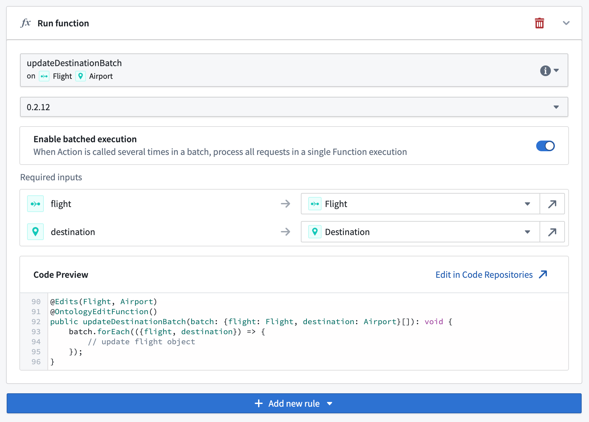

# [](#batched-execution)Batched execution批量执行


When an action is triggered in batches, such as in [Workshop inline edits](/docs/foundry/workshop/widgets-object-table/#inline-edits-cell-level-writeback) or in [Automate](/docs/foundry/automate/execution-settings/), the backing function is usually called once per request in sequence, and all edits are applied atomically at the end of the action call.当批量触发操作时，例如在 Workshop 内联编辑或 Automate 中，后台函数通常按请求顺序被调用一次，并在操作调用结束时将所有编辑原子性应用。


Alternatively, to improve performance or resolve edit conflicts, you may wish to configure a function to receive the whole batch of action calls in a single execution.或者，为了提高性能或解决编辑冲突，您可能希望配置一个函数，以单个执行接收整个批量的操作调用。


To enable batched execution, the function must receive *a single input parameter* containing *a list of structs* (also known as a "map" or "dictionary"). You will then be able to enable batched execution and pass data into the fields of this struct in the same way you would usually pass data to a function's top-level inputs.要启用批量执行，函数必须接收一个包含 struct 列表的单个输入参数（也称为"map"或"dictionary"）。然后您将能够启用批量执行，并以通常向函数顶层输入传递数据的方式将数据传递到该 struct 的字段中。


When using batched execution:使用批量执行时：


- A single action call will invoke a single function execution with *a single entry* in the list input parameter.单个动作调用将使用列表输入参数中的一个条目来调用单个函数执行。
- A batched action call will invoke a single function execution with *several entries* in the list input parameter.批量动作调用将使用列表输入参数中的多个条目来调用单个函数执行。


### [](#example)Example示例


Instead of a function-backed action with the following signature:而不是一个具有以下签名的函数支持的动作：


```
Copied!`1@OntologyEditFunction()
2  public updateDestination(flight: Flight, destination: Airport): void {
3    // update flight object
4}`
```


A function can instead receive a "batch" of requests and process them all in a single execution:函数可以接收一个“批处理”的请求，并在一次执行中处理它们：


```
Copied!`1@OntologyEditFunction()
2public updateDestinationBatch(batch: {flight: Flight, destination: Airport}[]): void {
3    batch.forEach(({flight, destination}) => {
4      // update flight object
5    });
6}`
```


You can then enable batched execution for this function when configuring the action type:在配置动作类型时，您可以为此函数启用批处理执行：




