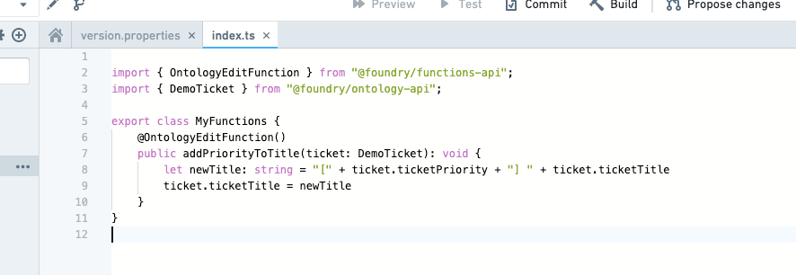
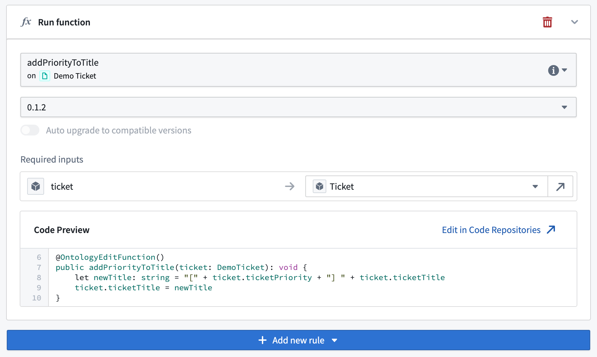
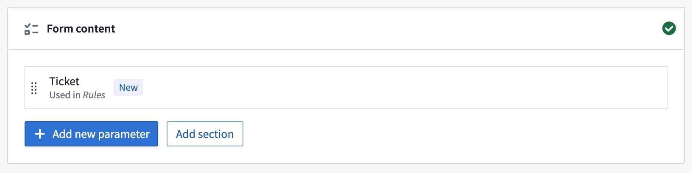
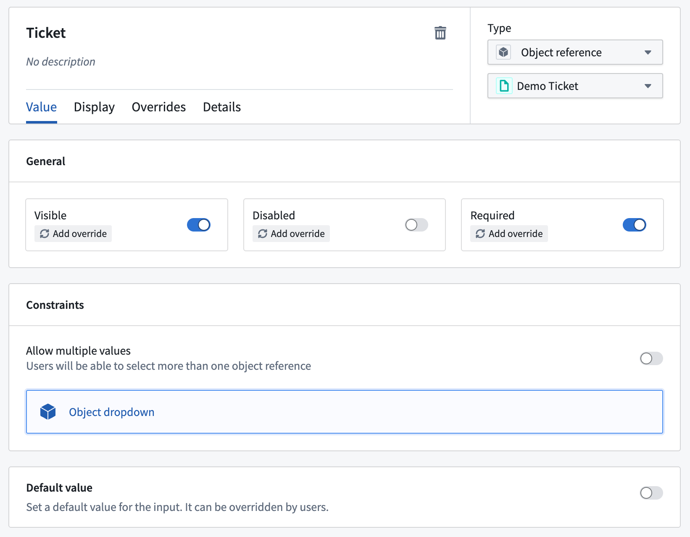
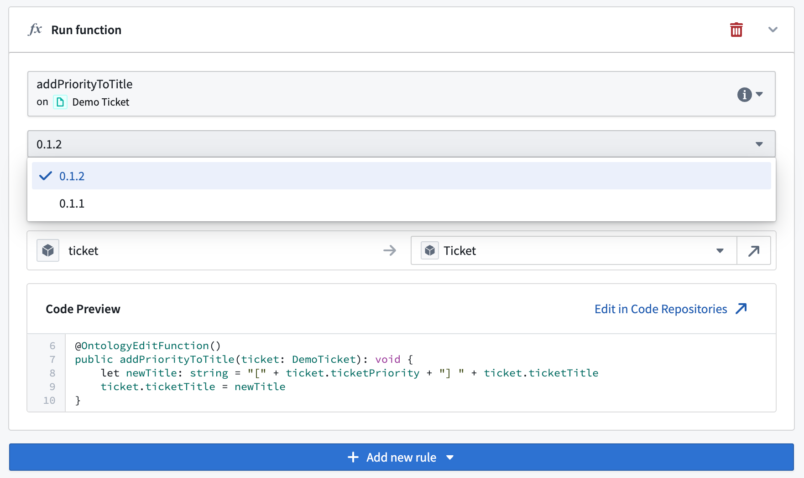
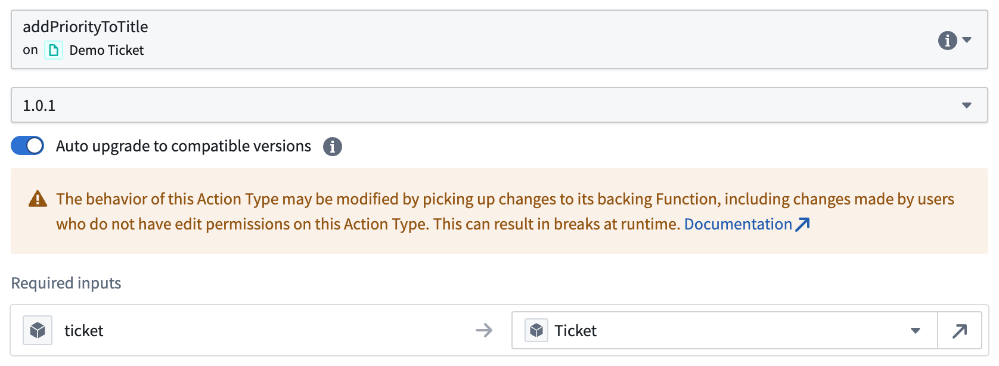

# [](#getting-started)Getting started开始使用


This tutorial explains how to create an action type that is backed by an [Ontology Edit function](/docs/foundry/functions/edits-overview/).本教程将解释如何创建一个由本体编辑功能支持的动作类型。


## [](#prerequisites)Prerequisites先决条件


In this tutorial, we will use the same `Demo Ticket` object type and sample objects as in the [Getting Started with Actions tutorial](/docs/foundry/action-types/getting-started/).在本教程中，我们将使用与“动作入门”教程中相同的 Demo Ticket 对象类型和示例对象。


Start by writing an Ontology edit function that performs the desired edits for your action. This requires:首先编写一个本体编辑函数，以执行您所需的行为编辑。这需要：


- Setting up a repository using the functions on objects TypeScript template,使用对象 TypeScript 模板上的函数设置一个仓库，
- Importing the relevant object types into your repository, and将相关的对象类型导入到您的仓库中，以及
- Publishing the Ontology edit function for actions to read.发布本体编辑函数供行为读取。


Information on these steps can be found in the functions documentation:关于这些步骤的信息可以在函数文档中找到：


- **[Getting started](/docs/foundry/functions/getting-started/):** Follow this tutorial to create a basic functions repository and publish a function.入门指南：按照此教程创建一个基本的函数仓库并发布一个函数。
- **[Functions on objects](/docs/foundry/functions/functions-on-objects/):** Follow this tutorial to create a function that uses object data.对象上的函数：按照此教程创建一个使用对象数据的函数。
- **[Ontology edits](/docs/foundry/functions/api-ontology-edits/):** Use this reference to create an Ontology edit function.本体编辑：使用此参考来创建一个本体编辑函数。


Once you have written and published an Ontology edit function, the steps below will connect the function to an action so that the function can be used to make edits to objects. For the purposes of this tutorial, we have written and published the following Ontology edit function from a repository:一旦您编写并发布了一个本体编辑函数，下面的步骤将连接该函数与一个操作，以便该函数可用于对对象进行编辑。在本教程的范围内，我们从仓库中编写并发布以下本体编辑函数：





For convenience, the code is available here:为方便起见，代码在此处提供：


```
Copied!`1@OntologyEditFunction()
2public addPriorityToTitle(ticket: DemoTicket): void {
3    let newTitle: string = "[" + ticket.ticketPriority + "]" + ticket.ticketTitle;
4    ticket.ticketTitle = newTitle;
5}`
```


Functions for use in action types must be annotated with `@OntologyEditFunction()` instead of `@Function()`. Further details can be found in the documentation for [functions on objects](/docs/foundry/functions/api-ontology-edits/#declaring-an-edit-function).用于操作类型的函数必须使用 @OntologyEditFunction() 而不是 @Function() 进行注释。更多详细信息请参阅对象函数的文档。


## [](#creating-a-function-backed-action)Creating a function-backed action创建基于函数的操作


In the **Rules** section, add a single rule of type **Function**. Search for the function you published as part of the [prerequisites](#prerequisites), and pick the latest version. Configure the inputs to match up to the action parameters, as below. Note that a function rule cannot be combined with [other Ontology rules](/docs/foundry/action-types/rules/#ontology-rules).在规则部分，添加一条类型为函数的规则。搜索你作为前提条件发布的功能，并选择最新版本。配置输入以匹配动作参数，如下所示。请注意，函数规则不能与其他本体规则组合。





When selecting the function, all inputs of the function will automatically be created as parameters and added to the **Parameters** tab. In the example shown in these screenshots, a `Demo Ticket` parameter of type **Object reference** has been created. The parameter can now be customized further if needed.在选择函数时，该函数的所有输入将自动创建为参数并添加到参数选项卡中。在这些截图所示示例中，已创建一个类型为对象引用的 Demo Ticket 参数。如果需要，现在可以进一步自定义该参数。








Save your action and configure it across the platform as described in the [guidance for integration with other applications.](/docs/foundry/action-types/use-actions/)按照与其他应用程序集成指南中所述，保存您的操作并在整个平台上进行配置。


## [](#changing-function-version)Changing function version更改函数版本


By default, if the function logic is changed, the action does not automatically update to match it. Instead, you must return to the **Rules** section of the action and upgrade the version of the function that the action is referencing. For example, if we published version 0.1.2 of the function, we would need to update it here:默认情况下，如果函数逻辑发生变化，操作不会自动更新以匹配它。相反，您必须返回到操作的规则部分，并升级操作所引用的函数版本。例如，如果我们发布了函数的 0.1.2 版本，我们需要在这里更新它：





### [](#auto-upgrades)Auto upgrades自动升级


You can optionally choose to enable auto upgrades for the function that the action is referencing. If enabled, the action will depend on the function at a [version range](/docs/foundry/functions/version-range-dependencies-for-functions/) and [resolve the version](/docs/foundry/functions/version-range-dependencies-for-functions/#version-range-resolution) at runtime.你可以选择是否为该操作所引用的函数启用自动升级。如果启用，该操作将依赖于一个版本范围内的函数，并在运行时解析版本。


To enable auto upgrades for an action, navigate to the **Rules** section of the action and select the **Function** parameter. In the **Function** dropdown, select the minimum version of the function that you want to be run and enable the **Auto upgrade** option. This will correspond to a version range dependency that comprises all backward compatible versions, such as minor or patch upgrades, of the selected minimum version.要为操作启用自动升级，请导航到操作的规则部分并选择函数参数。在函数下拉菜单中，选择你希望运行的函数的最低版本，并启用自动升级选项。这将对应一个包含所选最低版本的向后兼容版本范围的依赖关系，例如次要版本或补丁升级。





Auto upgrades are disabled for function versions of the form `0.y.z`. These versions are reserved for initial development where function API and behavior may change frequently and should not be considered stable. Refer to the documentation on [choosing a release version](/docs/foundry/functions/functions-versioning/#choosing-a-release-version).表单 0.y.z 的函数版本禁用自动升级。这些版本保留用于初始开发，其中函数 API 和行为可能会频繁变化，不应被视为稳定版本。请参考关于选择发布版本的文档。


#### [](#security)Security安全


If auto upgrades are enabled for a function-backed action, users who do not have [edit permissions on the action](/docs/foundry/object-permissioning/ontology-permissions-legacy/#permissions-for-editing-link-types) can modify the action's behavior by making changes to the backing function. This is because edit permissions on the function are not tied to the permissions on the action.如果一个基于函数的动作启用了自动升级，没有该动作编辑权限的用户可以通过修改支撑函数来改变动作的行为。这是因为函数的编辑权限与动作的权限没有关联。


#### [](#breaking-changes)Breaking changes破坏性变更


Auto upgrades can result in action execution failures due to [breaking changes](/docs/foundry/functions/version-range-dependencies-for-functions/#risks) in bad function releases.由于不良版本函数中的破坏性变更，自动升级可能导致动作执行失败。


#### [](#provenance)Provenance来源


The provenance of the action is set according to the provenance of the selected minimum function version. If a newer release of the function returns edits outside of this provenance (for example, an additional object type), action execution will fail.动作的来源是根据所选最小功能版本的来源设置的。如果函数的新版本返回了此来源之外的编辑（例如，额外的对象类型），动作执行将失败。


Currently, the provenance consists only of the object types that the action may edit at runtime.目前，来源仅包含动作在运行时可能编辑的对象类型。

