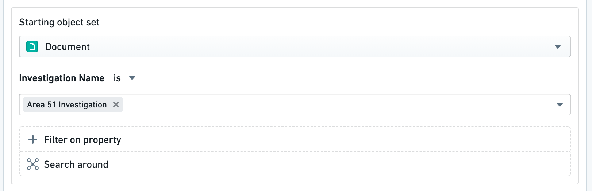
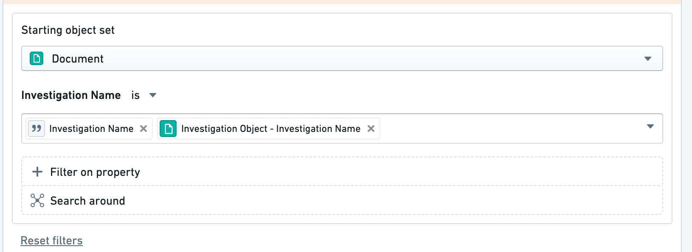

# Object dropdown security considerations对象下拉选单安全考虑

Static value filters in object dropdown validations are exposed to all users who can view the action type. Use of these filters risks exposing property value combinations to users without permissions to view the filtered objects. This risk is mitigated by relying on object properties or parameters to filter the object set. The values are not directly visible in the interface.对象下拉菜单验证中的静态值过滤器会向所有可以查看动作类型的用户开放。使用这些筛选器有可能暴露在没有权限查看筛选对象的用户面前的属性价值组合。通过依赖对象属性或参数来过滤对象集，可以降低这种风险。这些数值在界面中不会直接显示。

## Example: Data privacy issue示例：数据隐私问题

As an example, imagine we have a `Document` object with an `Investigation Name` property. In our action type, we add a filter on the object reference parameter to only show **Documents** where **Investigation Name** is `Area 51 Investigation`.举个例子，假设我们有一个带有调查名称属性的文档对象。在我们的动作类型中，我们在对象引用参数上添加了过滤器，只显示调查名称为 51 区调查的文档 。

Here, we would potentially be revealing that `Area 51 Investigation` is a property value of some `Document` objects to users who cannot view those documents.在这里，我们可能会向无法查看文档对象的用户揭示，Area 51 调查是某些文档对象的属性值。

This only applies to **static value filters**. There is no reference to the `Area 51 Investigation` when filtering the `Investigation Name` property by a parameter or by the property of another object because:这只适用于静态值滤波器 。在用参数或其他对象的属性过滤调查名称属性时，不会引用 Area 51 调查，因为：

- The `Investigation Name` parameter is user-provided. No information about the underlying data is exposed to the action type viewer.调查名称参数由用户提供。动作类型查看器不会暴露任何底层数据的信息。
- The `Investigation Object` parameter will respect existing restrictions on object visibility for this user.调查对象参数将尊重该用户对对象可见性的现有限制。

Therefore, neither of these search queries represents a data privacy concern.因此，这两种搜索查询都不构成数据隐私问题。

## Technical details技术细节

In most cases, the actions backend redacts sensitive information in the action type definition to avoid exposing sensitive property values. For example, action submission criteria are hidden from users who cannot edit action types. Similarly, a user will not be able to see the new object dropdown filters in the action type definition in the interface or while inspecting the response in the backend.在大多数情况下，动作后端会在动作类型定义中遮蔽敏感信息，以避免暴露敏感属性值。例如，动作提交标准对无法编辑动作类型的用户隐藏。同样，用户在界面的动作类型定义中或后端检查响应时，也无法看到新的对象下拉过滤器。

However, when viewing the action form, the object dropdown validation is converted into an object set. This means that users could review the network request containing this object set. In the example above, the user would receive an object set RID containing the `Investigation Name = 'Area 51 Investigation'` filter, revealing the existence of that property value even if they could not view any of its corresponding objects.然而，在查看动作表单时，对象下拉验证会被转换为对象集。这意味着用户可以查看包含该对象集的网络请求。在上述示例中，用户会收到包含过滤器 Investigation Name = 'Area 51 Investigation' 的对象集 RID，即使无法查看该属性值的任何对应对象，也能显示该属性值的存在。

This means that these values will **not be visible in the interface** for any users. If visibility is a greater concern than security, this warning can be ignored.这意味着这些数值在界面中不会对任何用户可见。如果能见度比安全更重要，这个警告可以忽略。

