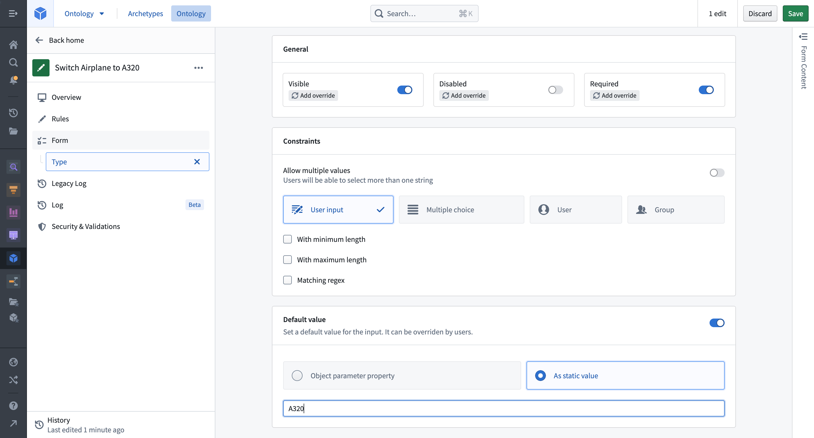
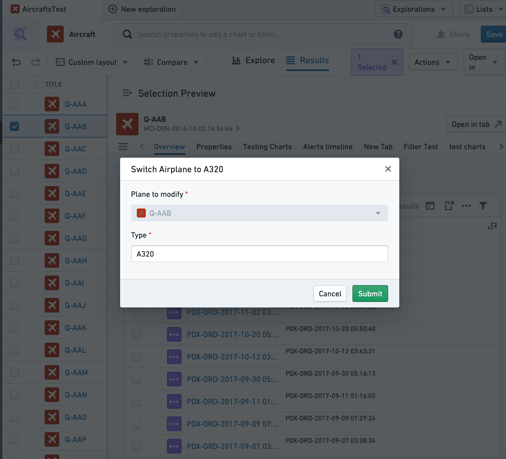
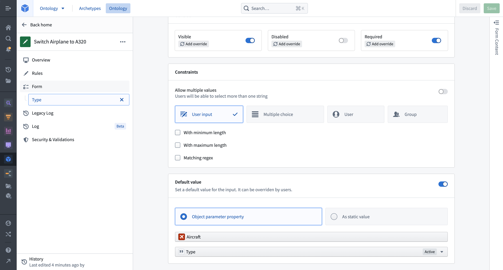
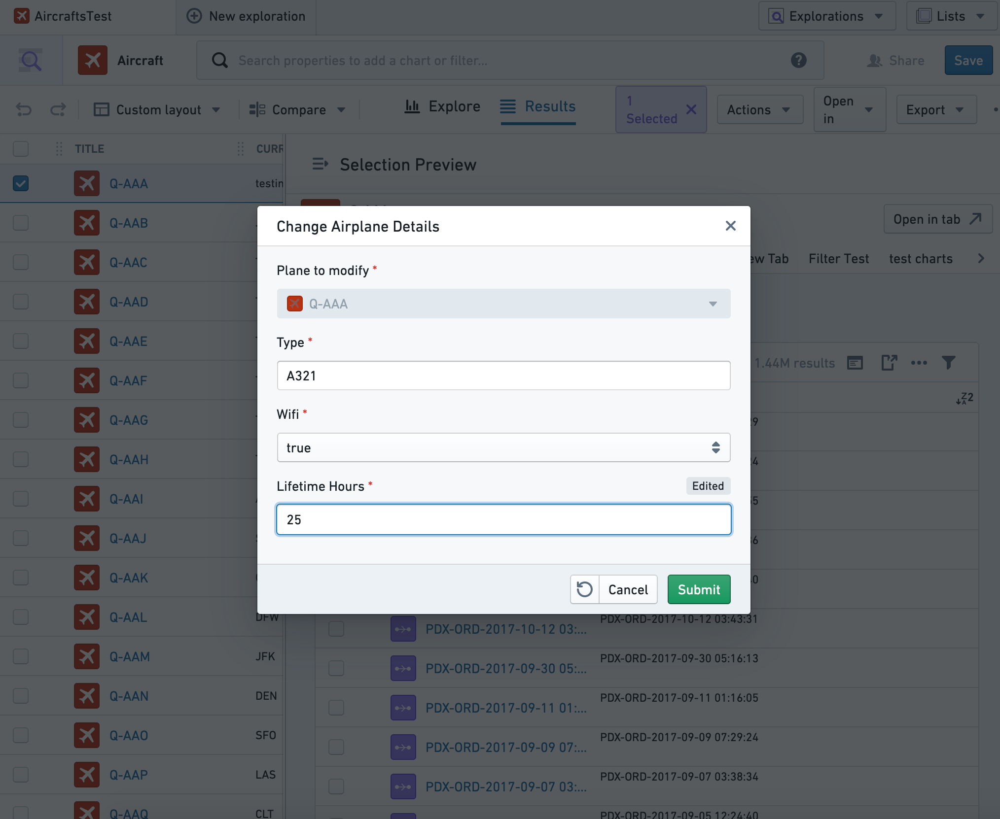
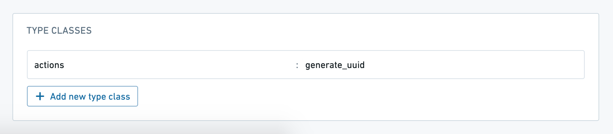

# Set parameter default value设置参数默认值

Default values for action type parameters are used to prefill parameters in the action form. Default values are configured at the parameter level and are supported in Workshop, Object Explorer, Object Views, Quiver, and Slate. They can be deployed to standardize action logic across multiple consuming applications, eliminating the need to add default values in each application individually.动作类型参数的默认值用于在动作表单中预填充参数。默认值在参数层面配置，支持于 Workshop、Object Explorer、Object Views、Quiver 和 Slate。它们可以部署用于在多个消耗型应用中标准化动作逻辑，无需在每个应用中单独添加默认值。

Parameters can be set to default values to display either a fixed value or a property of the selected object.参数可以设置为默认值，以显示固定值或所选对象的属性。

## Default value interaction with local variables默认值与局部变量的交互

Local default values (for example, Workshop variables) always take precedence over global default values. When passing any Workshop variable to an action with a default value, the action form will prefill with the values from the Workshop variables. The same pattern applies with environment variables from Object Views and defaults from Slate. Defaults provided in each instance of an action take precedence. Any migration to default values will therefore require removing local overrides.本地默认值（例如，创意工坊变量）始终优先于全局默认值。当将任何创意工坊变量传递给带有默认值的动作时，动作表单会预先填充工坊变量的值。同样的模式也适用于对象视图中的环境变量和 Slate 的默认变量。每个动作实例中提供的默认值优先。因此，任何迁移到默认值都需要移除本地覆盖。

## Configuring default values配置默认值

Selecting any parameter opens the parameter configuration view for that parameter. Select whether the parameter should default to a fixed value or with a value from the property of an object parameter.选择任意参数即可打开该参数的参数配置视图。选择参数默认为固定值，还是基于对象参数属性的值。

### Static default value静态默认值

Imagine an example action type that modifies the `Type` property of a selected `Aircraft` object to become `A320`. To configure, click into the `Type` parameter and add a static default value.想象一个示例动作类型，将所选飞机对象的类型属性修改为 A320。要配置，点击类型参数，添加一个静态默认值。

To achieve a similar user experience without default values, input values would need to be configured in each application that uses the parameter. Updating this behavior (for instance, to `A380`) would require manually modifying the behavior, possibly across multiple applications.为了实现类似的用户体验，无需默认值，每个使用该参数的应用程序都需要配置输入值。更新这种行为（例如，更新到 A380）需要手动修改，可能需要跨多个应用程序修改。

### Object property default values对象属性默认值

To set an object property as the default value for a parameter, begin by selecting an object parameter to configure. Let's assume a more generic action type called `Change Airplane Details` where, for example, users need to know the current value of a property before making edits. This can be achieved by configuring the value of each parameter to be prefilled from the currently selected object (in our case, the `Plane` object to modify). Only object reference parameters that are placed above the parameter in the input list are available to be used as a default value.要将某个对象属性设置为参数的默认值，首先选择一个对象参数进行配置。假设有一种更通用的动作类型，称为更改飞机详情 ，例如，用户需要在编辑前知道某个属性的当前值。这可以通过配置当前选中的对象（在我们这里是要修改的平面对象）预填充的参数值来实现。只有放置在输入列表中参数上方的对象引用参数才可作为默认值使用。

In Object Explorer, the `Change Airplane Details` action will be prefilled with current values. In this case, users could choose to modify just one property and keep the rest the same. This same default logic will be present anywhere the action is submitted. Note that the `Lifetime Hours` value shows as edited once this default value is updated by the action user.在对象浏览器中，“更改飞机详情 ”作会预先填充当前值。在这种情况下，用户可以选择只修改一个属性，保持其余内容不变。同样的默认逻辑会在任何提交该动作的地方存在。注意，一旦作用户更新了该默认值， 终身小时数值会显示为已编辑。

### Type class prefills类型类别预填充

Action parameters can be prefilled with special values (such as automatically-generated UUIDs or the current user's ID) by annotating them with type classes. The Ontology documentation has [a complete list of the available type classes](/docs/foundry/object-link-types/metadata-typeclasses/).动作参数可以通过用类型类注释来预先填充特殊值（如自动生成的 UUID 或当前用户 ID）。本体论文档中有完整的可用类型类列表 。

In most cases, you should set the parameter visibility to `hidden`, so that users do not manually change these special prefilled values.在大多数情况下，你应该将参数可见性设置为隐藏 ，这样用户就不会手动更改这些特殊的预填充值。

