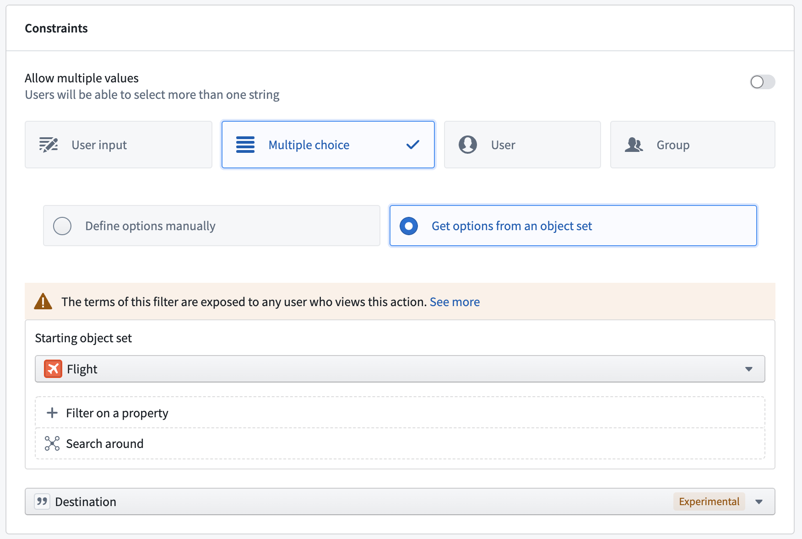
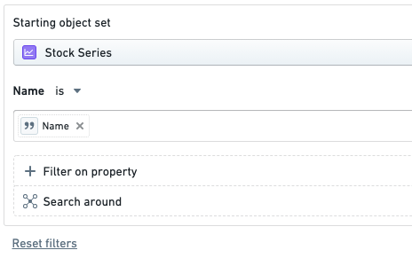
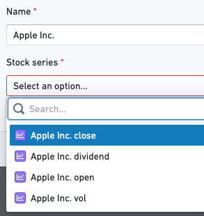
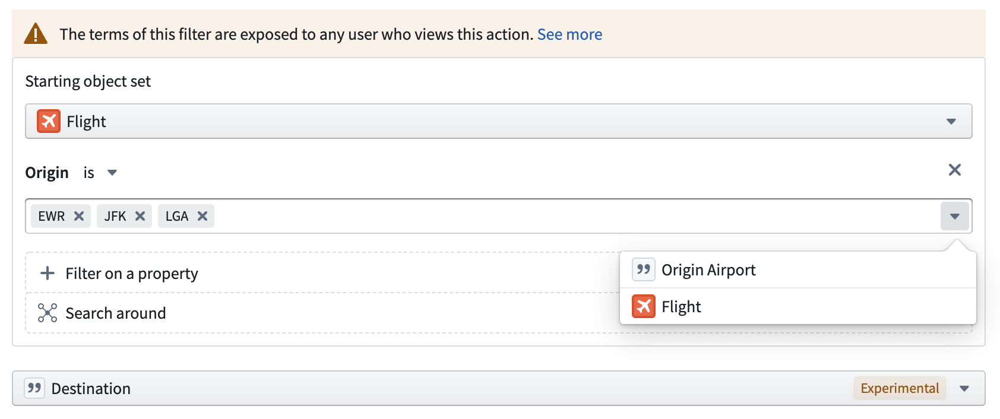
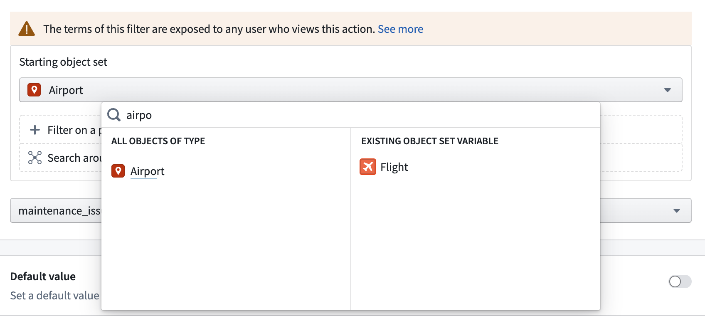
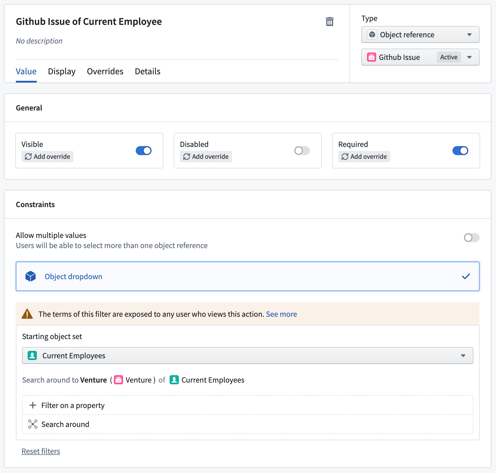

# Filter results of a parameter dropdown参数下拉菜单的滤波器结果

Adding filters to non-object reference multiple choice or single object reference parameters will determine the allowed values that are selectable in the parameter's dropdown.在非对象参考多项选择或单对象参考参数中添加过滤器，将决定参数下拉菜单中允许选择的值。

## Multiple choice parameter dropdowns多项选择参数下拉菜单

When configuring multiple choice parameter dropdown menus, action editors can reduce allowed values to just those that are properties of an object set. This can be leveraged to display or prefill values based on properties of a linked object. To accomplish this, ensure the parameter is set to display multiple choices, select **Get options from an object set**, configure the desired object set, and select the property that includes all allowed values for the parameter dropdown. If only one linked object is available in the resulting object set and the parameter is required, the parameter dropdown will automatically prefill with the corresponding property value. The resulting multiple choice options will be derived from the set of objects that the user has permission to view. In other words, when deriving multiple choice options from an object set, users will not see properties of objects to which they do not have access.在配置多项选择参数下拉菜单时，动作编辑器可以将允许的值简化为仅为对象集合属性的值。这可以用来显示或预填充基于关联对象属性的值。为此，确保参数设置为显示多项选择，选择从对象集中获取选项 ，配置目标对象集，并选择包含参数下拉菜单所有允许值的属性。如果生成的对象集中只有一个关联对象且需要该参数，参数下拉菜单会自动预填充相应的属性值。由此产生的多项选择选项将从用户有权限查看的对象集合中推导出来。换句话说，当用户从对象集中推导出多项选择选项时，将看不到自己无法访问的对象属性。

## Object dropdowns对象下拉菜单

Within the parameter configuration view, action editors can specify filters and Search Arounds to limit the objects that show up in the dropdown across all action interfaces. After configuring the filters, the action form will render a dropdown with only objects that match the filter. The value selected is also validated before the action is executed.在参数配置视图中，动作编辑器可以指定过滤器和搜索环，限制下拉菜单中显示的所有动作接口中的对象。配置好过滤器后，动作表单会渲染一个只包含与过滤器匹配对象的下拉菜单。所选值在执行动作前也会被验证。

For example, an object dropdown configured to only show **Stock Series** where the **Name** is equal to the value in the `Name` parameter.例如，一个对象下拉菜单只显示股票系列 ，且名称等于名称参数中的值。

The image below shows the possible values for the `Name` parameter:下图显示了名称参数的可能值：

### Data privacy implications数据隐私影响

When using the new validation on an object parameter, it's possible for data to be viewed by everyone who can view the action type. If there are sensitive static values in the parameter filters, users will be able to view those values even if they cannot view the underlying objects that are being filtered. [Learn more about the data privacy implications.](/docs/foundry/action-types/dropdown-security/)使用对象参数的新验证时，所有能查看该动作类型的人都可以查看数据。如果参数过滤器中存在敏感的静态值，用户即使无法查看被过滤的底层对象，也能查看这些值。 了解更多关于数据隐私影响的信息。

## Supported operations支持的行动

### Filtering on a property在属性上进行过滤

The object dropdown only shows objects where the specified property matches any of the provided values.对象下拉菜单只显示指定属性与任意值匹配的对象。

The value can be statically defined by the user, inferred from another parameter, or a property of an `Object Reference` parameter. If more than one value is provided to compare against, the result will be an **OR** operation.该值可以由用户静态定义，也可以从其他参数推断，或通过对象参考参数的属性来实现。如果提供多个值进行比较，结果将是 OR 作。

### Changing the starting object set更改起始对象集

The **starting set** for the query is set to all objects of the object type by default, but this can be changed to any other type. The starting set could also be set to an `ObjectReference` list parameter.查询的起始集默认设置为该对象类型的所有对象，但也可以更改为任何其他类型。起始集也可以设置为 ObjectReference 列表参数。

### Search Arounds搜索环节

A Search Around would create a new set by traversing a link on every object in the current set. For example, `Github Issue of Current Employee` would take the `Employees` in the current set and create a resulting set of `Github Issues` linked to those `Employees`.搜索环绕会通过遍历当前集合中的每个对象的链接来创建一个新的集合。例如，可以 Github Issue of Current Employee 将当前员工集中创建一组与这些员工关联的 Github Issue。

