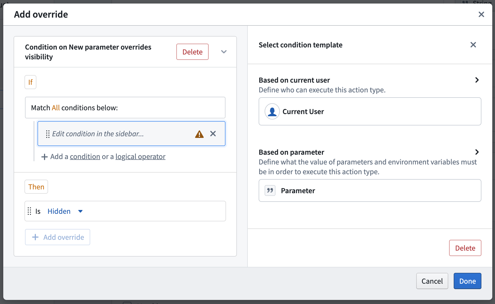
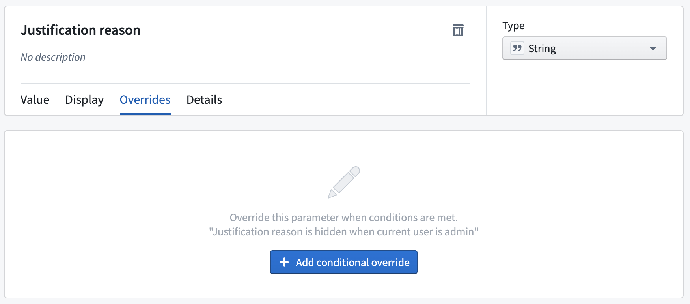
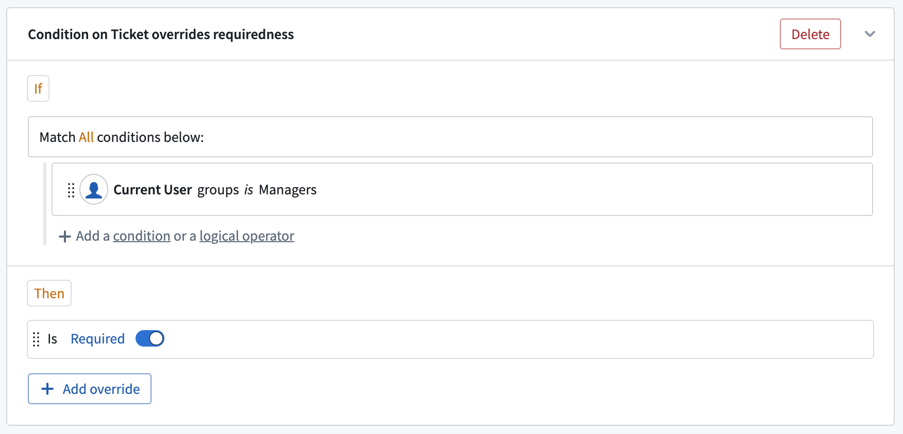

# Overrides覆盖

Overrides are used to change a parameter's behavior and configuration under specific circumstances. Using overrides, parameters and forms can become more flexible, removing the need to configure separate action types with only minor variations. Appropriate use of overrides can improve the user experience by guiding users through an action submission.覆盖用于在特定情况下改变参数的行为和配置。使用覆盖、参数和表单可以变得更加灵活，无需配置单独的动作类型，仅有细微变化。正确使用覆盖可以通过引导用户完成动作提交来提升用户体验。

For example, let's assume that you have an action type which changes the status of a support ticket object and you want to restrict action submission to managers and assignees. While assignees can change the status, managers will have to provide a justification. Using overrides, the `Justification reason` parameter can be made required and visible for managers, while it is hidden and optional for the assignee.例如，假设你有一个动作类型，它改变了一个支持工单对象的状态，并且你想限制作提交只能给经理和受管者。虽然被派遣者可以更改状态，但管理者必须提供理由。通过覆盖，合理化理由参数可以被管理者强制且可见，而对受让方则隐藏且可选。

## Add and edit overrides添加和编辑覆盖

You can add and edit overrides from different places on the parameter view. The easiest way to add a new override is directly from the **Value** tab in the **General** section. By clicking **Add override** on one of the three options, you can easily create an override via the pop-up, which now automatically configured the override based on the selected option. The **General** section also shows when and how many overrides have already been configured for one of the options. To edit existing overrides, select the override button.你可以在参数视图的不同位置添加和编辑覆盖。添加新覆盖最简单的方法是直接从 “通用 ”部分的值标签下作。点击三个选项中的一个添加覆盖 ，你可以通过弹窗轻松创建覆盖，现在会自动根据所选选项配置覆盖。 通用部分还显示了某个选项何时以及已配置了多少次覆盖。要编辑现有的覆盖，请选择覆盖按钮。

You can also add an override manually via the **Overrides** tab. The overrides tab shows an overview of all overrides configured for the parameter. You can add override blocks from here or add new conditions or overrides to existing blocks.你也可以通过覆盖标签手动添加覆盖。覆盖标签页显示了该参数所有配置的覆盖总览。你可以从这里添加覆盖块，或者给现有块添加新的条件或覆盖。

## Override block覆盖块

An override block presents the basis for overrides. It defines both the conditions (shown in the "if" part) and the overrides (shown in the "then" part). Each block's header shows a summary of the logic. Every parameter can contain multiple override blocks, however, if more than one is true, only the first one will be executed.覆盖块是覆盖的基础。它定义了条件（在“如果”部分显示）和覆盖条件（在“那么”部分显示）。每个区块的头部都显示了逻辑的摘要。每个参数可以包含多个覆盖块，但如果多个为真，只执行第一个。

### "If" and conditions“如果”和条件

Each block can contain one or multiple conditions. To read more about conditions and how to configure them, see the [submission criteria documentation on conditions](/docs/foundry/action-types/submission-criteria/#conditions). The only difference between override conditions and submission criteria conditions is that only parameters which appear above the current parameter in the form hierarchy can be referenced in override conditions.每个区块可以包含一个或多个条件。想了解更多关于条件及其配置的信息，请参阅提交条件文档中的条件。覆盖条件与提交条件条件的唯一区别在于，只有表单层级中出现在当前参数之上的参数才能在覆盖条件中被引用。

### "Then" and overrides“那么”和覆盖

The **Then** section defines the overrides which will be applied when the conditions of the block are met. Each block can contain multiple overrides in its **Then** section, which are all be applied together. An override can change the configuration of the parameter's constraints, visibility, requiredness, and default values. If an override is configured to take on the same value as the default already set on the parameter, a warning will be shown on the override itself.“然后 ”部分定义了当块条件满足时将应用的覆盖措施。每个块的 Then 部分可以包含多个覆盖，这些覆盖可以同时应用。覆盖可以改变参数约束、可见性、需求性和默认值的配置。如果覆盖配置为与参数默认值相同，覆盖本身会显示警告。

### Multiple override blocks多重覆盖块

You can add multiple override blocks to a single parameter. If more than one block is true, only the first override is executed.你可以在一个参数上添加多个覆盖块。如果多个块为真，则只执行第一个覆盖。

