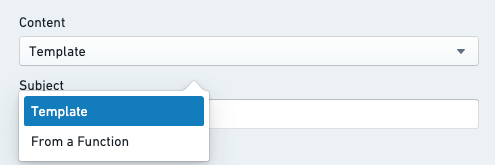
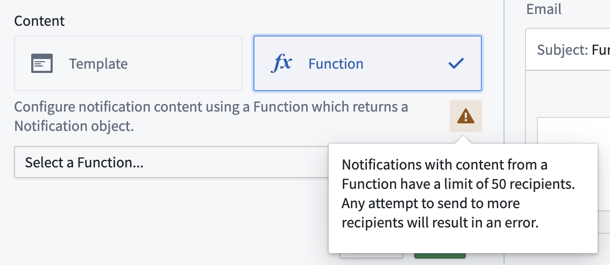
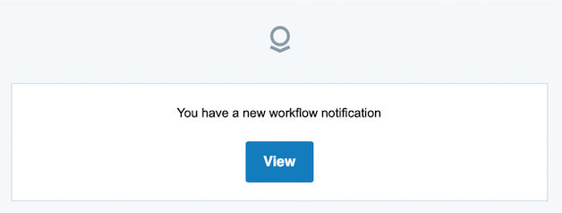
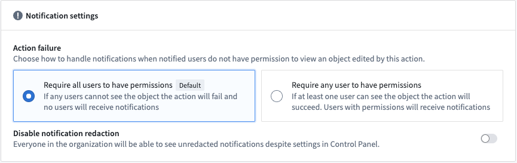

# Notifications通知

Notifications can be added to an action through the **Add new rule** dropdown menu. [Learn more about how to add a notification.](/docs/foundry/action-types/set-up-notification/)可以通过“添加新规则”下拉菜单将通知添加到操作中。了解更多关于如何添加通知的信息。

Configuring a notification requires specification of [recipients](#recipients) and [content](#content). The following sections provide more detail on these options.配置通知需要指定接收者和内容。以下部分将提供更多关于这些选项的详细信息。

## Recipients接收者

Configuring the **Recipients** option of a notification allows you to specify the set of Foundry users who will receive a notification when the action runs. Notifications will be sent to each recipient individually. Adding users as CC (carbon copy) recipients to email notifications is not supported.配置通知的收件人选项允许您指定当操作运行时将接收通知的 Foundry 用户集。通知将单独发送给每个收件人。不支持将用户添加为电子邮件通知的抄送（CC）收件人。

There are several supported ways of specifying recipients:指定收件人有以下几种支持的方式：

- **Static:** In the configuration, you may select a set of users or groups who will always be notified when the action runs.静态：在配置中，您可以选择一组用户或组，这些用户或组在操作运行时始终会收到通知。
- **From a parameter:** If you have a parameter to the action that is a Foundry user or group ID, you may specify this as your recipient for a notification.来自参数：如果您有一个操作参数是 Foundry 用户或组 ID，您可以将其指定为通知的收件人。

- This can be used to allow the sender to select one or more recipients in the user interface of an application or module that uses this action, or to automatically detect and send a notification to the user running the action.这可用于允许发送者在使用该操作的应用程序或模块的用户界面中选择一个或多个收件人，或自动检测并通知执行该操作的用户。
  - This can be used to allow the sender to select one or more recipients in the user interface of an application or module that uses this action, or to automatically detect and send a notification to the user running the action.这可用于允许发送者在使用该操作的应用程序或模块的用户界面中选择一个或多个收件人，或自动检测并通知执行该操作的用户。
  
  - **From an attribute of an object parameter:** If you have an object parameter to the action, and one of the properties of that object contains a Foundry user or group ID, you may specify that property of a parameter as the recipient. This is also possible for lists of Foundry user and group IDs.从对象参数的属性：如果您为该操作提供了一个对象参数，并且该对象的一个属性包含 Foundry 用户或组 ID，您可以指定该参数的该属性为收件人。对于 Foundry 用户和组 ID 的列表，这也是可能的。
- **From a function:** If your use case is not covered by the above options, you may write a custom function which takes in action parameters and will return the list of users or groups who should be notified. [Learn more about how to write a function that returns a list of users or groups.](/docs/foundry/functions/types-reference/#users-groups-and-principals)从函数：如果您的用例未涵盖上述选项，您可以编写一个自定义函数，该函数接收操作参数并返回应通知的用户或组列表。了解更多关于如何编写返回用户或组列表的函数的信息。

Examples of use cases for recipients based on a function include:基于函数的收件人用例示例包括：

- Combining the other options for recipients; for example, notifying the `assignee` specified from an attribute of an object parameter and also always notifying a static set of additional recipients.结合其他接收者选项；例如，从对象参数的属性中通知 assignee 指定的接收者，并且始终通知一组静态的附加接收者。
- Recipient selection based on other parameters or property values of parameters; for example, whenever there is a new task in EMEA, notify one set of users; whenever there is a new task in North America, notify a different set of users.基于其他参数或参数的属性值选择接收者；例如，每当 EMEA 有新任务时，通知一组用户；每当北美有新任务时，通知另一组用户。
- Any other custom logic which does not fit into the structured options.任何其他不符合结构化选项的自定义逻辑。
  - Combining the other options for recipients; for example, notifying the `assignee` specified from an attribute of an object parameter and also always notifying a static set of additional recipients.结合其他接收者选项；例如，从对象参数的属性中通知 assignee 指定的接收者，并且始终通知一组静态的附加接收者。
  - Recipient selection based on other parameters or property values of parameters; for example, whenever there is a new task in EMEA, notify one set of users; whenever there is a new task in North America, notify a different set of users.基于其他参数或参数的属性值选择接收者；例如，每当 EMEA 有新任务时，通知一组用户；每当北美有新任务时，通知另一组用户。
  - Any other custom logic which does not fit into the structured options.任何其他不符合结构化选项的自定义逻辑。
  
  

Recipients may change their preferences for how notifications are delivered to them. For example, one user may choose to only have notifications delivered in their web browser, while another user may choose to receive both in-platform toasts and emails. If a user has action notifications turned off in their personal preferences, they will not be notified. However, they may still view their notifications when logged into Foundry by going to "Notifications" and then "See All" in the Workspace.接收者可以更改他们接收通知的方式的偏好。例如，一个用户可以选择仅在他们的网络浏览器中接收通知，而另一个用户可以选择接收平台内的提示和电子邮件。如果一个用户在个人偏好中关闭了操作通知，他们将不会收到通知。但是，他们仍然可以通过登录 Foundry，进入工作区中的“通知”然后选择“查看所有”来查看他们的通知。

## Content内容

There are a number of options for customizing the content of notifications. Content may be configured via *Template* or provided via a custom *function*. Selecting template content will allow you to configure the full content directly in the configuration dialog. Function content will require you to have a published function, which returns the appropriate notification type.有多种选项可用于自定义通知内容。内容可以通过模板进行配置，或通过自定义函数提供。选择模板内容将允许您在配置对话框中直接配置完整内容。函数内容将要求您拥有一个已发布的函数，该函数返回适当的通知类型。

### Content components内容组件

1. **Subject:** Usually, content will include a subject line. By default, this will be the same for all delivery mechanisms.主题：通常，内容会包含一个主题行。默认情况下，这将适用于所有交付机制。
2. **Body:** The body of the notification. For in-platform notifications, this will display inside the notification toast. For email, this will be rendered inside the body of the email.正文：通知的正文。对于平台内通知，这将显示在通知吐司中。对于电子邮件，这将渲染在电子邮件正文内。
3. **Link:** You may specify a link. This will appear as a button just below the body content of the notification. The text of the button can be customized.链接：您可以指定一个链接。这将显示在通知正文内容下方，作为按钮。按钮的文本可以自定义。

- The following options are available for configuring a link:
配置链接的以下选项可用：- Link to an existing object parameter链接到现有对象参数
- Link to a Workshop app链接到 Workshop 应用
- Link to a Carbon workspace链接到 Carbon 工作区
- Link to a newly created object链接到新创建的对象
  - Link to an existing object parameter链接到现有对象参数
  - Link to a Workshop app链接到 Workshop 应用
  - Link to a Carbon workspace链接到 Carbon 工作区
  - Link to a newly created object链接到新创建的对象
  - The following options are available for configuring a link:
  配置链接的以下选项可用：- Link to an existing object parameter链接到现有对象参数
  - Link to a Workshop app链接到 Workshop 应用
  - Link to a Carbon workspace链接到 Carbon 工作区
  - Link to a newly created object链接到新创建的对象
    - Link to an existing object parameter链接到现有对象参数
    - Link to a Workshop app链接到 Workshop 应用
    - Link to a Carbon workspace链接到 Carbon 工作区
    - Link to a newly created object链接到新创建的对象
    
    
  4. **Advanced Email Configuration:** When configuring a notification, you may specify a custom content body to use when delivering a notification via email. This option allows you use HTML for more advanced formatting which is not supported for in-platform notifications. The preview will show you how your notification will look, excluding any parameter references. Recipients will only receive this content if they set their preference to receive notifications via email.高级邮件配置：在配置通知时，您可以指定自定义内容正文，以便通过电子邮件发送通知。此选项允许您使用 HTML 进行更高级的格式设置，而平台内通知不支持此功能。预览将显示您的通知将如何显示，不包括任何参数引用。收件人只有在设置偏好接收电子邮件通知时才会收到此内容。

Triple handlebars may be used to reference parameters and user attributes in the Subject, Body, and Link mentioned above. When editing a section, clicking on one of the available parameters will auto-generate the correct handlebar reference for that parameter or user attribute.三重大括号可用于引用上述主题、正文和链接中的参数和用户属性。在编辑部分时，点击其中一个可用参数将自动生成该参数或用户属性的正确的引用。

1. **From a Function:** When selecting "From a Function", you do not configure the sections listed above. Instead, you must provide a Function that returns a `Notification` object with the appropriate properties specifying each section of your custom content. You may need to use a Function if any of the following applies:
从函数：当选择“从函数”时，您不需要配置上述部分。相反，您必须提供一个返回 Notification 对象的函数，该对象包含指定您自定义内容每个部分的正确属性。如果以下任何情况适用，您可能需要使用函数：- The notification content is completely different depending on the recipient or input parameters to the Action.通知内容完全取决于接收者或 Action 的输入参数。
- You want to have a different subject line for email and in-platform notifications.您希望为电子邮件和在平台内的通知使用不同的主题行。
- You want to use full link URLs, including links to external systems or applications that live outside of Foundry.您希望使用完整的链接 URL，包括指向 Foundry 外部系统或应用程序的链接。
- You want to perform Search Arounds, aggregations, or query data beyond what is provided via parameters when rendering the content.您希望在渲染内容时执行搜索、聚合或查询参数提供之外的数据。
- You have any other custom requirements that are not possible via the template content options.您是否有其他通过模板内容选项无法实现的定制需求。
  - The notification content is completely different depending on the recipient or input parameters to the Action.通知内容完全取决于接收者或 Action 的输入参数。
  - You want to have a different subject line for email and in-platform notifications.您希望为电子邮件和在平台内的通知使用不同的主题行。
  - You want to use full link URLs, including links to external systems or applications that live outside of Foundry.您希望使用完整的链接 URL，包括指向 Foundry 外部系统或应用程序的链接。
  - You want to perform Search Arounds, aggregations, or query data beyond what is provided via parameters when rendering the content.您希望在渲染内容时执行搜索、聚合或查询参数提供之外的数据。
  - You have any other custom requirements that are not possible via the template content options.您是否有其他通过模板内容选项无法实现的定制需求。
  
  

More information on the Notification return type can be found in the [Functions documentation](/docs/foundry/functions/configure-notifications/).有关 Notification 返回类型的更多信息，请参阅函数文档。

Any Ontology data used for generating notification content will reflect the state of the Ontology before edits of the current Action are applied. To give notification recipients access to the latest state of specific objects, it is possible to embed links to objects referenced via object parameters, or links to newly created objects (if those objects are created via a "create object" rule and not via a function) in the notification.用于生成通知内容的任何本体数据都将反映当前操作编辑应用前的本体状态。为了使通知接收者能够访问特定对象的最新状态，可以在通知中嵌入通过对象参数引用的对象链接，或新创建的对象链接（如果这些对象是通过"创建对象"规则创建而非通过函数创建）。

---

## Example configuration示例配置

This is an example configuration for a notification.这是一个通知的示例配置。

1. **Recipients** configuration接收者配置
2. **Content** configuration
内容配置- Choose from template (configure directly in the Ontology app dialog) or Function (specify a Function that returns a fully-formed `Notification` object).从模板中选择（在 Ontology 应用对话框中直接配置）或函数（指定一个返回完整 Notification 对象的函数）。
  - Choose from template (configure directly in the Ontology app dialog) or Function (specify a Function that returns a fully-formed `Notification` object).从模板中选择（在 Ontology 应用对话框中直接配置）或函数（指定一个返回完整 Notification 对象的函数）。
  
  3. **Subject** line for template notification.模板通知的主题行。
4. Available **parameters** based on the available parameters to the Action. Click on a parameter to generate the `{{{}}}` syntax to reference that parameter.基于可用的 Action 参数，显示可用参数。点击参数可生成 {{{}}} 语法以引用该参数。
5. **Body** content for template notification.模板通知的正文内容。
6. **Link** configuration for template notification (optional).模板通知的链接配置（可选）。
7. **Custom HTML content for email** with template notification (optional).使用模板通知的电子邮件自定义 HTML 内容（可选）。

---

## Other key information其他关键信息

### Maximum recipient limits最大接收者限制

- There is a maximum of 50 recipients when using the "From a Function" option to render the notification content. There will be a warning in the configuration panel when selecting "From a Function" under the content configuration options, and the number of recipients will be checked each time the Action is run. If the number of recipients is over the limit, a red error toast will be displayed and the Action will fail to run.使用"从函数"选项渲染通知内容时，最多有 50 个接收者。在内容配置选项中选择"从函数"时，配置面板中会显示警告，每次执行操作时都会检查接收者数量。如果接收者数量超过限制，会显示红色错误提示，操作将无法执行。
- There is a maximum of 500 recipients for a single Action notification when the content is configured directly in the configuration dialog using the "Template" option.使用"模板"选项在配置对话框中直接配置内容时，单个操作通知最多有 500 个接收者。

### Content length limits内容长度限制

- The maximum subject length is 250 characters.主题的最大长度为 250 个字符。
- The maximum body length is 1,000 characters. When rendering custom HTML content for email, the maximum length is 51,200 characters.正文的最大长度为 1,000 个字符。在为电子邮件渲染自定义 HTML 内容时，最大长度为 51,200 个字符。

Keep in mind that these maximum content lengths are validated and truncated when notifications are rendered. This means that if the rendered content is dynamic (for example, if the notification content includes object data), any content longer than the allowed maximum lengths will be truncated and indicated by trailing `...`.请注意，这些最大内容长度在通知渲染时会进行验证和截断。这意味着如果渲染的内容是动态的（例如，如果通知内容包含对象数据），任何超过允许最大长度的内容都将被截断，并以尾部 ... 标记。

### Strict redaction严格删除

If "Strict Redaction" or "Group Redaction" on outbound email notifications is enabled for your Foundry instance, custom notification content will not be rendered. Instead, users will receive the generic message shown below. Selecting "View" will direct them into Foundry where they can view the full notification content. [Learn more about email content redaction in Foundry.](/docs/foundry/email/email-content-redaction/)如果您的 Foundry 实例在出站邮件通知中启用了"严格编辑"或"分组编辑"，自定义通知内容将不会被渲染。相反，用户将收到下方显示的通用消息。选择"查看"将引导他们进入 Foundry，在那里他们可以查看完整的通知内容。了解更多关于 Foundry 中邮件内容编辑的信息。

### Recipient user accounts接收用户帐户

- Groups will be resolved to individual users in order to check permissions on the data before sending the notifications.在发送通知之前，将把组解析为单个用户以检查数据权限。
- Foundry user and group IDs can be found via Settings under Account. The configuration interface for notifications provides selectors for users and groups when choosing a static set of recipients. This will only display users and groups for which the person configuring the Action has adequate permissions.Foundry 的用户和组 ID 可以在账户设置下的设置中找到。在通知配置界面中，当选择静态接收者集时，会提供用户和组的选项。这只会显示配置操作的人有足够权限的用户和组。
- If recipient(s) are configured via reference to an object property, make sure the property stores the Foundry user or group ID as a string. You can use conditional formatting to display the associated user or group display name (for more detail, see the [value formatting documentation](/docs/foundry/object-link-types/value-formatting/)).如果通过引用对象属性来配置接收者，请确保该属性将 Foundry 用户或组 ID 存储为字符串。您可以使用条件格式化来显示相关的用户或组显示名称（更多详情，请参阅值格式化文档）。
- Sending directly to email addresses is not supported.直接发送到电子邮件地址是不支持的。

### Links to newly-created objects链接到新创建的对象

You must reference the primary key of a new object when linking it, since an object RID is not generated by time the notification is rendered.链接新对象时，你必须引用其主键，因为对象 RID 不是在通知渲染时生成的。

**Example:** You have an Action that creates a new `task` object, and will be generating a unique ID when creating the task. Inside your Action notification you render a link to the newly created object using the [parameter options provided by Object Explorer](/docs/foundry/object-explorer/generate-urls/).示例：你有一个创建新 task 对象的 Action，在创建任务时会生成一个唯一 ID。在你的 Action 通知中，你使用对象浏览器提供的参数选项渲染一个指向新创建对象的链接。

- There are two supported ways of specifying URL links when using Function generated content:
使用函数生成内容时，指定 URL 链接有两种支持的方式：- Full link example: `https://<your-foundry-instance>.com/workspace/module/view/latest/<module-rid>`完整链接示例： https://<your-foundry-instance>.com/workspace/module/view/latest/<module-rid>
- Relative link example: `/module/view/latest/<module-rid>`相对链接示例： /module/view/latest/<module-rid>
  - Full link example: `https://<your-foundry-instance>.com/workspace/module/view/latest/<module-rid>`完整链接示例： https://<your-foundry-instance>.com/workspace/module/view/latest/<module-rid>
  - Relative link example: `/module/view/latest/<module-rid>`相对链接示例： /module/view/latest/<module-rid>
  
  

### Required data access for recipients接收者所需的数据访问

- Users may only receive notifications containing data which they are allowed to view.用户只能收到包含他们有权查看的数据的通知。
- In cases where there are multiple recipients, all recipients must have access to the object data rendered in the notification content.在存在多个接收者的情况下，所有接收者都必须能够访问通知内容中渲染的对象数据。
- When configuring your Action, two methods of handling notification failures are available at the bottom of the **Security & Submission Criteria** tab in the sidebar:
在配置您的操作时，在侧边栏的“安全与提交标准”选项卡底部，提供了两种处理通知失败的方法：- **Require all users to have permissions (default):** If any recipients do not have the required access, an error will be shown when attempting to apply the Action. If this happens, no data will be edited and no notifications will be sent.要求所有用户都具有权限（默认）：如果任何接收者没有所需的访问权限，在尝试应用操作时会显示错误。如果发生这种情况，将不会编辑任何数据，也不会发送任何通知。
- **Require any user to have permissions:** If at least one user can see the object, the Action will succeed. Only users with permissions will receive notifications.要求任何用户拥有权限：如果至少有一个用户可以看到该对象，操作将成功。只有拥有权限的用户才会收到通知。
  - **Require all users to have permissions (default):** If any recipients do not have the required access, an error will be shown when attempting to apply the Action. If this happens, no data will be edited and no notifications will be sent.要求所有用户都具有权限（默认）：如果任何接收者没有所需的访问权限，在尝试应用操作时会显示错误。如果发生这种情况，将不会编辑任何数据，也不会发送任何通知。
  - **Require any user to have permissions:** If at least one user can see the object, the Action will succeed. Only users with permissions will receive notifications.要求任何用户拥有权限：如果至少有一个用户可以看到该对象，操作将成功。只有拥有权限的用户才会收到通知。
  
  

### Override and disable email content redaction覆盖并禁用邮件内容脱敏

[If the organization settings allow](/docs/foundry/email/email-content-redaction/#disable-email-redaction-in-action-types), you can bypass other strict redaction settings set at the organization level for particular action types and have an action type that sends non-redacted content.如果组织设置允许，您可以绕过在组织级别为特定操作类型设置的严格脱敏设置，并有一个发送未脱敏内容的操作类型。

To override redaction for email notifications, navigate to the **Security & Submission** tab, then **Notification settings > Disable notification redaction**.要覆盖邮件通知的脱敏，请导航到“安全与提交”选项卡，然后选择“通知设置”>“禁用通知脱敏”。

To learn how to enable this for the organization, refer to [the email redaction documentation page](/docs/foundry/email/email-content-redaction/#disable-email-redaction-in-action-types).要了解如何为该组织启用此功能，请参阅电子邮件编辑文档页面。

