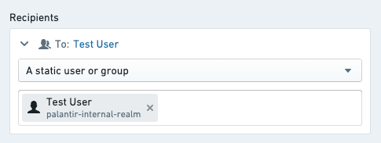

# Set up a notification设置通知

This tutorial demonstrates how to set up an action with a notification.本教程演示如何设置带有通知的操作。

We will be using an action which updates the `Priority` property of an `Alert` object, and also notifies the `Assignee` (a Foundry user) which is stored as a property on that Alert object. If you want to follow along, you'll need to have the following already set up:我们将使用一个操作，该操作更新 Priority 属性的 Alert 对象，并通知存储在该 Alert 对象属性上的 Assignee （一个 Foundry 用户）。如果您想跟着学，您需要事先设置以下内容：

- An object with the correct properties and configured to be editable via actions一个具有正确属性且配置为可通过操作进行编辑的对象
- An action which takes in one of your objects as well as a parameter containing the new priority and updates the priority property on the specified object. If you previously followed [the tutorial on getting started with actions](/docs/foundry/action-types/getting-started/), you should already have this set up.一个动作，它接收你的一个对象以及一个包含新优先级的参数，并在指定的对象上更新优先级属性。如果你之前跟随过关于如何开始使用动作的教程，你应该已经设置好了这个功能。

If you are new to managing objects, you can read about [how to set up an object type](/docs/foundry/object-link-types/create-object-type/).如果你是管理对象的新手，你可以阅读关于如何设置对象类型的说明。

## Prerequisites前提条件

### Complete the Getting Started tutorial完成《开始使用》教程

This tutorial assumes you already completed the [Getting Started](/docs/foundry/action-types/getting-started/) tutorial for actions.本教程假定您已经完成了针对操作的入门教程。

### Add the assignee property to your object type为您的对象类型添加 assignee 属性

For this tutorial, you will need to have a property on the `Alert` object that is called `Case Managers` and contains the Foundry user ID for the currently assigned user. Typically, if you are using actions to construct your workflow, you will be able to capture and store user IDs with the user selector components in your application. These will show up as full usernames wherever they are displayed in Foundry.在本教程中，您需要在 Alert 对象上添加一个名为 Case Managers 的属性，该属性包含当前分配用户的 Foundry 用户 ID。通常情况下，如果您使用操作来构建工作流，您将能够通过应用程序中的用户选择组件捕获并存储用户 ID。这些 ID 将在 Foundry 的任何显示位置以完整用户名形式显示。

## Add a notification添加一个通知

First, navigate to your action that updates the ticket priority. Under the **Rules** section select **Add new rule**, followed by **Notification**. This will open the configuration dialog for adding a notification.首先，导航到更新工单优先级的操作。在规则部分选择添加新规则，然后选择通知。这将打开添加通知的配置对话框。

## Configure recipients配置接收者

For this example, you will send the notification to the assignee, which is stored as a property of the `Alert` object being edited. To do this, use the option "Recipient(s) from property of object parameter" in the **Recipients** dropdown. Select the `Alert` object that is available as a parameter to the action, then select the `Case managers` property when prompted.在这个示例中，您将向指派者发送通知，指派者存储为正在编辑的 Alert 对象的属性。为此，请在接收者下拉菜单中使用选项“从对象参数的属性接收者”。选择作为操作参数可用的 Alert 对象，然后在提示时选择 Case managers 属性。

You should see the selected object parameter and property displayed in the **Recipients** section of the configuration. Keep in mind that the recipient must always be a Foundry user ID. If this property contains something else such as string email addresses, no notifications will be sent.您应该会在配置的接收者部分看到所选的对象参数和属性。请记住，接收者必须始终是 Foundry 用户 ID。如果此属性包含其他内容，例如字符串电子邮件地址，则不会发送通知。

For testing, you may initially want to configure the action with hardcoded recipient(s) that can be used to validate the logic and notification content is configured as expected.在测试时，您可能最初希望使用硬编码的接收者来配置该操作，以便验证逻辑和通知内容是否按预期配置。

[Learn more about other recipient configuration options.了解更多其他接收者配置选项。](/docs/foundry/action-types/notifications/#recipients)

## Configure notification content配置通知内容

Next, you will configure the content of the notification by customizing the notification to address the recipient by name and including the old and new priority of the `Alert` object in the content. An example notification configuration is available below.接下来，您将通过自定义通知来配置内容，包括按收件人姓名称呼，并在内容中包含 Alert 对象的旧优先级和新优先级。以下是一个示例通知配置。

First, select "Template" from the content options. This is the most straightforward way to configure the content and does not require writing any code.首先，从内容选项中选择“模板”。这是配置内容最直接的方法，无需编写任何代码。

For the subject line, enter your desired message. To add a parameter reference, add a forward slash `/` and select the desired parameter from the dropdown list.  If your selection is an object parameter, you will be asked to select which property you want to reference.在主题行中输入您想要的消息。要添加参数引用，请输入正斜杠 / 并从下拉列表中选择所需的参数。如果您的选择是对象参数，系统将要求您选择要引用的属性。

For the body, enter text that addresses the recipient by name, identifies the user who made a change, and reports the previous and updated status.对于正文，输入应包含称呼收件人姓名的内容，指明做出更改的用户，并报告之前和更新的状态。

As with the object reference in the subject, you can select the "Recipient", "Current User", and any parameter options from the dropdown list in order to generate the correct reference to those user attributes.与主题中的对象引用类似，您可以从下拉列表中选择"收件人"、"当前用户"以及任何参数选项，以生成正确的用户属性引用。

[Learn how to generate notification content with more complex requirements.学习如何生成具有更复杂要求的通知内容。](/docs/foundry/action-types/notifications/#content)

## Configure a link配置链接

Finally, you will add a link to the Object View of the specified `Alert` in Object Explorer. Select "Object View" and then select your ticket object parameter from the dropdown. Then, add a label for the link button that reads `View Ticket`.最后，你将在对象浏览器中为指定的 Alert 添加一个链接到对象视图。选择"对象视图"，然后从下拉列表中选择你的票证对象参数。接着，为链接按钮添加一个标签，内容为 View Ticket 。

Now you are ready to save your entire notification configuration:现在你已准备好保存整个通知配置：

[Learn more about other types of links that can be configured.了解更多可以配置的其他类型的链接。](/docs/foundry/action-types/notifications/#content)

## Send a test notification发送测试通知

To verify, create a test alert with yourself as the assignee. In order to run the action, you will then need to expose the action in Object Explorer or via a button in a Workshop module as described in the [actions documentation](/docs/foundry/workshop/actions-overview/).为验证，请以自己为负责人创建一个测试警报。然后，您需要按照动作文档中的说明，在对象浏览器中公开该动作，或在工作室模块中的按钮上运行该动作。

Once you've made a test change, you should receive both an in-platform push notification and an email notification to the email account specified on your Foundry user profile. Previews for both in-platform and email notifications are displayed within the notification configuration view.一旦您进行了测试更改，您应该会收到平台内推送通知和发送到您 Foundry 用户资料中指定邮箱的邮件通知。平台内和邮件通知的预览将在通知配置视图中显示。

If you did not receive an email, it may be because you have email and/or in-platform notifications disabled. You can verify this in **Notifications** under **User Settings**.如果你没有收到邮件，可能是因为你已经禁用了电子邮件和/或在平台内的通知。你可以在用户设置中的通知里验证这一点。

## Next steps下一步

- Explore other optional features, such as [custom content](/docs/foundry/action-types/notifications/#content-components) for when the recipient chooses to receive notifications via email.探索其他可选功能，例如当收件人选择通过电子邮件接收通知时的自定义内容。
- Configure complex logic for recipients or content using [functions](/docs/foundry/functions/configure-notifications/).使用函数为接收者或内容配置复杂逻辑。

