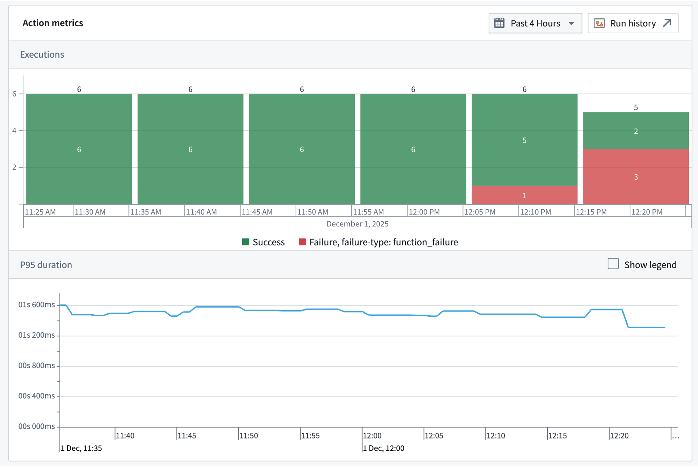

# Action metrics操作指标

Action metrics display the near real-time usage of an action type over the last 30 days. You can access these metrics from the action type's overview page in [Ontology Manager](/docs/foundry/ontology-manager/overview/), or in [Workflow Lineage](/docs/foundry/workflow-lineage/overview/) by selecting the action node for a given execution. The following metrics are available:操作指标显示过去 30 天内操作类型的近实时使用情况。您可以通过本体管理器中的操作类型概览页面，或在工作流谱系中通过选择特定执行的操作节点来访问这些指标。以下指标可用：

- **Success/failure metrics:** Monitor the current status of your actions with success and failure counts. This enables rapid identification of issues and supports proactive troubleshooting, allowing you to address failures as soon as they occur.成功/失败指标：监控操作的成功和失败计数，以了解当前状态。这有助于快速识别问题并支持主动故障排除，让您能够立即处理失败。
- **P95 duration metric:** Track the 95th percentile (P95) execution duration for each action type. This metric highlights the upper range of execution times, helping you detect performance bottlenecks and optimize workflows for consistent and efficient operation.P95 持续时间指标：跟踪每个操作类型的 95 分位数（P95）执行持续时间。此指标突出显示执行时间的上限范围，帮助您检测性能瓶颈并优化工作流以实现一致高效的运行。

You are also able to access [run history](/docs/foundry/aip-observability/run-history/), which provides a complete view of a given action's executions over the past seven days. Learn more about [AIP Observability](/docs/foundry/aip-observability/overview/).您还可以访问运行历史记录，它提供了过去七天中特定操作的完整执行视图。了解更多关于 AIP 可观察性。

All metrics are updated in near real-time using the latest data from the Foundry Telemetry Service (FTS). This ensures you have access to the most current information for monitoring, debugging, and maintaining the health of your actions.所有指标都使用 Foundry Telemetry Service（FTS）的最新数据以近乎实时的方式更新。这确保您能够获取用于监控、调试和维护操作健康状态的最最新信息。

## Action failure types操作失败类型

Action metrics do not require action logs to be displayed. Unlike action logs, action metrics track failures.操作指标无需操作日志即可显示。与操作日志不同，操作指标跟踪失败。

Action metrics have a variety of categories of failures that may be displayed. These categories are:操作指标有多种可能显示的失败类别，这些类别包括：

- **Invalid parameter failure:** The action was submitted with a parameter or parameters that are not valid within the context of the action.无效参数失败：操作提交时使用了在操作上下文中无效的参数或参数。
- **Scale limit failure:** The action affected more than the permitted limit of object types (by default, usually 10,000).规模限制失败：操作影响了超过允许的对象类型限制（默认情况下，通常是 10,000 个）。
- **Authentication failure:** The user did not pass the security submission criteria for the action.认证失败：用户未通过操作的提交安全标准。
- **Side effect failure:** The action failed due to a webhook or an incorrectly configured side effect.副作用失败：由于 webhook 或配置错误的副作用导致操作失败。
- **Function failure:** The action failed because the underlying function failed. This failure mode is only possible for function-backed actions.函数失败：由于底层函数失败导致操作失败。这种失败模式仅适用于基于函数的操作。
- **Unclassified failure:** The action failure did not fall into any of the above categories.未分类失败：操作失败不属于上述任何类别。

## Permissions权限

To view action metrics, you must be a `viewer` on the action.要查看操作指标，您必须是该操作的 viewer 成员。

