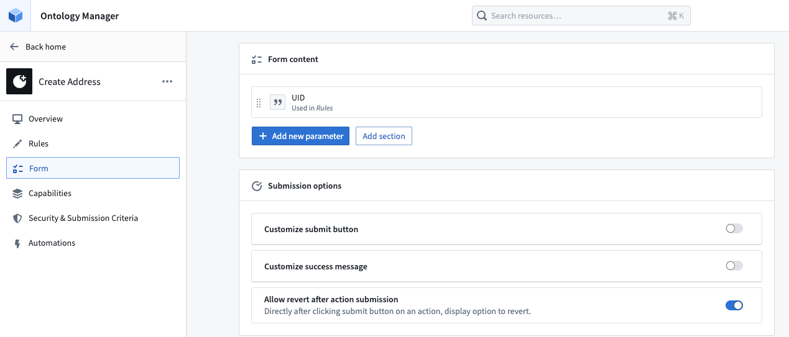
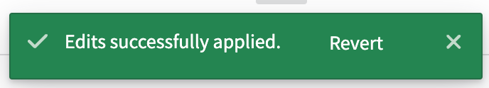
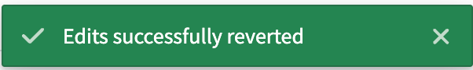

# Revert or undo actions撤销或撤回操作

Action reverts in [Ontology Manager](/docs/foundry/ontology-manager/overview/) allow an action to be reverted (that is, undone) immediately after the action has been applied. You can revert an action by selecting **Undo** in the success message after any successful action application.在本体管理器中，操作撤回允许在操作应用后立即撤回（即撤销）该操作。您可以通过在成功应用任何操作后的成功消息中选择“撤销”来撤回操作。

New actions are revertible by default.新操作默认可撤回。

Action reverts are only available for Object Storage V2; meaning that only actions that modify or create an object type in [OSv2](/docs/foundry/object-backend/object-storage-v2-breaking-changes/) can be reverted. If your object types are not currently stored in Object Storage V2, you can migrate by following this [guide](/docs/foundry/object-backend/osv1-osv2-migration/#migrate-from-object-storage-v1-phonograph-to-object-storage-v2).操作撤回仅适用于对象存储 V2；这意味着只有修改或创建 OSv2 中对象类型的操作才能被撤回。如果您的对象类型当前未存储在对象存储 V2 中，您可以通过遵循此指南进行迁移。

## Configure a revertible action配置可撤销操作

Currently, actions can only be reverted by the user who applied the action.目前，只有执行操作的用户可以撤销操作。

In the **Form** tab of an action, toggle on the **Allow revert after action submission** button. Once this toggle is correctly configured and saved to the Ontology, your action can be reverted.在操作的表单选项卡中，打开“提交操作后允许撤销”按钮。一旦此开关正确配置并保存到本体中，您的操作即可被撤销。

The **Allow revert after action submission** toggle in the **Form** tab will be enabled by default for actions created after May 2024 that only modify OSv2 object types.
If an action existed before May 2024 and modifies an object type in OSv2, action reverts will not be toggled on by default but can be manually enabled.对于 2024 年 5 月之后创建且仅修改 OSv2 对象类型的操作，表单选项卡中的“提交操作后允许撤销”开关将默认启用。如果操作在 2024 年 5 月之前存在且修改了 OSv2 中的对象类型，操作撤销将不会默认开启，但可以手动启用。

You will not be able to revert an action if it only modifies OSv1 object types.如果你只修改了 OSv1 对象类型，将无法撤销该操作。

## Revert an action撤销操作

Revert action撤销操作The toast below is your only opportunity to revert the action. This is especially important to note when performing delete actions.下面的提示是你唯一的机会来撤销操作。在执行删除操作时尤其需要注意这一点。

Once reverted successfully, users will see a similar toast to the original action success as shown below.一旦成功恢复，用户将看到与原始操作成功类似的提示，如下所示。

Edits applied:已应用编辑：

Edits reverted:已恢复编辑：

## Caveats注意事项

An action revert may fail in some cases:某些情况下，操作撤销可能会失败：

- An action on an object cannot be reverted once any subsequent edit has been made to the object, even if the edit is on a different property. In other words, an action on an object can only be reverted if the action is the most recent edit to an object.一旦对象有任何后续编辑，即使编辑的是不同属性，对象上的操作也无法撤销。换句话说，只有当操作是对象最新的编辑时，才能撤销对象上的操作。
- An action cannot be reverted if action reverts has been toggled off after action submission, even if action reverts have been toggled on again.如果在提交操作后关闭了操作撤销功能，即使之后又重新开启，操作也无法撤销。

An action revert only reverts the edits to the object instance, but it will not revert side effects, such as notifications or webhooks, nor will it call them in the same way that the applied action would have.一个操作回滚仅会撤销对对象实例的修改，但不会撤销副作用，例如通知或 Webhooks，也不会像应用操作那样调用它们。

### Undoing a delete action without the revert action toast在不使用撤销操作吐司的情况下撤销删除操作

If a delete action is performed and you wish to undo the deletion, but the revert action toast is no longer available, the only remediation options available are to:如果执行了删除操作，您希望撤销删除，但还原操作的提示不再可用，唯一可用的补救选项是：

- Migrate to a new object type and copy over the desired edits using functions; or迁移到新的对象类型，并使用函数复制所需的编辑；或
- Drop all edits on the object type.放弃对象类型上的所有编辑。

