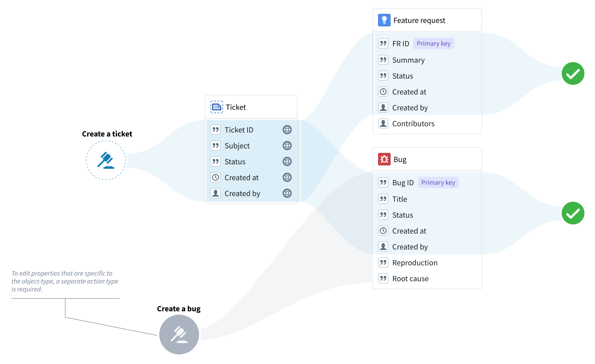
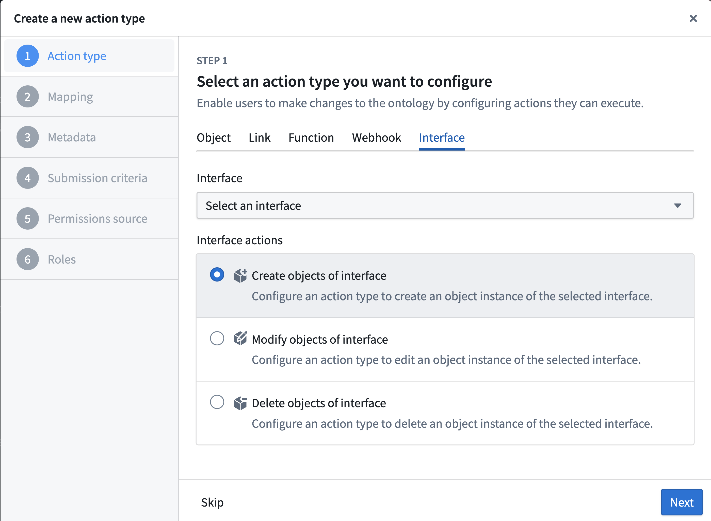
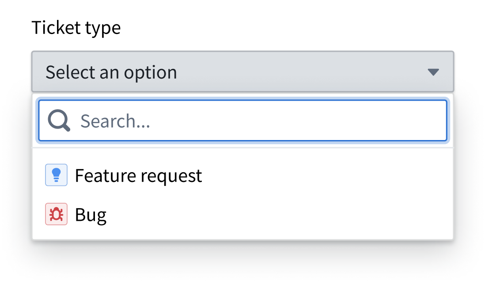
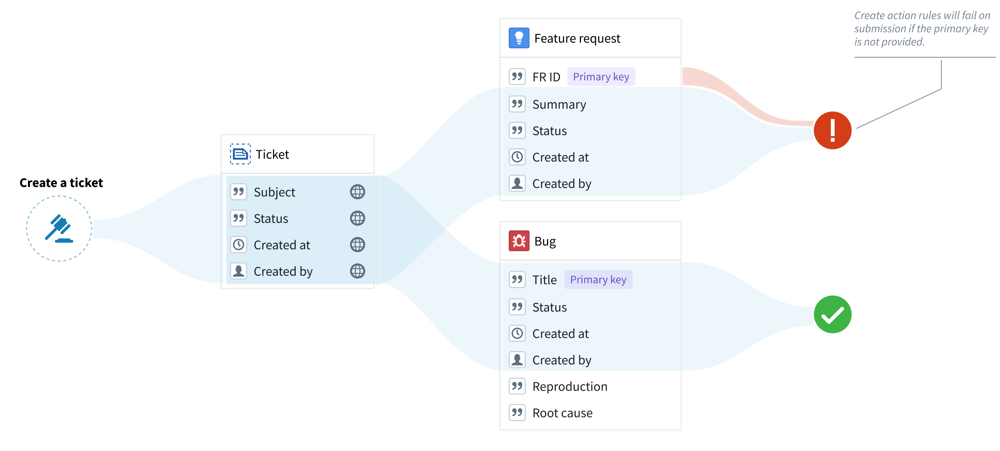
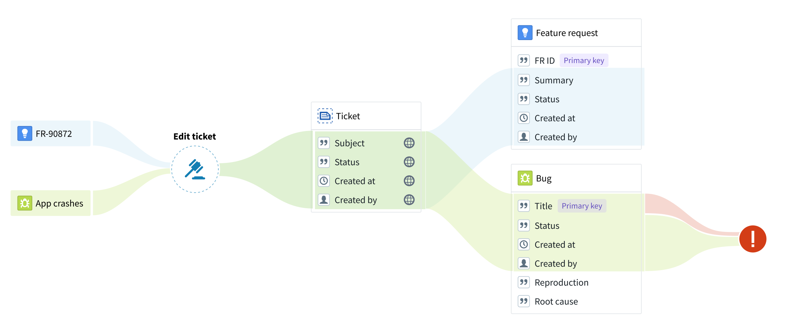

# Actions on interfaces接口上的操作

You can create generic actions that apply to all objects of a chosen interface. There are two main ways you can use interfaces from within actions:您可以创建通用的操作，这些操作适用于所选接口的所有对象。您可以在操作中通过两种主要方式使用接口：

- **Interface action rules:** To create, modify and delete objects of the configured interface.接口操作规则：创建、修改和删除配置的接口对象。
- **Interface reference parameters:** To reference objects of the configured interface. This parameter is required by the "Modify" and "Delete" interface action rules, but can also be used by any other action rules.接口引用参数：引用配置的接口对象。此参数是“修改”和“删除”接口操作规则所必需的，但也可以被任何其他操作规则使用。

## Using action on interface rules使用接口操作规则

You can use interface action rules whenever the edits can apply to all the object types that implement the interface. In other words, you can use interface action rules only to modify the *interface shared properties* or to delete objects. For example, if “Feature request” and “Bug” are object types of the “Ticket” interface, you can use a “Create a ticket” action type to create bugs and feature requests, but you cannot create any property types that are specific to bugs or feature requests.当编辑可以应用于实现该接口的所有对象类型时，您可以使用接口操作规则。换句话说，您只能使用接口操作规则来修改接口共享属性或删除对象。例如，如果“功能请求”和“错误”是“工单”接口的对象类型，您可以使用“创建工单”操作类型来创建错误和功能请求，但您不能创建任何特定于错误或功能请求的属性类型。

### Creating a new interface action type创建新的接口操作类型

To set up a new interface action type, choose **Action type** from the **New** menu in Ontology Manager.要设置新的接口操作类型，请从本体管理器中的新建菜单选择操作类型。

1. Under **Interfaces**, pick the desired interface and rule type.在接口下，选择所需的接口和规则类型。

1. Add the shared properties that you want to include in the action (if applicable).添加您希望包含在操作中的共享属性（如果适用）。
2. Add metadata to describe your action type. Remember that this metadata should apply to all the object types that implement the interface.为您的操作类型添加元数据以进行描述。请记住，这些元数据应适用于所有实现该接口的对象类型。
3. Under **Submission criteria**, choose the users that can execute the action (you can apply more complex criteria later on). Remember that these permissions will apply to all object types that implement the interface, as long as the user has permissions to edit them.在提交标准下，选择可以执行操作的用户（您可以在稍后应用更复杂的标准）。请记住，只要用户有权限编辑它们，这些权限将适用于所有实现该接口的对象类型。
4. Select **Create** to finalize the action type.选择“创建”以完成动作类型的设置。

### “Create” actions on interfaces界面上的“创建”动作

Because the action type is only associated with an interface, an “Object type” parameter will be automatically generated to indicate the object type that should be created. If using a form or a table, the user will be prompted to pick an object type from a list.因为动作类型仅与界面相关联，将自动生成一个“对象类型”参数来指示应创建的对象类型。如果使用表单或表格，用户将提示从列表中选择对象类型。

Note that **objects cannot be created without a primary key**. Therefore, any object type without a primary key assigned in the rule will fail during submission. To avoid failures of this type, make sure that both the interface and the Create rule include an interface property that can be used as the primary key in the object types that implement the interface.请注意，如果没有主键，对象无法创建。因此，如果在规则中未为任何对象类型分配主键，则在提交时将失败。为了避免此类失败，请确保接口和创建规则都包含一个接口属性，该属性可以作为实现该接口的对象类型的主键。

### “Modify” actions on interfaces“修改”接口上的操作

"Modify" rules on an interface can modify any object of the configured interface. An “interface reference” parameter will be generated, constrained to the selected interface. The "interface reference" parameter is similar to the “object reference” parameter, with the exception that the "interface reference" parameter shows objects of any type that implements the interface. If using a form or a table, the user could then pick an object from a list."Modify" 规则可以修改任何符合配置接口的对象。会生成一个“接口引用”参数，该参数受限于所选接口。 “接口引用”参数与“对象引用”参数类似，不同之处在于“接口引用”参数显示所有实现该接口的类型对象。如果使用表单或表格，用户可以从列表中选择对象。

Note that primary key values *cannot be modified* by any action type.  Therefore, an action will fail on submission if the action tries to modify a primary key property for a selected object type. Always ensure that the action rule does not modify properties that are likely to be used as a primary key by some of the object types that implement the interface.请注意，主键值无法被任何动作类型修改。因此，如果动作尝试修改所选对象类型的主键属性，动作在提交时会失败。始终确保动作规则不会修改那些可能被实现该接口的对象类型用作主键的属性。

In the example below, the “Title” property is incorrectly used as the primary key for the “Bug” object type. The “Edit ticket” action will fail on submission because the action attempts to change the primary key of the bug.在下面的示例中，“Title”属性被错误地用作“Bug”对象类型的主键。“编辑工单”动作在提交时会失败，因为该动作尝试更改 Bug 的主键。

### "Delete" actions on interfaces界面的"删除"操作

"Delete" action rules can have an "interface reference" parameter assigned to them, instead of an object reference parameter. This interface reference, constrained to a specific interface, will indicate the object to be deleted. If using a form or a table, the user could then pick an object from a list."删除"操作规则可以分配一个"接口引用"参数，而不是对象引用参数。这个接口引用被限制在特定接口上，将指示要删除的对象。如果使用表单或表格，用户可以从列表中选择一个对象。

### Executing actions on interfaces在界面上执行操作

Actions created with interface action rules can be applied to objects whose object type implements the interface, just like any object-specific action type. For a given object, all object-type-specific and interface-based actions that can be applied to that object will appear in the action dropdown.使用接口动作规则创建的动作可以应用于实现了该接口的对象类型，就像任何对象特定动作类型一样。对于给定对象，所有可以应用于该对象的对象类型特定和基于接口的动作都会出现在动作下拉列表中。

## Permissions权限

Interface action rules follow the same permissions as object action types.接口动作规则遵循与对象动作类型相同的权限。

See the documentation on [action type permissions](/docs/foundry/action-types/permissions/) for more details.有关动作类型权限的更多信息，请参阅文档。

## Level of support支持级别

As support for interface action rules and reference parameters expands, availability will vary across the Palantir platform.随着对界面操作规则和引用参数的支持扩展，Palantir 平台上的可用性将有所不同。

### Supported applications and services支持的应用和服务

- **Ontology Manager:** Creation of interface action types and configuration of interface parameters in submission criteria and overrides.本体管理器：创建界面操作类型和在提交标准和覆盖中配置界面参数。
- **Object Explorer and Object Views:** Rendering of actions defined on interfaces.对象浏览器和对象视图：接口上定义的操作的渲染。

### Limitations of interface action rules接口操作规则的局限性

- Action logs are not yet supported.操作日志尚未支持。
- Link edits are not yet supported (with the exception of 1-to-many links, accomplished by editing the foreign-key property).链接编辑尚未支持（1 对多链接除外，通过编辑外键属性完成）。
- Actions on interfaces cannot be used with functions.接口上的操作不能与函数一起使用。

