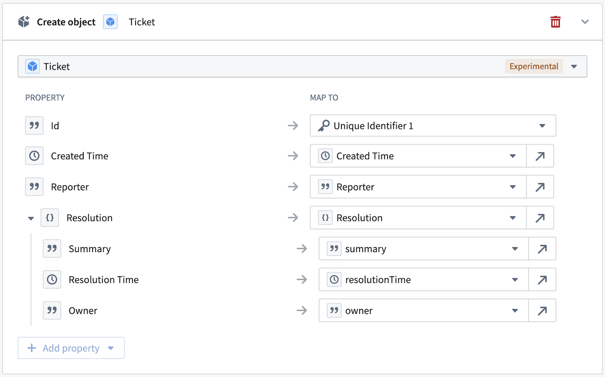
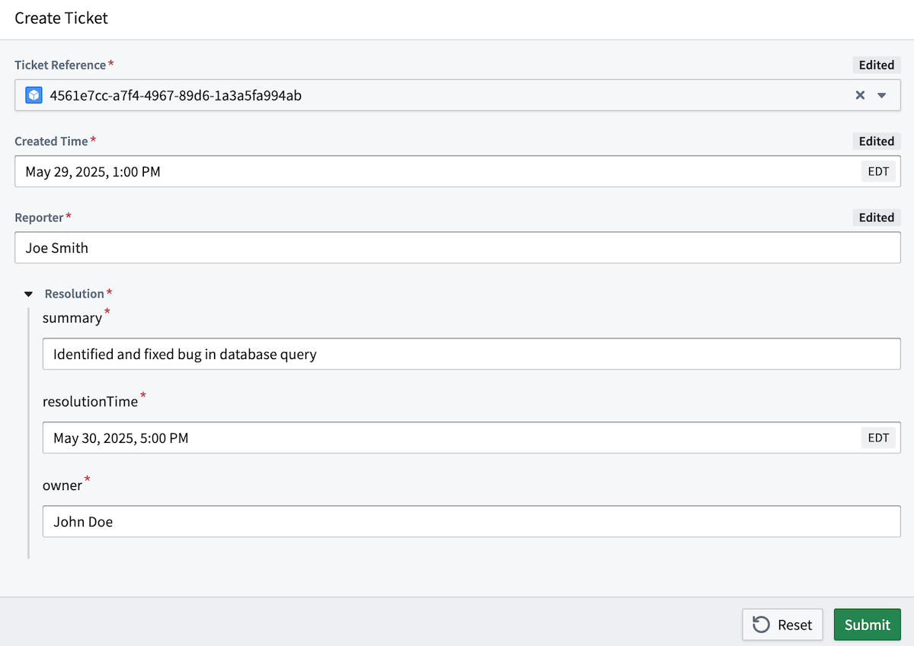
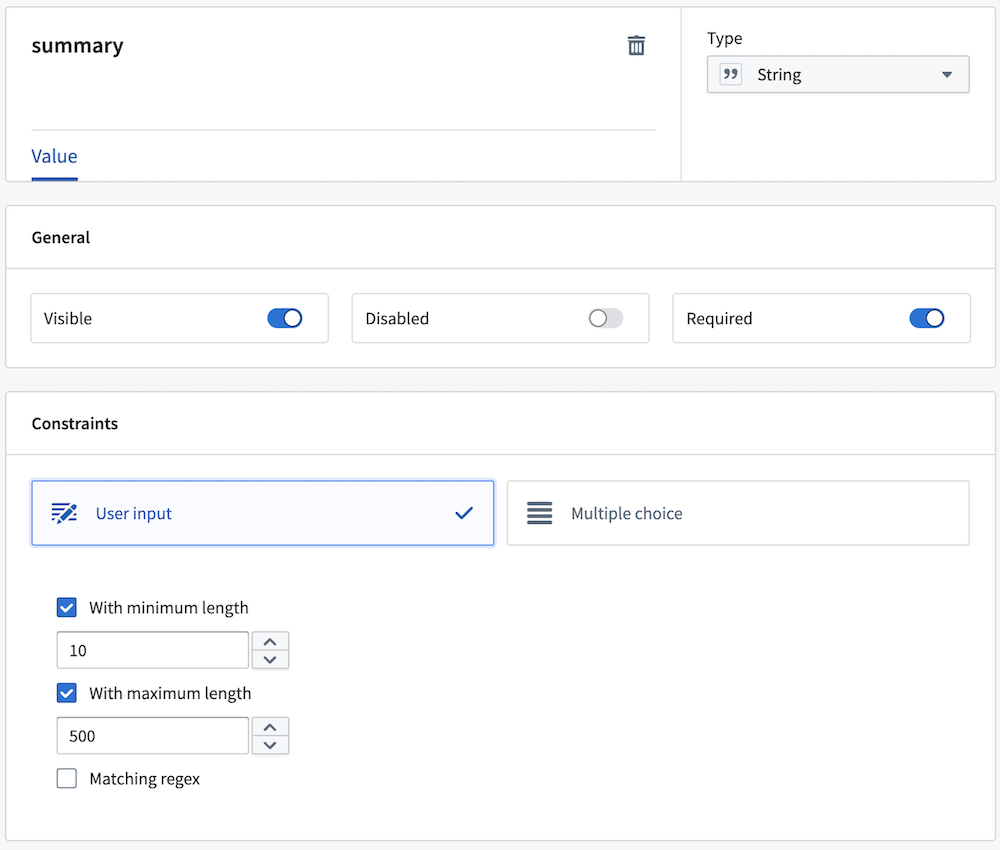
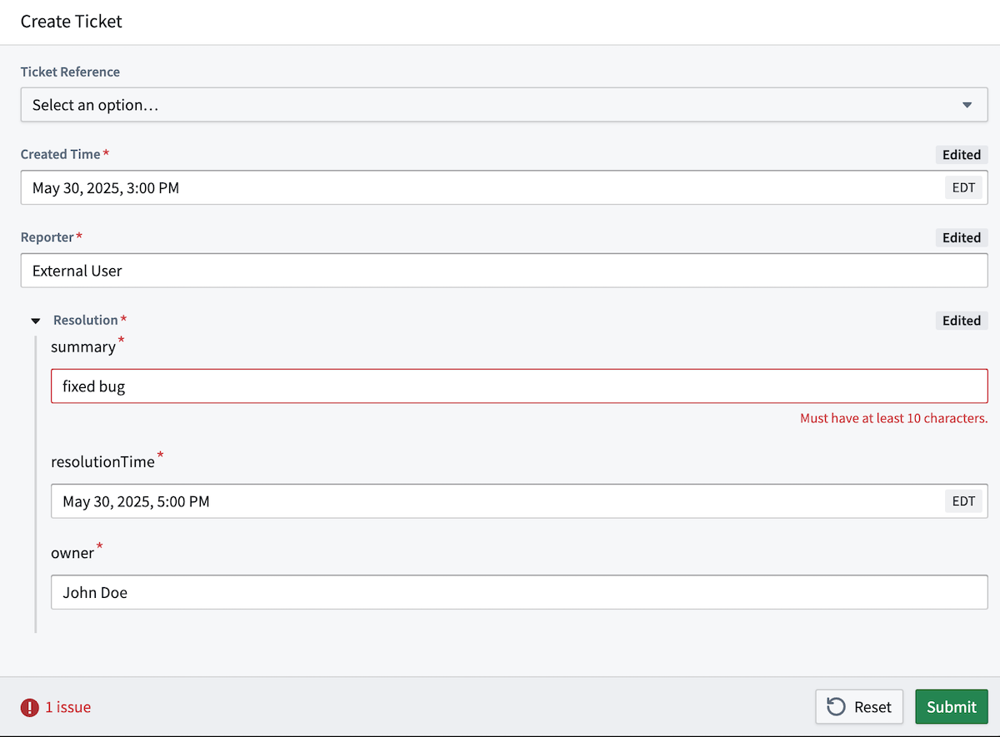

# Actions on structs结构体上的操作

[Struct property](/docs/foundry/object-link-types/structs-overview/) values can be created and modified with actions, through values supplied in a struct parameter.结构体属性值可以通过操作来创建和修改，通过在结构体参数中提供的值。

## Struct parameters结构体参数

A struct parameter is a parameter of base type `STRUCT`, where the type contains nested parameter fields that have their own individual names and base types. A struct parameter can be only be used to supply values for a struct property. The supported base types for struct parameter fields are  `BOOLEAN`, `DATE`, `DOUBLE`, `GEOPOINT`, `INTEGER`, `LONG`, `STRING`, and `TIMESTAMP`.结构体参数是基础类型 STRUCT 的参数，其中包含嵌套的参数字段，这些字段有自己的独立名称和基础类型。结构体参数只能用于为结构体属性提供值。结构体参数字段支持的基础类型有 BOOLEAN 、 DATE 、 DOUBLE 、 GEOPOINT 、 INTEGER 、 LONG 、 STRING 和 TIMESTAMP 。

Below, we have a `Resolution` struct parameter for a `Create Ticket` action. The nested fields of `summary`, `resolutionTime`, and `owner` compile information on how the ticket was resolved into a single parameter.下面是一个 Resolution 结构参数，用于 Create Ticket 动作。 summary 、 resolutionTime 和 owner 的嵌套字段编译了关于工单如何被解决为单个参数的信息。

## Defining actions on struct properties在结构属性上定义动作

Using actions with struct parameters, you can create and modify object types with struct properties. The values for the struct property are submitted in a struct parameter mapped to the property; each individual field of the struct property is mapped to a specific field of a struct parameter. In the example below, each field of the `Resolution` struct parameter is mapped to its corresponding field in the `Resolution` struct property of the `Ticket` object type.使用具有结构参数的动作，您可以创建和修改具有结构属性的对象类型。结构属性的值通过映射到该属性的参数结构提交；结构属性的每个字段映射到结构参数的特定字段。在下面的示例中， Resolution 结构参数的每个字段映射到 Ticket 对象类型的 Resolution 结构属性中的相应字段。

A mapping between a struct property and a struct parameter must be complete, with each field of the struct property mapped to a field in the struct parameter. The base type of the struct parameter field *must* match the base type of a mapped struct property field. If any breaking changes are to be made to the struct property type (for example, if a new field is added, a field is deleted, or a field's base type is changed), then the related action types must also be modified to incorporate those changes.结构属性和结构参数之间的映射必须是完整的，结构属性的每个字段必须映射到结构参数中的一个字段。结构参数字段的基类型必须与映射的结构属性字段的基类型匹配。如果要对结构属性类型进行任何破坏性更改（例如，如果添加了新字段、删除了字段或更改了字段的基类型），则相关的动作类型也必须修改以包含这些更改。

### Struct parameters in an action form动作表单中的结构参数

A struct parameter can be populated through action forms similarly to any other parameter type. However, struct parameter fields are rendered as a group in the form instead of individually.结构参数可以通过操作表单与其他参数类型类似地进行填充。然而，结构参数字段在表单中是作为一个组来渲染的，而不是单独地。

## Default values for struct parameter fields结构体参数字段的默认值

Default values are defined individually for struct parameter fields. Each struct parameter field is mapped to fields of a specified object type's struct property. A default value must be defined for all fields in the struct parameter and must be mapped to fields of the same object type struct property. Only struct property fields can act as default values for struct parameter fields. The object type whose struct property fields will act as default values is specified in the `ObjectReference` parameter.结构体参数字段分别定义默认值。每个结构体参数字段映射到指定对象类型的结构体属性字段。结构体参数中所有字段都必须定义默认值，并且必须映射到相同对象类型的结构体属性字段。只有结构体属性字段可以作为结构体参数字段的默认值。用作默认值的对象类型在其结构体属性字段中指定，通过 ObjectReference 参数指定。

An instance of an object of the type specified in the `ObjectReference` parameter is supplied when submitting the action, and that object's struct property field values will automatically fill in the values of the corresponding struct parameter fields.提交操作时，会提供指定在 ObjectReference 参数中对象类型的实例，该对象的结构属性字段值将自动填充到对应的结构参数字段中。

## Constraints on struct parameter fields结构参数字段的约束

Constraints can be configured individually for struct parameter fields, as with regular parameters. For example, a string length constraint can be defined on struct parameter fields of string types to only allow string value that are between 10 and 500 characters long. This would mean that the `summary` field of a the `Resolution` struct parameter must be at least 10 characters long, but no longer than 500 characters.约束可以单独为结构参数字段进行配置，就像常规参数一样。例如，可以定义一个字符串长度约束，用于结构参数字段的字符串类型，以仅允许长度在 10 到 500 个字符之间的字符串值。这意味着 Resolution 结构参数的 summary 字段长度至少为 10 个字符，但不超过 500 个字符。

A struct parameter value is *only* valid if *all* fields meet the defined constraint. Users can only submit a struct parameter value if each field value satisfies the constraints defined on them. As defined for the `summary` field, a value shorter than 10 characters would be invalid.结构体参数值只有在所有字段都满足定义的约束时才有效。用户只能提交结构体参数值，如果每个字段的值都满足其上定义的约束。根据 summary 字段的定义，长度少于 10 个字符的值将是无效的。

## Limitations限制

Consider the following limitations when creating or modifying struct parameters with actions:在创建或修改结构参数时，请考虑以下限制：

- Struct property values can only be created or modified through *struct parameters*. Other forms of entry, such as static values or references to object properties, are not supported.结构属性值只能通过结构参数创建或修改。不支持其他形式的输入，如静态值或对象属性引用。
- A struct property can only be created or modified through a *single* struct parameter. A struct property mapping in actions cannot more than one parameter.结构属性只能通过单个结构参数创建或修改。在动作中的结构属性映射不能超过一个参数。
- A struct parameter can only be used to create or modify *struct* properties. Struct parameter fields cannot be used individually to create or modify non-struct properties.结构参数只能用于创建或修改结构属性。结构参数字段不能单独用于创建或修改非结构属性。
- Only references to *a single object type struct property values* can act as default values for struct parameter fields. Other forms of entry, such as static values, are not supported.只有单个对象类型 struct 属性的值可以作为 struct 参数字段的默认值。其他形式的输入，如静态值，是不支持的。

