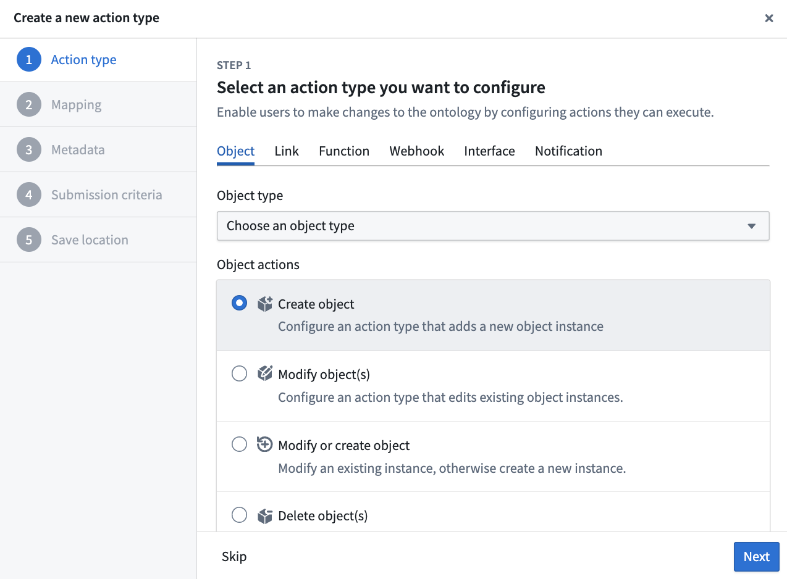
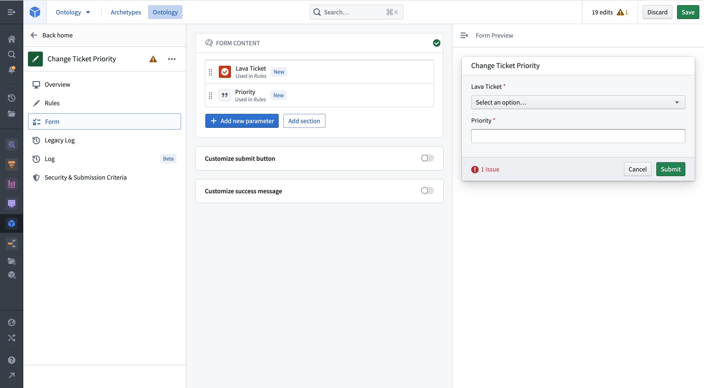
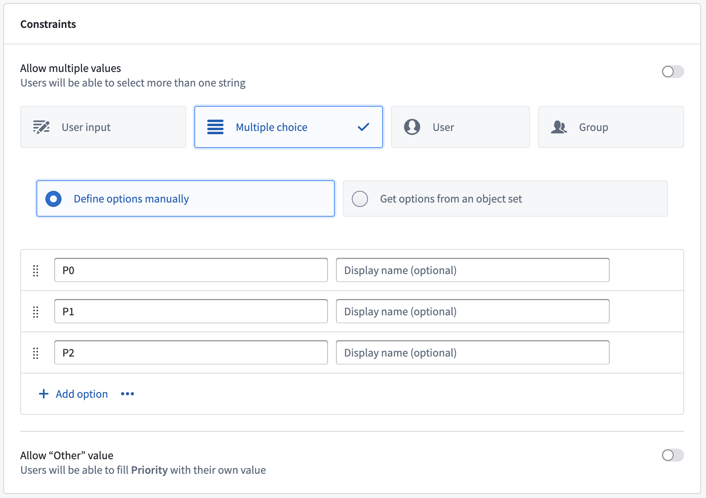
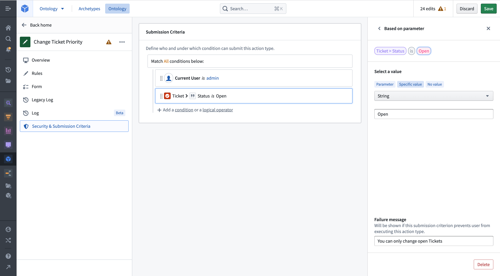
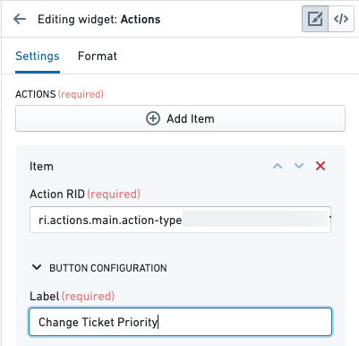
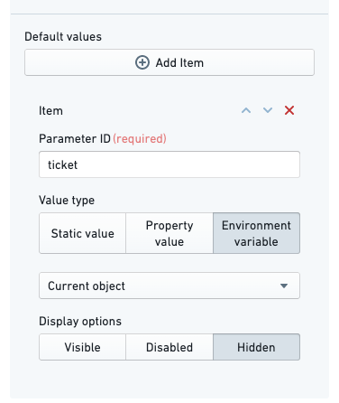
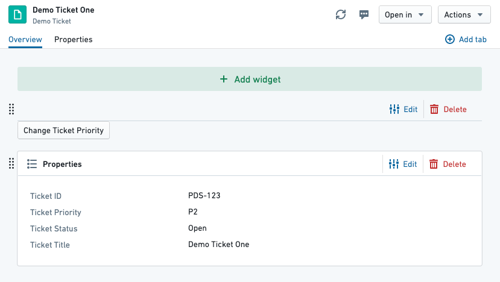
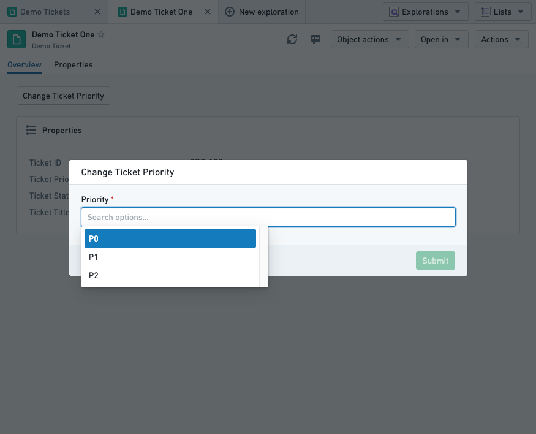
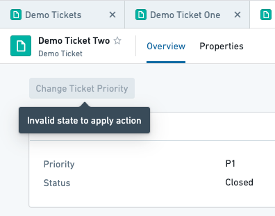

# Getting started入门

In this guide, we will create a simple action type for changing the priority on a ticket.在本指南中，我们将创建一个简单的动作类型，用于更改工单的优先级。

We will configure submission criteria to make sure that the priority is `P0`, `P1` or `P2`, and that the ticket status is `Open`.我们会配置提交标准，确保优先级为 P0、P1 或 P2，且工单状态为 “打开 ”。

## Prerequisites前提条件

For this guide, we will use a `Demo Ticket` object type, which has four properties:在本指南中，我们将使用一个演示工单对象类型，它包含四个属性：

- `Ticket ID`
- `Title`
- `Priority`
- `Status`

We also have two demo objects available:我们还提供两个演示对象：

| Ticket ID票务识别码 | Title标题 | Status地位 | Priority优先级 |
| --- | --- | --- | --- |
| PDS-123 | Demo Ticket One演示票一 | Open打开 | P2 |
| PDS-124 | Demo Ticket Two演示票二 | Closed关闭 | P1 |

You can recreate these in your Ontology if desired, but it is not essential.如果愿意，你可以在本体论中重现这些，但这并非必须。

Note that for a user to be able to take an action defined in an action type configuration, [additional configuration is required](/docs/foundry/object-link-types/allow-editing/#set-up-the-prerequisites). If running Object Storage V2, the user must enable edits with a toggle. If running Object Storage V1 (Phonograph), a writeback dataset must be created. Note that [Object Storage V1](/docs/foundry/object-databases/object-storage-v1/) is in a legacy phase of development; we recommend [migrating to Object Storage V2](/docs/foundry/object-backend/osv1-osv2-migration/).注意，用户要执行动作类型配置中定义的动作， 需要额外的配置 。如果运行对象存储 V2，用户必须通过切换来启用编辑。如果运行对象存储 V1（留声机），必须创建一个写回数据集。注意对象存储 V1 目前处于遗留开发阶段;我们建议迁移到对象存储 V2。

## Create a new action type创建一个新的动作类型

We start by creating a new action type for changing the ticket's priority. In the Ontology Manager, select **Action type** on the left sidebar, then choose **New Action type** at the top right of the view.我们首先创建一个新的动作类型来更改工单的优先级。在本体管理器中，选择左侧侧栏的动作类型 ，然后在视图右上角选择新动作类型 。

The creation wizard allows you to configure the most important features of an action type. Enter a **Display name** for your action type. Next, select the **Change object(s)** option and set it to **Modify**. From the following dropdown, select the `Demo Ticket` object type and add the `Priority` property by selecting **Add property**. Finally, select **Create** in the bottom right.创建向导允许你配置动作类型中最重要的功能。输入你的动作类型的显示名称 。接着，选择 “更改对象” 选项，并将其设置为修改 。在下面的下拉菜单中，选择演示工单对象类型，并通过选择添加属性添加优先级属性。 最后，在右下角选择 “创建 ”。

You can now see the full detailed view of your action type. You can make additional adjustments, like adding a **Description** in the **Overview** tab or adding additional properties to modify in the **Rules** tab.你现在可以看到你动作类型的详细视图。你可以做额外调整，比如在概览标签中添加描述 ，或在规则标签中添加可修改的属性。

## Edit parameters编辑参数

Select the **Forms** tab to get an overview of the parameters. The `Ticket` and `Priority` parameter have already been created based by the **Rule**.选择 “表单 ”标签以查看参数概览。 工单和优先级参数已经根据规则创建。

Select the `Priority` parameter to limit the values it can take on. Change the constraints from **User input** to **Multiple choice**. This will allow you to pick what values can be chosen for this parameter. Add `P0`, `P1` and `P2` as options. If you applied your action to an object now, you could change the priority of a ticket to `P0`, `P1`, or `P2`. You will now add submission criteria that will restrict you to only changing the priority for open tickets.选择优先级参数以限制其可取值。将约束从用户输入改为多项选择 。这样你就可以选择该参数可以选择哪些值。添加 P0、P1 和 P2 作为选项。如果你现在对某个对象应用了动作，你可以把工单的优先级改成 P0、P1 或 P2。你现在会添加提交条件，限制你只能更改已开工单的优先级。

## Add submission criteria添加提交标准

Open the submission criteria section in the **Security & Submission Criteria** tab from the sidebar. Create a new condition by selecting **Condition** in the **Execution** section. Using the **Parameter** condition template, set a condition on the `Ticket Status` object parameter's `Ticket` property. Using the `is` operator, you can then do an exact string comparison between the ticket status and the specific value `Open`.在侧边栏的 “安全性与提交标准 ”标签页打开提交标准部分。在执行部分选择条件 ，创建新条件。使用参数条件模板，在工单状态对象参数的工单属性上设置条件。利用 is 作符，你可以精确地对比工单状态和具体值 “打开 ”进行对比。

Add a failure message so users can see why an action has failed. Your action definition is now complete, and you can configure it to show up next to the Object View in Object Explorer.添加失败消息，让用户看到作失败的原因。你的动作定义现在已经完成，你可以配置它在对象浏览器的对象视图旁边显示。

## Add the action to an Object View将动作添加到对象视图中

Go to **Demo Ticket One** and edit its Object View. Add a new widget to the top, and choose the **Actions** widget. In the sidebar, select **Add Item.** Copy and paste the action RID from the Ontology Manager and paste it into the Action RID field. Name the label "Change Ticket Priority".进入演示工单一号，编辑其对象视图。在顶部添加一个新控件，然后选择 “动作控件”。在侧边栏，选择添加项目。 从本体管理器复制粘贴动作 RID，粘贴到动作 RID 字段中。给标签命名“更改工单优先级”。

By default, the action form will show every parameter as a field in the action form, including the `Ticket` parameter. Additionally, an action does not know that it should fill the current object in for the `Ticket` parameter. We will configure the action form to hide the ticket field (so the user cannot change the status of a different ticket), and set its value to the current object.
Under **Default value**, select **Add Item**. Type the parameter ID for the `Ticket` parameter—in this tutorial, we set it to `ticket`. Change the value type to **Environment variable** and select **Current object**. Finally, change the display option to **Hidden**.默认情况下，动作表单会将每个参数作为动作表单中的字段显示，包括工单参数。此外，动作并不知道它是否应该为当前对象填入 Ticket 参数。我们会配置作表单，隐藏工单字段（这样用户就无法更改不同工单的状态），并将其值设置为当前对象。在默认值下，选择添加项目 。输入 Ticket 参数的参数 ID——在本教程中，我们设置为 ticket。将值类型改为环境变量 ，并选择当前对象 。最后，将显示选项改为隐藏 。

You will now see the action button on the preview page:你现在会在预览页面看到作按钮：

You can now save and publish the Object View.你现在可以保存并发布对象视图。

## Apply the action应用动作

Visit an open ticket and select the **Change Ticket Priority** button we configured. You should see the action form appear over the view. Clicking into the **Priority** field will show the single selected submission criterion we configured on the parameter:访问一个开放的工单，选择我们设置的更改工单优先级按钮。你应该会看到动作表单显示在视图上方。点击优先级字段，会显示我们在参数上设置的单一选中提交标准：

Pick a priority and select submit. The form will disappear and the object view will update with the new priority. Our submission criteria said that it should not be possible to run this action on a closed ticket—if we open Demo Ticket Two, which is closed, we see the following:选择优先级并选择提交。表单会消失，对象视图会根据新的优先级更新。我们的提交标准是，关闭工单上不应执行此作——如果我们打开已关闭的演示工单二，会看到以下情况：

## Resolve conflicting user edits (actions) and datasource updates解决冲突的用户编辑（作）和数据源更新

Object instances in the Foundry Ontology can be created and modified by both input datasources and user edits/actions. When a single object instance (that is, a row or object with a specific primary key value) receives data from both the input datasource and user edits, these received values must be transparently resolved with a conflict resolution strategy.Foundry 本体中的对象实例可以通过输入数据源和用户编辑/作创建和修改。当单个对象实例（即具有特定主键值的行或对象）同时接收输入数据源和用户编辑数据时，这些接收值必须通过冲突解决策略透明解决。

There are two strategies for resolving conflicts:解决冲突有两种策略：

- Strategy 1: Apply user edits (default)策略一：应用用户编辑（默认）
- Strategy 2: Apply most recent value (may not be available on your enrollment)策略二：应用最新的数值（可能无法在你的注册中获得）

[Learn more about how to resolve conflicting user edits and datasource updates.了解更多关于如何解决用户编辑冲突和数据源更新的信息。](/docs/foundry/object-edits/how-edits-applied/#resolve-conflicting-user-edits-and-datasource-updates)

## Next steps下一步

- [Learn more about action permissions.了解更多关于动作权限的信息。](/docs/foundry/action-types/permissions/)
- [Create a function-backed action.创建一个函数支持的动作。](/docs/foundry/action-types/function-actions-getting-started/)
- [Use an action elsewhere in the platform.在平台的其他地方使用动作。](/docs/foundry/action-types/use-actions/)
- [Resolve conflicting user edits (actions) and datasource updates解决冲突的用户编辑（作）和数据源更新](/docs/foundry/object-edits/how-edits-applied/#resolve-conflicting-user-edits-and-datasource-updates)

