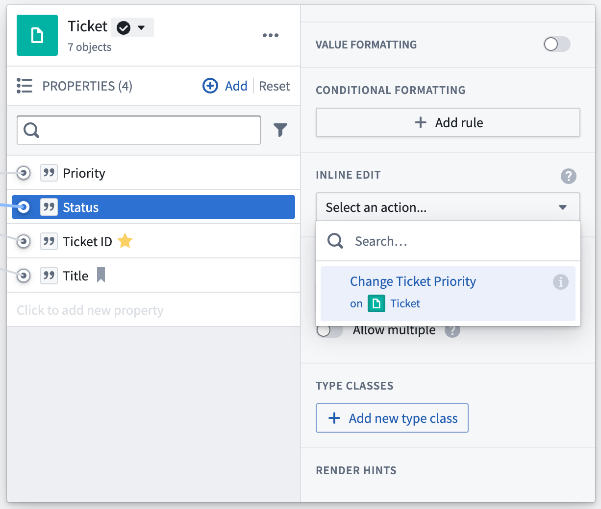

# Inline edits内联编辑

Action-backed inline edits are validated and submitted differently than standard [actions](/docs/foundry/action-types/getting-started/). For standard actions, multiple parameters need to be set in order for the action to be valid. However, for action-backed inline edits, every parameter is optional and defaults to the existing value of the object, so a user can make individual changes to properties one at a time.基于操作的内联编辑与标准操作验证和提交方式不同。对于标准操作，需要设置多个参数才能使操作有效。然而，对于基于操作的内联编辑，每个参数都是可选的，默认值为对象的现有值，因此用户可以逐个修改属性。

This documentation discusses how to avoid unexpected results when using inline edits. Inline edits are available in both Workshop and Object Explorer. The configuration of the inline edit action depends on where the action is used.本文档讨论了如何在使用内联编辑时避免意外结果。内联编辑在 Workshop 和对象浏览器中都可用。内联编辑操作的配置取决于操作的使用位置。

## Object Explorer inline edits对象浏览器内联编辑

Inline edits allow users to quickly edit values of an object in the [Object Explorer results view](/docs/foundry/object-explorer/view-results/) or native Object View widgets, like the property or metric cards widget.内联编辑允许用户在对象浏览器结果视图或原生对象视图小部件（如属性或指标卡片小部件）中快速编辑对象的值。

### Configuration配置

To set up an inline edit action, navigate to the **Properties** tab of your object type and then to the **Interaction** tab in Ontology Manager. Select a property and navigate to **Inline edit** in the sidebar. In the dropdown menu, select one of the available action types or create a new one. Creating a new one will trigger the action type creation workflow. Each property can have only one inline edit action type.要设置内联编辑操作，请导航到对象类型的属性选项卡，然后转到本体管理器中的交互选项卡。选择一个属性，然后在侧边栏中导航到内联编辑。在下拉菜单中，选择一个可用的操作类型或创建一个新的操作类型。创建新类型将触发操作类型创建工作流。每个属性只能有一个内联编辑操作类型。

You can use the same action type as an inline edit for multiple properties, or you can have separate action types for different properties.您可以将同一个操作类型用作多个属性的内联编辑，或者为不同的属性设置不同的操作类型。

#### Action type requirements for inline edits内联编辑的操作类型要求

Not all action types can be used as inline edit action types. To be accepted, the action type must meet the following requirements:并非所有操作类型都可以用作内联编辑操作类型。要被接受，操作类型必须满足以下要求：

- May only modify a single object of a single object type.只能修改单个对象类型的单个对象。
- Default values must be enabled.必须启用默认值。
- Default values must come from the object reference parameter on which the inline action is defined. As a result, properties that are being changed in the action cannot be mapped to static values or special values like "Current User" or "Current Time".默认值必须来自内联操作定义的对象引用参数。因此，操作中正在修改的属性不能映射到静态值或"当前用户"或"当前时间"等特殊值。
- Visibility status and overrides can be set; however, they will be ignored if the inline edit is used in Object Explorer and Object Views.可见性状态和覆盖可以设置；但是，如果在对象浏览器和对象视图中使用内联编辑，它们将被忽略。
- [Side effect webhooks](/docs/foundry/action-types/webhooks/#webhooks-writeback-vs-side-effect) or [side effect notifications](/docs/foundry/action-types/notifications/) cannot be enabled.副作用 webhooks 或副作用通知无法启用。

## Workshop inline edits工作坊内联编辑

No additional configuration is required to use an action type as an inline edit in Workshop, but not all actions are suitable for cell-level editing. For information on how to configure inline edits, see the [Workshop documentation](/docs/foundry/workshop/widgets-object-table/#inline-edits-cell-level-writeback).在 Workshop 中使用动作类型作为内联编辑无需额外配置，但并非所有动作都适合单元格级编辑。有关如何配置内联编辑的信息，请参阅 Workshop 文档。

### Background背景

When running a single action, edits are validated and submitted one at a time (sequentially). Inline edits differ in that they are validated and submitted in bulk. Because of this, not all actions are suitable for inline edits. Actions that may fail or have unexpected results due to inline edits include:执行单个操作时，编辑会逐个验证并提交（按顺序）。而内联编辑则不同，它是批量验证并提交的。正因如此，并非所有操作都适合内联编辑。由于内联编辑可能导致失败或出现意外结果的操作包括：

- Any action that attempts to read data to which another action could have written, or任何试图读取另一个操作可能写入的数据的操作，
- Two actions that try to write to the same object.尝试写入同一对象的两个操作。

When inline edits are applied to a [Scenario](/docs/foundry/workshop/scenarios-overview/), the submitted actions are applied sequentially (in a non-deterministic order) rather than simultaneously (as is normally the case with inline edits). As a result, inline edit actions that ordinarily fail due to multiple actions trying to write to the same object may succeed when applied to a scenario, though we do not recommend building applications that depend upon this difference in behavior.当对场景应用内联编辑时，提交的操作是按顺序（非确定性顺序）而不是同时（内联编辑通常情况下的方式）应用。因此，由于多个操作尝试写入同一对象而通常失败的内联编辑操作，在应用于场景时可能会成功，尽管我们不推荐构建依赖这种行为差异的应用程序。

### Valid inline Actions有效的内联操作

Actions must submit non-conflicting edits to be effective as Action-backed inline edits. In practice, this means multiple Actions configured in the same table edit widget must not:动作必须提交不冲突的编辑才能作为基于动作的内联编辑生效。在实践中，这意味着在同一表格编辑小部件中配置的多个动作不得：

- Write to the same object,写入同一对象，
- Create the same link, or创建相同链接，或
- Attempt to keep aggregate values consistent.尝试保持聚合值的一致性。

### Invalid inline Actions无效的内联操作

**Actions will return an error if an inline edit attempts to edit the same object twice.** Also, adding or deleting join table links is not supported by inline edits and will result in a user-facing error message.如果内联编辑尝试两次编辑同一个对象，操作将返回错误。此外，内联编辑不支持添加或删除连接表链接，这会导致用户收到错误消息。

As users apply inline edits, [submission criteria](/docs/foundry/action-types/submission-criteria/) will be applied to each edit, but the edits will be submitted in bulk. Both parameter and global submission criteria will be evaluated for each edited object, but submission criteria that reference shared or linked objects are not compatible with inline edits. This is because when applying inline edits, cumulative submission criteria compare the edited value to the unedited values for the column. At final submission, the edits will be submitted all at once and will succeed if they all pass parameter and global submission criteria for the corresponding object.当用户应用内联编辑时，将针对每个编辑应用提交标准，但编辑将批量提交。对于每个编辑的对象，将评估参数和全局提交标准，但引用共享或链接对象的提交标准与内联编辑不兼容。这是因为应用内联编辑时，累积提交标准会将编辑的值与该列的未编辑值进行比较。在最终提交时，编辑将一次性提交，如果它们都通过了相应对象的参数和全局提交标准，则将成功。

Submission criteria on objects shared between multiple Action types or linked objects are therefore evaluated once per edit, before any edits are made.因此，对于在多个 Action 类型之间共享的对象或链接对象，其提交标准在每次编辑之前只评估一次。

Submission criteria that reference shared Action types or linked objects are not compatible with inline edits, and bulk updating objects could violate submission criteria rules that work as expected when applied sequentially (one at a time).引用共享动作类型或链接对象的提交标准与内联编辑不兼容，批量更新对象可能会违反在顺序应用（一次一个）时按预期工作的提交标准规则。

#### Example: Invalid inline Actions示例：无效的内联动作

Imagine a `Delay Flight` Action that can delay a single flight by a maximum of 20 minutes at an airport that can delay all flights by a maximum of 50 minutes.想象一个 Delay Flight 动作，它可以在一个最多可延迟所有航班 50 分钟机场上，将单个航班延迟最多 20 分钟。

- Both submission criteria – the 20 minute requirement and the 50 minute total –  will be evaluated each time a cell is updated.
每次单元格更新时，两个提交标准——20 分钟要求和 50 分钟总时间——都会被评估。- Because no edits are yet submitted, the 50 minute total will compare the new delays to the sum of unedited delays in the column (the delays from before inline editing began).由于尚未提交任何编辑，50 分钟的总时间将比较新的延误与列中未编辑延误的总和（即内联编辑开始前的延误）。
  - Because no edits are yet submitted, the 50 minute total will compare the new delays to the sum of unedited delays in the column (the delays from before inline editing began).由于尚未提交任何编辑，50 分钟的总时间将比较新的延误与列中未编辑延误的总和（即内联编辑开始前的延误）。
  
  - The second submission criteria (that all the delays at the airport sum to less than 50 minutes) relies on an aggregated value and is shared by all the objects in the column.
第二个提交标准（即机场所有延误总和小于 50 分钟）依赖于一个聚合值，并由列中的所有对象共享。- Since inline edits are submitted in bulk, this second submission criteria will not be effective in limiting the total duration of flight delays at a given airport; the resulting edits could sum to greater than the 50 allowed by the second submission criteria.由于内联编辑是批量提交的，因此这个第二次提交标准将不会有效限制某个机场的航班延误总时长；由此产生的编辑可能总和超过第二次提交标准允许的 50 个。
  - Since inline edits are submitted in bulk, this second submission criteria will not be effective in limiting the total duration of flight delays at a given airport; the resulting edits could sum to greater than the 50 allowed by the second submission criteria.由于内联编辑是批量提交的，因此这个第二次提交标准将不会有效限制某个机场的航班延误总时长；由此产生的编辑可能总和超过第二次提交标准允许的 50 个。
  
  - This Action would not be suitable for table editing as it would cause inconsistent results compared to running the Action individually for each cell.此操作不适用于表格编辑，因为它会导致与单独对每个单元格运行操作相比结果不一致。

