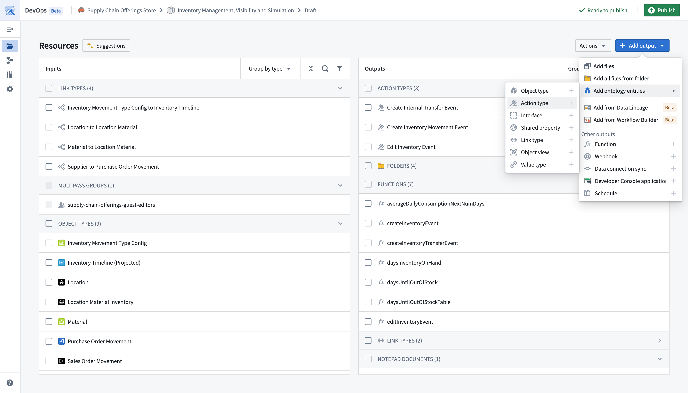
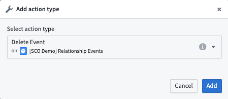
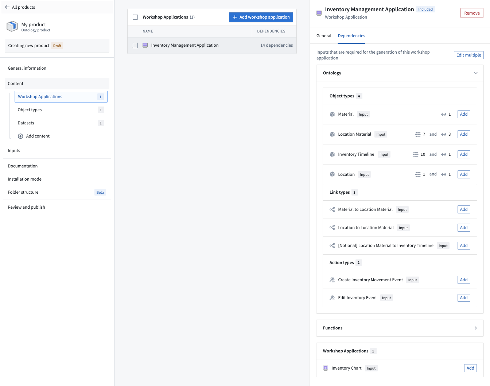

# Add action types to Marketplace product为 Marketplace 产品添加操作类型

Use [Foundry DevOps](/docs/foundry/devops/overview/) to include your action types in [Marketplace products](/docs/foundry/devops/core-concepts/#product) for other users to install and reuse. [Learn how to create your first product.](/docs/foundry/foundry-devops/create-products/)使用 Foundry DevOps 将您的操作类型包含在 Marketplace 产品中，供其他用户安装和重用。了解如何创建您的第一个产品。

## Supported features支持的功能

Most action type features are supported, except actions that reference [object types with unsupported features](/docs/foundry/object-link-types/marketplace-ontology-types/#unsupported-features). When preparing your action type for packaging, ensure your action type [**Security & Submission criteria**](/docs/foundry/action-types/getting-started/#add-submission-criteria) does not reference a user; update any user references to refer to groups instead.大多数操作类型功能都得到支持，但引用了具有不支持功能的对象类型的操作除外。在准备您的操作类型进行打包时，请确保您的操作类型安全与提交标准不引用用户；将所有用户引用更新为引用组。

## Adding action types to products为产品添加操作类型

To add an action type to a product, first [create a product](/docs/foundry/foundry-devops/create-products/) and then select the **Action type** content type as below.要为产品添加操作类型，首先创建产品，然后选择操作类型内容类型，如下所示。

You will then be prompted to choose an action type.系统将提示您选择操作类型。

While you can select action types directly, we recommend first adding content like [Workshop applications](/docs/foundry/workshop/marketplace-workshop/) and then selecting relevant actions via the dependencies panel as shown below.虽然可以直接选择操作类型，但我们建议先添加内容（如研讨会申请），然后通过依赖关系面板选择相关操作，如下所示。

