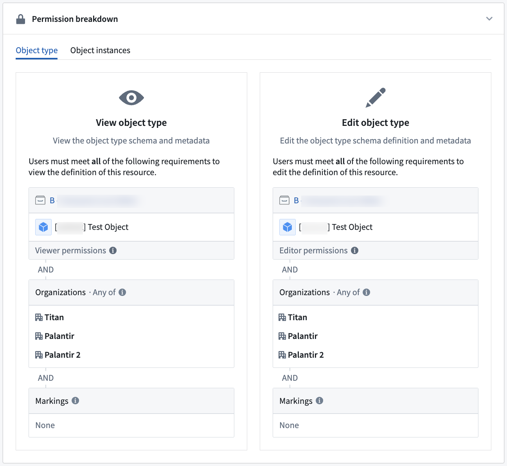

# Permissions权限

Permissions apply to action types in the following ways:权限适用于动作类型，具体方式如下：

- Who can view a given action type?谁可以查看特定的动作类型？
- Who can edit a given action type?谁可以编辑特定的动作类型？
- Who can apply an action type with a given set of parameters?谁可以使用给定的参数集应用动作类型？

## Apply action应用操作

The ability to apply an action type depends on the configuration of the object types and link types it is editing. In all cases, the user submitting the action must be able to view the edited object types and link types and their datasources, and pass the [submission criteria](/docs/foundry/action-types/submission-criteria/). If the object type only allows edits via actions, users can make edits for all the objects they can view. For object types and link types allowing edits beyond actions, the user also needs edit permissions on the writeback dataset if the object type or link type is backed by a dataset. If the object type or link type is backed by a [Restricted View](/docs/foundry/security/restricted-views/), the user needs to pass the edit policy.能否应用操作类型取决于其正在编辑的对象类型和链接类型的配置。在所有情况下，提交操作的用户必须能够查看被编辑的对象类型和链接类型及其数据源，并满足提交标准。如果对象类型仅允许通过操作进行编辑，用户可以对其能够查看的所有对象进行编辑。对于允许通过操作以外方式编辑的对象类型和链接类型，如果对象类型或链接类型由数据集支持，用户还需要在写回数据集上拥有编辑权限。如果对象类型或链接类型由受限视图支持，用户需要通过编辑策略。

Use the **Check access** panel in the sidebar to check a user's access to a Workshop module, including access to dependent action types and their submission criteria. For more information, review the [check access panel documentation](/docs/foundry/security/checking-permissions/).使用侧边栏中的权限检查面板检查用户对工作室模块的访问权限，包括对依赖操作类型及其提交标准的访问权限。有关更多信息，请查阅权限检查面板文档。

### Submission criteria提交标准

Action submission criteria allow for fine-grained control over who can run an action. Simple submission criteria can require a specific user ID or group ID and can be combined with information from parameters. For more information see the [submission criteria documentation](/docs/foundry/action-types/submission-criteria/).动作提交标准允许对谁可以运行动作进行细粒度控制。简单的提交标准可以要求特定的用户 ID 或组 ID，并且可以与参数信息结合使用。有关更多信息，请参阅提交标准文档。

### Object edits permissions对象编辑权限

Object edits can either be locked down so that edits are only allowed via actions, or reopened so that edits are allowed via actions, Foundry Forms, direct Object Explorer edits, and API calls. To enforce a consistent security paradigm across many workflows, by default, new object types only allow edits via actions. Other forms of edits are not recommended for new usage.对象编辑可以锁定，以便仅通过动作进行编辑，或者重新开放，以便通过动作、Foundry 表单、直接对象浏览器编辑和 API 调用进行编辑。为了在许多工作流中强制执行一致的安全范式，默认情况下，新的对象类型仅允许通过动作进行编辑。不推荐为新用途使用其他形式的编辑。

For object types that only allow edits via actions, the user submitting the action will only need `Read` access on the objects that are being edited. This means that it is possible for users to create objects that they cannot view.对于仅允许通过动作进行编辑的对象类型，提交动作的用户只需要对正在编辑的对象具有 Read 访问权限。这意味着用户可以创建他们无法查看的对象。

By contrast, when an object type backed by a dataset can be edited by actions, Foundry Forms, direct Object Explorer edits, and API calls, the user submitting the action must have `Edit` permissions on the writeback datasets of all objects being edited. A user with `Edit` permissions will be able to view all data in a writeback dataset.相比之下，当由数据集支持的对象类型可以通过操作、Foundry 表单、直接对象浏览器编辑和 API 调用进行编辑时，提交操作的用户必须在所有被编辑对象的写回数据集上拥有 Edit 权限。拥有 Edit 权限的用户将能够查看写回数据集中的所有数据。

Therefore, setting an object type to be edited by actions, Foundry Forms, direct Object Explorer edits, and API calls is discouraged since granting `Edit` permissions simply for object editing may expose more data to a user than is required to complete the Ontology editing workflow.因此，不建议将对象类型设置为可通过操作、Foundry 表单、直接对象浏览器编辑和 API 调用进行编辑，因为仅为了对象编辑而授予 Edit 权限可能会向用户暴露超出完成本体编辑工作流程所需的数据。

With either writeback setting, an action type's configuration does not display permission settings on affected underlying object types; the person configuring the action type must ensure that these permissions are correct.无论使用哪种写回设置，操作类型的配置都不会显示受影响的基础对象类型的权限设置；配置操作类型的人员必须确保这些权限是正确的。

Updating edit permissions on an object type to "Only allow edits via actions" will not remove historical, non-action edits, but they will prevent further edits from Foundry Forms, direct Object Explorer edits, and API calls.将对象类型的编辑权限更新为"仅允许通过操作进行编辑"不会移除历史非操作编辑，但它们将阻止 Foundry 表单、直接对象浏览器编辑和 API 调用进行的进一步编辑。

[Learn more about writeback permissions.了解更多关于写回权限的信息。](/docs/foundry/object-permissioning/configuring-rv-access-controls/)

## Side effect permissions副作用权限

Any user who can set up an action may configure side effects.任何可以设置操作的用户都可以配置副作用。

- Webhook side effects are not enabled by default. Additional permissions are required to configure a webhook plugin in the Data Connection app before it can be used in the actions setup page. Contact your Palantir representative with any questions about using webhooks on your Foundry instance.Webhook 的副作用默认是关闭的。在数据连接应用中配置 Webhook 插件之前，需要额外的权限。有关在您的 Foundry 实例上使用 Webhook 的任何问题，请联系您的 Palantir 代表。

Submission criteria must pass as normal; if the action submission criteria fail, then side effects will not be triggered.提交标准必须正常通过；如果行动提交标准失败，则不会触发副作用。

Recipients must have access to any object data included in the notifications.接收者必须能够访问通知中包含的任何对象数据。

- If a user does not have access to all data included in the notification content, the notification will not be sent to them.如果用户无法访问通知内容中包含的所有数据，通知将不会发送给他们。
- If there are multiple recipients and some are missing the correct permissions data included in the notification, only the users with sufficient permissions will be notified.如果有多个接收者，而其中一些缺少通知中包含的正确权限数据，只有具有足够权限的用户才会被通知。
- If notifications fail to send for whatever reason, edits may still succeed.如果通知因任何原因未能发送，编辑仍可能成功。

The user executing the Action must be able to view the users and/or groups that will be receiving a notification.执行操作的用户必须能够查看将接收通知的用户和/或组。

