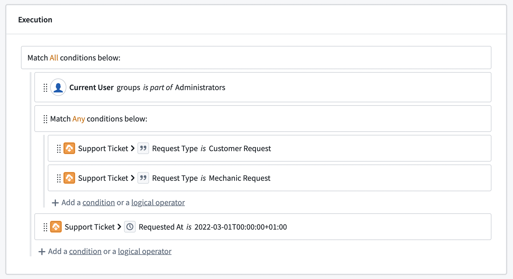

# Submission criteria提交标准

**Submission criteria** (formerly known as validations) are the conditions that determine whether an action can be submitted. Submission criteria support encoding business logic into data editing permissions, ensuring Ontology data quality and editing governance.提交标准 （以前称为验证）是决定动作是否可以提交的条件。提交标准支持将业务逻辑编码到数据编辑权限中，确保本体数据质量和编辑治理。

Submission criteria are created by combining conditions based on the context (like a user or a parameter) and static information to create a logical statement. Submission criteria can incorporate object, relation, and even user information into a logical statement to determine whether an action can be submitted.提交标准通过结合上下文（如用户或参数）和静态信息的条件来创建逻辑语句。提交标准可以将对象、关系甚至用户信息整合进逻辑语句中，以判断动作是否可以提交。

Example示例For example, an airline might want to change the airplanes listed for a specific flight. The configured action allows users to change the `Aircraft` object linked to a `Flight` object. However, the airline only wants selected users (like a flight controller) to be able to use this action, in order to ensure that only aircraft which are still in operation are used. Using submission criteria, builders can ensure that an action which changes the airplane on a flight can only be submitted when the criteria are met by combining the user's membership to a group with the airplane's status at the moment that the action is submitted.例如，航空公司可能想更改某一航班的飞机列表。配置作允许用户更改与飞行对象关联的飞机对象。然而，航空公司只希望特定用户（如飞行管制员）能够使用此作，以确保仅使用仍在运营的飞机。通过提交标准，构建者可以确保只有在满足条件时才能提交更改飞机的作，方法是将用户的成员身份合并到与提交时飞机状态相同的群组。

Submission criteria consist of conditions and operators. Conditions are single statements governing the values of parameters or user properties. Operators are used to combine and nest different conditions.提交标准包括条件和。条件是控制参数值或用户属性的单个语句。作符用于组合和嵌套不同的条件。

Using the different types of operators, we can create more sophisticated statements, mirroring their business processes and requirements. Actions can only be submitted if all the submission criteria are met. This is independent from the permissions that govern whether a user can edit the action type itself. While an object type can have several action types adding, modifying, and removing objects, each action type has independent submission criteria.利用不同类型的，我们可以创建更复杂的报表，镜像他们的业务流程和需求。只有满足所有提交条件后，才能提交行动。这与控制用户是否能编辑动作类型本身的权限是独立的。虽然一个对象类型可以有多个动作类型添加、修改和删除对象，但每种动作类型都有独立的提交标准。

## Conditions条件

A condition is a single comparison check between two values. Each condition either passes or fails based on its parameter or user inputs. A condition can be configured using one of two condition templates: “based on current user” or “based on parameter”. These templates provide a framework for the rest of the condition. Every condition is a simple comparison between two values using an operator in the middle.条件是两个值之间的单一比较检查。每个条件根据其参数或用户输入，要么通过，要么失败。条件可以通过两种条件模板之一进行配置：“基于当前用户”或“基于参数”。这些模板为该病症的其他部分提供了框架。每个条件都是用中间算子简单比较两个值。

Example示例Continuing with our example, the flight controller requirement can be set using the `Current User` template, as it requires the context of the person submitting the action. To know whether an aircraft is still in operation, the `Aircraft` object needs to be used via the `Parameter` template.继续我们的例子，飞行控制员的要求可以使用当前用户模板设置，因为它需要提交作者的上下文。要知道飞机是否仍在运行，需要通过参数模板使用飞机对象。

### Current user当前用户

The `Current User` template defines permissions based on the user submitting the action. The `Current User` input can be used to check a user's ID, group memberships via group IDs, or any other multipass attribute available (such as the user's Organization). Foundry evaluates user IDs as strings, which can be compared against either a statically defined list of user IDs or any string parameter that stores a user ID.当前用户模板根据提交作的用户定义权限。当前用户输入可用于检查用户 ID、通过组 ID 的组成员身份，或任何其他可用的多重通行属性（如用户的组织）。Foundry 将用户 ID 评估为字符串，可以与静态定义的用户 ID 列表或存储用户 ID 的字符串参数进行比较。

The group IDs option allows you to create conditions using the groups for which the action's user is a member (whether direct or inherited membership). The groups can be compared against a static selection of groups or the group ID provided by other parameters.组 ID 选项允许你使用动作用户所属的组（无论是直接成员还是继承成员）创建条件。这些组可以与其他参数提供的静态组选择或组 ID 进行比较。

Multipass attributes are treated as string lists and can only be compared against other strings or string lists. A user will have a list of proposed multipass attributes that the user has access to. Using the `Other user attribute` field, conditions can be configured against attributes the user does not have access to. If a user does not have access to an attribute, they will fail the condition.多重通道属性被视为字符串列表，只能与其他字符串或字符串列表进行比较。用户将拥有一份可访问的拟议多重通行证属性列表。通过 “其他用户属性 ”字段，可以针对用户无法访问的属性配置条件。如果用户无法访问某个属性，他们将失败该条件。

Example示例To know whether a user in our example is a flight controller, we need to check if the user is a member of the flight controller group.要判断我们示例中的用户是否为飞行控制员，需要确认该用户是否属于飞行控制组。

### Parameter参数

Submission criteria can also use parameters defined in the parameter section. Parameters are passed into an action type from other apps or users themselves. Using conditions on parameters allows builders to embed business logic into the action type and prevent users from submitting actions on data that do not conform with business requirements.提交标准也可以使用参数部分定义的参数。参数会从其他应用或用户那里传递到动作类型中。使用参数条件使构建者能够将业务逻辑嵌入动作类型，防止用户对不符合业务要求的数据提交作。

Example示例In our example, the operating status is given via the `Aircraft` object and can change with every aircraft. The condition needs to be built on top of the `Aircraft` object type parameter.在我们的例子中，运行状态通过 Aircraft 对象给出，并且可以随每架飞机而变化。该条件需要建立在飞机对象类型参数之上。

Submission criteria do not support attachment and object set parameters. These parameter types are removed from the selection panel.提交标准不支持附件和对象集参数。这些参数类型从选择面板中移除。

### Select a value选择一个值

After selecting the condition template, choose what value to compare. Some parameters (like lists or object parameters) require a more granular selection of what value should be used in the comparison. We can also choose to compare the length of a list instead of its content.选择条件模板后，选择要比较的值。有些参数（如列表或对象参数）需要更细致地选择比较中应使用的值。我们也可以选择比较列表的长度，而不是其内容。

Example示例In the aircraft example, the operating status of an aircraft is stored in the property on the `Aircraft` object.在飞机示例中，飞机的运行状态存储在飞机对象的属性中。

### Operators运营方

Operators define the comparison between the two values. To simplify the configuration workflow, operators are pre-filtered to only show a selection of operators valid for the parameter. When a parameter is changed, all conditions using this parameter need to be reconfigured.算子定义了两者之间的比较。为了简化配置流程，算符会预先筛选，只显示对该参数有效的部分算符。当参数发生变化时，所有使用该参数的条件都需要重新配置。

There are multiple operators available depending on the selected parameters. For single value parameters, the following operators are available:根据所选参数，有多个算符可用。对于单值参数，可用以下作符：

| Operator算子 | Example示例 | Data Example数据示例 | Description描述 |
| --- | --- | --- | --- |
| is是 | name *is* John Doe名字叫约翰·多 | "John Doe" is "John Doe" = TRUE“约翰·多”就是“约翰·多”=真实 | The left value exactly matches the right value.左边的数值和右边的数值完全一致。 |
| is not莫 | **Current User** *is not* John Doe当前用户不是约翰·多 | “John Doe" is not "Maria Smith" = TRUE“约翰·多”不是“玛丽亚·史密斯”=真实 | The left value and right value do not match.左侧和右侧的数值不匹配。 |
| matches比赛 | name *matches* ^[A名称与 ^[A  相符 | E | I |
| is less than小于 | Aircraft > Engine Count *is less than* 2飞机 3E 发动机数小于 2 | 4 is less than 2 = TRUE4小于2=真 | The left value is smaller than the right value.左侧的数值小于右侧的数值。 |
| is greater than or equals大于或等于 | Aircraft > Engine Count *is greater than or equals* 2飞机 3E 发动机数量大于或等于 2 | 4 is greater than or equals 2 = TRUE4 大于或等于 2 = 真 | The left value is greater than the right value.左侧的数值大于右侧的数值。 |

For parameters with multiple values, the following operators are available. Object reference lists are turned into a list of values (either the object value or the value of the defined property):对于具有多个值的参数，可以使用以下算符。对象引用列表被转换为一个值列表（对象值或定义属性的值）：

| Operator算子 | Example示例 | Data Example数据示例 | Description描述 |
| --- | --- | --- | --- |
| includes包括 | Aircrafts > Pilot Name *includes* "John Doe"飞机 > 飞行员姓名包含 “约翰·多” | [ "John Doe", "Maria Smith" ] includes "John Doe" = TRUE[ “约翰·多”，“玛丽亚·史密斯” ] 包含“约翰·多” = 真实 | At least one of the left values exactly matches the right value.至少有一个左侧的数值和右边的数值完全一致。 |
| includes any包括任何 | List of names *includes any* Aircrafts > Pilot Name名称列表包括任何飞机的 3E 飞行员名称 | ["King Louis", "John Doe"] is included in [ "John Doe", "Maria Smith" ] = TRUE[“路易斯国王”、“约翰·多”]被包含在[“约翰·多”、“玛丽亚·史密斯”]=真实 | At least one of the left values exactly matches at least one of the right values.至少有一个左侧值与右边至少一个值完全匹配。 |
| is included in包含在 | name *is included in* [ "John Doe", "Maria Smith" ]名字收录于 [“约翰·多”、“玛丽亚·史密斯”] | "John Doe" is included in [ "John Doe", "Maria Smith" ] = TRUE“约翰·多”被收录在[ “约翰·多伊”， “玛丽亚·史密斯” ] = 真实 | The left value exactly matches at least one of the right values.左侧的值至少与其中一个正确的值完全匹配。 |
| each is每个都是 | Aircrafts > Pilot Name *each is* "John Doe"飞机 > 飞行员姓名均为 “约翰·多” | [ "John Doe", "Maria Smith" ] each is "John Doe" = FALSE[ “约翰·多”、“玛丽亚·史密斯” ] 各为“约翰·多” = 假 | All left values exactly match the right value.所有左侧的数值都与右侧的数值完全一致。 |
| each is not每个都不是 | Aircrafts > Pilot Name *each is not* "John Doe"飞机的 3E 飞行员姓名都不是 “约翰·多” | [ "John Doe", "Maria Smith" ] each is not "King Louis" = TRUE[“约翰·多”、“玛丽亚·史密斯”]都不是“路易斯国王”= 真实 | All left values do not exactly match the right value.所有左侧的数值并不完全等同于右侧的数值。 |

Example示例Since a user in our example is a member of many groups but the comparison is to a single group, we need to select the `includes` operator to check for an overlap. However, the operating status needs to exactly match an expected status, so the `is` operator must be set.由于我们示例中的用户属于多个组，但比较对象是单个组，我们需要选择 include 作符来检查是否有重叠。然而，运行状态必须完全匹配预期状态，因此必须设置 is 作符。

### Value价值

The value represents the other side of the comparison. The value can either be based on an existing parameter, a static value, or no value. No value checks whether the first value is empty (or null). Like the operator, the available options depend on the first value type.该数值代表比较的另一面。该值可以基于已有参数、静态值或无值。没有任何值会检查第一个值是否为空（或为空）。与算符一样，可用的选项取决于第一个值类型。

Example示例We can now finalize the two conditions needed in the aircraft example. For flight controllers, the correct group needs to be selected as a static parameter. This is because the group should not change, but should stay the same every time an Action is submitted, regardless of the context. Hence the `specific value` is used and the desired group is selected via the dropdown. An aircraft is considered operational when the operating status property is `Yes`, which can be set using the specific value option again.我们现在可以确定飞机示例中所需的两个条件。对于飞行控制人员来说，需要选择正确的组别作为静态参数。这是因为组不应改变，而是每次提交动作时都应保持不变，无论上下文如何。因此使用具体数值 ，并通过下拉菜单选择所需的组。当飞行状态属性为 “是” 时，飞机被视为在运营，且该属性可以通过特定值选项再次设置。

## Logical operators逻辑算子

A logical operator can be used to combine different conditions. Logical operators can also be nested to create even more complex logic and can require either all, any, or no conditions underneath it to be met to pass.逻辑算符可用于组合不同条件。逻辑算子也可以嵌套以创建更复杂的逻辑，并且可以通过其底层的所有、任何或无条件。

## Failure message故障消息

Failure messages support defining what error should be displayed whenever the Action cannot be submitted. Every condition and logical operator on the root level has its own failure message. If conditions of lower levels are not met, the failure message of the corresponding root level (parent) is displayed. The failure message will be displayed to the end user across Foundry (Object Explorer, Workshop, or Quiver) whenever a condition is not met. The failure message informs the user about why they are blocked from submitting an Action.失败消息支持定义在无法提交动作时应显示的错误。根层的每个条件和逻辑作符都有自己的失败消息。如果不满足较低级别的条件，则显示对应根级（父级）的失败消息。每当某个条件未满足时，失败信息会通过 Foundry（对象浏览器、工作坊或 Quiver）向终端用户显示。失败消息会告知用户为何被阻止提交作。

