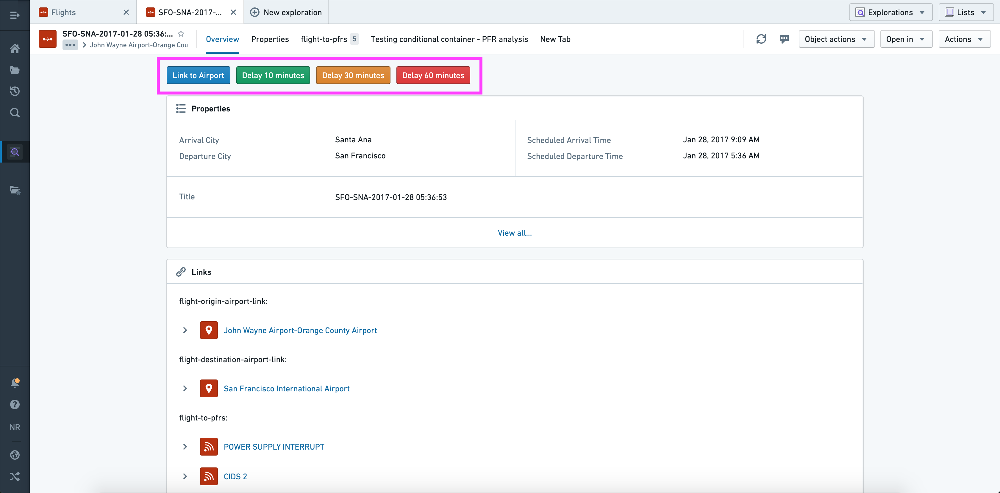
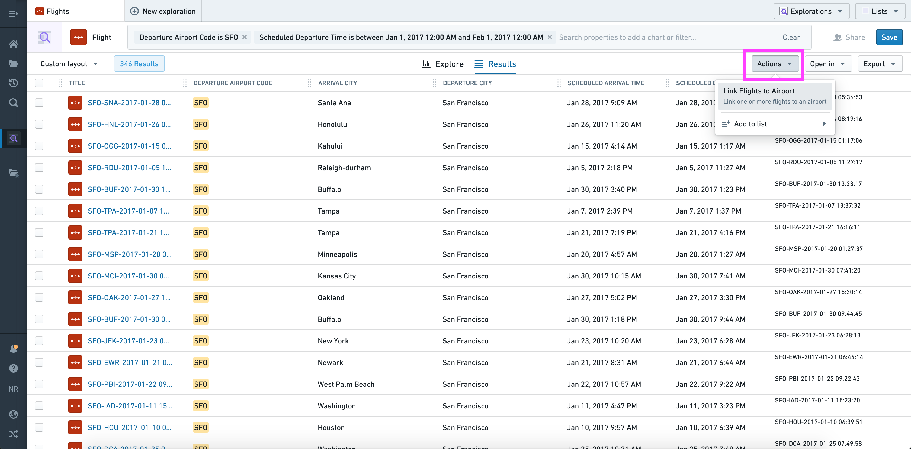
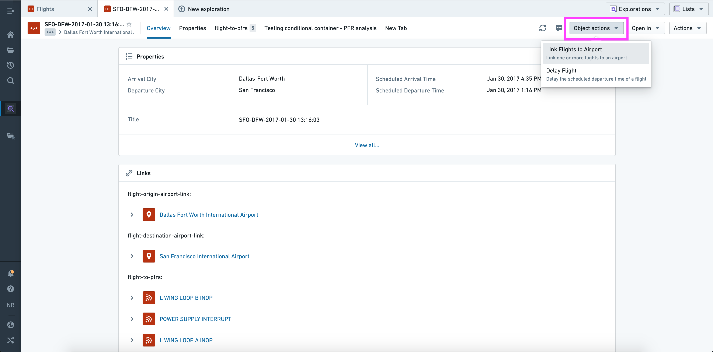
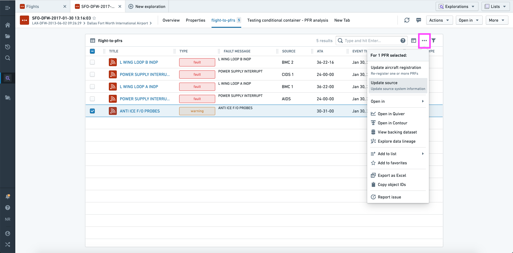
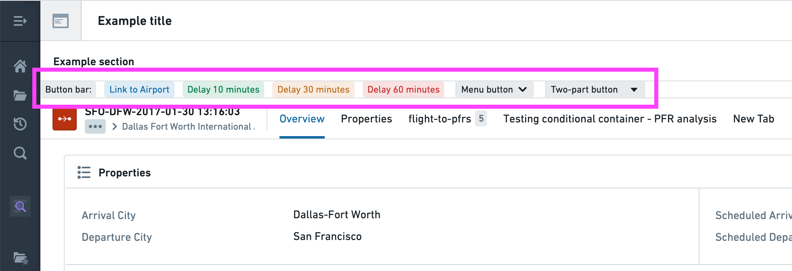

# Use actions in the platform在平台上使用动作

Action types can be seamlessly integrated across applications in Foundry. Read on to learn how to configure and apply an action from [Object Explorer](/docs/foundry/object-explorer/overview/) and [Workshop](/docs/foundry/workshop/overview/).动作类型可以在 Foundry 中无缝集成于不同应用之间。继续阅读，了解如何配置和应用对象浏览器和工作坊中的动作。

In the examples below, we use the term **single action type** to refer to an action type using an object reference parameter, and **bulk action type** to refer to an action using an object reference list parameter.在下面的例子中，我们用 “单一动作类型 ”指使用对象引用参数的动作类型，用 “批量动作类型 ”指使用对象引用列表参数的动作。

## Object views对象视图

Actions can be added to an [Object View](/docs/foundry/object-views/overview/) using the **Actions section**.可以通过 “动作”部分将动作添加到对象视图中。

When configuring the **Actions section** you have the option to:在配置作部分时，你可以选择：

- Add any action as a button in the section.在该部分添加任何动作作为按钮。
- Give each button its own label and color.给每个按钮单独的标签和颜色。
- Change the default on-click behavior from opening the form to applying the action immediately using the default values (if valid).将默认点击行为从打开表单改为立即使用默认值（如果有效）。
- Specify whether the button should be hidden or disabled if a non-visible parameter is invalid (the idea being that visible parameters could be corrected upon opening the form).如果某个不可视参数无效（目的是打开表单时可以纠正可见参数），说明按钮是否应隐藏或禁用。
- Provide a default value for each parameter; this can be a property value of the current object or a "local" value (current user, current timestamp, current object, or a manually entered value).为每个参数提供默认值;这可以是当前对象的属性值，也可以是“本地”值（当前用户、当前时间戳、当前对象，或手动输入的值）。
- Override the visibility of each parameter.覆盖每个参数的可见性。

As shown above, you can therefore use this section to offer multiple structured versions of the same generic action ("Delay 10 minutes", "Delay 30 minutes", etc.).如上所示，你可以利用该部分提供同一个通用动作的多个结构化版本（“延迟10分钟”、“延迟30分钟”等）。

## Object Explorer对象浏览器

Actions will automatically be shown in three places across [Object Explorer](/docs/foundry/object-explorer/overview/):作将在对象浏览器的三个地方自动显示：

1. From the **Actions** dropdown in the Exploration View (top right).来自探索视图（右上角） 动作下拉菜单。

Using the current set of objects, this dropdown is automatically populated with applicable bulk actions.使用当前的对象集，这个下拉菜单会自动填充相应的批量作。

1. From the **Object Actions** dropdown menu in the Object View (top right).在对象视图（右上角）的对象动作下拉菜单中。

Using the current object, this dropdown menu is automatically populated with applicable single and bulk action types.使用当前对象时，下拉菜单会自动填充适用的单次和批量动作类型。

1. From the **Linked objects view section** in the Object View (top).来自对象视图（顶部）的链接对象视图部分 。

Using the selected object(s), this dropdown is automatically populated with applicable single and/or bulk action types.使用选定对象后，下拉菜单会自动填充适用的单一和/或批量动作类型。

In "bulk" contexts (where multiple objects are shown in a list view), only actions that accept object list parameters of the correct type will be shown.在“批量”上下文中（列表视图中显示多个对象），只显示接受正确类型对象列表参数的作。

## Workshop车间

In [Workshop](/docs/foundry/workshop/overview/), Actions can be configured and applied using the [**Button group** widget](/docs/foundry/workshop/widgets-button-group/).在 Workshop 中，可以通过按钮组小组件配置和应用动作。

This widget has the same configuration options as the [Actions section](#object-views) in an Object View, with a few notable extensions:该小部件的配置选项与对象视图中的动作部分相同，但有一些显著的扩展：

- There are three possible layouts, all of which are shown above.有三种可能的布局，均如上图所示。
- The buttons have additional display options, including left/right icons, minimal styles, and tag styles.按钮还有额外的显示选项，包括左右图标、极简样式和标签样式。
- In addition to an Action, an individual button can trigger a Workshop event, URL, or object set export.除了动作外，单个按钮还可以触发工作坊事件、URL 或对象集导出。

And one difference:还有一个区别：

- A default value can be a [variable](/docs/foundry/workshop/concepts-variables/), the current user, or the current timestamp默认值可以是变量 、当前用户或当前时间戳

Read more about [Actions in Workshop](/docs/foundry/workshop/actions-overview/), or read the full reference for the [Button Group widget](/docs/foundry/workshop/widgets-button-group/) to learn about all available configuration options.阅读更多关于工作坊中的动作 ，或阅读按钮组小部件的完整参考资料，了解所有可用的配置选项。

