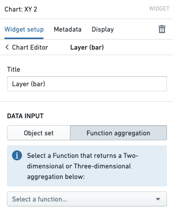
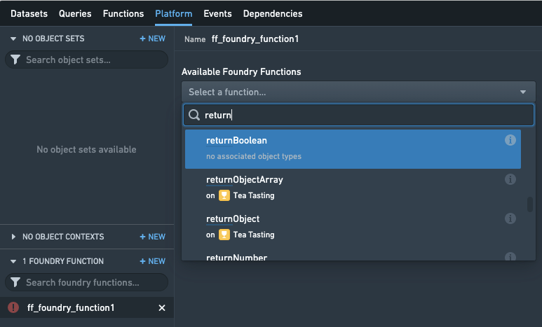

# Use functions in the platform在平台中使用函数

This section documents various ways that you can use functions throughout the Foundry platform. This list is kept mostly up to date, but there may be additional ways to use functions that are not captured here.本节记录了在 Foundry 平台中可以使用函数的各种方式。此列表基本保持更新，但可能存在未在此处捕获的函数使用方式。

## Workshop工作坊

[Workshop](/docs/foundry/workshop/overview/) supports integration with functions in a variety of ways, enabling the use of custom logic throughout modules built in Workshop.工作坊支持以多种方式与函数集成，使在通过工作坊构建的模块中可以使用自定义逻辑。

### Variables变量

Most Workshop [Variables](/docs/foundry/workshop/concepts-variables/) can be Function-backed, allowing an application builder to use functions to compute values that can then be used throughout Workshop. By default, the value for a variable is recomputed when another variable it depends on is updated. This enables flexible recomputation of values in response to user feedback—for example, when a user edits an input component, a dependent Function-backed Object Set variable will be recomputed automatically.大多数工作坊变量可以是函数支持的，允许应用构建者使用函数来计算可以在整个工作坊中使用的值。默认情况下，当变量依赖的另一个变量更新时，变量的值会重新计算。这使用户反馈能够灵活地重新计算值——例如，当用户编辑输入组件时，依赖的函数支持的对象集变量将自动重新计算。

To learn more, take a look at the [tutorial on how to use functions to back Workshop variables](/docs/foundry/workshop/functions-use/#function-backed-variables-in-workshop).要了解更多信息，请查看有关如何使用函数支持工作坊变量的教程。

Below is the mapping between Workshop variable types and their equivalents in TypeScript. A Workshop variable of each given type can be backed by a Function that returns one of the valid types listed. [Learn more about the available Function types are documented.](/docs/foundry/functions/types-reference/)以下是工作坊变量类型与其在 TypeScript 中的等效项之间的映射。每种给定类型的工作坊变量可以由返回列表中列出的有效类型的函数支持。有关可用函数类型的更多信息已记录在文档中。

- Boolean: `boolean`布尔值: boolean
- String: `string`字符串: string
- Numeric: `Integer`, `Long`, `Float`, `Double`数字: Integer , Long , Float , Double
- Date: `LocalDate`日期: LocalDate
- Timestamp: `Timestamp`时间戳： Timestamp
- Array: `BaseType[]` or `Set<BaseType>`数组： BaseType[] 或 Set<BaseType>
- Object Set: `ObjectSet<ObjectType>` (recommended), `ObjectType[]`, or `Set<ObjectType>`对象集： ObjectSet<ObjectType> （推荐）， ObjectType[] ，或 Set<ObjectType>

### Object Table: Derived properties对象表：派生属性

Workshop’s **Object Table** widget can be configured to compute a Function-backed column, which can update based on user input and will be recomputed on the fly as end users scroll through the table. You can see a [full tutorial for using this functionality](/docs/foundry/workshop/widgets-object-table/#function-backed-columns).工作坊的对象表格小部件可以配置为计算一个函数支持的列，该列可以根据用户输入进行更新，并且当最终用户滚动表格时将实时重新计算。您可以看到一个完整的使用此功能的教程。

### Chart: Derived aggregations图表：派生聚合

Workshop’s **Chart: XY** widget supports using a Function-backed aggregation to derive aggregated values on demand. This can be useful if you want to have aggregation data be based on user selection. To use functions in a Chart widget, simply click to configure a chart layer and select *Function aggregation*.工作坊的图表：XY 小部件支持使用函数支持的聚合来按需派生聚合值。如果您希望聚合数据基于用户选择，这会很有用。要在图表小部件中使用函数，只需点击配置图表层并选择函数聚合。

A [reference for the Aggregation API](/docs/foundry/functions/types-reference/#aggregation-types) is available. For more advanced use cases, you may want to read the documentation about [how to compute custom aggregations](/docs/foundry/functions/create-custom-aggregation/).聚合 API 的参考文档可用。对于更高级的使用场景，您可能需要阅读有关如何计算自定义聚合的文档。

## Actions动作

[Action types](/docs/foundry/action-types/overview/) enable applications to make changes to the objects in the Foundry ontology and to dispatch external notifications and side effects in a way that is flexible and secure. Within Actions, functions provide complete flexibility, enabling code authors to define how objects should be updated or how side effects should be configured.动作类型使应用程序能够更改 Foundry 本体中的对象，并以灵活和安全的方式分派外部通知和副作用。在动作中，函数提供完全的灵活性，使代码作者能够定义对象应如何更新或副作用应如何配置。

### Function-backed Actions基于函数的动作

Function-backed Actions use the [Ontology edits](/docs/foundry/functions/api-ontology-edits/) API to define the logic for how objects should be updated. This allows you to express complex edits in code—for example, updating every objected linked to some starting object. [See a tutorial for how to use Function-backed Actions end-to-end.](/docs/foundry/action-types/function-actions-getting-started/)基于函数的 Action 使用本体编辑 API 来定义对象应如何更新的逻辑。这使您能够在代码中表达复杂的编辑——例如，更新与某个起始对象相关联的所有对象。查看教程了解如何端到端使用基于函数的 Action。

### Side effects: Notifications副作用：通知

An Action can be configured to send a Notification to a specified user. You can use functions to compute which users should receive a Notification, as well as the contents of the Notification itself. This provides flexibility such as loading recipient user IDs that are stored within objects, or rendering email content based on object data. To learn more, consult the [full documentation about Notifications](/docs/foundry/action-types/notifications/) and a [guide for how to use functions to configure Notifications](/docs/foundry/functions/configure-notifications/).一个 Action 可以配置为向指定用户发送通知。您可以使用函数来计算哪些用户应该接收通知，以及通知的内容。这提供了灵活性，例如加载存储在对象中的接收者用户 ID，或根据对象数据渲染电子邮件内容。要了解更多信息，请查阅有关通知的完整文档以及如何使用函数配置通知的指南。

### Side effects: Webhooks副作用：Webhooks

An Action can also be configured to trigger a Webhook when it is applied. Webhooks enable integration of Foundry with other systems, enabling user-applied Actions to write back to APIs outside of Foundry. You can use functions to compute the parameters that should be sent to the Webhook that will be executed, enabling workflows like populating Webhook parameters based on object data. [View full documentation about Webhooks.](/docs/foundry/action-types/webhooks/)一个 Action 也可以配置为在应用时触发 Webhook。Webhooks 能够实现 Foundry 与其他系统的集成，使用户应用的 Action 能够向 Foundry 外部的 API 进行写回。您可以使用函数来计算应该发送到将要执行的 Webhook 的参数，从而实现例如根据对象数据填充 Webhook 参数的工作流。查看有关 Webhooks 的完整文档。

## Slate

[Slate](/docs/foundry/slate/overview/) includes native support for finding and using functions within the **Platform** tab. When editing a Slate document, open the Platform tab and add a **Foundry Function** in the bottom-left. Now, you can search for a Function, configure parameters, and use the result in your Slate document.Slate 支持在平台标签页中查找和使用函数。编辑 Slate 文档时，打开平台标签页，在左下角添加一个 Foundry Function。现在，您可以搜索函数、配置参数，并将结果用于您的 Slate 文档。

Note that for historical reasons, the Slate product has its own notion of "functions", which are snippets of JavaScript logic located within each Slate document. This is why the functions product is called "Foundry functions" and is located under the **Platform** tab. Slate's functions capability allows for quick, easy data manipulation within a document, but do not have native support for objects.请注意，由于历史原因，Slate 产品有自己的"函数"概念，这些函数是位于每个 Slate 文档中的 JavaScript 逻辑片段。这就是为什么函数产品被称为"Foundry functions"，并且位于平台选项卡下。Slate 的函数功能允许在文档内快速、轻松地处理数据，但它们没有对对象的原生支持。

You can use Slate's functions and Foundry functions in combination with each other—for example, you could return data from a Foundry Function and manipulate it in a Slate Function, or use a Slate Function to compute parameters that should be passed into a Foundry Function.你可以将 Slate 的功能和 Foundry 功能组合使用——例如，你可以从 Foundry 函数返回数据并在 Slate 函数中对其进行操作，或者使用 Slate 函数计算应传递到 Foundry 函数的参数。

## Quiver

[Object set plots](/docs/foundry/quiver/objects-chart-drilldown/#code-function-categorical-plot) in Quiver use the same underlying component as Workshop's Chart: XY widget. As such, you can use Function-backed Aggregations in Quiver analyses as well.在 Quiver 中的对象集图使用与 Workshop 的图表：XY 小部件相同的底层组件。因此，你也可以在 Quiver 分析中使用函数支持的聚合。

## Automate自动化

[Automate](/docs/foundry/automate/overview/) allows you to create function-backed automations, which automatically execute functions when a specified condition is met.自动化允许您创建基于函数的自动化，当满足指定条件时，这些自动化将自动执行函数。

When configuring a Function effect, you can select a function and specify its version. For stable versions (1.0.0 and greater), you can enable automatic upgrades to compatible versions. Functions in Automate execute asynchronously and can run for up to 4 hours.在配置函数效果时，您可以选择一个函数并指定其版本。对于稳定版本（1.0.0 及以上），您可以启用自动升级到兼容版本。Automate 中的函数异步执行，最长可运行 4 小时。

Note that functions with ontology edit return types will not have the edits applied when used as effects in Automate. To learn more, see the [Function effects documentation](/docs/foundry/automate/effect-function/).请注意，具有本体编辑返回类型的函数在作为 Automate 中的效果使用时，不会应用这些编辑。欲了解更多信息，请参阅函数效果文档。

