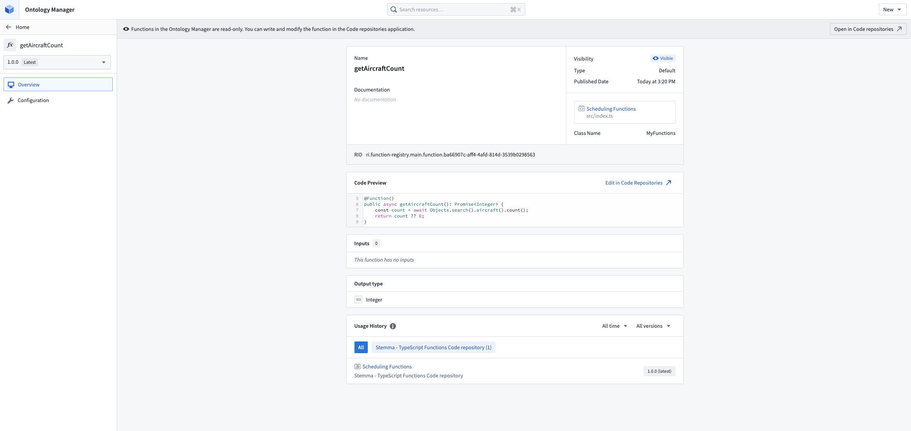
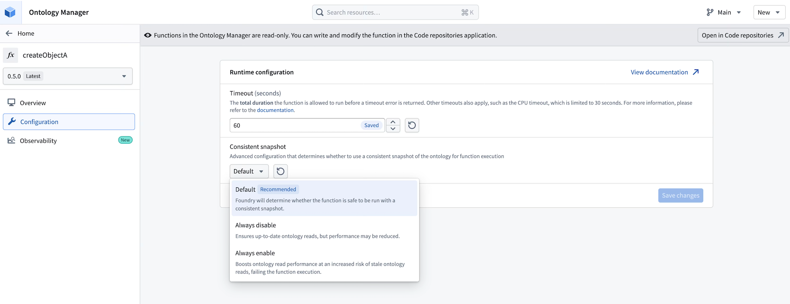

# Manage published functions管理已发布函数

Once published, all types of functions can be viewed and managed using the **Ontology Manager**.一旦发布，所有类型的函数都可以使用本体管理器查看和管理。

## Searching for functions搜索函数

To search for functions, navigate to the **Ontology Manager** and select the **Functions** tab.
You can search for functions by most metadata on the function, including but not limited to the function name, description, API name and RID.要搜索函数，请导航到本体管理器并选择函数选项卡。您可以通过函数的元数据搜索函数，包括但不限于函数名称、描述、API 名称和 RID。

## Function overview page功能概览页面

After selecting a function in the Ontology Manager, you can view basic information about the function, including its inputs and outputs and any associated usage history for the function.在本体管理器中选择一个功能后，您可以查看该功能的基本信息，包括其输入和输出以及与该功能相关的任何使用历史记录。

## Function configuration page功能配置页面

Some types of functions allow you to configure resources such as timeouts or memory limits.
If your function supports any configuration options, you can view and edit them in the **Configuration** tab.
If this tab is not present, the function does not support any configuration options.某些类型的功能允许您配置资源，例如超时或内存限制。如果您的功能支持任何配置选项，您可以在配置选项卡中查看和编辑它们。如果此选项卡不存在，则该功能不支持任何配置选项。

Configuration overrides are applied on a per-function version basis. Depending on the application from which you publish your function, new versions may have the default configuration and you may need to reapply any configuration overrides.配置覆盖是按每个函数版本应用的。根据您发布函数的应用，新版本可能具有默认配置，您可能需要重新应用任何配置覆盖。

For example, you can configure the timeout on a TypeScript function as seen in the following image.例如，您可以像以下图像所示配置 TypeScript 函数的超时时间。

### Configuration inheritance配置继承

Functions provide out-of-the-box support for inheriting configuration overrides when publishing new versions. The configuration is inherited from the prior stable version according to the semantic version specification. If publishing a non-stable version, configurations will be inherited from the prior version, regardless of whether it is a stable release.函数在发布新版本时提供开箱即用的配置覆盖继承支持。根据语义版本规范，配置是从先前的稳定版本继承的。如果发布非稳定版本，配置将始终从先前的版本继承，无论该版本是否为稳定发布。

Configuration inheritance requires your repository to contain updated template configurations. You can check the hidden `templateConfiguration.json` file to confirm the version your repository is on.配置继承需要您的仓库包含更新的模板配置。您可以通过检查隐藏的 templateConfiguration.json 文件来确认您的仓库所在版本。

- For TypeScript v1 functions repositories, you must have `parentTemplateVersion >= 3.512.0`对于 TypeScript v1 函数仓库，你必须有 parentTemplateVersion >= 3.512.0
- For Python functions repositories, you must have `parentTemplateVersion >= 0.423.0`对于 Python 函数仓库，你必须有 parentTemplateVersion >= 0.423.0

## Consistent snapshots一致的快照

Function-backed actions automatically use one ontology snapshot for all read requests in a single run.基于函数的操作会自动在单次运行中所有读请求使用一个本体快照。

Consistent snapshots provide the following qualities:一致的快照提供以下特性：

- **Data consistency:** Without snapshots, sequential ontology queries within a function could return different versions of data if the underlying data changed between requests. With snapshots, your function operates on a consistent view of the ontology, similar to snapshot isolation in a database transaction.数据一致性：如果没有快照，函数内的连续本体查询可能会因为请求之间的底层数据变化而返回不同版本的数据。使用快照时，你的函数操作的是本体的一致视图，类似于数据库事务中的快照隔离。
- **Improved performance:** Reusing a single snapshot across all ontology requests significantly improves ontology read performance. A single function-backed action, along with any queries within, receives this benefit.性能提升：在所有本体查询中复用单个快照可以显著提升本体读取性能。单个由函数支持的操作及其内部的任何查询都能获得这一优势。

### Snapshot configuration快照配置

If you need to explicitly manage snapshots for advanced use cases, you can configure the snapshot behavior on the [function configuration page](#function-configuration-page) using the following options:如果您需要显式管理用于高级用例的快照，您可以使用以下选项在函数配置页面配置快照行为：

- **Default (recommended):** Leave this option selected unless you encounter snapshot-related errors.默认（推荐）：除非您遇到与快照相关的错误，否则请保留此选项选中。
- **Disable snapshots:** Use when you need the freshest data on each query during a run, or when you are hitting snapshot errors due to long-running workloads.禁用快照：在您需要在每次运行中获取最新数据时使用，或当您由于长时间运行的工作负载而遇到快照错误时使用。
- **Enable snapshots:** Use when you need a consistent point-in-time view across all reads and want better read performance, and your function can tolerate data not updating mid-run. This is not recommended for most use cases.启用快照：当你需要一个一致的时间点视图来覆盖所有读取操作，并希望获得更好的读取性能，且你的函数可以容忍运行中途数据未更新时使用。这通常不推荐用于大多数用例。

By default, functions with sources run against live data without snapshots. Enforcing snapshots is not recommended since functions can perform writes or invoke external systems.默认情况下，带有数据源的函数会直接运行在实时数据上，而不使用快照。强制使用快照是不推荐的，因为函数可能会执行写入操作或调用外部系统。

## Enforced limits强制限制

Several limits are in place to prevent functions from consuming too many resources when they are executed.有几个限制措施来防止函数在执行时消耗过多资源。

### Time limit时间限制

Functions are limited to **60 seconds** of elapsed run time by default. These limits can be modified on the [function configuration page](#function-configuration-page).默认情况下，函数的运行时间限制为 60 秒。这些限制可以在函数配置页面中修改。

Functions are allowed to run for up to **280 seconds** when running in live preview, even if modified on the function configuration page.在实时预览模式下，即使修改了函数配置页面，函数的运行时间也可以长达 280 秒。

TypeScript v1 functions are additionally limited to **30 seconds** of CPU time, which is not configurable. When a function exceeds this threshold, the cause is often inefficient data loading logic. Refer to the section on [optimizing performance](/docs/foundry/functions/optimize-performance/) for tips on how to avoid CPU timeouts.TypeScript v1 函数还额外限制为 30 秒的 CPU 时间，且不可配置。当函数超过此阈值时，通常是由于数据加载逻辑效率低下。请参考性能优化部分以获取避免 CPU 超时的建议。

### Memory limit内存限制

Memory limits differ between TypeScript v1, TypeScript v2, and Python functions.TypeScript v1、TypeScript v2 和 Python 函数的内存限制有所不同。

#### TypeScript v1

Function execution is limited to **128 Megabytes** of memory usage. This limit is rarely reached; often, functions run into time limits or object loading limits before memory limits.函数执行受限于 128 兆字节的内存使用量。这个限制很少达到；通常，函数在达到内存限制之前会先遇到时间限制或对象加载限制。

#### Deployed Python functions已部署的 Python 函数

Deployed Python functions have **2 Gigabytes** of memory usage by default. Currently, deployed Python functions cannot configure memory usage on the function configuration page.已部署的 Python 函数默认具有 2 吉字节的内存使用量。目前，已部署的 Python 函数无法在函数配置页面配置内存使用量。

#### Serverless Python and TypeScript v2 functions无服务器 Python 和 TypeScript v2 函数

Serverless functions have **1024 Mebibytes** of memory usage by default. This can be configured from **512 Mebibytes** to **5120 Mebibytes** on the [function configuration page](#function-configuration-page).无服务器函数默认使用 1024 Mebibytes 的内存。这可以在函数配置页面中配置，范围从 512 Mebibytes 到 5120 Mebibytes。

### Multithreading多线程

For TypeScript v1, function execution is on a single thread, allowing only one computation at any given time. However, you can parallelize loading of object sets or links. Refer to [optimizing performance](/docs/foundry/functions/optimize-performance/) for more information.对于 TypeScript v1，函数执行在单个线程上进行，每次只允许一个计算。但是，您可以并行加载对象集或链接。有关更多信息，请参阅性能优化。

For TypeScript v2 and Python functions, you can use multithreading with the built-in Node.js `worker_threads` and Python `threading` libraries.对于 TypeScript v2 和 Python 函数，您可以使用 Node.js 的 worker_threads 内置库和 Python 的 threading 内置库进行多线程处理。

### Object set limits with TypeScript v1使用 TypeScript v1 设置对象集限制

When using [object sets](/docs/foundry/functions/api-object-sets/), calling `.all()` or `.allAsync()` will throw an error if:在使用对象集时，如果出现以下情况，调用 .all() 或 .allAsync() 将抛出错误：

- More than **100,000 objects** are loaded at once from the object set. In general, even loading tens of thousands of objects will run into time limits or memory limits. For use cases where you are running into this limit, consider fetching summary data using [aggregations](/docs/foundry/functions/api-object-sets/#computing-aggregations) or fetching a subset of objects using [ordering and limiting](/docs/foundry/functions/api-object-sets/#ordering-and-limiting).从对象集中一次性加载超过 10 万个对象。通常情况下，即使加载数万个对象也可能遇到时间限制或内存限制。对于遇到此限制的使用场景，可以考虑使用聚合获取汇总数据，或使用排序和限制获取对象子集。
- More than **3 [search arounds](/docs/foundry/functions/api-object-sets/#search-around)** are used at once.同时使用了超过 3 次搜索。

Some aggregation and bucketing operations have limits. See the [aggregations](/docs/foundry/functions/api-object-sets/#computing-aggregations) section for details.某些聚合和分桶操作有上限。详情请参阅聚合部分。

