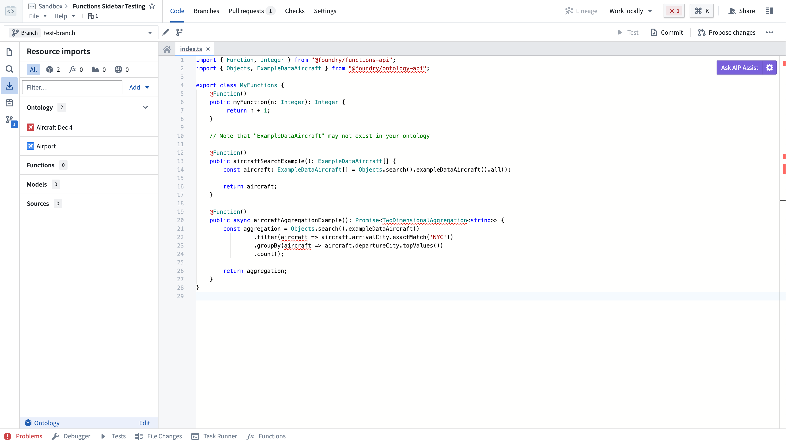
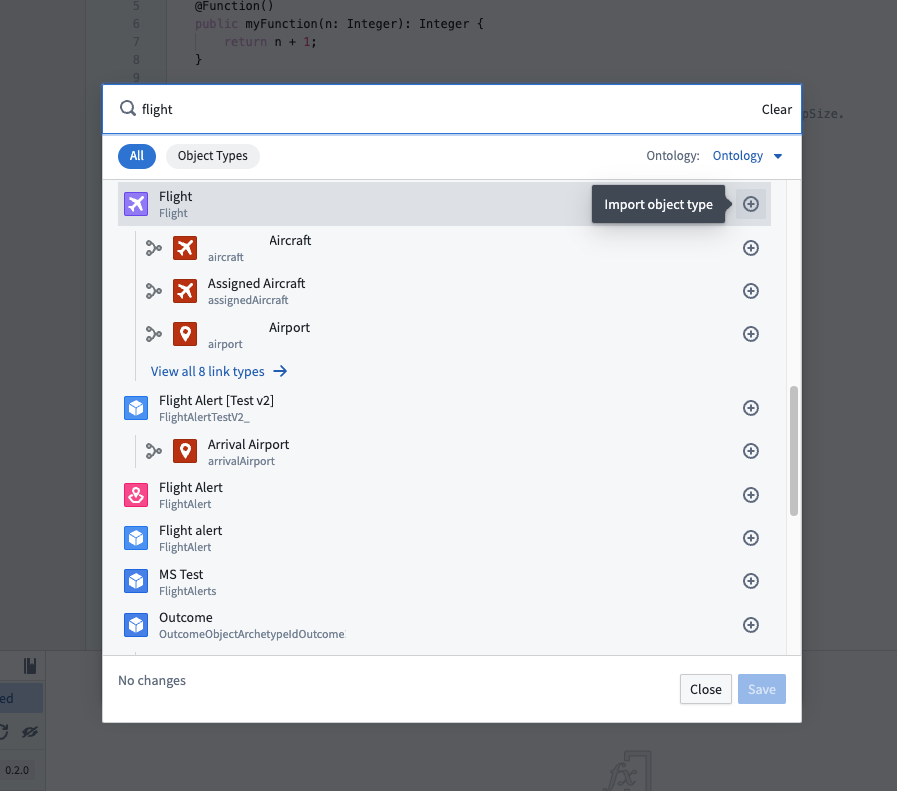
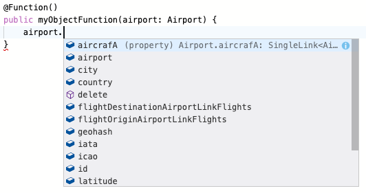
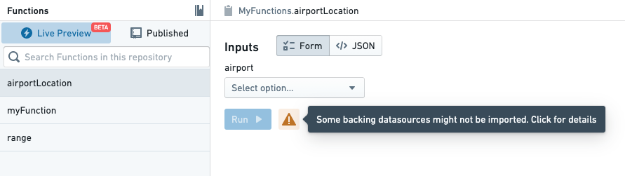
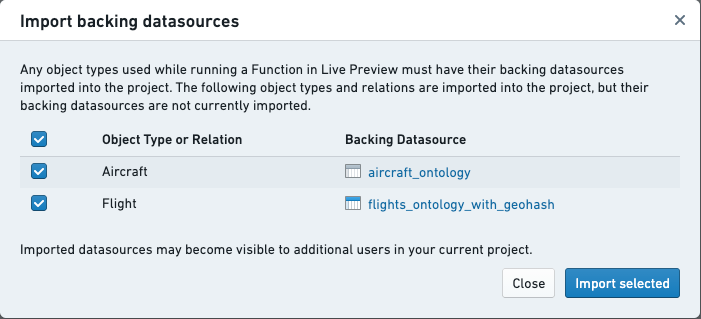
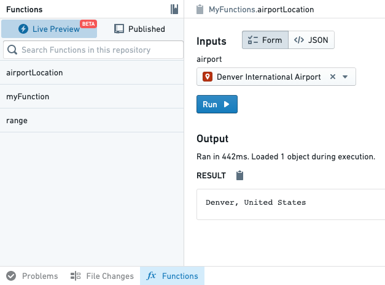
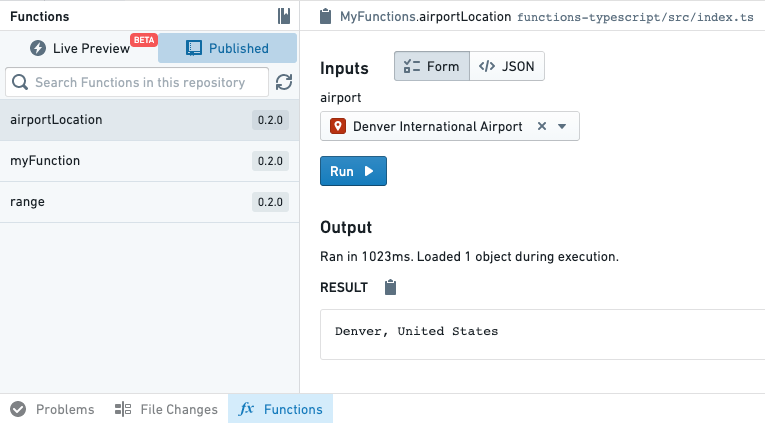

# [](#getting-started-with-functions-on-objects)Getting started with functions on objects在对象上使用函数入门


One of core features of functions is they can easily access data that has been integrated into the Foundry Ontology. The Ontology provides semantic modeling of data for your organization, which makes it easy to access structured data and reuse logic across use cases.函数的核心特性之一是它们可以轻松访问集成到 Foundry 本体中的数据。本体为您的组织提供数据的语义建模，这使得访问结构化数据并在不同用例中重用逻辑变得容易。


Prerequisites前提条件This tutorial assumes that you have created and set up a TypeScript repository. If you haven't yet, complete the [Getting started](/docs/foundry/functions/getting-started/) tutorial first.本教程假设您已经创建并设置了一个 TypeScript 仓库。如果您还没有，请先完成入门教程。


### [](#import-ontology-types)Import Ontology types导入本体类型


Any object, interface, or link types you want to use in your function must be imported into the Project that contains your repository. Selecting the **Resource Imports** side bar shows you the object types which have been imported into the Project.您函数中要使用的任何对象、接口或链接类型都必须导入到包含您存储库的项目中。选择资源导入侧边栏会显示已导入到项目中的对象类型。





Your organization may not have the Airport and Flight objects. Use any object types you have access to when following along.您的组织可能没有机场和航班对象。在跟随教程时，请使用您可以访问的任何对象类型。


To import additional object types, you will need to select the **Add** button in the **Resource Imports** side bar. If no Ontology has been selected you will be prompted to select an Ontology. If you have at least one imported Ontology type, the selected Ontology will automatically be resolved.要导入额外的对象类型，您需要选择资源导入侧边栏中的添加按钮。如果没有选择本体，系统会提示您选择一个本体。如果您至少导入了一个本体类型，所选本体将自动解析。


Once an Ontology is selected, a search modal will appear. Your Ontology will depend on the object types available in your organization. Start by selecting a few object types and link types that connect them. In this example, we'll import the Airport and Flight objects, in addition to the link type between them.一旦选择了一个本体，就会出现一个搜索模态框。您的本体将取决于您组织中可用的对象类型。首先选择一些对象类型以及连接它们的链接类型。在这个例子中，我们将导入机场和航班对象，以及它们之间的链接类型。





Choose **Confirm selection** to import the Ontology types into the project. Code Assist will automatically be restarted to regenerate code bindings to reflect the new object and link types you have imported.选择“确认选择”将本体类型导入项目中。代码辅助将自动重新启动，以重新生成代码绑定，以反映您导入的新对象和链接类型。


In your code, you may now import Ontology types from the `@foundry/ontology-api` package. If you are using a private Ontology, the package name will instead be `@foundry/ontology-api/<ontology-api-name>`.在您的代码中，现在可以导入 @foundry/ontology-api 包中的本体类型。如果您使用的是私有本体，包名将是 @foundry/ontology-api/<ontology-api-name> 。


Private Ontologies私有本体If you are using a private Ontology, replace `@foundry/ontology-api` with `@foundry/ontology-api/your-private-ontology-api-name-here` in all the following examples.如果你正在使用私有本体，请在以下所有示例中将 @foundry/ontology-api 替换为 @foundry/ontology-api/your-private-ontology-api-name-here 。


### [](#add-an-object-backed-function)Add an object-backed function添加一个基于对象的函数


Next, let's write a function using an object type you just imported. Your code will depend on the object types, properties, and link types available to you. Switch back to the **Code** tab, and try importing one of the object types you just added:接下来，让我们使用你刚刚导入的对象类型编写一个函数。你的代码将依赖于可用的对象类型、属性和链接类型。切换回代码选项卡，并尝试导入你刚刚添加的一个对象类型：


```
Copied!`1import { Airport } from "@foundry/ontology-api";`
```


Then, write a function that takes that object as input:然后，写一个函数，将那个对象作为输入：


```
Copied!`1@Function()
2public myObjectFunction(airport: Airport) {
3    airport.
4}`
```


Once Code Assist has started, simply type `airport.` to see autocomplete for the properties and link types available to you:一旦代码辅助功能启动，只需输入 airport. 即可查看可用的属性和链接类型自动完成：





In this example, we use a [template string ↗](https://developer.mozilla.org/en-US/docs/Web/JavaScript/Reference/Template_literals#syntax) to combine the `city` and `country` fields on an Airport into a human-readable location:在这个示例中，我们使用模板字符串 ↗ 将机场的 city 和 country 字段组合成一个人类可读的位置：


```
Copied!`1@Function()
2public airportLocation(airport: Airport): string {
3    return `${airport.city}, ${airport.country}`;
4}`
```


Experiment with the APIs based on your own Ontology and write a function that returns a value based on your object type.根据您自己的本体实验 API，并编写一个根据对象类型返回值的函数。


### [](#test-in-live-preview)Test in live preview在实时预览中测试


Open the **functions helper**, toggle to **Live Preview**, and choose the function that you wrote above. To run an object-backed function in live preview, you have to import the backing datasource for the object type. Select the warning icon next to the **Run** option:打开函数辅助工具，切换到实时预览，并选择您上面编写的函数。要在实时预览中运行基于对象的函数，您必须导入该对象类型的支撑数据源。选择运行选项旁边的警告图标：





Then, use the dialog to import the backing datasources for your object types:然后，使用对话框导入您对象类型的支撑数据源：





After you've imported the datasources, choose an object and select **Run** to see results:导入数据源后，选择一个对象并选择运行以查看结果：





Live preview permissions实时预览权限The permissions on object types in live preview are determined by the [TypeScript repository's permissions on the backing datasources underlying each object type](/docs/foundry/functions/permissions/#object-loading-permissions). When testing [functions that create notifications](/docs/foundry/functions/configure-notifications/#configure-notifications), the recipients' permissions are not enforced. For this reason, a function that creates a notification may succeed in live preview but fail when used by an action elsewhere in Foundry.实时预览中对象类型的权限由 TypeScript 仓库对每个对象类型底层支撑数据源的权限决定。在测试创建通知的函数时，不会强制执行接收者的权限。因此，一个创建通知的函数可能在实时预览中成功，但在 Foundry 的其他地方使用时失败。

Learn more about [configuring notifications for actions](/docs/foundry/action-types/notifications/).了解更多如何为操作配置通知。


### [](#publish-the-new-function)Publish the new function发布新功能


Publish the new function by committing your code and publishing a new tag using the **Branches** tab. Once your function has been published, you can test it using the **functions helper**.通过提交代码并在分支标签中使用发布新标签来发布新功能。一旦发布功能，您可以使用函数助手来测试它。





After the function has been published, you can start using it in other applications throughout the platform.功能发布后，您可以在整个平台的其他应用程序中使用它。


### [](#next-steps)Next steps下一步


This tutorial just scratches the surface of what you can do with functions on objects. To learn more, refer to these resources:本教程只是您可以在对象上使用函数所做事情的一小部分。要了解更多，请参考这些资源：


- Refer to the [object API documentation](/docs/foundry/functions/api-objects-links/) to learn what you can do with objects参考对象 API 文档来了解您可以对对象做什么
- Read the [object Sets documentation](/docs/foundry/functions/api-object-sets/) to learn about searching for objects and aggregations on-demand阅读对象集文档，了解如何按需搜索对象和聚合
- Learn about ways you can [use functions in the platform](/docs/foundry/functions/use-functions/)了解您可以在平台上使用函数的方法

