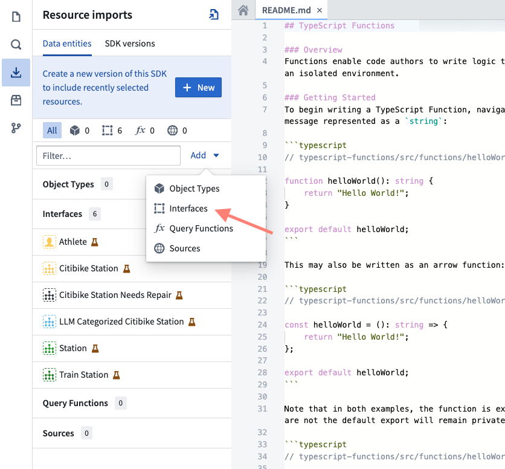
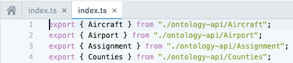

# Import object, interface, and link types导入对象、接口和链接类型

Any object, interface, or link types you want to use in your function must be imported into the Project that contains your repository. Select the **Resource Imports** sidebar to view the object types which have been imported into the Project.您函数中要使用的任何对象、接口或链接类型都必须导入到包含您存储库的项目中。选择资源导入侧边栏以查看已导入到项目中的对象类型。

Your Organization may not have the `Airport` and `Flight` objects. Use any object types you have access to when following these steps.您的组织可能没有 Airport 和 Flight 对象。在遵循这些步骤时，请使用您可以访问的任何对象类型。

To import additional object types, you will need to select the **Add** button in the **Resource Imports** sidebar. If no ontology was selected, you will be prompted to select an ontology. If you have at least one imported ontology type, the selected ontology will automatically be resolved.要导入其他对象类型，您需要选择资源导入侧边栏中的添加按钮。如果没有选择本体，系统将提示您选择一个本体。如果您至少有一个导入的本体类型，所选本体将自动解析。

Once an ontology is selected, a search modal will appear. Your ontology will depend on the object types available in your Organization. Start by selecting a few object types and link types that connect them. In this example, we'll import the `Airport` and `Flight` objects, in addition to the link type between them.一旦选择了本体，就会出现一个搜索模态框。您选择的本体将取决于您组织中可用的对象类型。首先，选择一些对象类型以及连接它们的链接类型。在这个例子中，我们将导入 Airport 和 Flight 对象，以及它们之间的链接类型。

You can also import ontology interfaces by selecting **Interfaces** under the **Add** button.您还可以通过在添加按钮下选择接口来导入本体接口。

Choose **Save** to import the ontology types into the Project. Code Assist will automatically restart to regenerate code bindings to reflect the new object and link types you imported.选择保存以将本体类型导入到项目中。代码助手将自动重新启动以重新生成代码绑定，以反映您导入的新对象和链接类型。

In your code, you may now import ontology types from the `@foundry/ontology-api` package. If you are using a private ontology, the package name will instead be `@foundry/ontology-api/<ontology-api-name>`.在你的代码中，现在可以导入 @foundry/ontology-api 包中的本体类型。如果你使用的是私有本体，包名将是 @foundry/ontology-api/<ontology-api-name> 。

Once Code Assist starts, you can view all the available object types by using `Ctrl` + click on the @foundry/ontology-api package name. The open index.ts file shows all of the valid object types you can import into your code:一旦代码辅助功能启动，你可以通过使用 Ctrl 并点击@foundry/ontology-api 包名来查看所有可用的对象类型。打开的 index.ts 文件显示了你可以导入到你的代码中的所有有效对象类型：

If you have access to more than one ontology, you can use the selector to pick which ontology you would like to use. Currently, importing multiple ontologies into a single project is unsupported.如果你有访问多个本体（ontology）的权限，可以使用选择器来选择你想使用的本体。目前，将多个本体导入单个项目中是不支持的。

