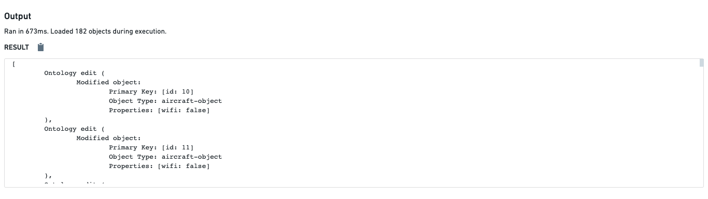

# [](#ontology-edits)Ontology edits本体编辑


An **Ontology edit** is the act of creating, modifying, or deleting an object. Functions support returning [Ontology edits](/docs/foundry/functions/types-reference/#ontology-edit) for use in a [function-backed action](/docs/foundry/action-types/function-actions-overview/).本体编辑是指创建、修改或删除对象的行为。函数支持返回本体编辑，用于在基于函数的动作中使用。


- TypeScript v1 functions are authored using the `@OntologyEditFunction` decorator, which provides special semantics to simplify your code. TypeScript v1 functions also use the [`@Edits` decorator](/docs/foundry/functions/api-ontology-edits/#the-edits-decorator)  to provide actions with provenance information, which the actions may use to [enforce permissions](/docs/foundry/action-types/permissions/). You can write unit tests for TypeScript v1 Ontology edit functions using the APIs available for [verifying Ontology edits](/docs/foundry/functions/unit-test-ontology-edits/).TypeScript v1 函数使用 @OntologyEditFunction 装饰器编写，该装饰器提供特殊语义以简化您的代码。TypeScript v1 函数还使用 @Edits 装饰器为动作提供来源信息，动作可以使用这些信息来执行权限控制。您可以使用用于验证本体编辑的 API 为 TypeScript v1 本体编辑函数编写单元测试。
- TypeScript v2 functions are authored using the [`createEditBatch`](/docs/foundry/functions/typescript-v2-ontology-edits/#construct-an-ontology-edits-batch) function exported from the `@osdk/functions` package. These functions rely on the `Edits` type to provide actions with provenance information.TypeScript v2 函数使用从 @osdk/functions 包中导出的 createEditBatch 函数编写。这些函数依赖于 Edits 类型为动作提供来源信息。
- Python functions are authored by creating an edits container using the [`FoundryClient`](/docs/foundry/functions/python-ontology-edits/#construct-an-ontology-edits-container) exported from the Ontology SDK. These functions rely on the `edits` parameter of the [`@function`](/docs/foundry/functions/python-ontology-edits/#define-an-edit-function) decorator to provide actions with provenance information.Python 函数通过使用 Ontology SDK 导出的 FoundryClient 创建编辑容器来编写。这些函数依赖于 @function 装饰器的 edits 参数来为操作提供溯源信息。


The rest of this document describes how Ontology edit functions work behind the scenes to provide you with a better understanding of the underlying infrastructure.本文档的其余部分描述了 Ontology 编辑函数在后台如何工作，以便您更好地理解底层基础设施。


### [](#when-edits-are-applied)When edits are applied当编辑被应用时


A common misunderstanding about Ontology edit functions is whether or not running them will update objects in the Ontology. When you run an Ontology edit function in the functions helper in **Authoring**, edits are not applied to the actual objects. The only way to update objects using a function is by configuring an action to use the function as described in the documentation for [function-backed actions](/docs/foundry/action-types/function-actions-overview/).关于 Ontology 编辑函数的一个常见误解是运行它们是否会更新 Ontology 中的对象。当您在 Authoring 中的函数辅助工具中运行 Ontology 编辑函数时，编辑不会应用于实际对象。使用函数更新对象的唯一方式是按照函数支持操作的文档中描述的方式配置操作。


This means that you can freely run Ontology edit functions in the functions helper to validate results on various inputs, without concern that the objects themselves will be updated.这意味着你可以在函数辅助工具中自由运行本体编辑函数，以在各种输入上验证结果，而无需担心对象本身会被更新。





### [](#caveats)Caveats注意事项


#### [](#edits-and-object-search)Edits and object search编辑和对象搜索


Changes to objects and links are propagated to the object set APIs *after* your function has finished executing. This means that `Objects.search()` APIs will use the old objects, properties, and links. As a result, search, filtering, search arounds, and aggregations may not reflect the edits to the Ontology, including creation and deletion. Your function will need to handle this case manually.对象和链接的更改在您的函数执行完成后会传播到对象集 API。这意味着 Objects.search() API 将使用旧的对象、属性和链接。因此，搜索、过滤、搜索周围和聚合可能不会反映本体中的编辑，包括创建和删除。您的函数需要手动处理这种情况。


For the following example, assume there is an Employee with ID 1.对于以下示例，假设有一个 ID 为 1 的员工。


TypeScript v1TypeScript v2Python```
Copied!`1import { OntologyEditFunction, Edits } from "@foundry/functions-api";
2import { Employee, Objects } from "@foundry/ontology-api";
3
4export class CaveatEditFunctions {
5    @Edits(Employee)
6    @OntologyEditFunction()
7    public async editAndSearch(): Promise<void> {
8        const employeeOne = Objects.search().employee().filter(e => e.id.exactMatch(1)).all()[0];
9        employeeOne.name = "Bob";
10
11        const count = await Objects.search().employee().filter(e => e.name.exactMatch("Bob").count() ?? -1;
12        console.log(count);
13        // Expected: 1, Actual: 0
14    }
15}`
```

```
Copied!`1import { Client } from "@osdk/client";
2import { Employee } from "@ontology/sdk";
3import { Edits, createEditBatch } from "@osdk/functions";
4
5type OntologyEdit = Edits.Object<Employee>;
6
7async function editAndSearch(client: Client): OntologyEdit[] {
8    const batch = createEditBatch<OntologyEdit>(client);
9
10    const employeeOne = await client(Employee).fetchOne(1);
11    batch.update(employeeOne, { name: "Bob" });
12
13    const count = await client(Employee)
14        .where({
15            name: {
16                $eq: "Bob"
17            }
18        })
19        .aggregate({
20            $select: {
21                $count: "unordered"
22            }
23        })
24        .then(response => response.$count);
25    console.log(count);
26    // Expected: 1, Actual: 0
27
28    return batch.getEdits();
29}
30
31export default editAndSearch;`
```

```
Copied!`1from functions.api import function, OntologyEdit
2from ontology_sdk import FoundryClient
3from ontology_sdk.ontology.objects import Employee
4
5@function(edits=[Employee])
6def edit_and_search() -> list[OntologyEdit]:
7    client = FoundryClient()
8    ontology_edits = client.ontology.edits()
9
10    employee = client.ontology.objects.Employee.get(1)
11    editable_employee = ontology_edits.objects.Employee.edit(employee)
12    editable_employee.name = "Bob"
13
14    count = client.ontology.objects.Employee.where(Employee.object_type.name == "Bob").count().compute()
15    print(count)
16    # Expected: 1, Actual: 0
17
18    return ontology_edits.get_edits()`
```


#### [](#optional-arrays-in-function-backed-actions)Optional arrays in function-backed actions函数支持的动作中的可选数组


While omitted optional arrays are handled as `undefined` when running an `@OntologyEditFunction` in code repositories, they are passed as empty arrays when executing the function through an action.虽然在一个代码库中运行 @OntologyEditFunction 时，省略的可选数组被视为 undefined ，但在通过动作执行函数时，它们会被作为空数组传递。

