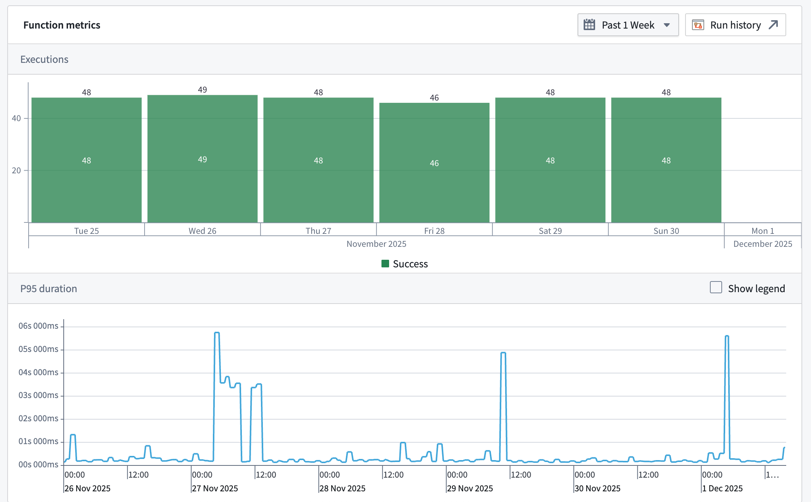

# Function metrics功能指标

Function metrics display the near real-time usage of a function type over the last 30 days. You can access these metrics from a [function type's overview](/docs/foundry/ontology-manager/overview/#function-type-view) page in [Ontology Manager](/docs/foundry/ontology-manager/overview/), or in [Workflow Lineage](/docs/foundry/workflow-lineage/overview/) by selecting the function node for a given execution. The following metrics are available:功能指标显示过去 30 天内功能类型的近实时使用情况。您可以通过本体管理器中功能类型的概览页面，或在工作流谱系中通过选择特定执行的函数节点来访问这些指标。以下指标可用：

- **Success/failure metrics:** Monitor the current status of your functions with success and failure counts. This enables rapid identification of issues and supports proactive troubleshooting, allowing you to address failures as soon as they occur.成功/失败指标：监控您的功能当前状态，包括成功和失败计数。这有助于快速识别问题并支持主动故障排除，让您能够立即处理失败。
- **P95 duration metric:** Track the 95th percentile (P95) execution duration for each function type. This metric highlights the upper range of execution times, helping you detect performance bottlenecks and optimize workflows for consistent and efficient operation.P95 持续时间指标：跟踪每种功能类型的 95 分位数（P95）执行持续时间。此指标突出显示执行时间的上限范围，帮助您检测性能瓶颈并优化工作流以实现一致高效的运行。

You are also able to access [run history](/docs/foundry/aip-observability/run-history/), which provides a complete view of a given function's executions over the past seven days. Learn more about [AIP Observability](/docs/foundry/aip-observability/overview/).您还可以访问运行历史记录，它提供了过去七天中给定函数执行的完整视图。了解更多关于 AIP 可观察性。

All metrics are updated in near real-time using the latest data from the Foundry Telemetry Service (FTS). This ensures you have access to the most current information for monitoring, debugging, and maintaining the health of your functions.所有指标都使用来自 Foundry 遥测服务（FTS）的最新数据以近乎实时的方式更新。这确保您能够获取用于监控、调试和维护函数健康的最新信息。

## Function failure types函数失败类型

Function metrics have a variety of categories of failures that may be displayed. These categories are:函数指标有多种可能显示的失败类别。这些类别包括：

- **Runtime failure:** An unexpected error occurred while executing the function, often due to a bug or unhandled situation in the function's code.运行时错误：在执行函数时发生了意外错误，通常是由于函数代码中的错误或未处理的异常情况。
- **Resource limit exceeded:** The function affected more than the permitted limit of object types (by default, usually 10,000).资源限制超出：受影响的对象类型超过了允许的限制（默认情况下通常为 10,000 个）。
- **User facing error:** An error occurred that is specifically intended to be shown to the user, often providing guidance on what went wrong or how to fix it.用户界面错误：发生了专门设计为向用户显示的错误，通常提供有关错误原因或如何修复的指导。
- **Invalid inputs error:** One or more of the inputs provided to the function were not valid or did not meet the required criteria.无效输入错误：提供给函数的一个或多个输入无效或不满足所需条件。
- **Invalid output error:** The function produced output that was not valid or did not conform to the expected format or rules.无效输出错误：函数产生的输出无效或不符合预期的格式或规则。
- **Data loading not allowed error:** The function execution attempts to load data, including objects, object sets, users, or groups, but is not allowed to do so.数据加载不允许错误：函数执行尝试加载数据，包括对象、对象集、用户或组，但这样做是不被允许的。
- **Undeclared object types edited error:** The function execution attempts to update, create or delete an object whose object type is not declared in the function spec.未声明对象类型编辑错误：函数执行尝试更新、创建或删除一个其对象类型未在函数规范中声明的对象。
- **Structured error:** The function execution encounters a structured error as defined on its spec.结构化错误：函数执行遇到了其规范中定义的结构化错误。
- **Deployment error:** The function execution failed due to an error with the function's deployment.部署错误：函数执行失败，原因是函数部署时出现错误。
- **Consistent snapshot error:** The function failed to execute due to a consistent snapshot error.一致快照错误：函数执行失败，原因是出现了一致快照错误。

## Permissions权限

To view function metrics, you must be a `viewer` on the function.要查看函数指标，您必须是该函数的 viewer 用户。

