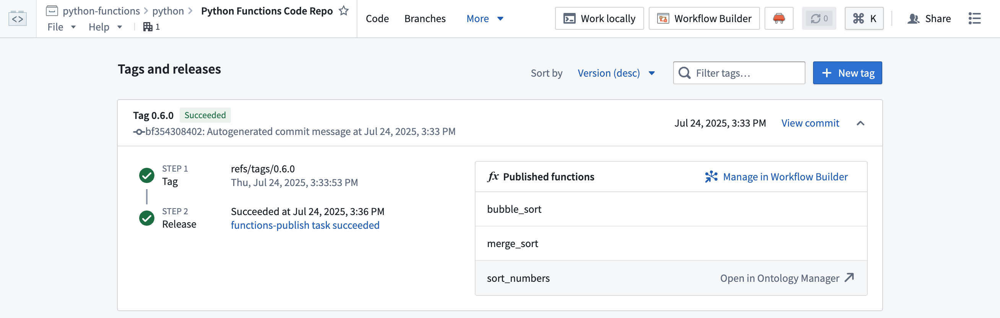
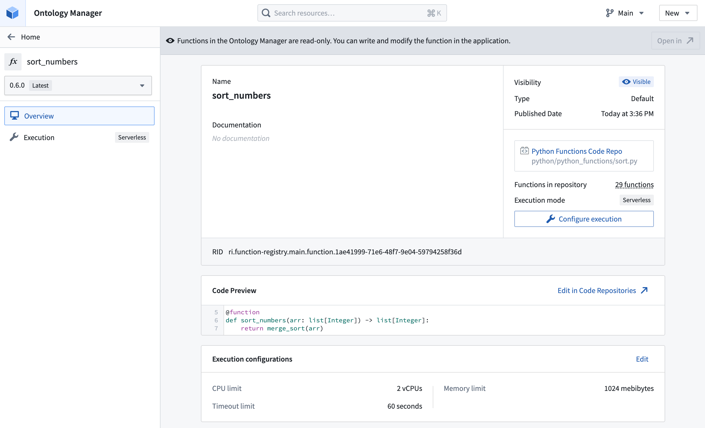
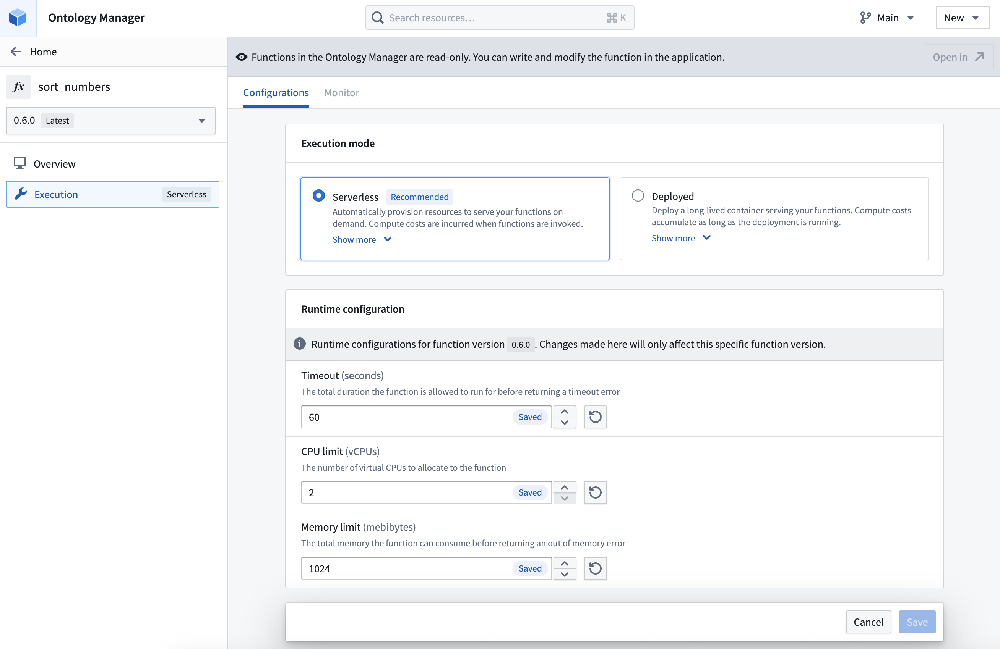
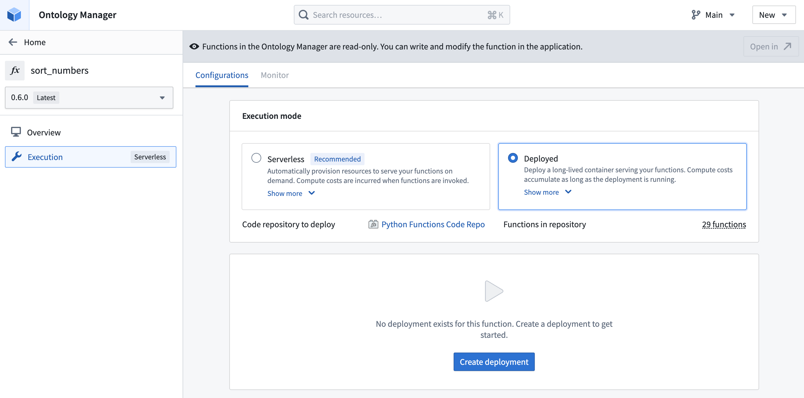
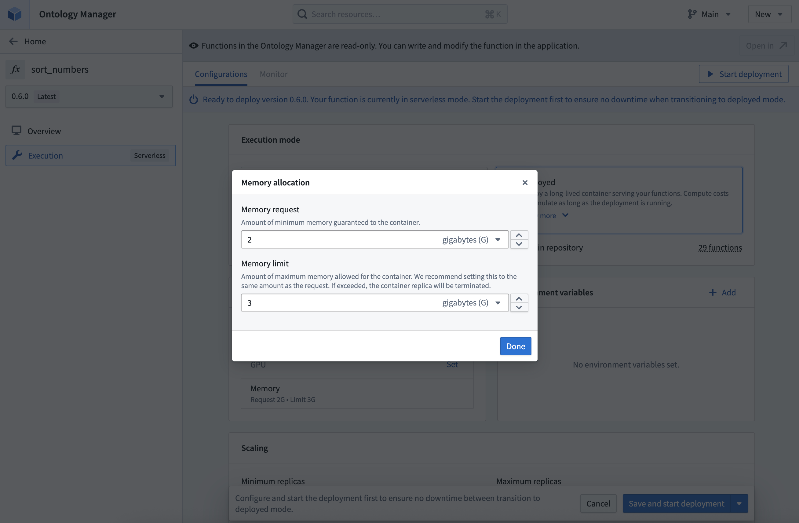
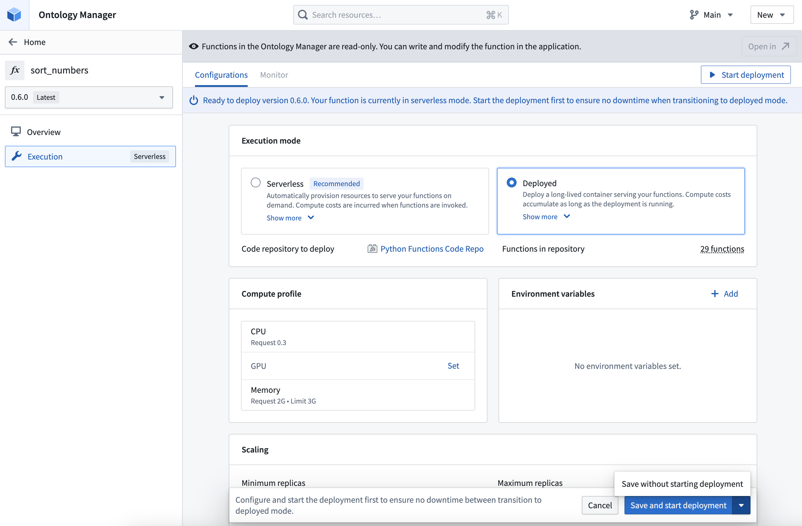
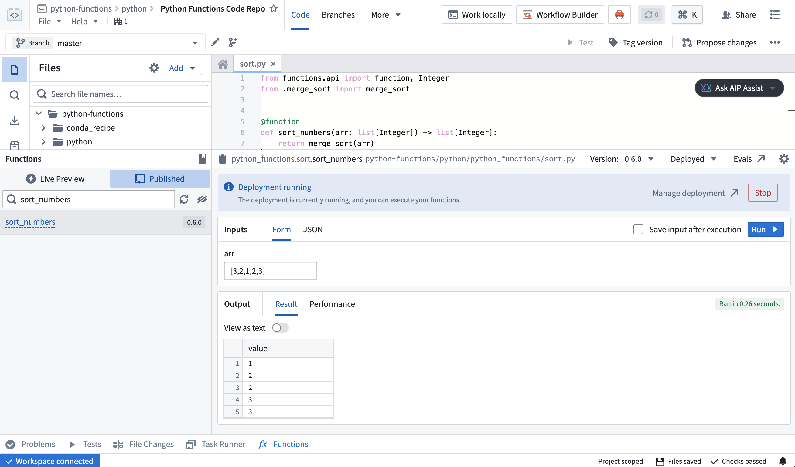

# Deploy functions部署函数

## Prerequisites前提条件

This guide requires that you have already authored and published a Python or TypeScript v2 function. Review the [getting started with Python functions](/docs/foundry/functions/python-getting-started/) or [getting started with TypeScript v2 functions](/docs/foundry/functions/typescript-v2-getting-started/) documentation for a tutorial.本指南要求您已经编写并发布了一个 Python 或 TypeScript v2 函数。请查阅 Python 函数入门指南或 TypeScript v2 函数入门指南文档以获取教程。

## Choose between deployed and serverless execution modes选择部署和服务器 less 执行模式

If serverless functions are enabled for your enrollment, new repositories will use it by default. We generally recommend serverless functions for most use cases. While a deployed function may be useful in some circumstances, the serverless execution mode requires less maintenance and avoids incurring the costs associated with long-lived deployments.如果您已启用服务器 less 函数，新仓库将默认使用该模式。我们通常推荐大多数用例使用服务器 less 函数。虽然部署函数在某些情况下可能有用，但服务器 less 执行模式需要更少的维护，并避免了与长期部署相关的成本。

Deployed functions have some capabilities that are not available to serverless functions:部署的函数具有一些服务器端函数不可用的功能：

- The long-lived nature of deployed functions means that local caching may be possible if the function is tolerant to restarts.部署的函数具有持久性，如果函数能够容忍重启，则可能进行本地缓存。
- Serverless functions support [external sources](/docs/foundry/functions/api-calls/) using the client from the provided source object, but they do not support third-party clients. You must deploy your function to make external API calls with third-party clients.服务器端函数通过提供的源对象客户端支持外部源，但它们不支持第三方客户端。您必须部署您的函数以使用第三方客户端进行外部 API 调用。
- Deployed functions support GPU allocations to accelerate computationally intensive model training and inference workflows through parallel processing, while serverless functions do not.部署的函数支持 GPU 分配，通过并行处理加速计算密集型的模型训练和推理工作流，而服务器端函数不支持。

Deployed functions have some limitations that do not apply to serverless execution:部署的函数有一些限制，这些限制不适用于无服务器执行：

- Serverless functions enable different versions of a single function to be executed on demand, making upgrades safer. With deployed functions, you can only run a single function version at a time.无服务器函数允许按需执行同一函数的不同版本，使升级更安全。对于已部署的函数，您一次只能运行一个函数版本。
- Serverless functions only incur costs when executed, while deployed functions incur costs as long as the deployment is running.无服务器函数只有在执行时才会产生费用，而已部署的函数只要部署在运行状态就会产生费用。
- Serverless functions require less upfront setup and long-term maintenance, as the infrastructure is managed automatically.无服务器函数需要较少的前期设置和长期维护，因为基础设施由系统自动管理。

To enable serverless functions for your enrollment, contact your Palantir administrator.要为您的注册启用无服务器函数，请联系您的 Palantir 管理员。

## Architecture架构

Functions can be run in a serverless mode, leveraging on-demand resources, or they can be deployed to a long-lived container.函数可以以无服务器模式运行，利用按需资源，或者可以部署到长生命周期的容器中。

We recommend using serverless functions if enabled on your enrollment, rather than deployed functions. While there are [some cases where deployed functions are useful](#choose-between-deployed-and-serverless-execution-modes), the serverless executor is generally more flexible.如果您的注册启用了无服务器函数，我们建议使用无服务器函数而不是部署的函数。虽然部署的函数在某些情况下很有用，但无服务器执行器通常更灵活。

When your function is deployed, a long-running environment will be created to handle incoming execution requests. The environment will be scaled according to the request volume and occasionally restarted by automated processes. All functions from a single repository are hosted by a single deployment.当您的函数部署时，将创建一个长时间运行的环境来处理传入的执行请求。该环境将根据请求量进行扩展，并由自动过程偶尔重启。来自单个存储库的所有函数都由单个部署托管。

Compute costs计算成本Deployed functions will incur compute costs for the running deployment. Serverless functions will only incur costs when executed.部署的函数将对运行部署产生计算成本。无服务器函数只有在执行时才会产生成本。

## Deploy a function部署一个函数

Follow the steps below to configure and deploy a function:按照以下步骤配置和部署函数：

1. Open your function repository and navigate to the **Branches** tab, then select **Tags and releases**.打开您的函数仓库，导航到分支标签页，然后选择标签和发布。
2. Hover over the function you want to deploy, then select **Open in Ontology Manager**.将鼠标悬停在您要部署的函数上，然后选择在本体管理器中打开。

1. Select the version of the function you want to use from the version selector on the left.从左侧的版本选择器中选择您要使用的函数版本。
2. Select **Configure execution**.选择配置执行。

1. If serverless functions are enabled in your environment, you will see an option to switch between serverless and deployed. If unselected and no deployment exists, serverless will be used by default.如果您的环境中启用了无服务器函数，您将看到一个选项，可以在无服务器和已部署之间切换。如果未选中且不存在部署，将默认使用无服务器。

1. Select the **Deployed** execution mode option.选择已部署执行模式选项。
2. If no deployment exists for the function, select **Create deployment**.如果该函数不存在部署，请选择创建部署。

1. Defaults will be applied for the configuration when the deployment is first created. You can view the entire configuration by scrolling down to the end of the page.在首次创建部署时，将应用配置的默认值。您可以通过向下滚动到页面底部查看整个配置。

1. Modify the deployment configuration as needed. You can configure the following:
根据需要修改部署配置。您可以配置以下内容：- The compute resources allocated to the deployment, including CPU, GPU, and memory.分配给部署的计算资源，包括 CPU、GPU 和内存。
- The minimum limit and the maximum limit for autoscaling based on request load.基于请求负载的自动扩展的最小限制和最大限制。
- The environment variables that will be set for the deployment upon startup.在启动时将为部署设置的环境变量。
- The total duration the function is allowed to run before returning a timeout error. Unlike the other deployment settings, timeout is configured individually for each function version.函数在返回超时错误之前被允许运行的总持续时间。与其他部署设置不同，超时是针对每个函数版本单独配置的。
  - The compute resources allocated to the deployment, including CPU, GPU, and memory.分配给部署的计算资源，包括 CPU、GPU 和内存。
  - The minimum limit and the maximum limit for autoscaling based on request load.基于请求负载的自动扩展的最小限制和最大限制。
  - The environment variables that will be set for the deployment upon startup.在启动时将为部署设置的环境变量。
  - The total duration the function is allowed to run before returning a timeout error. Unlike the other deployment settings, timeout is configured individually for each function version.函数在返回超时错误之前被允许运行的总持续时间。与其他部署设置不同，超时是针对每个函数版本单独配置的。
  
  

1. Select **Save and start deployment** to save any changes and launch the deployment. You may also select **Save without starting deployment** to save the configuration without launching the deployment.选择“保存并开始部署”以保存任何更改并启动部署。您也可以选择“保存而不开始部署”以保存配置而不启动部署。

1. If you chose to **Save and start deployment** option is selected, you will need to wait for the deployment that is hosting the function to start up. This may take a few minutes.如果你选择了“保存并开始部署”选项，你需要等待托管该函数的部署启动。这可能需要几分钟时间。
2. To verify that the deployment is running, navigate to the code repository containing the function and run the function. The function should execute successfully and return the expected result.要验证部署是否运行，请导航到包含该函数的代码库并运行该函数。该函数应成功执行并返回预期结果。

