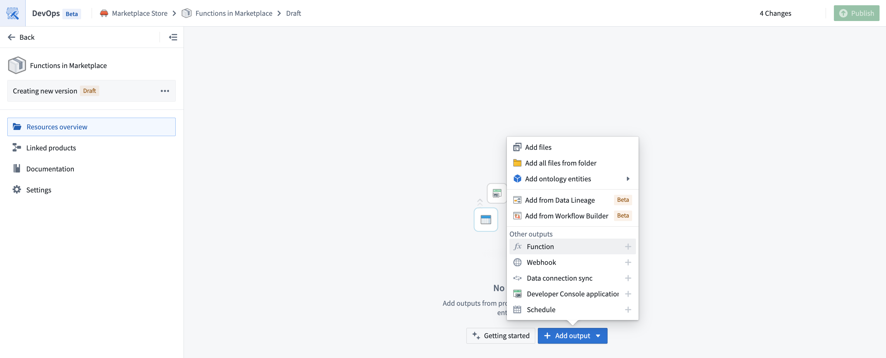
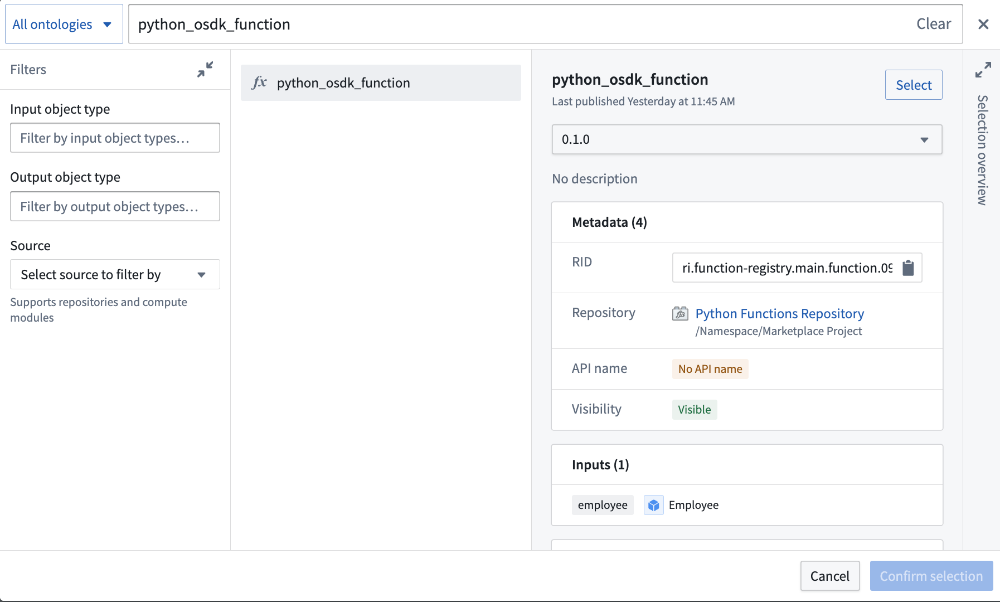
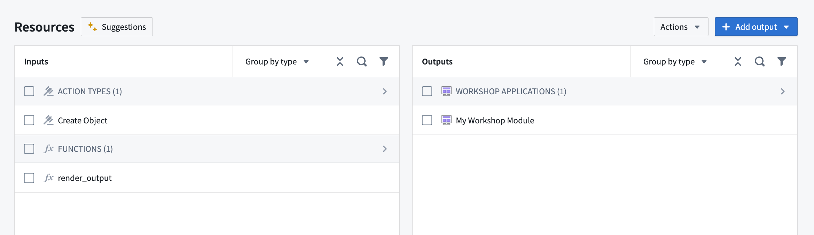
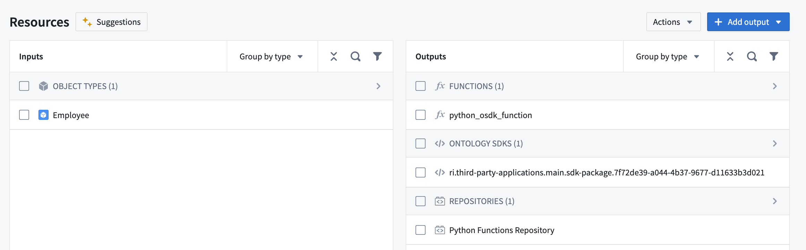
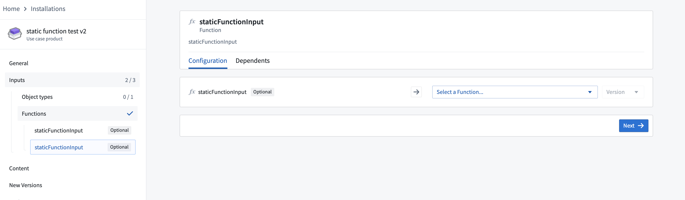

# [](#add-functions-to-a-marketplace-product)Add functions to a Marketplace product为 Marketplace 产品添加功能


Use [Foundry DevOps](/docs/foundry/devops/overview/) to include your functions in [Marketplace products](/docs/foundry/devops/core-concepts/#product) for other users to install and reuse. [Learn how to create your first product.](/docs/foundry/foundry-devops/create-products/)使用 Foundry DevOps 将您的功能包含在 Marketplace 产品中，供其他用户安装和重用。了解如何创建您的第一个产品。


## [](#supported-features)Supported features支持的功能


DevOps packages functions for installation and reuse but does not provide user-viewable source code for [TypeScript V1 functions](/docs/foundry/functions/typescript-v1-getting-started/). This means that after installation, you will be able to use the installed TypeScript functions, but you will not be able to view their source logic; the repository accompanying the function will be empty.DevOps 为安装和重用打包功能，但不为 TypeScript V1 功能提供用户可查看的源代码。这意味着安装后，您将能够使用已安装的 TypeScript 功能，但您将无法查看其源逻辑；伴随功能存储库将是空的。


[Python](/docs/foundry/functions/python-getting-started/) and [TypeScript V2](/docs/foundry/functions/typescript-v2-getting-started/) functions do include user-viewable source code in the Marketplace product. However, the contents of the functions still cannot be edited after installation when installed in production mode.Python 和 TypeScript V2 功能在 Marketplace 产品中确实包含用户可查看的源代码。但是，当以生产模式安装时，功能的内容仍然无法编辑。


## [](#adding-functions-to-products)Adding functions to products为产品添加功能


To add a function to a product, [create a product](/docs/foundry/foundry-devops/create-products/). Then, add a **Function** output as shown below.要为产品添加功能，请创建一个产品。然后，按照以下方式添加一个功能输出。





You will then be prompted to choose a function and a version. In most cases, you should select the latest version of a function.接下来，系统会提示您选择一个功能和一个版本。在大多数情况下，您应该选择功能的最新版本。





While you can select functions directly, we recommend first adding content such as [Workshop applications](/docs/foundry/workshop/marketplace-workshop/); the functions these resources require will be automatically added as [inputs](/docs/foundry/foundry-devops/create-products/#add-inputs) to your product.虽然可以直接选择功能，但我们建议首先添加内容，例如工作坊应用；这些资源所需的功能将自动作为输入添加到您的产品中。





## [](#use-osdk-functions-in-marketplace-products)Use OSDK functions in Marketplace products在 Marketplace 产品中使用 OSDK 函数


Python and TypeScript V2 functions that use OSDKs can also be packaged as outputs in Marketplace products. When you add a function that uses an OSDK as an output to your Marketplace product, the OSDK will also be added as an output while the ontology entities used in your OSDK will be added as inputs.使用 OSDK 的 Python 和 TypeScript V2 函数也可以作为输出打包在 Marketplace 产品中。当您将使用 OSDK 的函数作为输出添加到您的 Marketplace 产品时，OSDK 也将作为输出添加，而您的 OSDK 中使用的本体实体将作为输入添加。





Users who install your Marketplace product will then be able to remap the objects, links, and other ontology entities referenced in your OSDK to refer to entities in the ontology where the product is being installed.用户安装您的 Marketplace 产品后，将能够重新映射您在 OSDK 中引用的对象、链接和其他本体实体，使其指向产品安装的本体中的实体。


When the function is executed after installation, it will automatically use the ontology entities that were configured during installation.安装后执行该功能时，将自动使用安装过程中配置的本体实体。


## [](#function-overrides-at-installation)Function overrides at installation安装时的函数重载


Calling [queries](/docs/foundry/functions/query-functions/) or [making API calls](/docs/foundry/functions/api-calls/) within overridden static functions is not supported.在重载的静态函数内调用查询或进行 API 调用是不支持的。


It is possible to modify parts of a function’s behavior at install time by providing a locally defined function which overrides the “static” function input that is shipped with your Marketplace product. To do this, you can specify that a particular function may be overridden by using the `@Static` decorator.通过提供一个本地定义的函数来覆盖随您的 Marketplace 产品一起提供的“静态”函数输入，可以在安装时修改函数的部分行为。为此，您可以使用 @Static 装饰器来指定某个函数可以被重载。


For example, consider a function that negates a given number:例如，考虑一个取反给定数字的函数：


```
`// Normal function

import { Function, Double } from "@foundry/functions-api";

export class MyFunctions {

    @Function()
    public async modifyNumber(d: Double): Promise<Double> {
        return -d;
    }

}
`
```


To make this function overridable, rewrite it as follows:要使此函数可重写，请按如下方式重写：


```
`// Overridable function

import { Function, Static, Double } from "@foundry/functions-api";

export class MyFunctions {

    @Function()
    public async modifyNumberByStaticFoo(
        n: Double,
        @Static() staticFunctionInput: (num: Double) => Promise<Double> = this.defaultFoo
        ): Promise<Double> {
        return await staticFunctionInput(n);
    }

    private async defaultFoo(n: number) {
        return -n;
    }

}
`
```


When packaging a static function, inputs will appear as `staticFunctionInputs` during installation, as shown below. Installers can then provide their own function logic that will override the default behavior. Conceptually, the `staticFunctionInputs` serve as function input parameters to the overridable function.在打包静态函数时，输入在安装过程中会显示为 staticFunctionInputs ，如下所示。安装程序可以提供自己的函数逻辑，从而覆盖默认行为。从概念上讲， staticFunctionInputs 作为可覆盖函数的输入参数。





For example, you may have a supply chain optimization function whose logic needs slight adjustments in another context. To allow this, specify that the function is overridable before packaging it, and then override it during installation.例如，您可能有一个供应链优化功能，其逻辑需要在另一个环境中进行微调。为了实现这一点，请在打包前指定该功能是可覆盖的，然后在安装期间进行覆盖。

