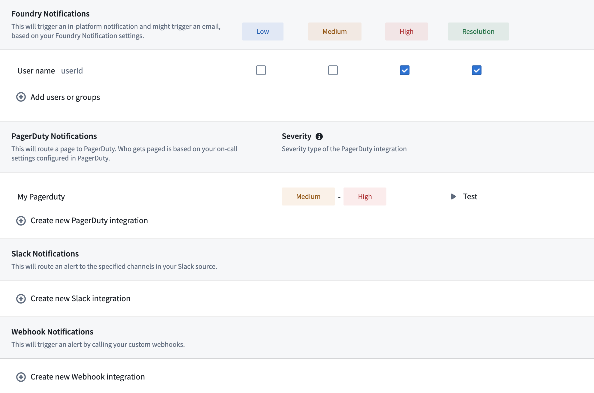

# Function monitoring功能监控

Functions in Foundry can be monitored to track performance and reliability. This page explains the available monitoring capabilities for functions.Foundry 中的函数可以监控以跟踪性能和可靠性。本页面解释了函数的可用监控功能。

## Available monitoring rules可用的监控规则

Function monitoring in Foundry supports two key rule types:Foundry 中的函数监控支持两种关键规则类型：

1. **Function duration p95:** Alerts when the 95th percentile execution time exceeds thresholds.函数执行时长 p95：当 95% 分位数执行时间超过阈值时发出警报。
2. **Number of function failures in window:** Alerts when failure count exceeds thresholds within a timeframe.窗口内函数失败次数：当在特定时间段内失败计数超过阈值时发出警报。

For detailed configuration options and parameters, review our [monitoring rules reference documentation](/docs/foundry/monitoring-views/rules-reference/#function-rules).有关详细的配置选项和参数，请参阅我们的监控规则参考文档。

## Set up function monitoring设置函数监控

To set up monitoring for your functions, follow the standard process for creating monitoring views and rules:要为您的函数设置监控，请遵循创建监控视图和规则的标准流程：

1. Create a monitoring view as described in the [monitoring views overview documentation](/docs/foundry/monitoring-views/overview/#create-a-new-monitoring-view).按照监控视图概述文档中的说明创建一个监控视图。
2. Add a monitoring rule for functions as described in the section on [adding a monitoring rule](/docs/foundry/monitoring-views/overview/#add-a-monitoring-rule).按照添加监控规则的章节说明为函数添加一个监控规则。
3. Configure appropriate thresholds and severity levels.配置适当的阈值和严重程度级别。
4. Set up alert notifications following the [alert subscription guide](/docs/foundry/monitoring-views/overview/#subscribe-to-alerts).按照警报订阅指南设置警报通知。

## Related documentation相关文档

- [Monitoring rules reference监控规则参考](/docs/foundry/monitoring-views/rules-reference/#function-rules)
- [Monitoring views overview监控视图概览](/docs/foundry/monitoring-views/overview/)
- [External system integration](/docs/foundry/monitoring-views/external-systems/) for alerts外部系统集成用于警报

