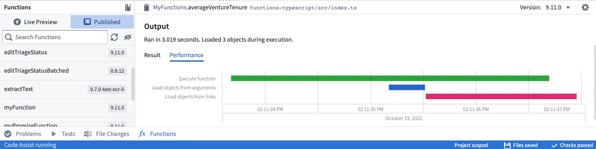

# [](#optimize-performance)Optimize performance优化性能


This page describes best practices for optimizing function performance and resource usage. Following these guidelines helps minimize compute consumption and ensures your functions run efficiently.本页面描述了优化函数性能和资源使用的最佳实践。遵循这些指南有助于最小化计算消耗，并确保您的函数高效运行。


For information about compute costs and how functions are metered, see [Compute usage with Ontology queries](/docs/foundry/ontologies/query-compute-usage/).有关计算成本和函数如何计量的信息，请参阅使用本体查询的计算使用情况。


## [](#understand-function-compute-costs)Understand function compute costs了解函数计算成本


The cost of a function has multiple components:一个函数的成本包含多个组成部分：


- **Overhead:** Each function execution has a fixed overhead of 4 compute-seconds, regardless of what it does.开销：每个函数执行都有一个固定的开销，为 4 计算秒，无论它做什么。
- **Compute time:** The vCPU time the function needs to execute.计算时间：函数执行所需的 vCPU 时间。
- **External calls:** Calls to other parts of the platform (Ontology queries, model inference, LLM calls) incur their own costs.外部调用：调用平台的其它部分（本体查询、模型推理、LLM 调用）会产生各自的成本。


For more information about how compute-seconds are calculated and measured in the platform, see [Usage types](/docs/foundry/resource-management/usage-types/).关于平台中计算秒是如何计算和测量的更多信息，请参阅使用类型。


## [](#use-the-performance-tab)Use the Performance tab使用性能选项卡


The performance tab provides a tool to analyze and identify performance issues with your functions.性能选项卡提供了一个工具，用于分析和识别您的函数的性能问题。





The waterfall graph represents operations as horizontal bars stretched out across time on the X-axis. There are markers for each operation to indicate how time is spent.瀑布图将操作表示为在 X 轴上随时间展开的水平条。每个操作都有标记，以指示时间的花费。


- **Execute function** indicates CPU time spent executing the function code.执行函数表示 CPU 执行函数代码所花费的时间。
- **Load objects from arguments** and **Load objects from links** indicate the time spent calling the underlying Ontology backend database service (OSS).从参数加载对象和从链接加载对象表示调用底层本体后台数据库服务（OSS）所花费的时间。


To improve function performance:为了提高函数性能：


- Use the Objects API to aggregate and traverse links more quickly than within function context (as described in [Prefer using the Objects API where possible](#prefer-using-the-objects-api-where-possible)).使用对象 API 比在函数上下文中聚合和遍历链接更快（如“尽可能使用对象 API”所述）。
- Ensure Ontology backend service calls are done in parallel to avoid sequential loads. If you have multiple `async`/`await` calls, use `Promise.all` to await all the calls in parallel.
确保本体后台服务调用是并行进行的，以避免顺序加载。如果你有多个 async / await 调用，使用 Promise.all 来并行等待所有调用。- For example, a common pattern is to use `.map()` on a list to create Promises, then use `Promise.all` on the resulting list.例如，一个常见模式是在列表上使用 .map() 来创建 Promise，然后在结果列表上使用 Promise.all 。
- **Important:** Using `Promise.all()` improves execution speed but does not reduce resource consumption or cost. You still make the same number of operations—they just run in parallel. Bulk operations are both faster and more cost-effective.重要提示：使用 Promise.all() 可以提高执行速度，但不会减少资源消耗或成本。你仍然执行相同数量的操作——只是它们并行运行。批量操作既更快也更经济。
  - For example, a common pattern is to use `.map()` on a list to create Promises, then use `Promise.all` on the resulting list.例如，一个常见模式是在列表上使用 .map() 来创建 Promise，然后在结果列表上使用 Promise.all 。
  - **Important:** Using `Promise.all()` improves execution speed but does not reduce resource consumption or cost. You still make the same number of operations—they just run in parallel. Bulk operations are both faster and more cost-effective.重要提示：使用 Promise.all() 可以提高执行速度，但不会减少资源消耗或成本。你仍然执行相同数量的操作——只是它们并行运行。批量操作既更快也更经济。
  
  - Avoid unnecessary nested loops, which can increase execution time.避免不必要的嵌套循环，这会增加执行时间。


## [](#choose-efficient-input-types)Choose efficient input types选择高效的输入类型


When designing functions, the type of input parameter you choose significantly affects performance. Use the most efficient input type that meets your requirements.在设计函数时，你选择的输入参数类型会显著影响性能。使用能满足你要求的最高效的输入类型。


**Best practice:** Use object sets when possible for maximum efficiency and scalability.
**Acceptable:** Use object arrays when you need to work with objects in memory.
**Anti-pattern:** Single object parameters should only be used when your object type contains just one instance or when specific business logic genuinely requires per-object processing.最佳实践：尽可能使用对象集以实现最大效率和可扩展性。可接受：当你需要在内存中处理对象时，使用对象数组。反模式：单个对象参数仅在你对象类型只包含一个实例或特定业务逻辑确实需要按对象处理时使用。


| Input type输入类型 | Efficiency效率 | Use case用例 |
| --- | --- | --- |
| Object set对象集 | Best最佳 | Queryable set of objects; no upfront loading cost if you only need aggregations可查询的对象集合；如果你只需要聚合，则无需预先加载成本 |
| Object array对象数组 | Good良好 | When you need to iterate over specific objects当你需要遍历特定对象时 |
| Single object单个对象 | Least efficient最低效 | When business logic requires processing one object at a time当业务逻辑需要一次处理一个对象时 |


### [](#best-practice-object-sets)Best practice: Object sets最佳实践：对象集


Objects passed as parameters trigger Ontology queries to load the object data. Even a single object input triggers a call to load that object into memory.作为参数传递的对象会触发本体查询以加载对象数据。即使是单个对象输入也会触发调用以将该对象加载到内存中。


**Object sets** are preferable because they defer loading until you actually need the data. If you only need an aggregation (like count or sum), the Ontology backend computes it without loading individual objects.对象集更优，因为它们会推迟加载，直到你实际需要数据。如果你只需要聚合（如计数或求和），本体后端会计算它，而无需加载单个对象。


PythonTypeScript v2TypeScript v1```
Copied!`1from functions.api import function, Float
2from ontology_sdk.ontology.objects import ExampleDataAircraft
3from ontology_sdk.ontology.object_sets import ExampleDataAircraftObjectSet
4
5# Less efficient: Single object triggers upfront loading
6
7@function()
8def get_aircraft_name(aircraft: ExampleDataAircraft) -> str:
9    return aircraft.display_name
10
11# Moderate: Array of objects triggers upfront loading
12
13@function()
14def get_aircrafts_names(aircraft_array: list[ExampleDataAircraft]) -> list[str]:
15    return [aircraft.display_name for aircraft in aircraft_array]
16
17# Most efficient: Object set defers loading until needed
18
19# Here, only the aggregated value is loaded in memory of the function
20@function()
21def count_aircrafts(aircraft_set: ExampleDataAircraftObjectSet) -> Float:
22    return aircraft_set.count().compute()`
```

```
Copied!`1// getAircraftName.ts - Less efficient: Single object triggers upfront loading
2import { Osdk } from "@osdk/client";
3import { ExampleDataAircraft } from "@ontology/sdk";
4
5export default function getAircraftName(aircraft: Osdk.Instance<ExampleDataAircraft>): string {
6    return aircraft.displayName!;
7}
8
9// getAircraftsNames.ts - Moderate: Array of objects triggers upfront loading
10import { Osdk } from "@osdk/client";
11import { ExampleDataAircraft } from "@ontology/sdk";
12
13export default function getAircraftsNames(aircraftArray: Osdk.Instance<ExampleDataAircraft>[]): string[] {
14    return aircraftArray.map(e => e.displayName!);
15}
16
17// countAircrafts.ts - Most efficient: Object set defers loading until needed
18// Here, only the aggregated value is loaded in memory of the function
19import { ObjectSet } from "@osdk/client";
20import { Integer } from "@osdk/functions";
21import { ExampleDataAircraft } from "@ontology/sdk";
22
23export default async function countAircrafts(aircraftSet: ObjectSet<ExampleDataAircraft>): Promise<Integer> {
24    const result = await aircraftSet.aggregate({
25        $select: { $count: "unordered" }
26    });
27    return result.$count;
28}`
```

```
Copied!`1import { Function, Integer } from "@foundry/functions-api";
2import { ObjectSet, ExampleDataAircraft } from "@foundry/ontology-api";
3
4export class MyFunctions {
5    // Less efficient: Single object triggers upfront loading
6    @Function()
7    public getAircraftName(aircraft: ExampleDataAircraft): string {
8        return aircraft.displayName!;
9    }
10
11    // Moderate: Array of objects triggers upfront loading
12    @Function()
13    public getAircraftsNames(aircraftArray: ExampleDataAircraft[]): string[] {
14        return aircraftArray.map(e => e.displayName!);
15    }
16
17    // Most efficient: Object set defers loading until needed
18    // Here, only the aggregated value is loaded in memory of the function
19    @Function()
20    public async countAircrafts(aircraftSet: ObjectSet<ExampleDataAircraft>): Promise<Integer> {
21        const count = await aircraftSet.count();
22        return count!;
23    }
24}`
```


## [](#load-objects-efficiently)Load objects efficiently高效加载对象


The common source of performance issues in functions comes from loading objects inefficiently. Loading objects one at a time in a loop causes a round-trip to the ontology on each iteration.函数中性能问题的常见来源是加载对象效率低下。在循环中逐个加载对象会导致每次迭代都向本体发起一次往返请求。


### [](#anti-pattern-loading-objects-one-by-one)Anti-pattern: Loading objects one by one反模式：逐个加载对象


Loading objects inside a loop is an anti-pattern that significantly impacts performance. Each iteration makes a separate query to the Ontology:在循环中加载对象是一种反模式，会显著影响性能。每次迭代都会向本体发起单独的查询：


PythonTypeScript v2TypeScript v1```
Copied!`1from functions.api import function
2from ontology_sdk import FoundryClient
3from ontology_sdk.ontology.objects import ExampleDataAircraft
4
5# Anti-pattern: Objects loaded one by one in a loop
6
7@function()
8def for_loop_worst(pks_list: list[str]) -> int:
9    client = FoundryClient()
10    seats_count = 0
11
12    for current_pk in pks_list:
13        aircrafts = client.ontology.objects.ExampleDataAircraft.where(
14            ExampleDataAircraft.object_type.tail_number == current_pk
15        ).page()
16        aircraft = aircrafts.data[0]
17        seats_count += aircraft.number_of_seats or 0
18
19    return seats_count
20
21# Better: Load all objects in one call, then iterate
22
23@function()
24def for_loop_better(pks_list: list[str]) -> int:
25    client = FoundryClient()
26    seats_count = 0
27
28    aircrafts = client.ontology.objects.ExampleDataAircraft.where(
29        ExampleDataAircraft.object_type.tail_number.in_(pks_list)
30    )
31
32    for aircraft in aircrafts:
33        seats_count += aircraft.number_of_seats or 0
34
35    return seats_count
36
37# Best: Let the backend perform the aggregation
38
39@function()
40def for_loop_best(pks_list: list[str]) -> int:
41    client = FoundryClient()
42
43    result = client.ontology.objects.ExampleDataAircraft.where(
44        ExampleDataAircraft.object_type.tail_number.in_(pks_list)
45    ).sum(ExampleDataAircraft.object_type.number_of_seats).compute()
46
47    return int(result or 0)`
```

```
Copied!`1// forLoopWorst.ts - Anti-pattern: Objects loaded one by one in a loop
2import { Client, Osdk } from "@osdk/client";
3import { ExampleDataAircraft } from "@ontology/sdk";
4import { Integer } from "@osdk/functions";
5
6export default async function forLoopWorst(client: Client, pks_list: string[]): Promise<Integer> {
7    let seatsCount = 0;
8
9    for (const currentPk of pks_list) {
10        const fetchedPage = await client(ExampleDataAircraft).where({
11            tailNumber: { $eq: currentPk }
12        }).fetchPage();
13        const aircraft = fetchedPage.data[0];
14        seatsCount += aircraft?.numberOfSeats ?? 0;
15    }
16
17    return seatsCount;
18}
19
20// forLoopBetter.ts - Better: Load all objects in one call, then iterate
21import { Client, Osdk } from "@osdk/client";
22import { ExampleDataAircraft } from "@ontology/sdk";
23import { Integer } from "@osdk/functions";
24
25export default async function forLoopBetter(client: Client, pks_list: string[]): Promise<Integer> {
26    let seatsCount = 0;
27
28    const allObjects = client(ExampleDataAircraft).where({
29        tailNumber: { $in: pks_list }
30    });
31
32    for await (const currentObject of allObjects.asyncIter()) {
33        seatsCount += currentObject?.numberOfSeats ?? 0;
34    }
35
36    return seatsCount;
37}
38
39// forLoopBest.ts - Best: Let the backend perform the aggregation
40import { Client } from "@osdk/client";
41import { ExampleDataAircraft } from "@ontology/sdk";
42import { Integer } from "@osdk/functions";
43
44export default async function forLoopBest(client: Client, pks_list: string[]): Promise<Integer> {
45    const result = await client(ExampleDataAircraft).where({
46        tailNumber: { $in: pks_list }
47    }).aggregate({
48        $select: { "numberOfSeats:sum": "unordered" }
49    });
50
51    return result.numberOfSeats.sum!;
52}`
```

```
Copied!`1import { Function, Integer } from "@foundry/functions-api";
2import { Objects, ExampleDataAircraft } from "@foundry/ontology-api";
3
4export class MyFunctions {
5    // Anti-pattern: Objects loaded one by one in a loop
6    @Function()
7    public forLoopWorst(pks_list: string[]): Integer {
8        let seatsCount = 0;
9
10        for (const currentPk of pks_list) {
11            const aircraft = Objects.search()
12                .exampleDataAircraft()
13                .filter(o => o.tailNumber.exactMatch(currentPk))
14                .all()[0];
15            seatsCount += aircraft.numberOfSeats ?? 0;
16        }
17
18        return seatsCount;
19    }
20
21    // Better: Bulk load objects, then iterate
22    @Function()
23    public forLoopBetter(pks_list: string[]): Integer {
24        const allObjects = Objects.search()
25            .exampleDataAircraft()
26            .filter(o => o.tailNumber.exactMatch(...pks_list))
27            .all();
28
29        let seatsCount = 0;
30        for (const currentObject of allObjects) {
31            seatsCount += currentObject.numberOfSeats ?? 0;
32        }
33
34        return seatsCount;
35    }
36
37    // Best: Let the backend perform the aggregation
38    @Function()
39    public async forLoopBest(pks_list: string[]): Promise<Integer> {
40        const seatsCount = await Objects.search()
41            .exampleDataAircraft()
42            .filter(o => o.tailNumber.exactMatch(...pks_list))
43            .sum(o => o.numberOfSeats);
44
45        return seatsCount!;
46    }
47}`
```


### [](#best-practice-backend-aggregations)Best practice: Backend aggregations最佳实践：后端聚合


When you need to compute aggregates like counts, sums, or averages, use the Ontology backend's aggregation capabilities instead of loading objects and computing in your function.当你需要计算计数、求和或平均值等聚合值时，应使用本体后端的聚合功能，而不是在函数中加载对象进行计算。


## [](#prefer-using-the-objects-api-where-possible)Prefer using the Objects API where possible尽可能使用 Objects API


A common paradigm when using [Workshop's derived properties](/docs/foundry/workshop/widgets-object-table/#function-backed-columns) is to calculate the property value by aggregating over each object's links (for example, counting the number of related objects).使用 Workshop 的派生属性时，一个常见的范式是通过聚合每个对象的链接来计算属性值（例如，计算相关对象的数量）。


Although the code below works, the function itself must retrieve all linked objects, and then perform an aggregation (in this case, calculating the length):尽管下面的代码可以工作，但该函数本身必须检索所有链接的对象，然后执行聚合（在这种情况下，计算长度）：


```
Copied!`1@Function()
2public async getEmployeeProjectCount(employees: Employee[]): Promise<FunctionsMap<Employee, Integer>> {
3    const promises = employees.map(employee => employee.workHistory.allAsync());
4    const allEmployeeProjects = await Promise.all(promises);
5    let functionsMap = new FunctionsMap();
6    for (let i = 0; i < employees.length; i++) {
7        functionsMap.set(employees[i], allEmployeeProjects[i].length);
8    }
9    return functionsMap;
10}`
```


While the above takes advantage of the async API and asynchronous functions (see [Optimizing link traversals](#optimizing-link-traversals)), it's often beneficial to use the aggregation methods provided by the Objects API:虽然上述内容利用了异步 API 和异步函数（参见优化链接遍历），但通常使用 Objects API 提供的聚合方法会更有利：


```
Copied!`1@Function()
2public async getEmployeeProjectCount(employees: Employee[]): Promise<FunctionsMap<Employee, Integer>> {
3    const result: FunctionsMap<Employee, Integer> = new FunctionsMap();
4    // Get all projects that have an employeeId matching from the employees parameter, then count how many projects are mapped to each employeeId
5    const aggregation = await Objects.search().project()
6            .filter(project => project.employeeId.exactMatch(...employees.map(employee => employee.id)))
7            .groupBy(project => project.employeeId.byFixedWidths(1))
8            .count();
9
10    const map = new Map();
11    aggregation.buckets.forEach(bucket => {
12        // bucket.key.min represents the employeeId as each bucket size is 1.
13        map.set(bucket.key.min, bucket.value);
14    });
15    employees.forEach(employee => {
16        const value = map.get(employee.primaryKey);
17        if (value === undefined) {
18            return;
19        }
20        result.set(employee, value);
21    });
22
23    return result;
24}`
```


In this way, you can perform the aggregation in a single step without needing to pull in all linked projects first.通过这种方式，您可以在单个步骤中执行聚合，而无需先拉取所有关联项目。


Note that the usual limitations of aggregations still apply. In particular, `.topValues()` on string IDs will only return the top 1000 values. Aggregations are currently limited to a maximum of 10K buckets, so you may need to perform multiple aggregations to retrieve the desired result. See [Computing Aggregations](/docs/foundry/functions/api-object-sets/#computing-aggregations) for more details.请注意，聚合的常规限制仍然适用。特别是，在字符串 ID 上的 .topValues() 将仅返回前 1000 个值。聚合目前最多限制为 10K 个桶，因此您可能需要执行多个聚合来检索所需结果。有关更多详细信息，请参阅计算聚合。


## [](#optimizing-link-traversals)Optimizing link traversals优化链接遍历


The most common source of performance issues in functions comes from traversing links in an inefficient manner. Often, this occurs when you write code that loops over many objects and calls an API to load related objects on every iteration of the loop.函数中性能问题的最常见来源是低效地遍历链接。通常，这种情况发生在你编写代码时，在循环的每次迭代中都调用 API 来加载相关对象。


```
Copied!`1for (const employee of employees) {
2    const pastProjects = employee.workHistory.all();
3}`
```


In this example, each iteration of the loop will load an individual employee's past projects, causing a round-trip to the database. To avoid this slowdown, you can use the asynchronous link traversal APIs (`getAsync()` and `allAsync()`) when traversing many links at once. Below is an example of a function that is written to load links asynchronously:在这个例子中，循环的每次迭代都会加载一个员工的过去项目，导致数据库往返。为了避免这种延迟，当同时遍历多个链接时，你可以使用异步链接遍历 API（ getAsync() 和 allAsync() ）。下面是一个异步加载链接的函数示例：


```
Copied!`1@Function()
2public async findEmployeeWithMostProjects(employees: Employee[]): Promise<Employee> {
3    // Create a Promise to load projects for each employee
4    const promises = employees.map(employee => employee.workHistory.allAsync());
5    // Dispatch all the promises, which will load all links in parallel
6    const allEmployeeProjects = await Promise.all(promises);
7    // Iterate through the results to find the employee who has the greatest number of projects
8    let result;
9    let maxProjectsLength;
10    for (let i = 0; i < employees.length; i++) {
11        const employee = employees[i];
12        const projects = allEmployeeProjects[i];
13
14        if (!result || projects.length > maxProjectsLength) {
15            result = employee;
16            maxProjectsLength = projects.length;
17        }
18    }
19
20    return result;
21}`
```


This example uses an ES6 [async function ↗](https://developer.mozilla.org/en-US/docs/Web/JavaScript/Reference/Statements/async_function), which makes it convenient to handle the `Promise` return values that are returned from the `.getAsync()` and `.allAsync()` methods.这个例子使用了 ES6 的异步函数 ↗，这使得处理从 .getAsync() 和 .allAsync() 方法返回的 Promise 返回值变得方便。


## [](#understand-async-operations-and-resource-usage)Understand async operations and resource usage理解异步操作和资源使用


Asynchronous operations can speed up function execution, but they may not reduce resource usage. Understanding this distinction is important for cost optimization.异步操作可以加快函数执行速度，但它们可能不会减少资源使用。理解这种区别对于成本优化非常重要。


PythonTypeScript v2TypeScript v1```
Copied!`1from functions.api import function, Float
2from ontology_sdk.ontology.object_sets import ExampleDataAircraftObjectSet
3
4# Best: Bulk operation using search around
5
6@function
7def bulk_processing(aircraft_set: ExampleDataAircraftObjectSet) -> Float:
8    all_maintenance_events = aircraft_set.search_around_example_data_aircraft_maintenance_event()
9    return all_maintenance_events.count().compute()`
```

```
Copied!`1// forLoopAsync.ts - Faster execution, but still multiple Ontology calls
2import { Client, ObjectSet, Osdk } from "@osdk/client";
3import { ExampleDataAircraft } from "@ontology/sdk";
4import { Integer } from "@osdk/functions";
5
6async function getMaintenanceEventCount(
7    client: Client,
8    aircraft: Osdk.Instance<ExampleDataAircraft>
9): Promise<Integer> {
10    const aircraftSet = client(ExampleDataAircraft).where({
11        tailNumber: { $eq: aircraft.tailNumber }
12    });
13    const maintenanceEvents = aircraftSet.pivotTo("exampleDataAircraftMaintenanceEvent");
14    const result = await maintenanceEvents.aggregate({
15        $select: { $count: "unordered" }
16    });
17    return result.$count ?? 0;
18}
19
20export default async function forLoopAsync(
21    client: Client,
22    aircraftSet: ObjectSet<ExampleDataAircraft>
23): Promise<Integer> {
24    const allObjects: Osdk.Instance<ExampleDataAircraft>[] = [];
25    for await (const obj of aircraftSet.asyncIter()) {
26        allObjects.push(obj);
27    }
28
29    const futures = allObjects.map(obj => getMaintenanceEventCount(client, obj));
30    const results = await Promise.all(futures);
31
32    return results.reduce((sum, count) => sum + count, 0);
33}
34
35// bulkProcessing.ts - Best: Single Ontology operation
36import { ObjectSet } from "@osdk/client";
37import { ExampleDataAircraft } from "@ontology/sdk";
38import { Integer } from "@osdk/functions";
39
40export default async function bulkProcessing(
41    aircraftSet: ObjectSet<ExampleDataAircraft>
42): Promise<Integer> {
43    const allMaintenanceEvents = aircraftSet.pivotTo("exampleDataAircraftMaintenanceEvent");
44    const result = await allMaintenanceEvents.aggregate({
45        $select: { $count: "unordered" }
46    });
47    return result.$count ?? 0;
48}`
```

```
Copied!`1import { Function, Integer } from "@foundry/functions-api";
2import { ObjectSet, ExampleDataAircraft } from "@foundry/ontology-api";
3import { Objects } from "@foundry/ontology-api";
4
5export class MyFunctions {
6    private async getMaintenanceEventCount(aircraft: ExampleDataAircraft): Promise<Integer> {
7        const aircraftSet = Objects.search().exampleDataAircraft([aircraft]);
8        const maintenanceEvents = aircraftSet.searchAroundExampleDataAircraftMaintenanceEvent();
9        return await maintenanceEvents.count() ?? 0;
10    }
11
12    // Faster execution, but still multiple Ontology calls
13    @Function()
14    public async forLoopAsync(aircraftSet: ObjectSet<ExampleDataAircraft>): Promise<Integer> {
15        const allObjects = aircraftSet.all();
16        const futures = allObjects.map(obj => this.getMaintenanceEventCount(obj));
17        const results = await Promise.all(futures);
18        return results.reduce((sum, count) => sum + count, 0);
19    }
20
21    // Best: Single Ontology operation
22    @Function()
23    public async bulkProcessing(aircraftSet: ObjectSet<ExampleDataAircraft>): Promise<Integer> {
24        const allMaintenanceEvents = aircraftSet.searchAroundExampleDataAircraftMaintenanceEvent();
25        return await allMaintenanceEvents.count() ?? 0;
26    }
27}`
```


Async operations improve speed, not cost异步操作提升速度，不降成本Using asynchronous operations like `Promise.all()` can improve execution speed by running operations in parallel. However, it is important to understand that async operations **do not reduce resource consumption or cost**—they just make things faster.使用像 Promise.all() 这样的异步操作可以通过并行运行操作来提高执行速度。然而，重要的是要理解异步操作不会减少资源消耗或成本——它们只是让事情变得更快。

For example, parallelizing a loop of individual queries is faster than running them sequentially, but you are still making the same number of queries. **Bulk operations that push computation to the backend are both faster and more resource-effective** than either approach.例如，并行化单个查询的循环比顺序执行它们更快，但你仍然在执行相同数量的查询。将计算推向后端的批量操作比任何一种方法都快，也更节省资源。


## [](#write-efficient-ontology-edits)Write efficient ontology edits编写高效的本体编辑


When writing functions that edit objects, apply the same bulk-loading principles. Load all objects upfront rather than one at a time.在编写编辑对象的函数时，应应用相同的批量加载原则。一次性加载所有对象，而不是一次加载一个。


### [](#editing-large-set-of-objects)Editing large set of objects编辑大量对象


When editing large numbers of objects, use pagination (explicit or implicit via `iterate` or `asyncIter`) to process them in manageable chunks without loading everything into memory at once.在编辑大量对象时，使用分页（通过 iterate 或 asyncIter 显式或隐式实现）来分批处理它们，而无需一次性将所有内容加载到内存中。


PythonTypeScript v2TypeScript v1```
Copied!`1from functions.api import function, OntologyEdit
2from ontology_sdk.ontology.objects import ExampleDataAircraft
3from ontology_sdk.ontology.object_sets import ExampleDataAircraftObjectSet
4from ontology_sdk import FoundryClient
5
6# Single object edit
7
8@function(edits=[ExampleDataAircraft])
9def edit_aircraft_name(aircraft: ExampleDataAircraft) -> list[OntologyEdit]:
10    ontology_edits = FoundryClient().ontology.edits()
11    editable = ontology_edits.objects.ExampleDataAircraft.edit(aircraft)
12    editable.display_name = "new display name"
13    return ontology_edits.get_edits()
14
15# Bulk edit using object set with iteration
16
17@function(edits=[ExampleDataAircraft])
18def edit_all_aircrafts(aircraft_set: ExampleDataAircraftObjectSet) -> list[OntologyEdit]:
19    ontology_edits = FoundryClient().ontology.edits()
20
21    for aircraft in aircraft_set.iterate():
22        editable = ontology_edits.objects.ExampleDataAircraft.edit(aircraft)
23        editable.display_name = "new display name"
24
25    return ontology_edits.get_edits()
26
27# Alternative: Pagination
28
29# This processes objects in chunks. The iterate() method above takes care of it behind the scenes.
30@function(edits=[ExampleDataAircraft])
31def edit_all_with_pagination(aircraft_set: ExampleDataAircraftObjectSet) -> list[OntologyEdit]:
32    edits = FoundryClient().ontology.edits()
33
34    next_token = None
35    while True:
36        page = aircraft_set.page(1000, next_token)
37        for aircraft in page.data:
38            editable = edits.objects.ExampleDataAircraft.edit(aircraft)
39            editable.status = "reviewed"
40
41        next_token = page.next_page_token
42        if not next_token:
43            break
44
45    return edits.get_edits()`
```

```
Copied!`1// editAircraftName.ts - Single object edit
2import { Osdk, Client } from "@osdk/client";
3import { ExampleDataAircraft } from "@ontology/sdk";
4import { Edits, createEditBatch } from "@osdk/functions";
5
6type OntologyEdit = Edits.Object<ExampleDataAircraft>;
7
8export default async function editAircraftName(
9    client: Client,
10    aircraft: Osdk.Instance<ExampleDataAircraft>
11): Promise<OntologyEdit[]> {
12    const batch = createEditBatch<OntologyEdit>(client);
13    batch.update(aircraft, { displayName: "new display name" });
14    return batch.getEdits();
15}
16
17// editAllAircrafts.ts - Bulk edit using object set
18import { Client, ObjectSet } from "@osdk/client";
19import { ExampleDataAircraft } from "@ontology/sdk";
20import { Edits, createEditBatch } from "@osdk/functions";
21
22type OntologyEdit = Edits.Object<ExampleDataAircraft>;
23
24export default async function editAllAircrafts(
25    client: Client,
26    aircraftSet: ObjectSet<ExampleDataAircraft>
27): Promise<OntologyEdit[]> {
28    const batch = createEditBatch<OntologyEdit>(client);
29
30    for await (const aircraft of aircraftSet.asyncIter()) {
31        batch.update(aircraft, { displayName: "new display name" });
32    }
33
34    return batch.getEdits();
35}`
```

```
Copied!`1import { Function, OntologyEditFunction, Edits } from "@foundry/functions-api";
2import { ObjectSet, ExampleDataAircraft } from "@foundry/ontology-api";
3
4export class MyFunctions {
5    // Single object edit
6    @Edits(ExampleDataAircraft)
7    @OntologyEditFunction()
8    public editAircraftName(aircraft: ExampleDataAircraft): void {
9        aircraft.displayName = "new display name";
10    }
11
12    // Array edit
13    @Edits(ExampleDataAircraft)
14    @OntologyEditFunction()
15    public editAircraftsNames(aircraftArray: ExampleDataAircraft[]): void {
16        aircraftArray.forEach(aircraft => {
17            aircraft.displayName = "new display name";
18        });
19    }
20
21    // Object set edit - most efficient when you need to edit many objects
22    @Edits(ExampleDataAircraft)
23    @OntologyEditFunction()
24    public editAllAircrafts(aircraftSet: ObjectSet<ExampleDataAircraft>): void {
25        aircraftSet.all().forEach(aircraft => {
26            aircraft.displayName = "new display name";
27        });
28    }
29}`
```


## [](#optimize-derived-column-generation)Optimize derived column generation优化派生列生成


Workshop supports computing derived properties using functions on objects (FOO). Workshop applications typically call these functions with a few dozen rows of content from an object table. The function then returns a map where each object is mapped to the display value in the derived column.工作坊支持使用对象上的函数（FOO）计算派生属性。工作坊应用程序通常使用对象表中的几十行内容调用这些函数。然后函数返回一个映射，其中每个对象映射到派生列中的显示值。


### [](#base-implementation-without-optimization)Base implementation without optimization未优化的基本实现


Below is a non-optimized implementation that serves as the base case:下面是一个未优化的实现，作为基本情况：


```
Copied!`1import { Function, FunctionsMap, Double } from "@foundry/functions-api";
2import { Objects, ObjectSet, objectTypeA } from "@foundry/ontology-api";
3
4export class MyFunctions {
5    /**
6     * This Function takes an ObjectSet as input, and generates a derived column as output.
7     * This derived column maps each object instance to the numeric value that will populate the column.
8     * This implementation is a trivial for-loop that multiplies an object property by a constant value.
9     * This serves as the base case that we will improve below.
10     */
11    @Function()
12    public getDerivedColumn_noOptimization(objects: ObjectSet<objectTypeA>, scalar: Double): FunctionsMap<objectTypeA, Double> {
13        // Define the result map to return
14        const resultMap = new FunctionsMap<objectTypeA, Double>();
15
16        /* There is a limit to the number of objects that can be loaded in memory.
17         * See enforced limit documentation for current object set load limits.
18         */
19        const allObjs: objectTypeA[] = objects.all();
20
21        // For each loaded object, perform the computation. If the result is defined, store it in the result map.
22        allObjs.forEach(o => {
23            const result = this.computeForThisObject(o, scalar);
24            if (result) {
25                resultMap.set(o, result);
26            }
27        });
28
29        return resultMap;
30    }
31
32    // An example of a function that computes the required value for the provided object.
33    private computeForThisObject(obj: objectTypeA, scalar: Double): Double | undefined {
34        if (scalar === 0) {
35            // Division by zero error
36            return undefined;
37        }
38        // Checks if exampleProperty is defined, and divides if so. If not, it returns undefined.
39        return obj.exampleProperty ? obj.exampleProperty / scalar : undefined;
40    }
41}`
```


### [](#parallel-execution-optimization)Parallel execution optimization并行执行优化


If the computation is complex, it is possible to reduce compute time by using asynchronous execution. This way, computations for each object are executed in parallel:如果计算复杂，可以通过使用异步执行来减少计算时间。这样，每个对象的计算可以并行执行：


```
Copied!`1import { Function, FunctionsMap, Double } from "@foundry/functions-api";
2import { Objects, ObjectSet, objectTypeA, objectTypeB } from "@foundry/ontology-api";
3
4/**
5 * This function takes a list of strings that are object primaryKeys as input, and generates a derived column as output.
6 */
7@Function()
8public async getDerivedColumn_parallel(objects: ObjectSet<objectTypeA>, scalar: Double): Promise<FunctionsMap<objectTypeA, Double>> {
9    // Define the result map
10    const resultMap = new FunctionsMap<objectTypeA, Double>();
11
12    /* There is a limit to the number of objects that can be loaded in memory.
13     * See enforced limit documentation for current object set load limits.
14     * This should not be a problem as Workshop can lazy-load as users are scrolling.
15     */
16    const allObjs: objectTypeA[] = objects.all();
17
18    // Launch parallel computations for each object in the array
19    const promises = allObjs.map(currObject => this.computeForThisObject(currObject, scalar));
20
21    // Use Promise.all to parallelize async execution of helper function
22    const allResolvedPromises = await Promise.all(promises);
23
24    // Populate resultMap with results
25    for (let i = 0; i < allObjs.length; i++) {
26        resultMap.set(allObjs[i], allResolvedPromises[i]);
27    }
28
29    return resultMap;
30}
31
32// An example of a function that computes the required value for the provided object.
33private async computeForThisObject(obj: objectTypeA, scalar: Double): Promise<Double | undefined> {
34    if (scalar === 0) {
35        // Division by zero error
36        return undefined;
37    }
38    // Checks if exampleProperty is defined, and divides if so. If not, it returns undefined.
39    return obj.exampleProperty ? obj.exampleProperty / scalar : undefined;
40}`
```


### [](#advanced-ontology-filtering-within-computation)Advanced: Ontology filtering within computation高级：计算中的本体过滤


For more complex cases where each object requires querying the Ontology, see the below examples.
**Note:** The same applies with a `TwoDimensionalAggregation` that would populate a [Chart XY widget](/docs/foundry/workshop/widgets-chart/) in Workshop. You can pass a list of category strings (buckets) to compute, instead of a list of object instances. Below is an example:对于更复杂的情况，其中每个对象都需要查询本体，请参阅以下示例。注意：这同样适用于一个 TwoDimensionalAggregation ，它会向 Workshop 中的图表 XY 小部件中填充数据。您可以传递一组类别字符串（桶），而不是对象实例的列表来计算。以下是一个示例：


```
Copied!`1/**
2 * An example of a function that computes the required value for the provided object.
3 * For a given object, query the Ontology (filter for other objects, search-around to another object set, etc.)
4 */
5@Function()
6private async computeForThisObject_filterOntology(obj: objectTypeA): Promise<Double> {
7    // Create an object set by filtering on some properties
8    const currObjectSet = await Objects.search().objectTypeB().filter(o => o.property.exactMatch(obj.exampleProperty));
9    // Note: If there is an existing link between the ObjectTypes, an alternative would be:
10    // const currObjectSet = await Objects.search().objectTypeA([obj]).searchAroundObjectTypeB();
11    
12    // Compute the aggregation for this object set
13    return await this.computeMetric_B(currObjectSet);
14}
15
16@Function()
17public async computeMetric_B(objs: ObjectSet<objectTypeB>): Promise<Double> {
18    // Set up calls to different parts of the equation
19    const promises = [this.sumValue(objs), this.sumValueIfPresent(objs)];
20
21    // Execute all promises
22    const allResolvedPromises = await Promise.all(promises);
23
24    // Get values from the promises
25    const sum = allResolvedPromises[0];
26    const sumIfPresent = allResolvedPromises[1];
27
28    // Perform calculation
29    return sum / sumIfPresent;
30}
31
32@Function()
33public async sumValue(objs: ObjectSet<objectTypeB>): Promise<Double> {
34    // Sum the values of the objects
35    const aggregation = await objs.sum(o => o.propertyToAggregateB);
36    const firstBucketValue = aggregation.primaryKeys[0].value;
37    return firstBucketValue;
38}
39
40@Function()
41public async sumValueIfPresent(objs: ObjectSet<objectTypeB>): Promise<Double> {
42    // Sum the object values if they are not null
43    const aggregation = await objs.filter(o => o.metric.hasProperty()).sum(o => o.propertyToAggregateA);
44    const firstBucketValue = aggregation.primaryKeys[0].value;
45    return firstBucketValue;
46}`
```


### [](#converting-to-twodimensionalaggregation)Converting to TwoDimensionalAggregation转换为二维聚合


For use with [Chart XY widgets](/docs/foundry/workshop/widgets-chart/) in Workshop, you can convert a FunctionsMap to a TwoDimensionalAggregation:在 Workshop 中用于图表 XY 小部件，您可以将 FunctionsMap 转换为 TwoDimensionalAggregation：


```
Copied!`1@Function()
2public async getDerivedColumn_parallel_asTwoDimensional(objects: ObjectSet<objectTypeA>, scalar: Double): Promise<TwoDimensionalAggregation<string>> {
3    const resultMap: FunctionsMap<objectTypeA, Double> = await this.getDerivedColumn_parallel(objects, scalar);
4
5    // Create a TwoDimensionalAggregation from the resultMap
6    const aggregation: TwoDimensionalAggregation<string> = {
7        // Map the entries (object -> Double) of resultMap to (string -> Double)
8        buckets: Array.from(resultMap.entries()).map(([key, value]) => ({
9            key: key.pkProperty, // Use the primary key property
10            value
11        })),
12    };
13
14    return aggregation;
15}`
```

