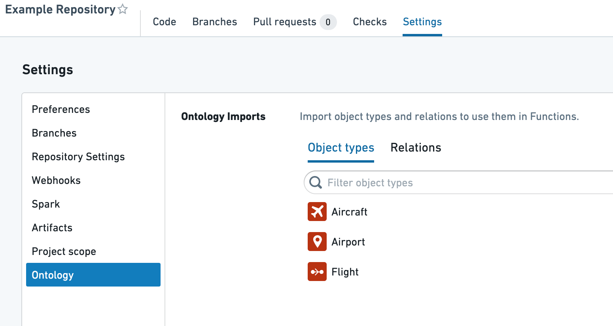
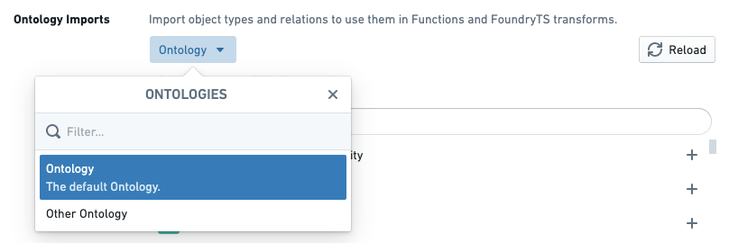
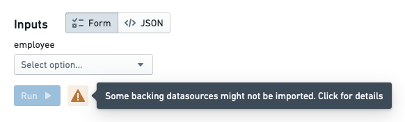

# Permissions权限

Authoring and executing functions in the platform is subject to many kinds of permission checks. This section outlines the different types of permissions you should be aware of and common issues you may run into.在平台上创建和执行函数需要经过多种权限检查。本节概述了您应该了解的不同权限类型以及可能遇到的一些常见问题。

## Function authoring函数创建

Functions repositories must be granted appropriate permissions to:函数仓库必须被授予适当的权限来：

1. Access the Ontology so that proper code bindings can be generated.访问本体，以便生成正确的代码绑定。
2. Load objects in order to run a live preview of a function execution.加载对象以运行函数执行的实时预览。

Note that repository permissions must be explicitly granted, and are not the same as the permissions granted to your user account. As a result, you have to take specific steps to import object types, link types, and backing datasources into the Project that contains your repository.请注意，仓库权限必须明确授予，与授予您用户账户的权限不同。因此，您必须采取特定步骤将对象类型、链接类型和支撑数据源导入包含您仓库的项目。

For a tutorial on these steps, see [this section](/docs/foundry/functions/ontology-imports/). Below, we explain the specific resources that are imported and the permissions granted for those resources.有关这些步骤的教程，请参阅本节。下面，我们解释导入的具体资源以及授予这些资源的权限。

### Ontology entity permissions本体实体权限

In a repository, whenever checks run or Code Assist starts up, the functions plugins load the latest Ontology based on the repository’s permissions and generate code bindings for every object and link type that was loaded. The set of object and link types that are loaded depends on the imports of the following resource types:

- Ontologies
- Ontology branches
- [Object types](/docs/foundry/object-link-types/object-types-overview/)
- [Link types链接类型](/docs/foundry/object-link-types/link-types-overview/)

In a functions repository, you can import the needed Ontology resources by navigating to **Settings** > **Ontology**. This interface allows you to choose object and link types to import into your Project.在函数库中，您可以通过导航至设置 > 本体来导入所需的本体资源。此界面允许您选择要导入到项目中的对象和链接类型。

If your user account has access to multiple Ontologies, you can also choose which Ontology you’d like to use. Currently, importing multiple Ontologies into a single Project is unsupported.如果您的用户帐户可以访问多个本体，您还可以选择要使用哪个本体。目前，不支持将多个本体导入到单个项目中。

Warning警告Although the above interface shows up within functions repositories, any Ontologies, object types, and link types you import are added at the **Project** level. This means that changing imports in one repository can affect other repositories in the same Project. If you want to have two repositories that rely on different Ontology entities, you should separate them into different Projects.尽管上述界面显示在函数仓库中，但您导入的任何本体、对象类型和链接类型都是在项目级别添加的。这意味着在一个仓库中更改导入可能会影响同一项目中的其他仓库。如果您希望有两个依赖于不同本体实体的仓库，您应该将它们分开到不同的项目中。

### Object loading permissions对象加载权限

The **functions helper** in a repository allows users to execute functions in two ways: by executing a published function, or by executing code in live preview. When executed in a live preview, functions code is compiled and executed in Code Assist, which is infrastructure designed to enable quick iteration for code authors.仓库中的函数助手允许用户以两种方式执行函数：执行已发布的函数，或在实时预览中执行代码。在实时预览中执行时，函数代码会在代码辅助工具中编译和执行，该工具是为代码作者快速迭代而设计的设施。

Because it is tied to the repository, Code Assist is subject to the same permissions requirements as code generation, as described above. This means that when running a function in live preview, the backing datasources underlying each object type you wish to use must be imported into the Project.

In the functions helper, if there are object types imported into your Project without the corresponding datasource being imported, a warning will be displayed in live preview prompting you to update the imports:

In the case of most object types, the **Import backing datasources** dialog will prompt you to import a Foundry dataset. For object types that have [row-level security](/docs/foundry/object-permissioning/configuring-rv-access-controls/) enabled, you will be prompted to import a [Restricted View](/docs/foundry/security/restricted-views/).

## Published function execution

Once a function has been published, it is ready for use by a broader audience of users and can be configured to execute in applications such as [Workshop](/docs/foundry/workshop/overview/) and [Actions](/docs/foundry/action-types/function-actions-overview/). There are still some considerations to keep in mind for permissions to execute a published function.一旦函数被发布，它就可供更广泛的用户使用，并且可以配置为在 Workshop 和 Actions 等应用程序中执行。对于执行已发布的函数，仍有一些权限方面的考虑需要记住。

### Function permissions功能权限

In order to execute a function, a user must have **Viewer** role on the repository from which the function was published. Typically, it is best to locate functions repositories in the same Project as end-user applications that rely on functions in that repository, whether those applications are created using Workshop, Slate, or some other tool. If users encounter errors indicating that they lack permissions to read a function (ReadFunctionsPermissionDenied), check whether they have read access to the repository. [Learn more about how to move and share resources.](/docs/foundry/compass/move-and-share-resources/)要执行一个功能，用户必须在发布该功能的存储库上拥有查看者角色。通常，最佳做法是将功能存储库放置在与依赖该存储库中功能的最终用户应用程序相同的项目中，无论这些应用程序是使用工作坊、板岩或其他工具创建的。如果用户遇到表示他们没有读取功能权限的错误（ReadFunctionsPermissionDenied），请检查他们是否具有读取存储库的权限。了解更多关于如何移动和共享资源的信息。

The **Check access** panel in the sidebar can be used to check someone's access to a Workshop or Slate application, including access to dependent functions. For more information, see the [Check access panel documentation](/docs/foundry/security/checking-permissions/).侧边栏中的检查访问面板可用于检查某人对工作坊或板岩应用程序的访问权限，包括对依赖功能的访问权限。有关更多信息，请参阅检查访问面板文档。

[Function-backed Actions](/docs/foundry/action-types/function-actions-overview/) are a special case in which end users do not necessarily need read access to the function in order to apply an Action that uses it. An administrative user must have read access to a function when configuring an Action to use it. Afterwards, users will be able to apply the Action based on [Action-level permissions](/docs/foundry/action-types/permissions/), regardless of their access to the function.基于功能的操作是一种特殊情况，其中最终用户不一定需要读取访问权限才能应用使用它的操作。当配置操作以使用它时，管理员用户必须具有读取功能的权限。之后，用户将能够根据操作级别的权限应用操作，而不管他们对功能的访问权限如何。

### Object loading permissions对象加载权限

When a function loads object data, either as a parameter or via an [Object search](/docs/foundry/functions/api-object-sets/), the permissions of the end user running the function determine which objects are loaded. In the case of object types secured using row-level permissions, this means that different users executing the same function may receive different results. This behavior is intended—users should only see the objects they have access to, and this behavior enables a single function to work for users with differing access to individual objects.当函数加载对象数据时，无论是作为参数还是通过对象搜索，运行该函数的最终用户的权限决定了加载哪些对象。对于使用行级权限保护的对象类型，这意味着执行相同函数的不同用户可能会得到不同的结果。这种行为是预期的——用户应该只能看到他们有权访问的对象，并且这种行为使得一个函数可以为具有不同对象访问权限的用户工作。

