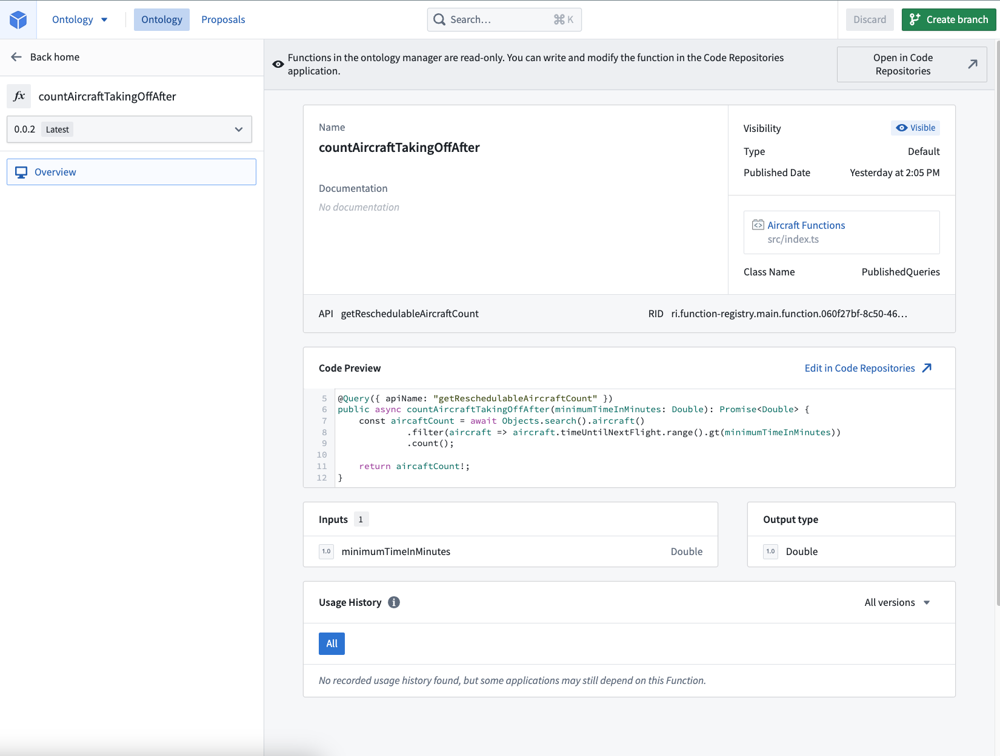

# [](#queries)Queries查询


Queries are the read-only subsets of functions that may be optionally exposed through the [API gateway](/docs/foundry/api/general/overview/introduction/). They cannot have any side effects, such as modifying the Ontology or altering external systems. You should use an [Action](/docs/foundry/api/ontology-resources/actions/apply-action/) if you need those additional editing capabilities through the API gateway.查询是只读的函数子集，可以选择通过 API 网关公开。它们不能有任何副作用，例如修改本体或更改外部系统。如果您需要通过 API 网关使用这些额外的编辑功能，您应该使用操作。


## [](#query-decorator)Query decorator查询装饰器


Use the following syntax to define a query function.使用以下语法定义查询函数。


TypeScript v1TypeScript v2Python```
Copied!`1import { Query } from "@foundry/functions-api";
2
3@Query({ apiName: "myTypeScriptV1Function" })`
```

```
Copied!`1// Export a config object with an apiName parameter from the file containing the function
2export const config = {
3    apiName: "myTypeScriptV2Function"
4};`
```

```
Copied!`1from functions.api import function
2
3@function(api_name="myPythonFunction")`
```


For Python and TypeScript v1 functions, the decorator accepts an API name parameter of type `string`, which is required to define an API name. When using TypeScript v1, the query will behave similarly to the existing [`@Function` decorator](/docs/foundry/functions/decorators/) if the `apiName` parameter is not defined. Note that the corresponding Python syntax is `api_name`.对于 Python 和 TypeScript v1 函数，装饰器接受一个类型为 string 的 API 名称参数，该参数是定义 API 名称所必需的。在使用 TypeScript v1 时，如果未定义 apiName 参数，查询将表现得类似于现有的 @Function 装饰器。请注意，相应的 Python 语法是 api_name 。


### [](#example-api-named-query)Example: API-named query示例：API 命名的查询


The example below demonstrates how to expose a query through the [API gateway](/docs/foundry/api/general/overview/introduction/):下面的示例展示了如何通过 API 网关暴露一个查询：


TypeScript v1TypeScript v2Python```
Copied!`1import { Query, Double } from "@foundry/functions-api";
2import { Objects, Aircraft } from "@foundry/ontology-api";
3
4export class PublishedQueries {
5    @Query({ apiName: "getReschedulableAircraftCount" })
6    public async countAircraftTakingOffAfter(minimumTimeInMinutes: Double): Promise<Double> {
7        const aircaftCount = await Objects.search().aircraft()
8                 .filter(aircraft => aircraft.timeUntilNextFlight.range().gt(minimumTimeInMinutes))
9                 .count();
10
11        return aircaftCount!;
12    }
13}`
```

```
Copied!`1import { Client } from "@osdk/client";
2import { Double } from "@osdk/functions";
3import { Aircraft } from "@ontology/sdk";
4
5export const config = {
6    apiName: "getReschedulableAircraftCount"
7};
8
9async function countAircraftTakingOffAfter(client: Client, minimumTimeInMinutes: Double): Promise<Double> {
10    const { $count } = await client(Aircraft).where({
11        timeUntilNextFlight: {
12            $gt: minimumTimeInMinutes
13        }
14    }).aggregate({ $select: { $count: "unordered" } })
15
16    return $count;
17}
18
19export default countAircraftTakingOffAfter;`
```

```
Copied!`1from functions.api import Double, function
2from ontology_sdk import FoundryClient
3from ontology_sdk.ontology.objects import Aircraft
4
5@function(api_name="getReschedulableAircraftCount")
6def count_aircraft_taking_off_after(minimum_time_in_minutes: Double) -> Double:
7    client = FoundryClient()
8    aircraft_count = client.ontology.objects.Aircraft.where(
9        Aircraft.time_until_next_flight > minimum_time_in_minutes
10    ).count().compute()
11
12    return aircraft_count`
```


## [](#api-name-validations)API name validationsAPI 名称验证


The `apiName` of a query must be a string that meets the following requirements:查询的 apiName 必须是一个符合以下要求的字符串：


- Be in `lowerCamelCase`.位于 lowerCamelCase 中。
- Be under 100 characters.长度不超过 100 个字符。
- Not contain leading numbers.不能以数字开头。
- Be unique among all Ontologies imported into the repository.
在导入到存储库的所有本体中保持唯一性。- The [tagging process](/docs/foundry/functions/getting-started/#publish-your-functions) will fail if the `apiName` is not unique, requiring you to change the name.如果 apiName 不唯一，标签过程将失败，需要您更改名称。
  - The [tagging process](/docs/foundry/functions/getting-started/#publish-your-functions) will fail if the `apiName` is not unique, requiring you to change the name.如果 apiName 不唯一，标签过程将失败，需要您更改名称。
  
  

Additionally, a repository containing API-named queries must import entities from at least one ontology.此外，包含 API 命名查询的存储库必须从至少一个本体导入实体。


## [](#version-and-update-api-named-queries)Version and update API-named queries版本和更新 API 命名查询


API-named queries will always use the **latest tagged version** of the published query and do not follow the same semantic versioning paradigm as other Foundry functions.API 命名的查询将始终使用发布的查询的最新标记版本，并且不遵循 Foundry 其他函数相同的语义版本控制范式。


To disassociate the API name from the query and break it in the API gateway, you must remove the API name from the query decorator and release a new tag from the repository.要使 API 名称与查询分离并在 API 网关中中断它，您必须从查询装饰器中删除 API 名称，并从存储库中发布一个新的标签。


Changing the API name in the decorator and publishing a new tag will break the consumer. Only the latest published version of the query is supported.在装饰器中更改 API 名称并发布新标签将中断消费者。仅支持最新发布的查询版本。

To allow consumers to upgrade at their convenience without breaking changes, you can support multiple versions of the same API name. To do this, you must make a copy of the query code in your repository and give it a different API name, for example `getReschedulableAircraftCountV2`.为了允许消费者在不引起中断的情况下方便地升级，您可以支持同一 API 名称的多个版本。为此，您必须在存储库中复制查询代码并给它一个不同的 API 名称，例如 getReschedulableAircraftCountV2 。


## [](#search-and-view-queries)Search and view queries搜索和查看查询


As with other functions, you can search for and manage your queries in [Ontology Manager](/docs/foundry/ontology-manager/overview/). You can search for the query name or the API name. In the example [above](#example-api-named-query), the queries are `getReschedulableAircraftCount` for the API name and `countAircraftTakingOffAfter` for the query name, respectively.和其他功能一样，您可以在本体管理器中搜索和管理您的查询。您可以搜索查询名称或 API 名称。在上述示例中，查询名称分别为 getReschedulableAircraftCount 和 countAircraftTakingOffAfter ，分别对应 API 名称和查询名称。





When using TypeScript v1 functions, you may need to update the `functions.json` file in your repository to enable queries by setting the `enableQueries` property to true: 在使用 TypeScript v1 函数时，您可能需要更新存储库中的 functions.json 文件以启用查询，方法是设置 enableQueries 属性为 true：

TypeScript v1```
Copied!`1{
2  "enableQueries": true
3}`
```


## [](#call-a-query-function)Call a query function调用查询函数


After publishing your TypeScript or Python query function, navigate to the code repository where you want to consume the function, and import it using the [**Resource imports** sidebar](/docs/foundry/functions/resource-imports-sidebar/).发布您的 TypeScript 或 Python 查询函数后，导航到您希望使用该函数的代码库，并使用资源导入侧边栏导入它。


Your function will be callable from the consuming repository. For example:您的函数将可在使用库中调用。例如：


TypeScript v1TypeScript v2Python```
Copied!`1import { Queries } from "@foundry/ontology-api";
2
3export class MyFunctions {
4    @Function()
5    public callQueryFunction(): Promise<Double> {
6        return Queries.getReschedulableAircraftCount(10);
7    }
8}`
```

```
Copied!`1import { Client } from "@osdk/client";
2import { Double } from "@osdk/functions";
3import { getReschedulableAircraftCount } from "@ontology/sdk";
4
5async function callQueryFunction(client: Client): Promise<Double> {
6    return client(getReschedulableAircraftCount).executeFunction({ timeUntilNextFlight: 10 });
7}
8
9export default callQueryFunction;`
```

```
Copied!`1from functions.api import Double, function
2from ontology_sdk import FoundryClient
3
4@function
5def call_query_function() -> Double:
6    return FoundryClient().ontology.queries.get_reschedulable_aircraft_count(
7        time_until_next_flight=Double(10)
8    )`
```


For TypeScript v1 functions, Foundry must know which query functions you call from a published function. We automatically provide static analysis to try and detect queries that are called. However, this static analysis may occasionally miss certain calls leading to a runtime error instructing you to add the `@Uses` decorator. This decorator serves to augment the automatically detected query usage.对于 TypeScript v1 函数，Foundry 必须知道您从已发布的函数中调用哪些查询函数。我们自动提供静态分析以尝试检测被调用的查询。然而，这种静态分析有时可能会遗漏某些调用，导致运行时错误提示您添加 @Uses 装饰器。此装饰器用于增强自动检测的查询使用。


The following example demonstrates the usage of the `@Uses` decorator:以下示例演示了 @Uses 装饰符的用法：


TypeScript v1```
Copied!`1import { Uses } from "@foundry/functions-api";
2import { Queries } from "@foundry/ontology-api";
3
4export class MyFunctions {
5    @Uses({ queries: [Queries.getReschedulableAircraftCount] })
6    @Function()
7    public callQueryFunction(): Promise<Double> {
8        return Queries.getReschedulableAircraftCount(10);
9    }
10}`
```

