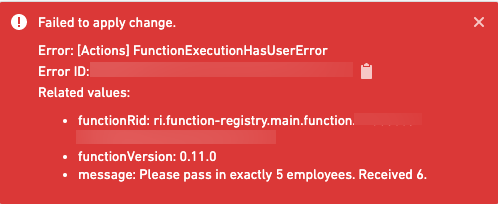

# [](#user-facing-errors)User-facing errors面向用户的错误


When running functions in other parts of the platform, such as Workshop or actions, you may want to throw an error with a detailed message. To do so, throw a `UserFacingError`. For example:在平台的其他部分运行函数时，例如在 Workshop 或操作中，您可能希望抛出一个带有详细信息的错误。为此，请抛出一个 UserFacingError 。例如：


TypeScript v1TypeScript v2Python```
Copied!`1import { Function, UserFacingError } from "@foundry/functions-api";
2import { Employee } from "@foundry/ontology-api";
3
4export class MyFunctions {
5    @Function()
6    public async searchExactlyFiveEmployees(employees: Employee[]): Proimse<string> {
7        if (employees.length != 5) {
8            throw new UserFacingError(`Pass in exactly 5 employees. Received ${employees.length}.`);
9        }
10
11        // search employees
12    }
13}`
```

```
Copied!`1import { Osdk } from "@osdk/client";
2import { Employee } from "@ontology/sdk";
3import { UserFacingError } from "@osdk/functions";
4
5export default async function searchExactlyFiveEmployees(employees: Array<Osdk.Instance<Employee>>): Promise<string> {
6    if (employees.length != 5) {
7        throw new UserFacingError(`Pass in exactly 5 employees. Received ${employees.length}.`);
8    }
9
10    // search employees
11}`
```

```
Copied!`1from functions.api import function, UserFacingError
2from ontology_sdk import FoundryClient
3from ontology_sdk.ontology.objects import Aircraft
4
5@function()
6def search_exactly_five_employees(
7    employees: list[Aircraft]
8) -> str:
9    if not len(aircraft) == 5:
10        raise UserFacingError(f"Pass in exactly 5 employees. Received ${len(aircraft)}.")
11
12    # search employees`
```


When running this as a [Function-backed Action](/docs/foundry/action-types/function-actions-overview/) in a [Workshop application](/docs/foundry/workshop/functions-use/) with an incorrect number of employees, users will see the following error:当在具有不正确员工数量的 Workshop 应用程序中将其作为 Function-backed Action 运行时，用户将看到以下错误：





By adding a detailed user facing error message, you can help other users of your Function quickly identify and fix the issue.通过添加一个详细的面向用户的错误消息，您可以帮助您的 Function 的其他用户快速识别和解决问题。

