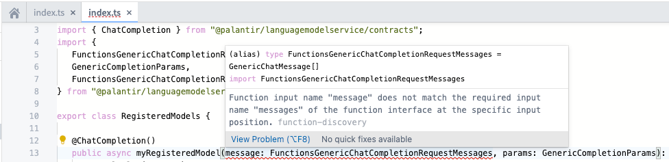
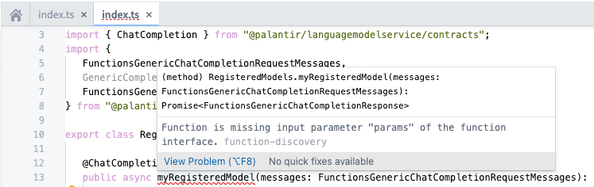
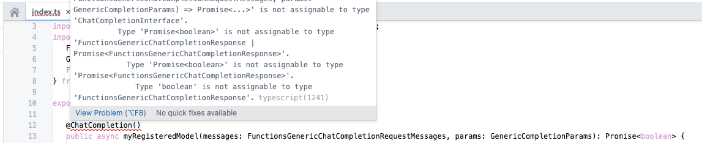

# [](#function-interfaces)Function interfaces函数接口


**Function interfaces** allow function authors to integrate their custom logic with native Foundry features and offer a powerful way of defining contracts between consuming applications and functions.函数接口允许函数作者将其自定义逻辑与原生 Foundry 功能集成，并提供了一种强大的方式来定义消费者应用程序与函数之间的合约。


Function interfaces define how an application or user should interact with a function. This includes the function’s inputs, outputs, and errors. In other words, a function interface describes a function’s signature, but a function interface is not itself a function. Function interfaces are designed to be implemented by functions.函数接口定义了应用程序或用户应如何与函数交互。这包括函数的输入、输出和错误。换句话说，函数接口描述了函数的签名，但函数接口本身并不是一个函数。函数接口是为函数实现而设计的。


Some Foundry applications use function interfaces to provide specialized behavior when executing functions which implement the interface, given the known inputs, outputs, and errors. Users can provide their own implementations of certain function interfaces, and Foundry can continue providing this specialized behavior. Applications within Foundry which depend on certain function interfaces can discover all functions which implement that interface.一些 Foundry 应用程序使用函数接口在执行实现该接口的函数时提供特殊行为，考虑到已知的输入、输出和错误。用户可以提供某些函数接口的自定义实现，而 Foundry 可以继续提供这种特殊行为。Foundry 内部依赖特定函数接口的应用程序可以发现所有实现该接口的函数。


For example, AIP Logic depends on function interfaces to allow users to bring their own LLMs into Logic functions. Specifically, the [Use LLM](/docs/foundry/logic/blocks/#use-llm) block in AIP Logic allows users to select Palantir-provided LLMs or *registered* LLMs. Registered models are user-authored functions that have implemented a function interface provided by Foundry; for instance, the chat completion function interface. This allows AIP Logic to discover functions that have been explicitly defined as being an implementation of a chat completion, have a signature typical of a generic LLM, and return errors which AIP Logic can handle appropriately. In the future, user-provided chat completion implementations will be usable in other parts of the platform, such as Pipeline Builder, AIP Agent Studio, and Model Catalog.例如，AIP 逻辑依赖于函数接口，允许用户将他们自己的 LLM 带入逻辑函数中。具体来说，AIP 逻辑中的 Use LLM 模块允许用户选择 Palantir 提供的 LLM 或已注册的 LLM。已注册的模型是用户编写的函数，这些函数已实现了 Foundry 提供的函数接口；例如，聊天完成函数接口。这允许 AIP 逻辑发现那些明确定义为聊天完成实现的函数，具有通用 LLM 典型的签名，并返回 AIP 逻辑可以适当处理的错误。未来，用户提供的聊天完成实现将在平台的其它部分使用，例如 Pipeline Builder、AIP Agent Studio 和 Model Catalog。


[Learn how to register LLMs using function interfaces.](/docs/foundry/aip/chat-completion-function-interface-quickstart/)


## [](#palantir-provided-function-interfaces)Palantir-provided function interfacesPalantir 提供的函数接口


The following list contains the function interfaces currently provided by Palantir:以下列表包含 Palantir 目前提供的函数接口：


- [`ChatCompletion`](#chatcompletion)


### [](#chatcompletion)`ChatCompletion`


**Description:** 描述：


- Functions which generate contextually relevant text responses based on multi-turn and multi-user text conversation history.根据多轮和多用户文本对话历史生成上下文相关文本响应的函数。
- Ideal for conversational use cases.适用于对话使用场景。


**Foundry integrations:** Foundry 集成：


- The *Use LLM* board in AIP Logic.在 AIP 逻辑中使用 LLM 面板。
- Support in Pipeline Builder coming soon.Pipeline Builder 支持即将到来。


**Documentation:** 文档：


- [**Register LLMs using function interfaces使用函数接口注册 LLMs**](/docs/foundry/aip/chat-completion-function-interface-quickstart/)


## [](#type-customization)Type customization类型定制


To provide more flexibility, you are not limited to the provided types when implementing a function interface. In some cases, you may want to create your own [custom types](/docs/foundry/functions/types-reference/#structcustom-type). As long as a function is [compatible ↗](https://www.typescriptlang.org/docs/handbook/type-compatibility.html#comparing-two-functions) with the function defined on the function interface, the function will be accepted by the compiler and successfully published. If the function interface defines an input type for which all fields are optional, at least one common optional field must be shared when customizing the type.为了提供更高的灵活性，在实现函数接口时，您不必局限于提供的类型。在某些情况下，您可能需要创建自己的自定义类型。只要函数与函数接口上定义的函数兼容 ↗，编译器就会接受该函数并成功发布。如果函数接口定义了一个所有字段都是可选的输入类型，在定制类型时，至少必须共享一个公共的可选字段。


```
Copied!`1...
2interface CustomParams extends GenericCompletionParams {
3   modelSpecificParam?: string
4}
5...
6
7// valid implementation
8@ChatCompletion()
9public async myRegisteredModel(
10    messages: FunctionsGenericChatCompletionRequestMessages,
11    params: CustomParams
12): Promise<FunctionsGenericChatCompletionResponse> {
13  ...
14}`
```


## [](#troubleshooting)Troubleshooting故障排除


Function interfaces are designed to be flexible and allow for a wide range of implementations. However, you may encounter errors when implementing a function interface. Here are some tips for TypeScript functions to help you avoid these errors when customizing your implementation.函数接口设计得灵活，允许广泛的实现。然而，在实现函数接口时，您可能会遇到错误。这里有一些 TypeScript 函数的提示，帮助您在定制实现时避免这些错误。


### [](#error-function-input-name-does-not-match-the-required-input-name-of-the-function-interface-at-the-specific-input-position)Error: `Function input name does not match the required input name of the function interface at the specific input position`错误： Function input name does not match the required input name of the function interface at the specific input position


The input names of each parameter must match the input names defined on the function interface at each specific input position. As the linting suggests, ensure that each input name has the exact same input name as declared on the function interface at each position.每个参数的输入名称必须与函数接口在每个特定输入位置上定义的输入名称相匹配。正如代码检查建议的那样，确保每个输入名称在每个位置上与函数接口上声明的输入名称完全相同。





### [](#error-function-is-missing-input-parameter-of-the-function-interface)Error: `Function is missing input parameter of the function interface`错误： Function is missing input parameter of the function interface


This error arises if the implementing function does not include every required input defined on the function interface. To resolve the error, ensure each input declared on the function interface is included in the implementing function.如果实现函数不包含函数接口上定义的每个必需输入，则会出现此错误。要解决此错误，请确保函数接口上声明的每个输入都包含在实现函数中。





### [](#error-type-type1-is-not-assignable-to-type-type2)Error: `Type {type1} is not assignable to type {type2}`错误： Type {type1} is not assignable to type {type2}


The compiler may reject the implementing function as not compatible with the function defined on the interface. If so, ensure your implementing function is [compatible ↗](https://www.typescriptlang.org/docs/handbook/type-compatibility.html#comparing-two-functions) with the function defined on the function interface by checking the structure of each type compared to the types defined on the function interface.编译器可能会拒绝实现函数，因为它与接口上定义的函数不兼容。如果是这种情况，请确保您的实现函数与函数接口上定义的函数兼容，方法是检查每个类型与函数接口上定义的类型的结构。




