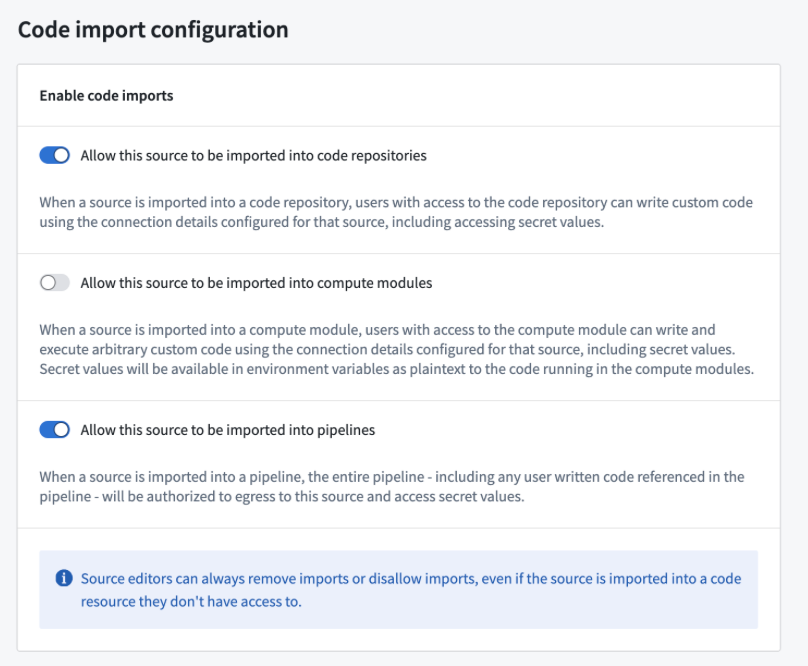

# Use a Python function in Pipeline Builder在 Pipeline Builder 中使用 Python 函数

## Prerequisites前提条件

This guide assumes you have already authored and published a Python function. Review our [getting started with Python functions](/docs/foundry/functions/python-getting-started/) documentation for a tutorial.本指南假设您已经创建并发布了一个 Python 函数。请查阅我们的 Python 函数入门文档以获取教程。

## Architecture架构

Python functions run in a Pipeline Builder pipeline as a sidecar container. This means that the function does not need to be deployed and scales dynamically with the size of your pipeline. Embedded functions can be [previewed](/docs/foundry/pipeline-builder/outputs-preview-pipeline/) similarly to other transforms in Pipeline Builder.Python 函数在 Pipeline Builder 管道中作为边车容器运行。这意味着函数无需部署，并且会随着您管道的大小动态扩展。嵌入式函数可以像 Pipeline Builder 中的其他转换一样进行预览。

## Use your function in a Pipeline Builder pipeline在你的 Pipeline Builder 管道中使用你的函数

Follow the steps below to prepare and configure a Python function in your pipeline:按照以下步骤准备和配置你的管道中的 Python 函数：

1. Open the Pipeline Builder pipeline in which you want to use your Python function.在你想使用你的 Python 函数的 Pipeline Builder 管道中打开它。

1. Import your UDF into Pipeline Builder using one of two methods:
使用以下两种方法之一将你的 UDF 导入 Pipeline Builder：- **From the graph view:从图形视图：**
1. Select **Reusables** from the upper part of the pipeline graph, then choose **User-defined functions**. 从管道图形的上部选择可重用组件，然后选择用户定义函数。

2. Select **Import UDF** and search through the available functions to find the one you want to use
3. Choose **Add** next to the function name. The function should then display an **Imported** tag.2. 选择导入 UDF，在可用函数中搜索您想要使用的函数 3. 在函数名称旁边选择添加。该函数应显示导入标签。

 

 

4. Close the import dialogue and select **Transform** on your Pipeline Builder graph where you would like to use the function.
5. From the list of transforms, find the **UDFs** tab to the left to view your imported functions.4. 关闭导入对话框，并在您想要使用函数的 Pipeline Builder 图形上选择转换。 5. 从转换列表中，找到左侧的 UDF 选项卡以查看您导入的函数。
  1. Select **Reusables** from the upper part of the pipeline graph, then choose **User-defined functions**. 从管道图形的上部选择可重用组件，然后选择用户定义函数。
  
  
  
  
  
  
  
  
  2. Select **Import UDF** and search through the available functions to find the one you want to use
  3. Choose **Add** next to the function name. The function should then display an **Imported** tag.2. 选择导入 UDF，在可用函数中搜索您想要使用的函数 3. 在函数名称旁边选择添加。该函数应显示导入标签。
  
   
  
   
  
  
  4. Close the import dialogue and select **Transform** on your Pipeline Builder graph where you would like to use the function.
  5. From the list of transforms, find the **UDFs** tab to the left to view your imported functions.4. 关闭导入对话框，并在您想要使用函数的 Pipeline Builder 图形上选择转换。 5. 从转换列表中，找到左侧的 UDF 选项卡以查看您导入的函数。
  
  - **Use the transform picker:使用转换选择器：**
1. Select **Transform** on the pipeline builder graph.在管道构建器图形上选择 Transform。
2. Enter the name of the UDF you want to import. 输入您要导入的 UDF 的名称。

3. Select **Search unimported UDFs**.
4. Hover over the desired UDF and select **Import**. 3. 选择搜索未导入的 UDF。4. 将鼠标悬停在所需的 UDF 上并选择导入。

 
  1. Select **Transform** on the pipeline builder graph.在管道构建器图形上选择 Transform。
  2. Enter the name of the UDF you want to import. 输入您要导入的 UDF 的名称。
  
  
  
  
  
  
  
  
  3. Select **Search unimported UDFs**.
  4. Hover over the desired UDF and select **Import**. 3. 选择搜索未导入的 UDF。4. 将鼠标悬停在所需的 UDF 上并选择导入。
  
   
  - **From the graph view:从图形视图：**
  1. Select **Reusables** from the upper part of the pipeline graph, then choose **User-defined functions**. 从管道图形的上部选择可重用组件，然后选择用户定义函数。
  
  
  
  
  
  
  
  
  2. Select **Import UDF** and search through the available functions to find the one you want to use
  3. Choose **Add** next to the function name. The function should then display an **Imported** tag.2. 选择导入 UDF，在可用函数中搜索您想要使用的函数 3. 在函数名称旁边选择添加。该函数应显示导入标签。
  
   
  
   
  
  
  4. Close the import dialogue and select **Transform** on your Pipeline Builder graph where you would like to use the function.
  5. From the list of transforms, find the **UDFs** tab to the left to view your imported functions.4. 关闭导入对话框，并在您想要使用函数的 Pipeline Builder 图形上选择转换。 5. 从转换列表中，找到左侧的 UDF 选项卡以查看您导入的函数。
    1. Select **Reusables** from the upper part of the pipeline graph, then choose **User-defined functions**. 从管道图形的上部选择可重用组件，然后选择用户定义函数。
    
    
    
    
    
    
    
    
    2. Select **Import UDF** and search through the available functions to find the one you want to use
    3. Choose **Add** next to the function name. The function should then display an **Imported** tag.2. 选择导入 UDF，在可用函数中搜索您想要使用的函数 3. 在函数名称旁边选择添加。该函数应显示导入标签。
    
     
    
     
    
    
    4. Close the import dialogue and select **Transform** on your Pipeline Builder graph where you would like to use the function.
    5. From the list of transforms, find the **UDFs** tab to the left to view your imported functions.4. 关闭导入对话框，并在您想要使用函数的 Pipeline Builder 图形上选择转换。 5. 从转换列表中，找到左侧的 UDF 选项卡以查看您导入的函数。
    
    - **Use the transform picker:使用转换选择器：**
  1. Select **Transform** on the pipeline builder graph.在管道构建器图形上选择 Transform。
  2. Enter the name of the UDF you want to import. 输入您要导入的 UDF 的名称。
  
  
  
  
  
  
  
  
  3. Select **Search unimported UDFs**.
  4. Hover over the desired UDF and select **Import**. 3. 选择搜索未导入的 UDF。4. 将鼠标悬停在所需的 UDF 上并选择导入。
  
   
    1. Select **Transform** on the pipeline builder graph.在管道构建器图形上选择 Transform。
    2. Enter the name of the UDF you want to import. 输入您要导入的 UDF 的名称。
    
    
    
    
    
    
    
    
    3. Select **Search unimported UDFs**.
    4. Hover over the desired UDF and select **Import**. 3. 选择搜索未导入的 UDF。4. 将鼠标悬停在所需的 UDF 上并选择导入。
    
     
    
    
  2. Fill out the transform definition specifying the input columns and parameters, then select **Apply**.填写转换定义，指定输入列和参数，然后选择应用。

You should now see your Python function on your Pipeline Builder graph and can preview the output of the function.现在你应该能在你的 Pipeline Builder 图中看到你的 Python 函数，并且可以预览函数的输出。

## External API calls in Pipeline BuilderPipeline Builder 中的外部 API 调用

To make API calls to an external system from Pipeline Builder, you can publish a [Python function with access to external systems](/docs/foundry/functions/api-calls/). This will allow you to write logic that communicates with external systems and use it as part of your pipeline.要从 Pipeline Builder 向外部系统发起 API 调用，您可以发布一个可访问外部系统的 Python 函数。这将允许您编写与外部系统通信的逻辑，并将其作为管道的一部分使用。

To be used as a user-defined function (UDF) in Pipeline Builder, all sources used in your function must be configured to be importable into pipelines. To configure this setting, navigate to the source in Data Connection, then to the **Connection settings > Code import configuration** tab:要作为 Pipeline Builder 中的用户定义函数（UDF）使用，您函数中使用的所有源都必须配置为可导入到管道中。要配置此设置，请导航到 Data Connection 中的源，然后转到连接设置 > 代码导入配置选项卡：

Once you have enabled this option on your source and published your Python function, it can be used in your pipeline in the same way as any other Python function.一旦您在源端启用了此选项并发布了您的 Python 函数，它就可以像任何其他 Python 函数一样在您的管道中使用。

