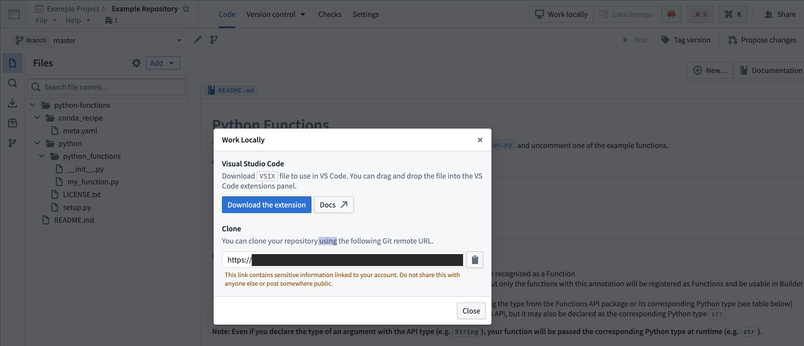
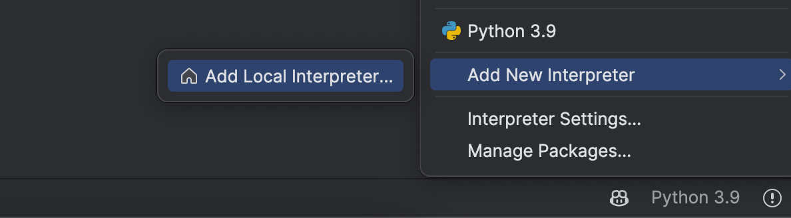
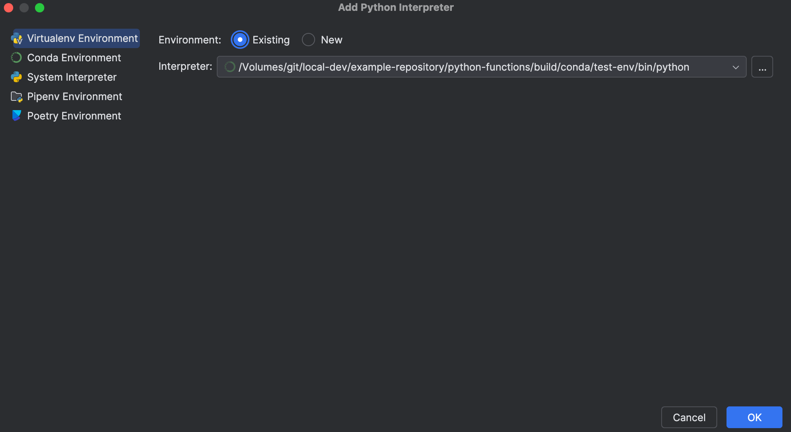

# Local development本地开发

You can carry out local development of Python functions repositories, allowing for high-speed iteration in your customized environment.您可以进行 Python 函数仓库的本地开发，允许在您的自定义环境中进行高速迭代。

## Setting up local development for Python functions repositories为 Python 函数仓库设置本地开发

### Clone the repository克隆仓库

1. In the menu bar of your repository, select **Work locally** to open the dialog and copy the given repository URL. 在你的仓库菜单栏中，选择“本地工作”以打开对话框并复制提供的仓库 URL。

 

2. Using the command line, run `git clone <URI>` on your local machine in a directory of your choice. Then use the `cd` command to navigate to the repository.使用命令行，在你的本地机器上选择任意目录运行 git clone <URI> 。然后使用 cd 命令导航到仓库。

### Limitations限制

- The token granted for cloning is short-lived and read-only, with the exception of pushing back to your repository.用于克隆的令牌是短期的且只读的，除了可以推回你的仓库。
- You will still need to push your changes to Foundry to publish artifacts, or if you wish to run checks or build.你仍然需要将更改推送到 Foundry 以发布工件，或者如果你希望运行检查或构建。

## Set up the development environment设置开发环境

### Prerequisites前提条件

- Ensure Java 17 is installed and that the environment variable `JAVA_HOME` points to the right Java installation. Java 17 can be downloaded from the [Oracle website ↗](https://www.oracle.com/java/technologies/downloads/#java17).确保安装了 Java 17，并且环境变量 JAVA_HOME 指向正确的 Java 安装位置。Java 17 可以从 Oracle 网站 ↗下载。

Setting the `JAVA_HOME` environment variable based on your operating system:根据您的操作系统设置 JAVA_HOME 环境变量：

- Windows: Run `SETX JAVA_HOME -m "<java-home-dir>"` in PowerShell. This modifies the system environment variable and you will need to restart the shell for changes to take effect. Alternatively you can run ` [System.Environment]::SetEnvironmentVariable("JAVA_HOME", "<java-home-dir>")` to set `JAVA_HOME` in the running process.Windows：在 PowerShell 中运行 SETX JAVA_HOME -m "<java-home-dir>" 。这将修改系统环境变量，您需要重启 Shell 才能使更改生效。或者，您也可以运行  [System.Environment]::SetEnvironmentVariable("JAVA_HOME", "<java-home-dir>") 来在运行进程中将 JAVA_HOME 设置为所需值。
- Linux or macOS: Run `export JAVA_HOME=<java-home-dir>`.Linux 或 macOS：运行 export JAVA_HOME=<java-home-dir> 。

- Ensure your repository is upgraded to the latest template version by following the steps outline [here](/docs/foundry/code-repositories/repository-upgrades/#manual-branch-upgrade).请按照此处概述的步骤，确保您的仓库升级到最新模板版本。
- Ensure that the environment variables `CI`, `JEMMA`, and `CA` are not set.确保环境变量 CI 、 JEMMA 和 CA 未设置。
- If running on an Apple silicon Mac, ensure that [Rosetta 2 ↗](https://developer.apple.com/documentation/apple-silicon/about-the-rosetta-translation-environment) is installed. You can install Rosetta 2 by running `/usr/sbin/softwareupdate --install-rosetta --agree-to-license` in the terminal.如果在 Apple 硅 Mac 上运行，请确保已安装 Rosetta 2 ↗。您可以通过在终端中运行 /usr/sbin/softwareupdate --install-rosetta --agree-to-license 来安装 Rosetta 2。

## Visual Studio Code

- Ensure you have [Visual Studio Code ↗](https://code.visualstudio.com/) installed.确保已安装 Visual Studio Code ↗。
- Install the [Python extension ↗](https://marketplace.visualstudio.com/items?itemName=ms-python.python) from the Visual Studio Code site or from the **Extensions** tab in the application.从 Visual Studio Code 网站或应用程序中的扩展选项卡安装 Python 扩展 ↗。
- To auto-generate settings files that configure the Python interpreter for Visual Studio Code, run the command `./gradlew vsCode`.要自动生成配置 Visual Studio Code 的 Python 解释器的设置文件，请运行命令 ./gradlew vsCode 。

## PyCharm

- To set up a Python development environment, run the command `./gradlew condaDevelop`.要设置 Python 开发环境，运行命令 ./gradlew condaDevelop 。
- Ensure you have [JetBrains PyCharm ↗](https://www.jetbrains.com/pycharm/) installed locally.确保您已本地安装 JetBrains PyCharm ↗。
- Import the project following the steps outlined [here ↗](https://www.jetbrains.com/help/pycharm/open-projects.html).按照此处说明导入项目 ↗。
- Choose **Add New Interpreter** from the [Python Interpreter selector ↗](https://www.jetbrains.com/help/pycharm/configuring-python-interpreter.html#widget) on the status bar. 从状态栏的 Python 解释器选择器 ↗ 中选择添加新解释器。

- In the left-hand pane of the **Add Python Interpreter** dialog, select **Virtualenv Environment**. 在添加 Python 解释器对话框的左侧面板中，选择虚拟环境。

- Choose **Existing environment** and set the **Interpreter** field to the Python interpreter from your Conda environment.选择现有环境，并将解释器字段设置为来自您的 Conda 环境的 Python 解释器。

- For Unix, the Python interpreter path is `<your-conda-environment-dir>/bin/python`.对于 Unix，Python 解释器路径是 <your-conda-environment-dir>/bin/python 。
- For Windows, the Python interpreter path is `<your-conda-environment-dir>\python.exe`.对于 Windows，Python 解释器路径是 <your-conda-environment-dir>\python.exe 。
  - For Unix, the Python interpreter path is `<your-conda-environment-dir>/bin/python`.对于 Unix，Python 解释器路径是 <your-conda-environment-dir>/bin/python 。
  - For Windows, the Python interpreter path is `<your-conda-environment-dir>\python.exe`.对于 Windows，Python 解释器路径是 <your-conda-environment-dir>\python.exe 。
  
  

Depending on whether the test plugin is enabled, the installed environments would include `./python-functions/build/conda/run-env`, `./python-functions/build/conda/test-env`, or both. You should pick the test environment if you plan on running tests.根据测试插件是否启用，安装的环境将包括 ./python-functions/build/conda/run-env 、 ./python-functions/build/conda/test-env 或两者。如果你计划运行测试，应选择测试环境。

- Select **Ok**.选择确定。

