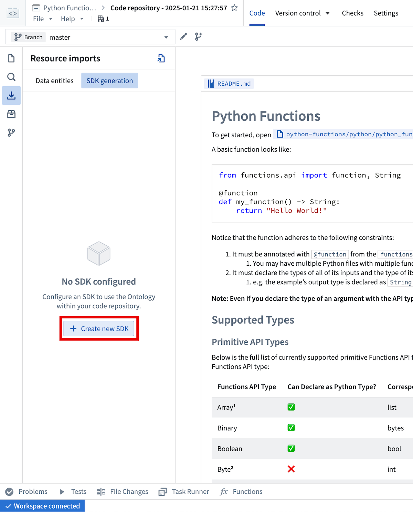
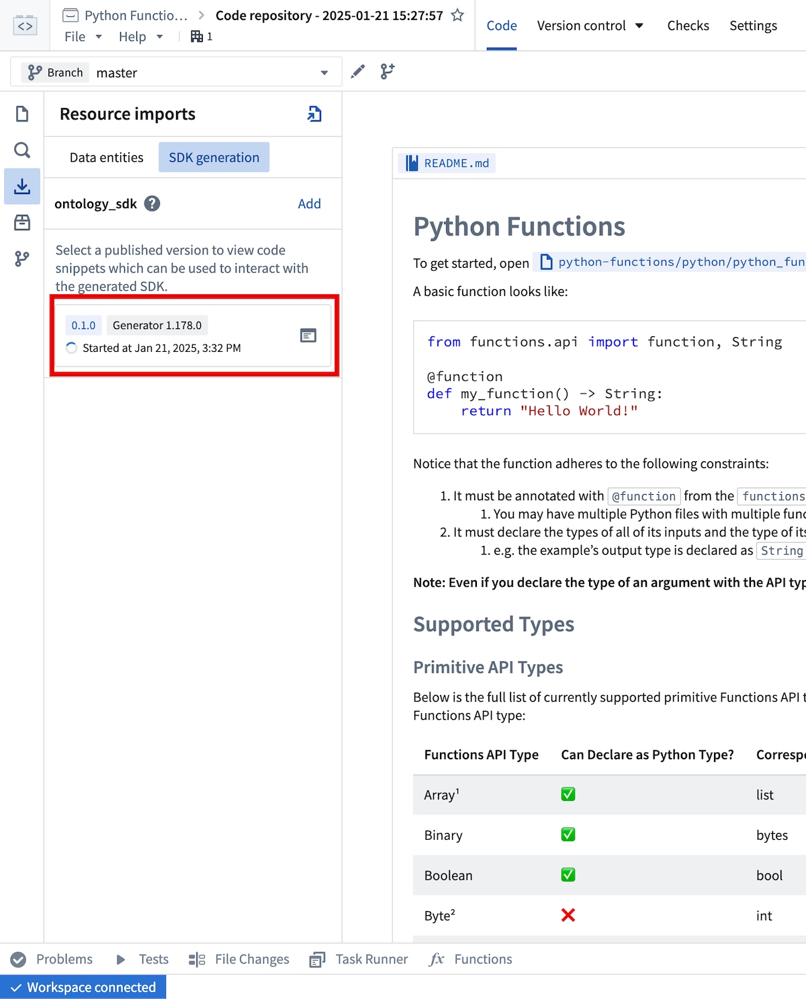
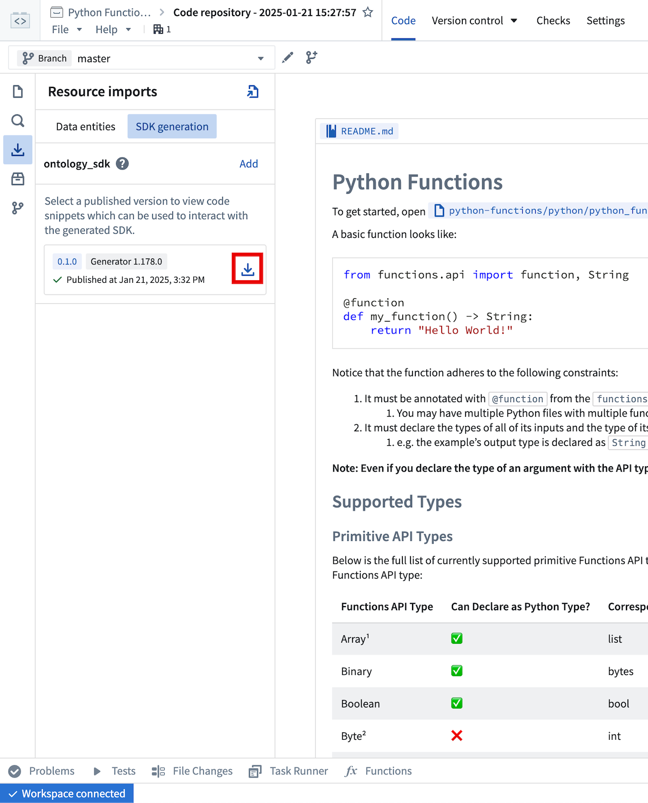
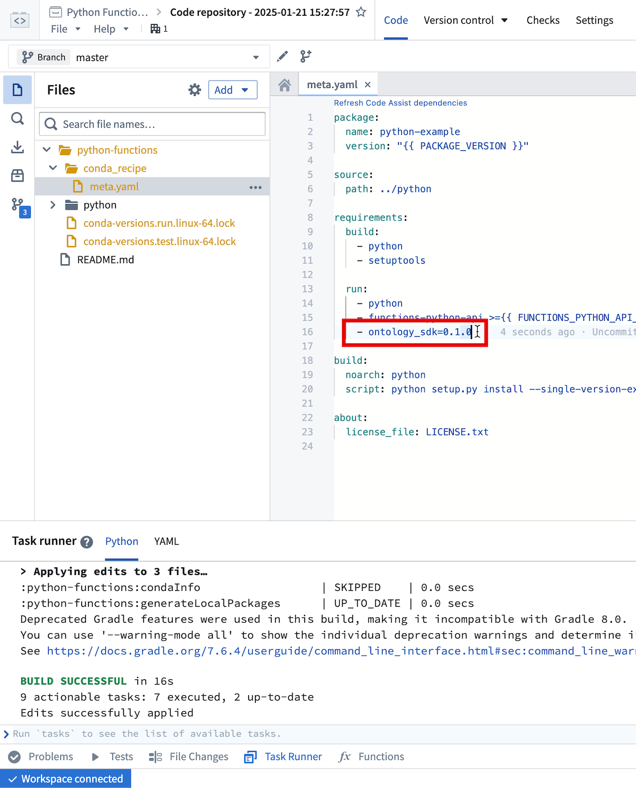

# [](#functions-on-objects)Functions on objects对象上的函数


You can write functions that interact with the Ontology using the Python Ontology SDK.您可以使用 Python Ontology SDK 编写与本体交互的函数。


## [](#generate-a-python-ontology-sdk)Generate a Python Ontology SDK生成 Python Ontology SDK


To generate a Python Ontology SDK client, navigate to the [**Resource imports** sidebar](/docs/foundry/functions/resource-imports-sidebar/) and select
**Add > Ontology**. From there, select your desired Ontology and import any objects and links you would like to interact with in
your functions. After saving to confirm your selections, a banner will appear to indicate that a corresponding OSDK has not yet been created.要生成 Python Ontology SDK 客户端，请导航到资源导入侧边栏并选择添加 > Ontology。在那里，选择您需要的本体并导入您希望在函数中交互的对象和链接。保存以确认您的选择后，将出现横幅，指示尚未创建相应的 OSDK。


Navigate to the **SDK Generation** tab to generate and install the OSDK.导航到 SDK 生成选项卡以生成和安装 OSDK。





If no OSDK has been generated, you will be prompted to enter a name for the generated package.
The package name cannot be changed after the first version has been generated.如果尚未生成 OSDK，系统将提示您输入生成包的名称。一旦第一个版本生成后，包名将无法更改。


After selecting **Create new version**, you can monitor the generation progress from this view.选择创建新版本后，您可以从此视图监控生成进度。





Once generation is complete, you will need to install the newly generated version with the 

 button.生成完成后，您需要使用  按钮安装新生成的版本。





This will trigger an interactive install in the task runner panel.
Once that task completes successfully (the Task Runner will display `BUILD SUCCESSFUL`), code completion for the OSDK will be available in your code assist session.这将触发任务运行器面板中的交互式安装。一旦该任务成功完成（任务运行器将显示 BUILD SUCCESSFUL ），您在代码辅助会话中将可以使用 OSDK 的代码补全功能。


The `meta.yml` file will also be updated to include a reference to the generated package.
You can manually update `meta.yml` instead of using the installation helper, but if you manually update `meta.yml`, you will need to rebuild your code assist session to pick up the changes.meta.yml 文件也将更新以包含对生成包的引用。你可以手动更新 meta.yml 而不是使用安装助手，但如果手动更新 meta.yml ，你需要重新构建你的代码辅助会话以应用这些更改。





Any time you import additional resources in the sidebar you will be prompted to generate and install a new version of the OSDK that includes these resources.
Additionally, if you modify imported resources (for instance, adding a new property to an already imported object type), you will need to generate a new OSDK version to pick up these changes.每次你在侧边栏导入额外资源时，系统会提示你生成并安装包含这些资源的新版本 OSDK。此外，如果你修改了导入的资源（例如，向已导入的对象类型添加新属性），你需要生成新的 OSDK 版本以应用这些更改。


## [](#examples)Examples示例


For an example object type named `Aircraft` with properties `brand` and `capacity`, you could write a
function that accepts an `Aircraft` object and summarizes it like so:例如，对于一个名为 Aircraft 的对象类型，具有属性 brand 和 capacity ，您可以编写一个接受 Aircraft 对象并总结它的函数，如下所示：


```
Copied!`1from functions.api import function
2from ontology_sdk.ontology.objects import Aircraft
3
4@function
5def aircraft_input_example(aircraft: Aircraft) -> str:
6    return f"{aircraft.brand} aircraft, holds {aircraft.capacity} passengers"`
```


Furthermore, if you wanted to search for `Aircraft` objects satisfying a certain capacity threshold, you could write the
following:此外，如果您想搜索满足特定容量阈值的 Aircraft 对象，您可以编写如下代码：


```
Copied!`1from functions.api import function
2from ontology_sdk import FoundryClient
3from ontology_sdk.ontology.objects import Aircraft
4from ontology_sdk.ontology.object_sets import AircraftObjectSet
5
6@function
7def aircraft_search_example() -> AircraftObjectSet:
8    client = FoundryClient()
9    return client.ontology.objects.Aircraft.where(Aircraft.object_type.capacity > 100)`
```


The Python OSDK also offers beta features such as interoperability with pandas DataFrames:Python OSDK 还提供了一些 beta 功能，例如与 pandas DataFrames 的互操作性：


```
Copied!`1from functions.api import function
2from ontology_sdk.ontology.object_sets import AircraftObjectSet
3
4@function
5def aircraft_dataframe_example(aircrafts: AircraftObjectSet) -> int:
6    df = aircrafts.to_dataframe()
7    return df['capacity'].sum()`
```


Review the [Python Ontology SDK documentation](/docs/foundry/ontology-sdk/python-osdk/) for more information.查阅 Python 本体 SDK 文档以获取更多信息。

