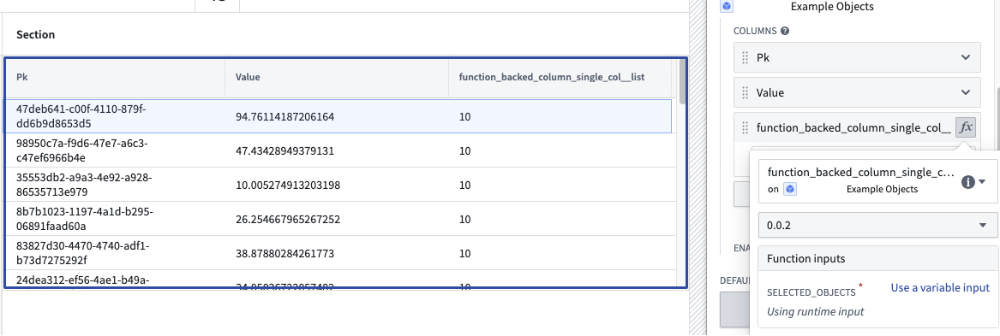
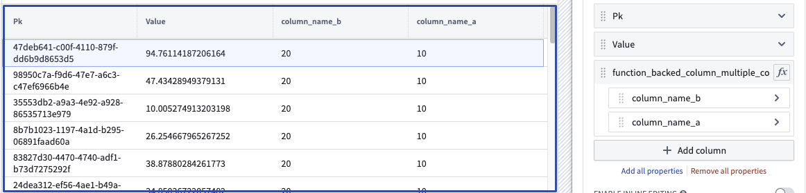

# [](#use-a-python-function-in-workshop)Use a Python function in Workshop在 Workshop 中使用 Python 函数


## [](#prerequisites)Prerequisites前提条件


This guide assumes you have already authored and published a Python function. Review the [getting started with Python functions](/docs/foundry/functions/python-getting-started/) documentation for a tutorial. For examples of how to query the Ontology using the Python SDK, see the [Python Ontology SDK documentation](/docs/foundry/ontology-sdk/python-osdk/).本指南假设您已经创建并发布了一个 Python 函数。有关教程，请参阅 Python 函数入门文档。有关如何使用 Python SDK 查询本体（Ontology）的示例，请参阅 Python 本体（Ontology）SDK 文档。


## [](#use-the-python-function-in-workshop)Use the Python function in Workshop在 Workshop 中使用 Python 函数


In Workshop, search for the Python function from the **Variables** tab to the left side of the module. Both [serverless and deployed functions](/docs/foundry/functions/functions-deployed/#choose-between-deployed-and-serverless-execution-modes) will appear here. Serverless functions can always be run at any version and do not need to be manually deployed. Deployed functions will show an icon with one of three states for both the function and the function version:在 Workshop 中，从模块左侧的变量（Variables）选项卡中搜索 Python 函数。无服务器（serverless）和已部署（deployed）的函数都将显示在此处。无服务器函数始终可以在任何版本上运行，无需手动部署。已部署的函数将显示函数及其版本状态的三种状态之一的图标：


- **Running:** This function and version can serve requests.运行中：此函数和版本可以处理请求。
- **Stopped:** This function and version are not available. In the function selector, hover over the information icon, select **Configure** and then **Create and start deployment** to make the function available.已停止：此函数和版本不可用。在函数选择器中，将鼠标悬停在信息图标上，选择配置，然后创建并开始部署以使函数可用。
- **Upgrading:** This function and version are not yet available.升级中：此函数和版本尚未可用。


### [](#cut-a-new-release)Cut a new release发布新版本


Only one version of the function’s repository is hosted at a given time. To make changes to functions with limited downtime we recommend adding a new function (like `function_v1`) with the changes and tagging as described [here](/docs/foundry/functions/python-getting-started/#commit-and-publish-a-function). From your published functions under tags and releases, select **Open in Ontology Manager**.仅有一个版本的函数仓库在任何时候被托管。为了在有限的停机时间内修改函数，我们建议添加一个带有更改的新函数（如 function_v1 ），并按照此处所述进行标记。从您的带标签和发布的函数中，选择在本体管理器中打开。


In Ontology Manager, select the version of the function repository you want to use in applications, then select **Upgrade**.在本体管理器中，选择您想在应用程序中使用的函数仓库版本，然后选择升级。


Update all downstream applications using functions from this repository to the new version you have deployed. Note that the previous deployment version will no longer be running so your applications will have a short downtime as you make this change. You will have `function_v0` and `function_v1` available at the same time so while you need to switch to the new deployment version, you do not have to change the function you are using. When `function_v0` is no longer used, you can delete the function.将所有使用此仓库中函数的下游应用程序更新为您已部署的新版本。请注意，之前的部署版本将不再运行，因此您在做出此更改时，应用程序将会有短暂的停机时间。您将同时拥有 function_v0 和 function_v1 ，因此虽然您需要切换到新的部署版本，但您不必更改您正在使用的函数。当 function_v0 不再使用时，您可以删除该函数。


### [](#debug-errors)Debug errors调试错误


If your function is not working as expected in Workshop, first check if the issue is related to the logic or the responsiveness of the function. If there is an issue with the logic, inspect the source code in the backing code repository. If there is an issue with the function being unresponsive or throwing an error, follow the steps below:如果您的函数在 Workshop 中无法按预期工作，首先检查问题是否与逻辑或函数的响应性有关。如果问题在于逻辑，请检查支撑代码库中的源代码。如果问题在于函数无响应或抛出错误，请按照以下步骤操作：


1. Check if the version you selected is currently running in the function selector dropdown menu.检查您选择的版本是否当前在功能选择下拉菜单中运行。


1. If the function is not deployed or `Upgrading`, hover over the function’s information icon and select **Configure**. This will take you to Ontology Manager where you can select **Start Deployment** to get your function running again.如果函数未部署或 Upgrading ，将鼠标悬停在函数的信息图标上并选择配置。这将带您进入本体管理器，您可以选择开始部署以重新启动您的函数。


1. If your function is `Running` or you need more information about the deployment’s behavior, select **Deployment** from the left panel in Ontology Manager to view detailed logs. SLS logs are also available if you select **View live**.如果你的函数是 Running 或你需要更多关于部署行为的信息，请从本体管理器左侧面板选择“部署”以查看详细日志。如果选择“查看实时”，也可以查看 SLS 日志。


## [](#create-a-function-backed-column)Create a function-backed column创建一个函数支持的列


To create a function-backed column, you must publish a function that meets the following requirements:要创建一个函数支持的列，你必须发布一个满足以下要求的函数：


- The function's input parameters must include an object set parameter (imported from `ontology_sdk.ontology.object_sets`) and can optionally include other input parameters. This object set parameter will enable the objects displayed in the table to be passed into the function to then generate the desired derived column. Note that a `list[ObjectType]` parameter will also work here, but this less performant option is not recommended.该函数的输入参数必须包含一个对象集参数（从 ontology_sdk.ontology.object_sets 导入），并且可以可选地包含其他输入参数。此对象集参数将使表格中显示的对象能够传递到函数中，然后生成所需的派生列。请注意， list[ObjectType] 参数在这里也可以使用，但这个性能较差的选项不推荐使用。
- The function's return type must be `dict[ObjectType, ColumnType]`, where `ColumnType` is the desired [type](/docs/foundry/functions/types-reference/#types-reference) for the column, or `dict[ObjectType, CustomType]` to return multiple columns from the function. Learn more about [custom types](/docs/foundry/functions/types-reference/#structcustom-type).该函数的返回类型必须是 dict[ObjectType, ColumnType] ，其中 ColumnType 是列的期望类型，或使用 dict[ObjectType, CustomType] 从函数中返回多个列。了解更多关于自定义类型的信息。


Once a function that meets the above criteria is configured and published, you can configure a function-backed property column within the [Object Table](/docs/foundry/workshop/widgets-object-table/#features-of-function-backed-properties) widget configuration.一旦配置并发布符合上述条件的函数，您可以在对象表小部件配置中配置一个基于函数的属性列。


An example of a function returning one column:返回一列的函数示例：


```
Copied!`1from functions.api import Date, Integer, String, function
2from ontology_sdk import FoundryClient
3from ontology_sdk.ontology.object_sets import MyObjectTypeObjectSet
4from ontology_sdk.ontology.objects import MyObjectType
5
6@function
7def function_backed_column_single_col(
8    selected_objects: MyObjectTypeObjectSet
9) -> dict[MyObjectType, Integer]:
10    final_dict = {}
11
12    for curr_obj in selected_objects:
13        final_dict[curr_obj] = 10 # The value can be defined for any arbitrary logic
14
15    return final_dict`
```





An example of a function returning multiple columns:一个返回多列的函数示例：


```
Copied!`1from dataclasses import dataclass
2
3@dataclass
4class CustomType:
5    column_name_a: int
6    column_name_b: int
7
8@function
9def function_backed_column_multiple_cols(
10    selected_objects: MyObjectTypeObjectSet, some_other_parameter: String
11) -> dict[MyObjectType, CustomType]:
12    final_dict = {}
13
14    for curr_obj in selected_objects:
15        final_dict[curr_obj] = CustomType(column_name_a=10, column_name_b=20)
16
17    return final_dict`
```




