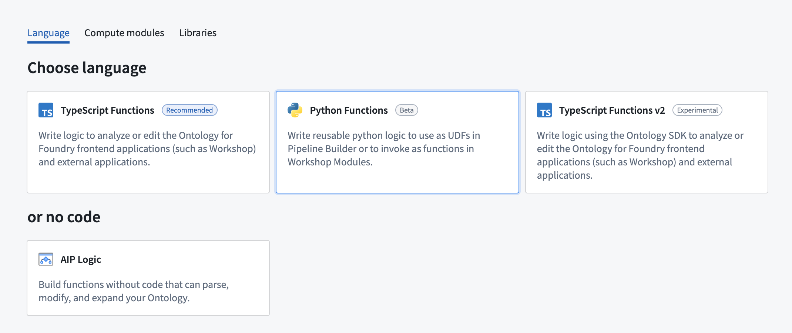
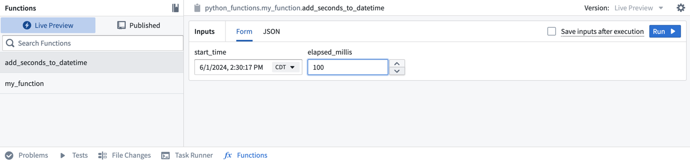
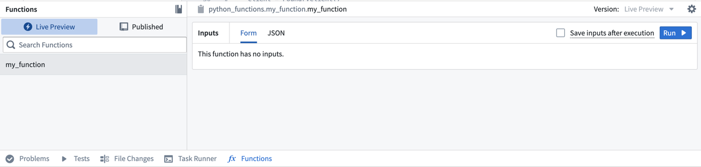
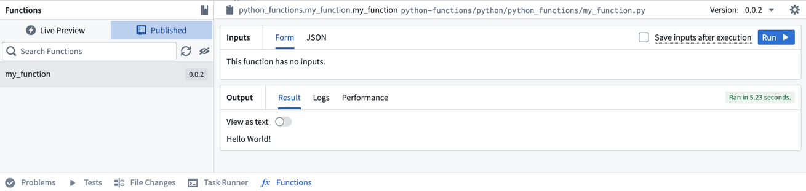

# [](#getting-started-with-python-functions)Getting started with Python functions入门 Python 函数


The following documentation will guide you through the initial steps to prepare Python functions for use in the Palantir platform. You will learn how to create a Python functions repository, commit and publish a function, test in live previews, and more.以下文档将指导您完成准备在 Palantir 平台上使用 Python 函数的初始步骤。您将学习如何创建 Python 函数仓库、提交并发布函数、在实时预览中测试等。


## [](#create-a-python-functions-repository)Create a Python functions repository创建 Python 函数仓库


Navigate to a project of your choice and create a new code repository by selecting **+ New > Repository**. Select the **Pythons functions** template to initialize your repository. We recommend grouping all functions for use in Workshop or Ontology-based applications in a single repository to minimize costs.导航到您选择的项目，通过选择+新建>仓库创建一个新的代码仓库。选择 Python 函数模板来初始化您的仓库。我们建议将所有用于 Workshop 或基于本体应用中的函数分组放在一个仓库中，以最小化成本。





Once the repository is created, navigate to the `python-functions/python/python-functions/my_function.py` file.创建存储库后，导航到 python-functions/python/python-functions/my_function.py 文件。


## [](#explore-the-repository)Explore the repository探索仓库


Your repository will be initialized with a `my_function.py` file containing some example functions, including the following:您的仓库将初始化一个 my_function.py 文件，其中包含一些示例函数，包括以下内容：


Python```
Copied!`1from functions.api import function, String
2
3@function
4def my_function() -> String:
5    return "Hello World!"`
```


Notice that the function adheres to the following constraints:请注意，该函数需遵循以下约束：


- The function must be decorated with `@function` from the `functions.api` package to be recognized as a Python function. You may have multiple Python files with multiple functions in each file, but *only the functions with this decorator* will be registered as Python functions.该函数必须使用 functions.api 包中的 @function 装饰器进行装饰，才能被识别为 Python 函数。您可能有多个 Python 文件，每个文件中包含多个函数，但只有带有此装饰器的函数才会被注册为 Python 函数。
- The function must declare the types of all of its inputs along with the type of its output, either using the type from the functions API package or its corresponding Python type. For example, the above example’s output type is declared as `String` from the functions API, but it may also be declared as the corresponding Python type `str`.函数必须声明其所有输入的类型以及输出类型，可以使用函数 API 包中的类型或相应的 Python 类型。例如，上述示例的输出类型通过函数 API 声明为 String ，但也可能声明为相应的 Python 类型 str 。


Even if you declare the type of an argument with the API type (for example, `String`), your function will be passed the corresponding Python type at runtime (in this example, `str`).即使您使用 API 类型声明参数的类型（例如 String ），在运行时，您的函数将接收到相应的 Python 类型（在此示例中为 str ）。


For a full overview of types in Python functions see our [type reference documentation](/docs/foundry/functions/types-reference/).有关 Python 函数中类型的完整概述，请参阅我们的类型参考文档。


## [](#test-in-live-preview)Test in live preview在实时预览中测试


After you add the new function, you can run it immediately in the **Functions** helper. Open the **Functions** helper from the bottom left of the screen and select **Live Preview**. Choose the `add_seconds_to_datetime` function, enter input values, and select **Run** to run the code.添加新函数后，您可以在函数辅助工具中立即运行它。从屏幕左下角打开函数辅助工具，选择实时预览。选择 add_seconds_to_datetime 函数，输入输入值，然后选择运行以运行代码。





Select **Commit** in the upper right to commit your changes onto the `master` branch of your repository.在右上角选择“提交”以将您的更改提交到您的存储库的 master 分支。


### [](#commit-and-publish-a-function)Commit and publish a function提交并发布一个函数


Once you write a function (or uncomment one of the example functions provided), follow the steps below to commit and publish it.一旦你编写了一个函数（或取消注释提供的示例函数之一），请按照以下步骤提交并发布它。


1. Commit your changes by selecting **Commit** in the **Source control** tab and adding a commit message.通过在源代码选项卡中选择提交并添加提交信息来提交你的更改。
2. Select the **Branches** tab from the top center of the screen, then select **Tags and releases**.从屏幕顶部中央选择分支选项卡，然后选择标签和发布。
3. Choose **New tag** and provide a version for the release.选择新标签并提供发布的版本。


1. Select **Tag and release** and wait for the release step to complete.选择标签并释放，然后等待释放步骤完成。
2. Once the check is successful, select the **Code** tab, then open the **Functions** tab on the bottom of the page. You will see `my_function` in the results.一旦检查成功，选择代码标签，然后打开页面底部的函数标签。你会在结果中看到 my_function 。





1. Select the function, then choose **Run** to execute the function that you just published.选择函数，然后选择运行以执行您刚刚发布的函数。





## [](#add-another-function)Add another function添加另一个函数


Now, we will add a more complex function to this repository to test and publish. Copy and paste the code below to the bottom of the `my_function` file.现在，我们将向此存储库添加一个更复杂的函数以进行测试和发布。将下面的代码复制并粘贴到 my_function 文件的底部。


Python```
Copied!`1from functions.api import function, String
2from datetime import datetime, timedelta
3
4@function
5def add_seconds_to_datetime(start_time: datetime, elapsed_millis: int) -> str:
6    dt = start_time + timedelta(milliseconds=elapsed_millis)
7    return dt.isoformat()`
```


For more examples of how to use your Python functions in the platform, review our documentation on [using Python functions in Pipeline Builder](/docs/foundry/functions/python-functions-builder/) and on [using Python functions in Workshop](/docs/foundry/functions/python-functions-workshop/).有关如何在平台上使用您的 Python 函数的更多示例，请查阅我们在 Pipeline Builder 中使用 Python 函数和在工作室中使用 Python 函数的文档。

