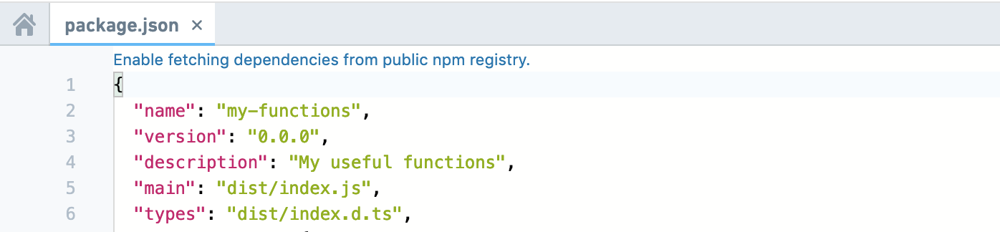
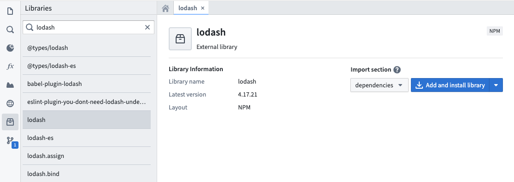
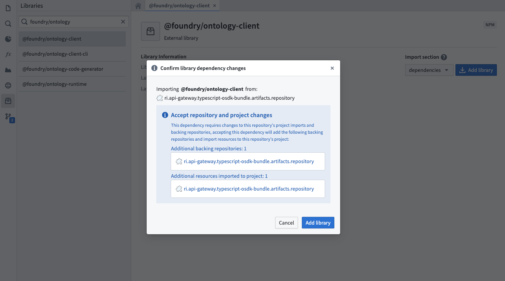
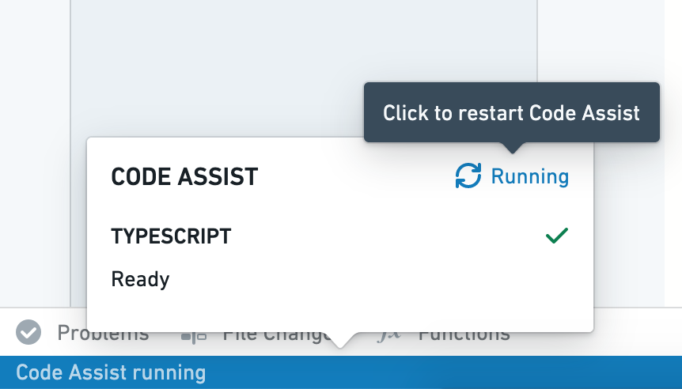

# [](#add-npm-dependencies)Add npm dependencies添加 npm 依赖


Functions repositories use [npm ↗](https://npmjs.com/) for managing dependencies, including packages for generating code based on the Foundry ontology and discovering functions in your code. You can use `npm` to install external dependencies into your repositories, using standard packages for purposes such as manipulating numbers and dates, performing statistical calculations, or working with data formats such as XML.函数仓库使用 npm ↗ 来管理依赖，包括基于 Foundry 本体生成代码的包和发现代码中的函数。您可以使用 npm 将外部依赖安装到您的仓库中，使用标准包进行数值和日期操作、执行统计计算或处理 XML 等数据格式。


Note that the functions runtime only supports pure JavaScript libraries—any package that relies on a NodeJS runtime and makes system calls is not supported.请注意，函数运行时仅支持纯 JavaScript 库——任何依赖 NodeJS 运行时并执行系统调用的包都不被支持。


## [](#enable-fetching-dependencies-from-the-public-npm-registry)Enable fetching dependencies from the public npm registry启用从公共 npm 注册中心获取依赖


By default, functions repositories do not fetch packages from the public npm registry.默认情况下，函数仓库不会从公共 npm 注册中心获取包。


If your repository does not already fetch dependencies from the public npm registry, a banner for enabling it will appear when you open a `package.json` file in Code Repositories.如果你的仓库尚未从公共 npm 注册中心获取依赖项，当你在代码仓库中打开 package.json 文件时，将出现启用它的横幅。





## [](#add-dependencies-in-code-repositories)Add dependencies in Code Repositories在代码仓库中添加依赖项


You can add packages to your functions repository using the Libraries sidebar in **Code Repositories**. Search for the desired package, and select a result to view details like the latest version. Results include packages from Foundry and [https://npmjs.com](https://npmjs.com).你可以使用代码仓库中的库侧边栏向你的函数仓库添加包。搜索所需的包，并选择一个结果以查看最新版本等详细信息。结果包括来自 Foundry 和 https://npmjs.com 的包。





Choose whether to add the package to `dependencies` or `devDependencies` in your `package.json` file. Select **Add and install library** to add the package to your repository.





If the package's originating repository is not yet configured as a backing repository, a dialog will prompt you to import additional resources. The **Add and install library** button automatically imports the package and its dependencies into your functions repository, updating your `package.json` and `package-lock.json`.


Once the running install tasks have finished, the package will be ready for use within your repository.


If you are using a `typescript-functions` template version lower than 0.520.0, installation through the task runner will be disabled. In this case, commit your updated `package.json` file, ensure checks pass successfully, then restart Code Assist to make the new package available.


## [](#manually-add-dependencies)Manually add dependencies手动添加依赖


You can manually add a package by modifying the `package.json` file in Code Repositories. This can be useful if you need to install a specific package version. Open `package.json`, add your dependency with a relevant version chosen from [https://npmjs.com](https://npmjs.com), and select **Commit**. After verifying that checks pass successfully, restart Code Assist to make the new package available.您可以通过修改代码库中的 package.json 文件手动添加一个包。如果您需要安装特定版本的包，这会很有用。打开 package.json ，从 https://npmjs.com 选择相关版本添加依赖，然后选择提交。在验证检查成功通过后，重启代码辅助功能以使新包可用。





Below is an example of adding the `d3-array` package manually to the `package.json` file in a repository:以下是手动将 d3-array 包添加到 package.json 文件中的示例：


```
Copied!`1  "dependencies": {
2    ...
3    "d3-array": "^2.3.1"
4  },
5  "devDependencies": {
6    ...
7    "@types/d3-array": "^2.0.0"
8  }`
```

