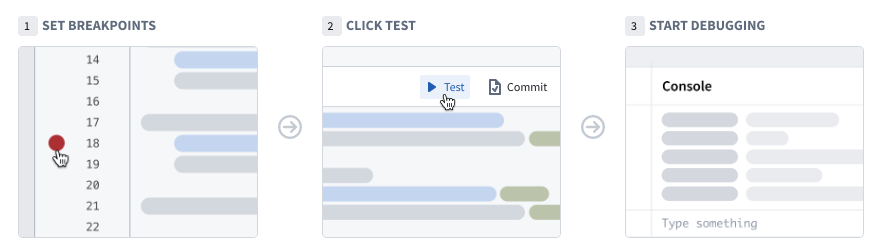
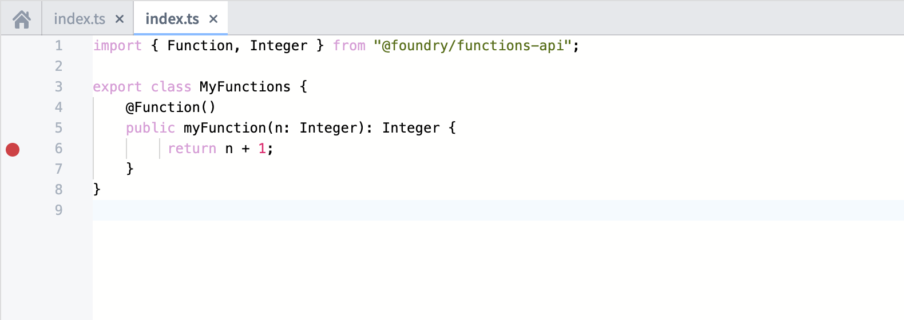
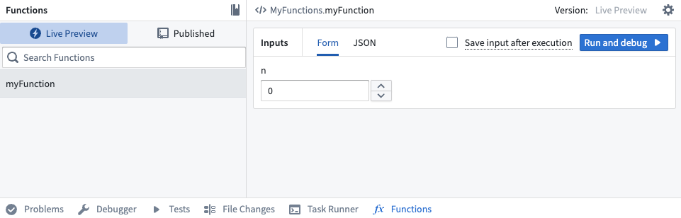
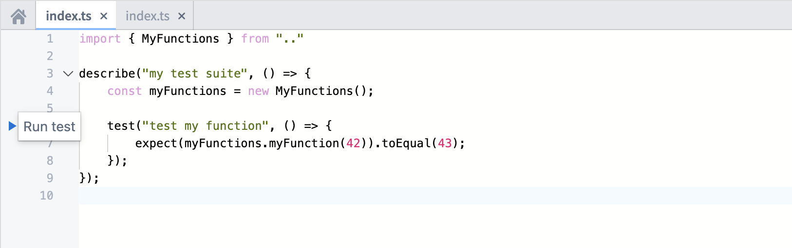
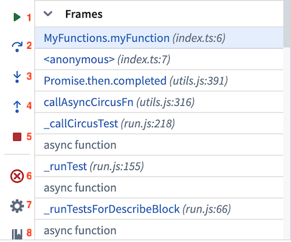
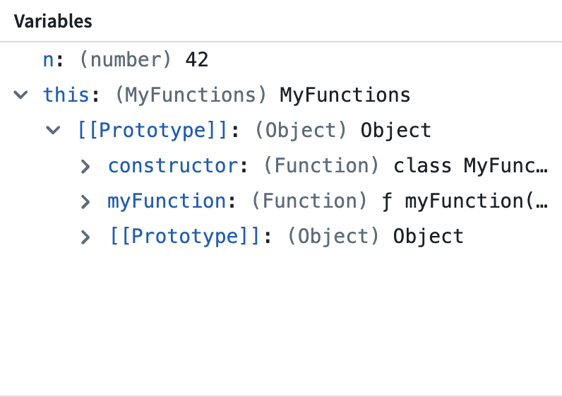
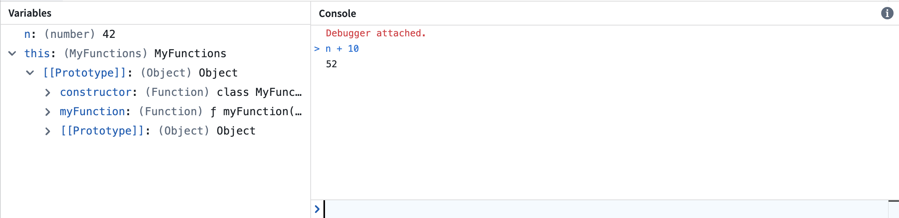
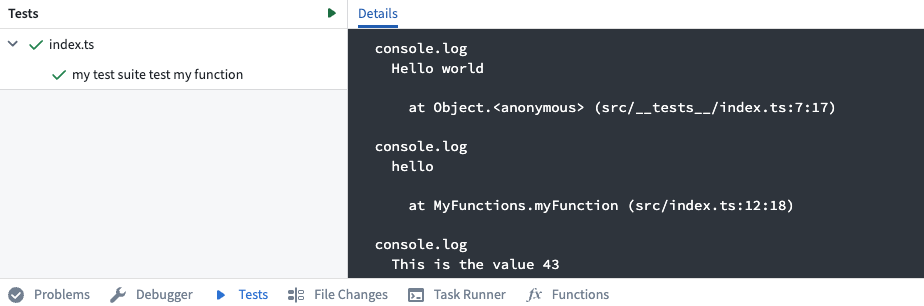
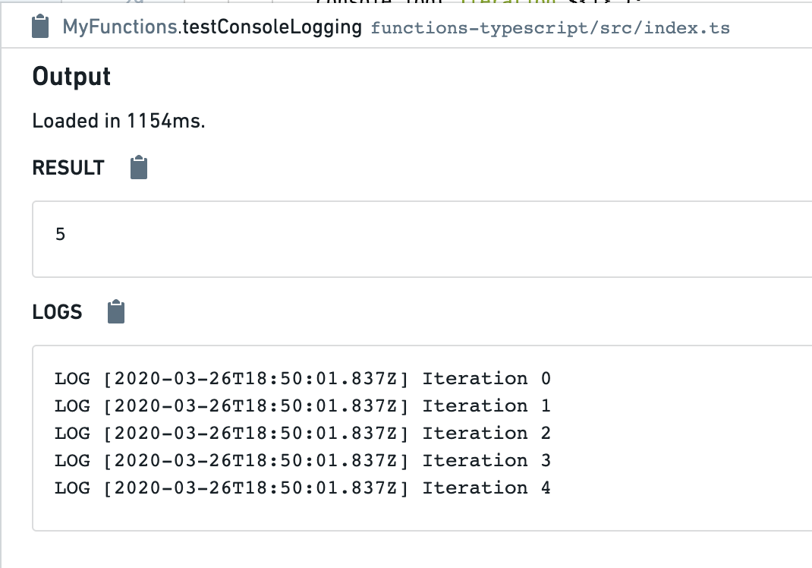

# [](#debug-functions)Debug Functions调试函数


The debugger is not yet supported in Python and TypeScript v2 functions.Python 和 TypeScript v2 函数中尚未支持调试器。


As you write functions, you will likely need to inspect the state of your execution to fix issues with code correctness or performance. Below are features you can use to do this. Note that these debugging steps also apply to [unit tests](/docs/foundry/functions/unit-test-getting-started/).在编写函数时，您可能需要检查执行状态以解决代码正确性或性能问题。以下是您可以使用的一些功能来完成此操作。请注意，这些调试步骤也适用于单元测试。


## [](#authoring-debugger)Authoring debugger编写调试器


Use the debugger tool in Code Repositories to examine the behavior of your unit test while it runs. Set breakpoints to pause the execution of the unit test in order to examine variables, and understand functions and libraries.使用代码库中的调试工具来检查单元测试运行时的行为。设置断点以暂停单元测试的执行，以便检查变量和理解函数和库。





## [](#set-breakpoints)Set breakpoints设置断点


To use the debugger, you need to set breakpoints. These breakpoints indicate the specific points where the debugger should pause the code execution, enabling you to interact with variables.要使用调试器，您需要设置断点。这些断点指示调试器应在代码执行的特定点暂停，使您能够与变量交互。


Set a breakpoint by selecting the faded red dot in the margins of each line of code. The debugger suspends the execution *before* the marked line runs. You can set multiple breakpoints across several files, if needed.通过选择每行代码边缘的褪色红点来设置断点。调试器在标记的行运行之前挂起执行。如果需要，您可以在多个文件中设置多个断点。





## [](#run-the-debugger)Run the debugger运行调试器


### [](#during-live-preview)During live preview在实时预览期间


After adding breakpoints in your code, select **Run and debug**, located in the functions panel.在您的代码中添加断点后，选择位于函数面板中的“运行并调试”。





### [](#during-testing)During testing在测试期间


After adding breakpoints in your code, select **Run test**, located next to the unit test in the code editor.在代码中添加断点后，选择代码编辑器中位于单元测试旁边的 Run test。





## [](#use-the-debugger)Use the debugger使用调试器


Once the debugger has started, the debugger panel will open and pause on the first breakpoint it encounters. The left bar of the debugger allows you to navigate the code, remove breakpoints, and finish or stop the debugging session.一旦调试器启动，调试面板将打开并在遇到第一个断点时暂停。调试器的左侧栏允许你导航代码、移除断点以及完成或停止调试会话。


As you navigate the code, the editor highlights the line of code to be executed next. Use the following buttons to advance the debugger:在导航代码时，编辑器会突出显示下一行将要执行的代码。使用以下按钮来推进调试器：





1. **Resume execution:** Continue execution until completion or until paused by the next breakpoint.继续执行：执行直到完成或被下一个断点暂停。
2. **Step over:** Execute the line of code without stepping into internal functions.单步跳过：执行该行代码，但不进入内部函数。
3. **Step into:** Navigate into internal functions if they exist in that line of code.单步进入：如果该行代码中存在内部函数，则进入内部函数。
4. **Step out:** Navigate out of an internal function and advance the debugger.单步跳出：退出内部函数并继续调试器。
5. **Stop execution:** Stop the debugger completely.停止执行：完全停止调试器。
6. **Remove breakpoints:** Remove all breakpoints from the repository and run the unit test without pausing the execution.移除断点：从仓库中移除所有断点，并运行单元测试而不暂停执行。
7. **Settings:** Toggle the debugger on/off (without clearing the breakpoints).设置：打开/关闭调试器（不清除断点）。
8. **Documentation:** Open the documentation for additional details.文档：打开文档以获取更多详细信息。


## [](#examine-variables)Examine variables检查变量


While the debugger is running, you can examine the variables and data at the exact point of code execution.调试器运行时，你可以在代码执行的精确位置检查变量和数据。


### [](#frames)Frames框架


Frames represent the functions in which the debugger is active or in which breakpoints exist. Each frame indicates the name of the function followed by the name of the file and the line number in which the function is written.框架表示调试器处于活动状态或存在断点的函数。每个框架都标明了函数名称，后跟函数所在的文件名和行号。


Select a frame to examine the variables within that frame and run console commands against it.选择一个框架来检查该框架内的变量，并对其运行控制台命令。


### [](#variables)Variables变量


The variables section displays the values stored in both local and global variables while the transform is executed.变量部分显示在转换执行时存储在本地和全局变量中的值。





### [](#console)Console控制台


The console allows you to interact with your data using JavaScript console commands while running the debugger.控制台允许你在调试器运行时使用 JavaScript 控制台命令与你的数据进行交互。


Note that the console operates within the context of the selected frame. Attempting to execute commands on variables local to a different frame will lead to an error.请注意，控制台在选定框架的上下文中运行。尝试在属于不同框架的变量上执行命令会导致错误。





## [](#console-logging)Console logging控制台日志记录


Functions supports emitting console logs during execution for debugging purposes. To do so, simply use the `console.log` command to emit logs. For example:函数支持在执行过程中发出控制台日志以进行调试。为此，只需使用 console.log 命令发出日志。例如：


```
Copied!`1    @Function()
2    public testConsoleLogging(n: Integer): Integer {
3        for (let i = 0; i < n; i++) {
4            console.log(`Iteration ${i}`);
5        }
6        return n;
7    }`
```


Using console logs in this way can be useful for debugging correctness issues. You can also add console logs to identify performance bottlenecks in your code. See the guide for [optimizing performance](/docs/foundry/functions/optimize-performance/) for more information on how to improve the performance of link traversal logic.使用这种方式在控制台输出日志对于调试正确性问题很有帮助。你也可以添加控制台日志来识别代码中的性能瓶颈。有关如何优化链接遍历逻辑性能的更多信息，请参阅性能优化指南。


### [](#during-testing-1)During testing在测试期间


When you run a function using the **Tests** helper in **Authoring**, console logs will be captured and displayed below:当你在创作中使用测试辅助工具运行函数时，控制台日志将被捕获并在下方显示：





### [](#during-live-preview-1)During live preview在实时预览期间


When you run a function using the **Functions** helper in **Authoring**, console logs will be captured and displayed below, along with timestamps:使用 Authoring 中的 Functions 辅助工具运行函数时，控制台日志将被捕获并显示在下方，同时附带时间戳：




