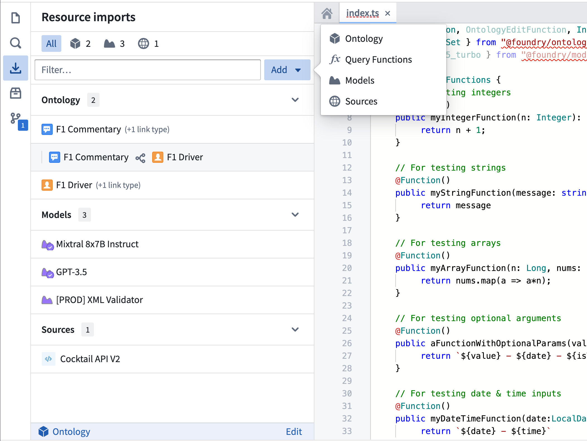
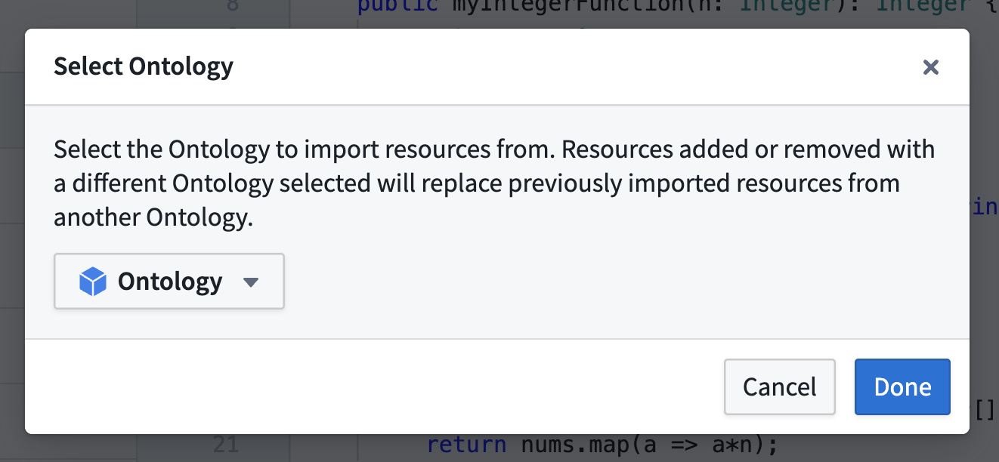
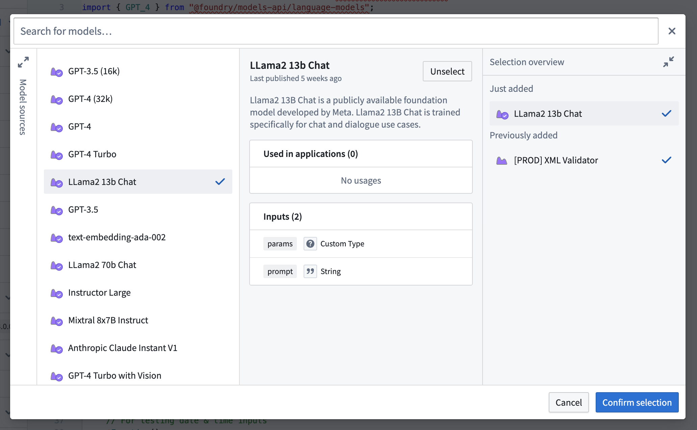
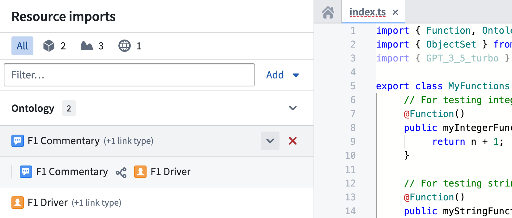
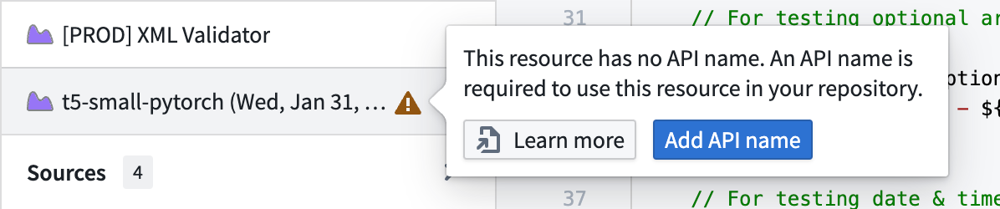
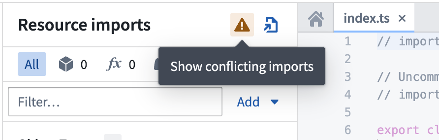

# [](#import-resources-into-code-repositories)Import resources into Code Repositories导入资源到代码仓库


The Resource Imports sidebar in Code Repositories offers a centralized interface to manage imported Foundry resources within your TypeScript functions repository. The sidebar allows you to import, remove, and view details of various resources, including Ontology types, LMS language models, live deployments, and external systems such as REST APIs.代码仓库中的资源导入侧边栏提供了一个集中式界面，用于管理在您的 TypeScript 函数仓库中导入的 Foundry 资源。该侧边栏允许您导入、删除和查看各种资源的详细信息，包括本体类型、LMS 语言模型、实时部署以及外部系统（如 REST API）。





## [](#select-an-ontology)Select an Ontology选择一个本体


An Ontology is required to import object and link types. To choose an Ontology:导入对象和链接类型需要使用本体。选择本体的方法：


1. Choose **Add** to open the resource selector menu, and then choose **Ontology** to begin importing Ontology types. If no Ontology is selected, this will automatically open the Ontology selector dialog.选择“添加”以打开资源选择器菜单，然后选择“本体”以开始导入本体类型。如果未选择任何本体，系统将自动打开本体选择对话框。


If you have already imported at least one Ontology type, that type's Ontology is automatically selected. To change the Ontology, choose the **Edit** button next to the selected Ontology's name to open the Ontology selector dialog.如果您已经至少导入了一个本体类型，该类型的本体将自动被选中。要更改本体，请选择所选本体名称旁边的“编辑”按钮以打开本体选择对话框。





All imported resources within your repository must be associated with the same Ontology. Note that importing resources after changing the Ontology will overwrite any existing imports from other Ontologies.您存储库中所有导入的资源必须与相同的一个本体关联。请注意，更改本体后导入资源将覆盖来自其他本体的任何现有导入。


## [](#import-resources)Import resources导入资源


Modern versions of the TypeScript v1 template maintain the current state of repository imports in a `resources.json` file checked into your repository.现代版本的 TypeScript v1 模板在 resources.json 文件中维护了存储库导入的当前状态。

If you encounter warnings about an unresolvable file in the sidebar, see the [file-based ontology imports](#file-based-repository-imports) section for information about the expected file format and troubleshooting steps for resolving the issue.如果在侧边栏中遇到关于无法解析文件的警告，请查看基于文件的本体导入部分，了解预期的文件格式和解决该问题的故障排除步骤。


To import resources using the sidebar:使用侧边栏导入资源：


1. Use the **Add** button in the top right of the sidebar and select the desired resource type. This will open the selector dialog for that resource.使用侧边栏右上角的添加按钮，并选择所需的资源类型。这将打开该资源的选取器对话框。
2. Use the search bar and filters to locate the resources you want to import.使用搜索栏和过滤器来定位您想要导入的资源。
3. Choose a resource to display its preview panel with detailed information.选择一个资源以显示其预览面板，其中包含详细信息。
4. Use the **Select** button to add resources to your selection.使用选择按钮将资源添加到您的选择中。
5. Expand the cart panel to review your selection and confirm by choosing **Confirm selection**.展开购物车面板以查看您的选择并确认，请选择确认选择。


After confirming your selection, Code Assist will be restarted to re-run the necessary code generation tasks to apply your changes.确认选择后，代码辅助功能将重新启动以重新运行必要的代码生成任务以应用您的更改。





Learn more about importing resources of a specific type:了解更多关于导入特定类型的资源：


- [Ontology types本体类型](/docs/foundry/functions/ontology-imports/)
- [Language models语言模型](/docs/foundry/functions/language-models/#import-a-language-model)
- [Live deployments现场部署](/docs/foundry/functions/functions-on-models/#import-a-live-deployment-in-a-repository)
- [External sources外部来源](/docs/foundry/functions/webhooks/)


## [](#manage-imported-resources)Manage imported resources管理导入资源


Resources are categorized by type in the sidebar:资源在侧边栏中按类型分类：


- Ontology: Object, interface, and link types本体：对象、接口和链接类型
- Models: LMS models and live deployments模型：LMS 模型和实时部署
- Sources: External systems such as REST APIs来源：REST API 等外部系统


Choose the corresponding resource icon at the top of the sidebar to filter by type or use the text input to search by name. To remove a resource, hover over the resource icon and choose the **Remove** button. To add or remove multiple resources simultaneously, use a selector dialog. To view more details, select an imported resource to open its preview panel.在侧边栏顶部选择相应的资源图标按类型筛选，或使用文本输入按名称搜索。要删除资源，将鼠标悬停在资源图标上并选择删除按钮。要同时添加或删除多个资源，使用选择器对话框。要查看更多详细信息，选择导入的资源以打开其预览面板。


Some resource types may have dependencies between other resources. For instance, link types are organized under their respective object types. If an imported resource has dependencies, a message like "(1 link type)" will be displayed next to the resource title. To view a resource's dependencies, hover over the resource icon and select the chevron that appears.某些资源类型可能与其他资源存在依赖关系。例如，链接类型按其各自的对象类型组织。如果导入的资源存在依赖关系，资源标题旁边会显示类似"(1 链接类型)"的消息。要查看资源的依赖关系，将鼠标悬停在资源图标上并选择出现的箭头。





## [](#importing-resources-without-api-names)Importing resources without API names不使用 API 名称导入资源


Resources must have an API name to be referenced within code in TypeScript functions repositories. If a resource lacks an API name, a warning is displayed. Hover over the warning sign to learn more or easily configure an API name by choosing **Add API name**.  Alternatively, choose **Learn more** to see documentation about adding an API name tailored to the specific resource type.资源必须在 TypeScript 函数仓库中的代码中具有 API 名称才能被引用。如果资源缺少 API 名称，将显示警告。将鼠标悬停在警告标志上以了解更多信息，或通过选择“添加 API 名称”轻松配置 API 名称。或者，选择“了解更多”以查看有关为特定资源类型添加 API 名称的文档。





## [](#import-resources-with-value-type-dependencies)Import resources with value type dependencies导入具有值类型依赖的资源


Some resources depend on [value types](/docs/foundry/object-link-types/value-types-overview/) to define the datatypes used to interact with them, for example, function interfaces. For these resources, their value type dependencies are imported into the repository automatically so that they are available to use along with the resource.某些资源依赖值类型来定义用于与其交互的数据类型，例如函数接口。对于这些资源，它们的值类型依赖会自动导入到仓库中，以便与资源一起使用。


In some cases, importing a combination of such resources can result in a value type dependency conflict. This occurs when different resources have a common value type they depend on at differing versions. It is not possible to have both versions of the same value type imported, and this causes a compilation error. This error is accompanied by a warning in the sidebar, allowing you to view the resources with conflicting dependencies.在某些情况下，导入此类资源的组合可能会导致值类型依赖冲突。这种情况发生在不同的资源依赖于不同版本的相同值类型时。无法同时导入相同值类型的两个版本，这会导致编译错误。该错误会在侧边栏附带警告，允许您查看具有冲突依赖的资源。





## [](#file-based-repository-imports)File-based repository imports基于文件的仓库导入


Modern versions of the TypeScript v1 template maintain the current state of repository imports using a `resources.json` file checked into your repository. This gives you full Git semantics, allowing you to review, branch, and revert changes to your imports. The resource import sidebar helps you update this file by automatically inserting entries into the `resources.json` file.最新版本的 TypeScript v1 模板通过将 resources.json 文件提交到你的仓库来维护当前仓库的导入状态。这为你提供了完整的 Git 语义，允许你审查、分支和还原对导入的更改。资源导入侧边栏通过自动向 resources.json 文件插入条目来帮助你更新此文件。


If the `resources.json` file is in an invalid state, a warning will appear in the sidebar informing you that the file cannot be processed. If you encounter this error, ensure that your file contains a single JSON object with the following data:如果 resources.json 文件处于无效状态，侧边栏将显示警告，告知您无法处理该文件。如果您遇到此错误，请确保您的文件包含一个 JSON 对象，其中包含以下数据：


| Field字段 | Type类型 |
| --- | --- |
| `objectTypes` | Array of `{ rid: string }`{ rid: string } 数组 |
| `linkTypes` | Array of `{ rid: string }`{ rid: string } 数组 |
| `sources` | Array of `{ rid: string }`{ rid: string } 数组 |
| `functions` | Array of `{ rid: string, version: string }`{ rid: string, version: string } 数组 |
| `valueTypes` | Array of `{ rid: string, version: string }`{ rid: string, version: string } 数组 |
| `functionInterfaces` | Array of `{ rid: string, version: string }`{ rid: string, version: string } 数组 |
| `_comment` | String字符串 |
| `version`[1] | Integer整数 |


[1] The `version` field is used to express the version and format of the `resources.json` file. Currently only `version: 1` is supported. `version: 0` is used to indicate that your repository must undergo a migration from the prior, repository-wide imports workflow. This migration is handled automatically with a patch applied to your repository when a commit with `version: 0` is made.[1] version 字段用于表示 resources.json 文件的版本和格式。目前仅支持 version: 1 。 version: 0 用于指示您的仓库必须从先前的、全仓库范围的导入工作流程迁移。此迁移在提交 version: 0 时通过向您的仓库应用补丁自动处理。


Note that because the `resources.json` file is checked into your repository, you can view the commit history and use the history to revert the file back to a working state.请注意，因为 resources.json 文件已提交到您的仓库中，您可以查看提交历史并使用历史记录将文件恢复到可工作状态。


## [](#enable-resource-types)Enable resource types启用资源类型


By default, some resource types may not be enabled for use in your repository. The enabled resource types are determined by your `functions.json` file. This is the contents of a typical default `functions.json` file.默认情况下，某些资源类型可能不会在您的仓库中启用使用。启用的资源类型由您的 functions.json 文件决定。这是典型的默认 functions.json 文件的内容。


```
Copied!`1{
2  "useOntologyApiNames" : true,
3  "enableModelFunctions" : false,
4  "enableModelGraphFunctions" : false,
5  "enableDiscoverImproperOntologyAccess": false,
6  "enableQueries": false,
7  "enableModelMetadata": false,
8  "useDeploymentApiNames": true,
9  "enableVectorProperties": true,
10  "enableTimeSeriesProperties": false,
11  "enableExternalSystems": false,
12  "enableMediaReferenceProperties": false
13}`
```


Importing resources without enabling the corresponding flag in your `functions.json` file may cause checks to fail in your repository. To use imported live deployments, set `enableModelFunctions` to true. To use imported sources, set `enableExternalSystems` to true.未在您的 functions.json 文件中启用相应标志导入资源可能会导致您的仓库中的检查失败。要使用导入的实时部署，请将 enableModelFunctions 设置为 true。要使用导入的源，请将 enableExternalSystems 设置为 true。

