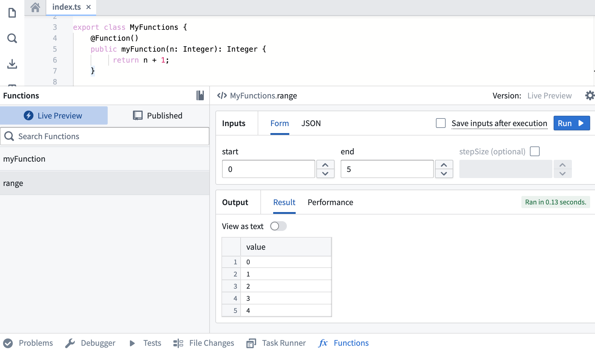
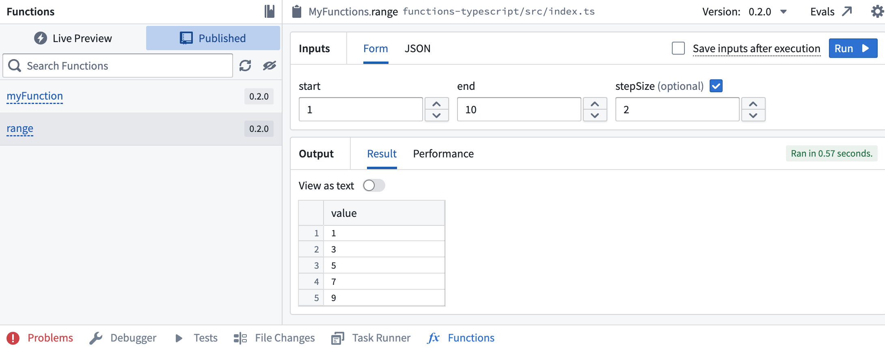

# [](#getting-started-with-typescript-v1-functions)Getting started with TypeScript v1 functions开始使用 TypeScript v1 函数


## [](#create-a-typescript-v1-functions-repository)Create a TypeScript v1 functions repository创建 TypeScript v1 函数存储库


Navigate to a project of your choice and create a new code repository by selecting **+ New > Repository**. Select the TypeScript functions template to initialize your repository.选择一个项目，通过选择+新建>存储库创建一个新的代码存储库。选择 TypeScript 函数模板以初始化您的存储库。


Once the repository is created, navigate to the `functions-typescript/src/index.ts` file.创建存储库后，导航到 functions-typescript/src/index.ts 文件。


## [](#write-a-function)Write a function编写一个函数


Functions in this repository must be defined within a TypeScript class, and that class must be exported from the `functions-typescript/src/index.ts` file. You can either write your function in the prepopulated examples in `index.ts`, or create a new file. If you create a new file, ensure that you export your class from `index.ts`.此存储库中的函数必须定义在 TypeScript 类中，并且该类必须从 functions-typescript/src/index.ts 文件导出。你可以将你的函数写在 index.ts 中的预填充示例中，或者创建一个新文件。如果你创建一个新文件，请确保你从 index.ts 导出你的类。


Below is a basic example:以下是一个基本示例：


TypeScript v1```
Copied!`1import { Function, Integer } from "@foundry/functions-api";
2
3export class ExampleFunctions {
4
5    @Function()
6    public addIntegers(a: Integer, b: Integer): Integer {
7         return a + b;
8    }
9}`
```


If the above code is written in a file called `exampleFunctions.ts`, it must be exported from the index file as shown below:如果上述代码写在名为 exampleFunctions.ts 的文件中，它必须按照以下方式从索引文件导出：


TypeScript v1```
Copied!`1// in functions-typescript/src/index.ts
2
3export * from "./relative/path/to/exampleFunctions";`
```


## [](#test-in-live-preview)Test in live preview在实时预览中测试


After you add the new function, you can run it in the functions helper. Open the **Functions** helper and select **Live Preview**. Choose the `range` function, enter input values, and select **Run** to run the code.添加新功能后，你可以在功能辅助工具中运行它。打开功能辅助工具并选择实时预览。选择 range 函数，输入输入值，然后选择运行来执行代码。





Select **Commit** in the upper right to commit your changes onto the `master` branch of your repository.在右上角选择“提交”以将您的更改提交到您的存储库的 master 分支。


## [](#publish-a-function)Publish a function发布一个函数


After committing your work, you will see the **Tag version** option. This will publish all of the functions in your repository.提交你的工作后，你会看到 Tag 版本选项。这将发布你仓库中的所有函数。


Select **Tag version** to tag a release off the `master` branch. Set the tag name based on the extent of your changes, then choose **Tag and release**.选择 Tag 版本以在 master 分支上标记一个发布。根据你更改的范围设置标签名称，然后选择 Tag 并发布。


To view the progress as your functions are tagged and released, select the **View** pop-up or navigate to the **Tags** tab. Once **Step 2: Release** is completed, select the published functions to view them in the function registry.要查看您的函数在标记和发布过程中的进度，请选择查看弹窗或导航至标签选项卡。当步骤 2：发布完成后，请选择已发布的函数，以在函数注册表中查看它们。


Functions may not be immediately searchable by name in Workshop or the function registry while permissions propagate.函数在权限传播期间可能无法通过名称在 Workshop 或函数注册表中立即搜索。


## [](#use-a-new-function)Use a new function使用新函数


After the checks for your tag have passed, navigate back to the **Code** tab in **Code Repositories** and select the **Functions** helper. You should now be able to see your new `range` function under the **Published** section. Select and run the function.在您的标签检查通过后，返回代码库中的代码选项卡，并选择函数辅助工具。现在您应该能够在已发布部分下看到您的新的 range 函数。选择并运行该函数。





### [](#next-steps)Next steps下一步


In this tutorial, you learned how to use Code Repositories to write, publish, and test a TypeScript v1 function from a repository. Next, we recommend learning how to author [functions on objects](/docs/foundry/functions/foo-getting-started/).在本教程中，您学习了如何使用代码库从代码库中编写、发布和测试 TypeScript v1 函数。接下来，我们建议您学习如何对对象编写函数。

