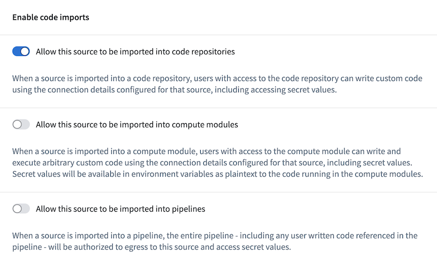
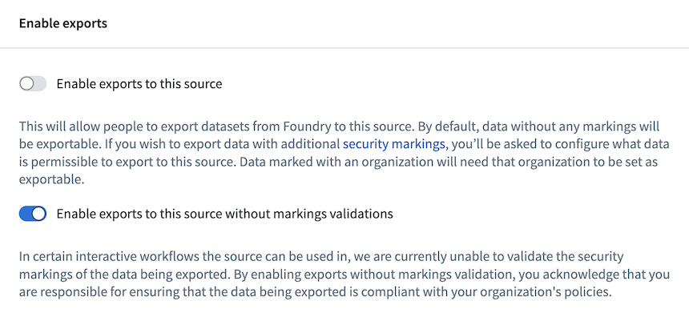
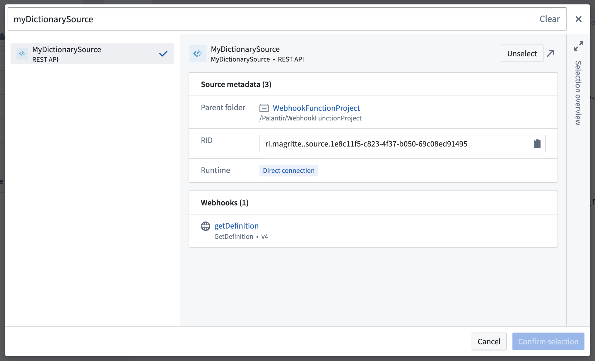
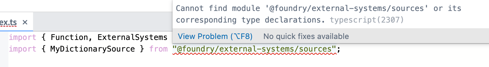
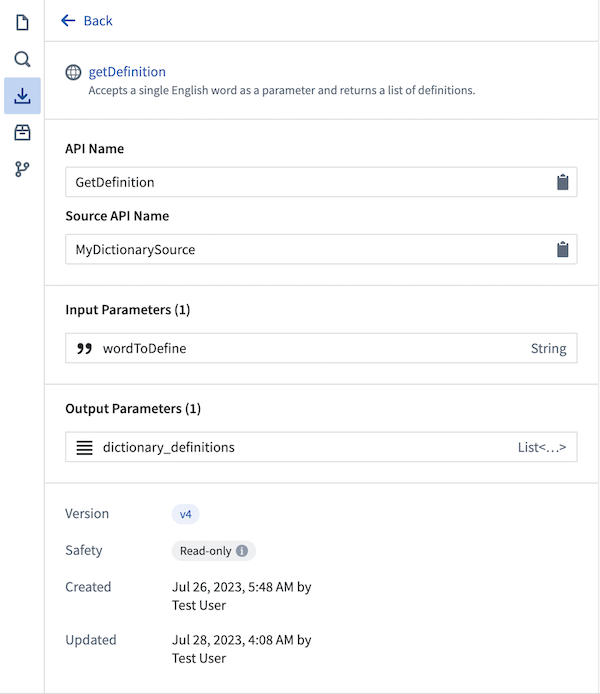

# [](#webhooks-in-functions)Webhooks in functions函数中的 Webhooks


This guide will walk you through setting up a function that can make requests to external systems using [webhooks](/docs/foundry/data-connection/webhooks-overview/).本指南将指导您如何设置一个可以通过 Webhooks 向外部系统发起请求的函数。


Prerequisites先决条件This guide assumes you have already created a Data Connection source and a webhook. For more information, see the [documentation how to create a data connection source and webhook](/docs/foundry/data-connection/external-functions/).本指南假定您已经创建了一个数据连接源和一个 Webhook。有关更多信息，请参阅如何创建数据连接源和 Webhook 的文档。


## [](#import-sources-into-a-functions-repository)Import sources into a functions repository将源导入函数仓库


Before following this guide, make sure you already created a functions repository and understand how to write and publish functions as described in [our tutorial](/docs/foundry/functions/getting-started/).在遵循本指南之前，请确保您已经创建了一个函数仓库，并了解如何按照我们的教程编写和发布函数。


You must first enable the source to be imported into Code Repositories. To do this, go to the **Enable code imports** menu for your REST API source and enable the option to allow the source to be imported into Code Repositories. Since it is not possible to perform exportable Marking validations in all workflows where functions are used, you must also enable exports to the source without Marking validations in the **Enable exports** menu for each source.您必须首先启用源以便导入到代码仓库中。为此，请转到您的 REST API 源的启用代码导入菜单，并启用允许源导入到代码仓库的选项。由于在所有使用函数的工作流中无法执行可导出的标记验证，您必须在每个源的启用导出菜单中启用导出到源而不进行标记验证。








Next, to use a webhook in functions, the backing REST API source of the webhook must first be imported into the repository. Select the [**Resource imports** left-side panel](/docs/foundry/functions/resource-imports-sidebar/) to view the sources imported into the repository. Select **Add > Sources** to display a search dialog where you may select the source you want to import. Only sources with API names may be imported through this dialog.接下来，要在函数中使用 webhook，首先必须将 webhook 的支撑 REST API 源导入仓库。选择资源导入左侧面板以查看已导入到仓库的源。选择添加 > 源以显示搜索对话框，您可以在其中选择要导入的源。只能通过此对话框导入具有 API 名称的源。





Source imports into Function repositories for webhook usage work differently than source imports to Python transforms repositories and compute modules. Function repositories that utilize a given source only for webhook usage will *not* be displayed in the list of repositories shown on the source overview. Any user with `Viewer` access to a source will be able to import and use those webhooks in external functions.源码导入到 Function 仓库用于 webhook 使用的工作方式与导入到 Python 转换仓库和计算模块的源码不同。仅用于 webhook 使用的 Function 仓库不会显示在源码概览中显示的仓库列表中。任何具有对源码 Viewer 访问权限的用户都将能够导入和使用这些 webhook 在外部函数中。


## [](#use-webhooks-in-functions)Use webhooks in functions在函数中使用 webhooks


Once you import the REST API source to the functions repository, it will be available in the TypeScript environment and accessible through the namespace of the source:一旦您将 REST API 源导入到函数仓库中，它将在 TypeScript 环境中可用，并通过源的命名空间进行访问：


```
Copied!`1import { Function } from "@foundry/functions-api";
2import { MyDictionarySource } from "@foundry/external-systems/sources";`
```


If you get the error `Cannot find module '@foundry/external-systems' or its corresponding type declarations.`, ensure the value for `enableExternalSystems` is set to `true` in the `functions-typescript/functions.json` file. Once you update it and commit the changes, the system should install the necessary packages, including `@foundry/external-systems`.如果你遇到 Cannot find module '@foundry/external-systems' or its corresponding type declarations. 错误，请确保在 functions-typescript/functions.json 文件中将 enableExternalSystems 的值设置为 true 。更新后提交更改，系统应该会安装必要的软件包，包括 @foundry/external-systems 。





### [](#example-make-multiple-calls-from-a-function)Example: Make multiple calls from a Function示例：从函数中发起多个调用


In the example below, we will explain how to make multiple calls to the dictionary API using a single Function.在下面的示例中，我们将解释如何使用单个函数调用字典 API 多次。


If your Function does not make any Ontology edits, you will create a `@Query()` function. If you would like to make Ontology edits, it would instead require the `@OntologyEditFunction` decorator. Learn more about making Ontology edits from functions in our [documentation](/docs/foundry/functions/api-ontology-edits/).如果你的函数不进行任何本体论编辑，你将创建一个 @Query() 函数。如果你希望进行本体论编辑，则需要使用 @OntologyEditFunction 装饰器。请查阅我们的文档，了解更多关于从函数进行本体论编辑的信息。


Using the standard [TypeScript async/await pattern ↗](https://www.typescriptlang.org/docs/handbook/release-notes/typescript-1-7.html#asyncawait-support-in-es6-targets-node-v4), multiple webhook calls can be made simultaneously from a Function. Check the success of calls using the `isOk` helper function exported from `@foundry/functions-api`.使用标准的 TypeScript 异步/等待模式 ↗，可以从函数中同时发出多个 webhook 调用。使用从 @foundry/functions-api 导出的 isOk 辅助函数检查调用的成功情况。


The following Function accepts a list of words as a TypeScript string array and makes one call for each word:以下函数接受一个 TypeScript 字符串数组作为单词列表，并为每个单词进行一次调用：


```
Copied!`1import { OntologyEditFunction, isOk } from "@foundry/functions-api";
2import { MyDictionarySource } from "@foundry/external-systems/sources";
3
4export class MyFunctions {
5
6    @OntologyEditFunction()
7    public async defineWords(words: string[]): Promise<void> {
8
9        const results = await Promise.all(words.map(word => MyDictionarySource.webhooks.GetDefinition.call({
10            wordToDefine: word
11        })));
12
13        results.forEach((result, i) => {
14            if (isOk(result)) {
15                const output = result.value.output;
16                output.dictionary_definitions.forEach(definitions_for_word => {
17                    definitions_for_word.meanings.forEach(meaning => {
18                        meaning.definitions.forEach(def_for_part_of_speech => {
19                            console.log(`Found a ${meaning.partOfSpeech} definition for "${words[i]}": ${def_for_part_of_speech.definition}`);
20                        })
21                    })
22                });
23            }
24        });
25    }
26}`
```


Log output for an input of `["tuba", "cool"]`:输入 ["tuba", "cool"] 的日志输出：


```
`LOG [2023-07-28T03:16:22.968Z] Found a noun definition for "tuba": A large brass musical instrument, usually in the bass range, played through a vibration of the lips upon the mouthpiece and fingering of the keys.
LOG [2023-07-28T03:16:22.968Z] Found a noun definition for "tuba": A type of Roman military trumpet, distinct from the modern tuba.
LOG [2023-07-28T03:16:22.968Z] Found a noun definition for "tuba": A large reed stop in organs.
LOG [2023-07-28T03:16:22.968Z] Found a noun definition for "tuba": A Malayan plant whose roots are a significant source of rotenone, Derris malaccensis.
LOG [2023-07-28T03:16:22.968Z] Found a noun definition for "tuba": A reddish palm wine made from coconut or nipa sap.
LOG [2023-07-28T03:16:22.968Z] Found a noun definition for "tuba": A tube or tubular organ.
LOG [2023-07-28T03:16:22.968Z] Found a noun definition for "cool": A moderate or refreshing state of cold; moderate temperature of the air between hot and cold; coolness.
LOG [2023-07-28T03:16:22.968Z] Found a noun definition for "cool": A calm temperament.
`
```


## [](#error-handling)Error handling错误处理


To help mitigate failures when working with a networked system, functions expose errors propagated from webhooks using Result objects, which give information about the kind of error that occurred:为了帮助在网络化系统中工作时减轻故障，函数通过使用 Result 对象暴露从 webhooks 传播的错误，这些对象提供了关于发生错误类型的信息：


```
Copied!`1import { OntologyEditFunction, isOk } from "@foundry/functions-api";
2import { MyDictionarySource } from "@foundry/external-systems/sources";
3
4export class MyFunctions {
5
6    @OntologyEditFunction()
7    public async defineWords(words: string[]): Promise<void> {
8
9        const results = await Promise.all(words.map(word => MyDictionarySource.webhooks.GetDefinition.call({
10            wordToDefine: word
11        })));
12
13        results.forEach((result, i) => {
14            if (isOk(result)) {
15                // Extract the response
16            } else {
17                const errorName = result.error.name;
18
19                if (errorName === "WebhookExecutionFailedToStart") {
20                    console.log("We were unable to initiate a request to the dictionary API.");
21                } else if (errorName === "ParsingResponseFailed") {
22                    console.log("The external request succeeded, but the response couldn't be parsed.");
23                } else {
24                    console.log("Something went wrong.");
25                }
26            }
27        });
28    }
29}`
```


When handling errors, authored code should listen for specific names and react accordingly. Functions currently return the following errors:在处理错误时，编写的代码应当监听特定的名称并作出相应反应。当前函数返回以下错误：


| Error错误 | Description描述 |
| --- | --- |
| `WebhookExecutionFailedToStart` | The webhook failed to start. If this error is returned, it can be safely assumed that no request was made to the external system.webhook 启动失败。如果返回此错误，可以安全地假设没有向外部系统发起请求。 |
| `WebhookExecutionTimedOut` | The webhook execution began, but no response was received from the external system within the configured webhook time limit.webhook 开始执行，但在配置的 webhook 时间限制内未从外部系统收到响应。 |
| `RemoteRestApiReturnedError` | The external system returned an error. Only returned for webhooks configured on a REST API source.外部系统返回了错误。仅在 REST API 源上配置的 webhooks 才会返回此错误。 |
| `RemoteApiReturnedError` | The external system returned an error. Only returned for webhooks configured on a non-REST API source.外部系统返回了错误。仅在非 REST API 源上配置的 webhooks 才会返回此错误。 |
| `ParsingResponseFailed` | The webhook execution was successful, but the response from the external system could not be successfully parsed. This can happen if, for example, the response from the external system did not contain an expected field. Since the result of a webhook call will not necessarily be used, it is up to the application builder whether this should marked as a failure to end users.webhooks 执行成功，但外部系统的响应无法成功解析。例如，如果外部系统的响应不包含预期字段，就可能会发生这种情况。由于 webhooks 调用的结果不一定会被使用，因此是否应将其标记为对最终用户的失败，取决于应用程序构建者。 |
| `ServerError` | An internal problem occurred within the webhooks service or the connector.webhooks 服务或连接器内部发生了内部问题。 |
| `UnknownError` | An error occurred which could not be directly attributed to any Foundry service.出现了一个无法直接归因于任何 Foundry 服务的错误。 |


This list of error types may change; users should structure their code to include a default case in the event that the Function executor returns an error with a new name.此错误类型列表可能会发生变化；用户应在其代码中包含默认情况，以防 Function executor 返回一个具有新名称的错误。


### [](#example-handle-errors-when-making-multiple-webhook-calls-from-a-single-function)Example: Handle errors when making multiple webhook calls from a single Function示例：处理从单个 Function 发起的多个 webhook 调用时的错误


The following code describes how to handle multiple webhook calls where some succeed and some fail within the same function. In our example, a `RemoteRestApiReturnedError` is returned in the event that the dictionary server cannot find the definition for a given word.以下代码描述了如何在同一个函数中处理多个 webhook 调用，其中一些调用成功而另一些调用失败。在我们的示例中，如果字典服务器无法为给定单词找到定义，将返回 RemoteRestApiReturnedError 。


```
Copied!`1import { OntologyEditFunction, isOk } from "@foundry/functions-api";
2import { MyDictionarySource } from "@foundry/external-systems/sources";
3
4export class MyFunctions {
5
6    @OntologyEditFunction()
7    public async defineWords(words: string[]): Promise<void> {
8
9        const results = await Promise.all(words.map(word => MyDictionarySource.webhooks.GetDefinition.call({
10            wordToDefine: word
11        })));
12
13        results.forEach((result, i) => {
14            if (isOk(result)) {
15                const output = result.value.output;
16                output.dictionary_definitions.forEach(definitions_for_word => {
17                    definitions_for_word.meanings.forEach(meaning => {
18                        meaning.definitions.forEach(def_for_part_of_speech => {
19                            console.log(`Found a ${meaning.partOfSpeech} definition for "${words[i]}": ${def_for_part_of_speech.definition}`);
20                        })
21                    })
22                });
23            } else {
24                if (result.error.name === "RemoteRestApiReturnedError") {
25                    console.log(`ERROR: ${words[i]} could not be defined`, result.error.message);
26                }
27            }
28        });
29    }
30}`
```


Inputting `["asdf", "shire"]` to the above Function returns the following result:将 ["asdf", "shire"] 输入到上述函数中，返回以下结果：


```
`LOG [2023-07-28T15:38:47.263Z] ERROR: asdf could not be defined Request returned an unsuccessful response code: 404 Response body: {"title":"No Definitions Found","message":"Sorry pal, we couldn't find definitions for the word you were looking for.","resolution":"You can try the search again at later time or head to the web instead."}
LOG [2023-07-28T15:38:47.264Z] Found a noun definition for "shire": Physical area administered by a sheriff.
LOG [2023-07-28T15:38:47.264Z] Found a noun definition for "shire": Former administrative area of Britain; a county.
LOG [2023-07-28T15:38:47.264Z] Found a noun definition for "shire": The general area in which a person lives or comes from, used in the context of travel within the United Kingdom.
LOG [2023-07-28T15:38:47.264Z] Found a noun definition for "shire": A rural or outer suburban local government area of Australia.
LOG [2023-07-28T15:38:47.264Z] Found a noun definition for "shire": A shire horse.
LOG [2023-07-28T15:38:47.264Z] Found a verb definition for "shire": To (re)constitute as one or more shires or counties.
`
```


## [](#limitations)Limitations限制


Currently, there are no limits to the number of requests that can be made from within an Ontology edit function, but existing [functions resource limits](/docs/foundry/functions/manage-functions/#enforced-limits) still apply. [Webhook limits](/docs/foundry/data-connection/webhooks-reference/#limits) are also enforced.目前，从本体编辑函数中可以发起的无请求数量没有限制，但现有的函数资源限制仍然适用。Webhook 限制也生效。


Functions currently support webhooks with the following input and output types:目前，函数支持具有以下输入和输出类型的 Webhook：


- Attachments附件
- Booleans布尔值
- Integers整数
- Longs长整型
- Doubles双精度浮点数
- Strings字符串
- Optionals可选值
- Dates日期
- Timestamps时间戳
- Lists列表
- Enums (list of allowed String type values)枚举（允许的 String 类型值列表）
- Records with and without expected fields带有预期字段和不带预期字段的记录


When calling webhooks from a `@Query` function, the webhook must perform only `Read API` calls that do not mutate the external system. Query functions are frequently retried or silently executed on pageload, and thus do not provide the same level of structured deliberate execution that is possible with an `@OntologyEditFunction`. When configuring a webhook, you can specify whether it is safe to execute from a Query function by using the option for `Read API` or `Write API`.当从 @Query 函数调用 webhooks 时，webhooks 必须仅执行 Read API 调用，这些调用不会改变外部系统。查询函数经常被重试或在页面加载时静默执行，因此它们不提供与 @OntologyEditFunction 相同的结构化有意执行的级别。在配置 webhook 时，您可以通过使用 Read API 或 Write API 的选项来指定从查询函数执行是否安全。


### [](#unsupported-webhook-features)Unsupported webhook features不支持的 webhook 功能


- Webhooks that use the `OR` type as an input or output parameter are currently not supported. No code will be generated for those webhooks.当前不支持将 OR 类型用作输入或输出参数的 webhook。这些 webhook 不会生成任何代码。
- Webhooks configured with REST API sources that use interactive OAuth through [Outbound Applications](/docs/foundry/administration/configure-outbound-applications/) are currently not supported.当前不支持使用 Outbound Applications 通过交互式 OAuth 配置的 REST API 源 webhook。


## [](#handle-version-changes-in-functions-and-webhooks)Handle version changes in functions and webhooks处理函数和 webhook 的版本变更


Functions and webhooks have versions, and callers may invoke any version of a Function or webhook. When a Function is published, the most recent webhook version available at that time will be pinned to it.函数和 webhooks 都有版本，调用者可以调用任何版本的函数或 webhooks。当函数发布时，当时可用的最新 webhooks 版本会被固定到该函数上。


When a functions repository is opened in the [Code Repositories](/docs/foundry/code-repositories/overview/) application, the generated code bindings used for autocomplete will always use the most recent version of the webhook. This webhook version is displayed in the **Resource imports** side panel to the left.当在代码库应用中打开函数仓库时，用于自动补全生成的代码绑定将始终使用最新版本的 webhooks。这个 webhooks 版本显示在左侧的资源导入侧面板中。





Make sure your webhook is stable before publishing functions that rely on its functionality.在发布依赖其功能的函数之前，请确保您的 webhook 是稳定的。


Remember to republish the Function and bump users to new versions when changes are made to the webhook or Function. Previously published, pinned versions of the Function will still be available for use.记得在修改 webhook 或 Function 时重新发布并升级用户到新版本。先前发布并固定版本的 Function 仍然可以继续使用。


## [](#permissions)Permissions权限


The following table summarizes the permissions that are required to author, publish, and consume external functions.下表总结了创建、发布和使用外部 Function 所需的权限。


| Action操作 | User用户 | Permission required权限要求 |
| --- | --- | --- |
| Import webhook to a functions repository将 webhook 导入到函数仓库 | Function editor函数编辑器 | `webhooks:editor` on the webhook, which is granted to the **Editor** default role.webhooks:editor 在 webhook 上，这被授予编辑器默认角色。 |
| Publish Function invoking a webhook发布功能调用 webhook | Function editor功能编辑器 | `webhooks:execute` permission on the source, which is only granted to **Owner** and **Editor** default roles.webhooks:execute 对源权限，仅授予 Owner 和 Editor 默认角色。 |
| Configure an Action to use an `@OntologyEditFunction()` that calls webhooks配置一个 Action 使用 @OntologyEditFunction() 调用 webhooks | Action editor动作编辑器 | `webhooks:grant-action-validated-execution` permission on the webhook and `Viewer` permission on the Functionwebhooks:grant-action-validated-execution webhook 权限和 Viewer 函数权限 |
| Execute a `@Query()` webhook from Workshop从 Workshop 执行 @Query() webhook | End user最终用户 | `webhooks:execute` permission on the source, which is only granted to `Owner` and `Editor` default roles.webhooks:execute 对源的权限，仅授予给 Owner 和 Editor 默认角色。 |
| Execute an `@OntologyEditFunction()` from an Action从一个 Action 执行一个 @OntologyEditFunction() | End user最终用户 | The user must meet the [submission criteria](/docs/foundry/action-types/submission-criteria/) for the Action. No permissions on the source, webhook, or Function are checked in this case. Users creating and managing Actions must ensure that submission criteria are configured appropriately.在这种情况下，用户必须满足操作的提交标准。不检查源、webhook 或 Function 的权限。创建和管理操作的用户必须确保提交标准配置得当。 |


## [](#monitoring-troubleshooting-and-debugging)Monitoring, troubleshooting, and debugging监控、故障排除和调试


Use the following platform tools to gain more insight into webhook executions from functions:使用以下平台工具来深入了解函数的 webhook 执行情况：


- [Webhook execution history](/docs/foundry/data-connection/webhooks-reference/#webhook-history), which is available in the **History** tab when viewing a single webhook in [Data Connection](/docs/foundry/data-connection/overview/).在数据连接中查看单个 webhook 时，可在历史记录选项卡中查看 webhook 执行历史。
- The Function usage history, available in [Ontology Manager](/docs/foundry/ontology-manager/overview/), shows a history of when functions were executed including the inputs, outputs, and user that triggered the Function.函数使用历史记录，可在本体管理器中查看，显示函数执行的历史记录，包括输入、输出和触发函数的用户。
- [Code authoring preview for functions](/docs/foundry/functions/foo-getting-started/#test-in-live-preview), which provides performance profiling, debug output, and more.函数代码编写预览，提供性能分析、调试输出等功能。


## [](#best-practices)Best practices最佳实践


We recommend the following best practices when using external sources to call webhooks from functions:在使用外部源从函数调用 webhooks 时，我们建议遵循以下最佳实践：


- Thoroughly test webhooks with the [test webhook side panel](/docs/foundry/data-connection/webhooks-setup/#test-the-webhook) in Data Connection before attempting to use those webhooks in functions.在使用这些 webhooks 之前，请通过 Data Connection 中的测试 webhooks 侧面板彻底测试 webhooks。
- Use webhook input and output `record` type parameters with expected fields, if possible. Using explicit types, rather than JSON, means that Function code is less likely to throw unexpected runtime errors.如果可能，使用带有预期字段的 webhook 输入和输出 record 类型参数。使用显式类型而不是 JSON 意味着 Function 代码不太可能抛出意外的运行时错误。
- Use the `isOk` and `isErr` built-in functions exported from `@foundry/functions-api` to check for success and error states, and narrow down the type of error through the name field.使用从 @foundry/functions-api 导出的 isOk 和 isErr 内置函数来检查成功和错误状态，并通过名称字段缩小错误类型。
- If users will be writing to both an external system and the Ontology from a single Function call, remember that the write to the Ontology could fail, even if the write to the external system succeeds. Be sure that measures are in place to deal with such inconsistencies, and grant users visibility into the state of their modification to both systems if needed.如果用户将从单个 Function 调用中同时写入外部系统和本体，请记住，即使写入外部系统成功，写入本体也可能失败。确保已采取措施处理此类不一致性，并在需要时让用户了解他们对两个系统的修改状态。

