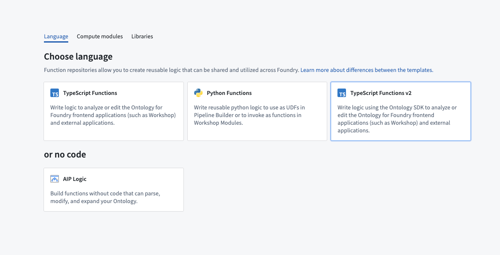
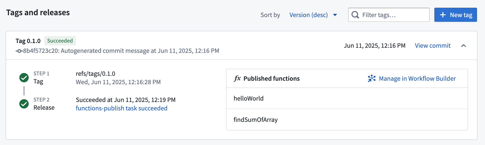
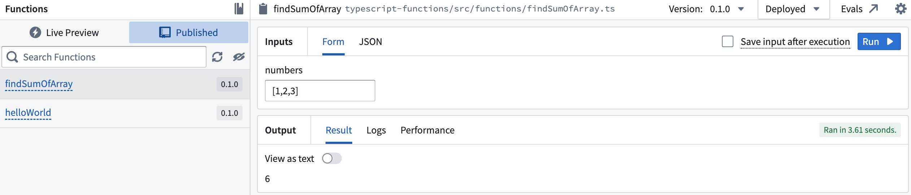

# [](#getting-started-with-typescript-v2-functions)Getting started with TypeScript v2 functions开始使用 TypeScript v2 函数


TypeScript v2 allows users to take advantage of several key [improvements over TypeScript v1](/docs/foundry/functions/language-feature-support/#typescript-v1-vs-typescript-v2), including a Node.js runtime and first-class OSDK support. Review the sections below to get started.TypeScript v2 允许用户利用比 TypeScript v1 的几个关键改进，包括 Node.js 运行时和一流的 OSDK 支持。请查看以下部分开始使用。


## [](#create-a-typescript-v2-functions-repository)Create a TypeScript v2 functions repository创建 TypeScript v2 函数存储库


Navigate to a project of your choice and create a new code repository by selecting **+ New > Repository**. Select the TypeScript v2 functions template to initialize your repository.导航到您选择的项目，通过选择+新建>存储库创建新的代码存储库。选择 TypeScript v2 函数模板以初始化您的存储库。





Once the repository has been created, navigate to the `typescript-functions/src/functions/helloWorld.ts` file.一旦创建好仓库，请导航到 typescript-functions/src/functions/helloWorld.ts 文件。


## [](#write-a-function)Write a function编写一个函数


To write a new function, create a new file in the `typescript-functions/src/functions` directory of your repository and give it a descriptive name, for example, `helloWorld.ts`. Write your function using `export default` for Foundry to detect it.要编写新函数，请在仓库的 typescript-functions/src/functions 目录下创建一个新文件，并给它一个描述性的名称，例如 helloWorld.ts 。使用 export default 让 Foundry 能够检测到你的函数。


TypeScript v2```
Copied!`1export default function helloWorld(): string {
2    return "Hello World!";
3}`
```


You must satisfy the following conditions for your function to be published to Foundry:为了让你的函数发布到 Foundry，你必须满足以下条件：


1. Define your function in a `.ts` file in the `typescript-functions/src/functions` directory. In this directory, you can also group related functions in subdirectories.在 typescript-functions/src/functions 目录下的 .ts 文件中定义你的函数。在这个目录中，你还可以将相关的函数分组到子目录中。
2. The name of your file must match the name of your function. For a function called `myFunction` to be published, it must be defined in a file called `myFunction.ts` within the `typescript-functions/src/functions` directory.你的文件名必须与你的函数名匹配。要发布名为 myFunction 的函数，它必须在 typescript-functions/src/functions 目录下名为 myFunction.ts 的文件中定义。
3. The TypeScript function must be the default export of your file.TypeScript 函数必须是你的文件的默认导出。
4. Your function's input and output types must follow the supported function types, as detailed in the [type reference](/docs/foundry/functions/types-reference/).你的函数的输入和输出类型必须遵循支持的函数类型，具体请参考类型参考。


Your function's file path is used to uniquely identify the function that gets published from it. Note that a change in your function's file path will therefore result in a new function being published.你的函数的文件路径用于唯一标识从该文件发布的函数。请注意，因此你的函数的文件路径发生更改将导致发布新的函数。


## [](#test-in-live-preview)Test in live preview在实时预览中测试


To test your function in live preview, open the **Functions** helper and select **Live preview**. Choose your function and select **Run** to execute.要在实时预览中测试您的函数，请打开函数助手并选择实时预览。选择您的函数，然后选择运行以执行。


## [](#commit-and-publish-a-function)Commit and publish a function提交并发布一个函数


Select **Commit** at the upper right corner of the window to commit your changes to the `master` branch of your repository. To view your function's checks, open the **Checks** tab at the top of the page. Here, after making a commit, you should see a running check.在窗口右上角选择"提交"以将您的更改提交到您的存储库的 master 分支。要查看您的函数的检查结果，请打开页面顶部的"检查"选项卡。在这里，提交后您应该会看到一个正在运行的检查。


After committing your work, you will see the **Tag version** option. This will publish all of the functions in your repository.提交工作后，您将看到"标签版本"选项。这将发布您存储库中的所有函数。


Select **Tag version** to tag a release off of the `master` branch. Set the tag name based on the extent of your changes, and then select **Tag and release**.选择标签版本以从 master 分支标记发布。根据您更改的范围设置标签名称，然后选择标记和发布。


To view the progress as your functions are tagged and released, select the **View** pop-up or navigate to the **Tags** tab. Once **Step 2: Release** is completed, select the published functions to view them in the function registry.要查看您的函数在标记和发布过程中的进度，请选择查看弹窗或导航至标签选项卡。当步骤 2：发布完成后，请选择已发布的函数，以在函数注册表中查看它们。


Functions may not be immediately searchable by name in Workshop or the function registry while permissions propagate.函数在权限传播期间可能无法通过名称在 Workshop 或函数注册表中立即搜索。





## [](#use-a-new-function)Use a new function使用新函数


After the checks for your tag have passed, navigate back to the **Code** tab in **Code Repositories** and select the **Functions** helper. You should now be able to see your functions under the **Published** section. Select it and run the new function:在您的标签检查通过后，返回代码库中的代码标签页，并选择函数辅助工具。现在您应该能在已发布部分看到您的函数。选择它并运行新的函数：




