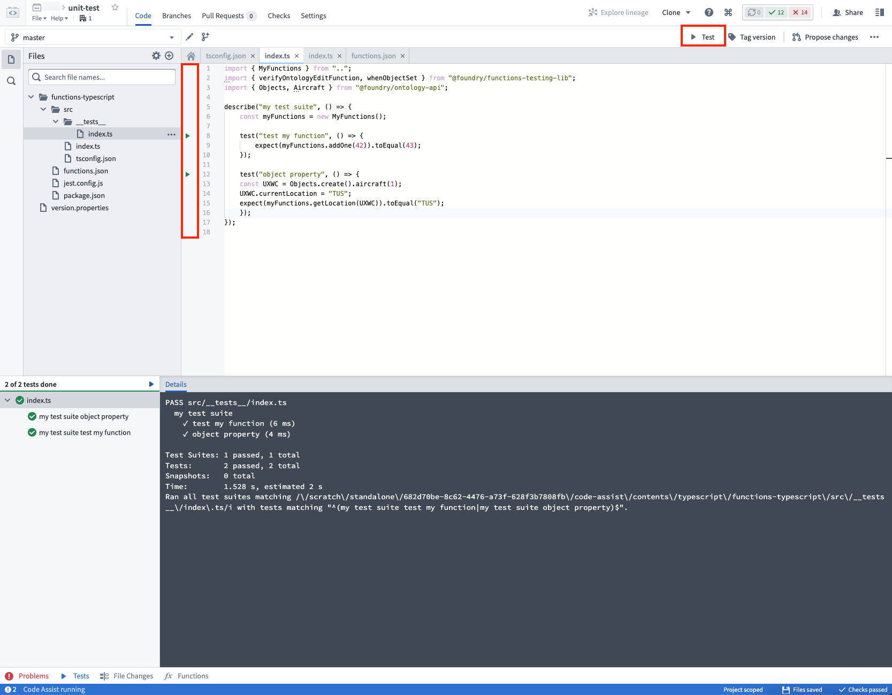

# [](#getting-started)Getting started开始使用


Functions ships with support for [Jest ↗](https://jestjs.io/) unit tests. Follow the steps in this guide to get unit testing tools set up for your repository.函数自带对 Jest ↗ 单元测试的支持。按照本指南中的步骤，为您的仓库设置单元测试工具。


By default, functions includes a unit test located in the test file `functions-typescript/src/__tests__/index.ts`. You can create test files anywhere in the `__tests__` folder.默认情况下，函数包含一个位于 test 文件夹 functions-typescript/src/__tests__/index.ts 中的单元测试。您可以在 __tests__ 文件夹中的任何位置创建测试文件。


## [](#example)Example示例


For example, we may want to test the following function `addOne` in `functions-typescript/src/index.ts`:例如，我们可能想要在 functions-typescript/src/index.ts 中测试以下函数 addOne 。


```
Copied!`1import { Function, Integer } from "@foundry/functions-api";
2
3export class MyFunctions {
4
5    @Function()
6    public addOne(n: Integer): Integer {
7         return n + 1;
8    }
9}`
```


We can test the function `addOne` by writing the following test `test add one`:我们可以通过编写以下测试 test add one 来测试函数 addOne :


```
Copied!`1import { MyFunctions } from ".."
2
3describe("example test suite", () => {
4    const myFunctions = new MyFunctions();
5    test("test add one", () => {
6        expect(myFunctions.addOne(42)).toEqual(43);
7    });
8});`
```


Refer to the [Jest API ↗](https://jestjs.io/docs/en/api) for details about the full testing API available to you.有关可用的完整测试 API 的详细信息，请参阅 Jest API ↗。


## [](#running-tests)Running tests运行测试


You can run all your tests by clicking on the `Test` button located on the top right, or run each individual test by clicking on the triangular "Play" button located beside the line number for each test.您可以通过点击位于右上角的 Test 按钮来运行所有测试，或通过点击每个测试行号旁边的三角形"播放"按钮来运行每个单独的测试。





When you click **Commit**, all tests will also run in Checks:当你点击提交时，所有测试也将在检查中运行：


## [](#next-steps)Next steps下一步


Next, learn about the range of options available for testing functions that interact with the Ontology:接下来，了解与本体交互的函数测试可用的选项范围：


- [Create stub objects创建存根对象](/docs/foundry/functions/unit-test-stub-objects/)
- [Verify Ontology edits验证本体编辑](/docs/foundry/functions/unit-test-ontology-edits/)
- [Stub Object searches and aggregationsStub 对象搜索和聚合](/docs/foundry/functions/unit-test-object-searches/)

