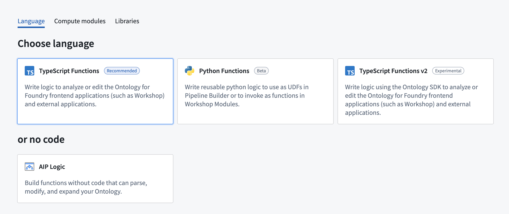
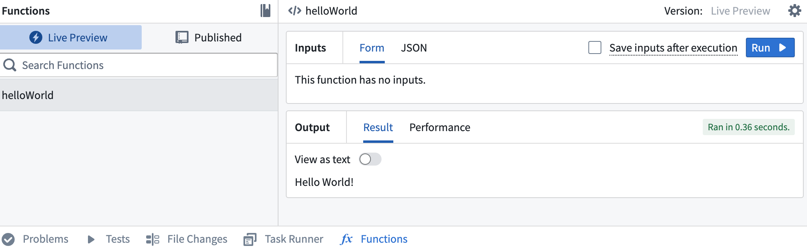
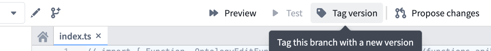
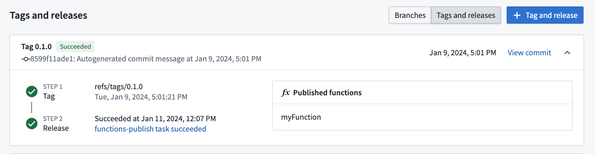
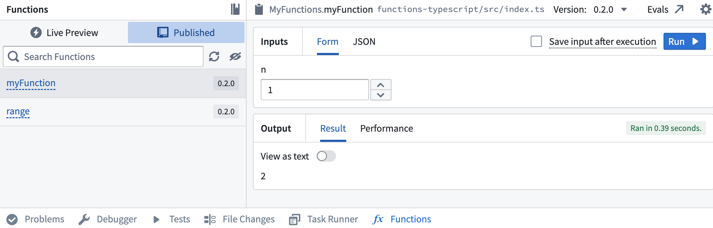

# Getting started with functions开始使用函数

There are three language options for getting started with functions in Foundry; TypeScript v1, TypeScript v2, and Python. For more information on supported features for each language, review the [language feature support](/docs/foundry/functions/language-feature-support/) specifications.在 Foundry 中开始使用函数有三种语言选项：TypeScript v1、TypeScript v2 和 Python。有关每种语言支持的功能的更多信息，请查看语言功能支持规范。

Although each language has a different set of supported features, you will be able to access the same basic platform functionality for each language, including running, testing, and publishing functions. This page provides an overview of these features to help you understand how to use functions repositories, regardless of which language you will be working with.尽管每种语言支持的功能集不同，但您将能够访问每种语言的基本平台功能，包括运行、测试和发布函数。本页面概述了这些功能，以帮助您了解如何使用函数存储库，无论您将使用哪种语言。

For more detailed instructions on getting started with a specific language, refer to the tutorials below:有关开始使用特定语言的更详细说明，请参阅以下教程。

- [Getting started with TypeScript v1 functions使用 TypeScript v1 函数入门](/docs/foundry/functions/typescript-v1-getting-started/)
- [Getting started with TypeScript v2 functions开始使用 TypeScript v2 函数](/docs/foundry/functions/typescript-v2-getting-started/)
- [Getting started with Python functions开始使用 Python 函数](/docs/foundry/functions/python-getting-started/)

Review the sections below for general information on functions repository creation and usage.查看下方各部分以获取有关函数库创建和使用的常规信息。

## Create a functions repository创建函数库

When creating a functions repository, you will be able to choose the language that best suits your needs. You can initialize functions repositories directly from a project of your choice by selecting **+ New > Repository**, or from the Code Repositories application by selecting **+ New repository** in the top right. Once the repository has been initialized, you can add and run functions.在创建函数库时，您可以选择最适合您需求的编程语言。您可以通过选择“+” > “库”直接从您选择的项目中初始化函数库，或通过在右上角选择“+” > “新建库”从代码库应用程序中初始化。初始化库后，您可以添加和运行函数。

For detailed instructions on how to create a functions repository for a specific language, refer to the tutorial sections below:有关如何为特定语言创建函数库的详细说明，请参阅下方的教程部分。

- [Create a TypeScript v1 functions repository创建 TypeScript v1 函数仓库](/docs/foundry/functions/typescript-v1-getting-started/#create-a-typescript-v1-functions-repository)
- [Create a TypeScript v2 functions repository创建 TypeScript v2 函数仓库](/docs/foundry/functions/typescript-v2-getting-started/#create-a-typescript-v2-functions-repository)
- [Create a Python functions repository创建 Python 函数仓库](/docs/foundry/functions/python-getting-started/#create-a-python-functions-repository)

## Test in live preview在实时预览中测试

The functions live preview allows you to test your functions before committing them to your repository. You can run a function in live preview after adding it to your repository. To do so, open **Functions** on the bottom toolbar and select **Live Preview**. Choose a function, enter input values, and select **Run** to run the function.函数实时预览功能允许您在将函数提交到仓库之前进行测试。您可以将函数添加到仓库后，在实时预览中运行它。为此，请在底部工具栏中打开“函数”并选择“实时预览”。选择一个函数，输入输入值，然后选择“运行”来运行该函数。

Live preview runs in a different runtime environment than published functions. Differences include CPU resources, available memory, and how long a function can run before timing out. 实时预览在不同的运行时环境中运行，与已发布的函数不同。差异包括 CPU 资源、可用内存以及函数在超时前可以运行多长时间。

[Manage the runtime environment for published functions.管理已发布函数的运行时环境。](/docs/foundry/functions/manage-functions/)

Select **Commit** in the upper right to commit your changes to the `master` branch of your repository.在右上角选择“提交”将您的更改提交到您的仓库的 master 分支。

## Publish your functions发布你的函数

Once you commit your work, you will see the option to **Tag version**. This will publish all of the functions in your repository to the functions registry, [making them accessible across the platform](/docs/foundry/functions/use-functions/).一旦你提交工作，你会看到"标记版本"的选项。这将发布你仓库中的所有函数到函数注册中心，使它们在整个平台中可用。

Select **Tag version** to tag a release off of the `master` branch. Set the tag name based on the extent of your changes, then choose **Tag and release**.选择标签版本以从 master 分支标记发布。根据您更改的范围设置标签名称，然后选择标记并发布。

To view progress as your functions are tagged and released, select the **View** pop-up or navigate to the **Tags** tab. Once **Step 2: Release** is completed, select the published functions to view them in the functions registry.要查看您的函数在标记和发布过程中的进度，请选择查看弹窗或导航至标签选项卡。当步骤 2：发布完成后，选择已发布的函数，即可在函数注册表中查看它们。

Functions may not be immediately searchable by name in Workshop or the functions registry while permissions propagate.在权限传播期间，函数可能无法在 Workshop 或函数注册表中通过名称立即搜索。

## Run your function运行你的函数

After the checks for your tag have passed, navigate back to the **Code** tab in Code Repositories and select **Functions** from the bottom toolbar. You should see your new function under the **Published** section. Select it, and try running the new function:在您的标签检查通过后，返回代码库中的代码选项卡，并从底部工具栏中选择函数。您应该能在已发布部分看到您的新函数。选择它，并尝试运行新函数：

[Learn more about leveraging functions across the platform.了解更多关于在平台中利用函数的信息。](/docs/foundry/functions/use-functions/)

