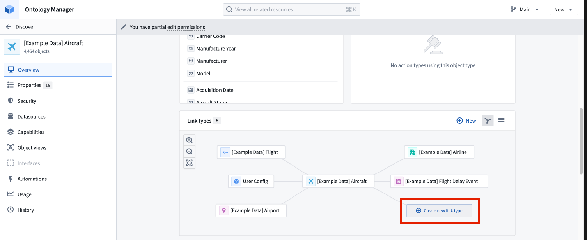
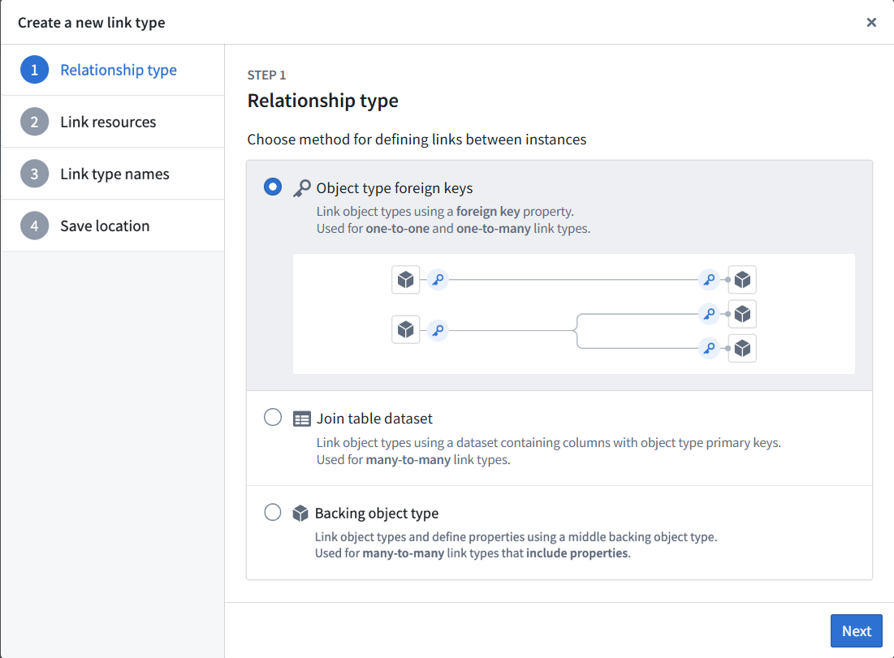
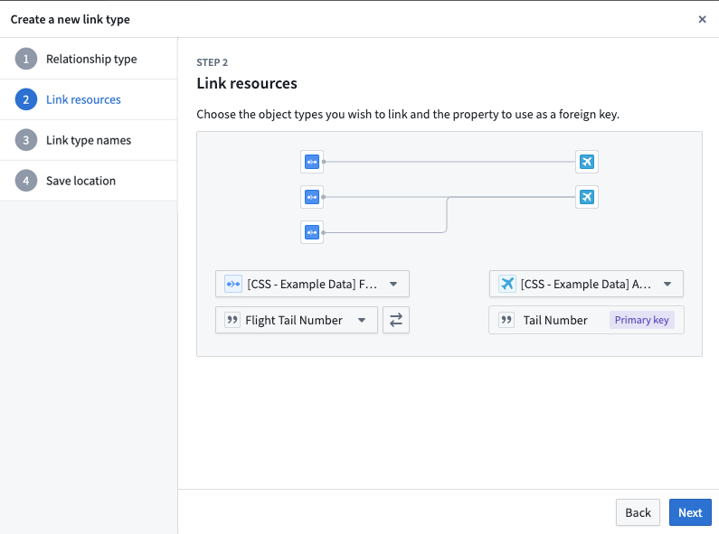
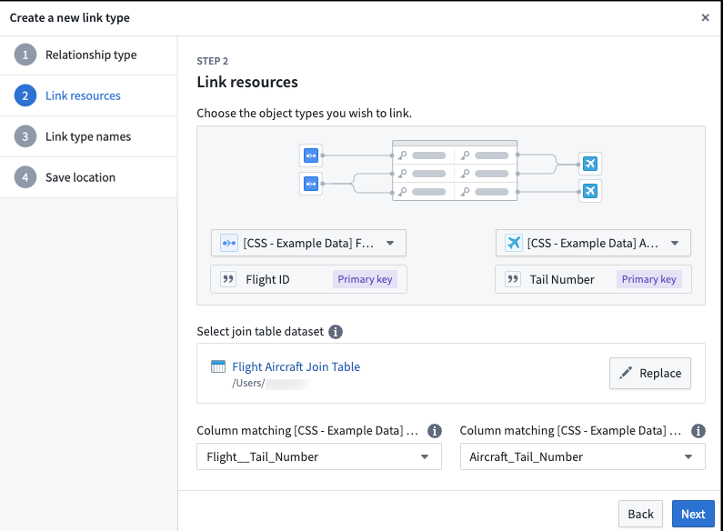
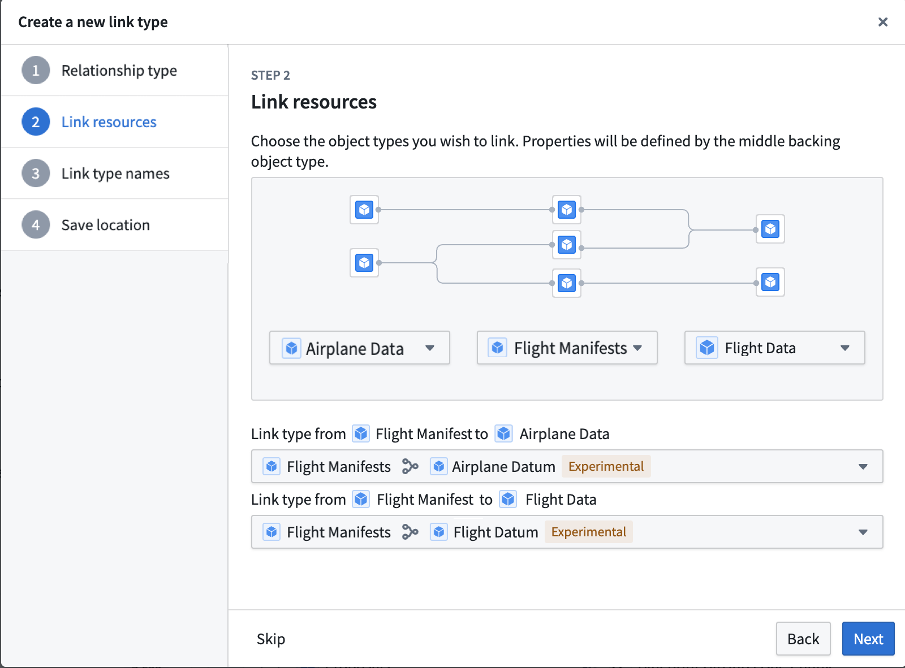
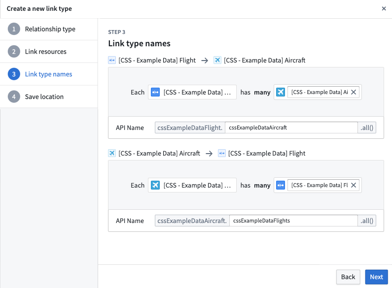
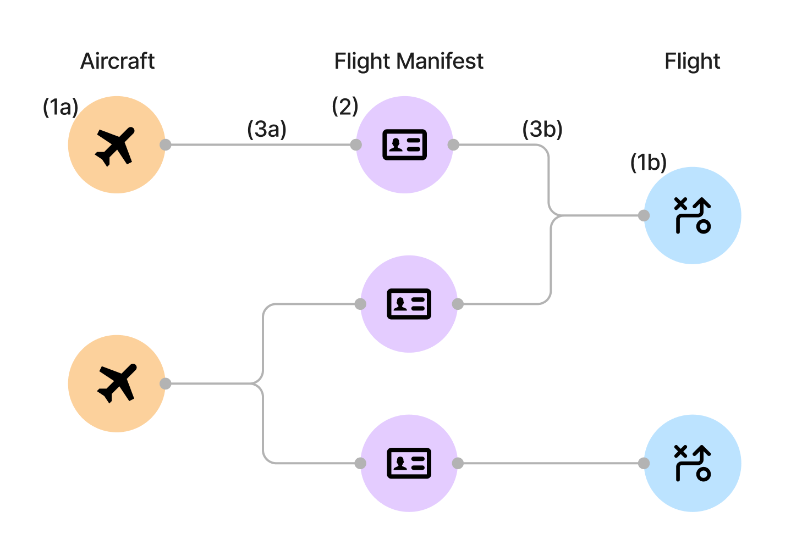

# Create a link type创建链接类型

We recommend creating and configuring a new link type with the guided helper outlined below. However, if you exit the helper before completing the object creation process, you can manually complete the process by specifying the link type, keys, and API names for the new link type.我们建议使用下面指导的帮助工具创建并配置新的链接类型。不过，如果你在完成对象创建过程前退出助手，可以通过指定新链接类型的链接类型、键和 API 名称来手动完成该过程。

## Access the link type creation helper访问链接类型创建助手

Navigate to Ontology Manager. To access the link type creation helper, choose one of the following methods:进入 Ontology Manager。要访问链接类型创建助手，请选择以下方法之一：

- Select **New** from the top right corner, then select **Link type**. 从右上角选择 “新建 ”，然后选择链接类型 。

 
- In the left sidebar, select **Link types** under **Resources**. Then, select **New link type** in the top right corner of the **Link types** page.在左侧边栏，选择资源下的链接类型 。然后，在链接类型页面右上角选择 “新链接类型 ”。
- Navigate to an object type you want to link, then select **Create new link type** from within the link type graph on the object type’s **Overview** page. 导航到你想链接的对象类型，然后在该对象类型的概览页面的链接类型图中选择创建新链接类型 。

## Configure a new link type配置新的链路类型

The new link type helper will guide you through the following steps:新的链接类型帮助工具将引导你完成以下步骤：

- [Choose the relationship type选择关系类型](#choose-the-relationship-type)
- [Define link resources定义链路资源](#define-link-resources)
- [Foreign key relationship type外键关系类型](#foreign-key-relationship-type)
- [Join table dataset relationship type连接表数据集关系类型](#join-table-dataset-relationship-type)
- [Backing object relationship type支持对象关系类型](#backing-object-relationship-type)
  - [Foreign key relationship type外键关系类型](#foreign-key-relationship-type)
  - [Join table dataset relationship type连接表数据集关系类型](#join-table-dataset-relationship-type)
  - [Backing object relationship type支持对象关系类型](#backing-object-relationship-type)
  
  - [Define link type names定义链路类型名称](#define-link-type-names)
- [Save location保存位置](#save-location)
- [Save change to ontology向本体的保存更改](#save-change-to-ontology)

### Choose the relationship type选择关系类型

1. In the first step of the **Create a new link type** dialog, select the relationship type for the link.在 “创建新链接类型 ”对话框的第一步，选择链接的关系类型。
2. Choose the relationship type for defining links between your two objects:选择定义两个对象之间链接的关系类型：

- **Object type foreign keys:** Supports "one-to-one" and "many-to-one" cardinality link types. This option allows you to select properties that represent the foreign key and corresponding primary key for the desired objects. See [below for details](#foreign-key-relationship-type) in defining link resources with a foreign key.对象类型外键： 支持“一对一”和“多对一”基数链路类型。这个选项允许你选择代表外键和对应主键的属性，用于目标对象。请参见下文，详细说明如何定义带有外键的链接资源。
- **Join table dataset:** For "many-to-many" cardinality link types. This option allows you to use a join table dataset to back the link. See [below for details](#join-table-dataset-relationship-type) in defining link resources with a dataset.连接表数据集： 对于“多对多”基数链路类型。这个选项允许你使用连接表数据集来支持链接。下文详细说明如何定义与数据集的链接资源。
- **Backing object type:** Object-backed link types expand on many-to-one cardinality link types, providing first class support for object types as a link type storage solution. See [below for details](#backing-object-relationship-type) on defining link resources backed by an object. For additional information, refer to the [object-backed links](#object-backed-links) section.背衬对象类型： 对象支持链路类型扩展了多对一基数链路类型，作为链路存储解决方案，为对象类型提供了一流的支持。详见下文，关于定义由对象支持的链接资源。更多信息请参见对象支持链接部分。
  - **Object type foreign keys:** Supports "one-to-one" and "many-to-one" cardinality link types. This option allows you to select properties that represent the foreign key and corresponding primary key for the desired objects. See [below for details](#foreign-key-relationship-type) in defining link resources with a foreign key.对象类型外键： 支持“一对一”和“多对一”基数链路类型。这个选项允许你选择代表外键和对应主键的属性，用于目标对象。请参见下文，详细说明如何定义带有外键的链接资源。
  - **Join table dataset:** For "many-to-many" cardinality link types. This option allows you to use a join table dataset to back the link. See [below for details](#join-table-dataset-relationship-type) in defining link resources with a dataset.连接表数据集： 对于“多对多”基数链路类型。这个选项允许你使用连接表数据集来支持链接。下文详细说明如何定义与数据集的链接资源。
  - **Backing object type:** Object-backed link types expand on many-to-one cardinality link types, providing first class support for object types as a link type storage solution. See [below for details](#backing-object-relationship-type) on defining link resources backed by an object. For additional information, refer to the [object-backed links](#object-backed-links) section.背衬对象类型： 对象支持链路类型扩展了多对一基数链路类型，作为链路存储解决方案，为对象类型提供了一流的支持。详见下文，关于定义由对象支持的链接资源。更多信息请参见对象支持链接部分。
  
  

In the examples below, assume that there are two object types that are related to each other through a cardinality: an `Aircraft` object type and a `Flight` object type. Cardinality types include:在下面的例子中，假设存在两种通过基数相互关联的对象类型： 飞机对象类型和飞行对象类型。基数类型包括：

- *One-to-one cardinality:* This indicates that one `Aircraft` should be linked to a single `Flight`. The one-to-one cardinality serves as an indicator of the intended relationship, but the one-to-one cardinality is not enforced.一一基数： 这意味着一架飞机应与一个飞行队相关联。一对一基数作为预期关系的指示，但一一基数不被强制执行。
- *One-to-many cardinality:* This indicates that one `Aircraft` can be linked to many `Flights`.一对多基数： 这意味着一架飞机可以关联多个飞行队 。
- *Many-to-one cardinality:* This indicates that many `Aircraft` can be linked to one `Flight`.多对一基数： 这意味着许多飞机可以关联到一个中队 。
- *Many-to-many cardinality:* This indicates that one `Aircraft` can be linked to many `Flights`, and one `Flight` can be linked to many `Aircraft`.多对多基数： 这意味着一架飞机可以关联多个飞行队 ，一个飞行队可以连接多架飞机 。

1. Select  to proceed to the next step. 选择 “下一步 ”进入下一步。

### Define link resources定义链路资源

#### Foreign key relationship type外键关系类型

In a one-to-one or many-to-one cardinality link type, you will define the foreign key property and primary key properties for the link. The **foreign key** property of one object type must refer to the **primary key** property of the other object type.在一对一或多对一基数链路类型中，你需要为链路定义外键属性和主键属性。一种对象类型的外键属性必须指向另一个对象类型的主键属性。

For example, the `Tail Number` property is the primary key on the `Aircraft` object type. The `Flight Tail Number` property on the `Flight` object type is the foreign key. Links will be created between `Aircraft` and `Flight` object types when the `Tail Number` of the `Aircraft` matches a `Flight Tail Number` of a `Flight`.例如，Tail Number 属性是飞机对象类型的主键。飞行对象类型中的飞行尾号属性是外键。当飞机的尾号与飞行的飞行尾号匹配时， 飞机与飞行对象类型之间会建立链接。

1. In the **Link resources** step, choose the object types for your link.在链接资源步骤中，选择链接的对象类型。
2. Select the primary key object type from the dropdown menu on the right (`Aircraft` in our example).从右侧下拉菜单中选择主键对象类型（我们示例中为飞机 ）。
3. Select the foreign key object type from the dropdown menu on the left (`Flight` in our example). The creation dialog will detect and automatically select a foreign key if the following conditions are met:从左侧下拉菜单选择外键对象类型（我们示例中的是飞行 ）。如果满足以下条件，创建对话框将检测并自动选择外键：

- The foreign key matches the primary key of the linked object type.外键与关联对象类型的主键匹配。
- The property types of both objects match.这两个对象的属性类型是一致的。
  - The foreign key matches the primary key of the linked object type.外键与关联对象类型的主键匹配。
  - The property types of both objects match.这两个对象的属性类型是一致的。
  
  4. Choose the properties that will form the link:选择将构成链接的属性：

- For the foreign key object type, select the property that will be used as the foreign key for the source object type (`Flight Tail Number` for the `Flight` object types).对于外键对象类型，选择将用作源对象类型外键的属性（飞行对象类型为飞行尾号 ）。
- The primary key of the object type is auto-selected since there is only one primary key for each object type (`Tail Number` for the `Aircraft` object type).对象类型的主键是自动选择的，因为每种对象类型只有一个主键（ 飞机对象类型为尾号 ）。
  - For the foreign key object type, select the property that will be used as the foreign key for the source object type (`Flight Tail Number` for the `Flight` object types).对于外键对象类型，选择将用作源对象类型外键的属性（飞行对象类型为飞行尾号 ）。
  - The primary key of the object type is auto-selected since there is only one primary key for each object type (`Tail Number` for the `Aircraft` object type).对象类型的主键是自动选择的，因为每种对象类型只有一个主键（ 飞机对象类型为尾号 ）。
  
  5. Select  to continue. 选择 “下一页 ”继续。

#### Join table dataset relationship type连接表数据集关系类型

In a many-to-many cardinality, select a datasource that includes all combinations of links between the primary key of the first object type (`Aircraft` in our example) and the second object type (`Flight` in our example).在多对多基数中，选择一个数据源，该数据源包含第一个对象类型（我们的例子中为飞机 ）和第二个对象类型（本例中的飞行 ）主键之间所有链接组合。

A many-to-many cardinality, which requires a backing datasource, is required to enable users to [edit or write back](/docs/foundry/object-link-types/allow-editing/) to the link type.多对多基数需要支持数据源，使用户能够编辑或写回链接类型。

1. In the **Link resources** step, choose the object types for your link.在链接资源步骤中，选择链接的对象类型。
2. Select the first object type from the dropdown menu on the left (`Flight`).从左侧下拉菜单（ 飞行 ）中选择第一个物体类型。
3. Select the second object type from the dropdown menu on the right (`Aircraft`).从右侧下拉菜单（ 飞机 ）中选择第二种物体类型。
4. Choose the join table dataset. Select a dataset that contains columns matching the primary keys for both selected object types. A column can only be mapped to one primary key.
选择连接表数据集。选择一个包含与所选对象类型主键匹配列的数据集。一列只能映射到一个主键。- It is now possible to automatically generate a join table for new link types. The **Generate join table** option will create a dataset with the correct schema based on the primary keys of the two object types you have selected. This means that you can get started faster if you have user edit-backed data, or if you want to provide production data later on.现在可以自动生成新的链接类型的连接表。 生成连接表选项会根据你选择的两种对象类型的主键创建一个包含正确模式的数据集。这意味着如果你有用户编辑支持的数据，或者你想以后提供生产数据，可以更快开始。
  - It is now possible to automatically generate a join table for new link types. The **Generate join table** option will create a dataset with the correct schema based on the primary keys of the two object types you have selected. This means that you can get started faster if you have user edit-backed data, or if you want to provide production data later on.现在可以自动生成新的链接类型的连接表。 生成连接表选项会根据你选择的两种对象类型的主键创建一个包含正确模式的数据集。这意味着如果你有用户编辑支持的数据，或者你想以后提供生产数据，可以更快开始。
  
  5. Select which columns in the link type’s backing datasource map to the primary keys of each of the linked object types.选择链接类型后备数据源中哪些列映射到每个关联对象类型的主键。
6. Select  to continue. 选择 “下一页 ”继续。

#### Backing object relationship type支持对象关系类型

Before creating the object-backed link, ensure that the [prerequisite](#prerequisites-for-creating-an-object-backed-link-type) object and links have been created.在创建对象支持的链接之前，确保先决对象和链接已创建。

1. Select the object types created in the prerequisites to represent your desired link type. The objects on the left and right represent the two entities that will be linked together. The object in the middle serves as the intermediary and provides additional metadata about the connection between the two entities, and backs the link.选择在前置条件中创建的对象类型，以代表你想要的链接类型。左右两侧的对象代表将要连接的两个实体。中间的对象作为中介，提供关于两个实体连接的额外元数据，并支持链接。
2. If there are multiple links between the objects on the left and right and the intermediary object in the middle, use the dropdown menus to select the desired links between the left and right objects and the intermediary object. 如果左右两侧的物体与中间物体之间有多条链接，使用下拉菜单选择左右两侧物体与中间物体之间的所需链接。

### Define link type names定义链路类型名称

1. In the **Link type names** step, provide the display and API names for your new link type.在链接类型名称步骤中，提供新链接类型的显示名称和 API 名称。
2. Enter a display name for each side of the link type. A side of the link type represents the link *to* that object type. In our example, the display name for the `Aircraft` object type describes the link from `Flight` *to* `Aircraft`. You could choose the display name `Assigned Aircraft` since one `Flight` has one `Assigned Aircraft`.为链接类型的两侧输入显示名称。链接类型的一侧代表指向该对象类型的链接。在我们的例子中， 飞机对象类型的显示名称描述了从飞行到飞机的链接。你可以选择显示名称 “分配飞机 ”，因为一个飞行队只有一架分配飞机 。
3. The API name will be automatically generated based on the display name, but you can modify it if needed.
API 名称会根据显示名称自动生成，但如果需要可以修改。- The API name field is used when referring to a link type programmatically in code. The API name on a side of a link type can be used to return objects of that type. For example, if the API name on the `Aircraft` side of the link type is `assignedAircraft`, then calling `Flight.assignedAircraft.get()` will return the `Aircraft` objects linked to those `Flight` objects.API 名称字段用于在代码中程序化指代链接类型。链接类型一侧的 API 名称可以用来返回该类型的对象。例如，如果链接类型中飞机端的 API 名称为 assignedAircraft，那么调用 Flight.assignedAircraft.get（） 将返回与这些 Flight 对象关联的飞机对象。
- Link type API names *must* adhere to the following:
链接类型 API 名称必须遵守以下条件：- Begin with a lowercase character and consist of only alphanumeric characters.以小写字符开头，仅包含字母数字字符。
- Be unique across all link types associated with the same object type.在同一对象类型关联的所有链接类型中都要保持唯一。
- Be between 1 and 100 characters long.长度在1到100字之间。
- Be NFKC normalized.要被 NFKC 规范化。
- Not be a reserved keyword.不要成为保留的关键词。
  - Begin with a lowercase character and consist of only alphanumeric characters.以小写字符开头，仅包含字母数字字符。
  - Be unique across all link types associated with the same object type.在同一对象类型关联的所有链接类型中都要保持唯一。
  - Be between 1 and 100 characters long.长度在1到100字之间。
  - Be NFKC normalized.要被 NFKC 规范化。
  - Not be a reserved keyword.不要成为保留的关键词。
  
  - [Learn more about API names.了解更多关于 API 名称的信息。](/docs/foundry/functions/api-objects-links/)
  - The API name field is used when referring to a link type programmatically in code. The API name on a side of a link type can be used to return objects of that type. For example, if the API name on the `Aircraft` side of the link type is `assignedAircraft`, then calling `Flight.assignedAircraft.get()` will return the `Aircraft` objects linked to those `Flight` objects.API 名称字段用于在代码中程序化指代链接类型。链接类型一侧的 API 名称可以用来返回该类型的对象。例如，如果链接类型中飞机端的 API 名称为 assignedAircraft，那么调用 Flight.assignedAircraft.get（） 将返回与这些 Flight 对象关联的飞机对象。
  - Link type API names *must* adhere to the following:
  链接类型 API 名称必须遵守以下条件：- Begin with a lowercase character and consist of only alphanumeric characters.以小写字符开头，仅包含字母数字字符。
  - Be unique across all link types associated with the same object type.在同一对象类型关联的所有链接类型中都要保持唯一。
  - Be between 1 and 100 characters long.长度在1到100字之间。
  - Be NFKC normalized.要被 NFKC 规范化。
  - Not be a reserved keyword.不要成为保留的关键词。
    - Begin with a lowercase character and consist of only alphanumeric characters.以小写字符开头，仅包含字母数字字符。
    - Be unique across all link types associated with the same object type.在同一对象类型关联的所有链接类型中都要保持唯一。
    - Be between 1 and 100 characters long.长度在1到100字之间。
    - Be NFKC normalized.要被 NFKC 规范化。
    - Not be a reserved keyword.不要成为保留的关键词。
    
    - [Learn more about API names.了解更多关于 API 名称的信息。](/docs/foundry/functions/api-objects-links/)
  
  4. Select  to proceed. 选择下一步继续。

### Save location保存位置

In the final step, choose a project to save this link type to. Then, **Submit**. After completing these steps, your new link type will be created, but not yet saved.最后一步，选择一个项目保存该链接类型。然后， 服从 。完成这些步骤后，你的新链接类型会被创建，但尚未保存。

### Save change to ontology向本体的保存更改

Back in Ontology Manager, select **Save** in the upper right corner to [make the change to your ontology](/docs/foundry/ontology-manager/save-changes/).回到本体管理器，选择右上角的 “保存 ”以更改你的本体。

## Object-backed links对象支持链接

Object-backed link types expand on many-to-one cardinality link types, providing first class support for object types as a link type storage solution. Object-backed link types allow for the inclusion of additional metadata on the link and support restricted views.对象支持链路类型扩展了多对一基数链路类型，作为链路存储解决方案，为对象类型提供了一流的支持。对象支持的链接类型允许在链接上包含额外的元数据，并支持受限视图。

For object-backed links, in addition to the `Aircraft` and `Flight` objects, assume an additional object type for the `Flight Manifest`. With an object-backed link, you can have the `Flight Manifest` object type that links the `Aircraft` and `Flight` objects. Unlike a foreign key or data-set backed link, this `Flight Manifest` object can contain additional properties such as `Pilot` and `First Mate` to provide additional metadata on the link.对于对象支持的链接，除了飞机和飞行对象外，还要假设飞行清单中还有一种额外的对象类型。通过对象支持的链接，你可以设置飞行清单对象类型来连接飞机和飞行对象。与外键或数据集支持链路不同，该飞行清单对象可以包含飞行员和副手等额外属性，以提供链路上的额外元数据。

### Prerequisites for creating an object-backed link type创建对象支持链接类型的前提条件

Before you can create an object-backed link type, you must first do the following:在创建对象支持链接类型之前，首先需要完成以下作：

1. Create the object types on either side of the link type. See [create an object type](/docs/foundry/object-link-types/create-object-type/) for additional details.在链接类型两侧创建对象类型。更多细节请参见创建对象类型 。
2. Create the backing object type that links the two object types together.创建一个将这两种对象类型连接起来的背景对象类型。
3. Create the many-to-one link types between each side of the link type to the backing object type. See [configure a new link type](#configure-a-new-link-type) for additional details.创建链路类型两侧与支持对象类型之间的多对一链接类型。详情请参见配置新的链接类型 。

For the `Aircraft`, `Flight`, and `Flight Manifest` example from above, you need to create the following resources:对于上面提到的飞机 、 航班和航班清单示例，你需要创建以下资源：

1. Create the object types on either side of the link type.
在链接类型两侧创建对象类型。1. `Aircraft` object type飞机目标类型
2. `Flight` object type飞行对象类型
  1. `Aircraft` object type飞机目标类型
  2. `Flight` object type飞行对象类型
  
  2. Create the backing object type that links the two object types together.
创建一个将这两种对象类型连接起来的背景对象类型。1. `Flight Manifest` object type飞行清单对象类型
  1. `Flight Manifest` object type飞行清单对象类型
  
  3. Create the many-to-one link type between each side of the link type to the backing object type.
在链路类型两侧与支持对象类型之间创建多对一链接类型。1. Link between the `Aircraft` object type and the `Flight Manifest` object type飞机对象类型与飞行清单对象类型之间的链接
2. Link between the `Flight` object type and the `Flight Manifest` object type飞行对象类型与飞行清单对象类型之间的链接
  1. Link between the `Aircraft` object type and the `Flight Manifest` object type飞机对象类型与飞行清单对象类型之间的链接
  2. Link between the `Flight` object type and the `Flight Manifest` object type飞行对象类型与飞行清单对象类型之间的链接
  
  

Once these have been created, you can create the object-backed link type.创建完这些后，你可以创建对象支持链接类型。

### Convert existing links to object-backed link types将现有链接转换为对象支持的链接类型

Existing links can be converted to object-backed link types. Before modifying existing links, the [prerequisites](#prerequisites-for-creating-an-object-backed-link-type) for object-backed link types must be fulfilled.现有链接可以转换为对象支持的链接类型。在修改现有链接之前，必须满足对象支持链接类型的前提条件。

To modify the link type of an existing link:修改现有链接的链接类型：

1. Open the link in Ontology Manager.在 Ontology Manager 中打开链接。
2. In the **Configuration** section, update the join method and select **Object type**.在配置部分，更新连接方法并选择对象类型 。
3. Select the backing object type in the **Update link type to object-backed link type** dialog.在 “更新链接类型到对象支持链接类型 ”对话框中选择支持对象类型。
4. Select the link type from the link edges to the backing object in the **Update link type to object-backed link type** dialog.在 “更新链接类型到对象支持链接类型 ”对话框中，从链接边缘到支持对象的链接类型选择链接类型。
5. Select the **Update to object-backed**.选择更新为对象支持 。

### Use object-backed link types使用对象支持的链接类型

Currently, object-backed link types can be viewed in Object Explorer, Vertex, and Workshop. Select a link to view the link's backing object properties. Note that in Vertex, the link title will display the link's backing object title instead.目前，对象支持的链接类型可以在对象浏览器、Vertex 和 Workshop 中查看。选择一个链接以查看该链接的背景对象属性。注意在 Vertex 中，链接标题会显示链接的背后对象标题。

## Troubleshooting故障 排除

### Error: `Phonograph2:DatasetAndBranchAlreadyRegistered`错误： Phonograph2:DatasetAndBranchAlreadyRegistered

If you receive the error `Phonograph2:DatasetAndBranchAlreadyRegistered`, the datasource backing the link type you are trying to save is already backing a different link type in the Ontology and cannot be used again.如果你收到错误 Phonograph2:DatasetAndBranchAlreadyRegistered ，支持你试图保存的链接类型的数据源已经支持了本体中不同的链接类型，无法再次使用。

