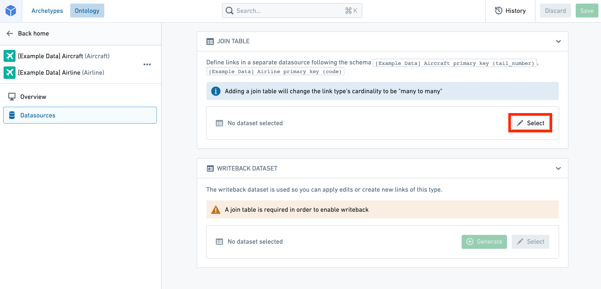

# Edit link types编辑链接类型

Warning警告Editing a link type can have **application-breaking consequences** that can disrupt user workflows. Read the section below on [potential breaking changes](#potential-breaking-changes) **before** proceeding with any link type edits.编辑链接类型可能会导致应用程序崩溃 ，扰乱用户工作流程。在进行任何链接类型编辑前 ，请阅读下方关于可能的重大变更部分。

## Potential breaking changes潜在的突破性变更

### Link type without writeback无写回的链接类型

Changes that require Object Storage V1 (Phonograph) to unregister and reregister the backing datasource of a link type will make the links of that type **unavailable** in user applications during that reindex time; these changes are described below.需要对象存储 V1（留声机）取消并重新注册某一链接类型后备数据源的更改，将使该类型的链接在重新索引期间用户应用程序中不可用 ;这些变化将在下文描述。

The following changes will unregister and reregister (or delete) the backing datasource of a link type when saved:以下更改将在保存链接类型后取消注册并重新注册（或删除）：

- Changing a many-to-many link type’s backing datasource.更改多对多链接类型的后台数据源。
- Changing the cardinality of a link type.改变链接类型的基数。
- Changing the foreign key of a link type.更改链接类型的外键。
- Deleting a link type.删除链接类型。

When you try to save any of these changes, you will be warned about the potential impact on user applications.当你尝试保存这些更改时，系统会提醒你可能对用户应用产生影响。

For example, if a link type is used in a search around in a Workshop application, that Workshop application will be broken until the reindex completes. You can track the progress of the reindex for a link type in the **Phonograph** pane of its **Datasources** page.例如，如果在 Workshop 应用中搜索中使用某种链接类型，该 Workshop 应用将被破坏，直到重新索引完成。你可以在该链接类型的重新索引中，在其数据源页面的留声机面板中跟踪进度。

[Learn more about Object Storage V1 (Phonograph).了解更多关于对象存储 V1（留声机）的信息。](/docs/foundry/object-databases/object-storage-v1/)

### Link type with writeback带写回的链接类型

If a link type has writeback enabled, extra precaution should be taken when making edits to that link type. The history of edits made to a link type are stored in Object Storage V1 (Phonograph). Every time a writeback dataset is built, the history of edits is reapplied to get the final state of edited links in the writeback dataset. When the backing datasource of a link type is unregistered from Object Storage V1 (Phonograph), the history of edits in Objects Storage V1 (Phonograph) is deleted and future builds of the writeback dataset will fail.如果某种链接类型已启用写回，编辑该链接类型时应格外小心。对链接类型的编辑历史存储在对象存储 V1（留声机）中。每次构建写回数据集时，编辑历史都会重新应用，以获得写回数据集中编辑链接的最终状态。当某类链接类型的支持数据源从对象存储 V1（留声机）中取消注册时，对象存储 V1（留声机）中的编辑历史将被删除，且未来写回数据集的构建将失败。

In addition to the changes that require unregistering that were listed in the [previous section](#link-type-without-writeback), unregistering is required for link types with writeback when schema changes are made to **any** column of a backing datasource to a link type that has **ever** received edits, even if does not currently receive edits. Schema changes include changes to the name and base type of the column.除了前节列出的需要取消注册的更改外，当对支持数据源中任何列进行模式变更时，即使该链接类型目前未接受编辑，也要求取消注册。 模式变更包括列的名称和基类型的变化。

Warning警告Object Storage V1 (Phonograph) will **not** automatically unregister the backing datasource of a link type in response to one of these schema changes. Instead, the reindex will fail and will only succeed if the saved schema changes are undone, or if you manually unregister and reregister the backing datasource of a link type in the Phonograph pane of the link type’s Datasources page.对象存储 V1（留声机） 不会在响应这些模式变更时自动取消注册链路类型的后台数据源。相反，重新索引将失败，只有在已保存的模式更改被撤销，或者你手动取消注册并重新注册该链接类型后备数据源时，才会成功。

When you try to save any changes that risk erasing the edits history, you will be warned about the potential impact on edits.当你尝试保存任何可能删除编辑历史的更改时，系统会提醒你可能对编辑产生影响。

Now that you understand the considerations in editing existing link types, you can safely make your changes.既然你已经了解了编辑现有链接类型的注意事项，就可以放心地进行修改了。

## Edit an existing link type编辑现有链接类型

- [Navigate to an existing link type导航到已有的链接类型](#navigate-to-an-existing-link-type)
- [Delete a link type删除链接类型](#delete-a-link-type)
- [Change a backing datasource更改一个支持数据源](#change-a-backing-datasource)
- [Edit a link type’s metadata编辑链接类型的元数据](#edit-a-link-types-metadata)

### Navigate to an existing link type导航到已有的链接类型

You can always change the link type you are working on by selecting the link type page from the home page sidebar and selecting a different link type from the list. You can also always search for a new link type in the search bar in the application header. Read more about [navigation](/docs/foundry/ontology-manager/navigation/).你总可以通过在主页侧边栏选择链接类型页面，然后从列表中选择不同的链接类型来更改你正在制作的链接类型。你也可以在应用头的搜索栏里搜索新的链接类型。阅读更多关于导航的信息。

### Delete a link type删除链接类型

You can delete an object type by selecting the 

 (three dots) icon at the top right of the link type view sidebar (see image below) and then selecting the **Delete** option from the dropdown. A dialog will pop up to confirm you want to stage the link type for deletion.你可以通过点击链接类型视图侧边栏右上角的  （三点）图标（见下图）然后从下拉菜单中选择删除选项来删除某个对象类型。会弹出一个对话框确认你是否想暂停链接类型删除。

- Note that the deletion of the link type only takes effect after you save your changes, and will break any views or applications referencing the object type.注意，链接类型的删除仅在保存更改后生效，且会破坏任何引用该对象类型的视图或应用。
- Note that link types with an `active` status cannot be deleted. Read more about [statuses](/docs/foundry/object-link-types/metadata-statuses/).请注意，处于活跃状态的链接类型无法删除。阅读更多关于状态的信息 。

### Change a backing datasource更改一个支持数据源

You can change a backing datasource:你可以更改备份数据源：

1. Navigate to the **Datasources** page of the link type view.请访问链接类型视图中的 “数据源 ”页面。
2. Select the 

 **Select** icon next to the existing datasource. This will allow you to browse and select available datasources in Foundry.选择现有数据源旁的  “选择 ”图标。这样你就可以在 Foundry 中浏览和选择可用的数据源。

Warning警告Changing the backing datasource of a link type will remove any connection between columns in the old datasource and the keys that define your link type. Keys will be automatically remapped for you **only if** you change to a new datasource with the **same schema** as the old datasource. Otherwise, you will need to remap the keys to the new datasource.更改链接类型的后台数据源会移除旧数据源中与定义链接类型的键之间的任何关联。 只有当你切换到与旧数据源模式相同的新数据源时，密钥才会自动重新映射。否则，你需要将密钥重新映射到新的数据源。

### Edit a link type’s metadata编辑链接类型的元数据

1. **Status:** Select the existing status at the top of the link type pane to open a dropdown of available statuses. Select from the `deprecated`, `experimental`, and `active` statuses.
状态： 在链接类型面板顶部选择现有状态，打开可用状态下拉菜单。 从已弃用 、 实验和活跃状态中选择。- Read more about [statuses](/docs/foundry/object-link-types/metadata-statuses/).阅读更多关于状态的信息 。
  - Read more about [statuses](/docs/foundry/object-link-types/metadata-statuses/).阅读更多关于状态的信息 。
  
  2. **Key:** Select from the dropdowns to change foreign keys, or column mappings in a many-to-many link type.
说明： 从下拉菜单中选择更改外键或多对多链接类型的列映射。- Note that in a link type with many-to many cardinality, the columns in the backing datasource must map to the primary keys of the object types. If the type of the primary key property of the object type is not the same as the type of the column it is being mapped to in the link type’s backing datasource, an error will prevent you from saving.注意，在多对多基数的链路类型中，后台数据源中的列必须映射到对象类型的主键。如果对象类型的主键属性类型与链接类型后盾数据源中映射的列类型不相同，会出现错误，将阻止保存。
- In a link type with any other cardinality, the application requires that the key of one of the object types must map to the Primary key of that object type, ensuring that the “one” side of the Cardinality is unique.在具有其他基数的链路类型中，应用程序要求其中一个对象类型的键必须映射到该对象类型的主键，确保基数的“一侧”是唯一的。
  - Note that in a link type with many-to many cardinality, the columns in the backing datasource must map to the primary keys of the object types. If the type of the primary key property of the object type is not the same as the type of the column it is being mapped to in the link type’s backing datasource, an error will prevent you from saving.注意，在多对多基数的链路类型中，后台数据源中的列必须映射到对象类型的主键。如果对象类型的主键属性类型与链接类型后盾数据源中映射的列类型不相同，会出现错误，将阻止保存。
  - In a link type with any other cardinality, the application requires that the key of one of the object types must map to the Primary key of that object type, ensuring that the “one” side of the Cardinality is unique.在具有其他基数的链路类型中，应用程序要求其中一个对象类型的键必须映射到该对象类型的主键，确保基数的“一侧”是唯一的。
  
  3. **API name:** Select into the existing API name to change its value.
API 名称： 选择进入现有的 API 名称以更改其值。- Note that you cannot change the API name for link types with an `active` status.
请注意，对于处于活跃状态的链接类型，你不能更改 API 名称。- Read more about [statuses](/docs/foundry/object-link-types/metadata-statuses/).阅读更多关于状态的信息 。
- Read more about [valid API names](/docs/foundry/object-link-types/create-object-type/#configure-api-names).阅读更多关于有效 API 名称的信息。
  - Read more about [statuses](/docs/foundry/object-link-types/metadata-statuses/).阅读更多关于状态的信息 。
  - Read more about [valid API names](/docs/foundry/object-link-types/create-object-type/#configure-api-names).阅读更多关于有效 API 名称的信息。
  - Note that you cannot change the API name for link types with an `active` status.
  请注意，对于处于活跃状态的链接类型，你不能更改 API 名称。- Read more about [statuses](/docs/foundry/object-link-types/metadata-statuses/).阅读更多关于状态的信息 。
  - Read more about [valid API names](/docs/foundry/object-link-types/create-object-type/#configure-api-names).阅读更多关于有效 API 名称的信息。
    - Read more about [statuses](/docs/foundry/object-link-types/metadata-statuses/).阅读更多关于状态的信息 。
    - Read more about [valid API names](/docs/foundry/object-link-types/create-object-type/#configure-api-names).阅读更多关于有效 API 名称的信息。
    
    
  4. **Visibility:** Check the visibility from the link visibility list. A `prominent` link type will prompt applications to show this link type first to users. A `hidden` link type will not appear in user applications.能见度： 查看链接可见性列表中的可见性。显著的链接类型会提示应用程序首先向用户展示该链接类型。 隐藏链接类型不会出现在用户应用程序中。
5. **Type classes:** Apply type classes as additional metadata that can be interpreted by applications.
类型类别： 应用类型类作为应用程序可以解释的额外元数据。- Consult the [list of available type classes](/docs/foundry/object-link-types/metadata-typeclasses/) for more information.更多信息请参阅可用类型类别列表 。
  - Consult the [list of available type classes](/docs/foundry/object-link-types/metadata-typeclasses/) for more information.更多信息请参阅可用类型类别列表 。
  
  
