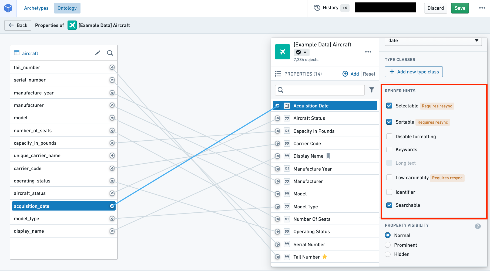

# Render hints渲染提示

Foundry uses **render hints** to communicate information about the use of Ontology [properties](/docs/foundry/object-link-types/properties-overview/) to [Object Storage V1 (Phonograph)](/docs/foundry/object-databases/object-storage-v1/) and user applications in the platform. For example, the `sortable` render hint on a string property tells applications to allow users to sort on that property, as in a timeline or a chart.Foundry 使用渲染提示向对象存储 V1（留声机） 和平台用户应用传达关于本体属性使用的信息。例如，字符串属性上的可排序渲染提示告诉应用程序允许用户对该属性进行排序，比如时间线或图表。

Many render hints are tied to reindex performance for an object type. For instance, you can use render hints to indicate to [Object Storage V1 (Phonograph)](/docs/foundry/object-databases/object-storage-v1/) that a property doesn’t need to be aggregated or sorted in applications, so that Object Storage V1 has less work to do when indexing those properties.许多渲染提示与对象类型的重新索引性能相关。例如，你可以用渲染提示向对象存储 V1（留声机） 提示某个属性不需要在应用中聚合或排序，这样对象存储 V1 在索引这些属性时的工作量会减少。

You can select and deselect render hints in the properties pane of the property editor (see image below).你可以在属性编辑器的属性面板中选择和取消渲染提示（见下方图片）。

The following table shares the **Name** and **Description** for each of the available render hints. The table also provides information on two technical aspects of render hints: "Adds raw index?" and "Requires reindex?" (described below).下表列出了每种可用渲染提示的名称和描述 。表格还提供了渲染提示的两个技术方面的信息：“添加原始索引吗？”和“需要重新索引吗？”（下文将详细说明）

- **Adds raw index?添加原始索引？**
- In order to apply a render hint that adds a raw index, Object Storage V1 (Phonograph) stores the render hint information by creating another index when storing the backing dataset.为了应用添加原始索引的渲染提示，Object Storage V1（留声机）通过在存储备份数据集时创建另一个索引来存储渲染提示信息。
- Because of this additional index, for the property with a render hint applied, two columns will be counted toward the total number of columns indexed into Object Storage V1 (Phonograph).由于该额外索引，对于应用渲染提示的属性，两列将计入对象存储 V1（留声机）索引的总列数。
- This explains why deselecting these render hints improves performance of reindex into Object Storage V1 (Phonograph).这也解释了为什么取消选择这些渲染提示能提升重新索引到对象存储 V1（留声机）的表现。
  - In order to apply a render hint that adds a raw index, Object Storage V1 (Phonograph) stores the render hint information by creating another index when storing the backing dataset.为了应用添加原始索引的渲染提示，Object Storage V1（留声机）通过在存储备份数据集时创建另一个索引来存储渲染提示信息。
  - Because of this additional index, for the property with a render hint applied, two columns will be counted toward the total number of columns indexed into Object Storage V1 (Phonograph).由于该额外索引，对于应用渲染提示的属性，两列将计入对象存储 V1（留声机）索引的总列数。
  - This explains why deselecting these render hints improves performance of reindex into Object Storage V1 (Phonograph).这也解释了为什么取消选择这些渲染提示能提升重新索引到对象存储 V1（留声机）的表现。
  
  - **Requires reindex?需要重新索引吗？**
- Some render hints will be immediately applied in user applications as soon as their selection is saved in the Ontology Manager.部分渲染提示一旦在本体管理器中保存，将立即应用到用户应用程序中。
- For other render hints that require a reindex, the object type's backing datasources must be reindexed into Objects Storage V1 (Phonograph) before the changes will be reflected in user applications.对于需要重新索引的其他渲染提示，必须将对象类型的后备数据源重新索引到 Objects Storage V1（留声机），然后更改才会反映在用户应用程序中。
- You can wait for the next triggered reindex or you can manually start the reindex by navigating to the **Datasources** tab of the object type and selecting the blue **Reindex** button in the **Phonograph** pane.你可以等待下一次触发的重新索引，或者手动开始重新索引，方法是进入对象类型的 Datasources 标签，选择留声机面板中的蓝色重新索引按钮。
  - Some render hints will be immediately applied in user applications as soon as their selection is saved in the Ontology Manager.部分渲染提示一旦在本体管理器中保存，将立即应用到用户应用程序中。
  - For other render hints that require a reindex, the object type's backing datasources must be reindexed into Objects Storage V1 (Phonograph) before the changes will be reflected in user applications.对于需要重新索引的其他渲染提示，必须将对象类型的后备数据源重新索引到 Objects Storage V1（留声机），然后更改才会反映在用户应用程序中。
  - You can wait for the next triggered reindex or you can manually start the reindex by navigating to the **Datasources** tab of the object type and selecting the blue **Reindex** button in the **Phonograph** pane.你可以等待下一次触发的重新索引，或者手动开始重新索引，方法是进入对象类型的 Datasources 标签，选择留声机面板中的蓝色重新索引按钮。
  
  

| Name名称 | Description描述 | Adds raw index?添加原始索引？ | Requires reindex?需要重新索引吗？ |
| --- | --- | --- | --- |
| Disable formatting禁用格式化 | - **Enable** if property values should not be formatted in Object Views according to a browser location’s local numerical formatting standards.- 如果对象视图中的属性值不应按照浏览器位置的本地数值格式标准进行格式化， 则启用 。 |  |  |
| Identifier标识符 | - **Enable** to improve reindex performance and specify primary keys and foreign keys that have a numerical base type and don’t need to be formatted or treated as numbers. -  能够提升重新索引性能，并指定具有数值基类型的主键和外键，无需格式化或视为数字。
    - For example, Object Views won’t format the property values as numbers and Object Explorer won’t enable filtering the keys by a range.- 例如，Object View 不会将属性值格式化为数字，Object Explorer 也无法启用按范围过滤键的功能。 |  |  |
| Keywords关键词 | - **Enable** to highlight this property in its own section when displaying properties in Object Views.- 在对象视图中显示该属性时 ，启用在单独的部分高亮该属性。 |  |  |
| Long text长文 | - **Enable** if property values contains a large amount of text. - 如果属性值包含大量文本， 则启用 。
    - For example, Object Views will display this property’s values in a more readable format.- 例如，对象视图会以更易读的格式显示该属性的值。 |  |  |
| Low cardinality低基数 | - **Enable** to indicate to applications that there are not many possible values for this property. -  启用以指示应用程序该属性的可能值不多。
    - For example, some Object View widgets will only allow filtering on properties with not many possible values. - 例如，一些对象视图小部件只允许对可能值不多的属性进行过滤。
- The Searchable render hint **must also be selected** along with Low cardinality.-  还必须选择可搜索渲染提示和低基数。 | yes是的 | yes是的 |
| Selectable可选 | - **Enable** on string properties to allow users to perform aggregations on this property. -  启用字符串属性，允许用户对该属性进行聚合。
    - For example, this property will be aggregated in Object Explorer histograms and Object View charts. - 例如，该属性会被聚合在对象浏览器直方图和对象视图图表中。
- **Enable** on numeric and date properties to allow users to perform aggregation on exact term values and not only distributions. -  支持数字和日期属性，允许用户对准确的条款价值进行聚合，而不仅仅是分布。
- **Disable** to improve reindex performance if the property will not be aggregated in applications. -  禁用以提升重新索引性能，如果该属性在应用程序中不会被聚合。
- **Enable** to use the Exact Match filter capability. -  启用精确匹配滤波功能。
- The Searchable render hint **must also be selected** along with Selectable.-  还必须选择可搜索渲染提示和可选择。 | yes是的 | yes是的 |
| Sortable可排序 | - **Enable** on string properties to allow users to sort on this property. -  启用字符串属性，允许用户在此属性上排序。
    - Numeric and date properties are always sortable. - 数值和日期属性总是可排序的。
    - For example, timelines and charts in Object Views will be sorted on this property. - 例如，对象视图中的时间线和图表会在此属性上排序。
- **Disable** to improve reindex performance if the property will not be sorted on in applications. -  禁用以提升重新索引性能，如果该属性在应用程序中不会被排序。
- **Not recommended for arrays**, which will sort based on the minimum value in the array. -  不建议用于数组 ，因为数组会根据数组中的最小值进行排序。
- The Searchable render hint **must also be selected** along with Sortable.-  还必须选择可搜索渲染提示和可排序。 | yes是的 | yes是的 |
| Searchable可检索 | - **Disable** to improve reindex performance if the property will not be searched or sorted on in applications. -  禁用以提升重新索引性能，如果该属性在应用程序中不会被搜索或排序。
    - The performance improvements will be especially significant if the property contains large strings. - 如果属性包含大字符串，性能提升尤为显著。
- Searchable **must be selected** in order for applications to apply the Selectable, Sortable, or Low cardinality render hints.-  必须选择可搜索，应用程序才能应用可选、可排序或低基数的渲染提示。 | yes是的 | yes是的 |

