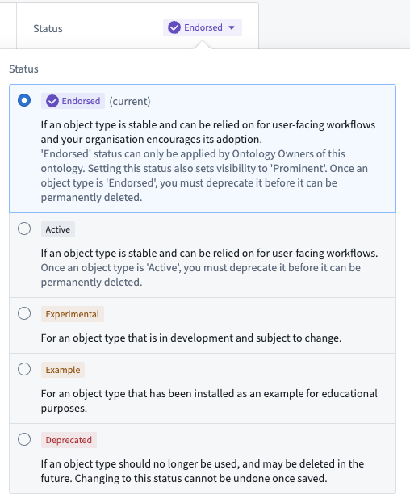

# Statuses状态

Every object type, property, link type, action, or interface in the Ontology has a **status** that indicates developmental state. An ontological resource's status can be either active, experimental, deprecated, or example. Status metadata helps Ontology-editing users to know what resources are being actively relied on by user applications. These statuses are viewable in [**Object Explorer**](/docs/foundry/object-explorer/overview/), [**Object Views**](/docs/foundry/object-views/overview/), and [**Workshop**](/docs/foundry/workshop/overview/) to provide more information about which object types are intended for use in user applications.本体中的每个对象类型、属性、链接类型、动作或接口都有表示开发状态的状态 。本体资源的状态可以是活跃的、实验性的、弃用的或示例。状态元数据帮助本体编辑用户了解用户应用程序正在积极依赖哪些资源。这些状态可在对象资源管理器 、 对象视图和工作坊中查看，以提供关于用户应用中拟使用的对象类型的更多信息。

The status can take on one of four values:该身份可以具有以下四种价值之一：

## Available Status Values可用状态值

- **Active:** Indicates that the resource is actively in use in user-facing applications and major breaking changes will not be made in the Ontology Manager.活跃状态： 表示该资源正在面向用户的应用程序中被积极使用，且本体管理器中不会进行重大破坏性更改。
- **Experimental:** Indicates that the resource is still under development. Changes may be made that make the experimental item unavailable in user facing applications.实验性： 表明该资源仍在开发中。可能会做出修改，使实验性项目在面向用户的应用程序中无法使用。
- **Deprecated:** Indicates that the resource will soon be deleted. The deprecated item should not be relied on in user facing applications.
弃用： 表示该资源即将被删除。该弃用项目不应依赖于面向用户的应用程序。- A deprecated resource also has metadata that includes:
弃用资源还包含包括：- A description for why it is being deprecated;说明为何该软件被弃用;
- A deadline for when it is expected to be deleted from the system; and一个预计从系统中删除的截止日期;以及
- The resource that is meant to replace the one that is deprecated.那个资源本应替代已被弃用的资源。
  - A description for why it is being deprecated;说明为何该软件被弃用;
  - A deadline for when it is expected to be deleted from the system; and一个预计从系统中删除的截止日期;以及
  - The resource that is meant to replace the one that is deprecated.那个资源本应替代已被弃用的资源。
  - A deprecated resource also has metadata that includes:
  弃用资源还包含包括：- A description for why it is being deprecated;说明为何该软件被弃用;
  - A deadline for when it is expected to be deleted from the system; and一个预计从系统中删除的截止日期;以及
  - The resource that is meant to replace the one that is deprecated.那个资源本应替代已被弃用的资源。
    - A description for why it is being deprecated;说明为何该软件被弃用;
    - A deadline for when it is expected to be deleted from the system; and一个预计从系统中删除的截止日期;以及
    - The resource that is meant to replace the one that is deprecated.那个资源本应替代已被弃用的资源。
    
    
  - **Example:** Indicates that the resource has been installed as an example. Example resources are notional and are only suitable for trainings or early-stage, exploratory use. Examples are *not* intended for use in production workflows.示例： 表示该资源已被安装，作为示例。示例资源是概念性的，仅适合培训或早期探索性使用。示例不适用于生产工作流程。
- **[Beta] Endorsed (object types only):** Indicates that the object type is a core, trusted resource that has been vetted by an ontology owner. `Endorsed` object types inherit similar protections as `active` object types for API names.[测试版] 认可（仅对象类型）： 表示对象类型是经过本体所有者审核的核心、可信资源。 授权对象类型继承了与主动对象类型类似的 API 名称保护。

### `Endorsed` status (object types only)认可状态（仅对象类型）

Beta贝塔The `endorsed` status for object types is in beta and may only be available in specific enrollments. Contact your Palantir representative for access.对象类型的认可状态目前处于测试阶段，可能仅在特定注册中提供。请联系您的 Palantir 代表以获取访问权限。

Object types support a special `endorsed` status to signify a higher level of trust and official standing within the ontology. This status, represented by a new colored checkmark icon, helps users differentiate core, reusable object types from more use-case-specific or experimental ones.对象类型支持特殊的认可状态，以表示本体中更高层级的信任和官方地位。这一状态以新的彩色勾选图标表示，帮助用户区分核心、可重复使用的对象类型与更具体的用例特定或实验性对象类型。

The `endorsed` status provides prominence beyond the standard `active` status. An object type with this status is meant to be considered a "core" resource, held to high standards and managed by a central team. `Endorsed` object types inherit similar operational protections of the `active` status, such as restrictions on deletion.背书身份赋予了超越标准现役身份的显著性。具有此状态的对象类型应被视为“核心”资源，受高标准约束并由中央团队管理。 认可对象类型继承了激活状态的类似作保护，例如删除限制。

Key characteristics of the `endorsed` status include:认可身份的主要特征包括：

- **Scope:** The `endorsed` status applies only to object types. It is not available for properties, link types, action types or interfaces.范围： 认可状态仅适用于对象类型。它不适用于属性、链接类型、动作类型或接口。
- **Visibility:** Setting an object type's status to `endorsed` will automatically set its visibility to `prominent`, increasing its discoverability across the platform. Users can optionally move all properties of the object type to `active` status.能见度： 将对象类型状态设置为 “认可” 会自动将其可见性设置为显著 ，从而提升其在整个平台上的可发现性。用户可以选择将该对象类型的所有属性都移至活跃状态。
- **Permissions:权限：**
- Only users with the `Ontology Owner` role on the ontology level can directly apply the `endorsed` status.只有在本体层级拥有本体所有者角色的用户才能直接应用认可状态。
- Other users must submit a proposal for review and approval by an `Ontology Owner` on the ontology level to apply the status.其他用户必须提交提案，由本体层级的本体所有者审核和批准以应用状态。
  - Only users with the `Ontology Owner` role on the ontology level can directly apply the `endorsed` status.只有在本体层级拥有本体所有者角色的用户才能直接应用认可状态。
  - Other users must submit a proposal for review and approval by an `Ontology Owner` on the ontology level to apply the status.其他用户必须提交提案，由本体层级的本体所有者审核和批准以应用状态。
  
  

## Operations that are not allowed不允许的作

Given that applications rely on ontological resources, there are several potentially destructive operations that are not allowed when a resource has the status `active`:鉴于应用程序依赖本体资源，当资源状态为激活时，有若干潜在破坏性的作是不允许的：

- It cannot be deleted. A resource’s status must be `experimental` or `deprecated` before it can be deleted.它无法删除。资源的状态必须是实验性或弃用状态，才能被删除。
- The API name of an active resource cannot be changed. Changing an API name is only possible for those marked as `experimental`.活动资源的 API 名称不能更改。更改 API 名称仅适用于标记为实验性的用户。

## Edit a status编辑状态

By default, any new ontological resource will be given the `experimental` status. To change the status:默认情况下，任何新的本体资源都会被赋予实验状态。更改状态：

1. Select the dropdown next to the current status.选择当前状态旁的下拉菜单。
2. Select the new status.选择新状态。

When changing a resource to the `deprecated` status, you will be prompted to:当将资源更改为弃用状态时，您将被提示：

- Fill out a description for why it is being deprecated,请填写说明该软件被弃用的原因，
- Input a deadline for when you expect it to be deleted from the system, and输入一个预计从系统中删除的截止日期，
- Optionally, select a resource that is meant to replace the one you are deprecating.可选地，选择一个旨在替代你正在淘汰的资源。

These statuses are viewable in Object Explorer, Object Views, and Workshop to provide more information about which object types are intended for use in user applications.这些状态可在对象资源管理器、对象视图和工作坊中查看，以提供关于用户应用中拟使用的对象类型的更多信息。

The Ontology Manager ensures status consistency between an object type and its related properties or link types. For example, if an object type is changed from `active` to `experimental`, all of its properties will be marked `experimental` as well.本体管理器确保对象类型与其相关属性或链接类型之间的状态一致性。例如，如果一个对象类型从主动变为实验 ，其所有属性也会被标记为实验 。

The table below indicates available statuses for a link type between object types of different statuses. In general:下表显示了不同状态对象类型之间链路类型的可用状态。总体来说：

- If at least one object type in a link type is changed to `experimental`, the link type will automatically be changed to `experimental`.如果链接类型中至少有一个对象类型被更改为实验性，该链接类型将自动更改为实验性。
- If at least one object type in a link type is changed to `example`, the link type will automatically be changed to `example`.如果链接类型中至少有一个对象类型被更改为示例 ，链接类型将自动切换为示例 。
- If at least one object type in a link type is changed to `deprecated`, the link type will automatically be changed to `deprecated`.如果链接类型中至少有一个对象类型被更改为弃用 ，该链接类型将自动被改为弃用 。

| *If object type A is…如果对象类型 A 是......* | and object type B is…对象类型 B 为...... |
| --- | --- |
|  | EXPERIMENTAL |
| *EXPERIMENTAL* | experimental only仅限实验性 |
| *ACTIVE* | experimental only仅限实验性 |
| *DEPRECATED* | deprecated only仅被弃用 |

The same requirements are true of foreign keys of a link type. The application will change the status of a link type when changing a property:链路类型的外键也同样要求。应用程序在更改属性时会更改链接类型的状态：

- If a foreign key property is changed to `experimental`, its link type will be changed to `experimental`.如果外键属性被更改为实验性，其链路类型也会变为实验性 。
- If a foreign key property is changed to `example`, its link type will be changed to `example`.如果外键属性被更改为示例 ，其链接类型也会被更改为示例 。
- If a foreign key property is changed to `deprecated`, its link type will be changed to `deprecated`.如果外键属性被更改为弃用，其链路类型也会被弃用 。

The application changes statuses in order to prevent invalid states. If a foreign key property is `experimental` and still being developed, its link type shouldn't be marked `active` and be relied on in production. In contrast, when marking a property `active`, the application won't change a link type referencing the property as its foreign key to `active`, as it is valid for a foreign key property to be in production, while the link type and its backing datasource are still in development.应用程序会更改状态以防止无效状态。如果外键属性处于实验阶段且仍在开发中，其链路类型不应被标记为活跃 ，也不应在生产环境中依赖它。相比之下，在标记属性为激活时，应用程序不会将引用该属性作为外键的链接类型更改为激活 ，因为外键属性在生产中是有效的，而链接类型及其支持数据源仍在开发中。

## Bulk edit statuses批量编辑状态

### Properties性质

When changing an object type from `experimental` to `active`, there is the option to also apply the `active` status to all properties on the object type:当将对象类型从实验性切换为激活时，也可以选择将激活状态应用于该对象类型上的所有属性：

When you change an object type to `example`, all of its properties will automatically become `example` also.当你将对象类型改为示例时，它的所有属性也会自动变成示例 。

Statuses across properties of an object type can also be edited in bulk from the **Properties** page of the object type. [Read more about bulk editing properties.](/docs/foundry/object-link-types/edit-properties/#bulk-edit-multiple-properties)对象类型属性间的状态也可以从该对象类型的属性页面批量编辑。 阅读更多关于批量编辑属性的信息。

### Object types对象类型

Statuses across object types can also be edited in bulk from the home page object view page by selecting the checkboxes of the object types to edit and selecting the **Edit status** button at the top right of the table.跨对象类型状态也可以通过主页对象视图页面批量编辑，方法是选择要编辑对象类型的复选框，并点击表格右上角的编辑状态按钮。

## Troubleshooting故障 排除

### Conflicts between property status and link type status财产状态与链接类型状态之间的冲突

If you receive the error `OntologyMetadata:ConflictBetweenLinkTypeStatusAndPropertyTypeStatus`, there is a conflict between the status on a link type and the status on a property. For example, if a foreign key is `deprecated`, link types that reference that foreign key should also be `deprecated`.如果你收到错误 OntologyMetadata:ConflictBetweenLinkTypeStatusAndPropertyTypeStatus ，说明链接类型的状态和属性的状态之间存在冲突。例如，如果外键被弃用 ，引用该外键的链接类型也应被弃用 。

### Conflicts between object type status and link type status对象类型状态与链接类型状态之间的冲突

If you receive the error `OntologyMetadata:ConflictBetweenLinkTypeStatusAndObjectTypeStatus`, there is a conflict between the status on a link type and the status of one of its associated object types. This can happen when there is an invalid object type-link type case according to the table above. For example, an `experimental` object type cannot have an `active` link type.如果你收到错误 OntologyMetadata:ConflictBetweenLinkTypeStatusAndObjectTypeStatus ，说明链接类型的状态与其关联对象类型中的状态之间存在冲突。根据上表，当存在无效的对象类型-链接类型时，就会发生这种情况。例如， 实验对象类型不能有活跃链接类型。

